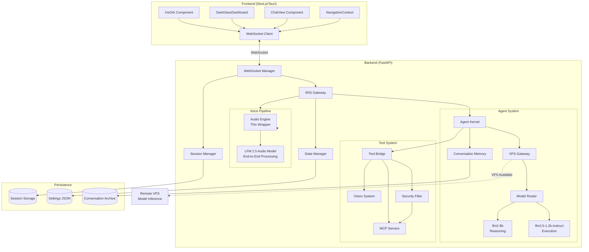

# Design Document: IRISVOICE Backend Integration

## Overview

This design document specifies the technical architecture for integrating the IRISVOICE backend with the redesigned glassmorphic UI components. The system enables seamless voice and text interaction with an AI assistant through a sophisticated dual-LLM architecture, WebSocket-based real-time communication, and comprehensive MCP tool integration.

The integration connects three primary UI components (IrisOrb, DarkGlassDashboard, ChatView) with a FastAPI backend featuring:
- Dual-LLM system (lfm2-8b for reasoning, lfm2.5-1.2b-instruct for execution)
- VPS Gateway for offloading heavy model inference to remote servers (optional)
- Real-time WebSocket communication with session management
- Voice pipeline powered by LFM 2.5 audio model (end-to-end audio-to-audio processing)
- MCP tool bridge providing access to vision, web, file, system, and app automation
- Persistent state management with multi-client synchronization

The design prioritizes low-latency communication (<50ms WebSocket delivery), real-time state synchronization (<100ms), and natural interaction patterns through voice and text modalities.

### LFM 2.5 Audio Model Architecture

**CRITICAL**: The voice system uses the **LFM 2.5 audio model**, an end-to-end audio-to-audio model that handles the complete voice pipeline:

**What LFM 2.5 Handles Internally**:
- Raw audio input capture from microphone
- Raw audio output playback to speakers
- ALL audio processing (noise reduction, echo cancellation, voice enhancement, automatic gain)
- Wake word detection (configurable phrases)
- Voice activity detection (VAD)
- Speech-to-text (STT) transcription
- User-agent communication (understands intent, generates responses)
- Text-to-speech (TTS) synthesis
- Natural conversation flow (turn-taking, interruption handling)

**What the Backend Provides**:
- **AudioEngine**: Thin wrapper (~100 lines) that initializes and manages the LFM 2.5 audio model
- **VoicePipeline**: Orchestrates the LFM 2.5 audio model and manages voice state
- **Configuration**: Passes settings (wake phrase, voice characteristics, speaking rate) to LFM 2.5

**What is NOT Needed**:
- ❌ Separate WakeWordDetector component (LFM 2.5 handles this)
- ❌ Separate VoiceActivityDetector component (LFM 2.5 handles this)
- ❌ Separate TTSManager component (LFM 2.5 handles this)
- ❌ Audio processing pipeline (LFM 2.5 handles this)
- ❌ Device management complexity (LFM 2.5 handles this)

### VPS Gateway Feature

The VPS Gateway is an optional component that enables offloading heavy model inference (lfm2-8b, lfm2.5-1.2b-instruct) to a remote VPS server. This is particularly useful for users with limited local compute resources or those who want to reduce local memory and CPU usage.

**Key Benefits**:
- Reduces local memory usage (models can be 8GB+ each)
- Reduces local CPU/GPU usage during inference
- Enables running IRIS on lower-spec machines
- Maintains full functionality with automatic fallback to local execution
- Supports multiple VPS endpoints with load balancing

**Architecture**:
- Lightweight components remain local (WebSocket, state, voice, UI)
- Heavy components offload to VPS (model loading, inference, optionally tool execution)
- Automatic health monitoring and fallback
- Configurable via settings UI

## Architecture

### System Components



### Communication Flow

The system uses a bidirectional WebSocket protocol for all frontend-backend communication:

1. **Connection Establishment**: Client connects to `ws://localhost:8000/ws/{client_id}`, backend creates or restores session, sends initial state
2. **Message Routing**: IRIS Gateway routes incoming messages to appropriate handlers (State Manager, Agent Kernel, Voice Pipeline)
3. **State Synchronization**: State Manager broadcasts updates to all clients in the same session within 100ms
4. **Agent Processing**: Agent Kernel coordinates dual-LLM system via VPS Gateway (remote or local), streams responses back
5. **Voice Processing**: Voice Pipeline orchestrates the LFM 2.5 audio model for end-to-end audio-to-audio processing (capture, wake word, VAD, STT, conversation, TTS, playback)
6. **VPS Gateway**: Routes model inference to remote VPS when configured and available, falls back to local execution when VPS is unavailable

### VPS Gateway Architecture

The VPS Gateway enables offloading heavy model inference to a remote VPS server while keeping lightweight components local:

**Local Components** (remain on user's machine):
- WebSocket Manager: Real-time communication with frontend
- Session Manager: Session lifecycle and state isolation
- State Manager: Settings persistence and synchronization
- Voice Pipeline: Audio capture, wake word detection, VAD, TTS
- UI Components: IrisOrb, DarkGlassDashboard, ChatView

**Remote Components** (offloaded to VPS):
- Model Loading: lfm2-8b (reasoning), lfm2.5-1.2b-instruct (execution)
- Model Inference: Text generation, reasoning, planning
- Tool Execution: MCP tool calls (optional, configurable)

**Communication Protocol**:
- REST API or WebSocket between local backend and VPS
- Request serialization: JSON payload with prompt, context, parameters, model selection
- Response deserialization: JSON payload with generated text, tool calls, metadata
- Authentication: Bearer token or API key in request headers
- Timeout: Configurable (default 30 seconds)

**Fallback Strategy**:
- VPS health checks every 60 seconds
- Automatic fallback to local execution when VPS unavailable
- Automatic resume to VPS when health check succeeds
- Graceful degradation: System remains functional in local-only mode

**Load Balancing** (optional):
- Support for multiple VPS endpoints
- Round-robin or least-loaded routing
- Per-endpoint health tracking
- Automatic removal of failed endpoints from rotation

### Session Architecture

Sessions provide state isolation and multi-client support:

- Each WebSocket connection is associated with a session ID
- Sessions persist state to JSON files in `backend/settings/`
- Multiple clients can connect to the same session (multi-window support)
- Sessions remain active for 24 hours after last client disconnects
- State updates are broadcast to all clients in the session

## Components and Interfaces

### WebSocket Message Protocol

All messages follow a consistent JSON structure:

```typescript
interface Message {
  type: string;
  payload: Record<string, any>;
}
```

#### Client → Server Messages

**Connection & Navigation**
- `select_category`: Switch to a settings category
  - Payload: `{ category: "voice" | "agent" | "automate" | "system" | "customize" | "monitor" }`
- `select_subnode`: Activate a subnode within a category
  - Payload: `{ subnode_id: string }`
- `go_back`: Navigate to previous view
  - Payload: `{}`

**Settings Management**
- `update_field`: Update a field value
  - Payload: `{ subnode_id: string, field_id: string, value: any }`
- `update_theme`: Update theme colors
  - Payload: `{ glow_color?: string, font_color?: string, state_colors?: object }`
- `confirm_mini_node`: Confirm a mini-node configuration
  - Payload: `{ subnode_id: string, values: Record<string, any> }`

**Voice Interaction**
- `voice_command_start`: Begin voice recording
  - Payload: `{}`
- `voice_command_end`: Stop voice recording and process
  - Payload: `{}`

**Text Interaction**
- `text_message`: Send text message to agent
  - Payload: `{ text: string }`
- `clear_chat`: Clear conversation history
  - Payload: `{}`

**Status Queries**
- `get_agent_status`: Request agent status
  - Payload: `{}`
- `get_agent_tools`: Request available tools
  - Payload: `{}`

#### Server → Client Messages

**Connection & State**
- `initial_state`: Full state sent on connection
  - Payload: `{ state: IRISState }`
- `backend_ready`: Backend initialization complete
  - Payload: `{ timestamp: string }`

**Navigation Confirmation**
- `category_changed`: Category switch confirmed
  - Payload: `{ category: string, subnodes: SubNode[] }`
- `subnode_changed`: Subnode switch confirmed
  - Payload: `{ subnode_id: string }`

**Settings Updates**
- `field_updated`: Field update confirmed
  - Payload: `{ subnode_id: string, field_id: string, value: any, valid: boolean }`
- `theme_updated`: Theme update confirmed
  - Payload: `{ active_theme: ColorTheme }`
- `mini_node_confirmed`: Mini-node confirmed with orbit position
  - Payload: `{ subnode_id: string, orbit_angle: number }`

**Voice State**
- `listening_state`: Voice state changed
  - Payload: `{ state: "idle" | "listening" | "processing_conversation" | "processing_tool" | "speaking" | "error" }`
- `wake_detected`: Wake word detected
  - Payload: `{ phrase: string, confidence: number }`
- `audio_level`: Audio level update (during listening)
  - Payload: `{ level: number }` (0.0 to 1.0)

**Agent Responses**
- `text_response`: Agent text response
  - Payload: `{ text: string, sender: "assistant" }`
- `agent_status`: Agent status information
  - Payload: `{ ready: boolean, models_loaded: number, total_models: number, tool_bridge_available: boolean, model_status: object }`
- `agent_tools`: Available tools list
  - Payload: `{ tools: Tool[] }`
- `tool_result`: Tool execution result
  - Payload: `{ tool_name: string, result: any, error?: string }`

**Errors**
- `validation_error`: Field validation failed
  - Payload: `{ field_id: string, error: string }`
- `voice_command_error`: Voice processing failed
  - Payload: `{ error: string }`
- `error`: General error
  - Payload: `{ message: string }`

### Frontend Components

#### IrisOrb Component

The central orb visualizes voice states and handles user interaction:

**Props**
```typescript
interface IrisOrbProps {
  voiceState: VoiceState;
  glowColor: string;
  audioLevel: number;
  onDoubleClick: () => void;
  onSingleClick: () => void;
}

type VoiceState = "idle" | "listening" | "processing_conversation" | "processing_tool" | "speaking" | "error";
```

**Visual States**
- `idle`: Base glow, 1.0x scale, no animation
- `listening`: 1.15x scale, active glow color, audio level animation
- `processing_conversation`: 1.08x scale, purple (#7000ff) glow, pulse animation
- `processing_tool`: 1.08x scale, purple (#7000ff) glow, pulse animation
- `speaking`: 1.1x scale, active glow color, audio jitter animation
- `error`: Red glow, shake animation, error message overlay

**Interaction**
- Double-click: Start voice recording (send `voice_command_start`)
- Single-click during listening: Stop recording (send `voice_command_end`)
- Wake word detected: Automatically start recording with flash animation

#### DarkGlassDashboard Component

Settings dashboard with 6 main categories and their subnodes:

**Props**
```typescript
interface DarkGlassDashboardProps {
  currentCategory: Category | null;
  currentSubnode: string | null;
  subnodes: SubNode[];
  fieldValues: Record<string, Record<string, any>>;
  activeTheme: ColorTheme;
  onCategorySelect: (category: Category) => void;
  onSubnodeSelect: (subnodeId: string) => void;
  onFieldUpdate: (subnodeId: string, fieldId: string, value: any) => void;
  onConfirm: (subnodeId: string, values: Record<string, any>) => void;
}
```

**Categories**
- `voice`: Input, Output, Processing, Audio Model
- `agent`: Identity, Wake, Speech, Memory
- `automate`: Tools, Vision, Workflows, Favorites, Shortcuts, GUI Automation
- `system`: Power, Display, Storage, Network
- `customize`: Theme, Startup, Behavior, Notifications
- `monitor`: Analytics, Logs, Diagnostics, Updates

**Field Types**
- `text`: Text input
- `slider`: Numeric slider with min/max/step
- `dropdown`: Select from options
- `toggle`: Boolean switch
- `color`: Color picker
- `keyCombo`: Keyboard shortcut capture

**State Management**
- Optimistic updates: UI updates immediately, confirmed by backend
- Validation errors: Revert to previous value, show error message
- Real-time sync: Updates from other clients reflected immediately

#### ChatView Component

Text-based chat interface:

**Props**
```typescript
interface ChatViewProps {
  messages: Message[];
  isTyping: boolean;
  onSendMessage: (text: string) => void;
  onClearChat: () => void;
}

interface Message {
  id: string;
  text: string;
  sender: "user" | "assistant";
  timestamp: Date;
}
```

**Features**
- Message history display with sender identification
- Typing indicator while agent is processing
- Auto-scroll to latest message
- Clear chat button
- Theme-aware styling

#### NavigationContext

React context managing navigation state and WebSocket integration:

**Context Value**
```typescript
interface NavigationContextValue {
  // Connection state
  isConnected: boolean;
  sessionId: string | null;
  
  // Navigation state
  currentCategory: Category | null;
  currentSubnode: string | null;
  subnodes: SubNode[];
  
  // Application state
  fieldValues: Record<string, Record<string, any>>;
  activeTheme: ColorTheme;
  confirmedNodes: ConfirmedNode[];
  
  // Voice state
  voiceState: VoiceState;
  audioLevel: number;
  
  // Agent state
  agentReady: boolean;
  agentTools: Tool[];
  
  // Actions
  selectCategory: (category: Category) => void;
  selectSubnode: (subnodeId: string) => void;
  updateField: (subnodeId: string, fieldId: string, value: any) => void;
  updateTheme: (colors: Partial<ColorTheme>) => void;
  confirmMiniNode: (subnodeId: string, values: Record<string, any>) => void;
  goBack: () => void;
  
  // Voice actions
  startVoiceCommand: () => void;
  endVoiceCommand: () => void;
  
  // Chat actions
  sendMessage: (text: string) => void;
  clearChat: () => void;
  
  // Status queries
  getAgentStatus: () => void;
  getAgentTools: () => void;
}
```

### Backend Components

#### WebSocket Manager

Manages WebSocket connections and session association:

**Class: WebSocketManager**
```python
class WebSocketManager:
    active_connections: Dict[str, WebSocket]
    _session_manager: SessionManager
    _state_manager: StateManager
    
    async def connect(websocket: WebSocket, client_id: str, session_id: Optional[str]) -> Optional[str]
    def disconnect(client_id: str) -> None
    async def send_to_client(client_id: str, message: dict) -> bool
    async def broadcast(message: dict, exclude_clients: Optional[Set[str]]) -> None
    async def broadcast_to_session(session_id: str, message: dict, exclude_clients: Optional[Set[str]]) -> None
    def get_session_id_for_client(client_id: str) -> Optional[str]
```

**Responsibilities**
- Accept WebSocket connections
- Associate clients with sessions
- Route messages to/from clients
- Handle connection failures and reconnection
- Maintain ping/pong heartbeat (30s interval)

#### Session Manager

Manages user sessions and state isolation:

**Class: SessionManager**
```python
class SessionManager:
    sessions: Dict[str, IRISession]
    client_to_session: Dict[str, str]
    
    async def create_session(session_id: Optional[str]) -> str
    def get_session(session_id: str) -> Optional[IRISession]
    def associate_client_with_session(client_id: str, session_id: str) -> None
    def dissociate_client(client_id: str) -> Optional[str]
    async def archive_inactive_sessions() -> None
```

**Session Lifecycle**
1. Created on first client connection
2. Restored from storage if session_id provided
3. Remains active while clients connected
4. Archived after 24 hours of inactivity
5. Persisted to `backend/sessions/{session_id}/`

#### State Manager

Manages application state per session:

**Class: StateManager**
```python
class StateManager:
    _session_manager: SessionManager
    
    async def get_state(session_id: str) -> Optional[IRISState]
    async def set_category(session_id: str, category: Optional[Category]) -> None
    async def set_subnode(session_id: str, subnode_id: Optional[str]) -> None
    async def update_field(session_id: str, subnode_id: str, field_id: str, value: Any) -> bool
    async def update_theme(session_id: str, glow_color: Optional[str], font_color: Optional[str], state_colors: Optional[dict]) -> None
    async def confirm_subnode(session_id: str, category: str, subnode_id: str, values: Dict[str, Any]) -> Optional[float]
    async def get_field_value(session_id: str, subnode_id: str, field_id: str, default: Any) -> Any
```

**Persistence**
- Settings stored in `backend/settings/{category}.json`
- Categories: voice.json, agent.json, automate.json, system.json, customize.json, monitor.json, theme.json
- Auto-save on every field update
- Validation against field schemas
- Atomic writes with backup

#### IRIS Gateway

Routes incoming WebSocket messages to appropriate handlers:

**Class: IRISGateway**
```python
class IRISGateway:
    _ws_manager: WebSocketManager
    _state_manager: StateManager
    _agent_kernel: AgentKernel
    _voice_pipeline: VoicePipeline
    
    async def handle_message(client_id: str, message: dict) -> None
    async def _handle_navigation(session_id: str, message: dict) -> None
    async def _handle_settings(session_id: str, message: dict) -> None
    async def _handle_voice(session_id: str, client_id: str, message: dict) -> None
    async def _handle_chat(session_id: str, client_id: str, message: dict) -> None
    async def _handle_status(session_id: str, client_id: str, message: dict) -> None
```

**Message Routing**
- Navigation: `select_category`, `select_subnode`, `go_back` → State Manager
- Settings: `update_field`, `update_theme`, `confirm_mini_node` → State Manager
- Voice: `voice_command_start`, `voice_command_end` → Voice Pipeline
- Chat: `text_message`, `clear_chat` → Agent Kernel
- Status: `get_agent_status`, `get_agent_tools` → Agent Kernel / Tool Bridge

#### Agent Kernel

Orchestrates the dual-LLM system:

**Class: AgentKernel**
```python
class AgentKernel:
    _vps_gateway: VPSGateway
    _model_router: ModelRouter
    _tool_bridge: AgentToolBridge
    _conversation_memory: ConversationMemory
    _personality: PersonalityManager
    _tts_manager: TTSManager
    
    async def process_text_message(text: str, session_id: str) -> str
    def plan_task(task_description: str) -> Dict[str, Any]
    def execute_plan(plan: Dict[str, Any]) -> List[Any]
    def execute_step(step: Dict[str, Any]) -> Any
    def get_status() -> Dict[str, Any]
```

**Dual-LLM Coordination**
1. **Reasoning Phase** (lfm2-8b):
   - Analyze user request
   - Determine if tools are needed
   - Create execution plan
   - Generate reasoning trace

2. **Execution Phase** (lfm2.5-1.2b-instruct):
   - Execute tool calls
   - Process tool results
   - Generate final response
   - Format output

#### VPS Gateway

Routes model inference to remote VPS or local execution:

**Class: VPSGateway**
```python
class VPSGateway:
    _config: VPSConfig
    _http_client: httpx.AsyncClient
    _ws_client: Optional[WebSocketClient]
    _model_router: ModelRouter
    _health_status: Dict[str, VPSHealthStatus]
    _last_health_check: Dict[str, datetime]
    
    async def initialize() -> None
    async def shutdown() -> None
    async def infer(model: str, prompt: str, context: Dict, params: Dict) -> str
    async def infer_remote(endpoint: str, model: str, prompt: str, context: Dict, params: Dict) -> str
    async def infer_local(model: str, prompt: str, context: Dict, params: Dict) -> str
    async def check_vps_health(endpoint: str) -> bool
    async def select_endpoint() -> Optional[str]
    def is_vps_available() -> bool
    def get_status() -> Dict[str, Any]
```

**VPS Configuration**
```python
class VPSConfig(BaseModel):
    enabled: bool = False
    endpoints: List[str] = []  # VPS endpoint URLs
    auth_token: Optional[str] = None
    timeout: int = 30  # seconds
    health_check_interval: int = 60  # seconds
    fallback_to_local: bool = True
    load_balancing: bool = False
    protocol: str = "rest"  # "rest" or "websocket"
```

**VPS Health Status**
```python
class VPSHealthStatus(BaseModel):
    endpoint: str
    available: bool
    last_check: datetime
    last_success: Optional[datetime]
    consecutive_failures: int
    latency_ms: Optional[float]
```

**Inference Request/Response**
```python
class VPSInferenceRequest(BaseModel):
    model: str  # "lfm2-8b" or "lfm2.5-1.2b-instruct"
    prompt: str
    context: Dict[str, Any]
    parameters: Dict[str, Any]
    session_id: str

class VPSInferenceResponse(BaseModel):
    text: str
    model: str
    latency_ms: float
    tool_calls: Optional[List[Dict]]
    metadata: Dict[str, Any]
```

**VPS Gateway Logic**
1. **Request Routing**:
   - Check if VPS is enabled in configuration
   - If enabled, check VPS health status
   - If VPS available, route to `infer_remote()`
   - If VPS unavailable or disabled, route to `infer_local()`

2. **Remote Inference**:
   - Select endpoint (load balancing if enabled)
   - Serialize request to JSON
   - Send HTTP POST or WebSocket message to VPS
   - Wait for response with timeout
   - Deserialize response
   - Update health status on success/failure

3. **Local Inference**:
   - Route to ModelRouter for local execution
   - Use local lfm2-8b or lfm2.5-1.2b-instruct models

4. **Health Monitoring**:
   - Background task checks VPS health every 60 seconds
   - Send lightweight ping/health request
   - Update health status based on response
   - Log health changes

5. **Fallback Handling**:
   - On VPS timeout: Log error, fall back to local
   - On VPS error: Log error, fall back to local
   - On VPS unavailable: Use local execution
   - On VPS recovery: Resume remote routing

**Model Router**
```python
class ModelRouter:
    reasoning_model: ModelWrapper  # lfm2-8b
    execution_model: ModelWrapper  # lfm2.5-1.2b-instruct
    
    def route_message(message: str, context: Dict) -> str
    def is_tool_execution(message: str) -> bool
```

**Routing Logic**
- Tool execution requests → execution_model
- Planning and reasoning → reasoning_model
- Simple queries → reasoning_model
- Follow-up responses → reasoning_model

#### Voice Pipeline

Handles audio processing:

**Class: VoicePipeline**
```python
class VoicePipeline:
    _audio_engine: AudioEngine  # Thin wrapper around LFM 2.5 audio model
    
    async def start_listening(session_id: str) -> None
    async def stop_listening(session_id: str) -> None
    async def process_audio(audio_data: bytes, session_id: str) -> str
    def get_audio_level() -> float
```

**Audio Processing Flow**

The LFM 2.5 audio model handles the entire audio processing pipeline end-to-end:

1. **Audio Input Capture**: Raw audio from microphone
2. **Wake Word Detection**: Detects configured wake phrases internally
3. **Voice Activity Detection (VAD)**: Detects speech start/end internally
4. **Audio Processing**: Noise reduction, echo cancellation, voice enhancement, automatic gain control (all internal)
5. **Speech-to-Text (STT)**: Transcribes speech internally
6. **Conversation Understanding**: Understands user intent and generates responses internally
7. **Text-to-Speech (TTS)**: Synthesizes audio responses internally
8. **Audio Output Playback**: Raw audio to speakers

**AudioEngine Responsibilities**

AudioEngine is a thin wrapper that:
- Initializes the LFM 2.5 audio model
- Manages the model lifecycle (start/stop)
- Passes audio directly to/from the model
- Provides status information

**LFM 2.5 Audio Model Capabilities**

The LFM 2.5 audio model is an end-to-end audio-to-audio model that handles:
- Wake word detection (configurable phrases: "jarvis", "hey computer", "computer", "bumblebee", "porcupine")
- Voice activity detection with configurable sensitivity
- All audio processing (noise reduction, echo cancellation, voice enhancement, automatic gain)
- Speech-to-text transcription
- Natural conversation flow including turn-taking and interruption handling
- Text-to-speech synthesis with configurable voice characteristics
- Audio output with configurable speaking rate (0.5x to 2.0x)

#### Tool Bridge

Provides access to MCP tools:

**Class: AgentToolBridge**
```python
class AgentToolBridge:
    _mcp_client: MCPClient
    _vision_system: VisionSystem
    _security_filter: SecurityFilter
    _audit_logger: AuditLogger
    
    async def initialize() -> None
    def get_available_tools() -> List[Dict[str, Any]]
    async def execute_tool(tool_name: str, params: Dict) -> Dict
    async def execute_mcp_tool(server_name: str, tool_name: str, params: Dict) -> Dict
    async def execute_vision_tool(tool_name: str, params: Dict) -> Dict
    async def execute_gui_tool(tool_name: str, params: Dict) -> Dict
    def get_status() -> Dict
```

**MCP Servers**
- BrowserServer: Web browsing and automation
- AppLauncherServer: Application control
- SystemServer: System operations
- FileManagerServer: File operations
- GUIAutomationServer: UI automation

**Security**
- Allowlist-based parameter validation
- User confirmation for destructive operations
- Rate limiting (max 10 executions per minute)
- Audit logging of all tool executions
- Input sanitization

## Data Models

### IRISState

Complete application state:

```python
class IRISState(BaseModel):
    current_category: Optional[Category]
    current_subnode: Optional[str]
    field_values: Dict[str, Dict[str, Any]]  # subnode_id -> field_id -> value
    active_theme: ColorTheme
    confirmed_nodes: List[ConfirmedNode]
    app_state: AppState
    vps_config: VPSConfig
```

### VPSConfig

VPS Gateway configuration:

```python
class VPSConfig(BaseModel):
    enabled: bool = False
    endpoints: List[str] = []  # VPS endpoint URLs (e.g., ["https://vps1.example.com:8000"])
    auth_token: Optional[str] = None  # Bearer token for authentication
    timeout: int = 30  # Request timeout in seconds
    health_check_interval: int = 60  # Health check interval in seconds
    fallback_to_local: bool = True  # Fall back to local execution when VPS unavailable
    load_balancing: bool = False  # Enable load balancing across multiple endpoints
    protocol: str = "rest"  # Communication protocol: "rest" or "websocket"
    offload_tools: bool = False  # Offload tool execution to VPS (in addition to model inference)
```

### VPSHealthStatus

VPS endpoint health tracking:

```python
class VPSHealthStatus(BaseModel):
    endpoint: str
    available: bool
    last_check: datetime
    last_success: Optional[datetime]
    consecutive_failures: int
    latency_ms: Optional[float]
    error_message: Optional[str]
```

### VPSInferenceRequest

Request payload for VPS inference:

```python
class VPSInferenceRequest(BaseModel):
    model: str  # "lfm2-8b" or "lfm2.5-1.2b-instruct"
    prompt: str
    context: Dict[str, Any]  # Conversation history, personality, etc.
    parameters: Dict[str, Any]  # Temperature, max_tokens, etc.
    session_id: str
    tool_calls: Optional[List[Dict]]  # Tool execution requests
```

### VPSInferenceResponse

Response payload from VPS inference:

```python
class VPSInferenceResponse(BaseModel):
    text: str  # Generated text
    model: str  # Model used for inference
    latency_ms: float  # Inference latency
    tool_calls: Optional[List[Dict]]  # Tool calls requested by model
    tool_results: Optional[List[Dict]]  # Tool execution results (if offload_tools enabled)
    metadata: Dict[str, Any]  # Additional metadata (tokens, finish_reason, etc.)
```

### ColorTheme

Theme configuration:

```python
class ColorTheme(BaseModel):
    primary: str  # Hex color
    glow: str  # Hex color
    font: str  # Hex color
    state_colors_enabled: bool
    idle_color: str
    listening_color: str
    processing_color: str
    error_color: str
```

### SubNode

Settings subnode configuration:

```python
class SubNode(BaseModel):
    id: str
    label: str
    icon: str  # Lucide icon name
    fields: List[InputField]
```

### InputField

Field configuration:

```python
class InputField(BaseModel):
    id: str
    type: FieldType  # text, slider, dropdown, toggle, color, keyCombo
    label: str
    value: Optional[Union[str, int, float, bool]]
    placeholder: Optional[str]
    options: Optional[List[str]]  # For dropdown
    min: Optional[Union[int, float]]  # For slider
    max: Optional[Union[int, float]]  # For slider
    step: Optional[Union[int, float]]  # For slider
    unit: Optional[str]  # Display unit
```

### ConfirmedNode

Confirmed mini-node orbiting the center:

```python
class ConfirmedNode(BaseModel):
    id: str
    label: str
    icon: str
    orbit_angle: float  # 0-360 degrees
    values: Dict[str, Any]
    category: str
```

### IRISession

Session data:

```python
class IRISession(BaseModel):
    session_id: str
    created_at: datetime
    last_active: datetime
    connected_clients: Set[str]
    state_manager: IsolatedStateManager
    conversation_history: List[Message]
```


## Correctness Properties

A property is a characteristic or behavior that should hold true across all valid executions of a system—essentially, a formal statement about what the system should do. Properties serve as the bridge between human-readable specifications and machine-verifiable correctness guarantees.

### Property Reflection

After analyzing all acceptance criteria, I identified several areas of redundancy:

1. **Message sending properties**: Many requirements specify "Frontend SHALL send X message" - these can be consolidated into a single property about message protocol compliance
2. **State synchronization**: Multiple requirements about broadcasting updates can be combined into a comprehensive synchronization property
3. **Configuration application**: Many "WHEN setting changes, THEN apply setting" can be consolidated into a configuration round-trip property
4. **Error handling**: Multiple error scenarios can be tested with a general error handling property plus specific examples

The following properties represent the unique, non-redundant validation requirements.

### Property 1: WebSocket Connection Initialization

For any new WebSocket connection with a valid client_id, the backend shall create or restore a session and send an initial_state message containing the complete IRISState.

**Validates: Requirements 1.2, 2.1**

### Property 2: Connection Retry with Exponential Backoff

For any connection failure, the frontend shall retry with exponentially increasing delays (e.g., 1s, 2s, 4s) up to a maximum of 3 attempts before giving up.

**Validates: Requirements 1.3**

### Property 3: Ping-Pong Heartbeat

For any ping message received by the backend, a pong message shall be sent within 5 seconds.

**Validates: Requirements 1.6**

### Property 4: Field Value Persistence Round-Trip

For any field value update that passes validation, persisting the value to storage and then loading it back shall produce an equivalent value.

**Validates: Requirements 2.2, 2.3, 20.1-20.10**

### Property 5: Session State Isolation

For any two concurrent sessions, updating a field value in one session shall not affect the field value in the other session.

**Validates: Requirements 2.4**

### Property 6: Multi-Client State Synchronization

For any field update in a session with multiple connected clients, all clients in that session shall receive a field_updated message with the new value.

**Validates: Requirements 2.6, 6.7, 21.1-21.3**

### Property 7: Voice Command State Transitions

For any voice_command_start message, the LFM_Audio_Model shall begin audio processing and the voice state shall transition to "listening".

**Validates: Requirements 3.2, 3.3**

### Property 8: Voice Command Processing

For any voice_command_end message during listening state, the LFM_Audio_Model shall complete audio processing and the voice state shall transition to "processing_conversation".

**Validates: Requirements 3.5, 3.6**

### Property 9: Agent Response Generation

For any processed voice command or text message, the Agent_Kernel shall generate a response and send a text_response message.

**Validates: Requirements 3.7, 3.8, 5.2, 5.3**

### Property 10: Voice Command Error Handling

For any voice command that fails during audio processing, the backend shall send a voice_command_error message with error details.

**Validates: Requirements 3.9, 19.5**

### Property 11: Wake Word Detection Activation

For any wake word detection event, the backend shall send a wake_detected message and the IrisOrb shall automatically start voice recording.

**Validates: Requirements 4.1, 4.2**

### Property 12: Wake Word Configuration

For any configured wake phrase in the agent.wake.wake_phrase field, the Voice_Pipeline shall use that phrase for detection.

**Validates: Requirements 4.4**

### Property 13: Text Message Processing

For any text_message received by the backend, the Agent_Kernel shall process it using the lfm2-8b model and send a text_response.

**Validates: Requirements 5.1, 5.2**

### Property 14: Conversation Context Maintenance

For any sequence of messages in a session, the Agent_Kernel shall maintain conversation history and include previous messages in the context for subsequent responses.

**Validates: Requirements 5.5, 17.1, 17.4, 17.5**

### Property 15: Conversation Memory Limit

For any conversation with more than N messages (where N is configurable), the Conversation_Memory shall store only the most recent N messages.

**Validates: Requirements 17.2**

### Property 16: Clear Chat Action

For any clear_chat message, the Agent_Kernel shall clear the conversation history and subsequent messages shall have no prior context.

**Validates: Requirements 17.3**

### Property 17: Field Validation

For any field update with a value that violates the field's type or constraints, the State_Manager shall reject the update and send a validation_error message.

**Validates: Requirements 6.2, 6.4, 19.2**

### Property 18: Field Update Confirmation

For any field update that passes validation, the State_Manager shall persist the value and send a field_updated message with valid=true.

**Validates: Requirements 6.3, 6.6**

### Property 19: Category Navigation

For any select_category message, the State_Manager shall update current_category, send a category_changed message, and include all subnodes for that category.

**Validates: Requirements 7.1, 7.2, 7.3**

### Property 20: Subnode Navigation

For any select_subnode message, the State_Manager shall update current_subnode and send a subnode_changed message.

**Validates: Requirements 7.4, 7.5**

### Property 21: Navigation History Round-Trip

For any sequence of navigation actions (select_category, select_subnode), performing those actions and then calling go_back the same number of times shall restore the original navigation state.

**Validates: Requirements 7.6, 7.7**

### Property 22: Tool Availability

For any request for agent tools, the backend shall return a list containing at least the following tool categories: vision, web, file, system, and app.

**Validates: Requirements 8.1, 8.2**

### Property 23: Tool Execution Routing

For any tool execution request, the Tool_Bridge shall route it to the appropriate MCP server and return the execution result.

**Validates: Requirements 8.3, 8.4**

### Property 24: Tool Execution Error Handling

For any tool execution that fails, the Tool_Bridge shall return an error message with failure details.

**Validates: Requirements 8.5, 19.3**

### Property 25: Tool Results in Context

For any tool execution, the Agent_Kernel shall include the tool result in the conversation context for subsequent responses.

**Validates: Requirements 8.6**

### Property 26: Security Allowlist Enforcement

For any tool execution with parameters that violate the security allowlist, the Security_Filter shall block the execution and return an error.

**Validates: Requirements 8.7, 24.1, 24.2**

### Property 27: Voice State Broadcasting

For any voice state change, the backend shall send a listening_state message with the new state to all clients in the session.

**Validates: Requirements 9.1**

### Property 28: Theme Update Round-Trip

For any theme update (glow_color, font_color, state_colors), persisting the theme and then loading it back shall produce equivalent color values.

**Validates: Requirements 10.2, 10.6, 10.7**

### Property 29: Theme Synchronization

For any theme update in a session, all clients in that session shall receive a theme_updated message with the new theme.

**Validates: Requirements 10.1, 10.2**

### Property 30: Audio Device Configuration

For any change to voice.input.input_device or voice.output.output_device, the LFM_Audio_Model shall switch to the selected device.

**Validates: Requirements 11.1, 11.2**

### Property 31: Audio Device Fallback

For any selected audio device that becomes unavailable, the LFM_Audio_Model shall fall back to the default device.

**Validates: Requirements 11.5**

### Property 32: Voice Processing Configuration

For any voice processing setting (noise_reduction, echo_cancellation, voice_enhancement, automatic_gain), the LFM_Audio_Model shall apply that processing internally to input audio.

**Validates: Requirements 12.1, 12.2, 12.3, 12.4**

### Property 33: Voice Processing Order

For any audio input with all processing enabled, the LFM_Audio_Model shall apply processing in the optimal order internally.

**Validates: Requirements 12.6**

### Property 34: Agent Personality Configuration

For any change to agent.identity fields (assistant_name, personality, knowledge), the Agent_Kernel shall apply the new configuration to subsequent messages.

**Validates: Requirements 13.1, 13.2, 13.3, 13.4**

### Property 35: Personality Consistency

For any conversation, the Agent_Kernel shall maintain consistent personality across all messages in that conversation.

**Validates: Requirements 13.5**

### Property 36: Personality Validation

For any personality option that is not in the allowed values list, the Agent_Kernel shall reject the configuration and return a validation error.

**Validates: Requirements 13.7**

### Property 37: TTS Voice Configuration

For any change to agent.speech.tts_voice or agent.speech.speaking_rate, the LFM_Audio_Model shall apply the new configuration to the next spoken response.

**Validates: Requirements 14.1, 14.2, 14.5**

### Property 38: TTS Audio Output

For any TTS synthesis, the LFM_Audio_Model shall generate audio responses directly and output them to the configured audio device.

**Validates: Requirements 14.7**

### Property 39: Vision System Configuration

For any change to automate.vision settings (vision_enabled, screen_context, proactive_monitor), the Vision_System shall apply the new configuration.

**Validates: Requirements 15.1, 15.2, 15.3**

### Property 40: Vision System Endpoint Configuration

For any configured automate.vision.ollama_endpoint and automate.vision.vision_model, the Vision_System shall use those values for vision model inference.

**Validates: Requirements 15.4, 15.5**

### Property 41: Vision Context Integration

For any screen capture when screen_context is enabled, the Vision_System shall send analysis results to the Agent_Kernel for inclusion in conversation context.

**Validates: Requirements 15.7**

### Property 42: MCP Server Startup Resilience

For any MCP server that fails to start, the Server_Manager shall log the error and continue starting other servers.

**Validates: Requirements 16.7**

### Property 43: MCP Server Health Monitoring

For any MCP server that fails after startup, the Server_Manager shall detect the failure and restart the server.

**Validates: Requirements 16.8**

### Property 44: Conversation Persistence

For any conversation history, the Conversation_Memory shall persist it to session storage.

**Validates: Requirements 17.6**

### Property 45: Conversation Archival

For any session that ends, the Conversation_Memory shall archive the conversation history.

**Validates: Requirements 17.7**

### Property 46: Agent Status Information

For any agent_status request, the backend shall return a message containing: ready status, models_loaded count, total_models count, tool_bridge_available status, and individual model status.

**Validates: Requirements 18.1-18.7**

### Property 47: WebSocket Message Parse Error Handling

For any WebSocket message that fails to parse, the backend shall log the error and continue processing other messages without crashing.

**Validates: Requirements 19.1**

### Property 48: Agent Kernel Error Handling

For any error encountered by the Agent_Kernel during processing, the backend shall send a text_response with an error explanation.

**Validates: Requirements 19.4**

### Property 49: Structured Error Logging

For any error in the backend, the system shall log it to the structured logger with sufficient context for debugging.

**Validates: Requirements 19.7**

### Property 50: Settings File Corruption Recovery

For any corrupted settings file encountered during startup, the State_Manager shall use default values and log a warning.

**Validates: Requirements 20.10**

### Property 51: State Update Ordering

For any sequence of state updates with timestamps, the State_Manager shall handle out-of-order updates gracefully using the timestamp to determine the latest value.

**Validates: Requirements 21.6, 21.7**

### Property 52: Audio Level Updates

For any audio capture during listening state, the LFM_Audio_Model shall send audio level updates as normalized values between 0.0 and 1.0.

**Validates: Requirements 22.1, 22.3**

### Property 53: Audio Level Reset

For any voice state transition from "listening" to any other state, the audio level shall reset to 0.

**Validates: Requirements 22.7**

### Property 54: Dual-LLM Model Routing

For any message that requires reasoning or planning, the Model_Router shall route it to lfm2-8b; for any message that requires tool execution, the Model_Router shall route it to lfm2.5-1.2b-instruct.

**Validates: Requirements 23.1, 23.2, 23.3**

### Property 55: Inter-Model Communication

For any reasoning result from lfm2-8b that requires execution, the Agent_Kernel shall pass it to lfm2.5-1.2b-instruct for execution.

**Validates: Requirements 23.4**

### Property 56: Model Fallback

For any model failure in the dual-LLM system, the Agent_Kernel shall fall back to single-model mode using the available model.

**Validates: Requirements 23.6**

### Property 57: Tool Parameter Validation

For any tool execution, the Tool_Bridge shall validate all parameters against security allowlists before execution.

**Validates: Requirements 24.1**

### Property 58: Tool Execution Audit Logging

For any tool execution, the Audit_Logger shall log the execution with timestamp and parameters.

**Validates: Requirements 24.3**

### Property 59: Destructive Operation Confirmation

For any tool execution that is classified as destructive, the Security_Filter shall require user confirmation before proceeding.

**Validates: Requirements 24.4**

### Property 60: Tool Input Sanitization

For any tool execution, the Tool_Bridge shall sanitize all user inputs before passing them to tools.

**Validates: Requirements 24.5**

### Property 61: Tool Execution Rate Limiting

For any sequence of tool executions, the Security_Filter shall enforce a rate limit of maximum 10 executions per minute.

**Validates: Requirements 24.6**

### Property 62: VPS Gateway Remote Routing

For any model inference request when VPS is configured and available, the VPS_Gateway shall route the request to the remote VPS endpoint.

**Validates: Requirements 26.1**

### Property 63: VPS Gateway Local Fallback

For any model inference request when VPS is not configured or unavailable, the VPS_Gateway shall fall back to local model execution.

**Validates: Requirements 26.2**

### Property 64: VPS Gateway Authentication

For any remote inference request to VPS, the VPS_Gateway shall include authentication credentials in the request headers.

**Validates: Requirements 26.4**

### Property 65: VPS Gateway Timeout

For any remote inference request that exceeds the configured timeout duration, the VPS_Gateway shall cancel the request and fall back to local execution.

**Validates: Requirements 26.5**

### Property 66: VPS Health Check Recovery

For any VPS endpoint that transitions from unavailable to available, the VPS_Gateway shall automatically resume routing requests to that endpoint.

**Validates: Requirements 26.7, 26.8**

### Property 67: VPS Request Serialization Round-Trip

For any model inference request, serializing the request to JSON and then deserializing it shall produce an equivalent request object.

**Validates: Requirements 26.10, 26.11**

### Property 68: VPS Dual-LLM Architecture Preservation

For any model inference request routed to VPS, the VPS_Gateway shall maintain the same dual-LLM architecture (reasoning with lfm2-8b, execution with lfm2.5-1.2b-instruct) as local execution.

**Validates: Requirements 26.12**

### Property 69: VPS Load Balancing

For any sequence of inference requests when multiple VPS endpoints are configured and load balancing is enabled, the VPS_Gateway shall distribute requests across available endpoints.

**Validates: Requirements 26.9**

## Error Handling

The system implements comprehensive error handling at multiple levels:

### WebSocket Layer

**Connection Errors**
- Connection failures trigger exponential backoff retry (1s, 2s, 4s) up to 3 attempts
- Connection loss displays "Backend offline - running in standalone mode" message
- Ping timeout (>5s) triggers reconnection attempt
- Parse errors are logged and processing continues

**Message Errors**
- Invalid message format: Log error, send error response to client
- Unknown message type: Log warning, ignore message
- Missing required fields: Send validation_error to client

### State Management Layer

**Validation Errors**
- Invalid field type: Send validation_error with type mismatch details
- Constraint violation: Send validation_error with constraint details
- Unknown field: Send validation_error with "field not found" message

**Persistence Errors**
- File write failure: Log error, retry once, send error to client if retry fails
- File corruption: Use default values, log warning
- Permission denied: Log error, send error to client

### Agent Layer

**Model Errors**
- Model loading failure: Set agent status to "error", broadcast model_status message
- Inference timeout: Return error response after 30 seconds
- Model crash: Attempt restart, fall back to single-model mode if restart fails

**VPS Gateway Errors**
- VPS connection failure: Log error, fall back to local execution
- VPS timeout: Log error, mark endpoint as unavailable, fall back to local execution
- VPS authentication failure: Log error, disable VPS routing, fall back to local execution
- VPS response parse error: Log error, fall back to local execution
- All VPS endpoints unavailable: Log warning, use local execution until health check succeeds

**Tool Execution Errors**
- Tool not found: Return error with available tools list
- Parameter validation failure: Return error with validation details
- Execution timeout: Return error after 30 seconds
- Security violation: Block execution, log to audit logger, return error

### Voice Pipeline Layer

**Audio Errors**
- Device unavailable: Fall back to default device, send validation_error
- Capture failure: Send voice_command_error, reset to idle state
- VAD failure: Log error, continue with timeout-based detection
- Wake word detection failure: Log error, continue monitoring

**TTS Errors**
- Synthesis failure: Log error, send error message to chat
- Playback failure: Log error, send error message to chat
- Voice not available: Fall back to default voice, log warning

### Recovery Strategies

**Automatic Recovery**
- MCP server crashes: Automatic restart with exponential backoff
- Model failures: Fall back to single-model mode
- Audio device failures: Fall back to default device
- Connection loss: Automatic reconnection with exponential backoff
- VPS failures: Automatic fallback to local execution, automatic resume when VPS recovers

**User-Initiated Recovery**
- Clear chat: Clears conversation history and resets context
- Restart backend: Full system reset
- Reset settings: Restore default values for all fields

**Graceful Degradation**
- Backend offline: Frontend continues in standalone mode (UI only)
- Agent unavailable: Display error message, allow settings changes
- Tools unavailable: Display error message, allow text chat without tools
- Voice unavailable: Fall back to text-only mode
- VPS unavailable: Fall back to local model execution (if local models available)

## Testing Strategy

The testing strategy employs a dual approach combining unit tests for specific scenarios and property-based tests for comprehensive coverage.

### Unit Testing

Unit tests focus on:
- **Specific examples**: Concrete scenarios like "connecting with client_id='test123' creates a session"
- **Edge cases**: Empty messages, null values, boundary conditions
- **Error conditions**: Invalid inputs, missing fields, constraint violations
- **Integration points**: WebSocket message handling, state persistence, model coordination

**Test Organization**
```
tests/
├── unit/
│   ├── test_websocket_manager.py
│   ├── test_state_manager.py
│   ├── test_agent_kernel.py
│   ├── test_voice_pipeline.py
│   ├── test_tool_bridge.py
│   └── test_session_manager.py
├── integration/
│   ├── test_websocket_flow.py
│   ├── test_voice_command_flow.py
│   ├── test_chat_flow.py
│   └── test_settings_flow.py
└── property/
    ├── test_connection_properties.py
    ├── test_state_properties.py
    ├── test_agent_properties.py
    ├── test_voice_properties.py
    └── test_tool_properties.py
```

### Property-Based Testing

Property tests verify universal properties across all inputs using randomized test data generation.

**Library**: Hypothesis (Python) for backend, fast-check (TypeScript) for frontend

**Configuration**
- Minimum 100 iterations per property test
- Deterministic random seed for reproducibility
- Shrinking enabled to find minimal failing examples

**Test Tagging**
Each property test must include a comment tag referencing the design property:
```python
# Feature: irisvoice-backend-integration, Property 4: Field Value Persistence Round-Trip
@given(field_value=field_values(), session_id=session_ids())
def test_field_persistence_roundtrip(field_value, session_id):
    # Test implementation
```

**Property Test Examples**

**Property 4: Field Value Persistence Round-Trip**
```python
@given(
    subnode_id=st.sampled_from(["input", "output", "identity", "wake"]),
    field_id=st.text(min_size=1, max_size=20),
    value=st.one_of(st.text(), st.integers(), st.floats(), st.booleans())
)
def test_field_persistence_roundtrip(subnode_id, field_id, value):
    # Update field
    state_manager.update_field(session_id, subnode_id, field_id, value)
    
    # Persist to storage
    state_manager.persist()
    
    # Load from storage
    loaded_state = state_manager.load()
    
    # Verify equivalence
    assert loaded_state.get_field_value(subnode_id, field_id) == value
```

**Property 6: Multi-Client State Synchronization**
```python
@given(
    num_clients=st.integers(min_value=2, max_value=10),
    field_updates=st.lists(
        st.tuples(st.text(), st.text(), st.text()),
        min_size=1,
        max_size=20
    )
)
def test_multi_client_synchronization(num_clients, field_updates):
    # Connect multiple clients to same session
    clients = [connect_client(session_id) for _ in range(num_clients)]
    
    # Perform field updates from first client
    for subnode_id, field_id, value in field_updates:
        clients[0].update_field(subnode_id, field_id, value)
    
    # Verify all clients received updates
    for client in clients[1:]:
        for subnode_id, field_id, value in field_updates:
            assert client.get_field_value(subnode_id, field_id) == value
```

**Property 21: Navigation History Round-Trip**
```python
@given(
    navigation_sequence=st.lists(
        st.tuples(
            st.sampled_from(["voice", "agent", "automate", "system", "customize", "monitor"]),
            st.text(min_size=1, max_size=20)
        ),
        min_size=1,
        max_size=10
    )
)
def test_navigation_roundtrip(navigation_sequence):
    # Record initial state
    initial_category = state_manager.get_current_category(session_id)
    initial_subnode = state_manager.get_current_subnode(session_id)
    
    # Perform navigation sequence
    for category, subnode_id in navigation_sequence:
        state_manager.set_category(session_id, category)
        state_manager.set_subnode(session_id, subnode_id)
    
    # Go back same number of times
    for _ in range(len(navigation_sequence)):
        state_manager.go_back(session_id)
    
    # Verify state restored
    assert state_manager.get_current_category(session_id) == initial_category
    assert state_manager.get_current_subnode(session_id) == initial_subnode
```

**Property 54: Dual-LLM Model Routing**
```python
@given(
    message=st.text(min_size=1, max_size=500),
    requires_reasoning=st.booleans(),
    requires_tools=st.booleans()
)
def test_model_routing(message, requires_reasoning, requires_tools):
    # Route message
    model = model_router.route_message(message, {
        "requires_reasoning": requires_reasoning,
        "requires_tools": requires_tools
    })
    
    # Verify routing
    if requires_tools:
        assert model == "lfm2.5-1.2b-instruct"
    elif requires_reasoning:
        assert model == "lfm2-8b"
    else:
        assert model in ["lfm2-8b", "lfm2.5-1.2b-instruct"]
```

### Test Data Generators

**Hypothesis Strategies**
```python
# Session IDs
session_ids = st.uuids().map(str)

# Field values
field_values = st.one_of(
    st.text(min_size=0, max_size=100),
    st.integers(min_value=-1000, max_value=1000),
    st.floats(min_value=0.0, max_value=100.0),
    st.booleans()
)

# Categories
categories = st.sampled_from(["voice", "agent", "automate", "system", "customize", "monitor"])

# Subnode IDs
subnode_ids = st.sampled_from([
    "input", "output", "processing", "audio_model",
    "identity", "wake", "speech", "memory",
    "tools", "vision", "workflows", "favorites", "shortcuts", "gui",
    "power", "display", "storage", "network",
    "theme", "startup", "behavior", "notifications",
    "analytics", "logs", "diagnostics", "updates"
])

# Color themes
color_themes = st.builds(
    ColorTheme,
    primary=st.from_regex(r'^#[0-9A-Fa-f]{6}$'),
    glow=st.from_regex(r'^#[0-9A-Fa-f]{6}$'),
    font=st.from_regex(r'^#[0-9A-Fa-f]{6}$'),
    state_colors_enabled=st.booleans(),
    idle_color=st.from_regex(r'^#[0-9A-Fa-f]{6}$'),
    listening_color=st.from_regex(r'^#[0-9A-Fa-f]{6}$'),
    processing_color=st.from_regex(r'^#[0-9A-Fa-f]{6}$'),
    error_color=st.from_regex(r'^#[0-9A-Fa-f]{6}$')
)

# WebSocket messages
websocket_messages = st.one_of(
    st.builds(dict, type=st.just("select_category"), payload=st.builds(dict, category=categories)),
    st.builds(dict, type=st.just("select_subnode"), payload=st.builds(dict, subnode_id=subnode_ids)),
    st.builds(dict, type=st.just("update_field"), payload=st.builds(dict, subnode_id=subnode_ids, field_id=st.text(), value=field_values)),
    st.builds(dict, type=st.just("text_message"), payload=st.builds(dict, text=st.text(min_size=1, max_size=500)))
)
```

### Coverage Goals

**Unit Test Coverage**
- Line coverage: >90%
- Branch coverage: >85%
- Function coverage: >95%

**Property Test Coverage**
- All 61 correctness properties implemented as property tests
- Each property test runs minimum 100 iterations
- All critical paths covered by at least one property test

### Continuous Integration

**Test Execution**
- All tests run on every commit
- Property tests run with fixed seed for reproducibility
- Flaky tests are investigated and fixed immediately
- Test failures block merges

**Performance Benchmarks**
- WebSocket message latency: <50ms (p95)
- State synchronization: <100ms (p95)
- Agent response time: <5s for simple queries (p95)
- Voice processing: <3s (p95)

### Manual Testing

**Exploratory Testing**
- Voice interaction flows
- Multi-window synchronization
- Theme changes across components
- Error recovery scenarios
- Long-running sessions (>1 hour)

**User Acceptance Testing**
- Voice command accuracy
- UI responsiveness
- Settings persistence
- Tool execution reliability
- Error message clarity

