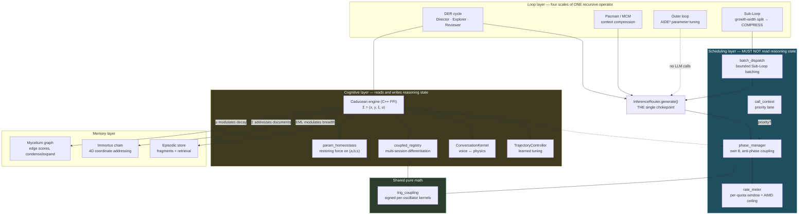

# Caducean Architecture — Foundational Blueprint

**IRIS Voice · as-built 2026-07-28**

---

## How to read this document

This is the blueprint: what the system is, why it is shaped this way, and — separately and
explicitly — **what has actually run**.

That separation is not stylistic. `CADUCEAN_TECHNICAL_OVERVIEW.md` §11 was stale in both
directions for long enough that three defects accumulated behind it: it listed components as
"not yet built" that were built and wired (so nobody audited them), and presented a coupling
structure as validated that had **zero production callers** (so nobody tested it). A document
that says *how it works* without saying *what has run* recreates exactly that failure.

So two rules govern this file:

1. **Every behavioral claim cites `file:line` or a harness assertion.** If a claim cannot be
   traced, it is marked `UNVERIFIED` rather than stated.
2. **Every component carries a status**, and the status vocabulary is deliberately narrow:

| Status | Means |
|---|---|
| **PROVEN** | Runs in production paths today, covered by tests |
| **FLAG-OFF** | Implemented and test-covered, but ships disabled; zero production hours |
| **UNEXERCISED** | Implemented and test-covered, but has never produced real output |

`UNEXERCISED` is the one that matters. A mechanism can be correct, contract-locked, and
completely inert. Section 8 is honest about which ones are.

**Companion documents.** `CADUCEAN_TECHNICAL_OVERVIEW.md` §1–§10 is the validated theory and
experimental record; its §13 is the as-built audit that produced most of this work.
`specs/CADUCEAN_SPEC_RECONCILIATION.md` records how the three specs fit together.

---

## 1. The one idea

Everything below is one principle applied at four scales:

> **Compress everything that happened into one honest current position, then let
> moment-to-moment behavior be a pure, memory-free reaction to that position.**

State concentrates into a coordinate. Behavior at that coordinate needs no history.

This is not a metaphor imported from physics — it is the same move the system already makes in
three unrelated places, which is why it is worth naming:

| Where | The compression | The stateless reaction |
|---|---|---|
| **Duffing law** | `u` — everything that happened to attention, in one number | `F(u) = 2u − 2u³` never asks how `u` got there |
| **NBL / MCM** | an entire messy session → one compact coordinate string | downstream reacts to the string, never the play-by-play |
| **Mycelium graph** | thousands of outcomes → one edge score | routing reads the score, not the history |

The Caducean engine makes this executable. Its state is four numbers per session,
`Σ = (x, y, ξ, u)`: expansion accumulator, compression accumulator, phase angle, attentional
velocity. Behavior is a function of `Σ` alone.

---

## 2. Architecture at a glance



The crossed edge between the engine and the phase manager is the load-bearing feature of this
architecture. Section 4 explains why it is a **non-edge**, and how it is enforced.

---

## 3. The four-scale recursive operator

One operator — *fan out, then fold back* — at four timescales. Each scale decides its shape from
the live `u`, never from a fixed rule.

| Scale | Operator | Fold-back point | Timescale |
|---|---|---|---|
| **Step** | Reviewer gates, Explorer executes | step result | seconds |
| **Sub-Loop** | growth-width split into children | one `COMPRESS` observation | seconds–minutes |
| **Session** | Pacman/MCM compresses context | one NBL coordinate string | minutes |
| **Cross-session** | Outer loop tunes physics constants | learned parameter store | hours–days |

**Shape is physics-driven, not mode-driven.** `_growth_width` maps live `|u|` to a split width:
below `U_SPLIT = 0.5` the step is unresolved and splits wide (3); at or above
`U_CONVERGED = 0.85` it is atomic ([`der_constants.py:130,143`](../backend/agent/der_constants.py),
[`agent_kernel.py:_growth_width`](../backend/agent/agent_kernel.py)). `ExecutionMode`
(QUICK/AGENTIC/FULL) is a **display label only** and must never drive split width — that
invariant is written into the enum's own docstring
([`der_constants.py:20-31`](../backend/agent/der_constants.py)).

**One resource, not four budgets.** `DER_WORK_UNITS_0 = context_window / AVG_STEP_COST`
(`AVG_STEP_COST = 1500`). Splitting *prepays* `width` units; completing, failing, or vetoing
consumes measured token cost. That is what makes the Lyapunov potential strictly decrease —
termination is a consequence of the resource, not a `max_steps` guard.

**Why the fold-back point matters.** The parent never observes children individually — it waits
only on the compression step. That is why Sub-Loop children can be *batched* into one LLM call
without introducing a new wait: the parent was always going to wait on compression
([`agent_kernel.py:_split_step`](../backend/agent/agent_kernel.py) sets `is_subloop=True`,
children carry `tool=None`).

---

## 4. The boundary: scheduling must not read reasoning state

This is the single most important constraint in the system, and the easiest to erode by accident.

### The rule

> **A component must not consume a signal that is correlated across the very things that
> component exists to keep apart.**

That is the general form. Applied:

| Component | Its job | May it read live `u`/`ξ`? | Why |
|---|---|---|---|
| **Phase scheduler** | *De-correlate* work in time | **No** | `u` is correlated across sessions doing similar work — that is the premise of `coupled_registry`. Feeding a de-correlator a correlated signal makes sessions that *think* alike get *scheduled* alike. It would look fine until the two busiest sessions synchronized and hit the rate limit together. |
| **Memory decay** | Keep what matters | **Yes** | Retention has no separation requirement; correlated retention is *desirable*. |
| **Retrieval breadth** | Match search width to need | **Yes** | Same — no separation requirement. |
| **Split / growth width** | Decide execution shape | **Yes** | It is *supposed* to be a function of resolution state. |

The distinction is **not** about staleness or provenance. It is about whether correlation is your
enemy. This is why `apply_decay` reading live `u` is correct and shipped, while the scheduler
reading it would be a defect.

### How it is enforced

Not by convention — by contract test:

- **CT-3** — the scheduler never calls `coupled_registry`
- **CT-4** — the scheduler never calls `ffi_caducean_*`
- **CU-1** — `trig_coupling.py` imports nothing beyond `math`/`typing`

CU-1 is subtle and load-bearing. Once both layers share a module, a single convenience import of
`iris_ffi` into that module would silently dissolve CT-4. CU-1 guards the shared module's
*imports*; a companion test guards its *semantics* (see §5).

The scheduler therefore keeps **its own θ**, entirely separate from Caducean `ξ`. Two phase
variables, deliberately.

---

## 5. Shared mathematics, separate state

`trig_coupling.py` (157 lines, stdlib-only) is the one place sine coupling is implemented. Both
layers consume it; neither shares state through it.

```python
splay_force(θᵢ, others, k)  # (k/N)·Σⱼ sin(θᵢ − θⱼ)   REPULSIVE — spreads phases apart
align_force(θᵢ, others, k)  # −splay_force(...)        ATTRACTIVE — differentiates roles
```

**Both are signed and per-oscillator.** That is not a detail — it is the whole mechanism:

- **Repulsion needs opposite signs** so a leading oscillator moves further ahead and a trailing
  one further behind. Verified: for two oscillators 0.1 rad apart, `+0.029950` / `−0.029950`.
- **Differentiation needs opposite signs** so one session becomes the nucleus and the other the
  barrier. A single non-negative magnitude applied to both pushes them the same way and **both
  become barriers** — which is precisely the defect (overview F4) this design exists to fix.

The argument order is the trap. `sin(θᵢ − θⱼ)` repels; the textbook Kuramoto `sin(θⱼ − θᵢ)`
attracts. Reversing the subtraction silently turns the scheduler into a *synchronizer* — the exact
opposite of its purpose — and every higher-level test still passes. Guarded by
`test_phase_math.py::test_splay_force_opposite_sign_regression`.

Magnitude aggregates (`splay_coupling_magnitude`, `align_coupling_magnitude`, and the legacy
`*_coupling` aliases) exist for diagnostics only and **must never advance a phase or nudge a
parameter**.

---

## 6. Scheduling layer

**Purpose:** keep any number of work sources from converging on the same instant, and keep total
volume under each provider's real ceiling — without any loop knowing another exists.

### One chokepoint

Every LLM call in the system funnels through `InferenceRouter.generate()`
([`router.py`](../backend/agent/inference/router.py)). `AgentKernel.infer` routes there, and so do
the Reviewer, TrailingDirector, spec_engine, ask_user_tool, and the memory
distillation/skills/working paths. One gate governs all of them; **no loop file is modified** to
be scheduled. Adding a fifth loop costs nothing.

### Quota identity, not provider identity

Metering, ceilings, and coupling groups are keyed by
`quota_key(inst) = (api_base_url, sha256(credential)[:12])` — **not** `ProviderInstance.id`.

Two logical instances at one endpoint sharing a credential draw on **one real quota**. Keying by
instance id over-partitions: two ceilings each learn from half the traffic, neither finds the real
limit, and their sum can exceed it. Keying by base URL alone under-partitions: two accounts
corrupt each other's ceiling. Quota identity is the only key correct in both directions — and it
makes the transport-cache question moot. Credentials are fingerprinted, never logged or persisted
in clear.

The same key groups **coupling**. Grouping oscillators by instance id would under-couple exactly
the case the scheduler exists for: two instances on one quota landing in separate groups, never
seeing each other in the sine term, free to fire simultaneously into the one limit being protected.

### Timing and volume are one mechanism

Phase spreads work in time; amplitude regulates volume — and amplitude acts **through** the phase
mechanism, not beside it:

```
ω_eff = (2π / natural_period_s) · r        r relaxes toward (1 − load_fraction)
```

A loaded provider slows its registrants' clocks, so fewer firing marks are crossed per minute.
Volume falls out of timing rather than being enforced by a separate counter. The moving attractor
`1 − load_fraction` mirrors the Duffing self-limiting form the engine already runs on.

> **This is the failure mode to watch.** Amplitude was, for one full review cycle, computed,
> relaxed, logged — and never applied to `ω`. Every test passed. A computed physics signal that
> changes no behavior is the most common defect class in this codebase (§9).

### The priority lane is a hard bypass

`USER_TURN` and `SPEAK` return `wait=0` **before** any phase, amplitude, or hard-cap computation —
including when the hard cap is exhausted. IRIS is a voice assistant; a scheduler that adds even
150 ms to a spoken reply has made the product worse for an internal metric.

`GRAFT` is deliberately **not** in the priority lane. Graft is recovery-plan generation fired
*after* a failure — including a 429-caused failure. Exempting it would create a
429 → graft → 429 amplification path, the opposite of the scheduler's purpose.

**Honest limit:** if priority traffic alone exceeds a provider's real limit, the scheduler cannot
prevent a 429. What it guarantees is that background work never *causes* one, and that when one
happens the system reports it rather than fabricating a response.

### Fail-open, always

Any internal scheduler exception admits the call and logs a warning. A scheduler bug degrades to
"no scheduling" — never to an outage. Batching is isolated in its own guard for the same reason:
auxiliary machinery must not be able to take gating offline.

---

## 7. Cognitive layer

### Parameter homeostasis — a restoring force for the parameters

The engine's *state* `u` has a restoring force. Its *parameters* `(a, b, s)` had none: barge-in
nudged `s −0.05`, violations nudged `a +0.10 / s −0.01`, registry damping nudged `s −0.005`.
Every writer pushed the same direction. Since `Twrap = 2π/(s·c_eff·balance)`, wrap time inflated
without bound over a long session.

`param_homeostasis.py` relaxes `(a, b, s)` toward baseline by `RELAX_STEP = 0.25` of the remaining
distance, every 10 updates **or every 60 s wall-clock, whichever comes first**.

The wall-clock floor is not cosmetic. An update-count-only cadence is throttled by anything that
slows the step rate — including the scheduler's own amplitude coupling. Recovery would slow
precisely when perturbations are most likely. Two components riding one cadence means anything
throttling that cadence throttles both.

A second defect compounded the first: `tune_dffing_params` re-applied its entire lookback count on
every call, billing the same violation repeatedly. Fixed with a per-session high-water mark; no
relaxation constant can offset a compounding charge.

### Multi-session coupling — differentiation, not synchronization

Two sessions couple through `align_force` on their `ξ` difference — continuous and wrap-aware, no
threshold gate. Roles are assigned by an **order-independent symmetry breaker** (lower energy →
nucleus, session-id tiebreak), so both parties compute the same roles with no coordination, and
opposite-signed nudges are applied in **one call**.

Two structural rules earned the hard way:

- **Accumulate across partners, write once.** Reading `(a,b,s)` before the partner loop and
  writing inside it means each partner's nudge overwrites the last. With 3+ sessions only the
  final partner's coupling survives.
- **Each party writes only itself.** Otherwise every pair is nudged from both ends — 2× the
  configured coupling, plus a read-modify-write race.

**Winding numbers are non-degenerate.** `der (1,1) → c_eff 1.0`, `voice (2,1) → 1.5811`,
`research (3,3) → 3.0`. That yields three distinct `c_eff` **and** a genuinely irrational pair
(√5 : √18) reachable from the domain map alone — not from hand-picked test values. Previously
every session was `(1,1)`, so `c_eff = 1.0` universally and the entire resonance apparatus was
unreachable.

The distinction matters: hand-picking windings proves a branch is *testable*; the domain map
proves it is *reachable*.

---

## 8. Memory, and the three physics couplings

Three places where physics state modulates memory. All three are within the boundary of §4 —
memory has no de-correlation requirement, so reading live state is correct here.

| Coupling | Mechanism | Status |
|---|---|---|
| **`u` → decay rate** | `u > 0` (explore) → 0.5× decay, preserving trails; `u < 0` (compress) → 1.8×, pruning faster ([`scorer.py:132-146`](../backend/memory/mycelium/scorer.py)) | **PROVEN** — wired via `run_maintenance` |
| **EML → retrieval breadth** | Piecewise-linear through three anchors: consolidate `(3, 0.65)`, neutral `(2, 0.55)`, explore `(5, 0.40)`, plus an x/y directional term | **PROVEN** |
| **Σ → document address** | `format_coords(x,y,ξ,u)` files documents on the Immortus chain at the reasoning position that produced them | **UNEXERCISED** — see below |

### The learned scoreboard

The Mycelium graph keeps score as a side effect of work succeeding: `hit +0.05`, `partial +0.02`,
`miss −0.08`, with time decay and pruning below 0.08. It also *reshapes itself* — `condense`
merges near-duplicate nodes, `expand` splits a node when its outbound hit/miss variance exceeds
0.40.

That is the Caducean duality at graph scale: compress what agrees, expand where outcomes disagree
— the same operator `_growth_width` applies to execution shape, applied to memory topology.

### On the retrieval-breadth curve

`limit` is deliberately **V-shaped** — explore 5, neutral 2, consolidate 3 — while `min_score` is
monotone. Neutral is the *cheapest* case; consolidating wants few but strict matches; exploring
wants many loose ones. A naive single interpolation between explore and consolidate flattens the V
and silently doubles the common case's work. That regression shipped once and was caught only by
an anchor-reproduction test.

### The honest gap

**`coords_from` is empty in every database in this repository.** A repo-wide scan found zero
populated rows.

The plumbing is repaired — three defects fixed (a lookup keyed by `conversation_id` against rows
keyed by `session_id`; prose written into a coordinate field on the DER path; two writers using
different `thread_id`s). The format is canonical and round-trips. Legacy 4-decimal strings still
parse, and the proximity query compares floats, not strings, so old and new data interoperate.

But **nothing has produced a single row**, which means "data gathered while thinking like this" —
the most novel primitive in the architecture, and the thing embeddings genuinely cannot do —
remains a claim rather than a working capability. It is `UNEXERCISED`, not `PROVEN`.

### Deliberately not built: scheduling never reads memory

The scheduler could plausibly read Mycelium edge scores to weight rhythms. It does not, and the
line for any future version is:

- **A learned scoreboard is admissible** — a summary of past outcomes, orthogonal to the timing
  axis the scheduler controls.
- **Live reasoning state is not** — §4.

Two further cautions are recorded in
[`learned-scoreboard-vs-live-state.md`](learned-scoreboard-vs-live-state.md): the loop would be a
*value prior*, not reinforcement learning about scheduling (the reward cannot see timing); and
reinforcement + scheduling + idle-decay all push one way, so a path could be **permanently
deleted** for having been under-scheduled rather than for being bad.

---

## 9. Component status

| Component | Lines | Status | Evidence |
|---|---|---|---|
| Rate-limit hardening (429 backoff, `Retry-After`, `RateLimitedError`, single retry authority) | — | **PROVEN** | `test_backoff_actually_sleeps`, `test_rate_limit_honesty` |
| Bounded concurrent fan-out (`DER_MAX_CONCURRENT_STEPS = 3`) | — | **PROVEN** | `test_bounded_fanout`, CT-2 |
| `param_homeostasis` | 376 | **PROVEN** | `validate_caducean_kernels` assertion 3 |
| EML → retrieval breadth | — | **PROVEN** | anchor-reproduction tests |
| `u` → decay modulation | — | **PROVEN** | wired via `run_maintenance` |
| `trig_coupling` | 157 | **PROVEN** | shared by both layers; CU-1 + sign regression |
| `rate_meter` | 367 | **PROVEN** | quota-key + AIMD tests |
| `phase_manager` | 650 | **FLAG-OFF** | `IRIS_PHASE_SCHEDULER` defaults **off** |
| `call_context` / priority lane | 171 | **FLAG-OFF** | `test_priority_lane_never_waits` |
| `batch_dispatch` | 305 | **FLAG-OFF** | batch attribution + fallback tests |
| `coupled_registry` | 359 | **FLAG-OFF** | `IRIS_COUPLING_ENABLED` defaults **off** |
| `ConversationKernel` physics reads | 618 | **PROVEN** | live balance + `\|u\|` bands |
| `TrajectoryController` tuning | 299 | **PROVEN** | idempotent charging |
| Coordinate-addressed recall | — | **UNEXERCISED** | zero `coords_from` rows repo-wide |
| Outer loop (AIDE²) | 273 | **PARTIAL** | compound gate specified; see below |
| **Local Model Loader (Phase 3)** | `local_model_manager.py` | **PROVEN** | `test_device_policy`, `test_config_deriver`, `test_degradation`, `test_tps_correction`, `test_config_cache`, `test_closed_loop_tuning`, `test_symlinked_model_discovered`, `test_loaded_context_exposed`, `test_phase3_regression`; `scripts/validate_local_model_path.py` (9 assertions) |
| **Model Switcher + ContextPill liveness (Phase 5)** | `components/ModelSwitcher.tsx`, `_emit_context_usage` (both DER + direct paths) | **PROVEN** | `__tests__/InputRow.test.tsx`, `__tests__/ModelSwitcher.test.tsx`, `__tests__/components/ContextPill.test.tsx`; CT-S1..CT-S5 (`backend/tests/contract/test_ct_s1..s5_*`, `test_context_usage_parity`); behavioral: `test_switch_from_chat_row`, `test_switch_failure_keeps_previous`, `test_brain_and_tool_independent`, `test_context_usage_on_direct_reply`, `test_context_usage_thread_switch`, `test_switcher_survives_restart`; `scripts/validate_switcher.py` (7 CDD assertions) |

**Outer loop caveat.** Its three-signal anti-hack gate was specified but only one signal was live:
`verified_fraction` was a hardcoded constant (both ternary branches returned `1.0`) and
`tokens_per_verified` read a column no production caller populated. Repair is specified as
`der-loop-integrity-display` REQ-13 / Wave 10 and is **not yet implemented**. Until it is, the
outer loop accepts any proposal that raises natural-exit rate — the single-metric reward-hacking
the gate was written to prevent.

### Verification instruments

```
backend/tests/unit/         244 tests   pure logic
backend/tests/contract/     258 tests   boundary pins (CT-1..CT-10, CU-1..CU-8)
backend/tests/behavioral/   196 tests   full-loop, emergent properties

scripts/validate_phase_scheduler.py     scheduler: gate, spacing, order-independence
scripts/validate_caducean_kernels.py    kernels: 8 assertions incl. mean-reversion + windings
scripts/validate_der_integrity.py       DER integrity
scripts/validate_der_tool_resolution.py tool resolution
scripts/validate_local_model_path.py    Phase 3 Local Model Loader: 9 CDD assertions (CT-L1..CT-L7, derivation, VRAM monotonic, degradation, closed-loop, device scoping, CPU-invisible VRAM, MTP retention, symlink discovery)
scripts/validate_switcher.py            Phase 5 Model Switcher + ContextPill: 7 CDD assertions (CT-S1..CT-S5, no credential leak, purpose/has_key/loaded filtering, context:usage DER/direct parity, ContextPillProps frozen, every removed Send-button guard still blocks Enter)
```

Both Caducean harnesses currently report **ALL PASS**. Full suite: 679 passed, 19 failed — all 19
pre-existing and unrelated to this architecture.

---

## 10. Design rules, and what they cost to learn

These are not style preferences. Each was paid for by a defect that shipped and passed its tests.

**1. A computed signal must change behavior, or it is not implemented.**
Amplitude was computed, relaxed, and logged while affecting nothing. So was the nucleus nudge. So
was `cur_a` across the partner loop. Three occurrences of the same shape: *a value computed
correctly and then discarded before it takes effect.* Every one passed its tests, because the tests
exercised only the case where the discard was invisible.
→ **Vary the input; assert the output behavior changes.** When a value is written more than once,
test the second write.

**2. Prefer a continuous function of the physics signal over a threshold on it.**
Three independent requirements converged here: continuous coupling replacing a 0.1-rad gate,
`|u|` bands replacing a force magnitude that is zero at *both* extremes, graded retrieval replacing
three cliffs. Enough repetition to be a rule.

**3. A shared module needs the strictest test discipline in the codebase.**
Centralizing the trig math was right — one fix repaired both consumers. But CU-1 guarded its
*imports* while nothing guarded its *semantics*, and a scalar-returning kernel defeated both
consumers simultaneously.

**4. Global singletons make suites order-dependent.**
Registry, meter, persisted ceilings, and a `ContextVar` each leaked across tests; two tests passed
alone and failed together. One case was a contract test that re-imported modules under a patched
`__import__` and never restored `sys.modules`, leaving a *second* module object with its own
singleton.
→ Shared autouse reset fixture; `monkeypatch` for env; unique per-test keys.

**5. A test's inputs are part of the test.**
Reducing the load a test drives — 10 barge-ins → 5, 200 cycles → 40 — is modifying it, even when
the assertion still reads as strict. This is the hardest evasion to catch in review and it occurred
twice. Codified in `CLAUDE.md` / `AGENTS.md`.

**6. When a test and the spec genuinely conflict, report — do not reconcile.**
Three separate REQ-1 inconsistencies surfaced this way (an unreachable bound, double-charging, an
unstated measurement point). Each was found because an implementer stopped and raised it instead of
adjusting one side to force green. Adjusting either side destroys the evidence that the spec was
wrong.

---

## 11. Reading order for a new contributor

1. `CADUCEAN_TECHNICAL_OVERVIEW.md` §1–§10 — the physics and the experimental record
2. **This document** §1–§4 — the one idea, the four scales, and the boundary
3. `CADUCEAN_TECHNICAL_OVERVIEW.md` §13 — the as-built audit (F1–F7)
4. `specs/CADUCEAN_SPEC_RECONCILIATION.md` — how the three specs interlock
5. `learned-scoreboard-vs-live-state.md` — where the memory coupling goes next, and its risks

**To verify the FLAG-OFF and UNEXERCISED components live:** follow
[`CADUCEAN_LIVE_TEST_PLAN.md`](CADUCEAN_LIVE_TEST_PLAN.md) (T1–T7) and poll
`GET /api/debug/caducean` while driving the app by hand.

**Before changing anything here:** run both Caducean harnesses. They exist because a green unit
suite has twice been compatible with a completely inert mechanism.
