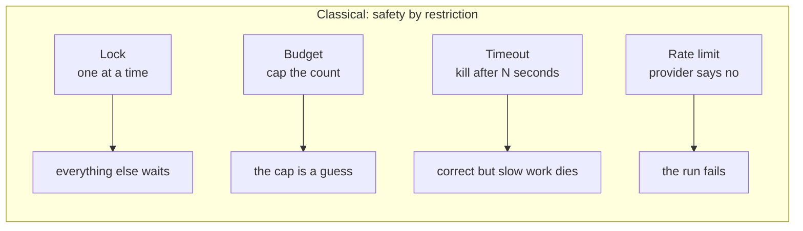
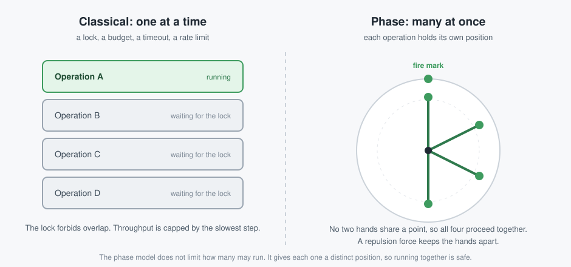
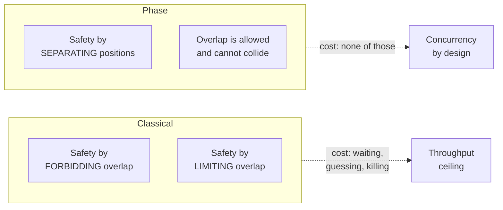
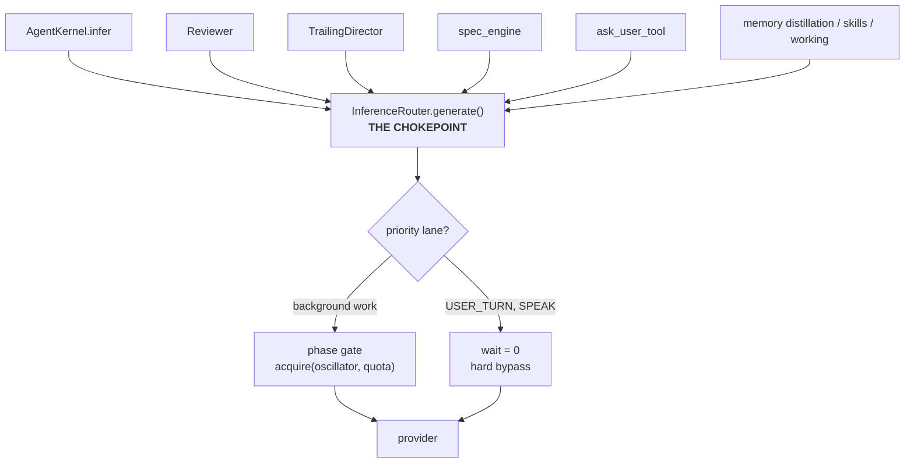

# The Caducean Concurrency Model

**Why phase, not locks.**  
**Status:** living document · **Companion to:** `CADUCEAN_ARCHITECTURE.md`, `CADUCEAN_TECHNICAL_OVERVIEW.md`  
**Written for:** anyone who has to explain, review, or extend the concurrency behaviour of IRIS.

---

## 0. Read this first: what this document is NOT

This is **not** a description of a rate-limit workaround, and the phase scheduler is **not**  
"a budget scheduler".

That framing is easy to fall into, because the first place the mechanism was deployed happens to  
be rate limiting. The deployment is not the mechanism. A budget is **one parameter** you can feed  
the mechanism. It is not what the mechanism is.

**What the mechanism is:** a physics-based way to let **many operations run at the same time  
without clashing and without a race condition**. Each operation holds a distinct position. Because  
no two operations occupy the same position, running together is safe by construction.

Keep that sentence in mind for the rest of this document. Everything below either supports it or  
shows how it is used.

---

## 1. The problem: classical concurrency tools all pay a price

Every classical tool for concurrency buys safety by giving something up. The four below are the  
ones this codebase actually uses.

| Tool                 | What it does                        | What it costs                                                                   |
| -------------------- | ----------------------------------- | ------------------------------------------------------------------------------- |
| **Lock / mutex**     | Admits one holder at a time         | Forbids overlap. Everyone else waits.                                           |
| **Budget / counter** | Caps how many may run               | A fixed ceiling that does not know whether the work is actually contending.     |
| **Semaphore**        | Caps how many may run, with a queue | Same as above, plus queue management.                                           |
| **Timeout**          | Kills work after N seconds          | Destroys work that was slow but correct.                                        |
| **Rate limit**       | The provider refuses you            | Not a tool at all — an external wall. The other four exist to avoid hitting it. |

Read the "what it costs" column again. **All four either forbid overlap, cap overlap, or destroy  
work.** None of them make overlap *safe*. They make overlap *impossible*, *limited*, or *temporary*.

The timeout row is worth dwelling on. A timeout is not a solution to a slow operation. It is a  
decision to **throw the operation away**. In a research turn, that is the difference between an  
answer and no answer.

---

## 2. The phase model: safety by construction

The phase model takes the opposite approach. It does not restrict how many operations may run.  
It gives each operation a **position**, and keeps the positions apart.

### The mechanism, in four lines

1. Every participant holds an angle, from 0 to 360 degrees. Call it its **phase**.
2. A participant acts when the dial reaches **180 degrees**.
3. After acting, that participant jumps forward by 180 degrees.
4. A **repulsion force** pushes participants apart, so they do not settle on the same angle.

Because the repulsion keeps the angles distinct, **no two participants act at the same point**.  
They can act at the same *time* — they simply act at different *positions*. Nothing is serialised.  
Nothing is capped. Nothing is destroyed.

### Why this is a different class of solution

A lock answers *"who may go?"* with *"one of you."*  
A budget answers it with *"at most N of you."*  
The phase model answers it with *"all of you, at your own positions."*

That is why the phase model is not a variation of a budget. It answers a different question.

---

## 3. Why the physics, and not just "a scheduler"

The mechanism is not a scheduling heuristic that someone tuned. It comes from a field equation.

The state of one participant is four numbers: two accumulators (`x`, `y`), a phase angle (`ξ`),  
and a velocity (`u`). They evolve under a **Duffing restoring force** — a force that always points  
toward the nearest stable state.

That force is what makes the guarantee structural rather than statistical:

- **No sequence of failures can permanently derail a participant.** The restoring force pulls it  
  back. Lyapunov stability is provable analytically for this force, not measured by experiment.
- **The separation is self-maintaining.** The repulsion is not applied once and hoped for. It is  
  part of the update rule, so the positions re-spread on their own after any disturbance.

So the concurrency guarantee is not "we scheduled carefully." It is **"the dynamics do not permit  
two participants to occupy one point."** That is a stronger statement, and it is the reason this  
approach is worth writing down separately from the classical tools.

> **A warning that cost this project real time.** The repulsion only works if the sign is correct.  
> The code uses `sin(θᵢ − θⱼ)`, which **repels**. The textbook Kuramoto form is  
> `sin(θⱼ − θᵢ)`, which **attracts**. Reversing the subtraction silently turns the mechanism into  
> a *synchroniser* — the exact opposite of its purpose — and every higher-level test still passes.  
> This is guarded by `test_phase_math.py::test_splay_force_opposite_sign_regression`. Keep that  
> guard.

---

## 4. How it plugs in: one chokepoint

A concurrency mechanism is only useful if it actually governs the work. This one does, because  
every model call in the system funnels through a single place.

Two properties follow from having one gate:

- **No loop file is modified to be scheduled.** Adding a fifth work source costs nothing. The  
  source does not know the scheduler exists.
- **A scheduler fault degrades to no scheduling**, never to an outage. Every internal error  
  admits the call and logs a warning.

The priority lane is a deliberate hard bypass. `USER_TURN` and `SPEAK` return `wait = 0` before  
any phase, amplitude, or cap computation. IRIS is a voice assistant; a scheduler that adds even  
150 ms to a spoken reply has made the product worse. Note that `GRAFT` is deliberately **not** in  
the priority lane — graft fires after a failure, including a rate-limit failure, and exempting it  
would create a `429 → graft → 429` amplification loop.

---

## 5. The one rule that must not be broken

> **A component must not consume a signal that is correlated across the very things that  
> component exists to keep apart.**

The phase scheduler exists to **de-correlate** work in time. So it must never read live reasoning  
state. If it did, two sessions that *think* alike would be *scheduled* alike — the opposite of the  
point. The failure would not be obvious; it would look fine until the two busiest sessions  
synchronised and hit the rate limit together.

This is enforced by contract tests, not by convention:

- **CT-3** — the scheduler never calls `coupled_registry`
- **CT-4** — the scheduler never calls `ffi_caducean_*`
- **CU-1** — the shared maths module imports nothing beyond `math` and `typing`

The scheduler therefore keeps **its own angle**, separate from the cognitive phase. Two phase  
variables, on purpose.

---

## 6. Honest status: what is live, what is dormant

A flag's status is its **running** value, not the code default. Verify against `.env` before  
trusting any table, including this one.

| Piece                              | Status            | Evidence                                                                                                  |
| ---------------------------------- | ----------------- | --------------------------------------------------------------------------------------------------------- |
| `phase_manager` (the gate)         | **LIVE**          | `IRIS_PHASE_SCHEDULER=1` in `.env:55`; gate called at `router.py:980`                                     |
| Priority lane / `call_context`     | **OFF**           | no enabling flag set in `.env` or `.env.local`                                                            |
| `coupled_registry` (multi-session) | **OFF**           | `IRIS_COUPLING_ENABLED` defaults `"0"`, unset                                                             |
| `batch_dispatch`                   | **OFF / untuned** | only tuning parameters, none set                                                                          |
| `DER_MAX_CONCURRENT_STEPS = 3`     | **PROVEN**        | `test_bounded_fanout`, CT-2 — this one is **classical** (a semaphore), and it is the bound in force today |

Note the last row. The system currently runs **both**: a phase gate on the model path, and a  
classical semaphore on the DER fan-out. They are not competitors. The semaphore bounds *how many  
steps*; the phase gate spreads *when model calls fire*. That distinction is the practical summary  
of this whole document.

---

## 7. Open threads

These are unresolved. They are listed so nobody assumes they are settled.

1. **Is a phase spread the right tool for a duplicate-work problem?** A phase spread clearly  
   prevents **collision on a shared resource**. It is less clear that it prevents **duplicate  
   work** — two operations fetching the same pages. The current recovery budget uses a classical  
   count of one per host, because the problem there is duplicate work, not collision.
2. **Could the recovery budget become a phase parameter?** The owner's position is that the budget  
   is just a parameter, so the number of available phase slots for a host could replace the hard  
   count. Under that reading two recoveries on one host could both proceed at different positions.  
   Not yet tested.
3. **Testing the physics approach against the classical one.** Not started. A fair test needs  
   concurrent work on one contended resource in a live run, and must measure the thing that  
   actually matters: completed work, wasted work, and collisions.
4. **The document-drift problem.** `CADUCEAN_ARCHITECTURE.md` §9 listed the phase manager as  
   `FLAG-OFF` for an unknown length of time, because it read the code default instead of `.env`.  
   The doc's own header warns that this mismatch is *why* bugs accumulated. Any status table in  
   these documents should be re-derived from the running environment.

---

## 8. Reading order

1. **This document** — the model and why it is not a budget.
2. `CADUCEAN_ARCHITECTURE.md` §4–§6 — the boundary rule, the shared maths, the scheduling layer.
3. `CADUCEAN_TECHNICAL_OVERVIEW.md` §1–§3 — the field equation and the four-dimensional state.
4. `CADUCEAN_TECHNICAL_OVERVIEW.md` §11, §13 — what is proven, and what the runtime actually does.

**Rule for contributors:** treat §1–§10 of the technical overview as validated theory. Treat its  
§11/§13 and this document's §6 as the only statements about what the code currently does — and  
verify those against the running configuration before relying on them.
