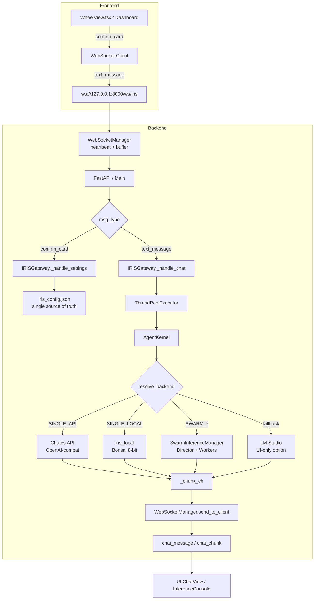

# IRIS Architecture — Single Source of Truth

> **Status:** MVP / Living Document  
> **Supersedes:** `INFERENCE_ARCHITECTURE.md`, `connection-architecture.md` (during refactor)  
> **Last Updated:** 2026-05-30

---

## 1. Visual Pipeline



---

## 2. Failure Points Annotated

| # | Location | Symptom | Root Cause | Fix Status |
|---|----------|---------|------------|------------|
| 1 | `_chunk_cb` (`iris_gateway.py:~2146`) | Chunks stop mid-response | `run_coroutine_threadsafe` fire-and-forget, loop stale | **Phase 1.1** |
| 2 | `_respond_direct` OpenAI path | 10s hang then silence | No endpoint sanity check before `chat.completions.create` | **Phase 1.4** |
| 3 | `_main_loop` capture | All WebSocket sends fail after reconnect | Loop captured once, never refreshed on reconnect | **Phase 1.5** |
| 4 | `flush_pending` | Missed messages after reconnect | Only final message buffered, not chunks | **Phase 1.3** |
| 5 | `set_model_selection` | Swarm config overwritten by Models card | Two settings cards mutate same kernel state | **FIXED** (swarm guard) |
| 6 | `_swarm_config_snapshot` | New sessions uninitialized after swarm ON | No persisted swarm state for late sessions | **FIXED** (auto-hydrate) |
| 7 | Legacy `_mode_map` | Dead code path runs on confirm | Backend still checked legacy `inference_mode` field | **FIXED** (removed 2026-05-30) |

---

## 3. Configuration Authority Flow

```
Frontend Cards (WheelView / Dashboard)
    │ confirm_card {section_id, values}
    ▼
IRISGateway._handle_settings()
    │ writes
    ▼
backend/data/iris_config.json  ←── SSOT
    │ reads
    ▼
resolve_backend()  (Phase 2)
    │ dispatches
    ▼
AgentKernel._respond_direct()  ←── stateless executor
```

**Rule:** The kernel never holds config. `iris_config.json` is the only config source. The kernel receives a fully-resolved config object at inference time.

---

## 4. Card Structure (Frontend → Backend Mapping)

### Current (Pre-Refactor)

| Card | Section ID | Key Fields | Backend Consumer |
|------|-----------|------------|-----------------|
| **Models** | `model_selection` | `model_provider`, `reasoning_model`, `tool_model`, `api_key`, `api_base_url`, `lmstudio_endpoint` | `agent_kernel.set_model_selection()` |
| **Inference** | `inference_mode` | `agent_thinking_style`, `max_response_length`, `reasoning_effort`, `tool_mode`, `swarm_enabled`, `swarm_mode` | `agent_kernel._thinking_style`, `_response_length`, etc. |
| **Personality** | `identity` | `agent_name`, `persona`, `greeting_message` | (TBD — Phase 3) |

### Future (Phase 2 Refactor)

| Card | Section ID | Key Fields | Purpose |
|------|-----------|------------|---------|
| **Backend & Models** | `backend_models` | `backend_mode` (SINGLE_API / SINGLE_LOCAL / SWARM_*), `brain_model`, `tool_model`, endpoint configs | Routing decision |
| **Agent Behavior** | `agent_behavior` | `thinking_style`, `response_length`, `tool_mode` | Inference parameters |

---

## 5. Backend Modes

| Mode | Backend | Use Case |
|------|---------|----------|
| `SINGLE_API` | Chutes / OpenAI / Groq / Cohere | Primary user path (Chutes API key required) |
| `SINGLE_LOCAL` | `iris_local` (llama.cpp GGUF) | Offline testing, small models (Bonsai 8-bit) |
| `SWARM_FAST` | SwarmInferenceManager (TurboQuant all) | Multi-agent compound collaboration |
| `SWARM_QUALITY` | SwarmInferenceManager (Q3_K_M Director) | Higher quality reasoning + fast workers |
| `SWARM_HYBRID` | SwarmInferenceManager (API Director + local workers) | API reasoning + local execution |
| `LM_STUDIO` | LM Studio OpenAI-compat endpoint | External users with LM Studio installed |

---

## 6. Key Files

| File | Role | Topology |
|------|------|----------|
| `backend/main.py` | FastAPI entry point, lifespan, WebSocket endpoint | **CORE** |
| `backend/ws_manager.py` | WebSocket connection mgmt, heartbeat, buffer | **CORE** |
| `backend/iris_gateway.py` | Message router, `_handle_chat`, `_handle_settings` | **EVOLVING** (being refactored to thinner router) |
| `backend/agent/agent_kernel.py` | Inference executor, `_respond_direct` | **EVOLVING** (becoming stateless) |
| `backend/agent/swarm_inference_manager.py` | llama-server Director + Workers | **CORE** |
| `backend/data/iris_config.json` | Config SSOT | **ACQUIRING** |
| `data/cards.ts` | Frontend card definitions | **EVOLVING** (Phase 1.5 restructure) |
| `components/wheel-view/WheelView.tsx` | Primary settings UI | **CORE** |
| `components/dark-glass-dashboard.tsx` | Dashboard settings UI | **CORE** |

---

## 7. Testing Ladder

### Phase 1 (Stabilize)
1. **Bare WebSocket:** `ping` → `pong` in < 100ms
2. **Single Local:** `iris_local` with Bonsai 8-bit responds to "What is 2+2?"
3. **Single API:** Chutes API with Minimax 2.5T responds to "What is 2+2?"

### Phase 2 (Refactor)
4. **SWARM_TURBO:** 2 workers respond correctly
5. **SWARM_QUALITY:** Q3_K_M Director + TurboQuant workers
6. **SWARM_HYBRID:** API Director + local workers

---

## 8. Glossary

| Term | Definition |
|------|-----------|
| **SSOT** | Single Source of Truth — `iris_config.json` is the only config store |
| **confirm_card** | Frontend message that tells backend to apply settings |
| **chunk_cb** | Callback that streams inference tokens back to UI |
| **swarm snapshot** | Persisted swarm config for new session auto-hydration |
| **dead wire** | Frontend setting that backend never reads |

---

*This document is updated as the refactor progresses. For the latest plan, see `.windsurf/plans/backend-connection-stabilization-2c568b.md`.*
