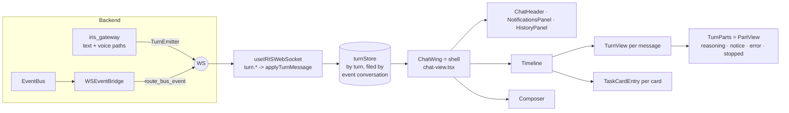

# Chat view — the turn protocol and the split (execution audit Phase 3)

Status: built 2026-10-06 on `feat/agent-multi-step-tool-execution-20260915`
(commits "feat(turns)…", "feat(chat): live turns render…", "refactor(chat): move …").
Line numbers drift; search by name. Related: `docs/audits/2026-09-29/execution-audit.html`
(Phase 3/4 spec), `docs/audits/2026-09-29/reply-surface.html` (Phases B–D),
`docs/design/chatview-2026-10-06/` (the owner-approved look, concept 2 rev 3),
`docs/architecture/TASK_CARD.md`, `docs/architecture/DER_DAG.md`,
`docs/audits/2026-09-29/PROGRESS.md` (Standards S66, S67).

---

## 0. The idea in plain words

Before: one reply reached the chat in three envelope types (`chat_chunk`, `chat_message`,
`text_response`) plus loose task / tool / card events, and one 5,600-line component guessed
which envelopes belonged together by matching turn ids as strings. When a guess failed, a
card landed in the "orphan" pile or a reply landed in the wrong thread.

Now: the backend puts every turn in **one numbered folder**. It opens the folder
(`turn.start`), adds numbered pages (`turn.part`, seq 1, 2, 3 …) and closes it exactly once
(`turn.end`: ok, error or cancelled). A small **store** files each folder under the
conversation written on it. Small **views** draw what the store holds; none of them guesses.

## 1. The turn protocol (backend)

**Module:** `backend/agent/turn_protocol.py`. `SCHEMA` is the single source of truth; the
TypeScript types in `lib/turns/protocol.ts` are **generated** by
`python scripts/gen_turn_protocol_ts.py` (`--check` fails when stale; the contract test runs it).

Wire envelope: `{"type": "turn.start" | "turn.part" | "turn.end", "payload": {…}}`.

| Message | Payload | Guarantee |
|---|---|---|
| `turn.start` | `turn_id, conversation_id, strand_id, author, to[], refs[], mode, prompt, client_ref?, ts, v` | once, before any part (a part or an end before start sends start first) |
| `turn.part` | `turn_id, conversation_id, seq, ts, v, part{type, …}` | seq 1..N dense even with many threads emitting; after end: dropped and counted |
| `turn.end` | `turn_id, conversation_id, status, parts (=N), text (final, authoritative), speak, error?, ts, v` | exactly once on every path |

**Part types:** `text` / `reasoning` (deltas), `tool_call`, `tool_result` (`ok`), `todo`
(task-card lifecycle: task:start/progress/milestone/done/fail/paused/resumed, memory:event,
task:learning), `card` (document:render), `interaction` (permission / question / browser
takeover), `notice` (plan:validation_failed, budget, recovery, vision unavailable,
steering ack), `error` (`code, message, recoverable`). Add LABELS freely; a new part TYPE is
a schema change (re-generate the TS, update the store and its views).

**Producers:**

- `TurnEmitter(send, turn_id, conversation_id, …)` — thread-safe; `send` must be thread-safe
  (the gateway passes one that schedules the WS send on the main loop and buffers for the
  reconnect replay on failure). Used as a guard: an exception → `error` part + `end("error")`;
  `CancelledError` → `end("cancelled")`; a body that forgets to end → `end("ok")` + a warning.
- Gateway **text path** (`_handle_chat`, `text_message`): opens the turn right after
  validation with the kernel's `turn_id`; chunk and reasoning callbacks feed `text` /
  `reasoning`; `turn.end` follows the final `chat_message` with the full response and the
  spoken line; the error branch adds an `error` part; a `finally` guard closes a turn that
  left without an end.
- Gateway **voice path** (`_process_voice_transcription`): same, with one `turn_id` minted
  before the kernel call and shared by the kernel, `tts_started` and the assistant
  `text_response`. A transcript that answers a question card is not a turn.
- **Event bridge** (`ws_event_bridge`): after its card-free-turn gate, every bridged bus
  event also goes through `route_bus_event`, which files it into the live turn (by `turn_id`,
  else the conversation's live turn) as the matching part. A withheld card stays withheld.

**Recording real turns:** `IRIS_TURN_RECORD_DIR=<dir>` writes each turn's messages to
`<dir>/<turn_id>.jsonl` on the `turn_record` lane (never on the reply path). Convert one into
a replay fixture with `python scripts/gen_turn_replay_fixtures.py --from-jsonl <file> <name>`.

**Migration:** the legacy messages (`chat_chunk`, `chat_message`, `text_response`, the bridged
`task:*` / `tool:*` / `document:render` …) still go out. The chat view stopped reading
`chat_chunk`; the rest are retired view by view (Phase 4 matrix, reply-surface Phase B cards
and receipts), then removed from the backend in one change.

## 2. The turn store (frontend)

**Module:** `lib/turns/turnStore.ts` — module-level store (same lifetime pattern as
`useTaskProgress`, REQ-38), read with `useSyncExternalStore`
(`useConversationTurns(conversationId)`, `useTurn(turnId)`); pure reducer
`reduceTurnMessage` for tests and replay.

Filing rules (each one closes an audit bug):

1. A turn is filed under the `conversation_id` its **event** names — never the conversation
   on screen.
2. Parts are ordered by `seq`; a replayed seq (reconnect buffer) is ignored; a delta that
   arrives late, even after the end, lands in place.
3. Exactly one end: a second / replayed end changes nothing.
4. `turn.end.text`, when present, replaces the streamed deltas (a JSON envelope streamed
   nothing; a DER reply streamed all at once).
5. A part numbered past the end's count is dropped and counted (`dropped`); a malformed
   message is counted, never thrown.
6. Bounded: `MAX_TURNS` (oldest ENDED turns evicted, never a running one),
   `MAX_PARTS_PER_TURN`.

`lib/turns/mergeTurns.ts` places live turns in the message list: a turn without its final
message yet (streaming, error, cancelled) becomes a placeholder whose id **is** the turn id —
the existing anchor rule (assistant message id === turn_id) — right under the prompt it
answers (`turn.start.client_ref` = the user message id the composer sent).

## 3. The split

| File | Role | Notes |
|---|---|---|
| `components/chat-view.tsx` (`ChatWing`) | **Shell**: conversations state, WS listeners that remain, send / resend / retry, wing geometry and frame, wiring of the children | the only component with app state |
| `components/chat/ChatHeader.tsx` | header bar (pulse, title, dashboard, detach, launcher, spotlight aperture, alerts, history, close) | pure view, props only |
| `components/chat/NotificationsPanel.tsx` · `HistoryPanel.tsx` | the two dropdowns | HistoryPanel is replaced by the thread orbit in the approved design |
| `components/chat/Timeline.tsx` | the one scroll area: pin-to-bottom, empty state, entries, orphan docs, typing, inline permission / question fallbacks | |
| `components/chat/TurnView.tsx` | one message entry (user or assistant), its inline cards and its `TurnParts` | the place Phase 4 swaps in the matrix for developer mode |
| `components/chat/TaskCardEntry.tsx` | one task-card entry (developer: Blueprint matrix string; personal: `TaskListCard`) | the one `<TaskListCard` render site |
| `components/chat/turn/TurnParts.tsx` | **PartView**: reasoning line (THK in developer mode), notices, errors (+Retry), "Stopped" | draws events that had no listener |
| `components/chat/Composer.tsx` | the input area (pills, menus, toolbar) | |

The moves were pure: the moved JSX is line-for-line identical to the old code (compared
whitespace-insensitively). Guards that pinned code to `chat-view.tsx` read the shell plus its
timeline files as one source since the split (owner-approved 2026-10-06; assertions
unchanged): `__tests__/components/chat-view-surface.contract.test.ts`,
`backend/tests/contract/test_one_task_card_render_site.py`. New files in `components/chat/`
are triaged in the CT-10 guard (`cardChassis.coverage.test.tsx`, `NON_CARD_ALLOWLIST`).

## 4. Bugs this closed (execution audit, frontend list)

| Bug | Fix |
|---|---|
| card-anchor early return (card fell to the orphan pile) | the rendered-as-document branch no longer marks the turn as seen before the anchor exists |
| 500-char clamp + remount while a reply streams | a running turn is never truncated |
| chunk / text / plan events written to the ACTIVE conversation | no chunk handler; streaming renders from the store; the final message goes to the turn's conversation |
| suggestion pills sent without conversation_id / typing / dev routing | pills take the one send path; a pill never wipes a draft |
| retry fetch inside a state updater + stray "Retrying…" | retry = resend of the prompt above the error (pure updater, fetch outside) |
| backend errors and live reasoning had no listener | `error` / `reasoning` parts render in their turn; the legacy error message is skipped when the turn shows it |
| frontend copy of the failed-search rule | removed (one trigger for cards: `create_artifact`) |
| voice path: `_sttproc_stop` read in `finally` before assignment | bound before the `try` |

## 5. Tests and guards

- `backend/tests/contract/test_turn_protocol_contract.py` (32): framing on every path, seq
  density (8 threads × 200 parts), parts after end, bus routing per event family, other
  conversations never leak in, generated TS current, both producers wired (the wiring guards
  failed on the old code).
- `__tests__/turns/turnStore.test.ts` (13): replays of emitter-produced fixtures + the filing
  rules.
- `__tests__/turns/turnView.replay.test.tsx` (12): each fixture replayed and rendered in
  **personal and developer** mode — error visible with Retry, recovered error, cancelled,
  reasoning only while running; timeline placement.
- Fixtures: `__tests__/fixtures/turns/*.json` from `scripts/gen_turn_replay_fixtures.py`
  (scripted through the real emitter; replace with `IRIS_TURN_RECORD_DIR` recordings).

## 6. How the approved design maps onto this (Phase 4 and reply-surface B–D)

The owner approved concept 2 rev 3 (`docs/design/chatview-2026-10-06/iris-strands.html`).
Where each piece lands:

| Approved piece | Lands in | Data |
|---|---|---|
| live matrix (rows born / running / fold; "looked closer" chambers; parallel light) | `TurnView` developer branch → `components/chat/matrix/*` | `todo` / `tool_call` / `tool_result` parts + `useTaskProgress` rows |
| the spine (Xur trail, agent rides to the running step, knots, chips on the spine) | `Timeline` (one canvas overlay per scroll area) | turn status + running-row positions; knots from `refs` / foreign authors / helper strands |
| vertical personal task card (every event, plain words) | `TaskCardEntry` personal branch (`TaskListCard`) | unchanged store; spine bends into its step line |
| permission / question receipts in the turn | `TurnParts` (`interaction` parts) | reply-surface Phase B |
| `±` diffs + review lens | `TurnView` + a lens in the shell | tool results of edit tools (needs the diff in the part data) |
| thread orbit, strand map, edge light + aperture | `ChatHeader` (+ dashboard header) | strands need the conversation-store fields below |
| `to:` / `#refs` composer, project bar, steer / stop | `Composer` | `turn.start.to` / `refs` already exist |

**Strands** (owner, 2026-10-06): a thread is the whole; each chat under it is a strand
(user-named, preset tags + own tags); all strands of a thread share one memory; helpers get
their own strand and report back. The protocol carries `strand_id`, `author`, `to`, `refs`;
the conversation store carries `parent_id`, `tags`, `reports_to`, `project_id` (built, §12).

## 7. Phase 4 — the live execution matrix (built 2026-10-06)

The developer turn is now three parts: the **prompt line** (`❯ text`, 12.5 px mono, no
"You" header), the **live matrix**, and the **answer** rendered as markdown in the mono
family (`MarkdownMessage variant="cli"` → `.iris-md.iris-md-cli`; it used to print raw text
with literal `**` and fences). Personal mode is unchanged (NOT THIS).

| File | Role |
|---|---|
| `components/chat/matrix/matrixModel.ts` | pure model: rows from `TaskCardProps`, split children (`<parent>_s<n>`) grouped into a chamber after their parent, plain-word fold line (DONE / FAILED / STOPPED), memory line without learning/crystallize events |
| `components/chat/matrix/LiveMatrix.tsx` | `MatrixFrame` (header TASK · n/m · time · fold, THK line, rail, memory line), `MatrixRow` (orb · verb · target · chip · chevron), `SubLoopChamber` ("↳ looked closer", folds to "· found it"), `RowDetail` (recent actions, preview, page) |
| `components/chat/matrix/ShellRunEntry.tsx` | a developer `>cmd`: prompt line + one-node matrix with an EXEC row that opens to its output (does not fold: the output is the point) |
| `lib/cli/shellRuns.ts` | groups the terminal scrollback into runs (command + output); `[exit N]` / `Terminal error:` / `^C aborted` = failed; the newest run is running until its output is quiet 2.5 s; runs are tagged with the conversation they were typed in |
| `components/chat/TaskCardEntry.tsx` | developer branch renders `MatrixFrame` (was a 9 px ANSI `<pre>` that scrolled sideways) |

Motion (approved concept 2): rows are born (`iris-mx-born`), the running row scans
(`iris-mx-scan`), its orb breathes, the agent's Xur rides the spine (§9) to the running row(s)
(the rail Xur was removed when the spine landed), a finished run folds to one line, a failed row opens
its output by default. All of it stops under `prefers-reduced-motion`. The CSS lives in
`css-src/globals.css` AND the served `public/globals.css` (the app loads the compiled file;
`app/globals.css` is not loaded) — new arbitrary Tailwind classes must exist in
`public/globals.css` or be inline styles (no Tailwind CLI in the cloud container).

Parity: the GUI matrix and the ANSI export (`renderBlueprintCellMatrixCLI`, kept for terminal
export and logs) render from the same `taskCardToMatrixProps`; a test asserts the same rows,
order and verbs. Guards: `__tests__/matrix/liveMatrix.test.tsx` (15; the TaskCardEntry guard
fails on the old `<pre>`).

The rest of the approved design landed the same day: the spine (§9), the composer, the
in-turn interactions (§10), the header (§11), strands and diffs on the backend (§12).

## 8. Open

- Retire the legacy couriers (after Phase 4 and reply-surface B read parts only).
- `interaction` parts now draw in the turn (asks, §10); `card` / `todo` parts are still drawn by
  their old views (task card store, document cards).
- `TaskListCard.display.test.tsx` pins the footer word "Crystallized" for
  `learningSignal="crystallized"`; the plain-words rule wants another word. Owner decides.
- Stop: the DER loop runs in an executor thread; a stop reaches it at its next step boundary
  (steering inbox), not mid-step.
- An edit made in a step that FAILS emits no `tool:result`, so its diff is not shown.
- The project bar has no branch (the app knows only its own repo's branch).
- Peers / `@person` (Nostr, GOALS 7b) are not built: `to` is always `@iris`.
- Live gate on the owner's machine (a real text turn, a voice turn, an error turn; record
  them with `IRIS_TURN_RECORD_DIR` and add them as fixtures).

## 9. The living spine (built 2026-10-06)

One canvas overlay per timeline (`components/chat/spine/Spine.tsx`, pure model in
`spineModel.ts`, gutter in `SpineGutter.tsx`), mounted by `Timeline` as a sibling of the scroll
area (`pointer-events: none`; it never scrolls the content). Look: `iris-strands.html`
(`measure`, `xAt`, `drawSpine`, `showChips`). The DOM is measured on change (observers,
coalesced to one pass per 80 ms), never per frame; a frame reads `scrollTop` and draws only the
visible range. The rAF loop stops while the page is hidden. Under `prefers-reduced-motion` one
static frame is drawn on demand (scroll, new measurement); nothing animates.

**Where the agent Xur rides** (there is ONE agent Xur; the matrix rail has none):

| Mode | Target | Marker the spine reads |
|---|---|---|
| developer | the matrix row(s) that run | `[data-state="running"]` (`LiveMatrix.tsx`) |
| personal | the task card's running step dot; the spine bends into each card's step line | `[data-task-step="working"]` inside `[data-task-steps]` (`TaskListCard.tsx`; the value is the displayed step status) |
| either, no row runs | the streaming reply (`#msg-<running turn id>`), else the newest entry while a turn runs | turn store `status === "running"` |

Several running rows: a wider loop and a faint light line to each row.

**Knot data contract.** A knot is a small Xur loop on the spine ONLY where something entered
from outside this strand. Landmarks are never knots. Two sources:

1. A DOM entry carries `data-knot="<kind>"`. `kind` is `ref` (pulled in from another strand,
   a task card or an artifact), `author` (another author: a person or another agent) or
   `helper` (a helper strand reporting back); an unknown kind is drawn as `ref`. Put it on the
   entry's outer element; the knot sits at the entry's top. Nothing sets `author` / `helper`
   from data yet; a view that gets that data adds the attribute.
2. `Timeline` derives knots from the turn store (`turnKnots`): a turn with non-empty `refs`
   (`ref`), or an `author` other than `user` / `iris` (`author`). The knot sits on the user's
   prompt (`turn.start.client_ref`), else on the turn's own message.

**Knots are hit targets (2026-10-06).** Each knot has a real `<button data-testid="spine-knot">` over the
canvas (placed with a transform on scroll, hidden when out of view; the canvas stays pointer-events
none). Hover or focus shows a card: `ref` = the ref addresses (each a link when `resolveRef` knows it:
task card scrolls to `[data-card-id]`, artifact opens the lens, strand calls `onOpenStrand`),
`author` = "From <author>", `helper` = "Reported back from <strand>" (`data-knot-from`), plus the
turn's first words and time. Click = `onChipClick` (the chips' scroll + highlight). Tab reaches
knots, Enter jumps, Esc closes. Guard: `__tests__/fixes/knotHover.test.tsx`.

**One thinking line (2026-10-06).** The turn's reasoning shows once: developer = the matrix THK line
(card action only when the turn has no reasoning); personal = `thinking · <sentence>` under the running
step of the card. `TurnParts` skips its own line when the turn has a card (`hasCard`); a turn without a
card keeps it. Guard: `__tests__/fixes/thinkingPlacement.test.tsx`.

**Chips on the spine.** The conversation chips (`ConversationChips`, composer footer) moved to
the gutter, the left 30 px of the timeline: hover (or keyboard focus) lists the turns, the
turns in view are highlighted, a knot shows "from outside", click calls `handleChipClick`
(scroll to the turn), a drag on the gutter scrubs the scroll. `Composer` no longer takes
`conversationChips`, `handleChipClick` or `messagesContainerRef`. `ConversationChips.tsx` is
no longer rendered (kept in the CT-10 allowlist).

Guards: `__tests__/spine/spineModel.test.ts` (detour math, knot rules, chips in view, scrub),
`__tests__/spine/spineGutter.test.tsx` (hover list, click, drag, canvas frame, reduced motion,
structure: no chips in the composer, no second Xur in the matrix).

## 9a. The composer (built 2026-10-06)

Both modes: a tray (`RefTray`: the `to @iris` chip, the picked `#` chips, a hint), the project bar
(`ProjectBar`), then the message box. Files: `components/chat/composer/{refs,ProjectBar}.tsx`.

- **Project bar.** Reads `workspaceStore` (the folder tab and the open file tabs) and adds through
  `FilePickerModal`. The old developer-only `WorkspaceTabBar` strip in `chat-view.tsx` is gone (the
  archive badge stays). No branch: the app knows the branch of its own repo (`/api/git/status`), not
  of the folder the user opened.
- **`@` = who hears.** Typing `@` opens ONE list, "Who hears this" (`WHO_HEARS` in `refs.tsx`; only
  `@iris` today, data-driven so people and helpers can be added). A pick fills the `to` chip; the
  payload carries `to: [...]`. `@` no longer lists task cards.
- **`#` = what you point at.** Typing `#` opens ONE list with two labelled groups of ADDRESSES.
  *IRIS made*: task cards (any thread: the first `#` list of a conversation asks `get_cards {all}`),
  the artifacts shown in the conversation, the strands of its thread (`fetchStrands`). *This project*:
  the project folder and the open file tabs of `workspaceStore` (the app has no folder listing
  source, so files not open in a tab do not list). IRIS picks keep `#T-38` chips; project picks are
  dashed path chips (`.iris-chip.path`) with address `file:<path>`. `text_message` carries
  `refs: [...]` (both kinds) and, for picked task cards, `referenced_cards` (card_id +
  conversation_id), which the gateway resolves exactly as it did for `@taskcard:<id>` (a typed
  `@taskcard:<id>` token still parses in `chat-view.tsx`). The gateway adds `refs` to `turn.start.refs`.
- **A sign stays text** (`refTriggerOf`): inside inline code or a fenced block, as a line-start `#`
  heading, and after a letter or digit (`a@b.com`, `C#`). Esc closes the list and keeps the sign.
- **Steer.** A turn running in this conversation (turn store) or a working card: Enter sends
  `steer`, not a prompt. The timeline shows `↳ you steered: ... · noted` (developer) or
  `↳ you said: ... · IRIS noted it` (personal) as a `steer-note-` system message (`TurnView`).
- **Stop.** The one button is `↵` / `Send message` when idle and `■` / `Stop IRIS` while a turn
  runs. It sends `stop {conversation_id}`. `main.py` pushes it to the steering inbox (the DER loop
  winds down at its next step boundary) and cancels the text-turn task of that conversation
  (`cancel_turn_tasks`); the gateway ends the turn `cancelled`. Guard:
  `backend/tests/contract/test_stop_turn_contract.py`.
- **No mic button.** Voice stays wake-word.

Guards: `__tests__/composer/composer.test.tsx` (both modes, whole `ChatWing`), `__tests__/refs/composerSigns.test.tsx` (`@` / `#` lists, chips, payload, stays-text rules).

## 10. In-turn interactions: ±, the lens, asks (built 2026-10-06)

Look: `iris-strands.html` (`.dfx`, `.lens`, diff review, `.receipt`). Tests: `__tests__/turnui/*`
(driven through the real `Timeline` from turn parts and card data shaped like the backend's).

| Piece | Where | Notes |
|---|---|---|
| `±` | `components/chat/diff/DiffMark.tsx` | on the matrix row of an editing step (developer), on the step of the personal card, and a summary chip under the reply (both, from the turn's `tool_result` parts). Data: `step.diffs` (`useTaskProgress` keeps `diff` / `diffs` of `tool:result`) |
| diff review | `components/chat/diff/DiffReview.tsx`, `lib/diffs/undoStore.ts` | per file, per hunk Keep / Undo, per file Undo all -> `sendDiffUndo`. A hunk is "undone" ONLY after `diff_undo_result` ok (the hook files it with `applyDiffUndoResult`); a refusal shows its reason; `undoable:false`, `new_file`, `truncated` each say so |
| lens | `components/chat/lens/*`, `lib/lens/lensStore.ts` | one overlay inside `Timeline`'s relative wrapper (over the timeline, inside the wing). Artifact opens by doc id and resolves live; Pop out = the full-wing `DocumentPanel` (`setExpandedDocId`); Esc / back close; a thread switch closes |
| artifact card | `ArtifactChip.tsx` | compact title + `kind · size/rows · time` (`DocRender.createdAt`, live cards only). A streaming (partial) doc and the live sources list stay inline |
| dashboard drop | `lib/lens/dragPayload.ts`, `lib/workspace/addLensItem.ts`, `DeveloperWorkspace` | the drag carries the payload (`application/x-iris-lens`, body capped at 200 KB); the Workspace Hub makes a document card (`WorkspaceTab.content` / `.diffs`). "To dashboard" in the lens uses the same path |
| asks | `lib/turns/asks.ts`, `components/chat/turn/AskPrompt.tsx` | folded from the turn's `interaction` parts. Matrix: an ASK row at the end of the rows; personal: inside the card (subheader, so a folded plan still shows it); no card: in the turn. Keys `y`/Enter allow, `n`/Esc deny when the ask has focus. Countdown only when the backend sent `timeout_seconds`. After the answer: a receipt line. Answers use the existing `notification_response` / `question_response`; the legacy card of an ask is hidden only when the turn really shows it |
| MADE row | `LiveMatrix.tsx` `MadeRow`, `matrix/madeRows.ts` | under the step that ran `create_artifact` / `show`, else last. GUI only: the ANSI export and the parity guard read steps |
| plain words | `lib/cards/plainWords.ts` | personal card: a split child says "looked closer" and "reported back" once done; engine words in labels / memory summaries are rewritten |

Open: `TaskListCard.display.test.tsx` pins the footer text "Crystallized" / "Learning signal: Crystallized"
for `learningSignal="crystallized"`; the plain-words rule wants "done". Left as the test has it (a test is
the requirement); decide which side moves.

## 11. The header (built 2026-10-06)

`components/chat/ChatHeader.tsx` + `components/chat/header/*`. Look: `iris-strands.html`.

- **Row:** brand Xur (`useBrandPalette`; opens the thread orbit; faster while voice is busy) ·
  thread name (click to rename in place → `patchThread`) · the current strand under it (the root
  strand reads "main"; no dropdown arrow) · `⌖` strand map (a dot when a turn runs in another
  strand, `useRunningConversations` over the turn store) · `◉` menu: dashboard, detach/reattach,
  alerts (unread count), launcher, close — every old header control, same handlers.
- **Thread orbit** (`ThreadOrbit.tsx`): threads on the Xur's loops; pinned threads keep the
  lower loops; wheel turns it; typing filters; click opens the thread root; pin/unpin; "+ new
  thread". Data: `fetchThreads()` (summary only). It never calls `fetchConversations` — the
  old `HistoryPanel` path downloaded every message and lagged; `HistoryPanel` is no longer
  rendered.
- **Strand map** (`StrandMap.tsx`): the strands of this thread with tags, "reports to", a
  working dot; click switches (`openStrand`, loads the row with `GET /api/conversations/{id}`
  when chat-view has not loaded it); "new strand" = name + preset tags (plan, build, research,
  people, swarm) + own tags → `createStrand`.
- **Edge light** (`ChatEdge.tsx` → `components/chrome/EdgeLight.tsx`): the chat wing's top
  edge with the spotlight aperture set into it, same handler and titles ("Maximize chat" /
  "Restore balanced view"); `working` = a turn runs in this conversation. The outer box clips
  with `clipPath: inset(-14px 0 0 0)` (was `overflow:hidden`, which cut the aperture), as in
  the dashboard wing.

Guards: `__tests__/header/*` (orbit from a mocked `fetchThreads`, never `fetchConversations`;
filter; pinned on lower loops; rename; create strand with tags; switch; every old control in
`◉`; aperture → spotlight handler; no render loop with no active conversation).

## 12. Strands, shared memory and diffs (backend, built 2026-10-06)

- **Strands** (`backend/conversation_store.py`, `backend/api/chat.py`): a strand IS a
  conversation row (messages stay keyed by conversation id). Nullable columns `parent_id`
  (NULL = thread root), `tags` (JSON), `reports_to`, `project_id`; index
  `idx_conversations_parent`. `GET /api/threads` is one indexed summary query (`SEARCH c USING
  INDEX idx_conversations_parent`); `GET/POST /api/threads/{id}/strands`, `PATCH
  /api/strands/{id}`, `PATCH /api/threads/{id}`. Tags: trimmed, lowercased, ≤ 8, ≤ 24 chars
  (refused with 422, never cut). Deleting a root deletes its strands. Client:
  `lib/strands/api.ts`. Guard: `backend/tests/contract/test_strands_contract.py`.
- **Shared memory — no wiring needed.** The app's recall paths already read across
  conversations: `research_memory.recall_prior_research` ("any conversation") and
  `ontology_recall` (thread id is a ranking input only). So every strand of a thread already
  recalls the same memory. What stays per strand is the kernel's context window
  (`get_agent_kernel(conversation_id, …)`), which the design wants. `thread_root_of()` exists
  for a future thread-scoped read; it has no caller yet.
- **Diffs** (`backend/agent/edit_diffs.py`): the chokepoint is `AgentToolBridge.execute_mcp_tool`
  for `file_manager` `write_file` / `edit_file` (snapshot before, compare after, off the loop).
  The payload `diff {diff_id, path, added, removed, hunks, truncated, undoable, new_file}` rides
  the step's `tool:result` (`diffs` when a step made several edits); a card-free turn still
  files it into the turn. Bounds: 400 lines / 64 KB per payload, 2 MB pre-image for undo, 8 MB
  read cap, in-memory LRU ledger 200 diffs / 64 MB. `diff_undo {diff_id, hunk_index?}` →
  `diff_undo_result {ok, reason?, told_iris}` runs mid-turn (`_UNLOCKED_FRAMES`); an undo
  restores the exact bytes (or reverse-applies one hunk when its lines still match) and tells
  IRIS through the conversation's own memory ("[Edit undone by the user] …") plus one
  `CORRECTION` memory event. Guard: `backend/tests/contract/test_edit_diff_contract.py`.

