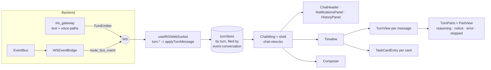

# Chat view — the turn protocol and the split (execution audit Phase 3)

Status: built 2026-10-06 on `feat/agent-multi-step-tool-execution-20260915`
(commits "feat(turns)…", "feat(chat): live turns render…", "refactor(chat): move …").
Line numbers drift; search by name. Related: `docs/audits/2026-09-29/execution-audit.html`
(Phase 3/4 spec), `docs/audits/2026-09-29/reply-surface.html` (Phases B–D),
`docs/design/chatview-2026-10-06/` (the owner-approved look, concept 2 rev 3),
`docs/architecture/TASK_CARD.md`, `docs/architecture/DER_DAG.md`,
`docs/audits/2026-09-29/PROGRESS.md` (Standards S66, S67).

---

## 0. The idea in plain words

Before: one reply reached the chat in three envelope types (`chat_chunk`, `chat_message`,
`text_response`) plus loose task / tool / card events, and one 5,600-line component guessed
which envelopes belonged together by matching turn ids as strings. When a guess failed, a
card landed in the "orphan" pile or a reply landed in the wrong thread.

Now: the backend puts every turn in **one numbered folder**. It opens the folder
(`turn.start`), adds numbered pages (`turn.part`, seq 1, 2, 3 …) and closes it exactly once
(`turn.end`: ok, error or cancelled). A small **store** files each folder under the
conversation written on it. Small **views** draw what the store holds; none of them guesses.

## 1. The turn protocol (backend)

**Module:** `backend/agent/turn_protocol.py`. `SCHEMA` is the single source of truth; the
TypeScript types in `lib/turns/protocol.ts` are **generated** by
`python scripts/gen_turn_protocol_ts.py` (`--check` fails when stale; the contract test runs it).

Wire envelope: `{"type": "turn.start" | "turn.part" | "turn.end", "payload": {…}}`.

| Message | Payload | Guarantee |
|---|---|---|
| `turn.start` | `turn_id, conversation_id, strand_id, author, to[], refs[], mode, prompt, client_ref?, ts, v` | once, before any part (a part or an end before start sends start first) |
| `turn.part` | `turn_id, conversation_id, seq, ts, v, part{type, …}` | seq 1..N dense even with many threads emitting; after end: dropped and counted |
| `turn.end` | `turn_id, conversation_id, status, parts (=N), text (final, authoritative), speak, error?, ts, v` | exactly once on every path |

**Part types:** `text` / `reasoning` (deltas), `tool_call`, `tool_result` (`ok`), `todo`
(task-card lifecycle: task:start/progress/milestone/done/fail/paused/resumed, memory:event,
task:learning), `card` (document:render), `interaction` (permission / question / browser
takeover), `notice` (plan:validation_failed, budget, recovery, vision unavailable,
steering ack), `error` (`code, message, recoverable`). Add LABELS freely; a new part TYPE is
a schema change (re-generate the TS, update the store and its views).

**Producers:**

- `TurnEmitter(send, turn_id, conversation_id, …)` — thread-safe; `send` must be thread-safe
  (the gateway passes one that schedules the WS send on the main loop and buffers for the
  reconnect replay on failure). Used as a guard: an exception → `error` part + `end("error")`;
  `CancelledError` → `end("cancelled")`; a body that forgets to end → `end("ok")` + a warning.
- Gateway **text path** (`_handle_chat`, `text_message`): opens the turn right after
  validation with the kernel's `turn_id`; chunk and reasoning callbacks feed `text` /
  `reasoning`; `turn.end` follows the final `chat_message` with the full response and the
  spoken line; the error branch adds an `error` part; a `finally` guard closes a turn that
  left without an end.
- Gateway **voice path** (`_process_voice_transcription`): same, with one `turn_id` minted
  before the kernel call and shared by the kernel, `tts_started` and the assistant
  `text_response`. A transcript that answers a question card is not a turn.
- **Event bridge** (`ws_event_bridge`): after its card-free-turn gate, every bridged bus
  event also goes through `route_bus_event`, which files it into the live turn (by `turn_id`,
  else the conversation's live turn) as the matching part. A withheld card stays withheld.

**Recording real turns:** `IRIS_TURN_RECORD_DIR=<dir>` writes each turn's messages to
`<dir>/<turn_id>.jsonl` on the `turn_record` lane (never on the reply path). Convert one into
a replay fixture with `python scripts/gen_turn_replay_fixtures.py --from-jsonl <file> <name>`.

**Migration:** the legacy messages (`chat_chunk`, `chat_message`, `text_response`, the bridged
`task:*` / `tool:*` / `document:render` …) still go out. The chat view stopped reading
`chat_chunk`; the rest are retired view by view (Phase 4 matrix, reply-surface Phase B cards
and receipts), then removed from the backend in one change.

## 2. The turn store (frontend)

**Module:** `lib/turns/turnStore.ts` — module-level store (same lifetime pattern as
`useTaskProgress`, REQ-38), read with `useSyncExternalStore`
(`useConversationTurns(conversationId)`, `useTurn(turnId)`); pure reducer
`reduceTurnMessage` for tests and replay.

Filing rules (each one closes an audit bug):

1. A turn is filed under the `conversation_id` its **event** names — never the conversation
   on screen.
2. Parts are ordered by `seq`; a replayed seq (reconnect buffer) is ignored; a delta that
   arrives late, even after the end, lands in place.
3. Exactly one end: a second / replayed end changes nothing.
4. `turn.end.text`, when present, replaces the streamed deltas (a JSON envelope streamed
   nothing; a DER reply streamed all at once).
5. A part numbered past the end's count is dropped and counted (`dropped`); a malformed
   message is counted, never thrown.
6. Bounded: `MAX_TURNS` (oldest ENDED turns evicted, never a running one),
   `MAX_PARTS_PER_TURN`.

`lib/turns/mergeTurns.ts` places live turns in the message list: a turn without its final
message yet (streaming, error, cancelled) becomes a placeholder whose id **is** the turn id —
the existing anchor rule (assistant message id === turn_id) — right under the prompt it
answers (`turn.start.client_ref` = the user message id the composer sent).

## 3. The split

| File | Role | Notes |
|---|---|---|
| `components/chat-view.tsx` (`ChatWing`) | **Shell**: conversations state, WS listeners that remain, send / resend / retry, wing geometry and frame, wiring of the children | the only component with app state |
| `components/chat/ChatHeader.tsx` | header bar (pulse, title, dashboard, detach, launcher, spotlight aperture, alerts, history, close) | pure view, props only |
| `components/chat/NotificationsPanel.tsx` · `HistoryPanel.tsx` | the two dropdowns | HistoryPanel is replaced by the thread orbit in the approved design |
| `components/chat/Timeline.tsx` | the one scroll area: pin-to-bottom, empty state, entries, orphan docs, typing, inline permission / question fallbacks | |
| `components/chat/TurnView.tsx` | one message entry (user or assistant), its inline cards and its `TurnParts` | the place Phase 4 swaps in the matrix for developer mode |
| `components/chat/TaskCardEntry.tsx` | one task-card entry (developer: Blueprint matrix string; personal: `TaskListCard`) | the one `<TaskListCard` render site |
| `components/chat/turn/TurnParts.tsx` | **PartView**: reasoning line (THK in developer mode), notices, errors (+Retry), "Stopped" | draws events that had no listener |
| `components/chat/Composer.tsx` | the input area (pills, menus, toolbar) | |

The moves were pure: the moved JSX is line-for-line identical to the old code (compared
whitespace-insensitively). Guards that pinned code to `chat-view.tsx` read the shell plus its
timeline files as one source since the split (owner-approved 2026-10-06; assertions
unchanged): `__tests__/components/chat-view-surface.contract.test.ts`,
`backend/tests/contract/test_one_task_card_render_site.py`. New files in `components/chat/`
are triaged in the CT-10 guard (`cardChassis.coverage.test.tsx`, `NON_CARD_ALLOWLIST`).

## 4. Bugs this closed (execution audit, frontend list)

| Bug | Fix |
|---|---|
| card-anchor early return (card fell to the orphan pile) | the rendered-as-document branch no longer marks the turn as seen before the anchor exists |
| 500-char clamp + remount while a reply streams | a running turn is never truncated |
| chunk / text / plan events written to the ACTIVE conversation | no chunk handler; streaming renders from the store; the final message goes to the turn's conversation |
| suggestion pills sent without conversation_id / typing / dev routing | pills take the one send path; a pill never wipes a draft |
| retry fetch inside a state updater + stray "Retrying…" | retry = resend of the prompt above the error (pure updater, fetch outside) |
| backend errors and live reasoning had no listener | `error` / `reasoning` parts render in their turn; the legacy error message is skipped when the turn shows it |
| frontend copy of the failed-search rule | removed (one trigger for cards: `create_artifact`) |
| voice path: `_sttproc_stop` read in `finally` before assignment | bound before the `try` |

## 5. Tests and guards

- `backend/tests/contract/test_turn_protocol_contract.py` (32): framing on every path, seq
  density (8 threads × 200 parts), parts after end, bus routing per event family, other
  conversations never leak in, generated TS current, both producers wired (the wiring guards
  failed on the old code).
- `__tests__/turns/turnStore.test.ts` (13): replays of emitter-produced fixtures + the filing
  rules.
- `__tests__/turns/turnView.replay.test.tsx` (12): each fixture replayed and rendered in
  **personal and developer** mode — error visible with Retry, recovered error, cancelled,
  reasoning only while running; timeline placement.
- Fixtures: `__tests__/fixtures/turns/*.json` from `scripts/gen_turn_replay_fixtures.py`
  (scripted through the real emitter; replace with `IRIS_TURN_RECORD_DIR` recordings).

## 6. How the approved design maps onto this (Phase 4 and reply-surface B–D)

The owner approved concept 2 rev 3 (`docs/design/chatview-2026-10-06/iris-strands.html`).
Where each piece lands:

| Approved piece | Lands in | Data |
|---|---|---|
| live matrix (rows born / running / fold; "looked closer" chambers; parallel light) | `TurnView` developer branch → `components/chat/matrix/*` | `todo` / `tool_call` / `tool_result` parts + `useTaskProgress` rows |
| the spine (Xur trail, agent rides to the running step, knots, chips on the spine) | `Timeline` (one canvas overlay per scroll area) | turn status + running-row positions; knots from `refs` / foreign authors / helper strands |
| vertical personal task card (every event, plain words) | `TaskCardEntry` personal branch (`TaskListCard`) | unchanged store; spine bends into its step line |
| permission / question receipts in the turn | `TurnParts` (`interaction` parts) | reply-surface Phase B |
| `±` diffs + review lens | `TurnView` + a lens in the shell | tool results of edit tools (needs the diff in the part data) |
| thread orbit, strand map, edge light + aperture | `ChatHeader` (+ dashboard header) | strands need the conversation-store fields below |
| `to:` / `#refs` composer, project bar, steer / stop | `Composer` | `turn.start.to` / `refs` already exist |

**Strands** (owner, 2026-10-06): a thread is the whole; each chat under it is a strand
(user-named, preset tags + own tags); all strands of a thread share one memory; helpers get
their own strand and report back. The protocol already carries `strand_id`, `author`, `to`,
`refs`; the conversation store still needs `parent_id`, `kind`/tags, `project_id` (not built).

## 7. Open

- Retire the legacy couriers (after Phase 4 and reply-surface B read parts only).
- `turn.part` `interaction` / `card` / `todo` parts are filed but still drawn by their old
  views.
- Strands in the conversation store; the thread list lag (it downloads every thread with every
  message on each open — `openHistory()` → `fetchConversations()`).
- Live gate on the owner's machine (a real text turn, a voice turn, an error turn; record
  them with `IRIS_TURN_RECORD_DIR` and add them as fixtures).
