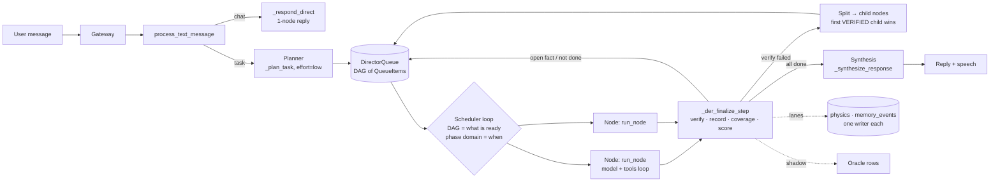
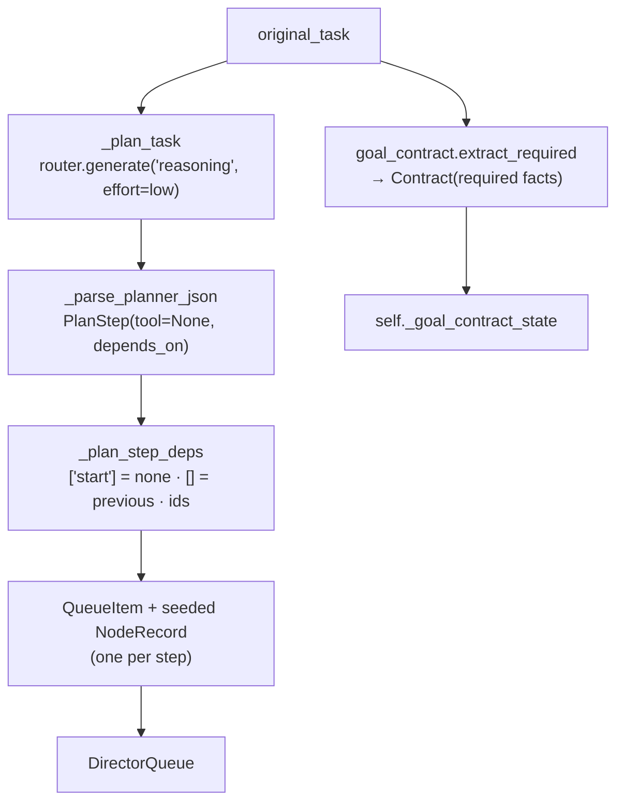
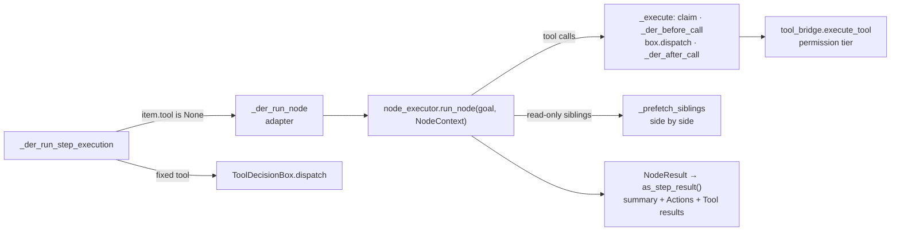
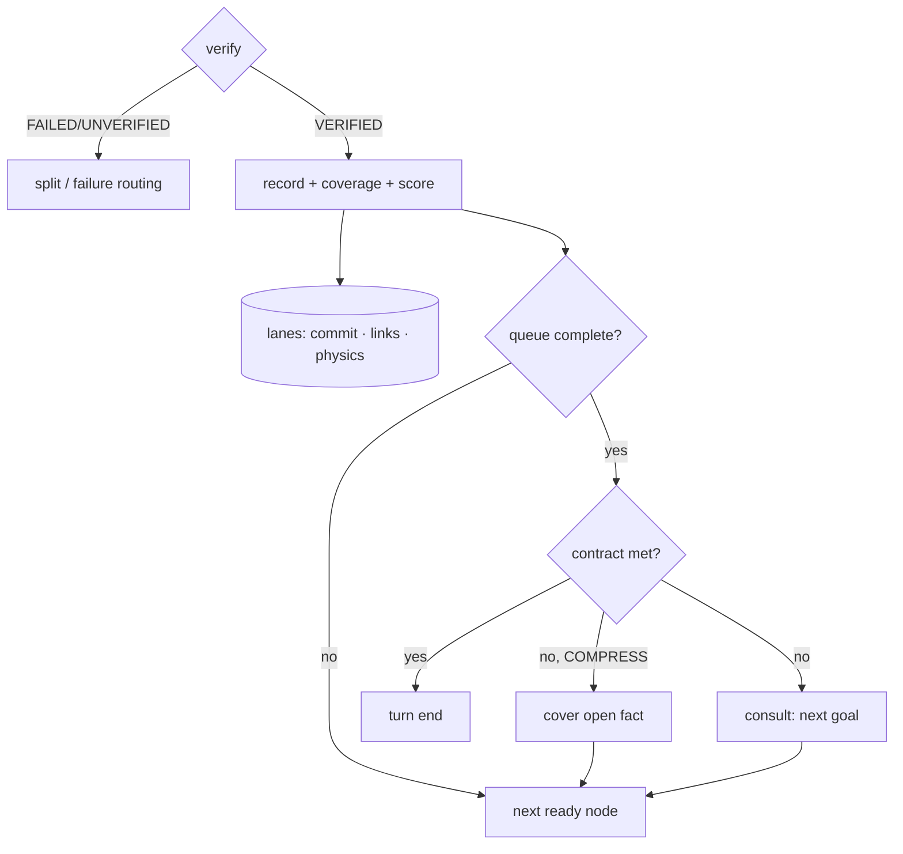
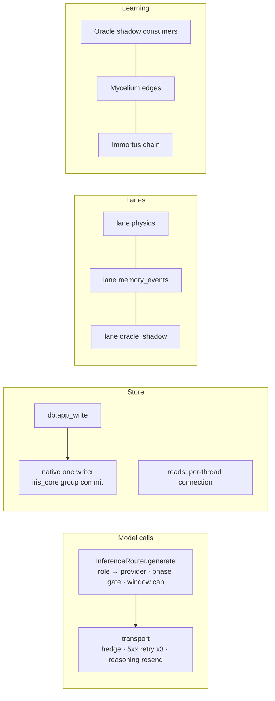

# DER-DAG — architecture concept map

Status: verified against the code at commit `e9059e33` + the speed changes of
2026-10-05 (branch `feat/agent-multi-step-tool-execution`). Line numbers drift;
search by the function name. `K` = `backend/agent/agent_kernel.py`.
Related: `docs/CADUCEAN_ARCHITECTURE.md` (physics), `docs/CADUCEAN_CONCURRENCY_MODEL.md`
(lanes, fold-back), `docs/architecture/oracle.md`, `docs/architecture/PHASE_DOMAINS.md`
(its Execution row is stale — see §9), `docs/audits/2026-09-29/PROGRESS.md` (Standards).

---

## 0. The idea in one paragraph

DER-DAG is a general contractor. It reads the request, draws a plan as a graph of
goals (the DAG), and hands each goal to a worker at a bench (a **node**: one model
with the tools, working in a loop until its goal is met). Goals that do not need
each other's results run side by side. When a worker finishes, the contractor checks
the work, writes it into memory, ticks the request's checklist (the **goal
contract**), and decides: more work, a split, a repair, or the answer. Physics
(Caducean Σ) says whether the job is expanding or condensing; the Oracle watches
every decision in the shadow and learns.

---

## 1. Turn entry and routing

| Step | Where | Role |
|---|---|---|
| Gateway | `iris_gateway.py` `_handle_chat` (`text_message`), voice path `from_voice=True`; HTTP twin `api/chat.py` | Passes text, session, conversation, `chunk_cb`, `reasoning_cb`, `turn_id`, card context |
| `process_text_message` | K | Call class USER_TURN; Oracle `observe_user_message` (shadow, lane); `_turn_end_settle` folds back last turn's bookkeeping |
| Routing | `_needs_planning` → `compile_dag(...).requires_der_kernel`; `_should_skip_der` (web gate) is final | No plan → `_respond_direct` (a 1-node graph) |
| DER lock | `_der_active` | Chit-chat during a running DER is answered directly; a new task gets "Still working…" |
| Pre-plan | `_sanitize_task`, task classifier, Mycelium context package, mode detector | Voice forces `voice_first` mode |
| Plan + start | up to 3 `_plan_task` attempts; a trivial plan → `_respond_direct` | TASK_START, card gate |
| `_der_execute_with_recovery` | K | `DerLinkWriter`, work units; runs `_execute_plan_der`; TopologyViolation → re-init + 1 retry |

## 2. Planning — goals, never tools

- **Planner** (`_plan_task`): one Brain call, `max_tokens=4096`, `reasoning_effort="low"`
  (sent only to providers that take it; mercury-2.5 hidden reasoning ~1,300-1,650 → ~250 tokens).
- **Steps are goals**: `PlanStep.tool=None`. The node chooses tools. (Owner rule: no
  planner wording for speed.)
- **Edges**: `depends_on` from the planner; `_plan_step_deps` normalises it.
- **Goal contract** (`goal_contract.py`): `extract_required(request)` splits the request
  into required facts (a list after a colon = one fact per item; commas inside calls or
  quotes do not split). Stored in `kernel._goal_contract_state` with C (coverage) and g = 1 − C.
- Known gap: the planner parse never reads `expected_output`, so `map_to_steps` maps
  nothing and node verification has no expectation (§9).

## 3. Scheduling — one scheduler, DAG decides WHAT, phase domain decides WHEN

| Piece | Where | Role |
|---|---|---|
| Loop | `_execute_plan_der` | `while not queue.is_complete()` and cycle/token/600 s budgets and no stop |
| `DirectorQueue.next_ready(exclude=inflight)` | `der_loop.py` | Items whose `depends_on` are all completed; skips completed/vetoed/failed/`split_pending`; under rec==1 prefers critical items |
| `_der_start_node` | K (module level) | One daemon thread per node; `execution.der_nodes` phase domain `enter`; resource claim; `run_step` with retry |
| `_der_take_finished` / `_der_post_step` | K (module level) | On the loop thread: failure → `_der_route_step_failure` + `_der_handle_step_failure`; success → `_der_finalize_step`, `_der_graft_missing_artifacts`, `_der_settle_split` |
| Phase domain | `_der_node_domain()` → `phase_domain.get_phase_domain("execution.der_nodes", period 0.5 s, k 0.6)` | Load from the provider rate meter, never live u/xi (CT-3/4); fail-open |
| Claims | `_NODE_CLAIMS`: browser family, screen family | One browser page per conversation; screen is global |
| Split race | `hold_split_parent`, `settle_split` | Parent waits; the first VERIFIED child completes it; siblings are cancelled |
| Switch | `IRIS_DER_PARALLEL=0` | One node at a time (and no sibling calls inside a node) |

Per boundary (between node starts): topology halt check, steering inbox
(`_der_check_steering`, which also runs the **streak gate**), live context refresh,
mid-loop recall, Reviewer veto, pre-execution validation.

## 4. Node execution — a worker at a bench

- **`NodeContext`**: `generate` (router, role `tool_execution`), `execute`, `format_result`,
  `tools` (`NODE_TOOLS`, + screen tools only for a screen goal), `prior_results`,
  `task` (the user's words verbatim), `max_calls=12`, `budget_s=300`, `result_chars=8000`,
  `helper_role` (the Brain helps a struggling tool model once), `sees`/`look` (vision),
  `expected`, `parent_goal`, `review_note`, `parallel_ok`.
- **Closing**: every tool takes `step_done`/`step_summary`; a closing answer whose calls all
  succeed ends the node (a change first gets one more call to look at its effect).
- **Natural split**: calls of one answer that are all read-only and claim-free run side by side.
- **Result shape**: each call keeps its own head (`NODE_BLOCK_HEAD=2500`, share = 8000/n)
  so a three-search node hands all three answers on (S53).
- Writes on the item: `node_calls`, `node_call_log` (what the step did), `node_digest`
  (repeat key).

## 5. Finalize — check, record, decide (`_der_finalize_step`)

Order of work for one settled node (inline unless marked **lane**):

1. **Verify** — `_verify_step_result` (exit code ≠ 0 → UNVERIFIED; empty → FAILED).
   Verify failure may **split** the step (`_split_step`, width from physics after
   `_der_physics_settle`), parent held until a child wins.
2. **Commit row** — `record_commit` → **lane `memory_events`**.
3. **Edge scoring** — `_der_score_step_outcome` (**inline on purpose**: the next step's
   tool choice, AVOID header and recovery graft read it; `[DER] slow step scoring` > 0.25 s).
   Writes the fan trace and the (region, mediator) edge; FAILED → miss episode.
4. **Mediator + node record** — `_der_mediator_for` (the node's decisive call); a step
   without a record gets one here (S52); stamps outcome, domains, content summary, mediator.
5. **Goal coverage** — `mark_coverage`: a fact with its own NAME needs that name; a nameless
   fact needs one of its OWN words or a passing run after the last file change. Updates C, g;
   up to 2 ceiling facts per VERIFIED step.
6. **Links** — `DerLinkWriter.write_node_links` → **lane `memory_events`**.
7. **Physics** — `_der_submit_physics` → **lane `physics`**: EML, `ffi_caducean_update`,
   `recommend` → `fold.rec`, trajectory row, Immortus chain append. Consumers that DECIDE
   on it wait on `fold.ready` (`_der_physics_settle`): the split and the continuation gate.
8. **Envelope + progress** — `item.envelope`; TASK_PROGRESS / DER_STEP / card snapshot.
9. **Continuation gate** — when the queue is complete (AGENTIC/FULL):
   - goal contract met → no consult;
   - rec==1 (COMPRESS) → no consult, but an open required fact still gets a cover step
     (`_goal_contract_cover_step`, fixed text, max 2 pushes per fact, then BLOCKED);
   - otherwise `_der_plan_next_step` (one Brain consult) may add an `explorer_N` goal.

**Failure paths**: `_der_route_step_failure` (skipped for node steps — §9) →
`_der_handle_step_failure`: `mark_failed`, `abort_descendants`, grafts
(`_der_amend_graph`, `_der_enqueue_recovery`, `_split_step`). Recovery (`_der_maybe_open_recovery`,
`_der_graft_recovery_plan`) adds goal-only items.

**Streak gate** (`_der_streak_gate`, at boundaries): repeated/empty/mismatched envelopes →
replan through `_der_apply_steering`; capped at 2 fires; never when the contract is met.

## 6. Turn end

| Step | Where |
|---|---|
| Budget / terminal events | `_der_budget_exit`, TASK_DONE / TASK_FAIL |
| Bookkeeping | one job on lane `memory_events` (`_turn_end_submit`); folded back at the next turn |
| Answer | success → `_der_synthesize_success_outcome` → `_synthesize_response`; failure (and contract not met) → `_der_synthesize_outcome`; deterministic fallbacks for both |
| Evidence | `_der_node_record_evidence`: gather/read steps give their raw result within `_step_evidence_cap`; marked `bounded` so the prompt does not cut it again |
| Blocked facts | `_goal_contract_name_blocked` names them in the answer |
| Grade | `_der_report_run_grade` (from coverage C when a contract exists) |
| Speech | narration vs reply split, speech lanes |

The DER reply is produced whole and then sent in chunks; true streaming belongs to the
turn protocol (execution audit Phase 3).

## 7. Cross-cutting systems

- **One model chokepoint**: `InferenceRouter.generate` — roles (`reasoning`, `tool_execution`),
  phase gate, window cap, per-call `thinking` / `reasoning_effort` passed only to transports
  that take them. Transport: hedge after max(3 s, 2 × p90), 5xx retried to the 3rd attempt,
  reasoning-cut answers resent with ≥ 1,024 tokens of room.
- **One writer** (`backend/memory/db.py`): `app_write` → native group-commit writer;
  `app_flush` only for a reader that decides on its own write; reads on the caller's
  own connection.
- **Lanes** (`utils/durability_queue.lane`): one ordered writer per resource; work the
  reply does not need goes here.
- **Caducean physics**: Σ = (x, y, ξ, u). `recommend`: 0 EXPAND, 1 COMPRESS, 2 CONTINUE,
  3 TOPO_VIOLATION. The scheduler never reads live u/ξ; the cognitive layer may.
- **Oracle**: shadow consumers (`decision_engine`, `monitor_shadow`, `event_oracle`) until
  the bar (rows ≥ 100, precision ≥ 0.90, ECE ≤ 0.05).
- **Research memory**: `PRIOR RESEARCH` + `CROSS-CHECK` head on search results; one record
  per distinct finding (S55).

## 8. Data objects

| Object | Where | Key fields |
|---|---|---|
| `PlanStep` | `core_models.py` | step_id, description, tool (None), depends_on, criticality, expected_output |
| `QueueItem` | `der_loop.py` | step_id, depends_on, tool, params, node_record, envelope, is_subloop, result; runtime: node_call_log, node_digest, _race_lost |
| `NodeRecord` | `der_loop.py` | node_type, objective_anchor, content_summary, expected_output, outcome, verified_fraction, mediator, domains, required/covered/blocked facts |
| `DirectorQueue` | `der_loop.py` | items, completed/vetoed/failed ids, split_pending, mode, streak counters |
| `NodeContext` / `NodeResult` | `node_executor.py` | see §4 |
| `Contract` / `Coverage` | `goal_contract.py` | required, ceiling, version / covered, blocked, C, g |
| fold handle | `_der_submit_physics` | ready, rec, coords |
| `ToolResultEnvelope` | `tool_envelope.py` | status, summary, wrapper, raw_ref |

## 9. Health — what is solid and what is not

**Solid (each guarded by a test that fails on the old code; live gates green):**
parallel DAG with split race (S47/S50), one writer (S42-S49), goal coverage that tells
facts apart (S51-S53, S56), cover push under COMPRESS and records for every step (S52),
node mediator (S54), per-call evidence (S53), 5xx retry, reasoning-resend floor.
Live 2026-10-05: r09 three-fact task 10/10 on the final DAG code; 15/15 coding + research
tasks across gates 3-6.

**Seams still open (known, not yet fixed):**
1. Planner `expected_output` is never parsed → `map_to_steps` is inert, and a node step is
   VERIFIED when a tool ran successfully (no expectation to compare).
2. Node steps skip `_der_route_step_failure` and `_der_graft_missing_artifacts` (both read
   `item.tool`), so the node router and missing-artifact grafts never act on node work.
3. Dead code: `DirectorQueue.all_ready_items`, `_der_exec_steps_concurrent`
   (`DER_MAX_CONCURRENT_STEPS`); `PHASE_DOMAINS.md` still names the old semaphore.
4. The rec names in `der_loop.py` comments (CONTRACT/MAINTAIN) differ from the native names
   (COMPRESS/CONTINUE).
5. The reply model sometimes calls a found fact "missing" (2 of 25 r09 runs).
6. `agent_kernel.py` is 22k lines; most of DER lives there (execution audit Phase 5).
