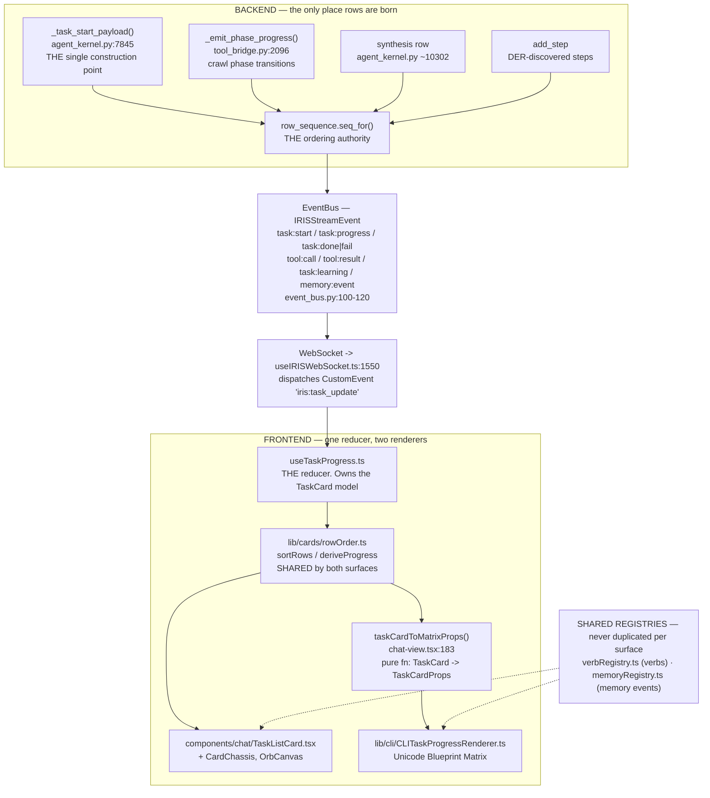

# TASK CARD — The Execution Surface, Backend to GUI to CLI

**Status:** Current as of 2026-08-23 · **Say "TASK CARD" to reference this architecture.**
**Related:** `specs/task-card-v2-liquid-ink/` (the card's own spec) ·
`specs/der-ground-truth/` Part 5 (the ordering/counter fixes documented here) ·
`docs/architecture/FAULTLINE.md` (typed outcomes the card renders)

---

## 0. What this document is for

The task card is the user's only window into what the agent is actually doing. It
renders on two surfaces — the GUI card and the CLI Blueprint Matrix — from one
backend event stream.

**Read this before adding anything the card should show.** The card has been
broken three separate times by changes that were locally correct: a new row type
that carried no ordering key, a counter updated in one branch and not another, a
verb derived from keyword-matching a description. Each was invisible in tests
because the tests asserted what the reducer *did* rather than what the emitter was
*allowed to send*.

§7 is the checklist. If you only read one section, read that one.

---

## 1. The pipeline, end to end

**The one-way rule:** rows are born in the backend, ordered by the backend, and
rendered by the frontend. **The frontend never invents a row, a number, or an
order.** Every past card defect has been a violation of that rule.

---

## 2. The event vocabulary

All events are `IRISStreamEvent` members (`backend/agent/event_bus.py:100-120`),
bridged to the DOM as one `iris:task_update` CustomEvent
(`hooks/useIRISWebSocket.ts:1550`).

| Event | Creates a row? | Notes |
|---|---|---|
| `task:start` | **Yes** — all planner rows at once | Built ONLY by `_task_start_payload`. Also re-emitted on revision/graft/split with `card_relation: "continues"` |
| `task:progress` + `phase` | **Yes** — one row per phase | Arrives CARD-LESS (crawler forwards `conversation_id` only) |
| `task:progress` + `add_step` | **Yes** | DER-discovered steps |
| `task:progress` + `update_step` | No — addresses an existing row | Per-page detail |
| `task:progress` + `step_done` | No | Resolves a row |
| `tool:call` / `tool:result` | No | Attaches tool identity to a row |
| `task:done` / `task:fail` | No | Terminal. **Exactly one per card** |
| `task:learning` | No | Drives OrbCanvas particles |
| `memory:event` | No | Memory slot, via `memoryRegistry` |

---

## 3. Identity — `card_id`, and why it is stable

`_resolve_card_identity` (`agent_kernel.py:7948`) decides `card_id` and
`card_relation` once per task, and `_card_context` (`:8017`) stamps
`card_id` + `conversation_id` on every subsequent event.

- `card_relation: "new"` → a fresh card
- `card_relation: "continues"` → extends the card bearing that `card_id`

`card_id` is **stable for a task's whole life and survives conversation
boundaries.** That is what makes card footprints
(`backend/memory/card_footprint.py`, written at the DER terminal state)
retrievable by ID alone, and it is what `specs/wormhole-aperture/` REQ-34 uses as
its cross-conversation provenance spine.

**Contract-locked (CT-CARD-1).** Do not make `card_id` derive from content, from a
hash, or from anything that changes mid-run.

---

## 4. Ordering — the part that broke three times

### 4.1 The rule

**`seq` is the render-order authority. Nothing else is.**

`row_sequence.seq_for(conversation_id, row_id)`
(`backend/agent/row_sequence.py`) allocates it. Two properties matter, and they
are easy to break independently:

1. **Allocation order is emit order** → a row created between planner steps 2 and
   3 sorts between them. This is what makes phases interleave chronologically
   instead of being banished to the end of the card.
2. **Memoized per row identity** → re-emitting an existing row (revision, graft,
   split, revisited phase) returns the key it already owns, so a card already on
   screen never renumbers under the user.

`stepNumber` still exists and is still sent. It is the **planner's own numbering**
and a legitimate display concern ("step 2 of the plan"). It is **not** the render
order — it came from the planner LLM's own JSON and could collide.

### 4.2 What went wrong before, so you can recognise it

Measured 2026-08-23 by `lib/cards/emitterContract.ts` across three captured live
traces: **18 contract violations.**

| Rule | What was wrong |
|---|---|
| **E1** | EVERY `task:start` row arrived with no ordering key — in crawl AND non-crawl tasks. Not crawl-specific |
| **E5** | Every phase transition opened a row with no key orderable against planner rows. `phase_sequence` orders phases among *themselves* only |
| **E2** | A graft gave `r1` and `r1_s1` the same key. Render order then fell to insertion accident |

Two independent mechanisms produced the same symptom, and fixing either alone
would have left it live:

- rows carried no key, **and**
- `sortSteps` was applied only on the two `task:start` paths — **never on either
  append path**, so even a correctly keyed row stayed where it was pushed.

### 4.3 The counter and the orb ring are the same bug

`deriveProgress` (`lib/cards/rowOrder.ts`) computes numerator and denominator
**together**, from the same row collection, with a floor so the denominator cannot
shrink. Previously the phase branch advanced `totalSteps` and never recomputed
`currentStep` — and because that same value feeds the XurOrb ring denominator,
**the list order, the counter, and the ring were three symptoms of one cause.**

---

## 5. GUI surface

`components/chat/TaskListCard.tsx`, on `CardChassis`, with `OrbCanvas` particles
driven by `task:learning`.

- **Verbs** come from `lib/cards/verbRegistry.ts` via `resolveVerb()`. A phase row
  derives its verb from `PHASE_VERB[phase]` **directly** — never by keyword-matching
  the description. (Keyword matching is what once rendered a fetching-phase row as
  SEARCH. Pinned by CT-GT-9.)
- Unregistered tools **compact to ≤6 chars** to fit the fixed-width verb column
  (session-246 amendment): first segment if it fits, else acronym, else hard slice.
- **Memory slot** renders from `lib/cards/memoryRegistry.ts` — fixed fields, fixed
  order, per kind. The `recall` kind already reserves the Wormhole vocabulary
  (`tier`, `hyperedge_posterior`, `hex_bin_id`, `resonance`, `last_activated`,
  `elevation`). **When wormhole recall lands it EDITS that entry — it does not
  touch a card.**
- **Row detail:** live activity is `activeDetail`; a finished row retains a bounded
  `resultPreview` summary. A terminal card never advertises a page it is no longer
  reading.

---

## 6. CLI surface

`taskCardToMatrixProps()` (`components/chat-view.tsx:183`) adapts the GUI's
`TaskCard` into `TaskCardProps`, then `renderBlueprintCellMatrixCLI()`
(`lib/cli/CLITaskProgressRenderer.ts:197`) draws the Unicode Blueprint Matrix.

**The adapter is a pure synchronous function of a `TaskCard`.** That is why the
whole CLI path is testable headless — trace → reducer → adapter → rendered frame,
no app, no dev server, no developer-mode session.

Two things the adapter must carry, and once did not:

- **`seq`** — without it the CLI inherited the GUI's array order with no way to
  detect or correct it
- **`currentStep` / `totalSteps`** — the CLI had no counter at all

Renderer internals are correct and covered: `visibleWidth()` measures real display
columns (ANSI zero-width, CJK double-width), rows pad/truncate to an inner width of
66, and the right wall always closes.

**Both surfaces share one derivation** (`rowOrder.ts`) and one verb mapping
(`verbRegistry.ts`). That is deliberate — two implementations of one mapping drift,
which is exactly how the CLI and GUI came to disagree.

---

## 7. CHECKLIST — adding something new to the card

Work through this in order. Most past defects were a skipped step here.

**If you are adding a new ROW TYPE:**
1. Emit it from the **backend**. Never synthesise a row in the reducer.
2. Stamp `seq` via `row_sequence.seq_for(conversation_id, row_id)`. Use a **stable
   `row_id`** — the same row must resolve to the same key on re-emit.
3. If the row can be re-emitted (revision, graft, revisit), confirm memoization
   returns its original key rather than a new one.
4. Ensure the reducer path that appends it calls `sortSteps`. **Both existing
   append paths once did not.**
5. Add it to the emitter contract (`lib/cards/emitterContract.ts`) so a malformed
   emit fails a test at the backend boundary.

**If you are adding a new EVENT:**
6. Add it to `IRISStreamEvent` (`event_bus.py`) and to the table in §2 above.
7. Decide explicitly: does it create a row, address one, or neither?
8. If it can terminate a card, preserve **exactly one terminal frame per card**.

**If you are adding a new DISPLAY FIELD:**
9. Put shared mappings in `lib/cards/` — never per-surface. Follow `verbRegistry` /
   `memoryRegistry`.
10. Carry it through `taskCardToMatrixProps` so the CLI gets it too, or state in
    the PR why the CLI deliberately omits it.
11. If it is a memory event, add a **kind** to `memoryRegistry` with fixed fields in
    fixed order. Variable prose gets pattern-matched as noise and ignored.

**Always:**
12. Anything touching counts goes through `deriveProgress`. Never update a
    numerator or denominator alone.
13. Write the test so it **fails on the old code**. A fixture where every row ties
    on the same key passes either way — that accident is what let the original bug
    ship green.
14. Run `npx jest --config jest.config.frontend.cjs -w 2` (the default worker count
    starves on some machines and a worker dies with `exitCode=143`).

---

## 8. Test map

| Suite | Pins |
|---|---|
| `__tests__/contract/emitterContract.test.ts` | The BACKEND's obligations (E1–E5) — asserted independently of any renderer |
| `__tests__/hooks/useTaskProgress.ordering.test.tsx` | Rows render in the order work happened; counter/ring coherence |
| `__tests__/hooks/useTaskProgress.density.test.tsx` | Finished rows retain summaries; detail lands on the row that owns it; phase-verb lock |
| `__tests__/cli/cliCardParity.test.ts` | GUI and CLI derive the same sequence and progress |
| `__tests__/hooks/useTaskProgress.card-contract.test.tsx` | Session-247 reducer contract — **additive-only, never weakened** (CT-GT-6) |
| `__tests__/cards/verbRegistry.test.ts`, `memoryRegistry.test.ts` | Shared registry shapes |
| `__tests__/cli/CLITaskProgressRenderer*.test.ts` | Width, Unicode, padding, wall closure |
| `__tests__/fixtures/cardTraces.ts` | Real captured wire frames as DATA, for renderer-independent validation |

**Why the emitter contract exists at all:** the reducer suite replays real captured
traces and asserts what the card does with them. If the backend sent a malformed
stream, the replay reproduces it faithfully and the assertions encode the defect as
correct. That is precisely what happened — the suite was green for weeks while the
live card rendered out of order, because **not one assertion checked order.**

---

## 9. Known-open

- Historical traces in `tests/traces/` carry declared gaps (no execution history
  pre-T4, no terminal frame) — kept deliberately as regression fixtures of that
  condition, not as failures to fix.
- `memoryRegistry.recall` renders the Wormhole vocabulary but nothing emits those
  fields yet. It is the designated seam for `specs/wormhole-aperture/` REQ-15.
- Card rendering of newly-registered FAULTLINE labels is a designed path that has
  **never been exercised** (`FAULTLINE.md` §8).
