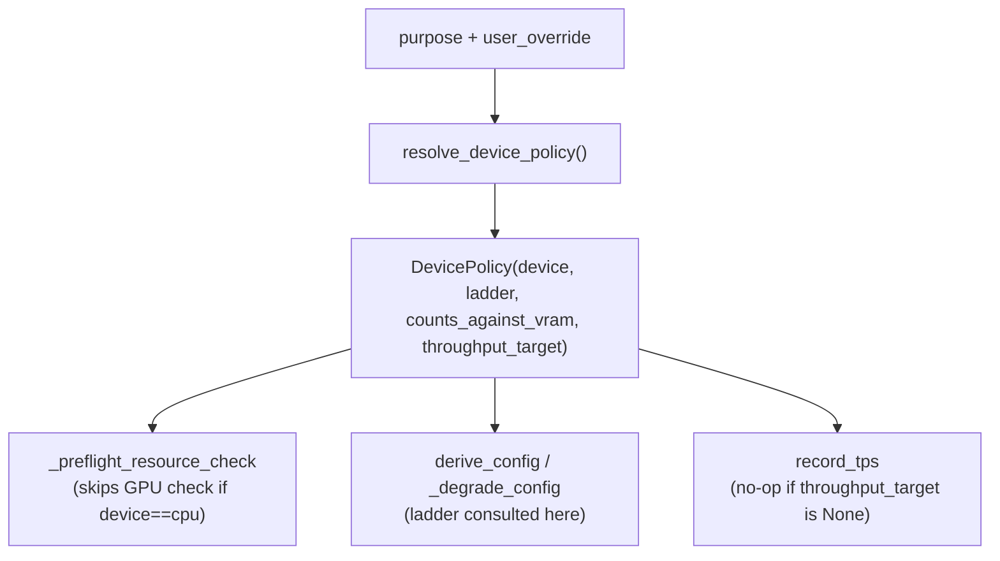

# Local Model Loader — Device Policy, Config Derivation, and the Closed Loop

**IRIS Voice · as-built 2026-07-29 · Phase 3**

---

## How to read this document

Same discipline as `CADUCEAN_ARCHITECTURE.md`: every behavioral claim cites `file:line`;
anything that cannot be traced to code, a test, or a harness run is marked `UNVERIFIED`. This
covers [`local_model_manager.py`](../../backend/agent/local_model_manager.py) — the GGUF model
lifecycle manager — and its one read-only observability surface,
[`caducean_debug.py`](../../backend/api/caducean_debug.py) `_loader_state()`.

---

## 1. `resolve_device_policy` — the single source of truth

Before Phase 3, device/VRAM/target decisions were scattered `if`-guards. `resolve_device_policy
(purpose, user_override) -> DevicePolicy` (`local_model_manager.py:358-428`) replaces all of them
— every caller that needs to know how a model should load goes through this one function.

```python
# local_model_manager.py:232-249
@dataclass(frozen=True)
class DevicePolicy:
    device: str                      # "gpu" or "cpu"
    ladder: tuple[str, ...]           # degradation steps, in order
    counts_against_vram: bool
    throughput_target: Optional[float]
```

| purpose | device | ladder | counts_against_vram | target |
|---|---|---|---|---|
| `chat` | gpu | `("ctx", "batch")` | True | `TARGET_TPS` |
| `tool` | gpu | `("ctx", "batch")` | True | `TARGET_TPS` |
| `embedding` | cpu | `()` | False | `None` |
| `rerank` | cpu | `()` | False | `None` |

(`local_model_manager.py:396-406`)

A **user override** (`"gpu"` or `"cpu"`) flips `device` and `counts_against_vram` **together**
(`local_model_manager.py:408-419`): overriding to GPU means the model now consumes real VRAM and
must be counted; overriding to CPU means it must stop being counted. These two facts cannot move
independently — a model that occupies GPU memory but is excluded from the VRAM budget would let
later loads over-commit against memory that is actually spoken for; a model that counts against
VRAM while running on CPU would falsely shrink the budget for models that really are on the GPU.
The dataclass being `frozen` (`:232`) means a caller cannot patch one field post-hoc and leave the
other stale.



---

## 2. `derive_config` — binary search, GPU-only, VRAM- and throughput-aware

```python
# local_model_manager.py:1335-1408 (signature + return, abridged)
def derive_config(self, model_meta, target_tps=TARGET_TPS, base_tps=50.0,
                   vram_budget_gb=None) -> Dict[str, Any]:
    # binary-searches n_ctx in [MIN_CTX, MAX_CTX] for the LARGEST n_ctx s.t.
    #   estimate_vram_gb(model_meta, n_ctx) <= vram_budget_gb   AND
    #   expected_tps(n_ctx) = base_tps * sqrt(MIN_CTX / n_ctx) >= target_tps
    # n_gpu_layers is ALWAYS -1.
```

`n_gpu_layers` is hardcoded to `-1` in the return value (`:1400,1404`) — full GPU offload, never
partial, never CPU. This is a **policy choice**, stated directly in `_preflight_resource_check`:
a CPU load (`n_gpu_layers == 0`) is rejected outright with an explicit error rather than silently
falling back (`local_model_manager.py:1588-1596`, *"No CPU fallback is allowed"*). The reasoning:
partial/CPU offload for a chat model on this hardware profile produces throughput far below what
IRIS treats as usable — better to fail the load loudly (with a clear remediation: smaller
quantization, smaller `n_ctx`, or a smaller model) than to silently serve a degraded, "technically
loaded" model.

---

## 3. `estimate_vram_gb` — weights **and** KV cache, not weights alone

```python
# local_model_manager.py:1245-1296
weights_gb = params_b * bpw / 8.0 * 1.1                              # overhead-padded
kv_cache_gb = 2 * block_count * n_ctx * embed_dim * 2 / (1024 ** 3)   # when metadata available
             # else: params_b * n_ctx * 2 / (1024 ** 3)                (fallback heuristic)
total = weights_gb + kv_cache_gb
```

The trap this avoids: a weights-only estimate is correct at small `n_ctx` (KV cache is a rounding
error) and badly wrong at large `n_ctx` (KV cache dominates). `derive_config`'s binary search calls
`estimate_vram_gb(model_meta, n_ctx=mid)` at every candidate (`:1386`), so the estimate that gates
each candidate context is genuinely a function of that context — not one number computed once
and reused across the whole search range.

---

## 4. GPU-only degradation ladder

`_degrade_config(params, model_meta, purpose)` (`local_model_manager.py:2156-2213`) only engages
for GPU purposes with a non-empty ladder (`:2181-2183` — mirrors `resolve_device_policy`, no
separate decision). On a pre-flight VRAM failure it re-derives via `derive_config` against the
free VRAM budget (with an 8% safety margin, `:2186`), producing a smaller `n_ctx` and, if still
tight, a smaller `n_batch` (`derive_config`'s own `n_batch = min(max(n_ctx, 512), 2048)`,
`:1397`) — context shrinks first, batch follows from it. `n_gpu_layers` stays `-1` throughout
(`:2202`, `"n_gpu_layers ALWAYS -1"`). Every degradation step is logged with its reason
(`:2206-2211`, `"reason=VRAM tight, GPU-only ladder"`) — the design rule this pays for is the same
one `CADUCEAN_ARCHITECTURE.md` §10 states for the phase scheduler's amplitude: an unlogged
degradation is indistinguishable from nothing having happened, until a user asks why their context
window is smaller than expected.

`load_model` wires this in: a pre-flight failure triggers `_degrade_config`, and only if the
*retried* pre-flight check against the degraded params also fails does the load actually abort
(`local_model_manager.py:1896-1931`).

---

## 5. `ConfigCache` — path+size+mtime **and** hardware fingerprint

```python
# local_model_manager.py:265-355
class ConfigCache:                            # .mcm/local_model_configs.json
    _model_fingerprint(path, meta) -> f"{path}:{size}:{mtime}"
    _hw_fingerprint(hw)            -> f"{gpu_name}:{vram_total_gb:.1f}GB"
```

A cache hit requires **both** fingerprints to match (`:319-324`) — a GPU swap invalidates every
cached entry rather than reusing a config sized for the old card, which would either under-use a
bigger GPU or (worse) over-commit on a smaller one. A corrupt cache file is discarded and derivation
starts fresh (`:289-293`, caught broadly and logged, never propagated) — the cache is an
optimization, not a dependency the loader can be blocked by.

---

## 6. The closed loop: `record_tps` corrects the *next* load, never the running one

```python
# local_model_manager.py:1662-1771
record_tps(tps, gpu_active=True, purpose=None):
    policy = resolve_device_policy(purpose or self._current_purpose)
    if policy.throughput_target is None:            # embedding/rerank
        return                                        # never measured against TARGET_TPS
    threshold = policy.throughput_target              # TARGET_TPS, not a hardcoded 8
    # ... rolling window of 3, then:
    if within TPS_DEADBAND of threshold:               # 0.15
        return                                          # close enough — no thrash
    _write_tps_correction(avg, threshold, policy)        # writes to ConfigCache, NEXT load only
```

Three invariants, each earned by a specific requirement:

- **Threshold is `TARGET_TPS`, env-overridable (`IRIS_TARGET_TPS`, default `25`)**
  (`local_model_manager.py:209, 1668`), not a hardcoded `8` — the old fixed threshold could not be
  tuned per-hardware.
- **`TPS_DEADBAND = 0.15`** (`:222`) means a measurement within 15% of target writes nothing — the
  correction path only fires on *sustained* deviation, not on ordinary sample noise, preventing the
  cache from oscillating between two configs on every measurement.
- **The correction never touches the running model** (`_write_tps_correction`, `:1713-1771`) — it
  recalibrates `base_tps` from the measured throughput, re-derives `n_ctx`/`n_batch` at the
  *original* target, and writes the result to `ConfigCache` for the model's **next** load
  (`:1755-1761`). `self._current_params` is never mutated by this path. The reasoning: a live
  llama.cpp instance mid-session cannot be resized without a full reload — dropping context,
  in-flight generations, and KV state. Reconfiguring under a user is a worse failure than staying
  slightly slow until the next load picks up the correction.

---

## 7. Symlink-aware model discovery

`_iter_gguf_paths()` (`local_model_manager.py:900-949`) is a custom depth-bounded BFS, not
`Path.rglob("*.gguf")`. Three properties `rglob` does not give:

1. **Follows symlinks explicitly** — `entry.is_symlink()` is checked and the symlinked target is
   queued for traversal (`:924-937`), so a model reachable *only* through a symlink is discovered.
   This is not a hypothetical: the real models directory resolution
   (`MODELS_DIR = ~/.lmstudio/models` when present, `:487-495`) is itself commonly a symlink on
   this kind of setup, so symlink-blind traversal would silently see an empty directory.
2. **Deduped by resolved path** (`seen: set`, `:909, 927-929, 943-945`) — a symlink pointing at a
   file already reached directly (or a second symlink pointing at the same target) does not produce
   a duplicate entry.
3. **Depth-bounded** (`SCAN_MAX_DEPTH = 8`, `:217, 932, 940`) — a circular symlink chain cannot walk
   forever; the queue simply stops enqueuing past the bound.

Split-shard grouping (`model-00001-of-00003.gguf`) is preserved downstream in `scan_models()`
(`:973-995`) regardless of which traversal found the shards — the BFS only changes *which paths are
visited*, not how `scan_models` groups what it finds.

---

## 8. Observability: `_loader_state`

`caducean_debug.py:311-368` exposes, read-only and never-raising (every field independently
try/excepted): `get_status()` (loaded/profile/n_ctx/purpose/endpoint/pid), the active
`_current_params`, the resolved `DevicePolicy` for the currently-loaded purpose, and the full
`ConfigCache` contents (config, measured_tps, hw_fingerprint, updated_at per entry) — the same
state the closed loop in §6 reads and writes. This is the surface to poll while driving a real
load by hand to confirm a degradation or a TPS correction actually happened, the same pattern
`CADUCEAN_LIVE_TEST_PLAN.md` uses for the Caducean flags.

---

## 9. Gotchas — real, and will bite the next person

**GGUF parser targets a non-standard type enum.** The GGUF spec says type `4 = STRING`,
`8 = ARRAY`. This parser instead treats type `4` as *possibly* `UINT32` and type `8` as *possibly*
`STRING`, trying a string read first and falling back
(`local_model_manager.py:1098-1144`, comment: *"a non-standard type enum ... that differs from the
GGUF spec ... what LM Studio / HF cache GGUF files use"*). This matches the real files this loader
was built and tested against. A GGUF v3 file written with the **standard** enum may mis-parse under
this reader — `_try_string()`'s length-sanity heuristic (`slen > 0 and slen < 65536`,
`:1122-1123`) is the only guard against reading a STRING where the file actually has a UINT32, and
a small-but-plausible integer value could pass that heuristic and be silently misread as garbage
bytes decoded as UTF-8. **UNVERIFIED**: no test in this repo exercises a standard-enum GGUF file, so
whether the fallback in practice mis-reads or merely fails-soft (returns `{}`/partial metadata) for
such a file is not established here.

**`lfm2moe.*` keys are not reached — MoE models report `context_length`/`block_count` as `N/A`.**
The Director's brief states that `general.tags` (a type-9 array with a non-standard `elem_type`)
breaks parsing before the `lfm2moe.*` keys are reached, causing MoE-family models to fall back to a
default context for VRAM estimation. I could not find `"lfm2moe"` or `"general.tags"` as a literal
string anywhere in this repository (`backend/`, `specs/`) — **this specific claim is UNVERIFIED
against the codebase** and is recorded here as reported, not as independently confirmed. What *is*
verifiable is the mechanism that would produce exactly this symptom: type 9 is read as an ARRAY only
when its 12-byte peek (`elem_type` + `count`) satisfies `elem_type in _GGML_TYPE_READERS and count <
1024` (`local_model_manager.py:1146-1156`); a `general.tags` array whose `elem_type` is itself a
non-standard/unrecognized value would fail that condition, fall through to the type-9 `UINT16`
fallback (`:1155-1156`), desynchronize the byte cursor for every KV pair that follows, and the outer
per-KV `try/except: break` (`:1164-1170`) would then silently stop parsing the rest of the header —
which *would* leave later keys like `*.context_length` / `*.block_count` unread, reproducing the
reported symptom. The mechanism is real and cited; the specific key names are not independently
confirmed here.

**`base_tps` defaults to `50.0` and is model-independent at first load.** `derive_config`'s
`base_tps` parameter (`local_model_manager.py:1338-1339`) is only recalibrated *after* a real TPS
measurement, via `_write_tps_correction` (§6). Production's **first** load of any model uses the
literal default `50.0` regardless of model size — so two models of different size that both fit
VRAM at the default throughput model can derive the *same* `n_ctx` on first load; "three different
contexts for three model sizes" (the harness's Assertion 2, `scripts/validate_local_model_path.py:
130-139`) only appears because the harness deliberately passes different `base_tps` per size
(`120.0`/`60.0`/`25.0`) to simulate what a model-aware estimate would look like — it is not
evidence that first-load differentiates model sizes organically. This is the weakest spot in REQ-1
as implemented; the likely fix is estimating `base_tps` from `params_b` instead of a flat literal.

**Symlink tests mock `os.scandir`, on purpose.** Creating real symlinks requires privileges not
available in this environment/CI, so `test_symlinked_model_discovered.py` and harness Assertion 9
both patch `backend.agent.local_model_manager.os.scandir` with `FakeDirEntry` objects that report
`is_symlink()`/`is_dir()`/`is_file()` without touching the filesystem's real symlink machinery
(`backend/tests/unit/test_symlinked_model_discovered.py:1-72`,
`scripts/validate_local_model_path.py:198-242`). Do not "fix" these by switching to real
`os.symlink()` calls — that would make the suite depend on privileges the target environment does
not reliably grant, trading a working test for a flaky or CI-broken one.

**A pre-existing crash: the Bonsai low-bit detection branch referenced an undefined `meta`.**
Commit `94c9c2c9` introduced `elif meta.get("general.file_type", 0) in (1, 2, 3):` in the Bonsai
detection branch of `load_model` — but the metadata variable in that scope is named `model_meta`,
not `meta`. Because this branch runs unconditionally for every load (it is how a *non*-Bonsai model
gets correctly identified as such), the `NameError` broke every load, Bonsai or not, until it was
caught and fixed. The current code reads `model_meta.get("general.file_type", 0) in (1, 2, 3)`
(`local_model_manager.py:1969`) — the correct variable name.

**Real hardware baseline used to size the throughput/VRAM model.** RTX 3070, `8192` MiB total VRAM,
`~7131` MiB free at idle — reflected in the harness's hardware fixture
(`vram_total_gb: 8.0, vram_free_gb: 7.0`, `scripts/validate_local_model_path.py:78`) and consistent
with the 92%-safety-margin VRAM budget used throughout (`local_model_manager.py:1582, 2186`). The
50.8 tok/s figure for Qwen3.5-9B-Q3_K_S on this card is stated in the module docstring
(`local_model_manager.py:12`).

---

## 10. How to verify

```
scripts/validate_local_model_path.py   9 assertions: CT-L1..CT-L7 (DevicePolicy shape and
                                        separation, n_gpu_layers==-1 invariant, ConfigCache
                                        schema round-trip + corrupt-file tolerance, InProcess/
                                        InferenceRouter signatures unchanged, provider payload
                                        exposes loaded/purpose, loaded n_ctx exposed via
                                        get_status), THREE distinct derived contexts for three
                                        model sizes, VRAM-estimate monotonic in context,
                                        degradation order ctx->batch with n_gpu_layers==-1 in
                                        every candidate, a sub-target TPS run changes only the
                                        NEXT-load config, device policy separates by purpose,
                                        CPU purposes invisible to the VRAM budget, MTP/
                                        force_subprocess still reachable, a symlinked model
                                        discovered exactly once.
```

Every assertion in this harness was proven able to FAIL before it was trusted to pass — see the
Assertion-2 note in §9 for exactly how "three different contexts" is currently produced (by the
harness varying `base_tps`, not by production behavior at first load). That gap is recorded here
rather than left implicit in a green run.

---

## 11. Reading order

1. `specs/phase-3-local-loader/design.md` and `requirements.md` — REQ-1 through REQ-6 and the
   "Standing CDD harness" section this document's §10 summarizes.
2. This document §1-§2 — `DevicePolicy` and `derive_config`, the two functions every other section
   depends on.
3. This document §3-§6 — VRAM estimation, degradation, caching, and the closed loop.
4. This document §9 — before touching `parse_gguf_metadata` or `derive_config`'s `base_tps`, read
   the gotchas first.
