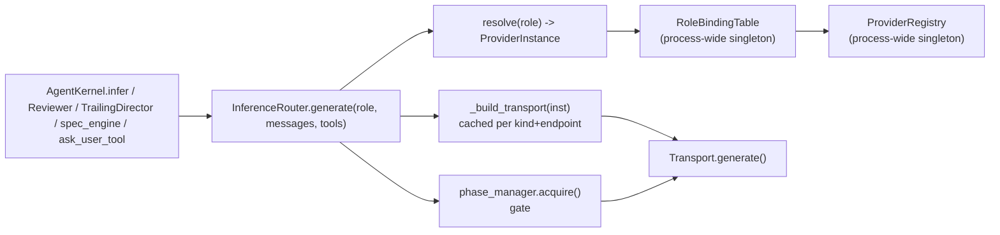

# Model Routing — Provider, Role, and Context-Window Resolution

**IRIS Voice · as-built 2026-07-29**

---

## How to read this document

Same discipline as `CADUCEAN_ARCHITECTURE.md`: every behavioral claim cites `file:line`;
anything that cannot be traced is marked `UNVERIFIED`. This document does not repeat
`CADUCEAN_ARCHITECTURE.md` §6 (quota identity) — it cross-references it and does not
restate its reasoning differently.

---

## 1. The one chokepoint

Every LLM call in the system funnels through
[`InferenceRouter.generate()`](../../backend/agent/inference/router.py) — `router.py:530-594`.
`AgentKernel.infer` routes there, and so do the Reviewer, TrailingDirector, spec_engine,
`ask_user_tool`, and the memory distillation/skills/working paths (`CADUCEAN_ARCHITECTURE.md`
§6). This document is about what happens *before* the gate — how a `role` string becomes a
concrete provider, transport, and model — not the scheduling that happens *at* it.



**Why one gate matters.** Adding a fifth loop that needs an LLM costs nothing — it calls
`generate(role, ...)` and inherits routing, quota metering, and phase scheduling for free.
No loop file is modified to be scheduled (`router.py:73-105`, `CADUCEAN_ARCHITECTURE.md` §6).
The alternative — each loop building its own client — would mean N places to fix a rate-limit
bug instead of one.

---

## 2. Registry, roles, and resolution

Two process-wide singletons, both created once per process and shared by every kernel and the
API endpoint (`registry.py:53-68`, `roles.py:132-148`):

- **`ProviderRegistry`** — `id -> ProviderInstance`. Thread-safe, one lock around all mutation
  (`registry.py:16-51`).
- **`RoleBindingTable`** — `role -> RoleBinding(instance_id, model_override)`. Roles are
  canonicalized (`reasoning`/`brain`/`think`/`reason` -> `reasoning`;
  `tool_execution`/`tool`/`execution`/`exec`/`tools` -> `tool_execution`,
  `roles.py:115-129`), so the various spellings used across the codebase collapse onto the same
  binding.

`InferenceRouter.resolve(role)` (`router.py:425-440`) tries the exact role first, then falls
back to `self._default_role` (established once in `_apply_config`: prefer `"reasoning"`, else
the first bound role — `router.py:239-246`). This is what lets DER's internal `"EXECUTION"`
label resolve to a working provider even though nothing ever explicitly binds `"EXECUTION"`.

**One collection holds everything.** `ProviderRegistry` and `RoleBindingTable` are not per-kernel
— every `InferenceRouter` instance and every WebSocket session reads the *same* registry
(`registry.py:53-56`). Two sessions cannot disagree about which models exist or which provider
serves which role, because there is only one place either fact can live.

---

## 3. Quota identity, not provider identity

Full reasoning lives in `CADUCEAN_ARCHITECTURE.md` §6 — this section only pins the concrete
implementation and does not re-derive the argument.

```python
# rate_meter.py:89-100
def quota_key(inst: ProviderInstance) -> str:
    _cred = get_secret(inst.id) or getattr(inst, "api_key", "") or ""
    _h = hashlib.sha256(_cred.encode("utf-8")).hexdigest()[:12] if _cred else "nocred"
    return f"{inst.api_base_url}|{_h}"
```

Concretely a string `"<api_base_url>|<sha256(credential)[:12]>"`, not a tuple — the notation
`(api_base_url, sha256(credential)[:12])` in `CADUCEAN_ARCHITECTURE.md` §6 describes the two
components of that identity, which this implementation concatenates rather than pairs. As that
section explains: keying by `ProviderInstance.id` over-partitions (two logical instances sharing
one quota each learn from half the traffic and their ceilings can jointly exceed the real limit);
keying by `api_base_url` alone under-partitions (two accounts on the same endpoint corrupt each
other's ceiling). Quota identity is the only key correct in both directions, and the same key
groups the phase scheduler's coupling oscillators (`phase_manager.py:14`, `router.py:41,581-584`).

`metered(inst)` (`rate_meter.py:103-105`) restricts metering to `ProviderKind.API` — local and
open-weight providers are not rate-limited against an external quota, so their window is never
registered as metered (`router.py:501-503`).

---

## 4. The unified provider collection

### 4.1 One record, not two fields that can disagree

```python
# iris_config.py:182-203
@dataclass
class ProviderEntry:
    id: str
    label: str
    kind: str            # "API" | "LOCAL_OPENAI" | "OLLAMA" | "LM_STUDIO"
    model: str = ""
    purpose: str = "chat"  # chat | embedding | rerank
    endpoint: str = ""
    cred_ref: str = ""    # keyring key; empty => no credential
    model_path: str = ""
    profile: str = "balanced"
```

`endpoint` and `cred_ref` are fields of the *same* record (`iris_config.py:186-192`), so a
mismatched pair — an endpoint with no credential, or a credential with no endpoint — is
unrepresentable as a stored `ProviderEntry`. The credential itself is never a field value; only
`cred_ref` (the keyring key, `== id` for API providers) is persisted. The secret lives in
`keyring.py` — OS-backed via the `keyring` library, falling back to a JSON file at
`data/provider_secrets.json` when the library is unavailable (`keyring.py:1-10, 26-32`) — keyed
by provider id, never logged (`keyring.py:8-9`).

`has_key` is what crosses to the frontend: `ProviderInstance.to_dict()` resolves whether a
credential exists (attached `api_key` first, else a keyring lookup) and emits a **boolean**
(`provider.py:61-86`). No key or key fragment is ever included in the payload — this is pinned
by CT-F6/CT-S1-class contract tests (see §8).

### 4.2 `purpose` — chat vs. non-bindable

`purpose` (`"chat" | "embedding" | "rerank"`, default `"chat"`) lets non-chat providers be
declared and later excluded without a separate code path (`provider.py:36-38`,
`iris_config.py:190-191`). Two encoder providers register this way at router init
(`provider.py:115-151`): `embedding:lfm25-emb-350m` unconditionally, `rerank:lfm25-colbert-350m`
only behind `IRIS_ENABLE_COLBERT` — deferred until its retrieval quality is measured
(`provider.py:120-123`).

The exclusion is enforced at the **UI candidate-list** level, not by a backend guard on the bind
call itself:

- `ModelSwitcher.tsx:89-97` filters `providers` to `!p.purpose || p.purpose === "chat"` before
  building switcher options.
- `ModelInferenceSection.tsx:80-89` applies the identical filter (`chatProviderOptions`) for the
  settings-panel Brain/Tool selectors.

`RoleBindingTable.bind()` (`roles.py:55-68`) itself performs no purpose check — it is a pure
`instance_id` lookup. **UNVERIFIED as a backend invariant**: a direct `bind_role("reasoning",
"embedding:lfm25-emb-350m")` call would succeed at the data-layer; the guarantee that non-chat
providers are "never bindable" holds only as long as every caller goes through the two filtered
UI surfaces above. This is a real gap between the stated rule and what the code enforces — flagged
here rather than smoothed over.

### 4.3 Atomic writes — keyring first, then config, then the live registry

```
write_provider(entry, credential):
    1. new provider + (endpoint XOR credential present)  -> reject
    2. set_secret(entry.id, credential)          # keyring FIRST
    3. load_config(); cfg.providers[id] = entry; save_config(cfg)   # best-effort
    4. registry.add(ProviderInstance(...))       # live process state, always
```
(`router.py:357-414`)

For a **new** provider, `endpoint` and `credential` must arrive together — one without the other
is rejected before anything is written (`router.py:379-386`). For an **existing** provider,
endpoint-only or key-only edits are permitted, because the record is already complete.

**Why keyring-then-config, in that order (D-5):** if the config write crashes after the keyring
write succeeds, the previous `ProviderEntry` is still intact — the keyring write is additive and
the live registry still holds the prior instance — so a half-written provider can never reach a
peer or degrade an existing binding. Reversing the order (config first) would let a crash leave a
config entry pointing at a credential that was never actually stored.

The config-persist step is deliberately best-effort (`try/except`, `router.py:392-403`) — a
missing config file must never prevent the live registry from being the source of truth for the
running process.

### 4.4 Flat-config migration

`InferenceConfig.migrate_flat_to_collection()` (`iris_config.py:309-398`) runs once, gated on
`config_version` — **not** on "are flat fields present", which would re-run forever
(`iris_config.py:313-315, 321-326`). If `providers` is already non-empty it is treated as
authoritative and the flat fields are ignored, never merged (`iris_config.py:323-326`) —
collection wins over flat. A single pass migrates both the flat API provider
(`api_base_url`/`api_key`) and the flat local model (`local_model_*`), moves any migrated key into
the keyring, and rewrites `role_bindings` so a literal `"local"` `instance_id` becomes its
namespaced form (`iris_config.py:387-397`, mirrored in `router.py:159-181` for configs applied
directly rather than loaded from disk).

---

## 5. Context-window resolution

### 5.1 Precedence

`AgentKernel.resolve_context_window_with_source()` (`agent_kernel.py:981-1045`) resolves in this
order, and tags which tier won:

1. **override** — an explicit per-model entry in `_context_window_overrides` (`:998-1000`).
2. **authoritative** — the *actually loaded* local model's real `n_ctx`
   (`LocalModelManager._current_params["n_ctx"]`, `:1002-1018`). This is source-of-truth for a
   local model: it was launched with a specific `n_ctx`, and no name-based guess should outrank
   the real number.
3. **table** — `(provider, model-substring)` lookup in `_KNOWN_CONTEXT_WINDOWS`
   (`:909-979, 1020-1026`), then a local-profile-id fallback (`:1028-1038`).
4. **default** — a conservative `8_192`, logged with its source so an unknown window is *visible*
   rather than silent (`:1040-1045`).

```python
# der_constants.py:19-26
@dataclass(frozen=True)
class ResolvedWindow:
    tokens: int
    source: str  # "override" | "authoritative" | "table" | "default"
```

Tagging the source is the whole point (`der_constants.py:22-26`): a boolean "was this a default"
is the smallest signal that makes an unknown window visible instead of a plausible-looking number
with no provenance.

### 5.2 The invariant: over-stated is worse than under-stated

**A too-high window default is worse than a too-low one.** DER's budget derives from the window
as `budget ~= window * DER_WINDOW_UTILISATION * mode_fraction` (`der_constants.py:170-190`,
`DER_WINDOW_UTILISATION = 0.9` at `:123`). If the *window itself* is over-stated, every downstream
budget inherits the inflation, and every call to the real (smaller) model silently truncates —
there is no error, just quietly-dropped context. Under-stating the window costs some unused
headroom; over-stating it recreates overcommit. This is why the table has no
provider-wide fallback rows and the default is deliberately conservative
(`agent_kernel.py:938-960`, discussed in §6 below).

### 5.3 DER's budget: a fraction of the window, never an absolute floor beating it

```python
# der_constants.py:170-190
def resolve_der_token_budget(context_window: int, task_class: Optional[str]) -> int:
    _window_cap = max(int(context_window * DER_WINDOW_UTILISATION), 1)   # 0.9
    _mode_ceiling = int(_window_cap * _mode_fraction(task_class))        # per-class SHARE
    _budget = min(_mode_ceiling, _window_cap)
    return max(_budget, min(DER_BUDGET_MIN_FLOOR, _window_cap))          # floor clamped by window
```

`DER_MODE_WINDOW_FRACTION` (`der_constants.py:142-156`) expresses each task class as a **share**
of the usable window — `quick: 0.10`, `agentic: 0.40`, `full: 0.90` — so a 256k-window model
actually gets ~207k for a `full` task instead of a flat absolute number tuned for an 8k-32k era.
`DER_BUDGET_MIN_FLOOR = 4_000` (`:118`) is the *only* floor, and it is itself clamped by
`_window_cap` (`:190`), so it can never reintroduce an overcommit on a small model.
`agent_kernel.py:5415-5416` is the call site: `_token_budget = resolve_der_token_budget(window,
task_class)`.

---

## 6. Defects this design is shaped by

Each of these shipped, passed its tests at the time, and left a rule behind.

**1. The substring guess used to outrank the loaded model's real `n_ctx`.**
`resolve_context_window` originally ran the `(provider, substring)` table lookup *before* the
authoritative loaded-`n_ctx` branch, so a 16k-loaded Mistral could report `32_768` from a table
row instead of its actual window. Fixed by ordering the authoritative branch second, ahead of the
table (`agent_kernel.py:990-993, 1002-1026`) — the comment at the fix site states the invariant
directly: *"a loaded model's real `n_ctx` outranks a name-based guess."*

**2. The per-mode absolute floor beat the derived budget for any small model — a ~4.9x
overcommit.**
Before `der_constants.py:170-190`, DER's budget was `max(window * 0.9, DER_TOKEN_BUDGETS[class])`.
Every table entry sat in `15_000-80_000` (`der_constants.py:83-105`), so the floor won for any
model under ~44k tokens of window. An 8,192-token window produced `budget=40,000` —
`40,000 / 8,192 ~= 4.9x` the actual window — while every call to that window silently truncated
(`der_constants.py:108-118` documents the history and states the fix's invariant: *"The floor must
never exceed the window it is protecting"*). The fix inverted the relationship: the table values
became **ceilings** (a share of the window a task class *may* use), and `DER_BUDGET_MIN_FLOOR =
4_000` — itself clamped by the window — became the only floor.

**3. A migrated credential sat in plaintext in `iris_config.json` until the keyring write was
confirmed.**
`migrate_flat_to_collection()` moves the flat `api_key` into the keyring and only then clears the
flat field (`iris_config.py:349-372`). The nuance that matters: the flat field is cleared **only
after** `set_secret()` succeeds (`:366-372`) — if the keyring write raises, the flat field is left
in place, unmigrated, and the failure is logged (`:354-365`). Losing the user's only copy of the
key by clearing it optimistically is judged worse than the (already-existing) plaintext-in-config
risk; the comment at the site states this explicitly.

**4. `"lmstudio"` (no underscore) fell through to the API catch-all.**
`InferenceConfig.provider` vocabulary uses `"lm_studio"` (underscore); older call sites and UI
presets wrote `"lmstudio"`. `_legacy_kind()` originally matched only one spelling, so every
`lmstudio`-spelled config silently resolved to `ProviderKind.API` instead of `LOCAL_OPENAI` — a
local server dispatched as if it needed a Bearer API key. Fixed by accepting both spellings in one
set (`router.py:248-268`, specifically `:259-261`).

**5. Encoder registration made the legacy-config guard permanently false.**
`InferenceRouter.__init__` registers the non-chat encoder providers (`register_builtin_encoder_
providers()`) *before* `_apply_config` runs (`router.py:90-96` then `:109`). The legacy-config
synthesis path used to guard on `not self._registry.list()` — "registry is empty" — but the
registry now always holds at least `embedding:lfm25-emb-350m` by the time that guard runs, so it
was always `False`, and a pure-legacy config (no `providers` collection) never got `reasoning` /
`tool_execution` bound at all: `roles: []`, `default_role: None`. Fixed by testing what the guard
actually means — "is there a **chat**-purpose provider already registered" — so the encoder's
presence (purpose `"embedding"`) cannot suppress legacy synthesis (`router.py:183-202`, the fix and
its rationale are inlined as a comment at the exact guard).

**6. A bare provider-wide table row matched every OpenRouter model from 4k to 2M context.**
`("openrouter", "", 32_000)` was a substring fallback with an empty substring, so it matched *any*
OpenRouter model regardless of that model's real window — an 8k-window model inherited a budget
sized for 32k and silently truncated on every call (the exact case REQ-2 AC6 / the silent-failure
table in `specs/PHASES.md` describes). Removed 2026-07-29, with no replacement row
(`agent_kernel.py:944-960`). An unlisted OpenRouter model now falls through to the conservative
`8_192` default, tagged `source="default"` so it is visible. The comment records the correct
long-term fix as an open question: resolving OpenRouter's real window from its `/models` metadata
— an *authoritative* source — rather than any table guess (`agent_kernel.py:958-960`).

**7. `write_provider`'s failure handler raised out of itself.**
The `except` clause around the best-effort config persist referenced `self._logger`, which does
not exist on `InferenceRouter` — the handler that exists specifically to swallow a persist failure
instead raised `AttributeError` out of it. Fixed by using the module-level `logger`
(`router.py:399-403`); the comment at the site names the mistake directly so it is not repeated.

---

## 7. How to verify

```
scripts/validate_phase1_foundation.py   11 assertions: CT-F1..CT-F9, budget<=window for every
                                         (window,class) pair, budget/work-units share one window,
                                         no provider-wide table default exceeds the conservative
                                         default, no credential/fragment in any written config or
                                         /api/inference/state response, endpoint+cred_ref
                                         completeness, two providers keep independent credentials,
                                         pre-upgrade migration is idempotent, routing resolves
                                         identically for all four `provider` values, no registry id
                                         is the bare literal "local".

scripts/validate_switcher.py            7 assertions: CT-S1..CT-S5, no credential/fragment in
                                         /api/inference/state, switcher candidate list excludes
                                         purpose != "chat" and any provider missing has_key/loaded,
                                         context:usage identical shape+denominator on the DER and
                                         direct paths, ContextPillProps unchanged, every removed
                                         Send-button guard still blocks Enter.
```

Every assertion in both harnesses was proven able to FAIL before it was trusted to pass — a green
run on a harness that was never watched go red is not evidence (the same standard
`CADUCEAN_ARCHITECTURE.md` §9 holds its own harnesses to).

---

## 8. Reading order

1. `CADUCEAN_ARCHITECTURE.md` §6 — quota identity and the scheduling layer this document's
   chokepoint feeds into.
2. This document §1-§3 — the chokepoint and the identity key it carries.
3. This document §4-§5 — the provider collection and context-window resolution.
4. `specs/phase-1-foundation/` and `specs/phase-5-switcher/` — the requirements these sections
   implement.
