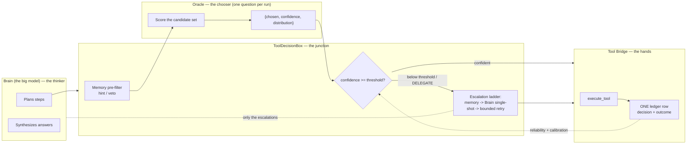
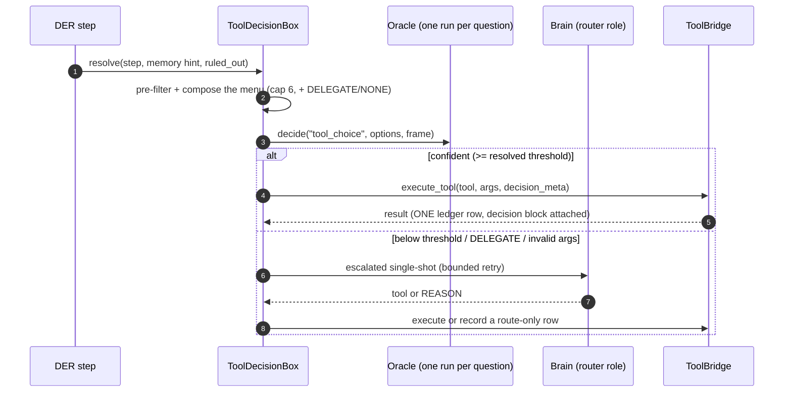
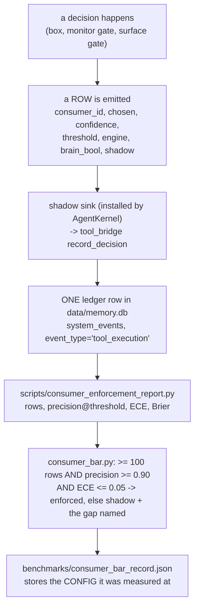

# Oracle — Decision Engine Architecture & Operations

> **Renamed 2026-09-26 (owner): "Decision Engine" is now Oracle.** This file was
> `tool-decision-engine.md`. The engine's *name* is Oracle; the *model* it runs
> keeps its own identity, and that distinction is load-bearing — see §2.
>
> **Last verified: 2026-09-26 (session 360)** against the running app, not against
> memory. Every number below says where it came from. Anything not re-measured is
> marked as such. The previous revision described the retired LFM build
> (`LFM2-350M-Extract Q4_K_M` via llama-cpp-python, `softmax_tau=0.5`, an 0.85
> threshold, 3 consumers) and was wrong in every one of those respects.

---

## 1. What Oracle is

A resident, in-process, **CPU-only** scorer inside the IRIS backend. It answers
one question at a time against a caller-supplied feature frame and returns a
probability distribution. It is the local reproduction of the JEV "System One"
shape: a closed output space, calibrated probabilities, no prose.

| Fact | Value | Where it comes from |
|---|---|---|
| Model | GLiNER2.5-Decide, torch-free **ONNX** export | `backend/agent/decision_backend_onnx.py` |
| Model directory | `C:\temp\gliner-onnx` on this box | `resolve_model_dir(None)` |
| Backend identity | `gliner25-decide-onnx-int8` | `GlinerOnnx.backend_id` |
| Provider | `CPUExecutionProvider` only — **zero VRAM** | `decision_backend_onnx.py` session options |
| Fallback model | **None, by design.** A missing model degrades to the legacy path | AC21.4 |
| Writes | Nothing. Read set = the args; write set = the return value, counters, log lines | `test_readonly_engine.py` |
| Questions per run | **One.** Batched scoring was removed — see §9 | commit `330d973e` |

## 2. Name vs key — read this before renaming anything

Three strings are easy to confuse and only one of them is renameable.

| String | What it is | Renameable? |
|---|---|---|
| `Oracle` | the engine's **display** name (`ENGINE_NAME`, `DecisionEngine.name`, `effective_config()["name"]`, the log lines, this doc) | yes — it is a label |
| `oracle` | the **config block id** in `backend/agent/agent_config.yaml` that `load_engine_config` looks up | yes, but it is a settings migration (the block moves with it) |
| `gliner25-decide-onnx-int8` | the **backend identity** | **no** — it `KEYS` the calibrated threshold |

Why the third one is different. A probability threshold is only meaningful for
the distribution it was measured on. `backend_thresholds` in the config maps
*backend identity → threshold*, and the engine looks up the identity of the
backend that is actually loaded. Rename the key and every measured curve becomes
unaddressable, so enforcement fail-closes and the engine stops deciding alone.
That is a recalibration, not a rename.

## 3. The separation — who thinks, who decides, who acts



The three rules that keep the layers honest:

1. **Oracle never writes the world.** Its only output is a score table. The
   single ledger writer is `AgentToolBridge._record_tool_event` (or
   `record_decision` for a route-only row); engine metadata rides the SAME row
   as the tool outcome, never a second event.
2. **The Brain never picks cheap.** Routine selection costs no reasoning call.
   The Brain sees below-threshold picks, `DELEGATE`, and broken args.
3. **Neither guesses the pass mark.** It is resolved per active backend from
   measured data, and a backend with no measurement is refused (§5).

## 4. The decision path, as it actually runs



Measured live on this box (`Oracle decide ...` log lines, 2026-09-26):
`tool_choice` 137-171 ms, `mode` 111 ms, `review_verdict` 143 ms,
`escalate_incomplete` 331 ms. The cost is per question, not per menu item —
see §8 for the stage split.

## 5. Thresholds — keyed by backend, fail-closed

Resolution order, in `ToolDecisionBox._resolve_decision_threshold`:

1. an **explicit caller value** (tests, and callers that know their curve);
2. the **active backend's** entry via `EngineConfig.threshold_for(consumer)`;
3. **no enforcement** — `_NEVER_ENFORCE_THRESHOLD` (above any probability), with
   a WARNING naming the backend.

A deployed menu width that differs from the calibrated width also resolves to
"no enforcement" (`threshold_stale`, AC25.5). With **no engine at all** the
legacy 0.85 stands, so engine-free unit suites keep their behaviour.

Shipped values (`agent_config.yaml`):

| Backend identity | Threshold | Meaning |
|---|---|---|
| `gliner25-decide-onnx-int8` | **0.40** | the deployed operating point, derived from the coverage/accuracy curve at cap 6 |
| `lfm2-350m-extract` | 0.85 | historical only — the retired model's sharpened softmax |

**Measured defect, fixed 2026-09-26.** The box used to hardcode 0.85 and the
kernel never passed a value, so EVERY decision was judged against the retired
LFM curve whatever backend was live, and the wrong number is what the ledger
recorded. A real row read: `engine=gliner25-decide-onnx-int8`, `threshold=0.85`,
`confidence=0.237`. For any confidence in [0.40, 0.85) that silently changes the
outcome. Pinned by `backend/tests/unit/test_tool_decision_threshold_resolution.py`.

## 6. Consumers (15) and their status

`CONSUMERS` in `decision_engine.py` is the enumeration; the enforcement default
is `tool_choice` only (`IRIS_DECISION_ENFORCE`).

| Group | Consumers | Status 2026-09-26 |
|---|---|---|
| Core | `tool_choice`, `presentation`, `narration` | live; enforcement per the measured bar |
| Recovery | `recovery_strategy`, `retry_same` | shadow |
| Reviewer | `review_verdict` | shadow (scored live) |
| Monitor (Noul) | `sufficient`, `done`, `on_track` | shadow |
| Routing | `mode`, `web_intent` | shadow |
| Surface (REQ-29) | `has_gaps`, `use_thinking`, `escalate_incomplete`, `needs_action` | shadow (scored live) |

Two shapes are used: a **Choice** (an option menu) and a **Noul** (a single
calibrated probability of truth, for the bool monitors). A 2-way softmax is a
different object from a Noul, and the monitor gates depend on that difference.

`tier0_classify` is a recorded **non-fit** — replacing a sub-millisecond
deterministic classifier with a ~150 ms model would be a regression.

## 7. The calibration loop — rows to an enforcement bar

This is the part that decides whether any consumer may act alone, and it is the
part that was broken for most of this project's life. The chain:



### 7.1 What "correct" means (the label rule)

A precision number without a stated label is meaningless, so the instrument
prints its rule:

- A **dispatched** row (a real tool ran) is correct when the event outcome is
  `success`/`reason` — the same rule `calibrate_decision_threshold.py` already
  applies, kept identical on purpose.
- A **shadow** row (Oracle scored, the legacy path decided) is correct when the
  engine's `chosen` AGREES with the Brain's actual `brain_bool`. That agreement
  IS the parity the bar measures. A shadow row with no reference answer is
  counted as **skipped**, never credited as correct.

### 7.2 The row shape (a real row, rowid 1040)

```json
{"consumer_id": "escalate_incomplete", "engine": "gliner25-decide-onnx-int8",
 "chosen": true, "confidence": 0.5106, "brain_bool": false,
 "shadow": true, "route": "shadow", "engine_latency_ms": 331}
```

`brain_bool` is the field the whole bar depends on: the ledger's decision-block
filter used to drop it, which made every shadow row unscoreable. Fixed and
guarded by `backend/tests/contract/test_shadow_row_sink.py`.

### 7.3 What was actually broken (three separate causes, all fixed)

| Symptom | Cause | Fix |
|---|---|---|
| No rows at all | nothing installed the consumer modules' row sink, so rows fell through to a log line | `AgentKernel._shadow_row_sink` + its install in `__init__` |
| Shadow rows unscoreable | the ledger filter dropped `brain_bool` | `_DECISION_META_KEYS` extended |
| Rows never landed even when a step completed | the native C++ writer BLOCKED in-app (the new watchdog caught it: "ledger write for list_directory has not returned after 10s") while the same call worked from an isolated process | `IrisCoreEngine.ingest_event` now prefers the **Python** writer — the one documented to land rows in `system_events` — with the native path as fallback |

Live proof after the fixes: the tool row (1039) and the shadow row (1040) both
landed, and the log shows the write completing in **0.187 s / 0.157 s** with no
watchdog warning.

## 8. Measured performance

Recorded baseline `benchmarks/decision_engine_baseline.json` (backend
`gliner25-decide-onnx-int8`, 8-core host):

| Stage | Cost |
|---|---|
| tokenize | 0.002 ms |
| encode (structure) | 0.028 ms |
| **session run (the model's own compute)** | **165.382 ms** |
| post-process | 0.011 ms |
| p50 / p95 per decision | **166 ms / 198 ms** |
| warm-up (one-off, backgrounded) | 7950 ms |

Session options in the baseline: `ORT_SEQUENTIAL`, `ORT_ENABLE_ALL`,
`intra_op_num_threads=4`, `inter_op_num_threads=1`, `CPUExecutionProvider`.

**Read that table carefully before promising speed.** 99.9 % of the time is the
model computing. One question is therefore at its floor.

Honest levers that do NOT touch the pass mark:

1. score fewer consumers per turn (each one is a full run);
2. reuse the same-question cache (already built: a repeat is free);
3. tune the ORT thread options (same maths, less waiting) — **agreed, not yet
   implemented**;
4. keep the engine warm (already done, background daemon thread).

Levers that DO invalidate the mark (a new identity + a fresh calibration): a
smaller or differently quantised model, a different prompt/instruction shape,
a different menu width.

## 9. What is deliberately NOT here

**Batched multi-question scoring — REMOVED 2026-09-26 (owner decision).**
`decide_many` was deleted from both the backend and the engine, not disabled,
so the mistake cannot be repeated by calling it. The grounds:

- MEASURED with the real model: three DISTINCT questions in one session run
  changed a verdict — batch `no` where the same question scored alone answered
  `yes`. The pre-existing tests only compared a batch of ONE, which is why this
  stayed invisible.
- JEV's fan-out property is **independence**: "one answer is never hidden
  context for another, so adding or removing a question does not move the
  others." Sharing one encoder pass across questions is exactly what breaks
  that, and this export cannot share the read while isolating the questions —
  one run carries one question's context.
- The owner's rule: no parallelism without a no-regression benefit.

A guard test (`backend/tests/behavioral/test_batch_single_encode.py`, 4 tests)
fails loudly if the entry point returns. Re-adding a batch requires a NEW
calibration for the batch shape — not a call site.

**No fallback model.** A missing/incomplete ONNX directory means the engine is
unavailable and callers take the legacy path. Silently substituting another
model would judge every consumer on a curve nobody measured.

**No prose.** Oracle scores; it never writes text. The Brain writes the text,
including on a negative branch.

## 10. Operations

```powershell
# is the engine healthy, and at which operating point?
python scripts/consumer_enforcement_report.py            # rows/precision/ECE per consumer
python scripts/consumer_enforcement_report.py --json     # machine output
python scripts/consumer_enforcement_report.py --write    # + benchmarks/consumer_bar_record.json

# calibration against the ledger (READ-ONLY; refuses below N=50 rows)
python scripts/calibrate_decision_threshold.py --since 2026-09-20

# offline accuracy battery / microbenchmark
python scripts/bench_decision_models.py
python scripts/bench_decision_engine.py

# drive live turns to accumulate rows (internet access is a CAPABILITY gate:
# without --web the kernel has no web tools and a web ask runs no tool at all)
python scripts/accumulate_rows.py --count 5 --delay 30 --web
```

Enforcement flags: `IRIS_DECISION_ENFORCE` (comma list; default `tool_choice`).
An empty value means full shadow — record but never act.

## 11. Open items (honest, 2026-09-26)

1. **ORT thread tuning** — agreed, not implemented. Same maths, so it cannot
   invalidate the mark; needs a measured before/after.
2. **Row volume.** The bar needs >= 100 rows per consumer. The pipeline now
   works, so this is about running real tasks, not about code.
3. **`test_unparseable_json`** was reported as a pre-existing stale red by an
   earlier session. NOT re-verified in this session — do not treat it as
   confirmed either way.
4. **One owner decision outstanding:** batched rows could still be collected as
   shadow-only evidence someday, but nothing should enforce on them.

## 12. Evidence index (verified this session)

| Claim | Evidence |
|---|---|
| Oracle name, logs, config id | `decision_engine.py` (`ENGINE_NAME`), `agent_config.yaml` (`id: oracle`), live `Oracle decide ...` log lines |
| Threshold keyed by backend, fail-closed | `tool_decision.py::_resolve_decision_threshold`; 7 tests in `test_tool_decision_threshold_resolution.py` |
| The 0.85-against-GLiNER defect | ledger row (engine `gliner25-decide-onnx-int8`, threshold 0.85, confidence 0.237) |
| Rows land, with the parity pair | ledger rowid 1040; `[tool-event] ingest ... finished in 0.187s` |
| Tool schemas are valid JSON Schema | `test_tool_schema_normalization.py` (7 tests, incl. the real 14-tool list) |
| Batched scoring gone | `test_batch_single_encode.py` guard; commit `330d973e` |
| Performance split | `benchmarks/decision_engine_baseline.json` |

---

**Superseded material.** The previous revision of this document described the
LFM2-350M-Extract build (`llama-cpp-python`, `softmax_tau=0.5` sharpening, an
0.85 global threshold, three consumers, a head-KV cache). All of it is retired:
the model is GLiNER2.5-Decide via ONNX, the sharpening is deleted, the pass mark
is 0.40 keyed by backend identity, there are fifteen consumers, and the head
cache has no meaning for an encoder. The history lives in
`specs/tool-decision-engine-improvements/` and in the commits, not here.


