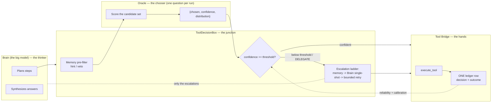
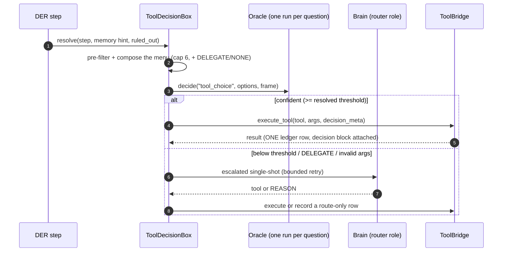
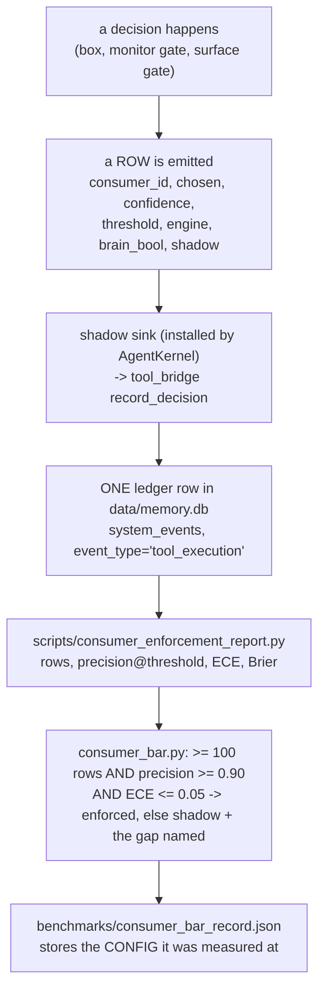
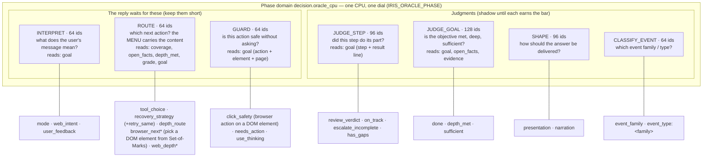
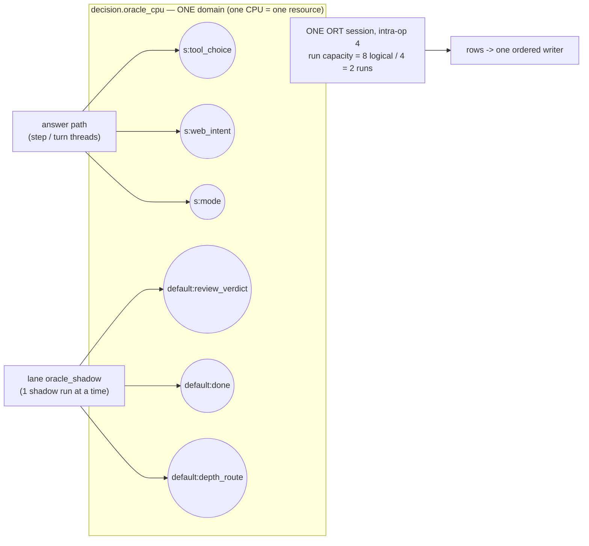

# Oracle — Decision Engine Architecture & Operations

> **Renamed 2026-09-26 (owner): "Decision Engine" is now Oracle.** This file was
> `tool-decision-engine.md`. The engine's *name* is Oracle; the *model* it runs
> keeps its own identity, and that distinction is load-bearing — see §2.
>
> **2026-10-01: start at §19 (Jobs)** — every consumer belongs to a job that fixes its
> input, budget and shadow path; the job diagram is there. Sections below §19 that
> describe per-site inputs are history.
>
> **Last verified: 2026-09-26 (session 360)** against the running app, not against
> memory. Every number below says where it came from. Anything not re-measured is
> marked as such. The previous revision described the retired LFM build
> (`LFM2-350M-Extract Q4_K_M` via llama-cpp-python, `softmax_tau=0.5`, an 0.85
> threshold, 3 consumers) and was wrong in every one of those respects.

---

## 1. What Oracle is

A resident, in-process, **CPU-only** scorer inside the IRIS backend. It answers
one question at a time against a caller-supplied feature frame and returns a
probability distribution. It is the local reproduction of the JEV "System One"
shape: a closed output space, calibrated probabilities, no prose.

| Fact | Value | Where it comes from |
|---|---|---|
| Model | GLiNER2.5-Decide, torch-free **ONNX** export | `backend/agent/decision_backend_onnx.py` |
| Model directory | `C:\temp\gliner-onnx` on this box | `resolve_model_dir(None)` |
| Backend identity | `gliner25-decide-onnx-int8` | `GlinerOnnx.backend_id` |
| Provider | `CPUExecutionProvider` only — **zero VRAM** | `decision_backend_onnx.py` session options |
| Fallback model | **None, by design.** A missing model degrades to the legacy path | AC21.4 |
| Writes | Nothing. Read set = the args; write set = the return value, counters, log lines | `test_readonly_engine.py` |
| Questions per run | **One.** Batched scoring was removed — see §9 | commit `330d973e` |

## 2. Name vs key — read this before renaming anything

Three strings are easy to confuse and only one of them is renameable.

| String | What it is | Renameable? |
|---|---|---|
| `Oracle` | the engine's **display** name (`ENGINE_NAME`, `DecisionEngine.name`, `effective_config()["name"]`, the log lines, this doc) | yes — it is a label |
| `oracle` | the **config block id** in `backend/agent/agent_config.yaml` that `load_engine_config` looks up | yes, but it is a settings migration (the block moves with it) |
| `gliner25-decide-onnx-int8` | the **backend identity** | **no** — it `KEYS` the calibrated threshold |

Why the third one is different. A probability threshold is only meaningful for
the distribution it was measured on. `backend_thresholds` in the config maps
*backend identity → threshold*, and the engine looks up the identity of the
backend that is actually loaded. Rename the key and every measured curve becomes
unaddressable, so enforcement fail-closes and the engine stops deciding alone.
That is a recalibration, not a rename.

## 3. The separation — who thinks, who decides, who acts



The three rules that keep the layers honest:

1. **Oracle never writes the world.** Its only output is a score table. The
   single ledger writer is `AgentToolBridge._record_tool_event` (or
   `record_decision` for a route-only row); engine metadata rides the SAME row
   as the tool outcome, never a second event.
2. **The Brain never picks cheap.** Routine selection costs no reasoning call.
   The Brain sees below-threshold picks, `DELEGATE`, and broken args.
3. **Neither guesses the pass mark.** It is resolved per active backend from
   measured data, and a backend with no measurement is refused (§5).

## 4. The decision path, as it actually runs



Measured live on this box (`Oracle decide ...` log lines, 2026-09-26):
`tool_choice` 137-171 ms, `mode` 111 ms, `review_verdict` 143 ms,
`escalate_incomplete` 331 ms. The cost is per question, not per menu item —
see §8 for the stage split.

## 5. Thresholds — keyed by backend, fail-closed

Resolution order, in `ToolDecisionBox._resolve_decision_threshold`:

1. an **explicit caller value** (tests, and callers that know their curve);
2. the **active backend's** entry via `EngineConfig.threshold_for(consumer)`;
3. **no enforcement** — `_NEVER_ENFORCE_THRESHOLD` (above any probability), with
   a WARNING naming the backend.

A deployed menu width that differs from the calibrated width also resolves to
"no enforcement" (`threshold_stale`, AC25.5). With **no engine at all** the
legacy 0.85 stands, so engine-free unit suites keep their behaviour.

Shipped values (`agent_config.yaml`):

| Backend identity | Threshold | Meaning |
|---|---|---|
| `gliner25-decide-onnx-int8` | **0.40** | the deployed operating point, derived from the coverage/accuracy curve at cap 6 |
| `lfm2-350m-extract` | 0.85 | historical only — the retired model's sharpened softmax |

**Measured defect, fixed 2026-09-26.** The box used to hardcode 0.85 and the
kernel never passed a value, so EVERY decision was judged against the retired
LFM curve whatever backend was live, and the wrong number is what the ledger
recorded. A real row read: `engine=gliner25-decide-onnx-int8`, `threshold=0.85`,
`confidence=0.237`. For any confidence in [0.40, 0.85) that silently changes the
outcome. Pinned by `backend/tests/unit/test_tool_decision_threshold_resolution.py`.

## 6. Consumers (15) and their status

`CONSUMERS` in `decision_engine.py` is the enumeration; the enforcement default
is `tool_choice` only (`IRIS_DECISION_ENFORCE`).

| Group | Consumers | Status 2026-09-27 |
|---|---|---|
| Core | `tool_choice`, `presentation`, `narration` | `tool_choice` 65 rows on the ACTIVE engine, precision 1.0 (§16); `presentation` 123 rows, all written before the reference fix; `narration` newly wired (§14.3) |
| Recovery | `recovery_strategy`, `retry_same` | `recovery_strategy` scoring since its criteria were registered; `retry_same` has NO row of its own — it rides `recovery_strategy` as `retry_same_offered` |
| Reviewer | `review_verdict` | scoring; fires per step, so it needs completed work |
| Monitor (Noul) | `sufficient`, `done`, `on_track` | NO ROWS YET — they fire on completion, and the traffic's web steps were failing (§15) |
| Routing | `mode`, `web_intent` | `mode` past 100 rows with precision 1.0; `web_intent` scoring since its row path was wired |
| Surface (REQ-29) | `has_gaps`, `use_thinking`, `escalate_incomplete`, `needs_action` | `escalate_incomplete` scoring; the other three have no rows yet (they need a completed step or a reasoning-style prompt) |

**`CONSUMERS` is DOCUMENTATION, not a gate** (2026-09-27). Reading it as "the
only consumers that can exist" is what made this list look like a wall. A new
decision point now measures itself without being added here — see §17.2.

Two shapes are used: a **Choice** (an option menu) and a **Noul** (a single
calibrated probability of truth, for the bool monitors). A 2-way softmax is a
different object from a Noul, and the monitor gates depend on that difference.

`tier0_classify` is a recorded **non-fit** — replacing a sub-millisecond
deterministic classifier with a ~150 ms model would be a regression.

## 7. The calibration loop — rows to an enforcement bar

This is the part that decides whether any consumer may act alone, and it is the
part that was broken for most of this project's life. The chain:



### 7.1 What "correct" means (the label rule)

A precision number without a stated label is meaningless, so the instrument
prints its rule:

- A **dispatched** row (a real tool ran) is correct when the event outcome is
  `success`/`reason` — the same rule `calibrate_decision_threshold.py` already
  applies, kept identical on purpose.
- A **shadow** row (Oracle scored, the legacy path decided) is correct when the
  engine's `chosen` AGREES with the Brain's actual `brain_bool`. That agreement
  IS the parity the bar measures. A shadow row with no reference answer is
  counted as **skipped**, never credited as correct.

### 7.2 The row shape (a real row, rowid 1040)

```json
{"consumer_id": "escalate_incomplete", "engine": "gliner25-decide-onnx-int8",
 "chosen": true, "confidence": 0.5106, "brain_bool": false,
 "shadow": true, "route": "shadow", "engine_latency_ms": 331}
```

`brain_bool` is the field the whole bar depends on: the ledger's decision-block
filter used to drop it, which made every shadow row unscoreable. Fixed and
guarded by `backend/tests/contract/test_shadow_row_sink.py`.

### 7.3 What was actually broken (three separate causes, all fixed)

| Symptom | Cause | Fix |
|---|---|---|
| No rows at all | nothing installed the consumer modules' row sink, so rows fell through to a log line | `AgentKernel._shadow_row_sink` + its install in `__init__` |
| Shadow rows unscoreable | the ledger filter dropped `brain_bool` | `_DECISION_META_KEYS` extended |
| Rows never landed even when a step completed | the native C++ writer BLOCKED in-app (the new watchdog caught it: "ledger write for list_directory has not returned after 10s") while the same call worked from an isolated process | `IrisCoreEngine.ingest_event` now prefers the **Python** writer — the one documented to land rows in `system_events` — with the native path as fallback |

Live proof after the fixes: the tool row (1039) and the shadow row (1040) both
landed, and the log shows the write completing in **0.187 s / 0.157 s** with no
watchdog warning.

## 8. Measured performance

Recorded baseline `benchmarks/decision_engine_baseline.json` (backend
`gliner25-decide-onnx-int8`, 8-core host):

| Stage | Cost |
|---|---|
| tokenize | 0.002 ms |
| encode (structure) | 0.028 ms |
| **session run (the model's own compute)** | **165.382 ms** |
| post-process | 0.011 ms |
| p50 / p95 per decision | **166 ms / 198 ms** |
| warm-up (one-off, backgrounded) | 7950 ms |

Session options in the baseline: `ORT_SEQUENTIAL`, `ORT_ENABLE_ALL`,
`intra_op_num_threads=4`, `inter_op_num_threads=1`, `CPUExecutionProvider`.

**Read that table carefully before promising speed.** 99.9 % of the time is the
model computing. One question is therefore at its floor.

Honest levers that do NOT touch the pass mark:

1. score fewer consumers per turn (each one is a full run);
2. reuse the same-question cache (already built: a repeat is free);
3. tune the ORT thread options (same maths, less waiting) — **already tuned and
   RE-MEASURED 2026-09-26 on this box**; see below;
4. keep the engine warm (already done, background daemon thread).

Levers that DO invalidate the mark (a new identity + a fresh calibration): a
smaller or differently quantised model, a different prompt/instruction shape,
a different menu width.

### 8.1 The intra-op thread count is already at its optimum

`_OnnxRunner` sets `intra_op_num_threads = cpu_count // 2` (4 on an 8-logical-core
host), `inter_op_num_threads = 1`, `ORT_ENABLE_ALL`, `ORT_SEQUENTIAL`,
`CPUExecutionProvider`. Re-measured 2026-09-26 with
`scripts/bench_oracle_threads.py` (20 runs per setting, shipped 6-tool menu,
same box):

| intra-op | p50 | p95 | vs the optimum |
|---|---|---|---|
| 1 | 316.9 ms | 338.8 ms | 2.06x slower |
| 2 | 194.9 ms | 213.8 ms | 1.27x slower |
| **4 (shipped)** | **153.9 ms** | **189.7 ms** | — |
| 8 (all cores) | 186.6 ms | 273.2 ms | 1.21x slower at p50, 1.44x at p95 |

Two facts worth keeping: `os.cpu_count()` reports LOGICAL processors while ORT's
intra-op pool wants PHYSICAL cores (hence `// 2`), and "use every core" is a
REGRESSION here, worst at p95. The shipped value stands; no code change was
needed, and the earlier session's numbers were reproduced independently
(181 ms then, 153.9 ms now — a faster box under the same settings).

Threads do not change the maths, so this lever can never invalidate the
threshold. `scripts/bench_oracle_threads.py` re-derives the optimum on any host.

### 8.2 Thread affinity and spinning — measured, not shipped (2026-10-01)

Asked: can the ORT session go faster on this CPU (i7-7700, 4 cores / 8 logical)?
`benchmarks/oracle_ort_options_bench.py` (intra-op 4 kept; 40 alone + 2x20 overlapping
decisions per variant; every distribution compared bitwise — all identical):

| Variant | alone p50 | overlap p50 / p95 | decisions/s |
|---|---|---|---|
| shipped (spinning on, no affinity) | 125-144 ms | 201-203 / 219-286 ms | 9.1-9.9 |
| `session.intra_op.allow_spinning=0` | 117-142 ms | 193-203 / 202-239 ms | 9.7-10.3 |
| affinity, one pool thread per physical core (`3;5;7`) | 139 ms | 207 / 229 ms | 9.5 |
| affinity + spinning off | 134 ms | 215 / 268 ms | 9.0 |

Affinity is slower. Spinning off moved within the run-to-run noise (three runs: better,
worse, better). `ORT_ENABLE_ALL` and the thread counts were already set (§8.1). Nothing
shipped: the CPU path is at its floor for this model; the levers that remain are a shorter
input (§19) or a different model (a new calibrated identity).


## 9. What is deliberately NOT here

**Batched multi-question scoring — REMOVED 2026-09-26 (owner decision).**
`decide_many` was deleted from both the backend and the engine, not disabled,
so the mistake cannot be repeated by calling it. The grounds:

- MEASURED with the real model: three DISTINCT questions in one session run
  changed a verdict — batch `no` where the same question scored alone answered
  `yes`. The pre-existing tests only compared a batch of ONE, which is why this
  stayed invisible.
- JEV's fan-out property is **independence**: "one answer is never hidden
  context for another, so adding or removing a question does not move the
  others." Sharing one encoder pass across questions is exactly what breaks
  that, and this export cannot share the read while isolating the questions —
  one run carries one question's context.
- The owner's rule: no parallelism without a no-regression benefit.

A guard test (`backend/tests/behavioral/test_batch_single_encode.py`, 4 tests)
fails loudly if the entry point returns. Re-adding a batch requires a NEW
calibration for the batch shape — not a call site.

**No fallback model.** A missing/incomplete ONNX directory means the engine is
unavailable and callers take the legacy path. Silently substituting another
model would judge every consumer on a curve nobody measured.

**No prose.** Oracle scores; it never writes text. The Brain writes the text,
including on a negative branch.

## 10. Operations

```powershell
# is the engine healthy, and at which operating point?
python scripts/consumer_enforcement_report.py            # rows/precision/ECE per consumer
python scripts/consumer_enforcement_report.py --json     # machine output
python scripts/consumer_enforcement_report.py --write    # + benchmarks/consumer_bar_record.json

# calibration against the ledger (READ-ONLY; refuses below N=50 rows)
python scripts/calibrate_decision_threshold.py --since 2026-09-20

# offline accuracy battery / microbenchmark
python scripts/bench_decision_models.py
python scripts/bench_decision_engine.py

# drive live turns to accumulate rows (internet access is a CAPABILITY gate:
# without --web the kernel has no web tools and a web ask runs no tool at all)
python scripts/accumulate_rows.py --count 5 --delay 30 --web
```

Enforcement flags: `IRIS_DECISION_ENFORCE` (comma list; default `tool_choice`).
An empty value means full shadow — record but never act.

## 11. Open items (honest, 2026-09-27)

1. **ORT thread tuning** — CLOSED 2026-09-26. It was already tuned in an earlier
   session, and this session RE-MEASURED it on this box: intra=4 → p50 153.9 ms
   is the optimum, intra=8 regresses to 186.6/273.2 ms. The shipped default
   stands; `scripts/bench_oracle_threads.py` re-derives it per host (§8.1).
2. **Row volume.** 8 of the 15 consumers have rows as of 2026-09-27. The seven
   without are NOT broken: they fire on COMPLETED work, and the traffic's web
   steps fail on this box, so no step ever reached a completion check. The
   traffic list now leads with prompts that use tools which succeed locally.
   See §15 before investigating any zero-row consumer.
3. **`test_unparseable_json`** was reported as a pre-existing stale red by an
   earlier session. NOT re-verified in this session — do not treat it as
   confirmed either way.
4. **Batched rows** could still be collected as shadow-only evidence someday, but
   nothing should enforce on them.
5. **`retry_same`** is still listed as a consumer but has no row of its own: its
   data rides `recovery_strategy` as `retry_same_offered`. The owner agreed it
   should be treated as a FIELD of that consumer. Removing it from `CONSUMERS`
   means updating the pinned enumerations and their tests in ONE change — not
   done yet, deliberately, so the declared set is never left half-changed.
6. **`mode`'s ECE is converging, not fixed.** The reported number is dominated by
   rows written before the confidence-pairing fix (`175a0774`), so it falls as
   fresh rows arrive: 0.268 → 0.263 → 0.258 so far. Do not read the current value
   as the fix having failed.
7. **`narration`** is wired with a three-answer menu and needs volume (§14.3).

## 12. Evidence index (verified this session)

| Claim | Evidence |
|---|---|
| Oracle name, logs, config id | `decision_engine.py` (`ENGINE_NAME`), `agent_config.yaml` (`id: oracle`), live `Oracle decide ...` log lines |
| Threshold keyed by backend, fail-closed | `tool_decision.py::_resolve_decision_threshold`; 7 tests in `test_tool_decision_threshold_resolution.py` |
| The 0.85-against-GLiNER defect | ledger row (engine `gliner25-decide-onnx-int8`, threshold 0.85, confidence 0.237) |
| Rows land, with the parity pair | ledger rowid 1040; `[tool-event] ingest ... finished in 0.187s` |
| Tool schemas are valid JSON Schema | `test_tool_schema_normalization.py` (7 tests, incl. the real 14-tool list) |
| Batched scoring gone | `test_batch_single_encode.py` guard; commit `330d973e` |
| Performance split | `benchmarks/decision_engine_baseline.json` |

---

## 13. Oracle vs the Brain — and the two Brain roles

This section exists because the two are easy to confuse, and the confusion costs
real time.

| Part | What it does | Where it runs |
|---|---|---|
| **Oracle** | scores a candidate menu and returns a calibrated probability | in-process, CPU, ONNX, one question per run |
| **The Brain** | writes the plan, the prose, and the tool CALL arguments | a provider: hosted API, Ollama, or a local GGUF |

Oracle never writes text and never calls a provider. The Brain never scores a
menu. They meet at one point: `ToolDecisionBox` either accepts Oracle's pick or
escalates the same choice to the Brain.

### 13.1 Two roles, set independently

The router resolves TWO roles through their own bindings, so the two can be
different models, on different providers:

| Role | Used for |
|---|---|
| `reasoning` | planning, synthesis, escalation answers |
| `tool_execution` | producing tool-call arguments |

Both messages below are the ones the UI sends. No CLI and no raw server.

```text
1. load a local GGUF (the Models card Load button):
   {"type":"load_local_model","payload":{"model_path":"<abs .gguf>","with_projector":false}}

2. bind one or both roles (the Models card selection):
   {"type":"set_model_selection","payload":{
      "reasoning_model":"gemma4:31b-cloud",
      "tool_execution_model":"granite3.3:8b",
      "model_provider":"ollama"}}
```

A working mixed setup, measured live 2026-09-26: reasoning on a hosted model
(`gemma4:31b-cloud` through Ollama) and tool execution on a LOCAL model
(`granite3.3:8b`), so the rate-limited provider only sees the planning calls.

### 13.2 Where the models live, and the check that broke the split

The app scans `C:\Users\<user>\.lmstudio\models` by default (env `IRIS_MODELS_DIR`
wins, then the LM Studio default, then the repo's `models/gguf`, which is EMPTY).
`.iris_model_settings.json` in that folder lists every model this app has loaded.

**Fixed 2026-09-26.** `AgentKernel.set_model_selection` checked the requested
model against a hard-coded catalog for BOTH `API` and `OLLAMA` providers. The
catalog is authoritative for a hosted API preset, but NOT for a local server —
`provider_catalog.model_belongs_to_provider` says so itself: "... never for local
servers where the catalog is a suggestion list". The result was a model the user
really has being silently dropped, and the role falling back to the PREVIOUS
instance model, which made any Brain/Tool split impossible to set. The check is
now `ProviderKind.API` only, pinned by
`tests/behavioral/test_provider_switch_keeps_own_model.py::TestKernelCatalogSanitizer`.

### 13.3 Local GGUF caveat: the quant must be in the build

`llama.cpp-prismml\bin\llama-server.exe` is what the app finds first. A ternary
(1-bit) GGUF needs `GGML_TYPE_PTQ1_0` (type 143) in that build. The bundled
build is from the fork's July commit and does NOT have it, so a PTQ1_0 model
fails immediately with:

```text
tensor 'output.weight' has invalid ggml type 143. should be in [0, 43)
```

A standard quant (Q4_K_M, Q3_K_M, and so on) loads fine. See
`.install_prismml.bat` and the rebuild note in the graph for the ternary path.

## 14. The parity reference — why a row that looks complete is not scoreable

Found and fixed 2026-09-27. Read this before adding a consumer.

Every shadow row must carry TWO halves: the engine's answer (`chosen`) and the
Brain's ACTUAL answer. Without the second half the row has no label, and the
enforcement report counts it as **skipped** rather than scoring it. A row that
looks complete but carries no reference is worse than a missing row: it looks
like evidence.

Measured on the live ledger before the fix:

| consumer | rows | chosen | brain_bool | brain_choice | scorable |
|---|---|---|---|---|---|
| tool_choice | 459 | 459 | 0 | 0 | dispatched (judged on outcome) |
| presentation | 123 | 123 | 0 | 0 | **no** |
| escalate_incomplete | 4 | 4 | 4 | 0 | yes |
| mode | 2 | 0 | 0 | 0 | **no** |
| probe | 1 | 1 | 0 | 0 | n/a |

Five consumer ids had ever written a row. Only one was scoreable.

### 14.1 Two shapes, and why the name matters

| Reference | Compared as | Consumers |
|---|---|---|
| `brain_bool` | bool against bool | `sufficient`, `done`, `on_track`, `has_gaps`, `use_thinking`, `escalate_incomplete`, `needs_action` |
| `brain_choice` | name against name | `mode`, `review_verdict`, `presentation`, `web_intent`, `recovery_strategy` |

A LABEL consumer answers with a name. Collapsing that name to a bool to reuse
`brain_bool` would manufacture agreement and inflate precision, so the name is
recorded and compared as a name.

### 14.2 The whitelist is the trap

`tool_bridge._DECISION_META_KEYS` is a whitelist: `record_decision` builds the
ledger's decision block from it, so **a key that is not on the list is dropped in
transit**. Four consumers were writing their reference under a key that was not
on it, and each row arrived with no reference:

| consumer | was writing | now writes |
|---|---|---|
| `mode` | `engine_mode` / `keyword_mode` | `chosen` / `brain_choice` |
| `review_verdict` | `brain_verdict` | `brain_choice` (kept `brain_verdict` for callers) |
| `recovery_strategy` | `counter_choice` | `brain_choice` (kept `counter_choice`) |
| `presentation` | nothing | `brain_choice` from the live surface |

**Rule for the next consumer:** write `chosen` plus `brain_bool` or
`brain_choice`, and confirm the reference key is on `_DECISION_META_KEYS`. If the
engine and the live path speak different vocabularies, TRANSLATE before recording
(`presentation` maps `plain` to `plain_text`), or the comparison never matches and
the report shows precision 0 as though it were a measurement.

### 14.3 What is still missing

- **`narration`** is declared as a consumer and has no scoring site: nothing in
  the backend calls the engine for it, so it can never produce a row. Wiring it
  needs a decision about what it gates.
- **`retry_same`** rows land under `recovery_strategy` (with `retry_same_offered`
  as a field). It has no separate row path of its own.
- **The bar itself** needs live traffic. The wiring is not the limit: `tool_choice`
  has 459 rows and precision 0.405 against a 0.90 bar, which is a decision-quality
  problem, not a plumbing one.


## 15. The planner is the gate everything depends on

Read this BEFORE concluding that a consumer is broken.

Measured 2026-09-27: eight of the fifteen consumers had rows; seven had none.
Every one of the seven looked broken and none of them was. The cause was one
layer upstream: **`_plan_task` could not reach a model**, so no plan was ever
produced, so the DER branch was never taken, so the step consumers never ran.
`[DER]` stayed 0 across more than forty turns while the consumers sat there
correct and idle.

The log told the story in four lines:

```
[AgentKernel._plan_task] router planning failed: No local model loaded for in-process inference
[AgentKernel._plan_task] router planning failed: 'LocalModelManager' object has no attribute 'generate'
[AgentKernel.infer] inference failed: 'LocalModelManager' object has no attribute 'generate'
openai._base_client: Raising connection error
[AgentKernel._plan_task] planner returned no valid plan for: <every prompt>
```

Five separate defects, each fixed (commits `074da0b9`, `a113ac3c`):

| Defect | Consequence | Fix |
|---|---|---|
| The OpenAI client for a local provider was built for `http://localhost:1234` (the LM Studio default) | the app's own server for the loaded GGUF, on `127.0.0.1:8082`, was never called | a local provider now points at `LocalModelManager.PORT` (§15.1) |
| `LocalModelManager` had no `generate()` | three call sites raised `AttributeError` and degraded | `generate()` wraps the manager's own adapter |
| `InProcessTransport` called `mgr.generate()` | same error down the transport path | it prefers the manager's `get_inprocess_client()` |
| The kernel's own router never received the local manager | a kernel created AFTER a load had `_inprocess_mgr = None` | the kernel attaches it at construction |
| `recovery_strategy` never registered criteria | the engine logged `no criteria ... refusing to score` | criteria registered on first use (now automatic, §17.2) |

**The rule to carry forward:** a consumer with zero rows has four candidate
causes, and they are in this order — the decision point never ran, the engine
refused it (no criteria), the row had no reference (§14), or the traffic never
produced the trigger. Check the log for the consumer's own name before reading
its code.

### 15.1 Where a local model actually lives

| Nothing | Value |
|---|---|
| The app's own OpenAI-compatible server | `http://127.0.0.1:{LocalModelManager.PORT}/v1` — 8082 by default |
| The configured LM Studio endpoint | `http://localhost:1234` — served by LM Studio, NOT by this app |

Pointing a local provider at the second one produces `Connection error` and a
planner with no plan. `AgentKernel._is_local_provider()` accepts both the legacy
literal `iris_local` and the modern `local:<model>` naming; a hard-coded literal
there is what silently routed every locally-loaded model to the wrong port.

## 16. Score one engine at a time

A threshold belongs to the backend it was measured on (AC25.8), so a row
measured on a different engine cannot speak for the model actually deployed.
The report now scopes its sample to the ACTIVE backend and COUNTS the rest as
`other_backend` — never dropped in silence.

Measured effect of that one change:

| | before | after |
|---|---|---|
| `tool_choice` rows | 522 | 65 |
| `tool_choice` precision | 0.442 | **1.0** |

457 of those 522 rows came from the retired `LFM2-350M-Extract` engine. The
0.442 was the retired model's report card, presented as the current model's, and
it hid a deployed engine that was right every time. This is the same class of
error as scoring an old row FORMAT (§14): mixing two populations in one number
produces a figure that describes neither.

**Before quoting any precision, check `engines=[...]` in the report line.**

## 17. How a consumer gets enforced

Three gates, all required. Gates 1 and 2 are the protection; gate 3 is the switch.

| Gate | What it checks | Enforced by |
|---|---|---|
| 1. The measured bar | rows >= 100 **AND** precision >= 0.90 **AND** ECE <= 0.05 — never a partial flip | `consumer_bar.derive_status`, recorded in `benchmarks/consumer_bar_record.json` |
| 2. A threshold for the ACTIVE engine | keyed per backend (AC25.8). Missing → `no threshold for the active backend (fail-closed)`. A configuration that differs from the calibrated one turns enforcement OFF for **every** consumer | `EngineConfig.threshold_for`, plus `enforced_consumers()` |
| 3. The switch | the consumer is in the bar record as `enforced`, **measured on the current engine**, or named in `IRIS_DECISION_ENFORCE` | `enforced_consumers()` |

Gate 3 became **record-driven** on 2026-09-27 (owner decision, option B): passing
the bar turns the consumer on with no config edit. The record must name the engine
it was measured on, so a flip earned on a retired model is refused —
and logged, naming both engines. The env list remains as a manual override for the
declared set.

Enforcement is per consumer and reversible, and every failure path is closed: no
record, an unreadable record, an empty record, and an unresolvable engine identity
all enforce **nothing**.

### 17.1 Reading a status line

```
[mode] rows=104 above_threshold=24 shadow_rows=104
  threshold=0.4 precision=1.0 ece=0.263 brier=0.138
  status=shadow  gap: ECE 0.263 > 0.05
```

`rows` is every labelled row; `above_threshold` is the subset above the calibrated
threshold, and precision is computed on THAT subset. The `gap` names the single
clause that failed — the flip needs the gap to read `(flip allowed)`.

Before quoting a precision, check `engines=[...]`: a line that averages several
engines describes none of them (§16).

### 17.2 Adding a consumer

A new decision point **measures itself** — no entry in `CONSUMERS`, no separate
registration block:

```python
ds = eng.decide("my_consumer", options, frame, instruction="...the question...")
```

`ensure_consumer_spec` registers the criteria on first sight, taking the labels
from the `options` you already pass. The `instruction` is the question the model
scores against; omitted, a generic one is used so the consumer is still measured
(and the bar will say honestly whether the question was good enough).

Add one only when **all four** hold:

1. a repeated decision is currently made by a keyword list, a timer, or a Brain call;
2. it is a choice among a few named options (or a yes/no);
3. what actually happened is observable, so the row has a reference (§14);
4. it happens often enough to collect 100 rows, and being wrong is cheap or gated.

**Two costs to weigh before adding.** A shadow consumer spends one scoring call on
every occurrence, and one that never reaches the bar spends it forever.
`tier0_classify` is the recorded **non-fit** for exactly this reason (§9).

## 17.3 The Oracle's jobs and their routing (added session 365)

Read this before changing any routing. It is the map of **every place the Oracle is
asked a question**, what shape the question takes, and where the row goes. Tuning a
route means changing one of these lines — not the engine.

```
                              THE ORACLE (GLiNER2.5-Decide, ONNX int8)
                     one job: score a caller-supplied option set / statement.
                     It NEVER writes prose and NEVER acts. ~137-560 ms per score.
                                          |
   ======================== ROUTING: WHO ASKS, AND WHAT THEY GET ========================
                                          |
  CHOICE shape (a menu)                   |  BOOL shape (a Noul: P(statement))
  `eng.decide(cid, options, frame)`       |  `surface_bool(cid, stmt, ...)` / `eng.noul(...)`
  reference = `brain_choice` (NAME vs NAME)|  reference = `brain_bool` (BOOL vs BOOL)
  -> tool_bridge._DECISION_META_KEYS       |  -> same whitelist (or the row is dropped)
                                          |
  ----------------------------------------|--------------------------------------------
  tool_choice        | ToolDecisionBox    |  sufficient    | _der_findings_sufficient
   (the gate)        |  .resolve()        |   (loop)       |  called at the GRAFT decision
                     |  menu = registry   |                |  (agent_kernel, _DER_GATHER_TOOLS)
  mode               |  ModeDetector      |  done          | monitor consult in
  web_intent         |  explorer          |                |  _der_plan_next_step
  presentation       |  reply surface     |  on_track      | same consult
  narration          |  NO LIVE SITE      |  has_gaps      | NO LIVE SITE (producer deleted
                     |                    |                |  2026-08-06; kept for parity)
  review_verdict     |  Reviewer          |  use_thinking  | _needs_thinking (needs a
  recovery_strategy  |  ToolDecisionBox   |                |  THINKING_TRIGGERS phrase)
   (retry_same rides |  .recovery_strategy|  escalate_     | incomplete-result keywords
    it as a FIELD)   |                    |  incomplete    |
                     |                    |  needs_action  | _goal_needs_action (a NONE
  depth_route        |  ToolDecisionBox   |                |  decision, tool_decision:1140)
   (session 365)     |  .depth_route      |  depth_met     | run-grade chokepoint
   menu = the loop's |  called from the   |   (session 364)|  (agent_kernel, right after
   real continuations|  CONTINUATION      |                |  "[DER] run grade:")
                     |  decision          |                |
  ----------------------------------------|--------------------------------------------
                                          |
   ============================ WHERE THE ROWS LAND (one path) ============================
   emit_row / _record_shadow_row
        -> AgentKernel._shadow_row_sink
        -> bridge.record_decision(meta, 'shadow', session_id=...)
        -> tool_bridge._ingest  ->  ffi_ingest_event  ->  IrisCoreEngine.ingest_event
        -> PREFERS the PYTHON writer; the NATIVE writer BLOCKS (measured 889 s/row)
        -> system_events.interaction_payload.decision  ->  scripts/consumer_enforcement_report.py
        -> consumer_bar.derive_status  (rows>=100 AND precision>=0.90 AND ECE<=0.05)
        -> enforced_consumers()  (bar record, or IRIS_DECISION_ENFORCE=<csv>)
                                          |
   ============================== THE JEV CASCADE (the shape of every gate) ==============
   Noul.confident(tau) is TWO-SIDED (p >= tau or p <= 1-tau):
        confident  -> the engine's verdict is ACCEPTED
        unsure     -> ESCALATED to the stronger judge (the Brain)
   So an uncalibrated consumer is SAFE: it only ever acts on cases it is sure about.
   NEVER hand-roll `noul.true(0.5)` - that discards the escalation band.
   CHECK AUROC BEFORE ENFORCING: `tool_choice` showed precision 1.0 with AUROC 0.5385
   (chance) - a perfect precision at the threshold while the confidence ranks errors
   at chance, which leaves the cascade with NO band to route on.
```

### 17.3.1 Measured consumer status (session 365, after the ledger was repaired)

| consumer | rows | shape | note |
|---|---|---|---|
| `tool_choice` | 568 | CHOICE | MET; the only consumer enforced by default |
| `mode` | 280 | CHOICE | MET; AUROC 0.7873 (the only usable ranking) |
| `web_intent` | 233 | CHOICE | MET |
| `presentation` | 232 | CHOICE | MET |
| `review_verdict` | 228 | CHOICE | MET |
| `narration` | 108 | CHOICE | MET; fires per step |
| `escalate_incomplete` | 73 | BOOL | 27 to go |
| `recovery_strategy` | 46 | CHOICE | 54 to go; `retry_same` is a FIELD of it, not a row |
| `on_track` | 16 | BOOL | AUROC 0.0 (INVERTED) - investigate before trusting |
| `depth_met` | 3 | BOOL | session 364; AUROC None (n=2) - do NOT enforce yet |
| `depth_route` | 0 | CHOICE | session 365; **site never fires** - see §17.3.2 |
| `sufficient` | 1 | BOOL | **first row ever** this session, after the gate became reachable |
| `done`, `retry_same`, `has_gaps`, `use_thinking`, `needs_action` | 0 | - | see the gate table above for each one's trigger |

### 17.3.2 The two things to fix before tuning any route

1. **`depth_route`'s site is too narrow.** It is wired at the four returns of
   `_der_plan_next_step`'s `done` branch, but that branch requires the monitor consult to
   return `done is True` — and the `done` consumer has **0 rows**, so it essentially never
   fires. Fix: score at the **monitor consult itself** (before the `if data.get("done") is
   True:` check) and add `next_step` to the menu for the not-done path. Then the reference
   still varies with state AND the site fires on every consult.
2. **A local goal can still reach the web.** The session-365 veto
   (`_is_local_workspace_goal` → `_WEB_GATHER_TOOLS` added to `_vetoed`) lives in
   `ToolDecisionBox.resolve()`, but a measured turn chose the tool via a different route
   (`[TOOL_DECISION] kind=TOOL source=memory`). Apply the veto where the **candidate menu**
   is built so every route inherits it.

**Cost warning before adding anything:** a shadow consumer spends one scoring call on every
occurrence, and one that never reaches the bar spends it forever (§17.2). `tier0_classify`
is the recorded non-fit for exactly this reason.

## 19. Jobs — the engine owns the input, the budget and the shadow path (2026-10-01)

**Read this before adding or changing a consumer.** A *job* is the KIND of question
the Oracle is asked. The job — not the call site — decides what the model reads and how
much of it. Code: `decision_engine.ORACLE_JOBS`, `CONSUMER_JOBS`, `oracle_job()`,
`job_input()`, `DecisionEngine.shadow()`. Guard: `contract/test_oracle_jobs_contract.py`.

### 19.1 Why (measured, coding eval 2026-10-01)

| Finding | Number |
|---|---|
| Latency follows input length (real model, quiet box) | 30 words 150 ms · 120 words 430 ms · 400 words (the 512-id cap) 2.3 s |
| Inputs varied by call site | 30 words (`tool_choice`) to 400 words (`done` got the Brain's whole prompt) |
| Shadow scores the reply waited for, one eval run | `done` 166.7 s · `on_track` 60.5 s · `review_verdict` 59.0 s · `depth_route` 32.7 s |
| Fields built and never read | the backend reads ONLY `frame["goal"]`: `depth_route`'s coverage / open facts / depth_met and `depth_met`'s evidence never reached the model |

Each new consumer repeated the same choices (its own text, inline or not), so each needed
its own speed fix. The job table makes those choices once.

### 19.2 The jobs



`*` = planned (spec research-memory-chain-browser Wave C), not built. A consumer with no
entry runs as `general` (goal only, 128 ids) and the guard test names it.

**The browser has TWO jobs, on purpose.** Choosing WHICH element to act on is a ROUTE
question: the DOM state enters as the menu — the Set-of-Marks labels of the candidate
elements — plus a short goal; the model never reads raw DOM. Deciding whether that action
is SAFE is a GUARD question about one already-chosen action. Today the Brain picks the
element (`browser_act` arguments) and the click-safety gate (rules → Brain → ask the user)
decides safety; the Oracle only SHADOWS `click_safety`. `browser_next` is the Wave C
shadow consumer that will measure the element choice.

### 19.3 The rules the engine enforces

1. **Input.** `decide()` renders the job's fields, in order, into the text (lists as
   `a; b; c`, floats to 2 places). A frame that holds only `goal` renders the same text as
   before, so those consumers keep their calibrated input (unless the budget now cuts it).
2. **Budget.** The ONNX backend stops adding text at the job's `budget_ids`; the label
   structure is never cut; 512 stays the absolute ceiling. Owner maximum: 128.
3. **No reference in the input.** Reference fields (`brain_choice`, `brain_bool`,
   `incumbent_route`) are never listed in a job — a row whose input carries the answer
   measures nothing.
4. **Shadow is off the path.** A shadow consumer calls
   `engine.shadow(consumer, options, frame, sink=..., reference={...})`: the score runs on
   `lane("oracle_shadow")` and the row (standard shape + `job` + reference) goes to the sink.
   `decide()` is for answers the caller USES.
5. **Counted, not trusted.** `INLINE_DECISION_COUNTS` counts decisions scored on a non-lane
   thread, per consumer (no I/O on the decision path). An unenforced consumer with inline
   counts is a measurement the reply waited for.
6. **A changed input is a new calibrated identity.** Bump the consumer's
   `criteria_version` (`depth_met/v2`, `depth_route/v2`, `done/v2`, `on_track/v2`).

### 19.4 Measured per job (`benchmarks/oracle_jobs_bench.py`, real model, long inputs)

| Job | Budget | p50 | max |
|---|---|---|---|
| interpret (mode) | 64 | 268 ms | 353 ms |
| route (tool_choice, 6 labels) | 64 | 265 ms | 276 ms |
| guard (click_safety) | 64 | 267 ms | 272 ms |
| classify_event | 64 | 282 ms | 315 ms |
| judge_step (review_verdict) | 96 | 364 ms | 379 ms |
| shape (presentation) | 96 | 365 ms | 370 ms |
| judge_goal (done) | 128 | 417 ms | 435 ms |

Worst case 2.3 s → 0.42 s. **The floor, honestly:** one decision on this model and CPU
costs ~117 ms with 2 labels and 5 words, ~160 ms with 6 labels. Under 150 ms is reachable
only for very short text (~20 ids) and small menus. Below that needs a smaller model (a new
calibrated identity — benchmark first), not a smaller budget.

### 19.5 Jobs and the phase domain — one dial, one position per consumer (owner-agreed 2026-10-01)



**The rules, and why:**

1. **ONE domain for every job.** All jobs run on the same CPU, and PHASE_DOMAINS gives one
   domain per layer + resource. Separate domains per job would each see only their own load
   and could not repel each other — the collisions the model exists to prevent.
2. **Every consumer holds its OWN position** (participant `"{session}:{consumer_id}"`). The
   job sets what the model reads (§19.2-19.3), not where the consumer sits on the dial.
3. **One period for the dial.** Per-job periods (~2x each job's decision time: 0.55 s for
   64-id jobs, 0.75 s for 96, 0.85 s for 128) were MEASURED and REJECTED
   (`benchmarks/oracle_phase_bench.py`, 3 reps each, bitwise 91/91 in both):

   | | decisions/s | answer-path decision in the burst |
   |---|---|---|
   | one period 0.3 s (shipped) | 9.8-10.1 | 487-587 ms |
   | per-job periods | 6.2-6.6 | 427-586 ms |

   A third less throughput for no answer-path gain (`oracle_phase_jobs_*.json`).
4. **Shadow scores are already on the dial.** `lane("oracle_shadow")` calls `decide()`,
   which passes the phase gate on any thread (participant per consumer). The lane is a
   FIFO, so at most ONE shadow run is in flight; with a run capacity of 2 this leaves one
   slot for the answer path. That is deliberate: in the 8-thread burst bench an answer-path
   decision took ~4x its alone time from CPU contention even with the priority bypass, so
   more concurrent shadow runs would cost the reply. The ROW WRITES stay on their one
   ordered writer (a correctness rule, PHASE_DOMAINS "Memory (side lanes)").
5. **Priority.** USER_TURN / SPEAK decisions bypass the gate (wait 0). Live coding run:
   phase_wait p50 0 ms, max 252 ms over 342 decisions.

Status: LIVE via `IRIS_ORACLE_PHASE=1` in the local `.env` (live gate passed 2026-10-01,
coding 15/15 + research 8/8, no standard regression); the code default stays off so the
tests that unset the flag keep pinning the lock path.

## 20. Superseded material (was §18)

**Superseded material.** The previous revision of this document described the
LFM2-350M-Extract build (`llama-cpp-python`, `softmax_tau=0.5` sharpening, an
0.85 global threshold, three consumers, a head-KV cache). All of it is retired:
the model is GLiNER2.5-Decide via ONNX, the sharpening is deleted, the pass mark
is 0.40 keyed by backend identity, there are fifteen consumers, and the head
cache has no meaning for an encoder. The history lives in
`specs/tool-decision-engine-improvements/` and in the commits, not here.


