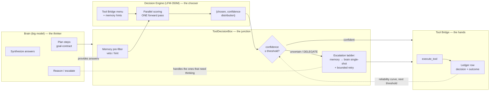
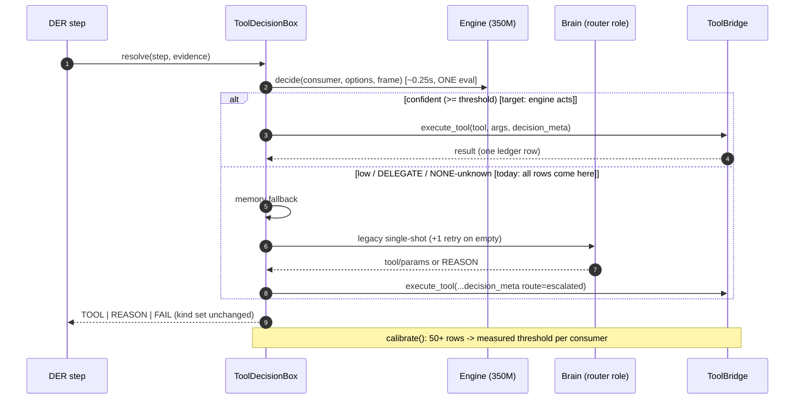

# Decision Engine — Architecture & Operations

Spec: `specs/tool-decision-engine/` (17 REQs, 67 ACs, waves 1-7 code-complete).
Status (2026-09-20, session 344): **waves 1-7 code-complete and green (115 tests);
live calibration at 92% accuracy / 42% coverage at the 0.85 threshold;
TG-5 harvest gate open.**

---

## 1. What it is

A calibrated small-model decision driver inside the IRIS backend, built as a local
reproduction of the Jev "System One" pattern (TypeSafe AI, 2026-09) — **parallel
option scoring** (a candidate set is rated in one forward pass) with honest
probabilities, plus a calibration loop (our stand-in for RLCD) that re-derives
routing thresholds from our own ledger data instead of guessing them.

Resident model: **LFM2-350M-Extract Q4_K_M**, in-process via llama-cpp-python,
CPU-only by default. It never writes memory, never emits events, never manages
servers. It returns distributions; the runtime decides.

## 2. The separation — who thinks, who decides, who acts



The three rules that keep the layers honest:

1. **The engine never writes.** Its only output is a score table; its only
   continuation into the world is the box routing that score. The single ledger
   writer is `AgentToolBridge._record_tool_event` — engine metadata rides the
   same row as the tool outcome, never a second event.
2. **The brain never picks cheap.** Routine selections do not cost a reasoning
   call. The brain sees only escalations: below-threshold picks, `DELEGATE`,
   broken args. In v1, "brain picks" is the *degrade/escalate* path, not the
   primary path.
3. **Neither guesses the threshold.** Enforcement prices in the measured
   reliability curve from the calibration ledger; defaults start shadow-only
   for user-visible consumers and enforce only where the risk is a handled
   escalation.

## 3. Target shape vs. today's shadow



**Today (shadow):** every row above records BOTH the engine's pick and what the
live path actually ran (`final_choice` + `engine_correct` on escalated rows).
**Target**: the left branch carries most routine steps; the brain's billing
cost only lands on the tail.

## 4. Consumers (one engine, three gates)

| Consumer | Options | Question | Call site |
|---|---|---|---|
| `tool_choice` | pre-filtered tools + DELEGATE + NONE | which tool runs this step | `ToolDecisionBox._engine_try` |
| `presentation` | plain_text / prism_card / card_plus_summary | does this answer deserve a card | `AgentKernel._engine_gate_surface` |
| `narration` | speak / silent | does this turn speak out loud | `IRISGateway._engine_permits_speech`, `narration.may_narrate` |

All three share one serialized context and one ledger path (`decide()`), with
per-consumer thresholds (`EngineConfig.thresholds / threshold_for`).

## 5. The calibrated confidence loop

1. Decide with softmax over per-option letter logits (`softmax_tau=0.5`
   sharpening, tunable).
2. Record every decision with route + confidence + latency + outcome.
3. `scripts/calibrate_decision_threshold.py` reads `system_events` read-only,
   buckets accuracy by confidence band, recommends per-consumer thresholds,
   refuses to fake a verdict below N=50 rows.

Narration is AND-gated with the existing user toggle, the 18s timer, and the
guaranteed-utterance backstop; the engine can only add silence, never force
speech (toggle and alerts always win: AC12.2/AC12.5).

## 6. Measured performance budget

| Phase | Cost (loaded 8-core CPU box) | via |
|---|---|---|
| Engine load + head warm | ~0.9s once | first decision |
| Tool decision (≤8 candidates) | 0.25–0.45s | parallel scoring, head-KV cache |
| Surface / narration gate | ~0.25s | same engine call |
| Sequential baseline before fix | ~104s then ~2.5s/option | wrong `max_tokens`, per-option eval |

Kill switches / knobs: `IRIS_DECISION_ENFORCE` (comma list of enforced
consumers; default `tool_choice`), `IRIS_DECISION_THREADS`,
`IRIS_DECISION_GPU_LAYERS` (inert while the llama-cpp-python build is CPU-only;
CPU wheel carries only ggml-cpu.dll).

## 7. Fidelity to Jev/RLCD (what is reproduced vs. what is not)

**Reproduced**: parallel single-pass option scoring (letter-indexed logits),
typed Chaice/Noul primitives, confidence-threshold routing, delegate sentinel.

**Not reproduced**: TypeSafe's RLCD *training* (their calibrated-decision RL is
unpublished). We substitute measurement-first calibration on our own ledger —
which is what their own docs say any non-Jev implementation has to do.

## 8. Operations

```powershell
# battery laps (live app required)
python scripts/bench_battery_domain.py      # browser/computer-use/coding battery
# offline accuracy battery (no app; ground-truth labeled cases)
#   scripts/fixtures/decision_engine_cases.json — edit add/remove cases
# calibration verdict (read-only against data/memory.db)
python scripts/calibrate_decision_threshold.py --since 2026-09-20
# microbenchmark the model path
python scripts/bench_decision_engine.py
```

Flags for live runs: set `IRIS_DECISION_ENFORCE` before starting the backend;
empty = full shadow (record but never act).

## 9. Open gates

- **TG-5**: 50+ live harvested rows incl. `final_choice` joins, then flip
  enforcement flags with the measured thresholds. Requires the app on a
  quieter box (observability noise floor) and battery laps 5+.
- **1984 test**: `test_unparseable_json` is a pre-existing stale red
  (committed REASON/'llm-noparse' behavior vs test expecting FAIL). Not in
  scope of this spec; owner decision required (pin_a085bfab97bf).
