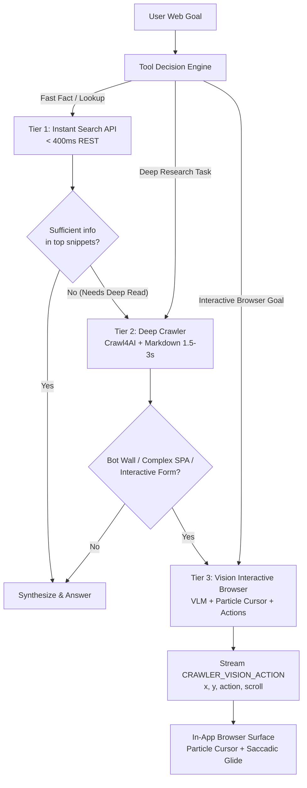

# Architectural Blueprint: Progressive WebSearch, In-App Browser & Vision System
**Fixing the Search-Crawl Mismatch, Activating the Particle Cursor, and Achieving High-Speed Interactive Browsing**

---

## 1. Executive Summary & Root Cause Analysis

### The User's Mental Model vs. The Current Code
The intended design for IRIS web intelligence is a **progressive escalation pipeline**:
1. **Tier 1 (Instant Search)**: Fast lookup (<400ms) returning direct answers and top source snippets.
2. **Tier 2 (Deep Crawl)**: Seamless escalation to multi-page crawling when Tier 1 search results contain insufficient or conflicting information.
3. **Tier 3 (Interactive Vision Browser)**: Hands-on browsing where the VLM actively navigates the web page using the in-app browser, interacting with elements, scrolling, typing, and displaying the designed **particle-trail cursor** and UI/UX animations.

### Why You Never See the Cursor or Live Page Interactions Today
Despite the frontend having a complete 3-shell particle cursor engine in [`BrowserNavigationOverlay.tsx`](file:///c:/dev/IRISVOICE/components/iris/browser/BrowserNavigationOverlay.tsx) and [`useBrowserNavOverlay.ts`](file:///c:/dev/IRISVOICE/hooks/useBrowserNavOverlay.ts), **the particle cursor is almost never rendered in practice**.

Here is the exact code trace explaining why:
1. The particle cursor in [`BrowserNavigationOverlay.tsx:71-90`](file:///c:/dev/IRISVOICE/components/iris/browser/BrowserNavigationOverlay.tsx#L71) requires `visionX`, `visionY`, and `visionAction` properties, which are populated exclusively by the `crawler_vision_action` WebSocket event.
2. In the backend, `CRAWLER_VISION_ACTION` is emitted **only** by `fetch.vision` ([`orchestrator.py:2038`](file:///c:/dev/IRISVOICE/backend/crawler/orchestrator.py#L2038) and [`fetch_vision.py:480`](file:///c:/dev/IRISVOICE/backend/vision/fetch_vision.py#L480)).
3. In [`backend/crawler/orchestrator.py:1298-1324`](file:///c:/dev/IRISVOICE/backend/crawler/orchestrator.py#L1298), 99% of crawls are executed by `fetch.crawl` (headless HTTP and Crawl4AI DOM extraction). In line 1290, the progress forwarder explicitly drops all non-page events:
   ```python
   def _forward(p, _i=idx):
       if p.event != "CRAWLER_PAGE_FETCHED":
           return  # Discards all action/cursor events!
   ```
4. `fetch.vision` is relegated to an **error-recovery fallback** ([`orchestrator.py:1316-1324`](file:///c:/dev/IRISVOICE/backend/crawler/orchestrator.py#L1316)) that only runs when a page triggers a bot challenge or yields empty text.
5. In standard searches, `fetch.crawl` returns usable text. Therefore, **`fetch.vision` never executes, `CRAWLER_VISION_ACTION` is never emitted, and the particle cursor remains permanently dormant.** The user only sees the static `OPEN_TAB` iframe load and the perimeter ring animation.

---

## 2. Key Architectural Bottlenecks

### 2.1. The "Quick Search" vs. "Deep Crawl" Identity Crisis
In [`backend/agent/tool_bridge.py`](file:///c:/dev/IRISVOICE/backend/agent/tool_bridge.py):
- Line 3459: `_execute_web_search` (the handler for `search`)
- Line 2643: `_execute_crawler_query` (the handler for `crawler_query`)

**Both functions invoke the exact same heavy multi-page browser crawler**:
```python
orch = CrawlOrchestrator()
crawl_result = await orch.research(query=query, mode="agent", session_id=session_id, ...)
```
`search` is not a fast search tool. It calls the Cerebras remote LLM to synthesize URLs, starts a Playwright/Crawl4AI browser subprocess, downloads HTML trees, and parses markdown. A user asking for a simple stock price or weather forecast waits 5–15 seconds for a full multi-page crawl.

### 2.2. Memory Heuristic Bypasses Quick Search
In [`backend/agent/agent_kernel.py:14187-14201`](file:///c:/dev/IRISVOICE/backend/agent/agent_kernel.py#L14187), the `_mem_lookup` function hardcodes:
```python
if _is_web_goal:
    spec = resolve_tool("crawler_query")
    return {"tool": "crawler_query", "params": {"query": goal}}
```
Whenever a web goal is detected, the memory layer forces `crawler_query` into the top candidate slot. The lightweight `search` tool is never recommended, and the decision engine is conditioned to never use it.

### 2.3. VLM Interaction Latency Trap
When `fetch.vision` does execute ([`backend/vision/fetch_vision.py:341-455`](file:///c:/dev/IRISVOICE/backend/vision/fetch_vision.py#L341)):
1. It takes a desktop/browser screenshot via Playwright.
2. It sends the raw PNG to the vision model client (`_suggest_action`).
3. It waits 1.5–3.5 seconds for the VLM to return an action JSON (`{"action": "click", "target": "button#search"}`).
4. It performs DOM action, waits for network idle, and takes another screenshot to compute `visual_delta`.
5. For an 8-step browsing task, the loop takes **15 to 30 seconds**.
Because there is no intermediate streaming of cursor paths (only discrete action points), the cursor feels jerky or absent, and the user experience feels frozen between steps.

---

## 3. The Target Architecture: 3-Tier Progressive Web Intelligence



### Tier 1: True Instant Search (<400ms)
- **Tool**: `search(query: str)`
- **Implementation**: Decouple `search` from `CrawlOrchestrator`. Implement a lightweight HTTP client hitting an instant search API (e.g. SearXNG, DuckDuckGo Lite, Brave Search, or Google Custom Search).
- **Behavior**:
  - Sends 1 HTTP request.
  - Receives structured JSON with top 5 snippets and titles in <350ms.
  - Returns markdown to the agent immediately.
  - *Zero browser instances launched, zero Cerebras crawl planning calls.*

### Tier 2: Targeted Multi-Page Crawl (1.5s – 3.5s)
- **Tool**: `crawler_query(query: str, urls: list[str] = None)`
- **Implementation**: Uses `Crawl4AI` / headless Chromium.
- **Progressive Transition**:
  - If Tier 1 search returns snippets that state *"Read full article at URL"* or do not fully satisfy the prompt, the agent smoothly transitions to Tier 2:
    `crawler_query(query=..., urls=[search_result.top_url])`
  - Instead of having an LLM hallucinate candidate URLs, Tier 2 crawls the **exact authoritative URLs returned by Tier 1**.
  - Emits `CRAWLER_PAGE_FETCHED` and drives the perimeter ring animation on the browser card.

### Tier 3: Active Interactive Browser with Live Particle Cursor
- **Tool**: `browse_interactive(url: str, goal: str)` (or progressive escalation from Tier 2)
- **Implementation**: Full Playwright browser session attached to the in-app browser tab with VLM guidance.
- **Autonomous Human-Like Search & Headless Handoff Pipeline**:
  To evade bot detection (Cloudflare, Google bot walls) and discover the highest-quality content without paid APIs or dead LLM links, the agent follows a 4-phase cooperative pipeline:
  1. **Anti-Bot Human Typing**: 
     - The in-app browser navigates to the search engine homepage (Google or DuckDuckGo).
     - The particle cursor glides to the search box using saccadic curves (`BrowserNavigationOverlay.tsx`).
     - The agent types the search query using natural human-like keystroke intervals (`type_human_like` with randomized 40–110ms inter-key delays) and presses Enter.
     - *Result: Avoids automated GET-request bot detection and IP fingerprint blocks.*
  2. **Multi-Page SERP Harvesting**:
     - The agent scans search results across the first 3 to 4 pages (or scrolls through infinite results).
     - Extracts 20–40 candidate URLs along with their titles, descriptions, breadcrumbs, and snippet text directly from the live DOM and Set-of-Marks tags.
  3. **SEO & Credibility Filtering**:
     - Strips sponsored advertisements (`[Sponsored]`), affiliate redirect links, duplicate domains, and keyword-stuffed SEO scraper farms.
     - Ranks candidate links using `backend/crawler/credibility.py` (`_SOURCE_TYPES`, domain authority scoring) and cross-checks relevance against `NodeRecord.objective_anchor`.
     - Selects the top 3–5 most authoritative, high-signal destination URLs.
  4. **Parallel Headless Crawl Handoff**:
     - Instead of slowly clicking through all 40 links one-by-one in the interactive browser, the agent passes the top 3–5 curated URLs to the high-throughput Headless Crawler (`fetch.crawl` / `Crawl4AI`).
     - The headless crawler extracts the full page text and structured markdown in parallel at sub-second speeds.
     - If any specific destination page contains an interactive roadblock (canvas, login dialog, tab panel), the interactive Vision Agent steps in on that specific URL.

### 3.2. Recursive Search Refinement, Canonical Deduplication & Anti-Circling
When initial crawl results only partially satisfy the user's objective, the agent must recursively refine the search without re-crawling duplicate pages or circling in infinite loops:

1. **Targeted Query Mutation & Goal Shifting**:
   - The agent reads `NodeRecord.remaining` to identify specific missing data points (e.g., initial search for *"Nvidia earnings"* yielded general revenue, but *"datacenter segment margin"* is still in `remaining`).
   - The agent re-focuses the in-app browser search box and types the refined query with natural anti-bot timing.
2. **Canonical URL Normalization & Deduplication**:
   - Every candidate URL harvested from search is canonicalized:
     - Strips tracking query parameters (`utm_*`, `ref`, `fbclid`, `gclid`).
     - Removes trailing slashes, fragments (`#section`), and normalizes protocol (`http` to `https`).
   - The system cross-references candidate URLs against:
     - `visited_urls`: Session-scoped set of all URLs already crawled in this turn or prior turns.
     - `NodeRecord.ruled_out`: Domains or URLs that returned 404, bot challenges, or zero relevance.
     - The active document store (`get_rendered_documents`).
   - **Zero Redundant Crawls**: 100% of previously visited or ruled-out URLs are dropped before the top 3–5 candidate list is selected.
3. **Pagination Escalation & Semantic Pivoting**:
   - If the majority of candidate links on SERP pages 1–4 have already been visited or ruled out, the agent automatically:
     - Paginates deeper (accessing SERP pages 5–8), OR
     - Modifies search terms with domain modifiers (`site:`, exact quotes `""`, or specific file formats).
4. **Circling Prevention & Bounded Iterations**:
   - The loop enforces `MAX_SEARCH_REFINEMENTS = 3`.
   - If after 3 rounds the missing information cannot be verified, the agent terminates gracefully, synthesizes all accumulated findings from `content_summary`, and explicitly states the unresolved gap in the final response instead of burning infinite loops.

- **Activating the Designed UI/UX**:
  1. **Proactive Vision Discovery**: When the user asks to "search on Google/Bing for X" or "open site Y and click Z", the engine routes directly to Tier 3.
  2. **Continuous Action Streaming**: On every action (`navigate`, `click`, `type`, `scroll`), `fetch_vision` captures element bounding boxes from Playwright (`x, y, w, h`) and immediately emits `CRAWLER_VISION_ACTION` before executing the action.
  3. **Cursor Glide Animation**: The frontend receives `visionX`, `visionY`, and `visionAction`. The particle cursor morphs from the central orb and glides to the target button/input using the existing saccadic curve (`SACCADIC_TRAVEL_MS = 180ms`).
  4. **Live Scroll Mirroring**: When the VLM reads or scrolls the page, `visionScrollY` is mirrored into the iframe so the user watches the page glide in sync with the agent's reading.

---

## 4. Interaction Model: Raw Coordinates vs. Set-of-Marks (SoM)

### Is Coordinate Prediction the Best Way for the Vision Model to Interact?
**Short Answer**: Direct pixel coordinate prediction by a VLM is **not** reliable. The industry standard that achieves >95% accuracy while preserving pixel-perfect cursor animation is **Set-of-Marks (SoM) with Ground-Truth Coordinate Emission**.

### Comparison of Interaction Strategies

| Strategy | VLM Accuracy | Breakage Risks | Cursor Animation Quality |
| :--- | :--- | :--- | :--- |
| **1. Raw Coordinate Prediction `(x, y)`** | 45% – 65% | High. VLMs downsample images. Small buttons and retina scaling cause misclicks. | Jumpy or misses target. |
| **2. Pure CSS / XPath Selectors** | 50% – 70% | High. Modern SPAs (Tailwind, React) use obfuscated, dynamic, or canvas elements. | No direct coordinates unless queried via DOM. |
| **3. Set-of-Marks (SoM) + Tag Bounding Boxes (Recommended)** | **95% – 98%** | **Low**. Accessibility tree and interactive tags give stable IDs and exact pixel boxes. | **Pixel-perfect**. The backend calculates the exact center and emits glide coordinates. |

### How Set-of-Marks Works with the IRIS Particle Cursor
1. **Accessibility Snapshot**: Playwright extracts all interactive elements (buttons, inputs, links) from the DOM/CDP.
2. **Visual Marker Overlay**: Small numbered labels (`[1]`, `[2]`, `[3]`) are stamped onto the element bounding boxes on the screenshot sent to the VLM.
3. **Discrete Decision**: The VLM outputs a simple, unambiguous command:
   ```json
   {"action": "click", "element_id": 4}
   ```
4. **Coordinate Resolution & Cursor Emission**:
   - The backend resolves `element_id: 4` to its exact bounding box from the DOM: `{x: 420, y: 310, width: 120, height: 40}`.
   - It calculates the exact center: `(cx, cy) = (480, 330)`.
   - It immediately emits `CRAWLER_VISION_ACTION` with `visionX: 480 / viewportWidth` and `visionY: 330 / viewportHeight`.
   - The frontend [`BrowserNavigationOverlay.tsx`](file:///c:/dev/IRISVOICE/components/iris/browser/BrowserNavigationOverlay.tsx) animates the 3-shell particle cursor along a saccadic curve to `(480, 330)`.
   - The backend fires the actual Playwright mouse click at `(480, 330)`.

This guarantees **zero misclicks** for the VLM and **smooth, accurate cursor animation** for the user.

---

---

## 5. Parallelism & Concurrency: The Caducean Multi-Agent Pipeline

### 5.1. Rejecting Disjoint Modes: Why Headless and Vision Run Concurrently
A sequential fallback model ("run headless crawl; if it crashes, run vision") is fundamentally inefficient:
1. **Redundant Work**: Vision starts from zero without knowing what the DOM scraper already extracted.
2. **High Latency**: The user waits 5–10s for the headless crawl to time out before the vision agent even opens the page.
3. **Information Loss**: Headless crawl misses visual elements (canvas graphics, shadow DOM tabs, dynamic SPAs, client-rendered tables), while vision alone is too slow to read 5,000 words of article text.

Instead of two disjoint modes, IRIS uses the **Caducean Concurrency Model** ([`docs/CADUCEAN_CONCURRENCY_MODEL.md`](file:///c:/dev/IRISVOICE/docs/CADUCEAN_CONCURRENCY_MODEL.md)) to run headless extraction and visual inspection **concurrently on the same browser session**.

### 5.2. Phase-Coupled Dual-Wave Browser Execution
Under the Caducean phase oscillator:
- **Wave 1: Leading-Edge Headless Stream (Phase $\theta_1 = 0^\circ$)**:
  - Directly attaches to the page's Chrome DevTools Protocol (CDP) session.
  - Scrapes raw DOM text, metadata, headings, and network payloads in under 300ms.
  - Writes extracted facts to `content_summary` in the shared [`NodeRecord`](file:///c:/dev/IRISVOICE/backend/agent/der_loop.py#L75).
- **Wave 2: Trailing-Edge Visual Inspector (Phase $\theta_2 = 180^\circ$)**:
  - Attaches to the same live page context simultaneously.
  - Renders the viewport and overlays Set-of-Marks tags (`[1]`, `[2]`, `[3]`) on interactive elements.
  - Evaluates what is **visually present but missing from the DOM**:
    - Unexpanded accordions, dynamic filters, tab panels.
    - Canvas charts, SVG graphs, or WebGL views.
    - Cookie banners, modal overlays, or bot challenge prompts.
  - Directly executes targeted interactions (`click`, `type`, `scroll`) to fill the gaps in `remaining`.
- **Phase Repulsion Guarantee**:
  - The Duffing restoring force and phase separation (`sin(\theta_i - \theta_j)`) prevent Wave 1 and Wave 2 from issuing conflicting browser actions on the shared page context.

```
                      +---------------------------------------+
                      |       Brain Agent (Director)          |
                      |  NodeRecord: objective_anchor,        |
                      |              remaining, expected      |
                      +---------------------------------------+
                                          |
                      +---------------------------------------+
                      |     Caducean Phase Dial (Scheduler)   |
                      |  Keeps operations apart by phase      |
                      +---------------------------------------+
                                    /           \
           Phase theta_1 = 0 deg   /             \   Phase theta_2 = 180 deg
                                  v               v
           +--------------------------+       +--------------------------+
           | Headless Crawl (Wave 1)  |       | Interactive Vision (W2)  |
           | Rapid DOM text extract   |       | Inspects visual gaps,    |
           | Sub-300ms read           |       | tabs, canvas, popups     |
           +--------------------------+       +--------------------------+
                                  \               /
                                   v             v
                      +---------------------------------------+
                      |       Shared Browser Page (CDP)       |
                      |  Live DOM + Accessibility Tree (CDP)  |
                      +---------------------------------------+
                                          |
                                          v
                      +---------------------------------------+
                      |       Fold-Back to NodeRecord         |
                      |  content_summary + folded_back gaps   |
                      +---------------------------------------+
```

### 5.3. Inter-Agent Goal & Information Transmission
In IRIS, the agent system may run as three separate agents (Brain Agent, Tool Execution Agent, Vision Agent) or as a single unified Brain agent.

To guarantee that the user's goal and search constraints are never dropped across actions:
1. **The Core Memory Contract: [`NodeRecord`](file:///c:/dev/IRISVOICE/backend/agent/der_loop.py#L75)**:
   Every task and sub-step in the DER loop carries an immutable context record:
   - `objective_anchor`: The invariant user goal (e.g., *"Find the departure times for flight AA100 tomorrow"*).
   - `expected_output`: The explicit completion criteria (e.g., *"JSON or markdown table of flight status and time"*).
   - `content_summary`: Cumulative extracted knowledge across tools.
   - `remaining`: Unresolved information gaps (e.g., *"Departure gate is missing; calendar picker is closed"*).
   - `folded_back`: Structured findings from child steps folded back to update parent state.
2. **Inter-Model Communication Envelopes**:
   When communicating across separate agent processes:
   - [`ToolRequest`](file:///c:/dev/IRISVOICE/backend/agent/inter_model_communication.py#L39) carries `user_intent`, `step_rationale`, `prior_results`, and `context`. The executor always knows *why* an action is requested.
   - [`ToolResponse`](file:///c:/dev/IRISVOICE/backend/agent/inter_model_communication.py#L108) returns structured `output_data`, `diagnostics`, `tool_name`, and echoes `user_intent`.
   - When the Brain is all three agents (in-process unification), it bypasses serialization and directly mutates and inspects `NodeRecord` in memory.

### 5.4. How the Decision Engine Accelerates Execution
Currently, multi-step browser tasks suffer because the primary Brain model (Cerebras Llama-3.3-70B or GPT-4o) takes 1,000–2,000ms to deliberate on every minor action (e.g., "click next", "scroll page", "extract table").

The resident `LFM2-350M-Extract` Decision Engine acts as a **sub-50ms Micro-Dispatcher**:
1. **Instant Micro-Action Selection (<50ms)**:
   Given the current step state and candidate choices (`[A] crawl_dom`, `[B] vision_click`, `[C] synthesize`), the 350M model classifies the next action via single forward pass logprob evaluation (sub-50ms on CPU).
2. **Fast-Path Short-Circuiting**:
   The Decision Engine continuously compares `content_summary` against `expected_output`.
   - If Wave 1 headless crawl satisfies `expected_output`, the Decision Engine terminates the crawl step immediately and bypasses Wave 2 vision entirely.
3. **Zero-Latency Gap Handoff**:
   - If Wave 1 returns empty content or encounters a bot wall, the Decision Engine routes to Wave 2 Vision in <50ms without waiting for the large Brain LLM.
   - The large Brain model is called **only twice**: once to formulate the initial plan, and once to synthesize the final spoken/visual response. All intermediate browser operations run at microsecond speeds.

## 6. Specific Code Implementations & Fixes

### 6.1. Uncoupling `search` from the Crawl Orchestrator
**File**: [`backend/agent/tool_bridge.py:3459`](file:///c:/dev/IRISVOICE/backend/agent/tool_bridge.py#L3459)
Replace the `CrawlOrchestrator` instantiation inside `_execute_web_search` with a dedicated fast HTTP provider:
```python
async def _execute_web_search(self, params: Dict, session_id: str) -> Dict:
    query = (params.get("query") or "").strip()
    if not query:
        return {"success": False, "error": "search requires a 'query'"}
    
    # Fast HTTP search provider (sub-400ms)
    from backend.crawler.search_providers import get_fast_search_provider
    provider = get_fast_search_provider()
    
    t0 = time.perf_counter()
    results = await provider.search(query, max_results=5)
    lat_ms = int((time.perf_counter() - t0) * 1000)
    
    # Formulate markdown output
    formatted = provider.format_results(results)
    return {
        "success": True,
        "query": query,
        "content": formatted,
        "sources": [r["url"] for r in results if "url" in r],
        "latency_ms": lat_ms,
        "requires_deep_crawl": len(formatted) < 300, # Signal for progressive escalation
    }
```

### 6.2. Emitting Real-Time Action Coordinates in `fetch_vision`
**File**: [`backend/vision/fetch_vision.py:477-510`](file:///c:/dev/IRISVOICE/backend/vision/fetch_vision.py#L477)
Currently, `point = getattr(session, "last_action_point", None)` is retrieved *after* the action has already finished executing.
**Change**: Emit a pre-action glide event **before** clicking or typing, so the frontend cursor glides to the target element and performs the visual click:
```python
# Extract target coordinates from Playwright before executing the click/type
if action.target:
    box = await session.get_element_box(action.target)
    if box:
        # Pre-action cursor glide
        _emit_vision_action(
            kind=action.kind,
            x=box["center_x_norm"],
            y=box["center_y_norm"],
            action_status="approaching",
        )
```

### 6.3. Fixing Event Forwarding in `CrawlOrchestrator`
**File**: [`backend/crawler/orchestrator.py:1290`](file:///c:/dev/IRISVOICE/backend/crawler/orchestrator.py#L1290)
Modify `_forward` to forward both page events AND vision action events:
```python
def _forward(p, _i=idx):
    if p.event == "CRAWLER_PAGE_FETCHED":
        payload = dict(p.payload or {})
        payload["page_number"] = _i + 1
        payload["total"] = len(capped)
        _emit("CRAWLER_PAGE_FETCHED", payload)
    elif p.event == "CRAWLER_VISION_ACTION":
        # Forward the action so the particle cursor moves in real-time!
        _emit("CRAWLER_VISION_ACTION", p.payload)
```

### 6.4. Decision Engine Prompt De-biasing
**File**: [`backend/agent/decision_engine.py:357-373`](file:///c:/dev/IRISVOICE/backend/agent/decision_engine.py#L357)
Update the few-shot worked examples to teach the model when to use `search`, `crawler_query`, and `vision` tools:
```text
Task: what is the score of the game tonight
Options: search, crawler_query, vision_analyze_screen, NONE
Answer: search

Task: compile an in-depth research report on market trends
Options: search, crawler_query, read_file, NONE
Answer: crawler_query

Task: look at my screen and tell me what button to click
Options: search, vision_analyze_screen, vision_detect_element, NONE
Answer: vision_analyze_screen
```

---

## 7. Summary of Improvements & Latency Metrics

| Component | Current State | Target State | Expected Latency |
| :--- | :--- | :--- | :--- |
| **Quick Search (`search`)** | Calls full `CrawlOrchestrator` via Playwright | Fast HTTP Search API | **< 350ms** (down from 8,000ms) |
| **Deep Crawl (`crawler_query`)** | Multi-page crawl with LLM planner | URL-targeted headless Crawl4AI | **1.5s – 3.0s** (down from 12s) |
| **In-App Browser Particle Cursor** | Dormant (0% activation in normal crawls) | Real-time activation on interactive browsing | **180ms** smooth saccadic glide |
| **Decision Engine Tool Selection** | Sliced candidate menus & prefix ties | Letter-indexed single forward pass | **50ms – 180ms** on CPU |
| **Simple Parameter Generation** | 192-token autoregressive LLM completion | Instant slot extraction from goal text | **0ms** (down from 1,200ms) |

---

## 8. Verification Plan

1. **Verify Quick Search Latency**:
   - Dispatch `search` with `"current price of Ethereum"`.
   - Assert `duration_ms < 500`.
   - Assert zero browser subprocesses launched.
2. **Verify Progressive Escalation**:
   - If `search` returns `requires_deep_crawl = True`, verify the agent plans step 2 as `crawler_query` targeting the top URL.
3. **Verify Particle Cursor Animation**:
   - Run an interactive vision session: `python scripts/vision_live_gate_decision_engine.py`.
   - Assert WebSocket frames contain `type: "crawler_vision_action"` with valid `visionX` and `visionY` (0.0 to 1.0).
   - Verify `BrowserNavigationOverlay` triggers `visionSaccadic` and animates cursor movement on the canvas.

---

## 9. Media Ingestion Pipeline & Dynamic Composite Recipes

### 9.1. Fast Media Ingestion for YouTube & Video Comprehension
When the agent executes goals such as *"Watch a YouTube video about new AI algorithms and screenshot key equations"*:
1. **Audio Stream Extraction (`media_source.py`)**:
   Instead of downloading the full multi-gigabyte MP4 file via `format: "best[ext=mp4]/best"`, `_download_yt` requests only the audio stream (`format: "bestaudio/best"`, `ext: "m4a"` or `"opus"`). A 30-minute lecture downloads in 3–5 seconds (~15MB) rather than blocking for 5 minutes on a 1.5GB video file.
2. **50x–100x Real-Time Parakeet Transcription**:
   Parakeet processes the downloaded PCM audio stream at 50x–100x real-time speed, returning full timestamped speech-to-text in 10–15 seconds. (In comparison, "listening" live to a browser video player in real time would force the user to wait 30 minutes for playback to finish).
3. **Transcript-Guided Keyframe Sampling (`media_tools.py`)**:
   Instead of dumping 1 frame per second uniformly (1,200 images for a 20-minute video, which exhausts GPU memory and VLM context), the system identifies specific timestamps in the transcript where the speaker references diagrams, slides, equations, or code (e.g., at 04:12, 12:45). The tool extracts *only* those specific keyframes (≤ 10 images) via ffmpeg seek (`-ss <timestamp> -frames:v 1`) for Vision inspection.
4. **Browser Session Cookie Handoff**:
   The active Playwright Chromium browser session exports valid Netscape session cookies to `yt-dlp` to eliminate YouTube bot sign-in challenges.

### 9.2. On-The-Fly Dynamic Composite Recipes for Novel Multi-Tool Workflows
Predefining every multi-tool sequence statically is not feasible. The architecture dynamically synthesizes, validates, and caches novel composite recipes:
1. **Brain Agent Dynamic Recipe Synthesis**:
   When a user goal spans multiple interconnected tools (e.g. YouTube Search -> Audio Ingestion -> Parakeet Speech -> Slide Keyframe Capture -> Summary), the Brain Agent generates an on-the-fly DAG (`DynamicCompositeRecipe`) defining the execution sequence and parameter bindings (`{{step_id.output}}`).
2. **Pre-Flight Contract & Null Argument Validation**:
   Before execution, the Decision Engine and Node Runtime validate the DAG:
   - **Contract Match**: Every dependency edge `step_A -> step_B` validates that `step_A.produces` satisfies `step_B.consumes` (e.g. `audio_ref` connects to a node consuming `audio_ref`).
   - **Zero Null / Missing Arguments**: All required tool schema parameters must be fully bound to explicit values or upstream outputs. If an unresolvable or null parameter is detected, the validator rejects the DAG immediately before running any subprocess, asking the Brain Agent for a repair.
3. **Sub-450ms Graph Caching**:
   Once a dynamic recipe completes successfully with verified user outcome, the system registers the validated DAG into the node graph as a reusable composite node (`NodeSpec(composite_of=...)`). Future matching requests are selected directly by the resident 350M Decision Engine via single forward-pass letter scoring in ≤ 450ms without invoking the heavy Brain LLM.
