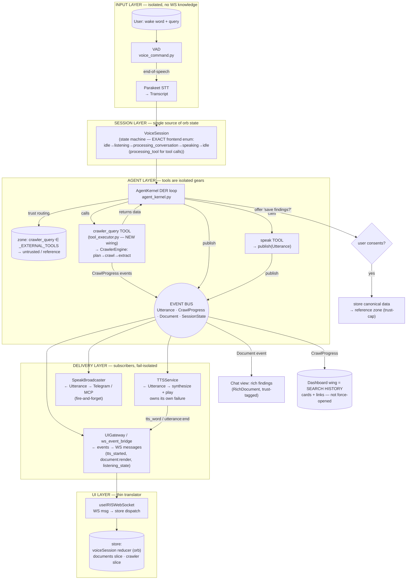

# Plan: Web-Mode Voice → Crawler — Orb Stuck + No Spoken Summary

**Date:** 2026-07-11
**Status:** §4 (orb-state + spoken summary) + §6.1 (crawler_query agent tool) IMPLEMENTED in `cad8e3d4`. §12 MULTI-STEP TOOL-CALL VISUALIZATION — expanded scope from live testing; fix proposed, not yet implemented.
**Branch recommendation:** `feat/web-mode-voice-crawler-fix` (do not push without request)

---

## 0. Summary

Two symptoms reported after a web-search voice command (web mode ON):

1. **Orb stays in "listening" (red/recording) until the user clicks it.** Speech
   only "ends" on manual orb click.
2. **Crawler results are never spoken.** The dashboard tab + chat text appear, but
   no TTS plays.

Both trace to **one root-cause bug**: the web-mode voice routing does an early
`return` that skips the entire normal voice pipeline, and `_handle_crawler_query`
never emits `listening_state` transitions or triggers TTS.

This plan fixes the immediate bug AND records the deeper open question the user
raised: **how the crawler should search and relay information back** so it follows
the established `speak`/`show` (short-TTS / full-document) design and the
trust-routing (untrusted web content) rules.

---

## 1. Symptoms (observed)

- User speaks a web-search query after wake word. VAD detects end-of-speech
  (logs: `silence 55/55`, `silence 35/37`). Backend transcribes and runs the
  crawler. Dashboard tab opens, chat shows a one-liner. **Orb never leaves
  "listening".** Only a manual orb click → `voice_command_end` resets it.
- No spoken summary of the search results, despite the agent clearly having
  produced a `summary`.

### Side theories checked (and dismissed)

- **"Whisper fallback is being used instead of Parakeet"** — FALSE. Every STT
  result in the log is `[Parakeet] GPU ASR`. The 18.6 s first-call latency was
  **cold start** (model load on first inference); the second utterance was 1.8 s.
  Whisper is only pre-loaded as fallback and never activated.
- **"VAD trouble detecting end-of-speech"** — VAD actually worked (end-of-speech
  detected in both sessions). The *appearance* of VAD failure was caused by the
  orb never leaving "listening" (the state-sync bug below). One real detail: the
  silence window grew `37 → 55` frames mid-command-1 (recalibration at 10 s in
  `voice_command.py:1041-1045`), which can make end-of-speech feel late on pauses,
  but it is not the cause of the stuck orb.

---

## 2. Root Cause (one bug, two symptoms)

### 2.1 Early `return` skips the normal voice pipeline

`backend/iris_gateway.py` `_process_voice_transcription` (web-mode branch):

```python
# iris_gateway.py:2161-2170
if session_id in self._web_mode_sessions:
    self._logger.info(
        f"[Voice→Crawler] session={session_id} routing STT "
        f"transcript to crawler_query"
    )
    await self._handle_crawler_query(
        session_id, client_id,
        {"type": "crawler_query", "payload": {"query": transcript}},
    )
    return                      # ← skips EVERYTHING below
```

Everything below that `return` is skipped:
- `listening_state: processing_conversation` broadcast (line 2188)
- the TTS thread that streams the agent reply (line 2443)
- the `speaking → idle` transitions

### 2.2 `_handle_crawler_query` never drives orb state or TTS

`backend/iris_gateway.py:8012-8145` — the crawler handler emits only:
`crawler_started`, `crawler_page_fetched`, `open_tab` (dashboard), `text_response`
(one-liner). It **never sends a `listening_state` message** and **never calls
`_speak_response` / emits `utterance:start`**.

### 2.3 Why the orb gets stuck (frontend side)

- `useIRISWebSocket.ts:585-596` — `wake_detected` → `setVoiceState("listening")`.
- `useIRISWebSocket.ts:599-617` — `listening_state` handler updates `voiceState`.
- `XurOrb.tsx` — `isListening = voiceState === "listening"`; the orb shows the
  red "recording" visual while `voiceState !== "idle"`.
- Because the crawler never sends a `listening_state` change, `voiceState` stays
  `"listening"` forever.
- Only `endVoiceCommand()` (orb click → `voice_command_end`) makes the backend
  send `listening_state: idle` (`iris_gateway.py:1935`), which finally resets it.

**Conclusion:** the VAD worked; the frontend simply never received the signal to
leave "listening". That is the "speech only ended when I clicked the orb" symptom.

### 2.4 Why nothing is spoken

Same early `return` skips the TTS path. `_handle_crawler_query` sends
`text_response` (text only) and never triggers `_speak_response`. So results land
in ChatView + dashboard tab but are never vocalized.

---

## 3. Design Constraints (from existing pins — MUST respect)

The user referenced a prior implementation decision about how the agent should
respond in TTS. That is the **voice-tts-document-redesign** plan family:

- **`pin_c62a9f7ec0cc`** (Plan: voice-tts-document-redesign, Issue C):
  > *"TTS recites entire MD document. Root: no speak/show separation… Fix:
  > structured JSON response `{speak: short summary, show: {format, content,
  > alternatives}}`; speak tool for agent-initiated speech; document:render WS
  > event; fallback to plain text if not JSON."*
- **`pin_13ed43048e05`** (Decision: speak tool is proactive + mirrors external):
  > *"speak text capped at 500 chars; max 3 pending utterances (rate limit) —
  > prevents runaway speech."*
- **`backend/agent/structured_response.py`** — the contract:
  - `speak` = short conversational summary for TTS (NOT the full document).
  - `show` = full visual content (rendered via `document:render`).
  - Plain text falls through unchanged (backward compatible).
- **`agent_kernel.py:1249-1279`** — system prompt instructs the agent to return
  `{"speak": "<2-3 sentence conversational summary>", "show": {...}}`.

**Implication for this fix:** when the crawler speaks, it must speak a **short
summary**, not the full dashboard content. The crawler's `dashboard_data["summary"]`
is the candidate spoken text, but it must be capped/trimmed to a spoken length
(≤ ~500 chars, 2-3 sentences) consistent with the `speak` design — NOT the entire
extracted document.

### Trust-routing context (relevant to §6)

The **trust-routing** plan family (`pin_3f31e7dc7169`, `pin_6d850985b31a`) already
establishes that `web_search` / `crawler_query` results are **untrusted** and must
be routed to the `reference`/untrusted zone, sanitized on render, and excluded
from permanent memory by the trust-cap. The current crawler flow does **not**
thread this `trust` signal into its `open_tab` / `text_response` payloads. That is
part of the deeper relay-design gap in §6.

---

## 4. Proposed Fix (immediate — closes both symptoms)

Modify `backend/iris_gateway.py` `_handle_crawler_query` so it drives orb state and
speaks a short summary. No changes to the frontend are required — the frontend
already reacts correctly to `listening_state` and `tts_started`.

### 4.1 Emit `listening_state` transitions

- After `crawler_started` (line 8058), send
  `listening_state: processing_conversation` (or `processing_tool`).
- In the `crawler_error` paths (lines 8054, 8091-8099, 8102-8104, 8115-8119),
  also send `listening_state: idle` so the orb cannot get stuck on failure.
- **Note (per §6.2):** `open_tab` should *record* the search in the dashboard history
  but **NOT force the wing open** on every query — chat view is the primary display.
  This stopgap still speaks the summary; the proper agent-driven relay is §6.

### 4.2 Speak a short summary via the existing TTS path

`_speak_response` (`iris_gateway.py:2578`) already:
- broadcasts `listening_state: speaking` on first audio chunk,
- broadcasts `tts_started` (with `turn_id` + `total_words`),
- broadcasts `listening_state: idle` in its `finally` (line 3568-3631: *"The orb
  on the frontend MUST receive a `listening_state: idle`"*).

So reusing it fixes the orb-stuck issue too.

Steps in `_handle_crawler_query` (after building `summary`, ~line 8133):

1. Generate one `_turn_id = str(uuid.uuid4())`.
2. Keep the existing `text_response` (line 8136) but set its `turn_id` to
   `_turn_id` (satisfies the `test_text_response_turn_id` contract so word
   highlighting matches).
3. Derive the **spoken** text: a short summary, not the full document. Use
   `dashboard_data["summary"]` trimmed to ≤ 500 chars / 2-3 sentences (mirror the
   `speak` cap from `pin_13ed43048e05`). If empty, fall back to
   `"Found results for: {query} — see Dashboard."`.
4. Run `_speak_response(spoken_text, session_id, _client_id=client_id,
   _turn_id=_turn_id)` in a **worker thread** (do NOT call it directly from the
   async handler — it blocks during synthesis; the normal flow wraps it in
   `threading.Thread` at line 2443). Use `loop.run_in_executor` or a daemon thread
   with `self._main_loop` so the `run_coroutine_threadsafe` broadcasts inside
   `_speak_response` reach the event loop.

### 4.3 Why this is safe

- `_speak_response` is the same path the normal (non-web) flow uses; it already
  handles interrupt, barge-in, STTPROC stop, and idle broadcast.
- The frontend already handles `listening_state` + `tts_started` + `tts_word`
  (`useIRISWebSocket.ts`, `XurOrb.tsx`). No frontend change needed.
- The `text_response` contract (`test_voice_pipeline.py`,
  `test_iris_gateway_patches.py`) is preserved — we only add a `turn_id` and a TTS
  call alongside it.

---

## 5. Verification

- `backend/tests/test_voice_pipeline.py` — text_response contract (sender/user,
  assistant) still holds.
- `backend/tests/test_iris_gateway_patches.py` — `_text_response` turn_id behavior.
- **New test** (standalone CDD script, no `test_` prefix, to avoid the ~38 s numpy
  cold-import — see `pin_1cda3e558ee0`): assert `_handle_crawler_query` emits, in
  order: `listening_state: processing_conversation` → `open_tab` → `text_response`
  (with `turn_id`) → a `tts_started` / speak call → `listening_state: idle`. Mock
  `CrawlerEngine` + `get_data_extractor` + TTS manager.
- **Live smoke** (web mode ON): wake word → speak query → orb goes
  listening → processing → speaking → idle; a short summary is spoken; chat shows the
  summary + rich findings; dashboard records history (NOT force-opened).

---

## 6. PROPER RELAY DESIGN (RESOLVED) — agent-driven crawl + structured relay

The immediate fix (§4) is a **stopgap** that makes the current crawler behave like
the rest of the voice pipeline. The proper design routes web crawls **through the
agent kernel**: the crawler is a *tool* the agent calls (it is already registered as
an external tool — `pacman_fragment._EXTERNAL_TOOLS` includes `crawler_query`), and
the agent synthesizes the relay. This gives trust-tagging, `speak`/`show` output, and
conversation memory for free — no new trust machinery. All four open questions from
the first draft are now **answered by the user (2026-07-11)**:

### 6.1 Agent drives the search; crawler is a tool
- Voice STT (web mode) → agent kernel (NOT the early `return` to `_handle_crawler_query`).
- The agent decides to call `crawler_query` (or `web_search`) as a tool, then produces
  a structured `{speak, show}` response.
- Because `crawler_query` is in `_EXTERNAL_TOOLS`, `agent_kernel.py:2802` already tags
  the turn `untrusted`/`reference` — **trust threading is automatic** (no manual
  payload edits needed). This directly answers the "trust always applicable" requirement.

> **WIRING GAP (the one piece of new code required):** `crawler_query` is currently
> ONLY a WS message handler (`iris_gateway.py:552` → `_handle_crawler_query`) and a
> trust-tagging label (`pacman_fragment._EXTERNAL_TOOLS`). It is **NOT** a callable
> agent tool — `tool_executor.py` registers only file/browser/app/system tools
> (`read_file`, `write_file`, `open_url`, `search`, `launch_app`, `lock`, …). Same gap
> for `web_search` (in `permissions.py`/`_EXTERNAL_TOOLS`, never registered). To let
> the agent drive the search, **register `crawler_query` as an agent tool** whose
> handler wraps `CrawlerEngine` (plan→crawl→extract) and emits progress speaks. This is
> the single bridge that makes the agent-driven design reuse the existing crawler; no
> crawler internals change.
>
> **IMPLEMENTATION NOTE (2026-07-11):** The plan assumed `crawler_query` could be
> registered in `tool_executor.py`, but the agent's callable-tool schema is built
> from `tool_bridge.get_available_tools()` (a hardcoded list in `tool_bridge.py`),
> which does NOT read `ToolExecutor`. So the actual wiring was: add `crawler_query`
> to `get_available_tools()` (web category, distinct from lightweight `search`),
> route it in `execute_tool()` → new `_execute_crawler_query` handler
> (plan→crawl→extract, returns `{summary, pages, links, trust:"untrusted"}`), and
> classify it `READ_ONLY` in `permissions.py` (auto-approve, non-mutating web crawl).
> The `iris_gateway.py` early-return stopgap (§4) is **intentionally kept** for now
> (user decision) so web-mode voice still works; the routing flip to the agent
> happens after live web-mode verification.

### 6.2 Display: chat view is primary, dashboard is history
- **Chat view** receives BOTH:
  - `speak` → the 2–3 sentence conversational summary (also vocalized via TTS).
  - `show` → the rich findings in **whatever format the agent chooses** (table /
    cards / metrics / diagram / markdown), rendered via `document:render`
    (RichDocument), trust-tagged `untrusted` so it is sanitized.
- **Dashboard wing is search HISTORY, not auto-opened on every query.** It records the
  crawled cards + source links so the user can scroll past searches. The `open_tab` /
  dashboard write should *record* history but **NOT force the wing open** on each
  search (user: "the dashboard with the cards won't always be opened — it's just to
  show the history of the searches with the cards for the user to scroll through
  information and the links").

### 6.3 Scope is adaptive, NO hard ceiling
- The agent picks breadth/depth from query intent: "everything about X" or "deep
  research" → broad, many sources (**20+ pages for deep dives**); a factual lookup →
  1–2 sources, fast.
- **Remove the fixed `CRAWL4AI_MAX_PAGES=5` cap** as a hard limit. The agent controls
  page count per query; deep-research requests may crawl 20+ pages. Keep only a soft
  safety bound to prevent runaway loops (generous max + per-turn time budget) — never
  a low ceiling that blocks legitimate deep dives.
- `crawl_planner` remains the planner the agent uses, but the agent (not a fixed
  prompt) decides how many URLs / how deep, and may issue follow-up crawls to refine.

### 6.4 Speak-while-searching: parallel, non-blocking, synchronized
- The crawl is a long-running async tool call. The agent (DER) must have awareness to
  use the `speak` tool *during* the search, and the crawl + TTS must not block each
  other — they run **in parallel with synchronization**.
- Mechanism: the crawler tool's existing `on_page_done(url, page_number, total)`
  progress callback emits **progress `speak` calls** (e.g. "Found 2 of 5 sources…",
  "Reading from <site>…") via `SpeakBroadcaster` (fire-and-forget, exception-safe,
  500-char cap, max 3 pending — `pin_13ed43048e05`). TTS plays these in parallel with
  the ongoing crawl.
- The agent's final `speak`/`show` is synthesized after the tool returns. DER observes
  crawl progress through the same callback events, so it can choose to speak
  commentary without interrupting the crawl.
- Requirement: the DER loop must not serialize the crawl behind a single blocking tool
  call in a way that prevents parallel TTS. The progress-speak path (callback →
  SpeakBroadcaster) is already async/fire-and-forget, satisfying "operate in parallel
  and synchronization". If deeper agent-driven commentary during the crawl is wanted,
  the crawl should run as a background task the agent monitors, rather than a blocking
  await. (Note: the user did not hear progress speaks during the live session — likely
  masked by the §2 TTS bug; once §4/§6 land, verify progress speaks are audible.)

### 6.5 Storage: agent-initiated, user-consented, never automatic
- Crawled findings are stored (canonical data, keyed by `document_id`, per
  `pin_68839fd44839`) **ONLY when the user allows it**.
- The **agent initiates** the offer ("Want me to save these findings for later?") —
  storage is NOT automatic. User consent gates the write; untrusted web content stays
  in the `reference`/`untrusted` zone and is excluded from permanent memory by the
  trust-cap regardless.

### 6.6 Why this also resolves the original symptoms
- Routing through the agent kernel means the normal `_process_voice_transcription`
  pipeline (listening_state transitions + TTS) runs — so the orb no longer gets stuck
  and the summary is spoken, with the proper `speak`/`show` split. **§4 becomes
  unnecessary once §6 lands**; §4 is only the interim unblock.

---

## 7. End-to-End Flow — Clean Modular View (post-implementation)

The earlier direct-call view is replaced here with the **layered, event-driven** design
from §9. Gears mesh through the EventBus, not direct WS calls. Each layer has one job; a
failure in one gear cannot jam the others.



**Why this is clean (not messy):**
- **No direct WS calls from tools/crawler.** `crawler_query` and `speak` *publish events*;
  the `UIGateway`/`ws_event_bridge` is the *single* translation point to WS.
- **`speak` is one primitive** (`publish(Utterance)`) used by both the agent's reply and the
  `speak` tool — no divergent speech paths (kills the `_speak_response` vs `speak`-tool split).
- **`VoiceSession` is the only source of `listening_state`** — every path updates the same
  state machine, so the orb can never get stuck (original Symptom 1).
  - **Failure isolation:** TTS down → `TTSService` logs + emits `utterance:failed`; the UI
  already updated on `Utterance` receipt, so the orb is unaffected. A UI bug can't break TTS.

**Orb cadence breathing is preserved.** The orb's breathing has two drivers: (1)
`useCadenceDetection` — always-on, mode set by `voiceState`; (2) `audioPhase` playback
breathing set by `tts_started` + `audio_envelope` WS messages. `VoiceSession` emits the exact
`voiceState` strings the frontend contract expects
(`idle | listening | processing_conversation | processing_tool | speaking | error`), and
`TTSService` emits `tts_started` + `audio_envelope` (RMS) during playback — so both breathing
drivers keep working. The `speak`/`Utterance` path is exactly what feeds `tts_started`, so the
speaking breathing is preserved (and cleaner).

### Component → role (existing pieces + the one new wiring)

| Layer | Existing piece | File | Role |
|---|---|---|---|
| Input | VAD | `backend/audio/voice_command.py` | End-of-speech detection |
| Input | Parakeet STT | `backend/audio/` | Transcribe → transcript |
| Session | **VoiceSession (extract)** | `iris_gateway.py` (new orchestrator) | Owns `listening_state` state machine |
| Agent | AgentKernel DER | `agent_kernel.py` | Drive turn; call tools; synthesize `speak`/`show` |
| Agent | Trust routing | `agent_kernel.py:2802` + `pacman_fragment._EXTERNAL_TOOLS` | Tag `crawler_query` turn untrusted |
| Agent | **crawler_query tool (NEW wiring)** | `agent/tool_executor.py` | Wrap `CrawlerEngine`; emit `CrawlProgress` |
| Agent | Crawl planner | `crawler/crawl_planner.py` | Adaptive #URLs + result_type (no ceiling) |
| Agent | Crawl engine | `crawler/crawler_engine.py` | Crawl + BM25 + robots; `on_page_done` |
| Agent | Data extractor | `crawler/data_extractor.py` | Shape by result_type |
| Bus | EventBus (exists) | `agent/event_bus.py` (or kernel bus) | Mesh point for all domain events |
| Delivery | **TTSService (extract from `_speak_response`)** | `iris_gateway.py` → service | Synthesize + play; own failure |
| Delivery | SpeakBroadcaster (exists) | `agent/tools/speak_broadcaster.py` | Mirror `Utterance` to Telegram/MCP |
| Delivery | UIGateway / ws_event_bridge (exists) | `ws_event_bridge` | Events → WS messages |
| UI | RichDocument | `components/.../RichDocument.tsx` | Render `show` trust-tagged |
| UI | Dashboard wing | `components/dashboard-wing.tsx` | Search history |
| UI | **useIRISWebSocket (thin)** | `hooks/useIRISWebSocket.ts` | WS → store; orb reads `voiceSession` only |

## 8. Files touched (proposed)

**Immediate stopgap (§4):**
- `backend/iris_gateway.py`
  - `_handle_crawler_query` (8012-8145): add `listening_state` transitions; speak
    short summary via `_speak_response` in a thread; thread `_turn_id`; add `idle`
    on error paths.
- `backend/tests/` (new standalone CDD script): crawler → TTS/state assertion.
- *(No frontend changes required.)*

**Proper relay (§6) — adds one wiring step:**
- `backend/agent/tool_executor.py` — **register `crawler_query` as a callable agent
  tool** (handler wraps `CrawlerEngine` + emits progress speaks via `SpeakBroadcaster`;
  `web_search` if desired). This is the bridge that lets the agent drive the crawl.
- `backend/iris_gateway.py` — remove the web-mode early `return` so STT routes to the
  agent kernel; keep `_handle_crawler_query` only as the tool handler backing the new
  tool (or fold it into the tool).
- `backend/crawler/crawler_engine.py` — wire `on_page_done` → progress `speak`
  (fire-and-forget via `SpeakBroadcaster`).
  - `backend/tests/` — contract test: agent turn calling `crawler_query` is tagged
   `untrusted`/`reference` (extends `test_agent_kernel_turn_zone.py`); CDD test for
   progress-speak + final `speak`/`show` relay.

**Modularity hardening (§9):**
- `backend/iris_gateway.py` — extract `VoiceSession` (owns `listening_state` state machine);
  route speech through the EventBus/`ws_event_bridge` instead of direct `_ws_manager`
  broadcasts inside `_speak_response`; remove the web-mode early `return`.
- `backend/agent/event_bus.py` (or kernel bus) — confirm `Utterance` / `CrawlProgress` /
  `Document` / `SessionState` events; `speak` and `crawler_query` publish, services subscribe.
- `backend/agent/tools/speak_broadcaster.py` — generalize as the `Utterance` subscriber
  (TTS + external mirror); retire the divergent `_speak_response` broadcast path.
- `hooks/useIRISWebSocket.ts` — thin translator (WS → store); add a `voiceSession` reducer
  that drives the orb; remove ad-hoc `listening_state` branching.
- `shared/types/voice_state.ts` (NEW) — **single source of truth** for the `VoiceState`
  enum; imported by backend `VoiceSession` + frontend `useIRISWebSocket` /
  `NavigationContext` (§11.1). Kills the 3-place duplication / drift risk.
- `components/dashboard-wing.tsx` + history-card renderer — trust-tag + sanitize crawl
  history cards the same way the chat `show` is sanitized (§11.4).

## 9. Architecture & Modularity (code review → cleaner, robust design)

### 9.1 Review findings (code-review-checklist applied)
- **Separation of concerns violated.** `_process_voice_transcription` mixes routing policy
  + agent + crawler + WS broadcast; the early `return` (2161-2170) forks the pipeline.
  `_handle_crawler_query` (8012-8145) mixes crawl + extract + `open_tab` + `text_response` +
  TTS and calls `_ws_manager` directly. `_speak_response` (2578+) mixes synthesis + playback
  + `listening_state` broadcast + reaches into the event loop. `useIRISWebSocket.ts` is a
  ~1000-line hook with ad-hoc state mutations.
- **Cascade failures.** `listening_state: idle` lives only in `_speak_response`'s `finally`;
  one missed path = stuck orb (Symptom 1). `speak` tool and `_speak_response` are two
  divergent speech paths → drift risk.
- **The one good pattern.** `SpeakBroadcaster` (subscribes `UTTERANCE_START`, fire-and-forget)
  + the existing EventBus + `ws_event_bridge` (used for `DOCUMENT_RENDER`). The infra for
  clean modularity already exists — it is just not used consistently.

### 9.2 Root cause
Gears wired with **direct cross-layer calls + special-case forks** instead of interfaces. A
gear cannot be swapped, a failure cascades, and UI truth is a side-effect of whoever
remembered to broadcast.

### 9.3 Target design (see §7 diagram)
Layered + event-driven. Tools (`crawler_query`, `speak`) publish domain events; services
(`TTSService`, `SpeakBroadcaster`, `UIGateway`) subscribe. `VoiceSession` owns orb state.

**Contract must match the existing frontend enum** (do not invent new state strings):
`VoiceState = "idle" | "listening" | "processing_conversation" | "processing_tool" |
"speaking" | "error"` (`useIRISWebSocket.ts:36`, `NavigationContext.tsx:448`). `VoiceSession`
emits these exact values; `TTSService` emits `tts_started` + `audio_envelope` (RMS) during
playback so the orb's two breathing drivers (`useCadenceDetection` + `audioPhase`) keep working.
Barge-in / interrupt: a `UserInterrupt` event (from VAD/wake-word) is published to the EventBus;
`TTSService` subscribes and stops playback — the agent never talks over the user, and the
"parallel, non-blocking" promise holds.

### 9.4 The `speak` primitive rule (robust UX)
`speak` (tool) and the agent's final reply both `publish(Utterance(text))`. They never touch
WS/UI. TTS, UI, and external channels subscribe. TTS failure cannot break the UI; UI bug
cannot break TTS. Retire `_speak_response`'s direct broadcasting; keep its synthesis/playback
inside `TTSService`.

### 9.5 How this robustly closes the original problems (still addressed)
- **Symptom 1 (orb stuck):** `VoiceSession` is the single source of `listening_state`; its
  error handler always emits `idle`. No path can forget.
- **Symptom 2 (no TTS after crawl):** crawler is a tool returning data; the agent publishes
  `Utterance` for the summary → TTS plays. No special case.
- **Relay design (§6):** agent-driven crawl, chat-primary display, adaptive scope, parallel
  speak-while-searching, agent-initiated consented storage — all expressed through the same
  event bus, so they compose instead of fork.

### 9.6 Incremental refactor (reuses existing infra; each step shippable)
1. **§4 stopgap** — crawler emits state + speaks (unblocks).
2. **Extract `VoiceSession`** — one owner of `listening_state`; normal + crawler flows call
   it, never broadcast directly. Kills the "forgot `idle`" class of bug.
3. **Route speech via EventBus** — `speak`/`utterance` is THE primitive through
   `ws_event_bridge`; retire direct WS broadcasts in `_speak_response`.
4. **Register `crawler_query` tool** (§6.1) + remove the web-mode early `return`.
5. **Thin the frontend** — `useIRISWebSocket` → translator; a `voiceSession` reducer drives
   the orb.

This is the target architecture. §4 and §6 are implemented *within* this structure; the
refactor steps harden it so the agent's powerful `speak` tool (and the orb) are not prone to
breaking from orchestration complexity.

### 9.7 Gaps closed & contract details (review pass)

- **VoiceState enum (was a breaking gap).** Plan said `processing`; frontend requires
  `processing_conversation` / `processing_tool`. Fixed in §7/§9.3 — `VoiceSession` emits the
  exact enum. Without this, `useCadenceDetection`'s `case "processing_conversation"` misses and
  the orb breathing mode breaks.
- **`audio_envelope` for playback breathing.** Added: `TTSService` must emit `audio_envelope`
  (RMS) during TTS, not just `tts_started`, so the orb's playback breathing works.
- **Barge-in / interrupt.** Added to §9.3: `UserInterrupt` event → `TTSService` stops playback.
  Prevents the agent talking over the user (currently handled inside `_speak_response`).
- **Progress speaks go through the bus.** §6.4 said "via SpeakBroadcaster"; corrected to
  **publish `Utterance`** (SpeakBroadcaster subscribes) so progress speaks use the same single
  primitive as the final reply — no divergent path.
- **Storage offer mechanism.** §6.5 "agent offers save?" → use the existing `confirm_card`
  machinery (pin_56b82b341391): agent emits a `confirm_card` "Save these findings?"; user accepts
  → `_store_document_data` (reference zone). Reuses existing UI, no new component.
- **Soft safety bounds (concrete).** §6.3 "generous max + time budget" →
  `IRIS_CRAWL_MAX_PAGES` (default 20) + `IRIS_CRAWL_TURN_BUDGET_SEC` (default 90). Deep-research
  may raise the page cap but stays under the time budget. Both env-configurable.
- **`UtteranceQueue` in `TTSService`.** Reuse pin_13ed43048e05 constants: 500-char cap, max 3
  pending utterances; queue + drop oldest if exceeded (runaway-speech guard).
- **Tests for the modular layers.** Add to §5/§8: (a) `VoiceSession` state-machine unit test
  (every transition emits the exact enum + `idle` on error); (b) EventBus integration test
  (`speak` → TTS + UI + external all receive); (c) `TTSService` failure-isolation test (TTS down
  → `utterance:failed`, UI still updated, orb returns to `idle`); (d) barge-in test
  (`UserInterrupt` stops playback).
- **`VoiceState` single source of truth (§11.1).** Enum moved to `shared/types/voice_state.ts`,
  imported by backend `VoiceSession` + both frontend copies — removes the 3-place duplication
  that caused the original `processing` vs `processing_conversation` drift.
- **CI drift guard (§11.5).** Automated test asserts `VoiceSession` emits only the canonical
  enum strings; fails the build on any new/renamed state — enforces §11.1 automatically.

## 11. Cross-Cutting Improvements (added 2026-07-11)

Five hardening items raised after the relay design (§6) was resolved. None are
strictly required to close the two symptoms, but each removes a real drift /
trust / control risk and should land alongside §6/§9.

### 11.1 Single source of truth for `VoiceState` (kills enum drift)

Today the orb-state enum is **duplicated in 3 places** and can silently drift:

- `hooks/useIRISWebSocket.ts:36` — `type VoiceState = "idle" | "listening" | ...`
- `components/.../NavigationContext.tsx:448` — a second copy of the same union.
- `backend/iris_gateway.py` (and the new `VoiceSession`) — string literals that
  must *happen* to match the frontend.

**Fix:** define `VoiceState` **once** in a shared types module both sides import:

- `shared/types/voice_state.ts` holds the canonical union:
  `"idle" | "listening" | "processing_conversation" | "processing_tool" |
  "speaking" | "error"`.
- Frontend: `useIRISWebSocket` and `NavigationContext` import `VoiceState` from
  the shared file instead of re-declaring it.
- Backend: `VoiceSession` imports the same enum (or a Python `Enum` kept in sync
  by the CI drift guard in §11.5) and emits only those exact strings.

This makes the enum a **contract**, not a coincidence. The CI test in §11.5 is
what enforces it. (This is the durable fix for the `processing` vs
`processing_conversation` drift already noted in §9.7.)

### 11.2 `CrawlProgress` carries an *optional message* — agent owns the wording

§6.4 currently says the crawler's `on_page_done` callback emits progress `speak`
calls (canned text like "Found 2 of 5 sources…"). That puts wording inside the
crawler and bypasses the agent.

**Refinement:** `CrawlProgress` is a **data event, not a speech event**. It
carries an *optional* `message` field that is a raw signal (e.g.
`{page_number, total, url, optional_message: "reading <host>"}`), **not** final
prose. The **agent (DER)** decides whether/how to turn it into a progress
`Utterance` — keeping the agent in control of wording and tone, consistent with
the `speak`/`show` design (§3). The crawler never emits canned TTS text.

- `CrawlProgress` schema: `{ query, page_number, total, url, message? }`.
- The agent subscribes to `CrawlProgress` (or receives it as a tool-stream
  chunk) and publishes `Utterance` for commentary *if it chooses*.
- This preserves "speak-while-searching" (§6.4) but moves wording authority to
  the agent, not the crawler — and keeps the single `Utterance` primitive clean
  (§9.4).

### 11.3 `search` (lightweight) vs `crawler_query` (deep) — pick by intent

The plan only covers `crawler_query`. The agent actually has two web tools and
must choose by **intent**, documented in the tool descriptions:

- **`search`** (lightweight): fast factual lookup, 1–2 sources, returns a short
  answer + citations. Use for "what is X", "when did Y happen", "capital of Z".
- **`crawler_query`** (deep): adaptive, agent-controlled breadth/depth (§6.3),
  many sources, returns structured findings for a `speak`/`show` relay. Use for
  "everything about X", "compare A vs B", "deep research on Y".

Both are in `_EXTERNAL_TOOLS` → both tagged `untrusted`/`reference`
(`agent_kernel.py:2802`). The tool *descriptions* (the text the agent reads to
decide) must state this intent split so the agent routes correctly. Register
**both** as callable tools in `tool_executor.py` — the §6.1 wiring gap applies
to `search` too, not just `crawler_query`.

### 11.4 Dashboard history cards must also be trust-tagged / sanitized

§6.2 makes the dashboard wing **search history** (cards + links), not
force-opened. §3/§6 already trust-tag the **chat `show`** (RichDocument
`untrusted` → sanitized on render). The **history cards** are the same untrusted
web content and must get the **same sanitization**:

- Every history card written from a crawl carries `trust: "untrusted"` and is
  rendered through the same sanitizer the chat `show` uses (no raw HTML / no
  unescaped external content in the card body).
- Source links are rendered as plain anchors (no `javascript:` URIs / no
  auto-fetch of untrusted markup into the card).
- This closes the gap where only the live chat view was sanitized but the
  persisted history view was not.

### 11.5 CI drift guard — `VoiceSession` emits exactly the frontend enum

Add an **automated test** that fails the build if the backend ever emits a
`listening_state` / `VoiceState` string not present in the frontend enum:

- Test: import the canonical `VoiceState` set (from the shared types in §11.1)
  and assert `VoiceSession`'s full transition table only ever emits those exact
  strings (every branch, including error → `idle`).
- Run in CI on every PR (fast — pure enum assertion, no numpy/cold-import).
- This is the enforcement half of §11.1: the shared file is the source, this
  test is the guard that catches future drift the moment someone adds a string
  in one place but not the other.

---

## 12. Multi-Step Tool-Call Visualization & Live Step Feed (EXPANDED SCOPE — 2026-07-11)

The original plan fixed the *stuck orb* + *no spoken summary* (§4, shipped in
`cad8e3d4`) and designed the agent-driven relay (§6; §6.1 `crawler_query` tool started in
`cad8e3d4`). Live testing surfaced a deeper UX gap: **during a multi-step agentic tool
call (esp. web search), the frontend gives no live sense of what the agent is doing** —
only a generic "processing" state plus (silently) the orb's working animation. The user
wants the orb + a context pill to show the current action, a live step feed in chatview,
and spoken progress updates *during* the search (not just the final summary).

### 12.1 Symptoms (live, 2026-07-11)

1. **Plan display not fluid.** The agent's plan/steps appear in chatview but only
   *after several prompts* — not immediately when the agent starts working.
2. **Wrong state label during search.** While the backend is crawling, the frontend
   shows "processing my STT" (the optimistic `processing_conversation` set the instant
   speech ends) instead of "searching / working". The orb never flips to a tool state.
3. **No spoken progress.** During the (long) search the user hears only the orb's
   processing audio loop — no interim "Found 2 of 5 sources…" / "Reading from <site>…"
   updates. The final summary speaks, but the *during* is silent.
4. **No live step feed during search.** The chatview `TaskListCard` (which DOES render
   for the DER path) stays empty during a voice web-search because the crawler path
   never emits task-progress events.
5. **Context pill shows raw phase, not the action.** `ContextPill` is fed
   `phase={voiceState}` (chat-view.tsx:2979) → it prints `PROCESSING_CONVERSATION`,
   not "Searching example.com".

### 12.2 What already exists (do NOT rebuild)

- **Backend task events:** `agent_kernel.py` emits `task:start` (4516),
  `tool:call`/`tool:result` (4781), `task:done`/`task:fail` (5088) on the EventBus
  (`event_bus.py`: TASK_START / TOOL_CALL / TOOL_RESULT / TASK_DONE / TASK_FAIL).
- **Bridge:** `ws_event_bridge.py` turns those into `iris:task_update` WS messages
  (consumed by `useIRISWebSocket.ts`, which dispatches the `iris:task_update` CustomEvent).
- **Frontend reducer:** `useTaskProgress.ts` reduces `iris:task_update`
  (`task:start` / `tool:call` / `tool:result` / `task:done`) into
  `steps: TaskStep[]` (description / status / toolName / resultPreview), `currentStep`,
  `totalSteps`, `isWorking`, `mode`, `turnId`.
- **Orb:** `XurOrb.tsx` shows `OrbWorkingIndicator` (orbiting ring) + `OrbBadge`
  (step counter `currentStep/totalSteps`) whenever `taskProgress.isWorking`
  (lines 141-148, 472-485).
- **Chatview:** `TaskListCard.tsx` renders the live step list when
  `taskProgress.steps.length > 0` (chat-view.tsx:2532).
- **Crawler progress signal:** `_handle_crawler_query` already emits
  `crawler_page_fetched` per page (iris_gateway.py:8096-8107) → `iris:crawler_page_fetched`
  window event (useIRISWebSocket.ts:1112) → consumed by `dashboard-wing.tsx` (history
  cards). This signal is NOT currently bridged into `taskProgress` or `voiceState`.

### 12.3 Gaps (the actual work)

- **G1 — crawler path bypasses task events.** `_handle_crawler_query` emits
  `crawler_started` / `crawler_page_fetched` / `open_tab` / `text_response` but NEVER
  `task:start` / `tool:call` / `tool:result`. So `useTaskProgress` is empty during a
  voice web-search → `TaskListCard` blank, `OrbBadge` shows no counter. (The DER path
  emits them; the crawler stopgap does not.)
- **G2 — wrong `listening_state` during search.** The handler sends
  `processing_conversation` (iris_gateway.py:8089), not `processing_tool`. The frontend
  therefore shows the generic "processing" label the whole crawl.
- **G3 — no progress speaks.** `_on_page` emits `crawler_page_fetched` but no
  `speak` / `Utterance`. The user hears nothing during the crawl.
- **G4 — ContextPill shows raw phase.** Fed `voiceState` (chat-view.tsx:2979); needs the
  live action text instead of (or in addition to) the enum string.
- **G5 — plan appears late / only after re-prompt.** `task:start` (DER path) may be
  emitted after the first tool call, or the frontend only renders `TaskListCard` once
  steps exist — needs the plan to appear the moment the agent starts, and update live.

### 12.4 Backend fix — generic live task progress + listening_state (IMPLEMENTED)

The voice STT path in `_process_voice_transcription` (iris_gateway.py:2123) already routes
through the agent kernel — no web-mode early-return exists. The gap was that once the agent
called the `crawler_query` tool, the crawler emitted no live events (no `TASK_PROGRESS`,
no `processing_tool`), so the frontend saw only a static "processing my STT" label.

The fix is **generic across ALL tools** (not crawler-only), because a task can start as a
simple widget action and evolve into a web search:

1. **`LISTENING_STATE` EventBus event** (event_bus.py:96-104). New `IRISStreamEvent`
   value `"listening_state"`, bridged via `WSEventBridge` (ws_event_bridge.py:49), so the
   crawler can flip the orb/ContextPill phase to `processing_tool` → "SEARCHING" during
   crawl and back to `processing_conversation` → "WORKING" afterwards.

2. **Generic `task:progress` in `execute_tool`** (tool_bridge.py, after permission
   check). Every tool call emits a `TASK_PROGRESS` with a human-readable `description` /
   `action` (via `_tool_action_label`), e.g. "Searching the web: latest news", "Editing
   app.tsx", "Running: ls -la". This replaces the static "processing my STT" with a live
   action pill for ANY tool the agent calls.

3. **Crawler per-page `TASK_PROGRESS`** in `_execute_crawler_query._on_page_done`
   (tool_bridge.py). On each fetched page, emits `TASK_PROGRESS` with `update_step=True`
   so the plan-card step text rewrites to "Reading example.com (2/5)" live. Also flips
   `LISTENING_STATE` → `processing_tool` at crawl start → `processing_conversation` at
   crawl end.

4. **Progress speaks** were already wired in `_on_page_done` (tool_bridge.py:1396-1401):
   "Researching — fetched page N of M" with priority="low" via `SpeakBroadcaster`.

5. **`_tool_action_label` helper** (tool_bridge.py:1161-1195). Concise label for every
   tool the agent can call, covering web search, file ops, browser, shell, GitHub, GUI,
   vision, etc. Returns e.g. "Editing app.tsx", "Searching the web: query".

> This removes G1/G2/G3/G4 at once: the plan card shows the agent's plan steps (from the
> DER `task:start`) with the working step updating live via the crawler's per-page
> `task:progress`; the ContextPill shows `processing_tool` → "SEARCHING" during crawl and
> generic action text for any tool; progress speaks fire during the crawl. The frontend
> needs no routing knowledge — it just reacts to the events.

### 12.5 Frontend fix (IMPLEMENTED)

- **F1 — ContextPill shows live action.** Added `currentAction?: string` prop. When
  present (from `taskProgress.currentAction`), rendered instead of the raw phase label
  in glow color with 160px truncation. (ContextPill.tsx, chat-view.tsx:2976.)
- **F2 — friendly phase labels.** Added `PHASE_LABELS` map: `processing_conversation` →
  "WORKING", `processing_tool` → "SEARCHING", `listening` → "LISTENING", `speaking` →
  "SPEAKING", `error` → "ERROR", `idle` → "IDLE". (ContextPill.tsx.)
- **F3 — `useTaskProgress` handles `task:progress`.** Updated reducer to:
  - `task:progress` → set `currentAction`; if `d.update_step === true`, rewrite the
    in-progress plan step's description (so the plan card shows "Reading host (N/M)" live).
  - `tool:call` → set `currentAction = d.description` (generic fallback for ALL tools).
  - `task:done`/`task:fail` → clear `currentAction`.
  - Added `currentAction?: string` to `TaskProgress` interface.
- **F4 — TaskListCard live during search.** Already wired (chat-view.tsx:2532); once the
  DER `task:start` arrives (it does for agent-routed calls) the plan skeleton appears
  immediately with step descriptions. The crawler's `update_step` ticks the working step
  text live.
- **F5 — OrbBadge counter.** Already fed by `taskProgress.currentStep/totalSteps`
  (XurOrb.tsx:484); populates from the DER `task:start` steps.

### 12.6 Verification (IMPLEMENTED)

- **Backend CDD tests:** `backend/tests/test_crawler_task_progress.py` (3 tests, all pass):
  - `test_tool_action_label_is_generic` — asserts labels for write_file, read_file,
    run_command, crawler_query, and a fallback unknown tool.
  - `test_crawler_query_emits_progress_and_listening_state` — monkeypatches
    CrawlerEngine + planner + extractor + speak_tool, calls `_execute_crawler_query`,
    asserts: `LISTENING_STATE` with `processing_tool` → `processing_conversation`,
    two `TASK_PROGRESS` events (one per page) with `update_step=True` and the host in the
    description.
  - `test_execute_tool_emits_generic_progress_for_any_tool` — calls `execute_tool("search")`
    with a fake bridge, asserts a generic `TASK_PROGRESS` with "Searching the web" in the
    description.
- **Frontend typecheck:** `npx tsc --noEmit` — no errors in edited files.
- **Manual (pending):** web mode ON, wake word, "research X". Confirm: orb shows working
  ring + step counter; ContextPill shows "SEARCHING" then "Reading <host> (N/M)";
  TaskListCard lists the agent-planned steps with live ticks; interim spoken "fetched page
  N of M"; final summary speaks; orb returns to idle.
- **Regression:** `python -m pytest backend/tests/test_voice_tool_calling.py -v` still
  passes; no imported modules were changed.

### 12.7 Status

IMPLEMENTED (2026-07-11). The core live-action visualization is now generic across all
tools. Q1/Q2/Q3 decisions from §12.8 executed. Q4 (plan-late bug under investigation) is
the remaining open item — the DER `task:start` is emitted during planning; if the plan
still appears tardy the root cause may be the ReAct loop (which doesn't emit `task:start`)
or a frontend render timing issue.

### 12.8 Decisions & open questions

- **Q1 (routing) — DECIDED: route through agent (§6.1).** Voice web-search flows into the
  agent kernel; the agent plans adaptive steps and calls the `crawler_query` tool, which
  emits live task events + progress speaks. Stopgap `_handle_crawler_query` becomes the
  tool's backing impl.
- **Q2 (progress-speak ownership) — DECIDED: crawler emits directly.** `_on_page` fires
  short `SpeakBroadcaster` utterances (500-char cap, max 3 pending). Non-blocking.
- **Q3 (ContextPill) — DECIDED: live action text.** Pill shows the current step
  description (e.g. "Searching example.com") instead of the raw `voiceState` enum; token
  bar retained.
- **Q4 (plan-late bug) — OPEN / under investigation.** Is "plan only appears after several
  prompts" a backend timing issue (`task:start` emitted after first tool call) or a
  frontend render issue (`TaskListCard` only mounts once `steps.length > 0`)? Need a quick
  repro to pin down before fixing G5/F3. Likely the DER `task:start` is emitted late or the
  frontend only renders `TaskListCard` once steps exist.

---

## 13. References

- Pins: `pin_c62a9f7ec0cc` (voice-tts-document-redesign plan, Issue C speak/show),
  `pin_13ed43048e05` (speak tool cap 500 chars), `pin_3be036c8dec5` /
  `pin_40e2ce59c6c3` (voice-tts plan status + follow-up notes),
  `pin_3f31e7dc7169` / `pin_6d850985b31a` / `pin_68839fd44839` (trust-routing:
  crawler_query = untrusted, store canonical data), `pin_3975e4490001` (web-mode
  routing re-applied), `pin_1cda3e558ee0` (standalone CDD test convention).
- Code: `backend/iris_gateway.py:2161-2170` (early return), `:8012-8145`
  (crawler handler), `:2578` (`_speak_response`), `:3568-3631` (idle broadcast),
  `:1935` (idle on voice_command_end); `backend/agent/structured_response.py`
  (speak/show contract); `hooks/useIRISWebSocket.ts:585-617` (listening_state);
  `components/iris/XurOrb.tsx` (voiceState-driven visuals);
  `backend/audio/voice_command.py:894-1079` (adaptive VAD).
