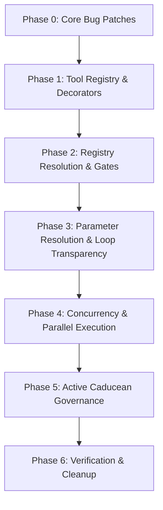

# Agent + DER Unification Plan (Caducean-governed)

**Date:** 2026-07-12  
**Status:** Unified Design Draft (Approved for implementation)  
**Author:** Architecture analysis (Pair Programming Session)

---

## 0. Mandate, Non-Negotiables & Newly Discovered Gaps

### Problems & Gaps Identified
1. **Name resolution hackiness**: Getting the agent to do a web search required three hand-wired hacks:
   - `_plan_task` RULES forcing the LLM to emit `"tool":"search"`.
   - `_TOOL_ALIASES` mapping `web_search`/`google_search` → `search` in `tool_bridge.py`.
   - A force-`search` injection in the DER queue build in `agent_kernel.py`.
   - **Root Cause**: The DER planner selects tools via free-text JSON string matching against a hardcoded `if/elif` dispatch chain. Any name variation leads to a silent fallback to `_run_step_direct`.
2. **The Session ID Queue Modulation Bug (Live)**: In `agent_kernel.py:4701`, the loop calls `item = queue.next_ready()` with no arguments, defaulting to `session_id="default"`. This makes Caducean queue modulation (critical-only filtering and TOPO_VIOLATION check) silently inoperative for all real session IDs.
3. **Static Parameters in Long-Horizon Chaining**: The DER executor runs upfront plan steps sequentially but never propagates outputs from step $N$ to the parameters of step $N+1$. Dependent steps execute in informational isolation.
4. **Blind Loop Explorer**: In `_der_plan_next_step`, the LLM is asked if the objective is met without seeing the actual text outputs of the completed steps (`step_outputs`), making the "exceptional standard" evaluation blind.
5. **Blind Trailing Director**: `trailing_director.py` reads `completed_step.result` to check for depth gaps, but the `QueueItem` dataclass does not have a `.result` field, making all gap analysis run on `"no result"`.
6. **Conflated Caducean Semantics**: The legacy proposal mapped Caducean codes directly to task states (`STOP_DONE=0 / ASK=1`). However, `caducean.cpp` defines these as physics states (`0` = EXPAND, `1` = COMPRESS). Direct mapping would cause the agent to stop when it should expand, and prompt the user when it should focus.

### Goal
One unified Agent + DER execution system where:
1. **Tools are registry-driven** via decorators; execution is mapped to registry schemas.
2. **Step parameters resolve dynamically** between dependent steps.
3. **Parallel tool execution is active** for concurrency-safe steps.
4. **Caducean recommendations govern loops actively** (modulating LLM temperature, queue pruning, and termination thresholds) using correct physics semantics.
5. **Core bugs are completely patched** (session ID, trailing director results).

---

## 1. Core Architectural Pillars

### Pillar A — Tool Registry & Dispatch Unification
We introduce a single-source-of-truth registry in `backend/agent/tool_registry.py`.

```python
@dataclass
class ToolSpec:
    name: str                       # Canonical name, e.g. "search"
    description: str
    parameters: Dict[str, Any]      # JSON-schema for LLM function calling
    category: str                   # web / file / system / dev / etc.
    aliases: List[str] = field(default_factory=list)
    requires_internet: bool = False
    requires_desktop: bool = False
    permission_tier: str = "low"    # low / medium / high
    executor: str = "internal"      # internal / mcp / dev / crawler / research / memory
    mcp_server: Optional[str] = None
    mcp_tool: Optional[str] = None
```

* **Decorator-based Registration**: Tools decorate themselves via `@register_tool(spec)`.
* **Declarative Gates**: Blocks like `InternetGate` and `DesktopGate` collapse into a single check:
  ```python
  def capability_allowed(spec: ToolSpec) -> bool:
      if spec.requires_internet and not get_global_internet_access(): return False
      if spec.requires_desktop and not get_desktop_control_enabled(): return False
      return True
  ```
* **Alias Resolution**: `resolve_tool(name)` normalizes names and checks aliases, removing manual mappings.

---

### Pillar B — Dynamic Param Resolution & Concurrency (Long-Horizon)

To allow the agent to solve complex, long-horizon tasks, we update the DER loop to support dynamic parameter flow and concurrent tool execution:

#### 1. Dynamic Parameter Resolution
Between step executions in `_execute_plan_der`, we resolve placeholder parameters in pending steps that depend on completed steps:
```python
def resolve_dependent_params(completed_item: QueueItem, result: str, pending_items: List[QueueItem]):
    for item in pending_items:
        if completed_item.step_id in item.depends_on:
            # Parse result for requested keys and inject them into item.params
            ...
```

#### 2. Concurrency-Safe Parallel Execution
Instead of executing steps one-by-one, the execution loop will retrieve all ready steps via `queue.all_ready_items(session_id)` and split them:
* **Parallel-Safe Tools** (`search`, `read_file`, `git_status`, `recall_memory`): Run concurrently using `asyncio.gather`.
* **Sequential Tools** (`write_file`, `run_command`, `git_commit`): Run sequentially with state locks.

---

### Pillar C — Active Caducean Policy Governance

Caducean recommendations are mathematical physics signals (`0`=EXPAND, `1`=COMPRESS, `2`=MAINTAIN, `3`=TOPO_VIOLATION). We use them to govern loops actively:

1. **Queue Modulation**:
   * `rec == 0` (EXPAND): Run full ready list.
   * `rec == 1` (COMPRESS): Filter list to `critical=True` steps only.
   * `rec == 3` (TOPO_VIOLATION): Halt loop and raise `TopologyViolationException`.
2. **Termination modifier**:
   * If the queue is complete:
     * If `rec == 1` (COMPRESS): Exit immediately (`STOP_DONE`). Skip expensive Explorer LLM check.
     * If `rec == 0` (EXPAND): Fall through to Explorer LLM check (`_der_plan_next_step`) to see if more exploration is needed.
3. **Dynamic Planning Temperature**:
   * In `_plan_task`, query Caducean attentional momentum $u$:
     * $u > 0.3$ (expanding attractor): Scale planning temperature up (+0.15) to allow creative pathfinding.
     * $u < -0.3$ (compressing attractor): Force temperature to $0.0$ for rigid, precise plan structures.
4. **Step Result Transparency**:
   * Pass actual `step_outputs` into `_der_plan_next_step` so the Explorer evaluates true outcomes.
   * Store `step_result` in `QueueItem.result` so the `TrailingDirector` has data to perform gap analysis.

---

## 2. Complete File Impact Checklist

### 2.1 Backend Agent Core (Python)
* **[backend/agent/agent_kernel.py](file:///c:/dev/IRISVOICE/backend/agent/agent_kernel.py)**:
  * Pass current session ID `_session` to `queue.next_ready()`.
  * Implement dynamic parameter resolution and pass actual `step_outputs` to `_der_plan_next_step`.
  * Scale planning temperature in `_plan_task` based on Caducean state `u`.
  * Update DER execution loop termination using Caducean recommendations.
* **[backend/agent/tool_bridge.py](file:///c:/dev/IRISVOICE/backend/agent/tool_bridge.py)**:
  * Replace static tools dictionary and `_TOOL_ALIASES` with registry resolution.
  * Consolidate execution blocks and gates through `capability_allowed(spec)`.
* **[backend/agent/der_loop.py](file:///c:/dev/IRISVOICE/backend/agent/der_loop.py)**:
  * Add `result` attribute to `QueueItem`.
  * Implement `all_ready_items(session_id)` supporting concurrent step execution.
* **[backend/agent/trailing_director.py](file:///c:/dev/IRISVOICE/backend/agent/trailing_director.py)**:
  * Verify gap analysis reads the populated `completed_step.result`.
* **[backend/agent/tool_registry.py](file:///c:/dev/IRISVOICE/backend/agent/tool_registry.py)** **[NEW]**:
  * Implement `ToolSpec`, registry mapping, and `@register_tool` decorators.
* **[backend/agent/permissions.py](file:///c:/dev/IRISVOICE/backend/agent/permissions.py)**:
  * Read `permission_tier` directly from the registry's `ToolSpec` in `classify_tool`.
* **[backend/agent/tools/*](file:///c:/dev/IRISVOICE/backend/agent/tools/)** (all tool modules):
  * Apply decorators for self-registration.

### 2.2 Frontend Web Interface (Verify-only)
* **[hooks/useTaskProgress.ts](file:///c:/dev/IRISVOICE/hooks/useTaskProgress.ts)** & **[components/chat/TaskListCard.tsx](file:///c:/dev/IRISVOICE/components/chat/TaskListCard.tsx)**:
  * Verify rendering logic for concurrent step updates and dynamically added steps.

### 2.3 Automated Pytest Suite
* **[backend/tests/test_der_loop.py](file:///c:/dev/IRISVOICE/backend/tests/test_der_loop.py)** & **[backend/tests/test_caducean_v2_integration.py](file:///c:/dev/IRISVOICE/backend/tests/test_caducean_v2_integration.py)**:
  * Extend to cover parallel queue checks, registry resolution, and loop temperature modulation.

---

## 3. Phased Migration Strategy



### Phase 0 — Core Bug Patches (Immediate)
* Pass `_session` to `queue.next_ready()` in `agent_kernel.py` to fix Caducean session routing.
* Add `result` attribute to `QueueItem` in `der_loop.py`.
* Populate `completed_step.result` in `agent_kernel.py` to restore `TrailingDirector` functionality.

### Phase 1 — Tool Registry Scaffold
* Create `tool_registry.py`.
* Register all core backend tools via `@register_tool`. Ensure no internals are imported by the core modules at startup.

### Phase 2 — Dispatcher & Gates Migration
* Route `execute_tool` in `tool_bridge.py` through registry lookup.
* Consolidate capability gates through `capability_allowed(spec)`. Remove static dictionaries and aliases.

### Phase 3 — Parameter Resolution & loop Transparency
* Implement parameter flow from step $N$ result to step $N+1$ dependencies in `_execute_plan_der`.
* Include `step_outputs` in the prompt built for `_der_plan_next_step`.

### Phase 4 — Concurrent Tool Execution
* Update `_execute_plan_der` to group ready items and execute parallel-safe tools concurrently via `asyncio.gather`.
* Extend `test_der_loop.py` to verify step dependencies and parallel checks.
* **Phase 4a (MECHANISM — DONE):** `QueueItem.parallel_safe` field + `DERExecutionQueue.all_ready_items(session_id)` added; `_der_run_step_execution` (sync) / `_der_run_step_execution_async` / `_der_exec_steps_concurrent` (asyncio.gather) + extracted `_der_finalize_step` helper wired into the loop.
* **Phase 4b (TRIGGER — DONE, registry-derived):** `parallel_safe` is derived from the tool registry via `is_parallel_safe(tool_name)` (the authoritative gate), applied in `_execute_plan_der` (step build) and the explorer path (`_der_plan_next_step`). The LLM planner does NOT emit the flag — concurrency is decided by the registry, which is more robust than trusting the model. Read-only / independent tools (`search`, `read_file`, `list_directory`, `recall_memory`, `git_status`, `vision_analyze_screen`, `vision_detect_element`, `vision_get_context`, `github_*` reads) are `parallel_safe=True`; mutating / stateful / desktop-control tools (`write_file`, `git_commit`, `run_command`, `delete_file`, `crawler_query`, `gui_click/type/press_key`, `take_screenshot`, `shutdown`, Blender scene edits) are `parallel_safe=False` so they always run serially (no races on shared state). `is_parallel_safe` fails closed (unknown/None → False). The concurrent batch is therefore **ACTIVE**, not dormant.
* **Phase 4c (RESULT REFINEMENT — DONE):** Added `_format_tool_result(raw)` (staticmethod) applied in both DER exec helpers and the ReAct/voice tool path. It extracts the meaningful content key (`result`/`results`/`content`/`output`/`text`/`data`/`response`) from tool dicts, surfaces errors explicitly, and falls back to compact JSON — replacing the old `str(raw)` Python-repr in the DER path (the ReAct path already used `json.dumps`). The full structured result is still captured verbatim by `_capture_tool_result` (document store), so nothing is lost for later reformatting. Tests: `test_der_concurrent.py` (format cases) + `test_tool_registry.py::test_is_parallel_safe_function_gate`.

### Phase 5 — Active Caducean Governance (DONE)
* **Temperature modulation (DONE):** `_plan_task` now calls `_caducean_modulate_temperature(base, session_id)` (staticmethod, pure + never raises). COMPRESS (`rec==1`) → temperature halved (more deterministic); EXPAND (`rec==0`) → ×1.2 capped at 0.6 (more exploratory); MAINTAIN/unknown/TOPO_VIOLATION → base. `_plan_task` signature gained `session_id` (caller at `process_text_message` passes `session_id or self.session_id`). Tested in `test_der_concurrent.py` (4 cases).
* **rec-int loop termination (DONE):** In the DER loop, explorer re-planning (`_der_plan_next_step`) is gated on `ffi_caducean_recommend(_session) != 1` — during COMPRESS the field is condensing, so no NEW explorer steps are added (next_ready already defers non-critical steps during COMPRESS). Integrates the recommendation into loop termination.
* **`tune_dffing_params` on TOPO_VIOLATION (DONE):** In `_der_finalize_step`, when `rec==3`, before raising `TopologyViolationException`, the Duffing controller is adapted via `TrajectoryController(memory_interface.episodic.db).tune_dffing_params(_session)` so the engine self-corrects. Wrapped in try/except (never blocks the anomaly record + raise).
* Note: COMPRESS-keeps-only-critical was ALREADY implemented in `der_loop.py` (`all_ready_items` 416-418 + `next_ready` 370-372) — Phase 5 extended it with the three governance hooks above.

### Phase 6 — Verification & Cleanup
* Run all pytest files.
* Clean up legacy files and unused methods.
