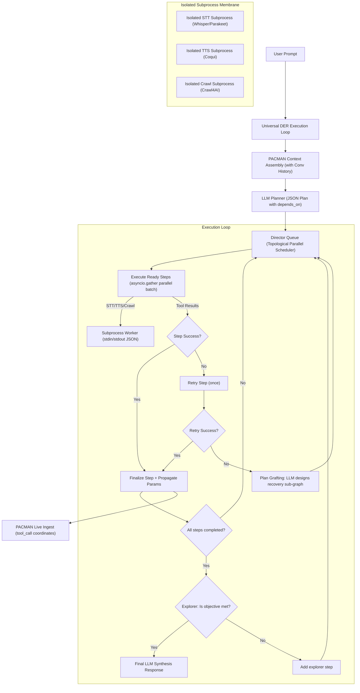

# Universal DER-PACMAN & Process Isolation Implementation Plan

This document outlines the detailed technical specifications, file changes, and testing strategies to resolve the outstanding issues from [HANDOFF-iris.md](file:///c:/dev/IRISVOICE/docs/HANDOFF-iris.md), generalize process isolation, and complete the chat card redesign.

---

## 1. Plan Overview & Execution Flow



---

## 2. Detailed Component Actions

### Phase 1: Universal DER loop & Algorithmic DAG (Backend)

#### Step 1.1: Remove keyword-based `_needs_planning` gate
* **File:** [agent_kernel.py](file:///c:/dev/IRISVOICE/backend/agent/agent_kernel.py#L1492)
* **Modification:**
  * Rewrite `_needs_planning(self, text: str) -> bool` to always return `True` when `_tool_mode` is `"auto"`.
  * If a user inputs conversational text (e.g. "hi"), the LLM planner will generate a 1-step plan where the action is a `direct` tool-less response.

#### Step 1.2: Require `depends_on` in the Planner JSON Schema
* **File:** [agent_kernel.py](file:///c:/dev/IRISVOICE/backend/agent/agent_kernel.py#L3455)
* **Modification:**
  * Update the `full_prompt` JSON schema definition in `_plan_task` to include a list of parent step IDs that the step depends on:
  ```json
  "steps": [
    {
      "step_id": "s1",
      "step_number": 1,
      "description": "description",
      "tool": "tool_name_or_null",
      "params": {},
      "depends_on": [],
      "critical": true
    }
  ]
  ```
  * Update the planning instructions: `"- In 'depends_on', provide a list of step_ids that this step depends on. If there are no dependencies, provide an empty array []."`

#### Step 1.3: Topological Sorting & Concurrency in `DirectorQueue`
* **File:** [der_loop.py](file:///c:/dev/IRISVOICE/backend/agent/der_loop.py#L335)
* **Modification:**
  * Add a `failed_ids: List[str] = field(default_factory=list)` attribute to `DirectorQueue`.
  * Add a `mark_failed(self, step_id: str)` method to `DirectorQueue`.
  * Implement topological scheduling in `next_ready` and `all_ready_items`:
  ```python
  def all_ready_items(self, session_id: str = "default") -> List[QueueItem]:
      completed = set(self.completed_ids)
      failed = set(self.failed_ids)
      vetoed = set(self.vetoed_ids)
      
      ready_items = []
      for item in self.items:
          if item.step_id in completed or item.step_id in failed or item.step_id in vetoed:
              continue
          # Check dependencies: all dependencies must be completed.
          # If any dependency failed, this item should be skipped (handled by Plan Grafting).
          if all(dep in completed for dep in item.depends_on):
              ready_items.append(item)
      return ready_items
  ```
  * Update `_execute_plan_der` to concurrent execution loop:
  ```python
  # Topological parallel execution block
  ready = [i for i in queue.all_ready_items(_session) if getattr(i, "parallel_safe", False)]
  if ready:
      # Execute concurrent batch
      results = await self._der_exec_steps_concurrent(ready, context_package, _session, _turn_id, plan)
      # Finalize each step
  ```

#### Step 1.4: Step Retry & Plan Grafting on Failure
* **File:** [agent_kernel.py](file:///c:/dev/IRISVOICE/backend/agent/agent_kernel.py#L5177)
* **Modification:**
  * In `_der_run_step_execution`, if tool execution returns `{"success": False}` or throws, perform **one retry** after a 500ms delay.
  * If the retry also fails and the step is `critical`:
    1. Mark the step as failed (`queue.mark_failed(item.step_id)`).
    2. Abort all descendant steps in the DAG by marking them with result `"[ABORTED: dependency failed]"`.
    3. Trigger LLM-based plan grafting: call `self._der_graft_recovery_plan(objective, failed_item, error_msg)`:
    ```python
    def _der_graft_recovery_plan(self, objective: str, failed_item: QueueItem, error_msg: str) -> List[QueueItem]:
        prompt = f"""
        OBJECTIVE: {objective}
        FAILED STEP: {failed_item.description}
        TOOL: {failed_item.tool}
        ERROR: {error_msg}
        
        The execution of this step failed. Provide a JSON-only recovery sub-graph containing alternative step(s) to achieve the objective or gracefully handle the error.
        Respond with: {{"steps": [{"step_id": "r1", "description": "...", "tool": "...", "params": {}, "depends_on": []}]}}
        """
        # Call model.generate and parse steps
        # Inject parsed steps into queue.items
    ```

#### Step 1.5: Final LLM Synthesis
* **File:** [agent_kernel.py](file:///c:/dev/IRISVOICE/backend/agent/agent_kernel.py#L5060)
* **Modification:**
  * If the execution finishes with failed steps in `queue.failed_ids`, call the LLM to synthesize the final response:
  ```python
  prompt = f"""
  USER TASK: {plan.original_task}
  STEPS EXECUTED:
  {done_summary}
  
  Please provide a friendly, user-facing summary of what was accomplished, what failed, and what can be done next.
  """
  ```

---

### Phase 2: Context Threading into Web Queries (Bug 3)

#### Step 2.1: Inject Context into Planning Prompt
* **File:** [agent_kernel.py](file:///c:/dev/IRISVOICE/backend/agent/agent_kernel.py#L3307)
* **Modification:**
  * Update `_build_planning_prompt` to accept `context: Optional[List[Dict[str, Any]]] = None` and `episodic_context: Optional[str] = None`.
  * **No Context Slicing:** Format the **entire conversation history** (without any index slicing like `[-5:]`) and append it as a section. The active thread is fully passed to the planner LLM.
  * **PACMAN Semantic Recall:** Retrieve semantically relevant historical context from past sessions or earlier in the conversation via `mi.episodic.assemble_episodic_context(task)` and append it as a `"RECALLED EPISODIC CONTEXT"` section.
  ```python
  if context:
      history_lines = []
      for msg in context:  # Entire thread history is included
          role = msg.get("role", "user").upper()
          content = msg.get("content", "")
          history_lines.append(f"{role}: {content}")
      sections.append(f"CONVERSATION HISTORY:\n" + "\n".join(history_lines))
  
  if episodic_context:
      sections.append(f"RECALLED EPISODIC CONTEXT (PACMAN):\n{episodic_context}")
  ```

> [!NOTE]
> This directly solves the toggle-restoration context loss. For example, if:
> * Turn 1: User says: `"Search for Tesla stock price"` (but web search toggle is off, so IRIS replies asking to turn it on).
> * Turn 2: User says: `"i turned the toggle on please do the websearch now."`
> 
> Because the planner is aware of the **entire conversation history** under Step 2.1, it reads the full thread context, maps the reference `"do the websearch"` back to the Turn 1 query `"Tesla stock price"`, and generates a plan with query `"Tesla stock price"` instead of searching for `"i turned the toggle on...".`

#### Step 2.2: Context-Aware Query Refinement
* **File:** [agent_kernel.py](file:///c:/dev/IRISVOICE/backend/agent/agent_kernel.py#L4612)
* **Modification:**
  * In the forced-tool fallback block, if `_q` has references (e.g. "those", "pricing of it"), run a quick LLM query refinement call using the **entire conversation history**:
  ```python
  refine_prompt = f"""
  CONVERSATION HISTORY (FULL):
  {history_str}
  
  CURRENT QUERY: {query}
  
  Rewrite the search query to resolve any ambiguous pronouns or references based on the full conversation history. Output the query string only.
  """
  _q = self.infer(refine_prompt, max_tokens=30, temperature=0.0).raw_text
  ```

---

### Phase 3: Persistent Conversation History Snapshot (Bug 9)

#### Step 3.1: Save conversation history to store
* **File:** [agent_kernel.py](file:///c:/dev/IRISVOICE/backend/agent/agent_kernel.py#L474) (or search for `store.save` inside `agent_kernel.py`)
* **Modification:**
  * Modify context saving to serialize the list of messages:
  ```python
  messages_to_save = []
  if self._conversation_memory:
      for msg in self._conversation_memory.messages:
          messages_to_save.append(ConversationMessage(
              role=msg.get("role"),
              content=msg.get("content"),
              timestamp=msg.get("timestamp", time.time())
          ))
  
  ctx = ConversationContext(
      conversation_id=self.conversation_id,
      messages=messages_to_save,
      tokens_used=getattr(self, "_tokens_used", 0),
  )
  store.save(self.conversation_id, ctx)
  ```

#### Step 3.2: Restore conversation history from store
* **File:** [agent_kernel.py](file:///c:/dev/IRISVOICE/backend/agent/agent_kernel.py#L494) (or search for `restore_context_from_store` inside `agent_kernel.py`)
* **Modification:**
  * Populates `self._conversation_memory` with restored messages upon session recovery:
  ```python
  if ctx and ctx.messages:
      self._conversation_memory.clear()
      for msg in ctx.messages:
          self._conversation_memory.add_message(msg.role, msg.content)
  ```

---

### Phase 4: Generalized Process Isolation, Supervision, and State Sync (Bug 1)

#### Step 4.1: STT and TTS subprocess isolation
* **File:** Create [stt_worker.py](file:///c:/dev/IRISVOICE/backend/audio/stt_worker.py), [stt_runner.py](file:///c:/dev/IRISVOICE/backend/audio/stt_runner.py), [tts_worker.py](file:///c:/dev/IRISVOICE/backend/audio/tts_worker.py), [tts_runner.py](file:///c:/dev/IRISVOICE/backend/audio/tts_runner.py)
* **Worker Execution Pattern:**
  * Standard stdin/stdout JSON lines loop.
  * `stt_worker.py` imports `faster_whisper` / `Parakeet` models, receives audio paths or float arrays via stdin, and outputs JSON transcription lines on stdout.
  * `stt_runner.py` uses `asyncio.create_subprocess_exec` to spawn the worker, handling process restarts on crash.
  * Do the same for `tts_worker.py` (model execution) and `tts_runner.py`.

#### Step 4.2: FastAPI process supervisor script
* **File:** Create [scripts/iris_supervisor.py](file:///c:/dev/IRISVOICE/scripts/iris_supervisor.py)
* **Implementation:**
  ```python
  import subprocess
  import time
  import urllib.request
  import sys

  def check_health(url):
      try:
          with urllib.request.urlopen(url, timeout=3) as resp:
              return resp.status == 200
      except Exception:
          return False

  def run():
      port = 8090
      url = f"http://127.0.0.1:{port}/health"
      while True:
          print("[Supervisor] Spawning backend process...")
          p = subprocess.Popen([sys.executable, "-m", "uvicorn", "backend.main:app", "--port", str(port)])
          
          # Wait for start
          time.sleep(5)
          
          while p.poll() is None:
              if not check_health(url):
                  print("[Supervisor] Health check failed, killing and restarting backend.")
                  p.kill()
                  break
              time.sleep(10)
          
          time.sleep(2)
  ```

#### Step 4.3: FastAPI `/health` endpoint
* **File:** [main.py](file:///c:/dev/IRISVOICE/backend/main.py)
* **Modification:**
  * Add a health route that returns backend diagnostic statistics:
  ```python
  @app.get("/health")
  def health_check():
      return {"status": "ok", "pid": os.getpid(), "memory_rss_mb": get_memory_usage()}
  ```

#### Step 4.4: Frontend Auto-Reconnect and State Sync
* **File:** [WebSocketContext.tsx](file:///c:/dev/IRISVOICE/frontend/contexts/WebSocketContext.tsx) (or the corresponding WebSocket setup)
* **Modification:**
  * In case of disconnect, transition state to `"disconnected"`.
  * Reconnect using an exponential backoff loop.
  * On reconnection, send a `"sync_state"` payload:
  ```json
  {"action": "sync_state", "session_id": "current_session_id"}
  ```
  * Backend responds with the current `DirectorQueue` items list so the frontend can restore the plan progress.

---

### Phase 5: Chat Card Redesign Completion & Fixes (Frontend)

#### Step 5.1: Fix hardcoded colors in `MermaidDiagram.tsx`
* **File:** [MermaidDiagram.tsx](file:///c:/dev/IRISVOICE/components/chat/MermaidDiagram.tsx#L30)
* **Modification:**
  * Map `glowColor` prop to theme variables:
  ```typescript
  const config = {
      theme: 'neutral',
      themeVariables: {
          primaryBorderColor: glowColor,
          lineColor: glowColor,
          nodeBorder: glowColor,
          titleColor: glowColor,
      }
  };
  mermaid.initialize(config);
  ```

#### Step 5.2: Strip card wrapper from `TaskListCard.tsx`
* **File:** [TaskListCard.tsx](file:///c:/dev/IRISVOICE/components/chat/TaskListCard.tsx#L139)
* **Modification:**
  * Remove `bg-[var(--glass-bg)]/40`, `backdrop-blur-md`, `border border-white/[0.04]`, and `rounded-2xl` classes from the container element.

---

## 3. Comprehensive Verification & Test Plan

### Automated Test Cases

#### 1. Universal planning test
* **File:** Create `backend/tests/test_universal_planning.py`
* **Assertion:** Send `"Hello, IRIS"` to `_execute_plan_der` and assert that a single-step plan of action `direct` is constructed, sent to the Reviewer, executed, and completed. Assert that `mycelium_record_plan_stats` is called on completion.

#### 2. Topological scheduling test
* **File:** Create `backend/tests/test_topological_scheduler.py`
* **Assertion:** Create a plan containing three steps: `s1` (no dependency), `s2` (depends on `s1`), `s3` (no dependency). Set `parallel_safe=True` on `s1` and `s3`. Assert that `queue.all_ready_items()` returns `[s1, s3]` first. After completing `s1`, assert that `queue.all_ready_items()` returns `[s2, s3]`.

#### 3. Plan grafting test
* **File:** Create `backend/tests/test_plan_grafting.py`
* **Assertion:** Mock a failed tool call for step 1 of a plan. Execute the plan, assert that the runner retries once, fails, cancels the downstream dependent steps, calls the LLM recovery prompt, and successfully grafts the new recovery steps into `queue.items`.

#### 4. Context-aware web query test
* **File:** Create `backend/tests/test_context_aware_query.py`
* **Assertion:** Populate `_conversation_memory` with messages about "Apple Vision Pro". Execute a plan with query "search the pricing of those". Assert that the query extraction call returns refined query "Apple Vision Pro pricing".

#### 5. STT/TTS subprocess isolation test
* **File:** Create `backend/tests/test_subprocess_isolation.py`
* **Assertion:** Start `stt_runner`. Send mock audio, assert ASR returns correctly. Kill the child process mid-transcription, verify `stt_runner` restarts the process and reports failure gracefully without throwing exceptions.

---

## 4. Open Questions

> [!IMPORTANT]
> **Subprocess Migration Scope:** Should we migrate STT/TTS processes to workers in this cycle, or implement the process supervisor and auto-reconnect state sync first as phase 1, and defer the CUDA-level model worker migrations to phase 2?
