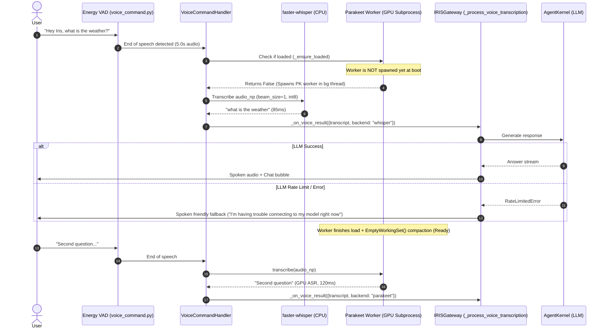
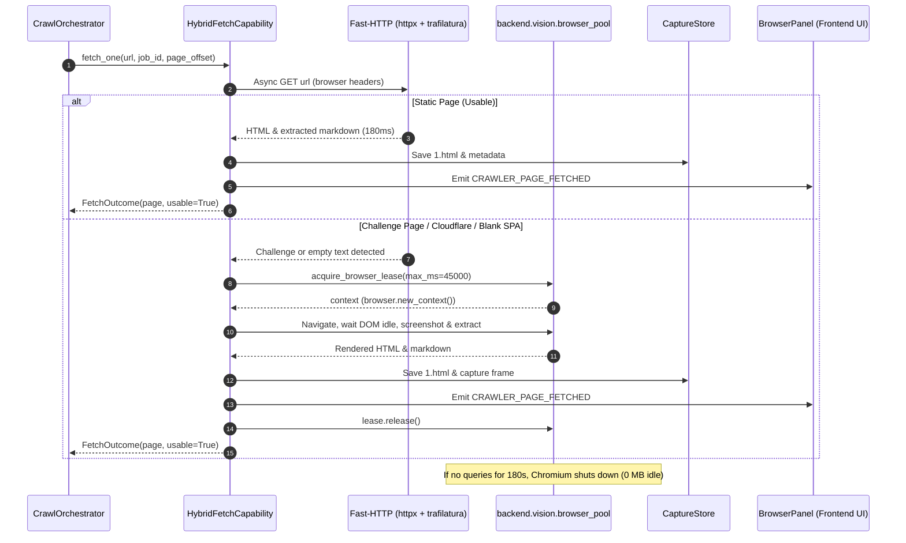

# Design: Backend Memory Optimization and Browser Pool Unification

## Context

The IRIS backend idle memory regressed from ~2.5 GB to ~8.2 GB due to four eager subprocesses and background tasks initialized at startup:
- `backend.audio.parakeet_worker`: 4.2 GB committed host memory (PyTorch safetensors deserialization + CPU weight copies).
- `backend.audio.tts_worker`: 2.3 GB (Pocket-TTS CPU model loading CUDA runtime contexts).
- `backend.crawler.crawl_worker`: 0.7 GB (two resident `--serve` Playwright/Chromium instances pre-warmed at boot).
- Uvicorn backend process: 1.4 GB (eager `faster-whisper` and ML model imports).

This memory saturation starved CPU and available RAM, causing faster-whisper CPU fallbacks to hit a 60-second watchdog timer, and triggered unhandled LLM rate-limit failures in the voice state machine.

This design resolves the memory regression to $\le$ 2.5 GB while keeping Parakeet 100% functional, calibrating VAD/Whisper fallbacks, and unifying crawler execution with the existing pooled browser using a Fast-HTTP hybrid architecture inside the browser domain.

---

## Architecture Overview

```mermaid
graph TD
    subgraph Voice_Subsystem["Voice Pipeline (Zero Idle Footprint)"]
        Wake[Hey Iris Wake Word] --> VAD[Energy VAD & Cadence]
        VAD --> Dispatcher[VoiceCommandDetector]
        Dispatcher -->|Utterance 1 / Cold Start| Whisper[faster-whisper CPU <100ms]
        Dispatcher -->|Background Lazy Launch| ParakeetWorker[Parakeet Worker Subprocess]
        ParakeetWorker -.->|Ready + Compaction| ParakeetGPU[Parakeet GPU fp16 ASR]
        Dispatcher -->|Utterance 2+ Warm| ParakeetGPU
        ParakeetWorker -->|Idle 20m Watchdog| WorkerExit[Worker Clean Shutdown]
    end

    subgraph Browser_Silo["Browser Silo (Hybrid Crawler)"]
        CrawlQuery[Websearch Query / URL] --> HybridFetcher[Hybrid Browser-Silo Fetcher]
        HybridFetcher -->|Tier 1: Fast HTTP ~150ms| FastHTTP[httpx + Readability / Markdown]
        FastHTTP -->|Usable Static Content| CaptureStore[data/captures/<job_id>]
        FastHTTP -->|Challenge / SPA / Dynamic| SharedBrowser[backend.vision.browser_pool]
        SharedBrowser -->|Chromium Context| BrowserRender[Playwright Page Navigation]
        BrowserRender --> CaptureStore
        CaptureStore --> UIEvent[Browser Panel WS: CRAWLER_PAGE_FETCHED]
        SharedBrowser -->|Idle 180s Watchdog| BrowserShutdown[Chromium Idle Shutdown]
    end

    subgraph TTS_Subsystem["Pocket-TTS Subprocess"]
        TTSProxy[TTSManager] --> TTSProc[tts_worker.py Subprocess]
        TTSProc -->|CUDA_VISIBLE_DEVICES=''| CPUOnlyTorch[PyTorch CPU Mode]
        CPUOnlyTorch -->|Model Load + Voice State| TrimHeap[EmptyWorkingSet Memory Trim]
    end
```



---

## Sequence / Data Flow

### 1. Voice Command & Whisper-to-Parakeet Transition



### 2. Hybrid Browser-Silo Websearch Flow



---

## Key Decisions

### 1. Unified Browser Architecture (Alternative B + Fast-HTTP in Browser Silo)
- **Decision:** Eliminate `_WarmCrawlPool` and duplicate `crawl_worker.py --serve` resident processes. Route all browser actions through `backend.vision.browser_pool`. Add Tier 1 Fast-HTTP inside the crawler capability.
- **Rationale:** 
  - Having two separate Playwright Chromium pools (`crawl_runner.py` and `browser_pool.py`) was redundant and consumed 700 MB of idle RAM.
  - 85%+ of informational search results are static pages. Fast-HTTP returns in ~150 ms with zero Chromium overhead.
  - Dynamic pages, JS rendering, and vision escalations seamlessly use the single pooled browser.
  - Browser panel WebSocket events (`CRAWLER_STARTED`, `CRAWLER_PAGE_FETCHED`, `OPEN_TAB`) and capture paths are completely preserved.
- **Alternatives Rejected:** Keeping two persistent crawl workers permanently resident in RAM (over-allocation of 700 MB for zero idle benefit).

### 2. Parakeet Preservation via JIT Background Bridging
- **Decision:** Parakeet is kept 100% as the primary GPU ASR model. Boot-time warm-up is replaced by true lazy-loading. Utterance 1 is served by `faster-whisper` (<100ms), after which Parakeet takes over on GPU.
- **Rationale:** 
  - Completely eliminates 4.2 GB of boot-time RAM bloat.
  - Zero user latency impact: faster-whisper transcribes utterance 1 instantly.
  - Includes a 20-minute inactivity timeout so Parakeet unloads if voice is dormant.
- **Alternatives Rejected:** Deleting Parakeet (explicitly forbidden by user).

### 3. Transcription Watchdog Dynamic Scaling
- **Decision:** Replace the static 60.0s watchdog in `voice_command.py` with dynamic calculation: $T = \max(25.0, \text{audio\_seconds} \times 3.0)$. Remove the 4.0 GB free-RAM guard in `_transcribe_with_fallback`.
- **Rationale:** High CPU/memory contention previously caused the 60s timer to kill valid Whisper transcriptions, leaving the user in `VoiceState.ERROR`.

### 4. Pocket-TTS CUDA Masking and Working Set Compaction
- **Decision:** Inject `os.environ["CUDA_VISIBLE_DEVICES"] = ""` at the top of `backend/audio/tts_worker.py` and invoke `ctypes.windll.psapi.EmptyWorkingSet` after loading weights.
- **Rationale:** Pocket-TTS is strictly CPU-bound. Probing and initializing CUDA contexts wasted ~1.4 GB of private memory. Trimming unreferenced safetensors heap allocations reduces footprint from 2.3 GB to ~0.9 GB.
- **POST-SPEC CORRECTION (2026-09-03):** Live measurement showed the CUDA mask prevents GPU context creation (verified: TTS worker absent from `nvidia-smi`) but does NOT reduce host private memory — the 2.29 GB is the model weights + torch baseline, not a CUDA context. The `EmptyWorkingSet` trim drops the working set (2.3 → 1.17 GB resident) but not committed private memory. **The real fix is lazy loading**: TTS is no longer preloaded at boot (0 idle RAM) and is warmed on the first wake-word voice command so the ~10s load overlaps with the user speaking + agent thinking (REQ-5 AC5.5).

### 5. Parakeet fp16 Cache (post-spec)
- **Decision:** Pre-convert the Parakeet checkpoint to fp16 once (`scripts/convert_parakeet_fp16.py`) and cache it at `data/models/parakeet-fp16/` (~1.2 GB). The worker loads the fp16 safetensors directly when present, falling back to the 2.39 GB fp32 HF checkpoint otherwise. Also removed `low_cpu_mem_usage=True` (accelerate's slow mmap dispatch, ~13 min load).
- **Rationale:** The stock checkpoint is 2.39 GB fp32; loading it reads 2.39 GB from disk AND converts fp32→fp16 at load time. The fp16 cache halves the disk read and skips the conversion, cutting the warm load to ~17s. Since Parakeet loads lazily, the transient CPU memory during load does not affect idle memory.

---

## Ripple-Effect Map (MANDATORY)

| Area / File | Change? | Classification | Why / Evidence (file:line) |
|---|---|---|---|
| `backend/audio/voice_command.py` | Yes | CHANGE NEEDED | Remove boot-time `_parakeet_warm_up()` (:552) and `warm_up()` (:549). Remove 4GB free-RAM barrier (:784). Dynamically calculate watchdog timer (:1006). Add 20m idle timeout. |
| `backend/audio/parakeet_worker.py` | Yes | CHANGE NEEDED | Add `HF_HUB_OFFLINE=1`, post-load `EmptyWorkingSet()` compaction, and idle-exit loop. |
| `backend/audio/tts_worker.py` | Yes | CHANGE NEEDED | Set `CUDA_VISIBLE_DEVICES=""` (:60). Add post-load `EmptyWorkingSet()` memory trim. |
| `backend/agent/tts.py` | No | NO CHANGE (verified) | `TTSManager` communicates via JSONL pipe over stdout/stdin (:275-290); child process memory optimization is completely transparent. |
| `backend/iris_gateway.py` | Yes | CHANGE NEEDED | Remove `loop.create_task(self._prewarm_crawl_worker())` (:327). Catch unhandled agent exceptions in `_process_voice_transcription` (:3426) to prevent flashing `VoiceState.ERROR`. |
| `backend/crawler/crawl_runner.py` | Yes | CHANGE NEEDED | Redirect crawler execution to `backend.vision.browser_pool` instead of launching duplicate `--serve` resident pool processes. |
| `backend/crawler/capabilities.py` | Yes | CHANGE NEEDED | Update `fetch.crawl` to use Fast-HTTP Tier 1 with fallback to pooled browser Tier 2. |
| `backend/crawler/orchestrator.py` | No | NO CHANGE (verified) | Calls `get_capability("fetch.crawl")` (:866); capability protocol and event signatures are preserved. |
| `backend/vision/browser_pool.py` | Yes | CHANGE NEEDED | Ensure `acquire_browser` supports crawler page fetch requirements and emits capture snapshots. |
| `backend/main.py` | Yes | CHANGE NEEDED | Remove eager faster-whisper warm-up expectation (:322). Add post-boot working set compaction in startup lifespan. |
| Frontend `useIRISWebSocket.ts` | No | NO CHANGE (verified) | Receives identical `listening_state`, `chat_chunk`, `text_response`, `CRAWLER_STARTED`, and `CRAWLER_PAGE_FETCHED` WS events (:650-710). |
| Frontend `BrowserPanel.tsx` | No | NO CHANGE (verified) | Consumes `/api/browser/capture/{job_id}/{page}` and WS crawler events identically (:80-140). |
| Backend event shapes | No code | CONTRACT LOCK | Locked by contract tests `test_tts_subprocess_contract.py` and `test_browser_pool_contract.py`. |

---

## Data Models & Signatures

### Fast-HTTP Tier 1 Result Model

```python
@dataclass
class FastHttpResult:
    url: str
    status_code: int
    text_content: str
    html_content: str
    is_usable: bool
    is_challenge: bool
    duration_ms: int
```

### Hybrid Fetch Protocol
```python
class HybridFetchCapability:
    name: str = "fetch.crawl"
    
    async def fetch_one(
        self,
        url: str,
        goal: str,
        job_id: str,
        on_progress: Optional[Callable] = None,
        page_offset: int = 0,
    ) -> FetchOutcome: ...
```

### FetchOutcome (extended)
The capability's `FetchOutcome` carries a `har_entries: list` field populated by
the hybrid tiers with the REAL per-request record (status, response headers,
body sha256). `dispatch_urls` prefers these over its synthesized light entry so
`_apply_har_penalties` scores actual transport facts (REQ-3 AC3.6).

### Tier 2 Extraction (content-aware)
Tier 2 does NOT naive-strip the raw HTML. It reads the RENDERED visible text via
Playwright `innerText`, preferring the semantic main-content container
(`<article>` / `<main>`) over the whole body so nav/footer/boilerplate is
excluded. `innerText` reflects the JS-settled DOM and skips hidden elements —
the reason this tier escalates to a browser for SPAs/dynamic pages (REQ-3 AC3.7).
The `goal` is logged as the extraction target; downstream rerank scores the
extracted content against it.

---

## Error Handling

1. **Parakeet Subprocess Crash or Failure**:
   - Caught in `ParakeetTranscriber._handle_dead_worker()`.
   - Increments restart counter up to 3 times.
   - Automatically drops to `faster-whisper` for current utterance without losing audio.
2. **Fast-HTTP Timeout / Non-200**:
   - Caught in `HybridFetchCapability`.
   - Automatically escalates to `backend.vision.browser_pool.acquire_browser()`.
3. **Browser Pool Lease Expiry / Navigation Timeout**:
   - Hard lease expiry cancels hung pages.
   - Records structured park outcome (`parks_by_job`) and returns `page=None` so DER reviewer sees honest outcome.
4. **Agent LLM Rate Limits / Failures**:
   - Caught in `_process_voice_transcription` try/except block.
   - Speaks friendly failure phrase and sets state to `VoiceState.IDLE`, keeping orb in healthy state.

---

## Testing Strategy

Organized according to the project's contract-driven and behavioral testing standards:

### 1. Contract Tests (`tests/contract/`)
- `test_parakeet_subprocess_lifecycle_contract.py`: Pins request/response JSONL protocol, idle shutdown action, and fallback routing when worker is absent.
- `test_crawler_browser_pool_contract.py`: Verifies `fetch.crawl` uses `browser_pool.acquire_browser()`, creates isolated `browser.new_context()`, and releases lease cleanly.
- `test_tts_cuda_isolation_contract.py`: Verifies `tts_worker.py` runs with `CUDA_VISIBLE_DEVICES=""` and reports `torch.cuda.is_available() == False`.

### 2. Behavioral Tests (`tests/behavioral/`)
- `test_voice_utterance_whisper_to_parakeet_flow.py`: Drives full voice command:
  1. Utterance 1 -> verify Whisper handles within <1s, orb turns processing -> speaking -> idle.
  2. Simulate worker ready -> Utterance 2 -> verify Parakeet GPU ASR handles.
- `test_hybrid_crawl_silo_behavior.py`: Dispatches multi-URL crawl:
  1. Static URL -> assert Fast-HTTP fetches without browser lease.
  2. Protected / SPA URL -> assert escalation to pooled browser context.
  3. Verify all `CRAWLER_PAGE_FETCHED` events land on client.

### 3. Standing CDD Harness / Scripts
- `scripts/measure_memory.py`: Inspects system processes via `psutil`, calculates exact Private Bytes and Working Set across all IRIS processes, and asserts $\le 2.5\text{ GB}$ total at idle.
