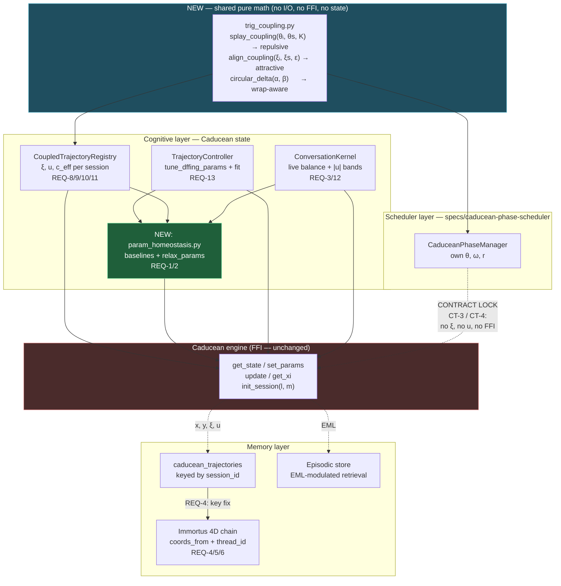
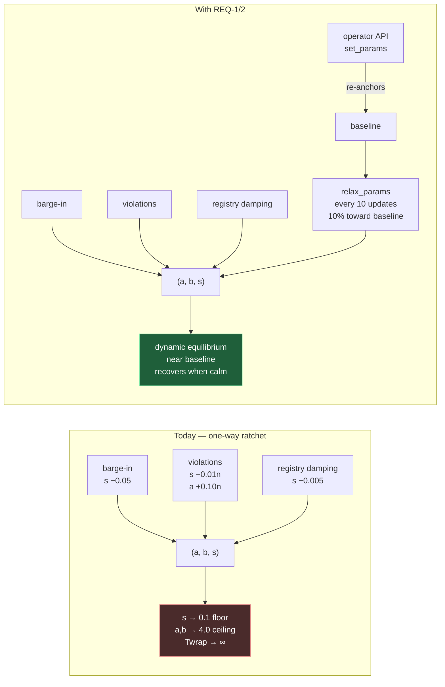
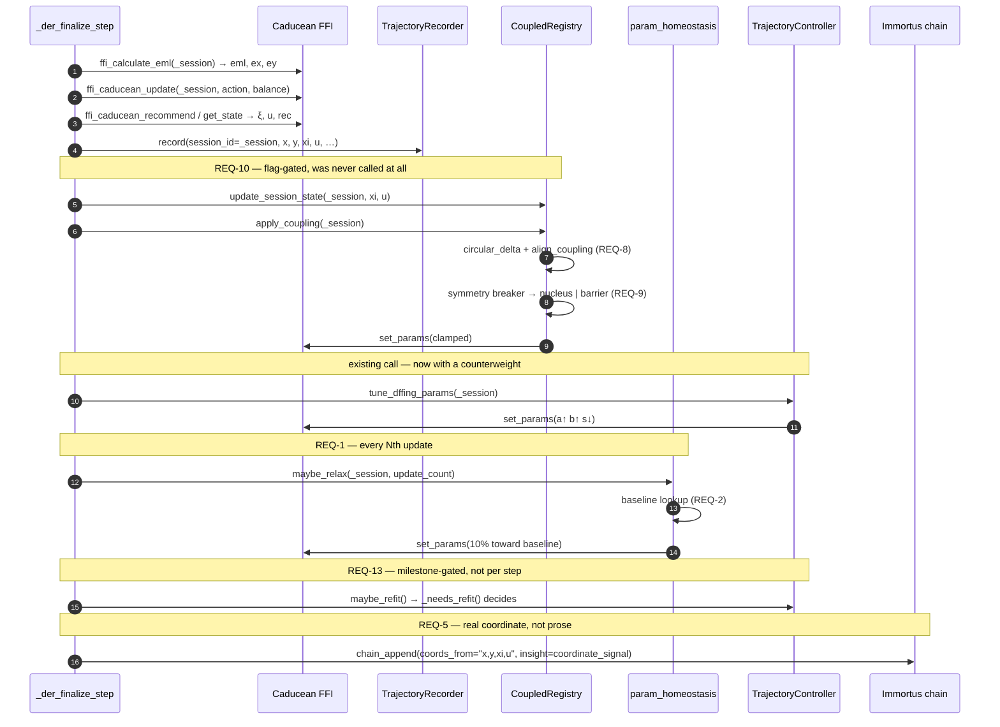
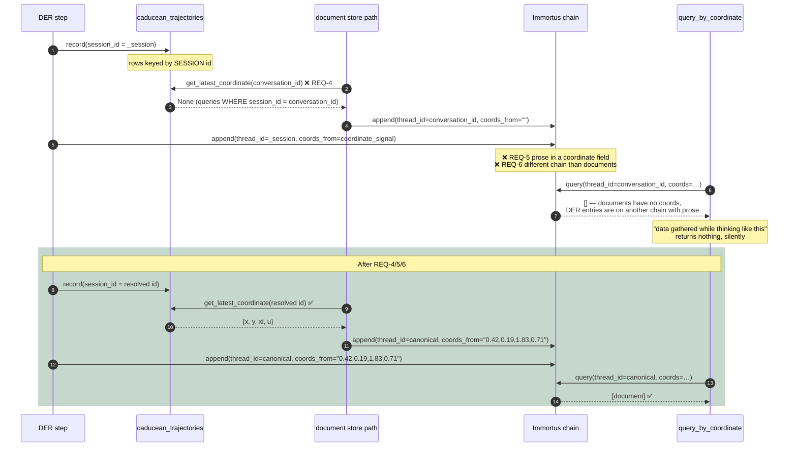
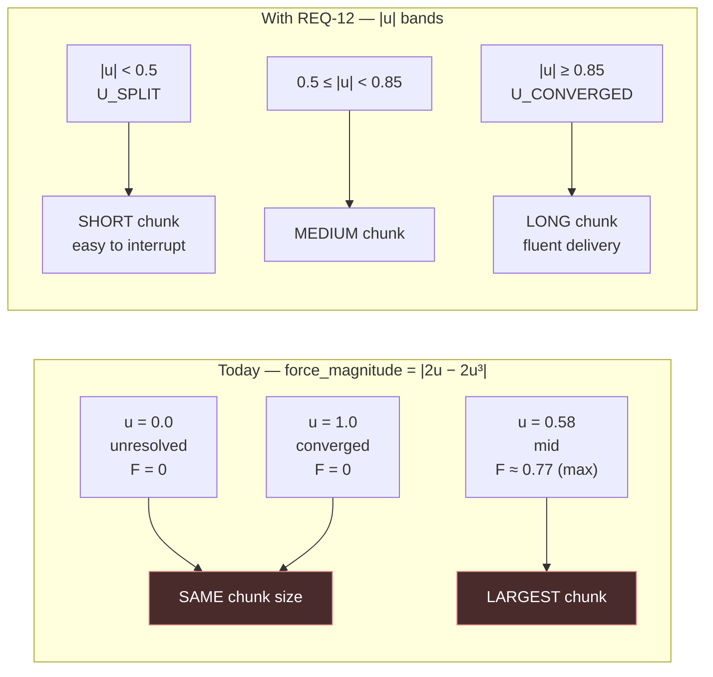

# Design: Caducean Kernel Unification

## Context

Three consumers were cultivated from `docs/CADUCEAN_TECHNICAL_OVERVIEW.md`. Their as-built
condition, verified against code:

| Consumer | Overview §11 says | Actual state |
|---|---|---|
| DER governor (`agent_kernel`) | (not listed) | **Working.** Updates the engine, records trajectories, tunes params, splits on `\|u\|` bands. |
| ConversationKernel (voice) | "designed but not yet built" | **Built and wired** ([iris_gateway.py:1884](backend/iris_gateway.py:1884)) — but its main physics read passes `balance=1.0`, the exact setting §3 says reproduces metastability. |
| TrajectoryController | "designed but not yet built" | **Built, quarter-wired.** `tune_dffing_params` fires from DER; `fit()`/`should_fire()` only from AutoResearch, which never starts at boot. |
| CoupledTrajectoryRegistry (§10) | presented as validated | **Zero production callers.** And bugged: the nucleus nudge is computed and never applied, so both parties become barriers. |

Underneath all four sits a defect none of them can escape: **every writer of `(a, b, s)` pushes
the same direction.** There is no restoring force on the parameters, only on the state they
govern. And underneath *that*, three independent breaks in the physics→memory path mean the
flagship recall primitive — "data gathered while thinking like this" — resolves to nothing.

**Bounding constraints:**

| Constraint | Source | Consequence |
|---|---|---|
| Tests are the requirement; never edit one to pass | `CLAUDE.md` | Every change verified against existing assertions before design (see requirements.md compatibility table). |
| Scheduler must not read `ξ`/`u` | `specs/caducean-phase-scheduler/` D-2, CT-3/CT-4 | Shared module is pure floats, no gateway import (REQ-7 AC2, REQ-14). |
| Safe ranges are validated, not arbitrary | [trajectory_controller.py:196-200](backend/agent/trajectory_controller.py:196) | Relaxation operates strictly inside `a,b ∈ [1,4]`, `s ∈ [0.1,0.8]`. |
| No new background tasks | `specs/caducean-phase-scheduler/` D-3 precedent | Relaxation and refit ride the existing DER update cadence. |
| `Twrap = 2π/(s·c_eff·balance)` | overview §4 | Any `s` decay directly inflates wrap time — which is why the ratchet is the priority. |
| FFI has no `u` injection | [coupled_registry.py:166-169](backend/agent/coupled_registry.py:166) | Coupling must act through `(a, b, s)`, as today. Not changed here. |

---

## Architecture Overview



Two properties worth naming:

1. **`trig_coupling.py` fans out to both layers but carries no state.** That is the whole
   unification: one implementation of `ε·sin(Δθ)`, two sign conventions, two independent state
   spaces. The dashed lock from `PM` to the FFI is what keeps the unification from becoming
   entanglement.
2. **`param_homeostasis.py` is the only new inbound edge to `set_params` that pulls rather than
   pushes.** Today four writers push (three toward lower `s`, all toward higher `a`/`b`); this is
   the counterweight.

### The ratchet, and the counterweight



---

## Sequence / Data Flow

### The repaired DER update site (REQ-1, REQ-10, REQ-13, REQ-5)

All four of these ride one existing call site — no new schedule, no new task.



### The physics→memory path: three breaks, one repair



### Voice chunk sizing: why force magnitude is the wrong quantity (REQ-12)



The left column is the defect stated precisely: `F(u)` is zero at both ends of the range and
peaks in the middle, so the *least* resolved and *most* resolved states get identical pacing
while the ambivalent middle gets the longest, hardest-to-interrupt chunks. Exactly backwards.

---

## Data Models

### `backend/agent/trig_coupling.py` (NEW — pure math)

```python
def circular_delta(a: float, b: float) -> float:
    """Signed shortest angular distance a−b on the circle, in (−π, π]."""

def splay_coupling(theta_i: float, thetas: Sequence[float], k: float) -> float:
    """REPULSIVE. Returns +(k/N)·Σ sin(θᵢ − θⱼ). Fixed point: even spacing.
    Consumer: CaduceanPhaseManager. Sign convention: positive k repels."""

def align_coupling(xi_i: float, xis: Sequence[float], eps: float) -> float:
    """ATTRACTIVE. Returns −(eps/N)·Σ sin(ξᵢ − ξⱼ). Fixed point: alignment.
    Consumer: CoupledTrajectoryRegistry. Sign convention: positive eps attracts."""
```

No imports beyond `math` and `typing`. No state, no logging, no FFI (REQ-7 AC2, REQ-14 AC1).
The docstrings carry the sign convention because a flipped sign is silent and inverts intent
(REQ-7 AC3).

### `backend/agent/param_homeostasis.py` (NEW)

```python
@dataclass
class ParamBaseline:
    session_id: str
    a: float = 2.0      # Gate 1 baseline, trajectory_controller.py:197-200
    b: float = 2.0
    s: float = 0.35
    last_touched: float = 0.0
    perturbations: Dict[str, int] = field(default_factory=dict)  # writer → count
    relaxations: int = 0

SAFE_A = (1.0, 4.0)     # trajectory_controller.py:197-199 — validated ranges
SAFE_B = (1.0, 4.0)
SAFE_S = (0.1, 0.8)

RELAX_EVERY_N_UPDATES = 10
RELAX_STEP     = 0.10   # fraction of distance to baseline per invocation
RELAX_DEADBAND = 0.02
MAX_BASELINES  = 64     # REQ-2 AC4 — evict by last_touched
```

Singleton with `reset_*_for_testing()`, `threading.Lock`, matching
[coupled_registry.py:225-238](backend/agent/coupled_registry.py:225).

### Changes to existing models

| Model | Change |
|---|---|
| `_SessionRecord` ([coupled_registry.py:73](backend/agent/coupled_registry.py:73)) | Add `role: Optional[str]` (`"nucleus"` / `"barrier"` / `None`) and `role_assigned_at: float` for REQ-9 AC4 transience. Keep `__slots__`. |
| Winding map (NEW, one place per REQ-11 AC2) | `DOMAIN_WINDINGS = {"der": (1,1), "voice": (2,1), "research": (3,3)}` — `c_eff` 1.000 / 1.581 / 3.000, all inside the D-series validated range. `(2,1)` vs `(3,3)` is `√5:√18`, the C1 irrational pair, so REQ-11 AC5's irrational branch is reachable. |
| Coordinate format (REQ-5 AC2) | `format_coords(x,y,xi,u) -> str` and `parse_coords(str) -> Optional[Tuple[4]]`, one definition, colocated with the recorder. |
| EML cache (REQ-16) | `_eml_cache: Dict[str, Tuple[float, float, float]]` keyed by `session_id`, holding `(eml, x, y)` (AC6), with a `last_write` companion for age eviction (AC4) and a `threading.Lock`. Replaces the process-wide `float` at [caducean_trajectory.py:107](backend/agent/caducean_trajectory.py:107). Bounded by `MAX_EML_SESSIONS` (default 64) — same discipline as `MAX_BASELINES`. |
| EML bands (REQ-17 AC5, one definition) | `EML_EXPLORE_MIN = 1.50`, `EML_CONSOLIDATE_MAX = 1.00`, `EML_X_DOMINANT = 0.60`, `EML_Y_DOMINANT = 0.70`, and the three anchors `ANCHOR_EXPLORE = (5, 0.40)`, `ANCHOR_NEUTRAL = (2, 0.55)`, `ANCHOR_CONSOLIDATE = (3, 0.65)`, plus clamps `LIMIT_RANGE = (1, 8)`, `SCORE_RANGE = (0.30, 0.80)`. Consumed by **both** the retrieval path and the cognitive-state phase label at [agent_kernel.py:5310-5311](backend/agent/agent_kernel.py:5310). |

---

## Key Decisions

### D-1: Relaxation is proportional, cadenced, and rides the existing update site

**Decision.** Move each parameter `RELAX_STEP` (10%) of its distance to baseline, every
`RELAX_EVERY_N_UPDATES` (10) engine updates, invoked from the DER update path.

**Rationale.** Proportional-toward-attractor is the same shape as the Duffing restoring force
the engine already runs on — the parameters get the property their governed state already has.
Cadencing at every 10th update keeps FFI writes cheap; riding the existing call site follows the
no-new-background-task precedent from `specs/caducean-phase-scheduler/` D-3. Recovery from a
pinned `s=0.1` floor takes ~25 invocations ≈ 250 updates: slow enough to not erase a genuine
perturbation inside a 40-cycle DER run, fast enough to matter across a long voice session.

**Rejected — reset to baseline on session start.** Does nothing for the long sessions where the
ratchet actually bites, which is the whole problem.

**Rejected — clamping the perturbations instead.** Each perturbation is individually
justified and small; the defect is the *absence of a return path*, not the presence of pushes.
Capping them would suppress legitimate signal.

### D-2: Operator overrides re-anchor the baseline rather than being exempted

**Decision.** `set_params` through the API records the (clamped) values as the session's new
relaxation target.

**Rationale.** The alternative — exempting overridden sessions from relaxation — reintroduces
the ratchet for exactly the sessions an operator is actively tuning, which is the worst possible
place to have it. Re-anchoring keeps the homeostat running while honoring intent. Recording the
*clamped* value matters: the endpoint already reads back post-clamp
([main.py:2494](backend/main.py:2494)), and targeting an unreachable value would leave a
permanent deadband miss.

### D-3: The shared module exports kernels, not a coupling service

**Decision.** `trig_coupling.py` is pure functions over floats. Each consumer owns its state and
calls the kernel.

**Rationale.** This is the precise form of "unify the math, not the state" (Decision Locked #1).
A coupling *service* would need to hold both consumers' state, which is exactly the erosion path
CT-3/CT-4 exist to prevent — and would make cross-kernel shared Σ state (overview §11) an
accident waiting to happen rather than a deliberate decision. REQ-14 AC4's float-only signature
check is the enforcement.

**Rejected — a `CouplingEngine` class with registered participants.** Convenient, and it would
put reasoning state one attribute access away from the scheduler.

### D-4: Symmetry is broken by a deterministic order-independent rule, not by coordination

**Decision.** Both sessions independently compute the same role assignment from both sessions'
state, with a stable total-order tiebreak.

**Rationale.** `apply_coupling` is invoked separately by each session with no shared
transaction ([coupled_registry.py:136](backend/agent/coupled_registry.py:136)). Any scheme
requiring the two invocations to agree by messaging would need coordination the registry does not
have. Making the rule a deterministic function of both states means both invocations reach the
same answer independently — which is what the existing comment *assumed* was happening but never
implemented. The tiebreak on identical state (session id comparison) guarantees a decision is
always reached.

**Rejected — random assignment.** Two independent invocations would disagree, producing either
two nuclei or two barriers, i.e. the current bug with extra steps.

**Rejected — the first-caller-wins latch.** Order-dependent, and role transience (REQ-9 AC4)
would make the latch a contention point on every redistribution.

### D-5: Coupling ships flag-off

**Decision.** REQ-10's wiring is behind a feature flag defaulting to disabled.

**Rationale.** This activates a code path with **zero production runtime** to date, that writes
to engine parameters, inside the DER step path. The fixes in REQ-8/9 are unproven against real
sessions by definition — nothing has ever run them. Flag-off means the coordinate-integrity and
homeostasis work (which is strictly corrective) can ship without waiting on the riskiest change
in the spec.

**Consequence to accept.** The §10 coupling structure stays dormant until someone deliberately
enables it. That is honest: it has been dormant since it was written, and pretending otherwise is
what let three separate bugs accumulate in it unnoticed.

### D-6: One coordinate format, enforced by parser contract

**Decision.** `coords_from` is either four comma-separated floats or the empty string. Nothing
else. Old prose rows are tolerated as "no coordinate" and never migrated.

**Rationale.** A field with two formats is a field with no format. Making empty the only
alternative to a valid 4-tuple gives the parser a total contract and lets REQ-5 AC6's contract
test be a simple, cheap assertion. Skipping migration is the right call because the chain is an
append-only episodic record — historical rows losing queryability costs nothing that isn't
already lost.

### D-7: `|u|` bands are shared with the DER split decision, not redefined

**Decision.** Voice chunk sizing reads `U_SPLIT` / `U_CONVERGED` from `der_constants.py`.

**Rationale.** Two consumers with two independent notions of "converged" would drift, and the
overview's §8 thesis is that the physics is universal while interpretation is local — so the
*bands* (physics) should be shared and only the *mapping* to chunk size (interpretation) should
be local. It also means the Phase 4 outer loop's tuning of `U_SPLIT`
([der_constants.py:128](backend/agent/der_constants.py:128) — "tuned empirically by the Phase 4
outer loop") automatically reaches voice pacing, which is the kind of cross-scale coherence the
whole architecture is aiming at.

**Note on the import direction.** `conversation_kernel.py` importing from `der_constants.py`
couples voice to a DER-named module. Acceptable for now — the constants are physics, not DER
policy — but if a third consumer appears, the two constants should move to a
physics-constants module. Flagged rather than pre-solved.

### D-8: The EML cache is keyed by session and indexed by step, not by wall clock

**Decision.** REQ-16 makes `_eml_cache` a per-session structure and reads it on the DER retrieval
path, accepting exactly one step of staleness. No wall-clock freshness check is added.

**Rationale.** Two parts, and they point the same way.

*Why per-session is mandatory, not an optimization.* `_eml_cache` is a **class** attribute
([`caducean_trajectory.py:107`](backend/agent/caducean_trajectory.py:107)) written unconditionally
by every `record()` call ([`:195`](backend/agent/caducean_trajectory.py:195)). Reading it from a
multi-session process returns whichever session recorded most recently. Swapping the FFI call for
`get_cached_eml()` without fixing this would trade a small cost for a real correctness bug —
retrieval breadth driven by a different conversation's cognitive state. The bug is latent today only
because the sole caller (AutoResearch) is effectively single-instance.

*Why one step of staleness is correct rather than tolerable.* EML is a function of the `(x, y)`
accumulators, which advance only when a step runs. So EML **cannot change while no step runs** — a
step-indexed cache is exact, and wall-clock elapsed time carries no information about it. This is
the precise inverse of D-1 / REQ-1 AC2b, where relaxation genuinely *did* need a wall-clock floor
because parameter perturbations arrive independently of step throughput. Same system, two caches,
opposite correct answers — worth stating explicitly so neither gets "fixed" to match the other.

**Consequence for the phase scheduler.** Because the cache is step-indexed, scheduler throttling
(`caducean-phase-scheduler` REQ-9 amplitude coupling) cannot make it stale: fewer steps per minute
means fewer EML changes per minute, in exact proportion. Recorded as a verified non-conflict in
`specs/CADUCEAN_SPEC_RECONCILIATION.md`.

**Rejected — a TTL on the cache.** Would add a freshness check for a quantity that cannot go stale,
and would reintroduce the FFI call it exists to avoid.

### D-9: Continuous EML modulation interpolates through the existing anchors, preserving a
non-monotonic curve

**Decision.** REQ-17 derives `(limit, min_score)` by piecewise-linear interpolation through the
three *current* anchor points, parameterized by one scalar explore-pressure `p ∈ [-1, +1]`.

**Rationale.** The existing anchors are `explore (5, 0.40)`, `neutral (2, 0.55)`,
`consolidate (3, 0.65)`. `min_score` is monotone in `p`; **`limit` is V-shaped** — neutral is
deliberately the *cheapest* case, cheaper than consolidating. Interpolating "explore →
consolidate" as a single line would produce `limit ≈ 4` at neutral and silently make the common case
do twice the retrieval work it does today, with no test failing. Anchoring on the current values
(REQ-17 AC3) makes this a refinement with a verifiable non-regression property rather than an
unannounced retuning.

**Why bother at all, given it works.** Three specs have now independently arrived at the same
correction — REQ-8 (continuous coupling replaces a 0.1-rad threshold), REQ-12 (`|u|` bands replace
a force magnitude that is zero at both extremes), and REQ-17 (graded retrieval replaces three
cliffs). That is enough repetition to name it a house rule: **prefer a continuous function of the
physics signal over a threshold on it.** Landing the third instance is what makes the rule visible
rather than incidental.

**Rejected — retuning the anchors at the same time.** Tempting, since the V-shape looks odd. But
retuning and refactoring in one change means a regression cannot be attributed to either. Anchors
stay; retuning is a separate decision informed by REQ-15 observability.

---

## Ripple-Effect Map

| Area / File | Change? | Classification | Why / Evidence |
|---|---|---|---|
| `backend/agent/trig_coupling.py` | **Yes (new)** | CHANGE NEEDED | Shared sine kernels; REQ-7. Pure floats, no imports beyond stdlib (REQ-14 AC1). |
| `backend/agent/param_homeostasis.py` | **Yes (new)** | CHANGE NEEDED | Baselines + `relax_params`; REQ-1/REQ-2. Only inbound edge to `set_params` that pulls toward baseline. |
| `backend/agent/conversation_kernel.py` | **Yes** | CHANGE NEEDED | `balance=1.0` → live balance at [:154](backend/agent/conversation_kernel.py:154) (REQ-3); chunk size from `\|u\|` bands not `force_magnitude` at [:155](backend/agent/conversation_kernel.py:155) (REQ-12); barge-in write registers as a perturbation at [:290](backend/agent/conversation_kernel.py:290) (REQ-15 AC1). |
| `backend/agent/coupled_registry.py` | **Yes** | CHANGE NEEDED | Continuous wrap-aware coupling replacing the 0.1-rad threshold at [:183](backend/agent/coupled_registry.py:183) (REQ-8); apply the nucleus nudge at [:188-194](backend/agent/coupled_registry.py:188) (REQ-9); `role` fields on `_SessionRecord` (REQ-9 AC4); partner cap (REQ-10 AC6). |
| `backend/agent/agent_kernel.py` DER update site | **Yes** | CHANGE NEEDED | Add `update_session_state` + `apply_coupling` (REQ-10 AC2), `maybe_relax` (REQ-1 AC2), `maybe_refit` (REQ-13 AC1) at [:7327-7350](backend/agent/agent_kernel.py:7327); real coords in `chain_append` at [:7390](backend/agent/agent_kernel.py:7390) (REQ-5 AC3). |
| `backend/agent/agent_kernel.py` document path | **Yes** | CHANGE NEEDED | Coordinate lookup key at [:3211](backend/agent/agent_kernel.py:3211) (REQ-4); chain identity at [:3312](backend/agent/agent_kernel.py:3312) (REQ-6). |
| `backend/agent/caducean_trajectory.py` | **Yes** | CHANGE NEEDED | Host `format_coords`/`parse_coords` (REQ-5 AC2); warning on double-key miss in `get_latest_coordinate` at [:271-292](backend/agent/caducean_trajectory.py:271) (REQ-4 AC4); **make `_eml_cache` per-session** — it is a class attribute at [:107](backend/agent/caducean_trajectory.py:107) written unconditionally at [:195](backend/agent/caducean_trajectory.py:195), so today one session's EML overwrites every other's (REQ-16 AC1). Schema unchanged. |
| `backend/agent/auto_research.py` (`get_cached_eml` caller) | **Yes (compatibility)** | CHANGE NEEDED | [auto_research.py:343](backend/agent/auto_research.py:343) is the only existing `get_cached_eml()` caller. REQ-16 AC5 requires it either keep working through a documented no-argument form or be updated in the same change — never left reading a per-session structure through a stale signature. |
| `backend/agent/trajectory_controller.py` | **Yes** | CHANGE NEEDED | Register perturbations with the homeostat (REQ-15 AC1); expose a `maybe_refit` entry reusing `_needs_refit()` (REQ-13). The `(a,b,s)` update rule at [:250-252](backend/agent/trajectory_controller.py:250) is **unchanged** — the counterweight is external. |
| `backend/main.py` operator endpoint | **Yes (minimal)** | CHANGE NEEDED | Re-anchor baseline after the clamped read-back at [:2491-2494](backend/main.py:2491) (REQ-2 AC1). Frozen response contract untouched (REQ-2 AC5). |
| Winding assignment | **Yes** | CHANGE NEEDED | `ffi_caducean_init_session(_session)` at [agent_kernel.py:5204](backend/agent/agent_kernel.py:5204) currently takes `l=1,m=1` defaults; pass domain windings to both engine and registry (REQ-11 AC3). |
| `backend/agent/phase_manager.py` | **Yes (if built)** | CHANGE NEEDED | Consume `splay_coupling` from the shared module instead of an inline implementation (REQ-7). If `specs/caducean-phase-scheduler/` Wave 3 has not landed, this is a no-op and the module simply awaits its consumer. |
| Contract tests CT-3 / CT-4 (scheduler isolation) | **No code** | **CONTRACT LOCK** | Must pass unmodified. The shared module is the erosion risk; REQ-14 AC1/AC4 enforce float-only signatures and no gateway import. |
| `backend/gateway/iris_ffi.py` | **No** | NO CHANGE (verified) | All FFI signatures already sufficient: `init_session(session_id, l, m)` at [:1189](backend/gateway/iris_ffi.py:1189) accepts windings, `set_params` at [:1208](backend/gateway/iris_ffi.py:1208) and `get_state` at [:1215](backend/gateway/iris_ffi.py:1215) are used as-is. No `u` injection is added (deferred per [coupled_registry.py:166-169](backend/agent/coupled_registry.py:166)). |
| `backend/tests/test_coupled_registry.py` | **No** | **CONTRACT LOCK** | `events >= 1` and `abs(Δa)>0 or abs(Δs)>0` at [:155-157](backend/tests/test_coupled_registry.py:155) survive REQ-8/9 (the self session still changes one param). `_compute_c_eff` and `_is_rational_ratio` are not modified. **Must pass unedited.** |
| `backend/tests/test_conversation_kernel.py` | **No** | **CONTRACT LOCK** | The 6 consolidation tests assert wiring and that chunk size is *used* — REQ-3/REQ-12 change the value, not the contract. **Must pass unedited.** |
| `backend/tests/test_trajectory_controller.py` | **No** | **CONTRACT LOCK** | `test_tune_dffing_params_clamps` asserts `a,b ∈ [1,4]`, `s ∈ [0.1,0.8]`; relaxation stays inside those ranges (REQ-1 AC4). **Must pass unedited.** |
| `backend/tests/test_caducean_trajectory.py` | **No** | NO CHANGE (verified) | REQ-4/REQ-5 add a formatter/parser and a warning; the recorder's schema and `record()` signature are untouched. |
| `backend/agent/auto_research.py` | **No** | NO CHANGE (verified) | Already calls `fit()`/`should_fire` ([:310, :323](backend/agent/auto_research.py:310)). REQ-13 adds a *second* caller on the DER cadence; AutoResearch's own path is unaffected. |
| `backend/agent/der_constants.py` | **No** | NO CHANGE (verified) | REQ-12 *reads* `U_SPLIT`/`U_CONVERGED` at [:129-142](backend/agent/der_constants.py:129); no new constant is added there. |
| `backend/iris_gateway.py` TTS consumer | **No** | NO CHANGE (verified) | Consumes `get_tts_chunk_size()` as an int and converts to words at [:2989-2992](backend/iris_gateway.py:2989). REQ-12 changes the returned value within the same bounds and type. |
| `backend/agent/event_bus.py` + `ws_event_bridge.py` + frontend | **No** | NO CHANGE (verified) | No new `IRISStreamEvent`. The bridge uses an explicit allowlist at [ws_event_bridge.py:33-64](backend/agent/ws_event_bridge.py:33), so nothing can reach the frontend accidentally. Observability is log + snapshot only (REQ-15). |
| Episodic EML-modulated retrieval | **Yes** | CHANGE NEEDED | [agent_kernel.py:5493-5504](backend/agent/agent_kernel.py:5493) works correctly but (a) makes a live FFI call per step for a value that cannot change between steps (REQ-16), and (b) is a three-branch cliff whose `limit` anchors are non-monotonic (REQ-17). Shares the EML source with REQ-3's balance fix — verify no interaction. |
| `backend/memory/episodic.py` | **No** | NO CHANGE (verified) | `retrieve_similar(task, limit, min_score, session_id)` at [episodic.py:401-407](backend/memory/episodic.py:401) is called with different *arguments* by REQ-17; its signature and behavior are untouched (REQ-17 AC7). |
| EML cognitive-state phase label | **Yes (minimal)** | CHANGE NEEDED | [agent_kernel.py:5310-5311](backend/agent/agent_kernel.py:5310) independently hardcodes the same `1.5` / `1.0` EML thresholds as the retrieval path — two copies free to drift. REQ-17 AC5 makes both read one definition. |
| `docs/CADUCEAN_TECHNICAL_OVERVIEW.md` | **Yes (doc)** | CHANGE NEEDED | §11 misclassifies ConversationKernel and TrajectoryController as unbuilt, and presents §10 coupling as live. Corrected at close-out. |

---

## Error Handling

Governing principle: **none of this may break a step or a spoken turn.** Every new path is
best-effort with an explicit fallback to today's behavior.

| Failure mode | Response |
|---|---|
| FFI unavailable during relaxation | THE SYSTEM SHALL skip relaxation, log at debug, and continue the step (REQ-1 AC6). |
| Baseline store missing a session | THE SYSTEM SHALL create it at the Gate 1 default `(2.0, 2.0, 0.35)` on first touch (REQ-2 AC2). |
| Operator override out of range | THE SYSTEM SHALL record the FFI-**clamped** value as baseline, not the requested one (REQ-2 edge case). |
| `_get_current_balance()` raises | THE SYSTEM SHALL fall back to `1.0` and log at debug — today's behavior becomes the failure path, not the normal path (REQ-3 AC3). |
| Coordinate lookup misses both keys | THE SYSTEM SHALL log at **warning** with both keys tried, then write `""` (REQ-4 AC4/AC5). Not silent. |
| `coords_from` unparseable (legacy prose row) | THE SYSTEM SHALL treat it as "no coordinate", skip it in proximity comparison, and never raise (REQ-5 edge case). |
| Coordinate contains `NaN`/`inf` | THE SYSTEM SHALL emit `""` rather than a token that parses to `NaN` and poisons distance math (REQ-5 edge case). |
| `apply_coupling` raises | THE SYSTEM SHALL log at debug and continue the step; coupling is never on the critical path (REQ-10 AC5). |
| Symmetry breaker sees identical state | THE SYSTEM SHALL fall back to a stable total order so a decision is always reached (REQ-9 edge case). |
| Coupling partner never updated (`last_xi == last_u == 0.0` and never touched) | THE SYSTEM SHALL skip that partner rather than couple against initializer zeros (REQ-10 edge case). |
| `fit()` fails or numpy missing | THE SYSTEM SHALL continue with the bootstrap EML-threshold rule at [trajectory_controller.py:170-172](backend/agent/trajectory_controller.py:170) (REQ-13 AC3). |
| Baseline store at capacity | THE SYSTEM SHALL evict by oldest `last_touched` (REQ-2 AC4); an evicted session re-creates at default on next touch. |
| Coupling flag off | Registry stays empty and inert; zero FFI writes, zero cost (REQ-10 AC4, D-5). |
| EML cache miss (fresh session) | THE SYSTEM SHALL make one live FFI call and populate the cache; it SHALL NOT read another session's value or substitute a bare default (REQ-16 AC3). |
| EML cache evicted mid-run | Treated as a miss → one live FFI call reinstates it (REQ-16 edge case). |
| Degenerate EML (`x == y == 0`, or far out of range) | THE SYSTEM SHALL return the neutral anchor pair, and SHALL clamp `limit` to `[1, 8]` and `min_score` to `[0.30, 0.80]` (REQ-17 AC4/AC6) — retrieval is never requested with a zero limit. |
| FFI unavailable on the retrieval path | Existing `try/except` at [agent_kernel.py:5505-5506](backend/agent/agent_kernel.py:5505) keeps today's default limit/score. Unchanged. |

---

## Testing Strategy

Bugs here live in the seams — a nudge computed but not applied, a key that matches in one
transport and not another, a balance that is correct in one read and hardcoded in the next. Unit
tests on the math would pass today and catch none of them.

```
backend/tests/unit/          pure logic — trig kernels, relaxation arithmetic, coord format
backend/tests/contract/      boundary pins — signatures, formats, isolation locks
backend/tests/behavioral/    full-loop — drift over a session, end-to-end coordinate recall
scripts/validate_caducean_kernels.py   STANDING CDD HARNESS
```

New tests join `backend/tests/{unit,contract,behavioral}/`, where the existing Caducean tests
live. **The four existing test files listed in the Ripple Map are contract locks and must pass
unedited** — that is the primary regression signal for this spec.

### Unit

- `test_trig_coupling.py` — the sign-correctness tests, cheapest place to catch the worst bug:
  - `splay_coupling`: two phases 0.1 apart **separate**; coupling ≈ 0 at Δ=π (N=2) and at 2π/3
    spacing (N=3).
  - `align_coupling`: two phases 0.1 apart **converge** — opposite sign to splay, asserted
    explicitly so a future refactor cannot swap them silently.
  - `circular_delta`: wrap-aware — `delta(0.05, 6.23)` is ≈ 0.1, not ≈ 6.18. This is the REQ-8
    AC2 bug as a one-line assertion.
  - Empty neighbor list → 0.0; `k=0` → 0.0; identical phases → 0.0.
- `test_param_homeostasis.py` — proportional step, deadband no-op, safe-range clamping,
  baseline default, baseline re-anchor, eviction at capacity.
- `test_coord_format.py` — round-trip `format_coords`/`parse_coords`; prose rejected; empty
  accepted; `NaN`/`inf` → empty.
- `test_winding_map.py` — REQ-11 AC5: at least two distinct `c_eff`; at least one configured
  pair returns `False` from `_is_rational_ratio` (the irrational branch is reachable).
- `test_eml_cache.py` — REQ-16: per-session isolation (session A's write is **not** visible to
  session B — the assertion that fails against today's class attribute), `(eml, x, y)` triple
  round-trip, miss on a fresh session, age eviction at `MAX_EML_SESSIONS`, and thread-safe
  concurrent writes from two session ids.
- `test_eml_bands.py` — REQ-17: **anchor reproduction** (the three current `(limit, min_score)`
  pairs are returned exactly at the three current trigger conditions — AC3, the non-regression
  property); `limit` stays V-shaped rather than monotone across `p ∈ [-1, +1]`; `min_score` is
  monotone; both clamps hold at degenerate `eml` (AC6); `limit` never below 1 (AC4);
  `x == y == 0` yields the neutral pair.

### Contract

| ID | Pins | Asserts |
|---|---|---|
| **CU-1** | `trig_coupling` purity | Module imports nothing beyond stdlib; no reference to `iris_ffi`, `coupled_registry`, or `phase_manager` (REQ-7 AC2, REQ-14 AC1). |
| **CU-2** | Shared-module signatures | Public functions accept and return only floats / float sequences — no domain objects (REQ-14 AC4). |
| **CU-3** | `coords_from` format | Any non-empty value parses as exactly four floats (REQ-5 AC6). |
| **CU-4** | `get_tts_chunk_size` contract | Returns `int` within `[TTS_CHUNK_MIN, TTS_CHUNK_MAX]`; signature unchanged (REQ-12 AC5). |
| **CU-5** | `apply_coupling` return contract | Still returns an event count; `events >= 1` for a rational aligned pair, so `test_apply_coupling_rational` holds (REQ-8 AC5). |
| **CU-6** | Safe ranges after every writer | `a,b ∈ [1,4]`, `s ∈ [0.1,0.8]` after relaxation, tuning, coupling, and barge-in in any order (REQ-1 AC4, REQ-8 AC3). |
| **CU-7** | Scheduler isolation preserved | Existing CT-3/CT-4 pass unmodified; additionally, the phase manager reaches `trig_coupling` without reaching the gateway (REQ-14 AC2/AC3). |
| **CU-8** | Operator endpoint response | Frozen `{"ok", "session_id", "applied"}` shape unchanged by baseline re-anchoring (REQ-2 AC5). |
| **CU-9** | `retrieve_similar` call contract | `episodic.retrieve_similar(task, limit, min_score, session_id)` signature untouched; `limit` is always a positive int and `min_score` always within `SCORE_RANGE`, for every reachable `p` (REQ-17 AC4/AC6/AC7). |
| **CU-10** | `get_cached_eml` compatibility | The existing `auto_research.py:343` call site still resolves after the cache becomes per-session — either a documented no-argument form works, or that call site was updated in the same change. Never a silent signature mismatch (REQ-16 AC5). |

### Behavioral

- `test_param_ratchet_recovery.py` — **the headline test.** Simulate 200 updates with 10
  barge-ins and 5 TOPO_VIOLATIONs. Assert final `(a,b,s)` within ±0.15 of baseline. Then assert
  that **disabling relaxation reproduces the ratchet** (`s` at the 0.1 floor) — proving the test
  measures the fix rather than passing incidentally.
- `test_voice_balance_live.py` — chunk size responds to EML balance; with `balance` forced
  constant it provably cannot, which is today's state (REQ-3).
- `test_chunk_size_bands.py` — `|u| = 0.0` and `|u| = 1.0` produce **different** chunk sizes.
  This single assertion fails today (both give `F=0` → same size) and is the clearest statement
  of the REQ-12 defect.
- `test_nucleus_barrier_differentiation.py` — couple two sessions with rational `c_eff`; assert
  **exactly one** ends up positively biased and one negatively. Must fail before REQ-9's fix.
- `test_coupling_order_independence.py` — invoke `apply_coupling` for the two sessions in both
  orders; assert identical role assignment (REQ-9 AC2, D-4).
- `test_trajectory_coordinate_recall.py` — **the memory end-to-end test.** Record a DER step,
  store a document, query by coordinate, assert the document returns. Exercises REQ-4, REQ-5, and
  REQ-6 together, because any one of the three still broken yields an empty result.
- `test_coupling_flag_off.py` — with the flag disabled, assert zero registry calls and zero
  extra FFI writes on the DER path (REQ-10 AC4, D-5).
- `test_retrieval_breadth_continuity.py` — REQ-16 + REQ-17 end-to-end through the real DER loop.
  Assert: (a) **zero** `ffi_calculate_eml` calls on the retrieval path after the first step of a
  session (patch the FFI and count); (b) two concurrent sessions with different cognitive states
  receive **different** retrieval breadths — the assertion that fails today because the cache is
  process-wide; (c) retrieval breadth varies smoothly across a sweep of EML rather than in three
  jumps.
- `test_der_suite_unchanged.py` — the four locked test files pass; no new failures versus the
  Wave 0 baseline.

### Physics-aware

- Inject `u ∈ {−1.0, −0.6, 0.0, 0.6, 1.0}` and assert chunk size is **monotonic
  non-decreasing in `|u|`** — the property REQ-12 is actually after, stated independently of
  the band constants so re-tuning `U_SPLIT` cannot break the test.
- Assert relaxation never crosses baseline (no overshoot oscillation) for any starting point in
  the safe ranges — the proportional-step property from D-1.
- Assert the splay and alignment kernels have **opposite** signs for the same input, which is
  the one property that makes them two distinct kernels rather than a copy-paste error.
- Assert that with two distinct windings, `Twrap` ratios match `1/c_eff` ratios — the overview §4
  prediction, now reachable at runtime for the first time (REQ-11).

### Intertwined

| Real defect found in code | Behavioral test | Contract test it decomposes into |
|---|---|---|
| Process-wide `_eml_cache` (cross-session contamination) | `test_retrieval_breadth_continuity` (b) | CU-10 (compatibility of the cache accessor) |
| Three-cliff retrieval breadth | `test_retrieval_breadth_continuity` (c) | CU-9 (`retrieve_similar` argument bounds) |
| Per-step FFI call in the hot loop | `test_retrieval_breadth_continuity` (a) | CU-9 |
| One-way `(a,b,s)` ratchet | `test_param_ratchet_recovery` | CU-6 (safe ranges after every writer order) |
| `balance=1.0` hardcoded ([conversation_kernel.py:154](backend/agent/conversation_kernel.py:154)) | `test_voice_balance_live` | CU-4 (chunk contract pinned while value changes) |
| `F(u)=0` at both ends | `test_chunk_size_bands` | physics monotonicity assertion |
| `nudge_nucleus` computed, never applied | `test_nucleus_barrier_differentiation` | CU-5 (event contract holds through the fix) |
| Non-wrap-aware phase compare | (covered in unit) | `circular_delta` assertion |
| Coordinate lookup key mismatch | `test_trajectory_coordinate_recall` | CU-3 (format contract) |
| Prose in `coords_from` | `test_trajectory_coordinate_recall` | CU-3 |
| Split chain identity | `test_trajectory_coordinate_recall` | CU-3 |
| Shared module erodes scheduler lock | `test_coupling_flag_off` | CU-1, CU-2, CU-7 |

### Standing CDD harness

`scripts/validate_caducean_kernels.py`, joining `validate_der_integrity.py`,
`validate_der_tool_resolution.py`, and `validate_phase_scheduler.py`. Replays a recorded session
trajectory and asserts on every run:

1. All CU-1..CU-8 contracts hold.
2. `(a, b, s)` stay in safe ranges throughout, and end within ±0.15 of baseline.
3. Parameter drift is **bounded and mean-reverting** — a linear fit over the run has slope ≈ 0
   for `s`, versus a significantly negative slope with relaxation disabled. This is the
   machine-checkable form of "the ratchet is gone."
4. Every non-empty `coords_from` parses; coordinate recall returns non-empty for a session with
   recorded trajectories.
5. Exactly one nucleus and one barrier per coupled pair, in both invocation orders.
6. At least two distinct `c_eff` values present; at least one irrational pair exercised.
7. Scheduler isolation intact — no `ffi_caducean_*` call originates from scheduler modules.
8. The four locked existing test files pass unedited.

Assertion 3 is the one that decides `RELAX_STEP` and `RELAX_EVERY_N_UPDATES` (Open Question Q1).
Assertion 6 is what proves the winding degeneracy is actually gone rather than moved.
