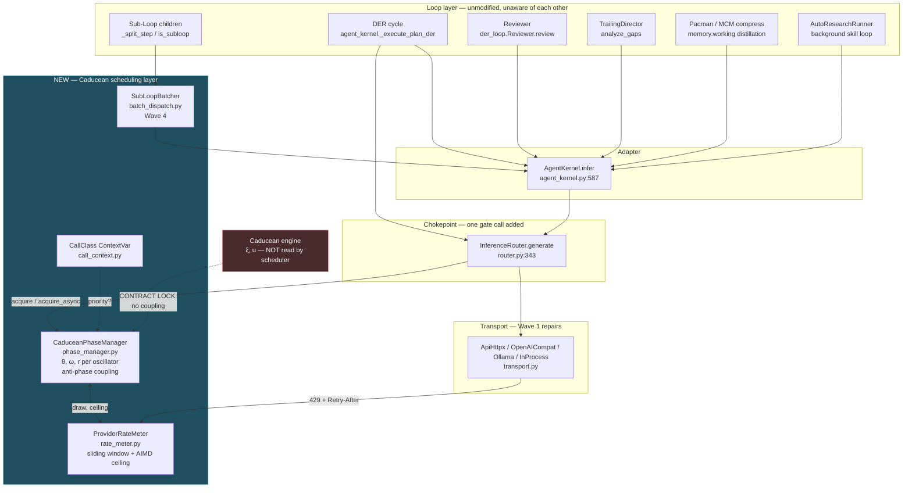
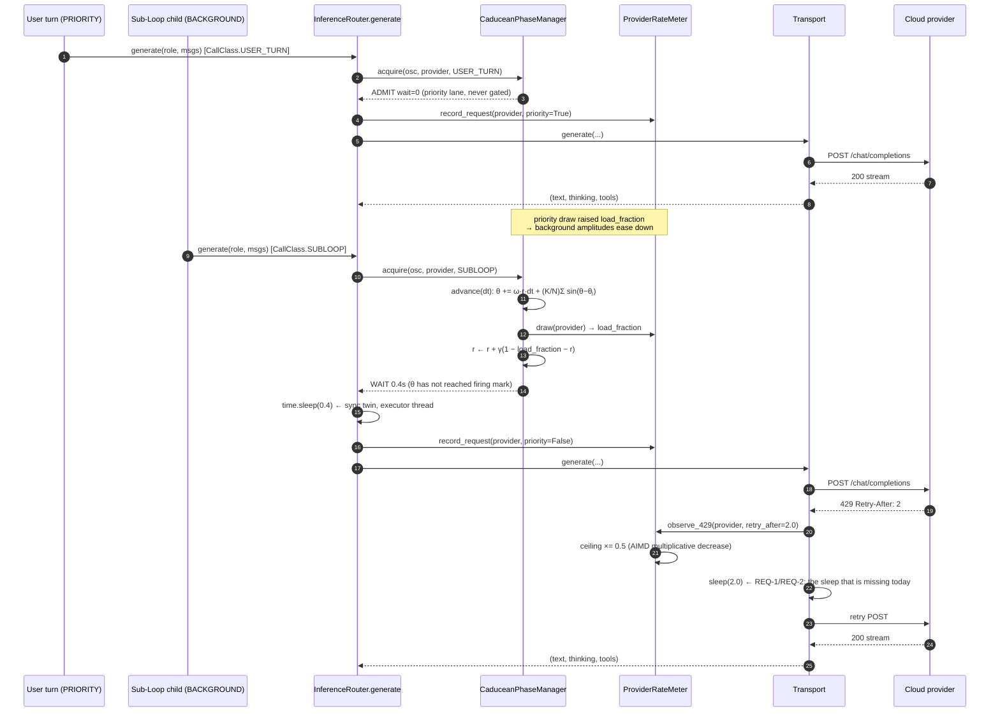
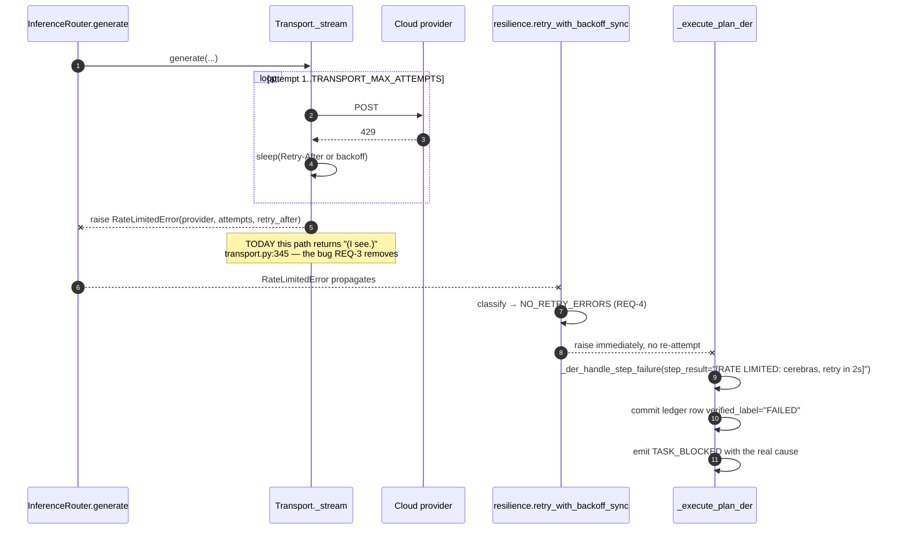
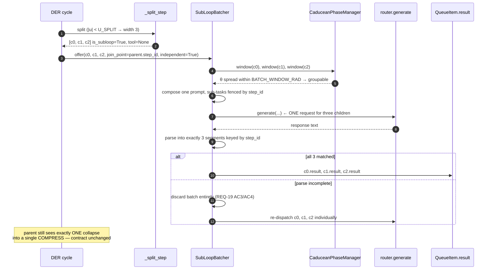

# Design: Caducean Phase Manager (Trig Functional Scheduler) + Inference Rate-Limit Hardening

## Context

Two problems share one delivery, sequenced deliberately.

**The immediate problem (Wave 1)** is that IRIS amplifies rate limits instead of absorbing
them. A `429` in the streaming transport retries with **zero delay** because its `continue`
skips the backoff sleep (`transport.py:259-269` vs the sleep at `transport.py:329-330`); the
step-level retry wrapper stacks on top of the transport's own retry loop for up to **9 HTTP
attempts** per step (`agent_kernel.py:5654-5680` × `transport.py:246`); the parallel-safe
step batch fans out **unbounded** (`agent_kernel.py:5747` → `asyncio.gather` at
`agent_kernel.py:6976`); and when the retries are exhausted the transport returns the literal
string **`"(I see.)"`** to the user (`transport.py:345`) rather than reporting the refusal.

**The architectural problem (Waves 2–4)** is that nothing owns the question "when may this
work source act?" Today there is only one serial DER loop, so the concept doc's collision
scenario is not yet real — but the moment there are two concurrent sessions, or a Sub-Loop
that dispatches independently, or a fifth loop nobody has written yet, the answer has to
already exist. Building it now, with one registrant, is cheap. Retrofitting it across five
loops later is not. That is the whole argument of concept doc §3, and it holds.

**Bounding constraints the design must respect:**

| Constraint | Source | Consequence for the design |
|---|---|---|
| One chokepoint exists and every LLM call passes through it | `router.py:343-399` | Gate goes there. Zero loops modified (REQ-15). |
| `generate()` is **sync**, called from both the DER executor thread and async paths | `router.py:343`, `agent_kernel.py:6949` | Sync + async gate twins are mandatory (REQ-13 AC2/AC3), following `resilience.py:37/80`. |
| `run_in_executor` does **not** propagate `contextvars` | Python stdlib; used at `agent_kernel.py:6949` | Call class must be set explicitly inside the executor entry point (REQ-14 AC4). |
| `ξ` is already load-bearing for reasoning state | `agent_kernel.py:5459-5472`, `coupled_registry.py:183` | Scheduler needs its own θ (REQ-12 AC1). |
| Local providers do not rate-limit | `provider.py:16-22, 90-91` | Metering is per-provider and skips local kinds (REQ-8). |
| Voice latency is the product | Decision Locked #3 | Priority lane bypasses the gate entirely (REQ-14). |
| No `429` evidence in the log corpus | Log search found zero real `429` records | Ceilings are **learned**, not configured (REQ-7). |

---

## Architecture Overview

The phase manager is a layer *above* the loops and *below* the transport, entered at exactly
one point. Nothing in the loop layer knows it exists.



Three deliberate properties of this shape:

1. **One arrow into the gate.** Adding a sixth loop adds an arrow into `AgentKernel.infer`
   and nothing else. That is REQ-15 made structural rather than promised.
2. **The dashed red edge is a non-edge.** The Caducean `ξ`/`u` state is drawn to make the
   *absence* of coupling explicit and testable — it is a contract-locked boundary, not an
   oversight.
3. **The `429` feedback arrow runs transport → meter, not transport → loop.** The loop never
   learns about rate limits; the meter does, and the meter moves amplitudes. This is the
   §9 "compress history into a position, react statelessly to the position" principle applied
   literally.

---

## Sequence / Data Flow

### Main flow: a gated background call vs. an ungated user turn



### Failure flow: exhausted rate-limit retries must not fabricate



The second diagram is the honesty fix. The maximum HTTP attempts along that whole path drops
from 9 to `TRANSPORT_MAX_ATTEMPTS` (3), and the user is told the provider refused rather than
being read a fabricated acknowledgement.

### Wave 4: bounded batching at the compression seam



---

## Data Models

### `CallClass` — `backend/agent/call_context.py` (NEW)

```python
class CallClass(str, Enum):
    USER_TURN  = "user_turn"   # priority lane — never gated
    SPEAK      = "speak"       # priority lane — never gated
    SUBLOOP    = "subloop"     # gated
    BACKGROUND = "background"  # gated; the conservative default

PRIORITY_CLASSES = frozenset({CallClass.USER_TURN, CallClass.SPEAK})

_current_call_class: ContextVar[CallClass] = ContextVar(
    "iris_call_class", default=CallClass.BACKGROUND
)
```

Precedent: `backend/monitoring/session_correlation.py:18-21` already uses this exact
`ContextVar` shape. Default is `BACKGROUND` so an unclassified call is *gated*, never
accidentally privileged (REQ-14 AC3).

### `PhaseOscillator` — `backend/agent/phase_manager.py` (NEW)

```python
@dataclass
class PhaseOscillator:
    oscillator_id: str
    quota_id: str         # REQ-6 AC1 quota identity — the coupling GROUP key (see D-9)
    provider_label: str   # ProviderInstance.id — logs and error messages only (REQ-6 AC1b)
    call_class: CallClass
    theta: float          # [0, 2π) — the scheduler's OWN phase, never Caducean ξ
    omega: float          # 2π / natural_period_s
    amplitude: float      # r ∈ [R_MIN, 1.0]
    join_point: Optional[str] = None   # Wave 4: compression seam id
    independent: bool = False          # Wave 4: safe to batch with siblings
    last_fired_at: float = 0.0
    last_advanced_at: float = 0.0
    registered_at: float = 0.0
```

`__slots__` is used in `coupled_registry._SessionRecord` (`coupled_registry.py:76`); mirror
that for consistency and allocation cost.

### `ProviderWindow` — `backend/agent/rate_meter.py` (NEW)

```python
def quota_key(inst: ProviderInstance) -> str:
    """REQ-6 AC1: the identity that actually owns a rate limit.

    NOT ProviderInstance.id — two logical instances may share one endpoint AND
    credential (e.g. cerebras-fast / cerebras-big) and therefore one real quota.
    NOT api_base_url alone — same endpoint, different keys = different accounts.
    The credential is fingerprinted; never stored or logged in clear.
    """
    cred = get_secret(inst.id) or inst.api_key or ""
    fp = hashlib.sha256(cred.encode()).hexdigest()[:12] if cred else "nokey"
    return f"{inst.api_base_url}|{fp}"


@dataclass
class ProviderWindow:
    quota_id: str                    # quota_key() — the metering AND ceiling key
    label_ids: Set[str]              # ProviderInstance.ids on this quota — LOGS ONLY (REQ-6 AC1b)
    metered: bool                    # False for LOCAL_OPENAI / OLLAMA / INPROCESS
    samples: Deque[Sample]           # bounded by METER_MAX_SAMPLES, evicted by age
    ceiling_rpm: float               # learned (AIMD)
    ceiling_tpm: float               # learned (AIMD)
    hard_max_rpm: float              # never raised by learning (REQ-10)
    last_429_at: float
    count_429_in_window: int
    configured_max_rpm: Optional[float]   # REQ-7 AC4 upper bound, if supplied

@dataclass(frozen=True)
class Sample:
    ts: float
    tokens: int
    estimated: bool      # True when derived from char/4 rather than a usage block
    priority: bool
```

### `RateLimitedError` — `backend/agent/inference/errors.py` (NEW)

```python
class RateLimitedError(RuntimeError):
    def __init__(self, provider_id: str, attempts: int,
                 retry_after: Optional[float] = None): ...
    provider_id: str
    attempts: int
    retry_after: Optional[float]
```

New module rather than adding to `transport.py`, so `resilience.py` can import it for
classification without importing the transport layer (avoids an import cycle:
`resilience` ← `agent_kernel` → `inference.router` → `inference.transport`).

### `BatchGroup` — `backend/agent/batch_dispatch.py` (NEW, Wave 4)

```python
@dataclass
class BatchGroup:
    join_point: str
    children: List[QueueItem]        # ≤ BATCH_MAX_CHILDREN
    opened_at: float                 # for BATCH_MAX_HOLD_S expiry
    quota_id: str                    # children may only batch within one quota
```

### Constants — module-level in `phase_manager.py` / `rate_meter.py`

Placed at module level with `_`-prefixed names and env overrides, matching
`coupled_registry.py:48-56` rather than being appended to `der_constants.py` (which is
DER-scoped; the scheduler is deliberately not DER-specific — REQ-15).

| Constant | Default | Env override | REQ |
|---|---|---|---|
| `IRIS_PHASE_SCHEDULER` | `0` (off) | same | 17 |
| `TRANSPORT_MAX_ATTEMPTS` | `3` | `IRIS_TRANSPORT_MAX_ATTEMPTS` | 4 |
| `RETRY_AFTER_MAX_S` | `30.0` | `IRIS_RETRY_AFTER_MAX_S` | 2 |
| `DER_MAX_CONCURRENT_STEPS` | `3` | `IRIS_DER_MAX_CONCURRENT_STEPS` | 5 |
| `METER_WINDOW_S` | `60.0` | `IRIS_METER_WINDOW_S` | 6 |
| `METER_MAX_SAMPLES` | `512` | — | 6 |
| `CEILING_INIT_RPM` | `30.0` | `IRIS_CEILING_INIT_RPM` | 7, Q1 |
| `CEILING_INIT_TPM` | `60000.0` | `IRIS_CEILING_INIT_TPM` | 7, Q1 |
| `CEILING_MD` | `0.5` | — | 7 |
| `CEILING_AI_RPM` | `2.0` | — | 7 |
| `CEILING_PROBE_S` | `120.0` | — | 7 |
| `CEILING_MIN_RPM` | `3.0` | — | 7 |
| `CEILING_MAX_RPM` | `600.0` | — | 7 |
| `PHASE_HARD_MAX_RPM` | `120.0` | `IRIS_PHASE_HARD_MAX_RPM` | 10 |
| `PHASE_K` | `0.6` | `IRIS_PHASE_K` | 12, Q2 |
| `PHASE_MAX_WAIT_S` | `2.0` | `IRIS_PHASE_MAX_WAIT_S` | 13 |
| `TICK_MAX_DT_S` | `5.0` | — | 12 |
| `MIN_PERIOD_S` | `0.05` | — | 11 |
| `R_MIN` | `0.1` | — | 9 |
| `R_GAMMA` | `0.25` | — | 9 |
| `IDLE_UNREGISTER_S` | `300.0` | — | 15, Q3 |
| `REBALANCE_TICKS` | `40` | — | 16 |
| `BATCH_WINDOW_RAD` | `0.35` | `IRIS_BATCH_WINDOW_RAD` | 18 |
| `BATCH_MAX_HOLD_S` | `0.25` | `IRIS_BATCH_MAX_HOLD_S` | 18 |
| `BATCH_MAX_CHILDREN` | `3` | — | 18 |

`BATCH_MAX_CHILDREN = 3` is not arbitrary: it matches `DER_MAX_GRAFTS = 3`
(`der_constants.py:104`) and the wide-split width of 3 (`agent_kernel.py:6182`).

---

## Key Decisions

### D-1: The gate lives at `InferenceRouter.generate()`, not in each loop

**Decision.** One `acquire` call inside `router.generate` (`router.py:343-399`), imported
lazily and defaulting to a no-op.

**Rationale.** Verified single chokepoint: `AgentKernel.infer` → `router.generate`
(`agent_kernel.py:610`) covers `Reviewer` (`der_loop.py:597`), `TrailingDirector`
(`trailing_director.py:100`), `spec_engine` (`spec_engine.py:135`), `ask_user_tool`
(`ask_user_tool.py:73`), and the memory paths (`memory/distillation.py:286`,
`memory/skills.py:176`, `memory/working.py:215`); plus the direct sites at
`agent_kernel.py:2157`, `4025`, `7925` and `tool_decision.py:292`. One insertion governs all
of them, and REQ-15's modularity claim becomes structural.

**Rejected — a decorator on each loop's entry point.** Requires touching every loop, which is
exactly the O(N) refactor concept doc §3 exists to avoid, and it silently misses the four
direct kernel call sites.

**Rejected — gating inside the transports.** There are four transport classes; the gate would
be duplicated four times and would sit below the point where provider identity and call class
are both known.

### D-2: The scheduler owns its own θ; Caducean `ξ` is contract-locked out

**Decision.** `PhaseOscillator.theta` is independent state. The scheduler never calls
`ffi_caducean_get_xi` or `ffi_caducean_set_params`.

**Rationale.** `ξ` already drives the reasoning-state quadrant (`agent_kernel.py:5459-5472`)
and cross-session alignment coupling (`coupled_registry.py:183`). Overloading it would make
scheduling a function of reasoning state, which concept doc §5 explicitly forbids ("The phase
manager doesn't touch that decision at all"). A contract test asserts the FFI is never called
from the scheduler module.

**Rejected — deriving θ from `ξ` to "reuse the existing physics".** Superficially elegant,
functionally wrong: it would make a converged reasoning state also a scheduling state, so two
sessions thinking similarly would be *scheduled* similarly — the exact opposite of what
anti-phase coupling is for.

### D-3: Lazy advance on gate check — no background tick task

**Decision.** `advance(dt)` is driven by elapsed wall-clock time computed at each `acquire`,
with `dt` clamped to `TICK_MAX_DT_S`.

**Rationale.** Concept doc §8 lists "how phase ticks would be driven (a background timer?
piggybacked on an existing loop's cycle?)" as an open implementation question. Lazy advance
answers it with the least machinery: no new task in `main.py`'s lifespan, nothing to shut
down, nothing to leak, and no work performed while the system is idle. It is also the honest
reading of concept doc §9 — phase is a stateful position, and the reaction to it is
memory-free, so the position only needs to be *correct when read*.

**Rejected — a background `asyncio` tick task in the lifespan** (`main.py:182`, pattern at
`main.py:701`/`742`). Adds a lifecycle to manage, burns cycles while idle, and gains nothing:
no consumer exists between gate checks.

**Consequence to accept honestly.** With exactly one active oscillator the coupling never runs
(empty sum) and the scheduler degenerates to a pure rate limiter. That is correct behavior,
not a defect — with one work source there are no collisions to prevent. The coupling earns its
keep only at N≥2, which is why REQ-20's instrumentation matters more than the coupling
constant in Wave 3.

### D-4: Deterministic widest-gap placement is primary; coupling is the slow corrector

**Decision.** On `register`, place θ at the midpoint of the widest existing gap among
oscillators sharing that provider. Coupling then maintains the spread.

**Rationale.** A voice turn lives 1–3 s. With `PHASE_K = 0.6`, convergence to splay takes tens
of ticks — the oscillator is unregistered before it arrives. Concept doc §4.1 already permits
"spaced evenly among however many loops already exist"; this design makes that the **primary**
mechanism and demotes coupling to maintenance. Without this inversion the whole scheduler
would be a no-op for the dominant workload.

**Rejected — random placement** (also offered by §4.1). For small N, random placement collides
often, and the collision is precisely the thing being prevented.

### D-5: Amplitude modulates ω, so volume and timing are one mechanism

**Decision.** `ω_eff = ω · r`, with `r` relaxing toward `1 − load_fraction`.

**Rationale.** Concept doc §6 argues volume should not be a bolted-on token bucket but the
other property of the same rotating arrow, and its own parenthetical names the mechanism: "how
eagerly it fires within its phase window". Modulating ω is exactly that. A loaded provider
slows its registrants' clocks, so fewer firing marks are crossed per minute — volume falls out
of the timing mechanism instead of being enforced beside it. The moving attractor
(`1 − load_fraction`) mirrors the Duffing self-limiting form the engine already runs on
(`der_constants.py:129-142`, clamping at `coupled_registry.py:24-26`).

**Rejected — a shared token bucket next to the phase logic.** Explicitly identified as the
"unnecessary split" in §6, and it would give two independent mechanisms two independent tuning
surfaces.

**Rejected — amplitude scaling `max_tokens`.** Changes answer *quality* under load, not just
timing. Deferred in REQ-9 AC6 and listed in Non-Requirements.

### D-6: Priority lane is a hard bypass, not a high weight

**Decision.** `CallClass.USER_TURN` and `CallClass.SPEAK` return `ADMIT wait=0` before any
phase, amplitude, or hard-cap computation — including when the hard cap is exhausted
(REQ-10 AC4).

**Rationale.** Decision Locked #3. IRIS is a voice assistant; a scheduler that adds even
150 ms to a spoken reply has made the product worse in exchange for an internal metric. A
weighted-priority scheme still yields *some* wait, and a wait that is usually zero is harder
to reason about than one that is always zero.

**Honest limit, documented in the module docstring per REQ-10 AC5.** If priority traffic alone
exceeds a provider's real limit, the scheduler cannot prevent a `429`. Waves 1's REQ-1/2/3 are
what make that outcome *honest* (a reported refusal) instead of *silent* (`"(I see.)"`). The
scheduler is not claimed to make `429`s impossible — only to stop background work from causing
them and to stop the system from amplifying them.

### D-7: Transport is the sole rate-limit retry authority

**Decision.** `RateLimitedError` goes into a new `NO_RETRY_ERRORS` set in `resilience.py`,
distinct from both `TRANSIENT_ERRORS` and `PERMANENT_ERRORS`.

**Rationale.** Two independent retry loops multiply (`retry_with_backoff_sync(max_retries=2)`
at `agent_kernel.py:5674` × `for attempt in range(3)` at `transport.py:246` = 9 attempts).
Whichever layer retries must be the one that knows the `Retry-After`, and that is the
transport. A third set is needed rather than reusing `PERMANENT_ERRORS` because a rate limit is
*not* permanent — the distinction matters for the graft path's messaging and for anyone reading
the classification later.

**Rejected — removing the transport's retry loop and letting `resilience` own it.** The
`Retry-After` header is only visible at the transport, and the transport already correctly
retries transient stream errors (`transport.py:319-330`) which must be preserved.

### D-9: Meter by quota identity; leave the transport cache untouched

**Decision.** The meter and the learned ceiling are keyed by
`quota_key(inst) = (api_base_url, credential-fingerprint)`. The transport cache
([`router.py:49-62`](backend/agent/inference/router.py:49)) is **not modified**.

**Rationale.** Transports are cached by `(kind, api_base_url)`, so two logical provider
instances at the same endpoint already share one transport object. An earlier draft of this
spec offered two fixes for that — "include `inst.id` in the cache key" or "pass `provider_id`
per call" — and **both were wrong**:

- Keying the meter by `inst.id` **over-partitions.** `cerebras-fast` and `cerebras-big` at the
  same endpoint with the same key draw from **one real quota**. Two separate ceilings each learn
  from half the traffic, so neither ever discovers the actual limit, and the sum of the two
  ceilings can exceed it — producing `429`s that the learner cannot explain.
- Keying by `api_base_url` alone **under-partitions.** Two accounts at the same provider have
  independent quotas; one account's `429` would wrongly shrink the other's ceiling.

Quota identity is the only key correct in both directions, and it makes the transport-cache
question moot: the transport can stay shared, because the thing being keyed is no longer the
transport. This is strictly simpler than either rejected option — one fewer file changed.

**Consequence.** The transport needs the quota key at `429` time. Pass it at construction in
`_build_transport` ([`router.py:310-339`](backend/agent/inference/router.py:310)), where `inst` is
in scope. Because the key is derived from `(base_url, credential)` — exactly the fields the cache
already keys on, plus the credential — a shared transport shares the correct quota key by
construction. No per-call threading required.

**Security note.** The credential is SHA-256'd and truncated to 12 hex chars for use as a dict
key. It is never persisted (REQ-7 AC5 writes ceilings keyed by this fingerprint, not by the
secret) and never logged — logs use `label_ids` instead (REQ-6 AC1b).

### D-8: Coupling is computed per quota, not globally — and not per provider *instance*

**Decision.** The coupling sum in REQ-12 AC2 runs only over oscillators sharing the same
`quota_id` (D-9's quota identity).

**Why not global.** Spacing a Cerebras call away from an Ollama call accomplishes nothing —
Ollama has no limit to protect (`provider.py:16-22`, no `429` branch in `OllamaTransport`).
Global coupling would add wait time for zero benefit.

**Why not per provider instance — the sharper half.** Grouping by `ProviderInstance.id` would
**under-couple exactly the case the scheduler exists for.** Two instances at one endpoint sharing
one credential (`cerebras-fast`, `cerebras-big`) draw from a single real quota. Under an
instance-id grouping their oscillators land in separate coupling groups, never see each other as
neighbours in the sine term, and are therefore free to fire at the same instant into the one limit
being protected. The bug would present as "the scheduler is enabled and we still get bursts," with
every unit test green. Quota grouping fixes it for the same reason quota metering fixes the ceiling
(D-9): the group must match the thing that actually rate-limits.

**Rationale (continued).** With mixed local/cloud plans (the
common case for this project) it would be actively harmful.

---

## Ripple-Effect Map

Every area the change reaches. `NO CHANGE (verified)` entries cite the proof.

| Area / File | Change? | Classification | Why / Evidence |
|---|---|---|---|
| `backend/agent/inference/transport.py` | **Yes** | CHANGE NEEDED | `429` `continue` at `:259-269` and `:517-527` skips the sleep at `:329-330`. `Retry-After` absent everywhere. `"(I see.)"` returned after exhausted retries at `:345`. REQ-1/2/3. |
| `backend/agent/inference/errors.py` | **Yes (new)** | CHANGE NEEDED | Houses `RateLimitedError` so `resilience` can import it without pulling in the transport layer (cycle avoidance). REQ-3 AC1. |
| `backend/agent/resilience.py` | **Yes** | CHANGE NEEDED | Add `NO_RETRY_ERRORS` and check it before `TRANSIENT_ERRORS` in **both** twins (`:56-77`, `:96-117`). REQ-4 AC2. |
| `backend/agent/agent_kernel.py` `_der_exec_steps_concurrent` | **Yes** | CHANGE NEEDED | Unbounded `asyncio.gather` at `:6972-6976`. Add semaphore; preserve the `{step_id: (result, ok)}` contract. REQ-5. |
| `backend/agent/agent_kernel.py` `_execute_plan_der` | **Yes** | CHANGE NEEDED | Set `CallClass` explicitly at method entry — `run_in_executor` (`:6949`) does not propagate contextvars. REQ-14 AC4. |
| `backend/agent/agent_kernel.py` extra-step retry | **Yes** | CHANGE NEEDED | Ad-hoc `time.sleep(0.5)` retry at `:5766-5771` must not re-retry `RateLimitedError`. REQ-4 edge case. |
| `backend/agent/inference/router.py` | **Yes** | CHANGE NEEDED | Add lazy gate `acquire` + `record_request` in `generate()` (`:343-399`). Signature and 3-tuple return unchanged. REQ-13 AC1/AC4. |
| `backend/agent/phase_manager.py` | **Yes (new)** | CHANGE NEEDED | Registry, θ/ω/r, anti-phase coupling, gate twins. REQ-9/11/12/13/16. |
| `backend/agent/rate_meter.py` | **Yes (new)** | CHANGE NEEDED | Per-provider sliding window + AIMD ceiling + `429` observation. REQ-6/7/8/10. |
| `backend/agent/call_context.py` | **Yes (new)** | CHANGE NEEDED | `CallClass` enum + `ContextVar` + explicit setter. REQ-14. |
| `backend/agent/batch_dispatch.py` | **Yes (new, Wave 4)** | CHANGE NEEDED | `SubLoopBatcher`, composed prompt, `step_id`-keyed parser, honest fallback. REQ-18/19. |
| `backend/agent/tools/speak_tool.py` | **Yes (minimal)** | CHANGE NEEDED | Set `CallClass.SPEAK` around its output path so audible output is never gated. Verified it currently makes no LLM call itself (no `infer`/`router` reference in the file) — the change is a context set, not a gate call. REQ-14 AC2. |
| `backend/agent/coupled_registry.py` | **No change *from this spec*** | **CONTRACT LOCK (directional)** | Couples *reasoning* state (`u`/`ξ`) across sessions. Its `apply_coupling` writes `ffi_caducean_set_params` (`:194`, `:207`); **the scheduler must never call into it and never touch those params** — that is what CT-3 pins. ⚠️ **CT-3 is directional, not a freeze:** `specs/caducean-kernel-unification/` REQ-8/9/10 legitimately rewrites this module's coupling math and wires it into the DER path (not the scheduler path). CT-3 must not be read as forbidding those edits. See `specs/CADUCEAN_SPEC_RECONCILIATION.md` C1. |
| Caducean FFI (`backend/gateway/iris_ffi.py`) | **No** | **CONTRACT LOCK** | Scheduler must not call `ffi_caducean_get_xi` / `set_params` / `recommend`. D-2. Pinned by **CT-4** (asserts the FFI symbols are never invoked from the scheduler modules). |
| `backend/agent/outer_loop.py` | **No** | NO CHANGE (verified) | Makes zero LLM calls — `_ledger` reads SQLite only (`:89-99`) and `run_once` never touches a router (`:179-225`). Cannot cause a `429`; registering it would add cost and no benefit. Non-Requirement. |
| `backend/agent/der_loop.py` `Reviewer` | **No** | NO CHANGE (verified) | Calls `self.adapter.infer` (`:597`), which is `AgentKernel.infer` (`agent_kernel.py:587`) → `router.generate` (`:610`). Already governed by D-1 with no edit. Its swallow-all fallback to `PASS` (`:606-607`) is correct membrane behavior and is preserved. |
| `backend/agent/der_loop.py` `QueueItem` | **No** | **CONTRACT LOCK** | Wave 4 writes `result` (`:90`) and reads `is_subloop` (`:92`) / `depth_layer` (`:88`). Field shapes must not drift or `resolve_dependent_params` (`:486-540`) and `TrailingDirector.analyze_gaps` break. Pinned by **CT-5**. |
| `backend/agent/agent_kernel.py` `_split_step` | **No** | NO CHANGE (verified) | Already produces exactly what Wave 4 needs: `is_subloop=True` (`:6252`), `tool=None` (no tool assigned, `:6245-6254`), per-child `expected_output` (`:6251`), and children keyed `{parent}_s{i}` (`:6246`) giving a natural `join_point`. Batching consumes this output; it does not modify the split. |
| `backend/agent/agent_kernel.py` `_growth_width` / `_der_verify_strictness` | **No** | NO CHANGE (verified) | Physics-driven shape decision (`:6170-6204`) is explicitly out of scope per concept doc §5. Scheduler decides *when*, never *how wide*. |
| `backend/agent/mcm_protocol/actions/*` | **No** | NO CHANGE (verified) | Pacman/compress actions reach LLMs only via `adapter.infer` (`memory/working.py:215`, `memory/distillation.py:286`) → `router.generate`. Governed by D-1 without an edit. |
| `backend/agent/auto_research.py` | **No** | NO CHANGE (verified) | Background runner, but only reachable via the `improve_self` tool (`tool_bridge.py:1618-1622`) — not started at boot. Its LLM calls funnel through the same adapter, so it is governed by D-1 when it does run. |
| `backend/agent/ws_event_bridge.py` | **No** | NO CHANGE (verified) | Uses an explicit allowlist `_BRIDGED_EVENTS` (`:33-64`) plus opt-in `add_event` (`:86`). No new event is added, so nothing reaches the frontend and no bridge edit is possible-but-forgotten. |
| Frontend (`app/`, `components/`) | **No** | NO CHANGE (verified) | Follows from the row above: no new bridged event, no new payload field. Scheduler observability is log- + `metrics()`-based (REQ-20), deliberately not a UI surface. Non-Requirement. |
| `backend/agent/event_bus.py` | **No** | NO CHANGE (verified) | No new `IRISStreamEvent` member is introduced. REQ-3 AC4 reuses the existing `TASK_BLOCKED` (`:86`) and `VALIDATION_FAILED` (`:58` in the bridge allowlist) paths. |
| `backend/agent/der_constants.py` | **Yes (one constant only)** | CHANGE NEEDED | Adds `DER_MAX_CONCURRENT_STEPS` (REQ-5 / T1.9) — placed here because it genuinely *is* DER-scoped. Every **scheduler** constant lives in `phase_manager.py` / `rate_meter.py` instead (D-1 rationale / REQ-15: the scheduler is deliberately not DER-scoped). ⚠️ `specs/caducean-kernel-unification/` lists this file as NO CHANGE because that spec only *reads* `U_SPLIT`/`U_CONVERGED`; the two claims are compatible. See `specs/CADUCEAN_SPEC_RECONCILIATION.md` C2. |
| `backend/iris_config.py` / `provider.py` | **No** | NO CHANGE (verified) | REQ-7 learns ceilings rather than reading config, precisely because no rate-limit fields exist on `ProviderInstance` (`provider.py:25-42`) or `InferenceConfig` (`iris_config.py:183-212`). The optional config bound (REQ-7 AC4) is read from env, so no dataclass changes. |
| `.mcm/` params store | **Yes (new file)** | CHANGE NEEDED | Learned ceilings persist to `.mcm/provider_ceilings.json`, following the `outer_loop.py:62-64` pattern. Separate file so the outer loop's `der_params.json` is untouched. REQ-7 AC5. |
| `scripts/validate_der_*.py` harness | **Yes** | CHANGE NEEDED | New `scripts/validate_phase_scheduler.py` joins the standing CDD family alongside `validate_der_integrity.py` / `validate_der_tool_resolution.py`. Testing Strategy. |

---

## Error Handling

The governing principle: **a scheduler bug must never block inference, and a rate limit must
never become a fabricated answer.** Those pull in opposite directions — one says fail open,
the other says fail loud — so the split is explicit: the *scheduler* fails open, the
*transport* fails loud.

| Failure mode | Response |
|---|---|
| Phase manager raises internally | IF the gate raises for any reason THEN THE SYSTEM SHALL log at WARNING and admit the call immediately (fail-open). REQ-13 edge case. A scheduler defect degrades to today's behavior, never to an outage. |
| Rate meter unavailable / raises | IF metering fails THEN THE SYSTEM SHALL treat `load_fraction` as 0 and admit, logging at debug. Missing measurement must not become an implicit throttle. |
| Caller never registered | WHEN an unregistered oscillator calls `acquire` THEN THE SYSTEM SHALL auto-register with default period and `CallClass.BACKGROUND` and proceed. No call is dropped for bookkeeping. |
| `429` with retries remaining | WHEN `429` and attempts remain THEN THE SYSTEM SHALL sleep `Retry-After` (clamped to `RETRY_AFTER_MAX_S`) or exponential backoff, then retry. REQ-1/REQ-2. |
| `429` with retries exhausted | THE SYSTEM SHALL raise `RateLimitedError` and SHALL NOT return a placeholder string. REQ-3 AC2/AC3. |
| `RateLimitedError` at step level | THE SYSTEM SHALL fail the step fast (no re-retry), write a `FAILED` commit-ledger row, and surface the provider + wait hint through the existing graft/`TASK_BLOCKED` path. REQ-3 AC4/AC5, REQ-4 AC3. |
| Hard cap exhausted, non-priority | THE SYSTEM SHALL block up to `PHASE_MAX_WAIT_S`, then raise `RateLimitedError` rather than issue the call, logging at ERROR. REQ-10 AC2/AC3. |
| Hard cap exhausted, priority | THE SYSTEM SHALL admit the call anyway. If the provider then `429`s, the row above handles it honestly. REQ-10 AC4/AC5. |
| Corrupt persisted ceilings file | THE SYSTEM SHALL fall back to defaults and continue, mirroring `outer_loop._load_params` (`:69-76`). REQ-7 AC5. |
| Batch response unparseable | THE SYSTEM SHALL discard the whole batched response and re-dispatch every child individually. No child result is ever partially inferred. REQ-19 AC3/AC4. |
| Soft-cancel during a batch | THE SYSTEM SHALL abandon the batch and attribute no results; cancel semantics win over batching. REQ-18 edge case, `agent_kernel.py:5613`. |
| Gate wait exceeds `PHASE_MAX_WAIT_S` (non-hard-cap) | THE SYSTEM SHALL admit the call rather than wait longer. A scheduler must not become an availability risk. REQ-13 AC6. |

---

## Testing Strategy

This system is one recursive operator at four scales; the bugs are in the seams. Unit tests
on the coupling math would all pass today and catch none of the four real defects. Layering
is therefore mandatory.

```
backend/tests/unit/          pure logic — no I/O, no cross-layer
backend/tests/contract/      boundary pins — interface shapes, caught BEFORE behavior
backend/tests/behavioral/    full-loop drives — emergent properties, system as it runs
scripts/validate_phase_scheduler.py   STANDING CDD HARNESS — replays recorded call
                                      trajectories through the FULL stack every run
```

Existing DER tests live in `backend/tests/{unit,contract,behavioral}/` (verified: 19 contract
files, 12 behavioral files, 19 unit files), so new tests join those directories, not the
sparser root `tests/`.

### Unit — pure logic (`backend/tests/unit/`)

- `test_phase_math.py` — the anti-phase rule in isolation:
  - Two oscillators at Δθ=0.1 **separate**; at Δθ=π the coupling term is ~0 (the splay fixed
    point). Three at 2π/3 spacing sum to ~0. This is the sign-correctness test for
    REQ-12 AC2 — a flipped sign would produce sync, and only this test catches it cheaply.
  - `K=0` disables coupling without crashing (REQ-12 edge case).
  - `dt > TICK_MAX_DT_S` is clamped (REQ-12 AC4).
  - Widest-gap placement for N=1..5 is deterministic and never coincident (REQ-11 AC2).
- `test_amplitude_relaxation.py` — `r` relaxes toward `1 − load_fraction`, floors at `R_MIN`,
  and a new registrant into a saturated provider starts *below* 1.0 (REQ-9 AC2/AC4, edge case).
- `test_retry_after_parse.py` — delta-seconds, HTTP-date, absent, negative, unparseable,
  hostile-large (clamped) (REQ-2 AC2/AC3/AC4).
- `test_ceiling_aimd.py` — multiplicative decrease on `429`, additive increase after
  `CEILING_PROBE_S`, floors and caps hold, and **one quota's `429` leaves others untouched**
  (REQ-7 AC6).
- `test_quota_key.py` — the D-9 partitioning rules, all four cases:
  - same `api_base_url` + same credential → **same** `quota_id` (they share one real quota);
  - same `api_base_url` + different credentials → **different** `quota_id` (separate accounts);
  - different `api_base_url` → different `quota_id`;
  - no credential → a stable `"nokey"` fingerprint rather than a crash or a collision with a
    real key.
  Plus: the raw credential never appears in the returned key, and `quota_id` is stable across
  calls for the same instance.
- `test_meter_window.py` — eviction by age, `METER_MAX_SAMPLES` bound, backwards clock
  tolerance, estimated-token marking (REQ-6 AC5, edge cases).

### Contract — boundary pins (`backend/tests/contract/`)

| ID | Pins | Asserts |
|---|---|---|
| **CT-1** | `InferenceRouter.generate` interface | Signature and 3-tuple return `(text, thinking, tool_calls)` unchanged by the gate; no new required parameter (REQ-13 AC4). Extends the existing `tests/contract/test_unchanged_interfaces.py` discipline. |
| **CT-2** | `_der_exec_steps_concurrent` return shape | `{step_id: (result, success)}` for **every** submitted item after the semaphore is added; no item dropped or merged (REQ-5 AC2/AC3). |
| **CT-3** | `CoupledTrajectoryRegistry` isolation | The scheduler never calls `apply_coupling` / `register_session` / `update_session_state`; `ffi_caducean_set_params` is not invoked from scheduler modules (D-2, ripple CONTRACT LOCK). |
| **CT-4** | Caducean FFI non-use | `ffi_caducean_get_xi` / `get_state` / `set_params` / `recommend` are never called from `phase_manager.py` or `rate_meter.py` — asserted by patching the FFI module and failing on any call (D-2). |
| **CT-5** | `QueueItem` field shape | `result`, `is_subloop`, `depth_layer`, `expected_output`, `step_id` present with expected types, so Wave 4's writes cannot silently break `resolve_dependent_params` (`der_loop.py:486-540`) (REQ-19). |
| **CT-6** | `RateLimitedError` shape | Carries `provider_id`, `attempts`, `retry_after`; is in `resilience.NO_RETRY_ERRORS`; is in **neither** `TRANSIENT_ERRORS` nor `PERMANENT_ERRORS` (REQ-3 AC1, REQ-4 AC2). |
| **CT-7** | Commit-ledger record for a rate-limited step | Row written with `verified_label="FAILED"`, preserving the `specs/der-loop-integrity-display` REQ-1 contract (REQ-3 AC5). |
| **CT-8** | Batch prompt/response contract | Composed prompt contains one `step_id`-keyed fence per child; parser maps segments by id not position (REQ-19 AC1/AC2, edge case). |
| **CT-9** | Gate twins | Both `acquire` and `acquire_async` exist with identical semantics; `acquire_async` never calls `time.sleep` (asserted by patching `time.sleep` and failing on invocation) (REQ-13 AC2/AC3). |
| **CT-10** | Quota key is the grouping/metering key, and credentials never leak | Meter windows, learned ceilings, and coupling groups are all keyed by `quota_id`, never by `ProviderInstance.id` (REQ-6 AC1, REQ-7 AC6, REQ-12 AC6). No log line, persisted file, or exception message contains a raw credential; logs carry `provider_label` instead (REQ-6 AC1b, REQ-20 AC5). |

### Behavioral — full-loop, emergent properties (`backend/tests/behavioral/`)

- `test_rate_limit_honesty.py` — **the headline regression test.** Drive a real DER step
  against a stub provider that returns `429` three times. Assert: (1) the response is
  **never** `"(I see.)"`; (2) `RateLimitedError` propagates; (3) the step is reported as
  failed with the provider named; (4) a `FAILED` ledger row exists; (5) total HTTP attempts
  ≤ `TRANSPORT_MAX_ATTEMPTS`, i.e. **not 9** (REQ-1/3/4).
- `test_backoff_actually_sleeps.py` — patch the transport's sleep and assert it is invoked
  once per `429` retry in the **streaming** path. This is the test that would have caught
  `transport.py:259-269`; it is the decomposition of that gap into a permanent guard
  (Intertwined principle).
- `test_priority_lane_never_waits.py` — saturate a provider past its hard cap, then issue a
  `CallClass.USER_TURN` call. Assert zero wait and that `time.sleep`/`asyncio.sleep` were not
  called on that path (REQ-14 AC2, REQ-10 AC4). Repeat for `CallClass.SPEAK`.
- `test_contextvar_across_executor.py` — the `run_in_executor` propagation hazard. Assert
  that the call class is correct **inside** the executor thread, and that removing the
  explicit set at `_execute_plan_der` entry makes the assertion fail (proving the explicit set
  is load-bearing, not decorative) (REQ-14 AC4).
- `test_bounded_fanout.py` — 8 ready parallel-safe steps, `DER_MAX_CONCURRENT_STEPS=3`.
  Assert peak concurrent in-flight never exceeds 3 and all 8 results return (REQ-5).
- `test_local_provider_never_gated.py` — an LM Studio / Ollama provider under a saturated
  *cloud* window is admitted with zero wait (REQ-8 AC2, edge case: mixed plan).
- `test_shared_quota_is_coupled.py` — **the D-8 under-coupling guard.** Register two oscillators
  on two *different* `ProviderInstance.id`s that resolve to the *same* `quota_id`
  (same endpoint, same credential). Assert they land in **one** coupling group and are spread
  apart in θ. Then register two on the same endpoint with *different* credentials and assert they
  land in **separate** groups and are *not* spread against each other. This is the test that
  distinguishes quota grouping from instance grouping; under an instance-id implementation the
  first half fails while every unit test still passes.
- `test_flag_off_is_identical.py` — run the existing DER suite with `IRIS_PHASE_SCHEDULER=0`
  and assert no gate, meter, or coupling code executes (patch and fail on call) (REQ-17 AC2/AC4).
- `test_batch_attribution.py` — three independent Sub-Loop children batched into one call.
  Assert exactly **one** transport invocation, all three `QueueItem.result` populated from
  their own segment, and the parent observing exactly one collapse (REQ-18 AC5/AC6, REQ-19 AC2).
- `test_batch_parse_failure_fallback.py` — stub a response with only one segment. Assert the
  batch is discarded, **no** child gets a partial or inferred result, all three are
  re-dispatched individually, and a WARNING naming the child ids is logged
  (REQ-19 AC3/AC4/AC6).
- `test_batch_never_holds_fast_child.py` — one fast child, one slow sibling outside the phase
  window. Assert the fast child dispatches within `BATCH_MAX_HOLD_S` and is not held
  (REQ-18 AC2/AC3). This is the concept doc §7 "honest tension" turned into an assertion.

### Physics-aware

- Inject Caducean `u`/`ξ` trajectory states and assert the scheduler's output is **invariant**
  to them: same θ, same wait, same amplitude for `u = −1.0`, `0.0`, `+1.0`. This is D-2
  stated as a behavior rather than as an intention — the strongest form of the "scheduler does
  not read reasoning state" claim.
- Conversely assert the *split* decision remains `u`-driven and unaffected by the scheduler:
  `|u| < U_SPLIT` still yields width 3 with the flag on (`agent_kernel.py:6170-6185`), so the
  scheduler provably did not leak into shape.
- Assert REQ-16 AC4: after unregistering one of three evenly-spread oscillators, the surviving
  two reach ~π apart within `REBALANCE_TICKS` advances, using only the ordinary coupling rule.

### Intertwined

Every behavioral gap decomposes into the contract test that would have caught it, so the gap
becomes a permanent guard:

| Real defect found in code | Behavioral test | Contract test it decomposes into |
|---|---|---|
| `429` `continue` skips sleep (`transport.py:259`) | `test_backoff_actually_sleeps` | CT-6 (error classification forces the retry path to be explicit) |
| `"(I see.)"` after exhausted retries (`transport.py:345`) | `test_rate_limit_honesty` | CT-7 (ledger row proves the failure was recorded, not swallowed) |
| 9-attempt retry stack | `test_rate_limit_honesty` (attempt count) | CT-6 (`RateLimitedError` in neither transient nor permanent set) |
| Unbounded `gather` (`agent_kernel.py:6976`) | `test_bounded_fanout` | CT-2 (return shape survives batching) |
| contextvar lost across `run_in_executor` | `test_contextvar_across_executor` | CT-9 (twin semantics are pinned) |

Contract tests are derived from the real behavioral traces above, not invented.

### Standing CDD harness

`scripts/validate_phase_scheduler.py` joins `validate_der_integrity.py` and
`validate_der_tool_resolution.py`. It replays a recorded call trajectory (a real multi-step
DER run captured with timestamps, provider ids, and call classes) through the full stack twice
— flag off, then flag on — and asserts on every run:

1. All CT-1..CT-9 contracts hold.
2. No `"(I see.)"` appears in any response.
3. HTTP attempts per step ≤ `TRANSPORT_MAX_ATTEMPTS`.
4. Peak concurrency ≤ `DER_MAX_CONCURRENT_STEPS`.
5. Priority-lane added latency p50 = 0 ms, p99 ≤ 1 ms.
6. Inter-request-gap **stddev with the flag on is ≥50% lower** than flag off, for non-priority
   traffic on a shared provider — the machine-checkable form of the "stream, not a firework"
   success criterion.
7. Metric #6 is emitted from the REQ-20 AC6 instrumentation, so the harness measures the same
   numbers an operator would read in production.

Assertion 6 is the one that decides whether the coupling constant is tuned. Concept doc §8 is
explicit that `PHASE_K` cannot be assumed in advance; the harness is where it gets chosen, and
REQ-20's `metrics()` is where it gets re-checked later against real traffic.
