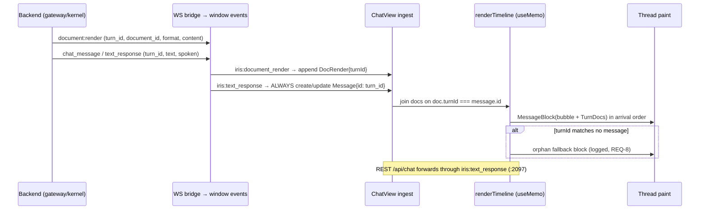

# Design: ChatView Dev Cleanup (scroll + render structure)

## Context
ChatView (`components/chat-view.tsx`, ~5110 lines) renders one unified scroll from
three sources: `messages` (conversation state), `documents` (per-conversation
`DocRender[]` from `document:render`), and `taskProgress.cards` (live task cards).
Two modes share the structure with different painters (dev: Blueprint Matrix CLI +
mono text; personal: `TaskListCard` + `RichDocument`). Session 291 landed the
anchor fix (exact-match predicate, anchor always created) and live-verified inline
order on the running app. This design finishes the job: a Turn model that makes
orphans structurally rare, a scroll contract for every nested panel, and a history
list that scrolls 778 rows. No backend changes.

## Architecture Overview
```
            ┌──────────────────────────────────────────────┐
            │ ChatWing (single scroll container :3371)      │
            │  flex-1 overflow-y-auto  ← THE ONE scroller   │
            │                                               │
            │  renderTimeline: Entry[] (useMemo :858)       │
            │   ├─ {kind message} → MessageBlock            │
            │   │    ├─ text bubble (dev mono / personal)   │
            │   │    └─ TurnDocs  (doc.turnId === msg.id)   │
            │   └─ {kind card}    → Matrix | TaskListCard   │
            │                                               │
            │  orphan fallback (true misses only, :4218)    │
            │  history dropdown (own contained scroller)    │
            │  slash menu (own contained scroller)          │
            └──────────────────────────────────────────────┘
```
One vertical scroller owns the thread. Every nested list owns a CONTAINED scroller
(`overscroll-behavior: contain`). Nothing scrolls by percentage-of-auto.

## Sequence / Data Flow



```mermaid
flowchart TD
    A[wheel over history list] --> B{panel capped?}
    B -->|yes, contain| C[list scrolls, thread still]
    B -->|no (%-of-auto)| D[list grows, clips, wheel chains to thread]
    D --> E[BUG observed 2026-09-04]
```

## Data Models

```ts
// Logical unit the UI reasons about (derived, not stored — zero migration).
interface Turn {
  id: string;                    // turn_id, the single namespace
  user?: Message;                // prompt (Retry/Edit belong here)
  assistant: Message;            // ALWAYS exists once text_response arrives —
                                 // the join anchor, even for card-only turns
  taskCard?: TaskCard;           // join: responseTurnId === id
  docs: DocRender[];             // join: turnId === id, keyed by document_id
  orphans: DocRender[];          // turnId matches nothing (fallback only)
}
```
`renderTimeline` already materializes message+card order (`:858-916`); the Turn view
is that memo grouped by `id`. No store change: `Conversation{message[], documents[]}`
plus `useTaskProgress.cards` stay as-is.

## Key Decisions

### D1 — Keep the bottom orphan pile for true misses (user-locked)
- Default/obvious: delete the fallback now anchors always exist.
- Why the pile exists: hydration safety net — `get_documents` can return cards whose
  messages failed to load (store miss, old data, render-before-message race).
- Alternatives: (a) inline "unavailable" placeholder — rejected: a placeholder for a
  card that arrives 200ms later flickers; (b) drop silently — rejected: reload must
  never lose research (user call).
- Chosen: keep, but it must be EMPTY in the common case and every entry is logged
  (REQ-8). Cheapest correct option: zero new UI, full safety.

### D2 — History scroll via resolvable cap + containment (recommended default)
- Default/obvious: `maxHeight: 50%` + inner `overflow-y-auto` (current, broken).
- Why it's broken: `%` resolves against an indefinite flex parent (`height: auto`
  animation target), so no constraint ever applies; 778 rows overflow, clip under
  `overflow-hidden` ancestors, wheel chains to the thread.
- Alternatives: (a) virtualized list — rejected for now: new dep, 778 rows don't need
  it once rows skip off-screen work; revisit past ~5k measured jank. (b) paging —
  rejected: breaks find-in-panel and adds state. (c) CHOSEN: cap in `vh`/measured px
  (reuse the `getOuterMaxHeight()` pattern at `:2831`), `overscroll-behavior:
  contain` on the list, `content-visibility: auto` + `contain-intrinsic-size` on
  rows, animate only the first screen of rows.
- Cost layers: resource — avoids ~1300-node full paint per open; complexity — CSS
  only, no dep; latency — panel opens in one frame.

### D3 — Pinned-to-bottom auto-scroll (not unconditional)
- Default/obvious: `scrollTop = scrollHeight` on every timeline change (current
  `:1015-1022`).
- Why it exists: streaming turns must stay visible while arriving.
- Alternatives: (a) keep unconditional — rejected: yanks readers (the dev-mode
  complaint). (b) CHOSEN: track pinned state (`scrollHeight - scrollTop -
  clientHeight < threshold`); auto-scroll only when pinned; show a "jump to latest"
  affordance otherwise (affordance styling open, REQ-6).
- Verification: live gate — scroll up mid-stream, assert position held (behavioral).

### D4 — Turn grouping as derived view, not a store migration
- Default/obvious: refactor `Conversation` to hold `Turn[]`.
- Why not: migration risk across 778 persisted threads, rehydration paths
  (`hydrateDocuments`, `sync_state_ack`), chips, revert/truncate logic — all keyed
  on messages/documents today.
- CHOSEN: derive Turn grouping inside `renderTimeline`'s memo (same deps +
  documents). One function, zero migration, identical keys. Revisit only if a
  requirement needs turn-level persistence.

### D5 — Deterministic card acceptance via fixture replay
- Default/obvious: "send prompts until a card appears" (flaky — 1 of 5 live turns).
- CHOSEN: replay the captured 11:52 wire shapes (`document:render` markdown 680ch +
  `chat_message`, shared turn id) as a contract/behavioral fixture asserting inline
  placement + zero orphans. Model nondeterminism is then irrelevant to the UI gate.

## Ripple-Effect Map

| Area / File | Change? | Classification | Why / Evidence |
|---|---|---|---|
| `chat-view.tsx:4054-4206` inline docs block | Yes | CHANGE NEEDED | Bubble-visibility on exact duplicate (REQ-1 AC3); join predicate stays |
| `chat-view.tsx:4218-4247` orphan block | Yes | CHANGE NEEDED | Add REQ-8 logging; keep rendering (D1) |
| `chat-view.tsx:3235-3249` history panel | Yes | CHANGE NEEDED | Resolvable cap + containment + row budget (REQ-3/4/5) |
| `chat-view.tsx:1015-1022` auto-scroll | Yes | CHANGE NEEDED | Pinned-only scrolling (REQ-6 AC3/AC4) |
| Composer + send control `:4760-4835, :4921` | Yes | CHANGE NEEDED | Explicit send control reusing `handleSendMessage` (REQ-7) |
| `chat-view.tsx:858-916` renderTimeline | Yes | CHANGE NEEDED | Derive Turn grouping (D4); task-card dedup (`latestPerTurn`) untouched |
| `hooks/useTaskProgress.ts` responseTurnId/turnId | No | NO CHANGE (verified) | Cards already carry join keys; hook scope untouched |
| `lib/documentMerge.ts` merge | No | NO CHANGE (verified) | Idempotent merge already dedups rehydration (`:1367` call site) |
| `backend document:render` event shape | No code | CONTRACT LOCK | CT-1 pins `{turn_id, document_id, format, content}` — frontend join depends on it |
| `backend chat_message/text_response` shape | No code | CONTRACT LOCK | CT-2 pins `{turn_id, text, spoken}` — anchor id depends on it |
| `useIRISWebSocket.ts` conversation identity | No | NO CHANGE (verified) | Socket-owned id already prevents thread merge (`:1936-1984`) |
| `app-testing` skill (manual UI path) | No | NO CHANGE (verified) | Drive-by-UI recipe reused for live gates |
| TTS/audio/voice backend | No | NO CHANGE (verified) | Out of scope; live-verified session 291 |

## Error Handling
- `IF turn_id is missing on a render THEN show nothing and log` (never orphan on null).
- `IF get_documents returns cards for a deleted conversation THEN keep them in
  fallback, never throw during scroll render`.
- `IF the timeline memo throws on a malformed doc THEN isolate per-turn (one bad
  card blanks its turn, not the thread)`.
- `IF WS replays a turn THEN dedup by turn_id before anchor creation
  (seenTurnIds, existing behavior kept)`.

## Testing Strategy
```
tests/unit/         normalizeCardText exactness; pinned-bottom math; row capping
tests/contract/     CT-1 document:render shape; CT-2 chat_message shape;
                    CT-3 Turn join (fixture → grouped model, no DOM)
tests/behavioral/   BT-1 fixture replay → inline card + zero orphans (11:52 shapes);
                    BT-2 778-row panel wheels without moving thread;
                    BT-3 scrolled-up stream holds position; pinned stream follows
scripts/validate_der_*.py harness keeps replaying recorded trajectories every run
```
- Contract + behavioral share the 11:52 fixture (intertwined).
- Live gates (DevTools, `app-testing` skill): history wheel test, pinned-scroll test,
  fixture-equivalent prompt turn, TTS-spoke check per turn (established session 291).
