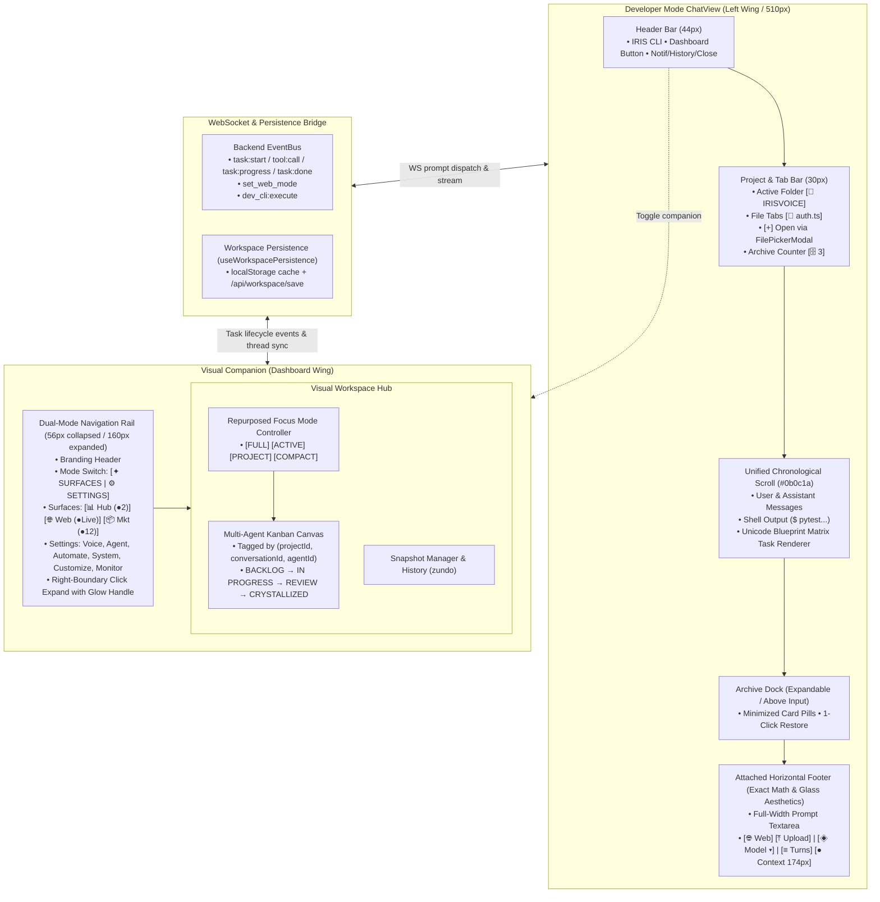
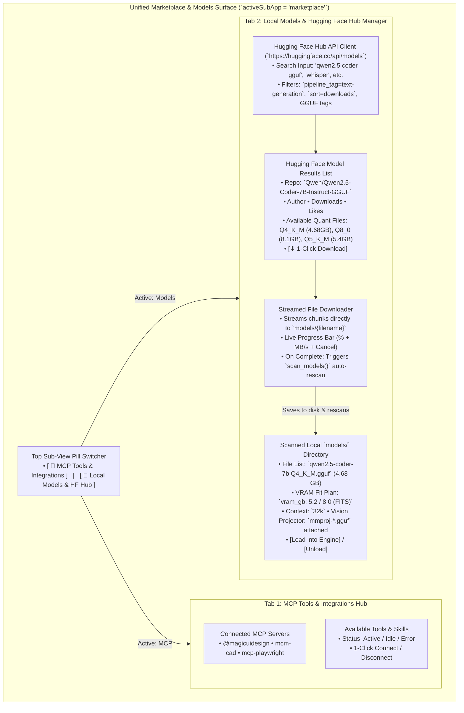

# Design: Developer Mode CLI, Attached Footer & Visual Workspace Hub

## Context
This design unifies the Developer Mode CLI ChatView with an attached horizontal footer toolbar (matching exact original ChatView glass styling with ConversationChips left of ContextPill and no enter icon), authentic Unicode Blueprint Matrix task progress, and a companion Visual Workspace Hub. The navigation rail in `dark-glass-dashboard.tsx` implements the Dual-Mode Segmented Switcher (`SURFACES` vs `SETTINGS`), 36px circular node geometry, live telemetry badges, and right-boundary click expansion.

---

## Architecture Overview



---

## Detailed Footer Horizontal Spacing Mathematics

```
┌────────────────────────────────────────────────────────────────────────────────────────────────────────┐
│ TOTAL CONTAINER: 510px (Usable Inner Width: 486px, Insets: 12px Left & Right)                          │
├────────────────────────────────────────────────────────────────────────────────────────────────────────┤
│ [12px pad]                                                                                [12px pad]  │
│                                                                                                        │
│  ┌────┐  8px  ┌────┐   12px   │   12px  ┌────────────┐   12px   │   12px  ┌────┐   10px  ┌─────────────┐│
│  │ 🌐 │ <───> │ ⤒  │ <──────> │ <─────> │ ◈ o4-mini▾ │ <──────> │ <─────> │ ≡  │ <────> │ ● IDLE      ││
│  │    │       │    │          │         │            │          │         │    │        │  0 / 128.0k ││
│  └────┘       └────┘          │         └────────────┘          │         └────┘        └─────────────┘│
│   32px         32px          1px            116px              1px         32px              174px     │
│                                                                                                        │
│  [─── TOOLS: 72px ───]      [DIV 1]     [─── MODEL: 116px ───] [DIV 2]    [TURNS: 32px] [CONTEXT: 174px]│
└────────────────────────────────────────────────────────────────────────────────────────────────────────┘
```

$$\text{Total Explicit Width} = 72\text{px (Tools)} + 25\text{px (Div 1)} + 116\text{px (Model)} + 25\text{px (Div 2)} + 32\text{px (Turns)} + 10\text{px (Gap)} + 174\text{px (Context)} = 454\text{px}$$
$$\text{Balanced Distribution Margin} = (486\text{px} - 454\text{px}) / 2 = 16\text{px}$$

---

## Navigation Rail Right-Boundary Affordance Architecture

```
                                  RAIL BOUNDARY SEAM (Right Border)
                                                 │
                                                 │ (Vertical Center / Top 50%)
                       EXPANDED STATE            │            COLLAPSED STATE
                    (Chevrons Point Left ‹)      │        (Chevrons Point Right ›)
                                                 │
                                           ┌─────┼─────┐
                                           │  ░░░│░░░  │  ← Laser Shimmer Gradient Top (Y=3)
                                           │     │     │
                                           │ ──┐ │     │  ← Chev 1 (Y=7..15, Tip at X=8, Y=11)
                                           │   └>│     │
                                           │ ──┐ │     │  ← Chev 2 (Y=13..21, Tip at X=8, Y=17)
                                           │   └>│     │
                                           │ ──┐ │     │  ← Chev 3 (Y=19..27, Tip at X=8, Y=23)
                                           │   └>│     │
                                           │ ──┐ │     │  ← Chev 4 (Y=25..33, Tip at X=8, Y=29)
                                           │   └>│     │
                                           │     │     │
                                           │  ░░░│░░░  │  ← Laser Shimmer Gradient Bottom (Y=37)
                                           └─────┼─────┘
                                                 │
                                                 ▲
                                     Exact Seam Axis (X = 8px)
```

### Exact Mathematical Positioning & SVG Geometry

1. **Container Alignment**:
   - Anchored inside `<nav>` with `position: absolute; right: -8px; top: 50%; transform: translateY(-50%)`.
   - Dimensions: `width: 16px; height: 44px; z-index: 50;`.
   - Centering guarantee: With `width = 16px` and `right = -8px`, the internal SVG coordinate $X = 8\text{px}$ aligns precisely over the $1\text{px}$ right border (`border-r border-white/[0.06]`) of `<nav>`.
   - Container Rule: `<nav>` MUST have `overflow-visible` so that the right $8\text{px}$ of the affordance is never clipped by parent bounds. Internal scroll lists handle scroll overflow (`overflow-y-auto overflow-x-hidden`).

2. **Neon Laser Shimmer Seam Line**:
   - SVG Line: `<line x1="8" y1="3" x2="8" y2="37" stroke="url(#laserSeamShimmerGrad)" strokeWidth={isHover ? "1.75" : "1.25"} strokeLinecap="round" />`
   - Gradient Definition:
     - $0\% \to \text{color: } GLOW, \text{opacity: } 0$
     - $25\% \to \text{color: } GLOW, \text{opacity: } 0.3 \text{ (hover: } 0.85\text{)}$
     - $50\% \to \text{color: } \#ffffff, \text{opacity: } 0.55 \text{ (hover: } 1.0\text{)}$
     - $75\% \to \text{color: } GLOW, \text{opacity: } 0.3 \text{ (hover: } 0.85\text{)}$
     - $100\% \to \text{color: } GLOW, \text{opacity: } 0$
   - Hover Filter: `filter: drop-shadow(0 0 6px ${GLOW}) drop-shadow(0 0 2px #ffffff)`

3. **Chevron Vector Paths ($4\times$ Single Column Stack)**:
   - **When Expanded (160px/180px) — Collapses Inward (Point Left `‹`)**:
     - Path 1: `M 12 7 L 8 11 L 12 15`
     - Path 2: `M 12 13 L 8 17 L 12 21`
     - Path 3: `M 12 19 L 8 23 L 12 27`
     - Path 4: `M 12 25 L 8 29 L 12 33`
   - **When Collapsed (56px) — Expands Outward (Point Right `›`)**:
     - Path 1: `M 4 7 L 8 11 L 4 15`
     - Path 2: `M 4 13 L 8 17 L 4 21`
     - Path 3: `M 4 19 L 8 23 L 4 27`
     - Path 4: `M 4 25 L 8 29 L 4 33`
   - Vector styling: `stroke={GLOW}`, `strokeWidth="1.3"`, `strokeLinecap="round"`, `strokeLinejoin="round"`, `opacity={0.7..0.95}`.

---

## Unified Marketplace & Model Manager Surface Architecture



### Technical Implementation Details

1. **Sub-View Switcher Pill**:
   - Renders a horizontal segmented pill at the top of the surface view.
   - Preserves state in local storage (`iris_marketplace_subview: 'mcp' | 'models'`).
2. **Local Models Scanner Integration**:
   - Connects to backend `/api/models/scan` and WebSocket model lifecycle (`load_model`, `unload_model`, `model_loaded_ack`).
   - Uses existing `ModelBrowserPanel` logic for VRAM estimation and profile derivation.
3. **Hugging Face Hub Search & Download Bridge**:
   - Backend endpoint `/api/models/hf/search?q={query}&limit=20` queries Hugging Face API with user-agent and optional HF token.
   - Backend download endpoint `/api/models/hf/download` streams remote `.gguf` weight file to `models/` directory with progress broadcast over WebSocket (`model:download_progress`, `{pct, speed_mb, filename}`).
   - Triggers automatic `scan_models` refresh upon completion.

---

## Key Decisions & Rationale

| Decision | Rationale | Alternatives Rejected |
|---|---|---|
| **Remove `⏎` Enter Icon** | Redundant affordance since Enter is universal; frees $14\text{px}$ to give ContextPill a spacious $174\text{px}$ width. | Keeping enter icon (rejected: caused visual crampedness). |
| **ConversationChips Left of ContextPill** | Groups input tools & mode selection on the left/center, navigation in the middle-right, and live memory state on the far right. | Placing ConversationChips on the far right (rejected). |
| **Dual-Mode Rail with Live Badges** | Separates active workspaces from static system settings to prevent cognitive overload while surfacing live telemetry. | Single cluttered list showing all 9 items at once (rejected). |
| **Seam-Anchored Chevron Stack & Shimmer** | Anchors the interactive affordance directly to the boundary line ($X=8$) where the spatial split occurs, providing continuous visual feedback without extra DOM clutter. | Floating detached tab or top-only icon (rejected: adds edge noise and feels disconnected). |
| **Combined Marketplace & Model Manager Surface** | Consolidates MCP servers, external integrations, local model weights, and Hugging Face model discovery into one unified capability hub, reducing top-level rail clutter while streamlining agent setup. | Separate navigation rail tabs for Marketplace and Models (rejected: wasted vertical rail space). |
| **Chamber label is free-form data text ("Diving Deeper" in examples)** | task-card-v2 Decision 13 / CT-9 ban the literal "Sub-Loop" from user-facing surfaces; the renderers already treat `branchLabel` as free text. Spec examples updated to match; internal identifiers exempt. | Hardcoding "Sub-Loop" in spec examples (rejected: contradicts a locked cross-spec decision). |
| **Multi-agent tags emitted at `_task_start_payload`** | It is the ONE construction point and already carries `card_id`/`card_relation`/`conversation_id`; every emit site inherits the fields for free. Frontend-fabricated tags drift from backend truth. | Frontend infers `agentId`/`projectId` from event shape (rejected: same failure mode card identity was moved to the backend to avoid). |
| **Badge telemetry from existing stores** | Active-task count, web-surface state, and MCP tool count already exist in client state; a new telemetry channel duplicates them. | Dedicated telemetry events/backend (rejected: out of proportion for badge counts). |
| **Terminal slide-over removed entirely in dev mode** | Dev-mode chat IS the CLI; with output streaming into the unified scroll, a second terminal surface duplicates one channel and eats viewport. Supersedes task-card-v2 REQ-13 for dev mode. | Keep output-only slide-over (rejected: two surfaces showing the same stream). |
| **Reuse `Xur.tsx` as the loading glyph, not `XurOrb`** | Xur is 92 lines, non-interactive, prop-driven — safe inside a scrolling stream. XurOrb is a singleton navigator (drag, voice, menu) whose rAF/canvas cost and gesture handlers have no place in scroll children. | Embedding XurOrb or a mini OrbCanvas in the stream (rejected: duplicate interactive orb, hot-path cost). |

---

## Branded Loading Glyph & Matrix Accent

```
submit ──► [ Xur spiral, glowColor, breathing ] ──► first block arrives ──► glyph unmounts
                                                                        └─► TASK : header carries glow accent
```

- The glyph is `components/Xur.tsx` rendered at ~28–36px, `color = brandGlow`, mounted ONLY between submit and first streamed content. At most ONE instance exists in the stream; unmount on first block guarantees no orphaned rAF loops (quality check: bounded resources).
- The Blueprint Matrix `TASK :` header line takes the same brand glow as an accent (icon/tint), so the brand hand-off orb → glyph → matrix is continuous without embedding any component into the renderer.

## Error Handling

| Failure | Response |
|---|---|
| HF download cancelled mid-stream | IF a download is cancelled THEN THE SYSTEM SHALL delete the partial `.gguf` from `models/` — never leave a truncated weight that a later scan could offer for loading |
| HF download fails (network/disk full) | IF the stream errors THEN THE SYSTEM SHALL remove the partial file, report the failure in the download row, and keep the scanner state consistent |
| Unsafe filename from HF repo | IF a remote filename contains path separators, `..`, or non-asset characters THEN THE SYSTEM SHALL sanitize/reject it before writing under `models/` — downloads stay inside the scanned directory (path-traversal guard) |
| HF search endpoint unreachable / rate-limited | IF the upstream API fails THEN THE SYSTEM SHALL surface the error state in the search view and never render fabricated results |
| HF token absent | IF no token is configured THEN THE SYSTEM SHALL still search public repos and mark gated models as unavailable rather than failing the whole tab |
| Task event arrives without `agent_id`/`project_id` | IF the tags are absent (older emitter) THEN THE SYSTEM SHALL fall back to `conversationId`-only keying and log once — never drop the Kanban card |
| Badge source store unavailable | IF a telemetry source cannot be read THEN THE SYSTEM SHALL render the badge dimmed/absent rather than fabricate a count |
| Shell command fails in unified scroll | IF a `>` command exits non-zero THEN THE SYSTEM SHALL stream stderr/exit status into the scroll as part of the output block — never swallow it silently |

---

## Ripple-Effect Map (MANDATORY)

| Area / File | Change? | Classification | Why / Evidence (file:line) |
|---|---|---|---|
| `components/chat-view.tsx` | Yes | CHANGE NEEDED | Replace dev-mode workspace replacement with unified scroll; implement attached horizontal footer toolbar with exact glass styling, ConversationChips left of ContextPill, and $174\text{px}$ token pill; integrate project folder tab bar and Archive Dock (`components/chat-view.tsx:2745-2755`, `3760-3995`). |
| `components/dark-glass-dashboard.tsx` | Yes | CHANGE NEEDED | Implement Dual-Mode segmented pill switch (`SURFACES` vs `SETTINGS`), 36px round node stream, live telemetry badges, and right-boundary click expansion (`components/dark-glass-dashboard.tsx:1257-1345`). |
| `components/terminal/TerminalSlideOver.tsx` | Yes | CHANGE NEEDED | Remove from Developer Mode ENTIRELY (decision locked 2026-08-21): no slide-over, no `$` input row; all shell output routes to unified scroll. `terminalScrollback.ts` line subscriptions are preserved for the scroll bridge. Supersedes task-card-v2 REQ-13's keep-the-slide-over outcome for dev mode. |
| `backend/agent/agent_kernel.py` `_task_start_payload` | Yes | CHANGE NEEDED | Add `agent_id` (kernel session identity) and `project_id` (active project folder scope) at the SAME single construction point that already carries `card_id`/`card_relation`/`conversation_id`. Kanban tags have no other producer — without this, REQ-5 AC1 and CT-1 cannot pass. Additive only. |
| `stores/workspaceStore.ts` | Yes | CHANGE NEEDED | Repurpose `focusPreset` to `full` \| `active` \| `project` \| `compact`, add multi-agent task tagging, and expose the `[● N Running]` active-task count consumed by the rail badge (`stores/workspaceStore.ts:40-125`, `285-308`). |
| `components/workspace/DeveloperWorkspace.tsx` | Yes | CHANGE NEEDED | Wire multi-agent Kanban board and Focus Mode presets inside the Dashboard Wing (`components/workspace/DeveloperWorkspace.tsx:1-250`). |
| `lib/cli/CLITaskProgressRenderer.ts` | No | NO CHANGE (verified) | Already implements `renderBlueprintCellMatrixCLI` with exact Unicode single-line box format, visible-width padding (`visibleWidth()`), right-wall closure, and the "Diving Deeper" free-form chamber label (`lib/cli/CLITaskProgressRenderer.ts:110-344`). |
| `components/Xur.tsx` | No | NO CHANGE (verified) | Existing 92-line canvas particle spiral (`size`/`color`/`speed`) — reused as the branded loading glyph (REQ-10). Mounted only while loading; unmounted on first content so its rAF loop never accumulates in the stream. |
| `components/chat/ConversationChips.tsx` | No | NO CHANGE (verified) | Already provides popover drawer and turn navigation via `containerRef` (`components/chat/ConversationChips.tsx:1-100`). |
| `hooks/useWorkspacePersistence.ts` | No | NO CHANGE (verified) | Already provides debounced auto-saving to localStorage and `/api/workspace/save` keyed by `conversationId` (`hooks/useWorkspacePersistence.ts:1-120`). |
| `hooks/useIRISWebSocket.ts` | No code | CONTRACT LOCK | WebSocket event shapes (`task:start`, `tool:call`, `set_web_mode`) must maintain strict schema CT-1 (`hooks/useIRISWebSocket.ts:1-200`). |
| `app/cli-preview/page.tsx` | Yes | CHANGE NEEDED | Update live reference prototype for visual regression verification (`app/cli-preview/page.tsx:1-450`). |

---

## Testing Strategy

```
tests/unit/
  ├── test_cli_command_router.ts         (Prefix routing ">ls", "/run", natural language)
  ├── test_blueprint_unicode_matrix.ts   (Assertion of Unicode box characters & rail alignment)
  └── test_focus_mode_filter.ts          (Focus presets: full/active/project/compact)

tests/contract/
  ├── CT-1: test_ws_event_contracts.py   (Validates IRISStreamEvent frame shapes & multi-agent tags
  │                                       agent_id/project_id emitted at _task_start_payload, additive only)
  └── CT-2: test_web_mode_contract.py    (Validates set_web_mode payload synchronization)

tests/behavioral/
  ├── test_full_cli_task_lifecycle.py   (Plan -> execute -> Unicode matrix -> converge -> scroll)
  ├── test_kanban_multiagent_flow.ts    (Agent events -> Kanban card update -> click deep-link)
  └── test_hf_download_lifecycle.py     (Search -> stream -> cancel/fail removes partial file -> rescan)

scripts/validate_der_cli_harness.py      (Standing CDD harness: replays recorded traces through CLI)
```
