# Design: Closed-loop local model tuning

## Context

`LocalModelManager` already contains a complete self-tuning engine:

- `ConfigCache` (`:282`) — per-model store at `.mcm/local_model_configs.json`, holding
  `measured_tps` and the last good config, invalidated by hardware fingerprint (`:313`) or
  model-file fingerprint (`:319`).
- Machine bandwidth cache (`:375-416`) — ONE measured number (effective GB/s) keyed by
  hardware fingerprint, from which every model derives its own `base_tps`. This is the
  mechanism that makes a brand-new model need no benchmark of its own.
- `record_tps()` (`:2523`) → `_write_tps_correction()` (`:2574`) — rolling window of three
  samples, 15% deadband, then recalibrate and re-derive `n_ctx` at the original target.

None of it runs. Both cache files are absent from disk, and `record_tps` has no production
caller, so `derive_config` always logs `base_tps=50.0 (source=uncalibrated_default)`.

The constraint that bounds this design: **the return signature of `InferenceRouter.generate()`
must not change** — eight or more call sites depend on the 3-tuple. This is why `last_usage`
was surfaced as an attribute read after the call (`router.py:969-973`), and `last_tps` follows
the identical pattern.

## Architecture Overview

```mermaid
flowchart LR
    subgraph infer["Inference path"]
        R["InferenceRouter.generate()<br/>router.py:973"]
        T["Transport<br/>OpenAICompat :851<br/>ApiHttpx :457<br/>InProcess :1216"]
        R --> T
    end

    subgraph measure["Measurement (NEW)"]
        X["_extract_timings()<br/>mirrors _extract_usage :398"]
        LT["transport.last_tps"]
        RT["router.last_tps"]
        X --> LT --> RT
    end

    subgraph tune["Tuning engine (EXISTS, dormant)"]
        RP["record_tps()<br/>:2523"]
        WC["_write_tps_correction()<br/>:2574"]
        CC["ConfigCache<br/>.mcm/local_model_configs.json"]
        BW["machine bandwidth<br/>local_model_machine_bandwidth.json"]
        RP --> WC --> CC
        WC --> BW
    end

    subgraph load["Next load"]
        DC["derive_config()<br/>:2045"]
        LM["load_model()<br/>consults cache :2768-2783"]
        CC --> LM
        BW --> DC --> LM
    end

    T --> X
    RT -.->|"NEW: one call site<br/>local provider only"| RP
```



The only new edge is the dashed one. Everything else already exists and is wired.

## Sequence / Data Flow

```mermaid
sequenceDiagram
    participant K as AgentKernel
    participant R as InferenceRouter
    participant T as Transport
    participant S as llama-server
    participant M as LocalModelManager
    participant C as ConfigCache

    K->>R: generate(role, ...)
    R->>T: complete(...)
    T->>S: POST /v1/chat/completions
    S-->>T: {choices, usage, timings}
    Note over T: NEW: _extract_timings()<br/>reads timings.predicted_per_second
    T-->>R: (text, ...)
    Note over R: NEW: self.last_tps =<br/>getattr(transport,"last_tps",None)
    R-->>K: (text, ...)
    Note over R: NEW: if provider is local and<br/>last_tps is not None
    R->>M: record_tps(last_tps)
    M->>M: append to rolling window (max 3)
    alt window < 3
        M-->>R: return (no correction)
    else window full and outside deadband
        M->>M: _write_tps_correction()
        M->>M: calibrate base_tps + bandwidth
        M->>C: put(model_fp, config, measured_tps)
        M->>C: put_machine_bandwidth(hw_fp, bw)
        C-->>M: persisted
    end
    Note over M: correction applies to NEXT load;<br/>running model untouched (T4.3)
```

## Data Models

**`transport.last_tps`** — new attribute, mirrors `last_usage`:

| Field | Type | Meaning |
|---|---|---|
| `last_tps` | `Optional[float]` | `timings.predicted_per_second` from the most recent local call. `None` when absent, malformed, or non-finite. Reset to `None` at the start of each call. |

**`router.last_tps`** — new attribute, mirrors `router.last_usage` (`:275`). Set from
`getattr(transport, "last_tps", None)` after `generate()` returns.

**`_extract_timings(payload)`** — new module-level helper mirroring `_extract_usage` (`:398`):

```python
def _extract_timings(payload: Dict[str, Any]) -> Optional[float]:
    """Return timings.predicted_per_second, or None. Never estimates."""
```

**ConfigCache entry** — unchanged shape, already defined at `:363-372`:

| Field | Type | Notes |
|---|---|---|
| `hw_fingerprint` | `str` | gpu name + total VRAM |
| `config` | `dict` | `{n_ctx, n_gpu_layers, n_batch, ...}` |
| `measured_tps` | `Optional[float]` | written by `_write_tps_correction` |
| `updated_at` | `float` | epoch |

**Machine bandwidth entry** — unchanged, `:417-426`: `{hw_fingerprint, effective_bandwidth, updated_at}`.

**On-disk location (CHANGED)**

| File | Old | New |
|---|---|---|
| Per-model config | `.mcm/local_model_configs.json` | `.iris-config/local_model_configs.json` |
| Machine bandwidth | `.mcm/local_model_machine_bandwidth.json` | `.iris-config/local_model_machine_bandwidth.json` |

Both paths now come from one module-level constant, `LOCAL_MODEL_CONFIGS_PATH` (`:283`), and the
bandwidth path derives from it with `with_name()` (`:386-388`) so the two cannot drift. Rationale
is recorded in the `ConfigCache` docstring: `.mcm/` is the MCM SDK's own directory and is
gitignored, and `MODELS_DIR` is user-configurable so config must not be written beside the models.
`.iris-config/` is added to `.gitignore` as regenerated per-machine state.

**Readout payload (REQ-7, NEW)** — read-only view over the above, never a separate store:

| Field | Type | Notes |
|---|---|---|
| `model` | `str` | model file name |
| `calibrated` | `bool` | false → `base_tps` is still the 50.0 fallback |
| `measured_tps` | `Optional[float]` | from the ConfigCache entry |
| `n_ctx` | `int` | currently in force |
| `bound_by` | `str` | one of `vram` / `throughput` / `profile_ceiling` / `native_ctx` |
| `samples` | `int` | length of `_tps_window`, for the "N of 3" progress display |
| `last_correction` | `Optional[dict]` | `{old_n_ctx, new_n_ctx, direction}` from the last write |

## Key Decisions

**D1 — Use llama.cpp's `timings.predicted_per_second`, not a wall-clock estimate.**
The console value at `iris_gateway.py:5368` divides a `len(text) // 4` character estimate by the
duration of an *entire agent turn*, which includes planning, tool calls and re-plans. Feeding
that into `record_tps` would badly miscalibrate `base_tps` — it would look like the model is
slow and shrink context for no reason. llama.cpp already measures generation precisely and puts
it in the response; we are discarding it today.

*Rejected:* measuring wall-clock around the transport call. Still includes network and queueing
and would vary with prompt size.

**D2 — Surface `last_tps` as an attribute, not a return value.**
The 3-tuple return of `generate()` is depended on by 8+ call sites; the codebase already
established the attribute pattern for `last_usage` (`router.py:969-973`). Mirroring it keeps the
change additive and non-breaking.

*Rejected:* adding a 4th tuple element — invasive, silent breakage risk at every call site.

**D3 — Never estimate a missing measurement.**
`_extract_usage`'s docstring (`:398-405`) states that `None` means "no real usage available" and
callers must fall back to the char/4 heuristic rather than fabricate. `_extract_timings` adopts
the same rule. A wrong calibration is worse than no calibration, because it silently shrinks a
working model's context.

**D4 — Calibration must never fail a turn.**
The whole measurement path sits inside existing broad exception handling semantics; `record_tps`
is called defensively and any exception is logged and swallowed. A user response is never
withheld because tuning failed.

**D5 — Out of scope: profile ceiling and binary selection.**
Both are real gaps (`local_model_manager.py:2824-2827` narrow-only `min()`; `:3388` first-existing-path
selection). Bundling them would make this change unverifiable in isolation. They are separate specs.

**D6 — Expert placement is measured, never assumed.**
MoE experts are accessed sparsely, so the intuition is that CPU residency costs little. The
measurement on this machine says the opposite (see Benchmark Evidence). Therefore the rule is:
default to full GPU offload, and let the existing `ConfigCache` carry a measured placement only
where it actually wins. This keeps one mechanism (the REQ-2 loop) instead of adding a second
policy engine, and it means a machine with genuinely high CPU-GPU bandwidth can still reach
CPU placement — by measurement, not by guess.

**D7 — An alternate MoE engine is a provider, not a replacement.**
FreeToken speaks the OpenAI protocol, so REQ-9 routes it through `InferenceRouter` like any other
provider. llama-server stays the default. Nothing is gated on an optional dependency.

**D8 — Device enforcement becomes purpose-aware; the brain never leaves the GPU.**
The unconditional `n_gpu_layers = -1` force (`local_model_manager.py:3691-3698`) is replaced by
delegation to `resolve_device_policy`, which is already the declared single source of truth
(`:528-540`). `chat`/`tool` stay GPU-only and fail loudly without a GPU; `embedding`/`rerank` may
use CPU. *Rejected:* CUDA-only-with-documentation — it would leave `resolve_device_policy` and the
`eco` profile permanently contradictory, and CPU embeddings are standard practice.

**D9 — Failure learning must classify before it acts.**
A single "shrink on failure" rule is worse than no rule: on a corrupt model it walks `n_ctx`
toward zero. So REQ-12 requires a failure *class* first — only VRAM exhaustion shrinks, and only
up to three times. Everything else marks the model unusable and stops. *Rejected:* shrinking on
any failure (dangerous), and retrying identically (that is the current bug).

**D10 — VRAM is budgeted from a ledger, not from instantaneous free memory.**
`vram_free_gb` is a snapshot that stops being true the moment another process loads. The ledger
makes the budget a statement about the *session* rather than an instant. *Rejected:* reserving a
fixed 1 GB for vision — that hardcodes one model's footprint, which AC8 forbids; the ledger
measures whatever is actually resident.

**D11 — Uncalibrated machines bias small and grow.**
The cost of being too small (some unused context) is far lower than the cost of being too large
(OOM, or a model too slow to use). So the uncalibrated path takes the conservative end and the
loop grows it. Because machine bandwidth is shared across all models, this is paid once per
machine rather than once per model.

## Benchmark Evidence (MoE expert placement)

LFM2.5-8B-A1B-UD-Q3_K_M — 24 layers, Q3_K_M, 3.67 GB, native ctx 128k. PrismML build,
`--fit off --ctx-size 8192`, warm, throughput from `timings.predicted_per_second`, VRAM baseline
polled back to idle between every configuration.

| Config | GPU delta | tok/s | vs baseline |
|---|---|---|---|
| A `-ngl -1` (all GPU) | 4072 MiB | **129.20** | 1.0x |
| B `-ngl -1 -ncmoe 12` (half the layers' experts on CPU) | 2634 MiB | **18.76** | **6.9x slower** |
| C `-ngl -1 -cmoe` (all experts on CPU) | 890 MiB | **7.06** | **18.3x slower** |

**What the freed VRAM would buy:** KV cost for this model is `2 x 24 x 32 x 64 = 98,304 B/token`
= 96 KiB/token at q8_0. Config C frees 3182 MiB, which is ~33,900 extra tokens — purchased at
the price of 129 → 7 tok/s. A catastrophic trade on this hardware.

**Conclusion:** the existing `n_gpu_layers = -1` / no-CPU-offload rule is correct for this box
(RTX 3070 8 GB, i7-7700 4 cores, 16 GB DDR4). REQ-8 must not weaken it.

**Methodology note (a full run was invalidated by this):** `taskkill //IM llama-server.exe //F`
silently fails in Git Bash (`ERROR: Invalid argument/option - '//IM'`). With stderr redirected to
`/dev/null` it looks like it worked while servers accumulate and VRAM is never released. Kill the
bash job (`kill $PID`) and poll `nvidia-smi` back to baseline between configurations. Also discard
one warm-up load — a cold 3.67 GB read took 71 s versus 8 s warm.

**Implication for 35B MoE (the user's stated plan):** a ~35B MoE at Q4 is roughly 20 GB and will
not fit in 8 GB VRAM, so *some* CPU placement becomes mandatory rather than optional. Extrapolating
from the 18.3x penalty, expect single-digit to low-tens tok/s. That is precisely the regime where
REQ-9 earns its keep — not because FreeToken makes CPU offload fast, but because it continuously
searches for the best split instead of committing to a fixed one. The user should be told this
expectation before investing in 35B MoE on this hardware.

## Ripple-Effect Map

Every area this change touches or depends on. Classification per the skill's mandatory step 2.

| Area / File | Change? | Classification | Why / Evidence |
|---|---|---|---|
| `backend/agent/inference/transport.py` `_extract_timings` | Yes | CHANGE NEEDED | New helper mirroring `_extract_usage` (`:398`). No existing code reads `timings` — verified by grep across `backend/` for `predicted_per_second` / `timings`: zero hits outside unrelated voice-timing code. |
| `backend/agent/inference/transport.py` `OpenAICompatTransport` (`:851`) | Yes | CHANGE NEEDED | Must add `self.last_tps`, reset at `:914`, set at the same points `last_usage` is set (`:867`, `:946`, `:1047-1049`). This is the path the local llama-server uses. |
| `backend/agent/inference/transport.py` `ApiHttpxTransport` (`:457`) | Yes | CHANGE NEEDED | Same attribute for symmetry; used by the API provider path and reachable for local-over-HTTP configs. |
| `backend/agent/inference/transport.py` `InProcessTransport` (`:1216`) | No | NO CHANGE (verified) | In-process path is disabled on this machine ("llama-cpp-python has no GPU offload" — `local_model_manager.py:814`). `getattr(transport,"last_tps",None)` returns `None` for it harmlessly. |
| `backend/agent/inference/transport.py` `OllamaTransport` (`:1286`) | No | NO CHANGE (verified) | Different response shape; `getattr` default `None`. Ollama is not the local-model path here (local is `local:<stem>`). |
| `backend/agent/inference/router.py` `:275`, `:973` | Yes | CHANGE NEEDED | Add `self.last_tps` attribute and one assignment line mirroring `self.last_usage = getattr(transport,"last_usage",None)` at `:973`. |
| `backend/agent/inference/router.py` `generate()` return signature | No | CONTRACT LOCK | 8+ call sites depend on the 3-tuple. Pinned by CT-1. |
| `backend/agent/local_model_manager.py` `record_tps` (`:2523`), `_write_tps_correction` (`:2574`) | No | NO CHANGE (verified) | Already fully implemented and unit-tested. Only needs a caller. |
| `backend/agent/local_model_manager.py` `ConfigCache` cache **location** | Yes | CHANGE NEEDED — **DONE** | Moved out of `.mcm/` to `LOCAL_MODEL_CONFIGS_PATH` = `.iris-config/local_model_configs.json` (`:283`). `.mcm/` is the MCM SDK's directory (coordinates.db + ~2.5 GB backups) and is gitignored. `_machine_path()` (`:386-388`) had the old path hardcoded as a fallback and was updated to use the same constant so the two cannot drift. Verified: both paths resolve under `.iris-config/`; suite 53/54 (1 pre-existing environmental failure). |
| `backend/agent/local_model_manager.py` `ConfigCache` **logic** | No | NO CHANGE (verified) | Already persists, self-invalidates on hw/model change, and discards corrupt files (`:318-322`, `:350-356`). `mkdir(parents=True)` already present at `:442`, so the new directory is created on first write. |
| `.gitignore` | Yes | CHANGE NEEDED — **DONE** | Added `.iris-config/` as regenerated per-machine state, next to the existing `.mcm/` entry. |
| `models/gguf/.iris_model_settings.json` (`SETTINGS_FILE`, `:685`) | No | NO CHANGE (verified) | A SECOND per-model store with overlapping data. Left alone deliberately — merging it touches live `save_model_settings` / `load_model_settings`. Deferred; see Open Question 5. |
| `backend/agent/local_model_manager.py` `derive_config` (`:2045`) | Yes | CHANGE NEEDED (REQ-6 only) | Add the decision log line. No behavioural change to the derivation itself. |
| `backend/iris_gateway.py` `inference_event` payload (`:5358-5372`) | No | CONTRACT LOCK | Frontend `InferenceConsolePanel` consumes this shape. Pinned by CT-2. |
| `backend/agent/agent_kernel.py` `:787-800` (`last_usage` consumer) | No | NO CHANGE (verified) | Consumes `router.last_usage` only; adding a sibling attribute does not affect it. |
| Calibration readout (REQ-7) | Yes | CHANGE NEEDED | New read-only view over `ConfigCache` + `_tps_window` + the REQ-6 decision log. Transport mechanism is Open Question 6. It MUST NOT alter the `inference_event` payload (CT-2). |
| Existing frontend components (incl. `InferenceConsolePanel`) | No | NO CHANGE (verified) | They consume `inference_event`, whose shape is unchanged. The readout is a NEW surface consumed only by whatever new UI is built for it. |
| `.mcm/` directory | No | NO CHANGE (verified) | Left exactly as the MCM SDK owns it. No application state is written there any more. |
| MoE detection from GGUF metadata | Yes | CHANGE NEEDED (REQ-8 AC1) | New: record expert count as a model attribute. `parse_gguf_metadata` (`:1462`) currently exposes no expert fields — must be extended, and unknown fields must degrade to "not MoE" rather than raising. |
| `local_model_manager.py` expert placement / `_build_server_cmd` | Yes | CHANGE NEEDED (REQ-8) | Add `-ncmoe` / `-cmoe` / `-ot` to argv only when placement is non-default. Default argv must stay byte-identical to today: the benchmark shows GPU-only is correct, so an unconditional change would regress every existing model. |
| GPU-only rule (`n_gpu_layers = -1`, CPU-offload rejection at `:2402-2406`) | No | CONTRACT LOCK | Benchmark shows CPU placement costs 6.9-18.3x here. The rule stays. Pin with CT-5 so a future "optimisation" cannot quietly relax it. |
| `InferenceRouter` / transports for an alternate MoE engine | Yes | CHANGE NEEDED (REQ-9) | New provider + optional startup probe. Must route through the existing router; must not fork lifecycle management. |
| llama-server as default engine | No | NO CHANGE (verified) | REQ-9 is additive. Nothing may become dependent on an optional package. |
| `_build_server_cmd` device forcing (`:3691-3698`) | Yes | CHANGE NEEDED (REQ-11) | Replace the unconditional `n_gpu_layers = -1` force with delegation to `resolve_device_policy` (`:528-540`), which already declares chat/tool → GPU and embedding/rerank → CPU. Default argv for chat/tool stays byte-identical; only the CPU-purpose path and the no-GPU error change. |
| `PROFILES["eco"]` (`:114`, `n_gpu_layers: 0`) | No | NO CHANGE (verified) | Becomes LIVE code again once REQ-11 lands instead of dead code silently overridden. Nothing can rely on it being overridden — it was dead. |
| `resolve_device_policy` (`:528-540`) | No | CONTRACT LOCK | Already the declared single source of truth. REQ-11 makes the builder OBEY it rather than changing it. Pin with CT-6. |
| `_preflight_resource_check` CPU-purpose early return (`:2339-2345`) | No | NO CHANGE (verified) | Already branches on device policy correctly — the argv builder was the odd one out. This is the pattern REQ-11 generalises. |
| `load_model` failure paths (server exit, "Timed out waiting for server to start", OOM) | Yes | CHANGE NEEDED (REQ-12) | Add failure classification BEFORE any retry: VRAM exhaustion → negative correction + bounded retry; anything else → mark unusable. Today failures write nothing, so the identical config is retried forever — that is the reported "signal aborted at 98%" loop. |
| `ConfigCache` entry | Yes | CHANGE NEEDED (REQ-12) | Add failure fields (retry count, failure class, unusable flag). CT-3 pins the shape — extend it so legacy entries without the new fields still load (same rule as T10). |
| `derive_config` VRAM budget (`:2099`) | Yes | CHANGE NEEDED (REQ-13) | Replace instantaneous `hw["vram_free_gb"]` with `vram_total − ledger_total − headroom`. This line is the whole REQ-13 fix. |
| `get_hardware_info` / `_nvidia_smi_info` (`:1140-1141`) | No | NO CHANGE (verified) | Still reports instantaneous truth. REQ-13 uses it for ledger RECONCILIATION (AC5), not for budgeting. Do not overload this function's meaning. |
| Vision server lifecycle (`lfm_vl_provider.py`, port 18181) | Yes | CHANGE NEEDED (REQ-13) | Must register/unregister its footprint in the ledger, including on spawn and on idle-stop RESPAWN (pin_b3227e6db006: the vision server respawns after idle-stop, so a stale entry would double-count). |
| `_mmproj_reserve` (`~:2766`) | No | NO CHANGE (verified) | Covers a projector attached to THIS model, not a separate process. The ledger supersedes it for cross-process budgeting; it still governs the same-model projector decision. |
| `unload_model` (`~:3224` region) | Yes | CHANGE NEEDED (REQ-13 AC4) | Must release the ledger entry, or model switching double-counts and progressively starves the card. |
| `.mcm/local_model_configs.json` | No code | CONTRACT LOCK | On-disk format must stay readable by `ConfigCache.get()` (`:330-348`). Pinned by CT-3. |

## Error Handling

| Failure | EARS-style response |
|---|---|
| `timings` block absent | IF absent THEN THE SYSTEM SHALL set `last_tps = None` and log at INFO (REQ-5 AC3). |
| `predicted_per_second` non-numeric or non-finite | IF malformed THEN THE SYSTEM SHALL set `last_tps = None` and SHALL NOT raise. |
| `record_tps` raises | IF it raises THEN THE SYSTEM SHALL log the exception and complete the turn (REQ-2 AC5). |
| Cache write fails (disk, permissions) | IF the write fails THEN THE SYSTEM SHALL log a warning and continue — a lost calibration SHALL NOT fail a load (`ConfigCache` already behaves this way at `:436`). |
| Cache corrupt or unreadable | IF unreadable THEN THE SYSTEM SHALL discard and derive fresh (`:306-310`). |
| Hardware changed | IF `hw_fingerprint` differs THEN THE SYSTEM SHALL discard the entry and re-derive (`:338-344`). |
| Model file changed | IF size or mtime differs THEN THE SYSTEM SHALL treat it as a new model (`:319-323`). |
| No local model loaded | IF none is loaded THEN THE SYSTEM SHALL skip calibration silently. |
| Purpose is embedding/rerank | IF throughput target is `None` THEN THE SYSTEM SHALL return before recording (`:2553-2554`). |

## Testing Strategy

Standard layout for this project: `tests/unit` (pure logic), `tests/contract` (boundary pins),
`tests/behavioral` (full loop), plus a standing harness.

**Contract tests (pin the boundaries):**

- **CT-1** — `generate()` still returns a 3-tuple for every transport. Guards the
  CONTRACT LOCK on the return signature against a well-meaning future edit.
- **CT-2** — the `inference_event` WS payload still contains exactly
  `{model, prompt_tokens, completion_tokens, total_tokens, time_ms, tps, timestamp}`.
  Guards the frontend contract.
- **CT-3** — a `ConfigCache` entry written by `_write_tps_correction` round-trips through
  `ConfigCache.get()` with `measured_tps` preserved, and a hand-written legacy entry without
  `measured_tps` still loads. Guards the on-disk format.
- **CT-4** — `_extract_timings` returns `None` for: missing block, `None` payload, non-dict,
  string value, zero, negative, and `NaN`. Never raises, never estimates.

- **CT-5** — the GPU-only rule holds: default argv contains `-ngl -1` (or `--n-gpu-layers -1`)
  and contains NO `-cmoe` / `-ncmoe` / `-ot` for any model that fits in VRAM. This is the guard
  against a future change quietly reintroducing CPU offload after it was measured to cost
  6.9-18.3x on this hardware.

**Unit tests (pure logic):**

- `_extract_timings` parses a realistic llama.cpp `timings` block.
- `last_tps` resets to `None` at the start of each call (mirrors `:914`).
- `record_tps` writes no correction before three samples, and none inside the deadband
  (existing coverage in `test_closed_loop_tuning.py` must stay green).
- MoE detection: an MoE GGUF yields an expert count; a dense GGUF and a metadata-error GGUF both
  degrade to "not MoE" without raising (REQ-8 AC1 edge case).
- `_build_server_cmd` emits byte-identical argv to today when placement is default (REQ-8 AC2,
  CT-5).

**Behavioral tests (drive the real loop):**

- Load a local model, drive three generations with an injected sub-target tps, then reload and
  assert the second load's `n_ctx` is smaller — this is exactly
  `test_closed_loop_tuning.py::test_next_load_uses_reduced_context`.
- **Note:** that test is currently RED, and it was red before this work began. Verified by
  reverting `local_model_manager.py` to HEAD: identical failure (`1 failed, 1 passed`). The
  cause is environmental — the test patches `_load_inprocess`, but the loader routes to the
  subprocess path because the venv's llama-cpp-python lacks GPU offload, then times out
  spawning a real server. Making it pass requires either forcing the in-process path in the
  test or providing a fake server — this is a task in its own right (T5).
- Drive three generations against a **non-local** provider and assert `record_tps` is never
  called and no cache entry appears.

**Standing harness:**

- Extend the existing `scripts/validate_local_model_lifecycle.py` pattern with a check that
  asserts both calibration artefacts exist after a scripted three-turn run, so the loop cannot
  silently go dormant again.

**Intertwined:** every behavioral gap decomposes into the contract test that would have caught
it. The `test_closed_loop_tuning` gap decomposes into CT-3 plus a routing seam that T5 must
provide.
