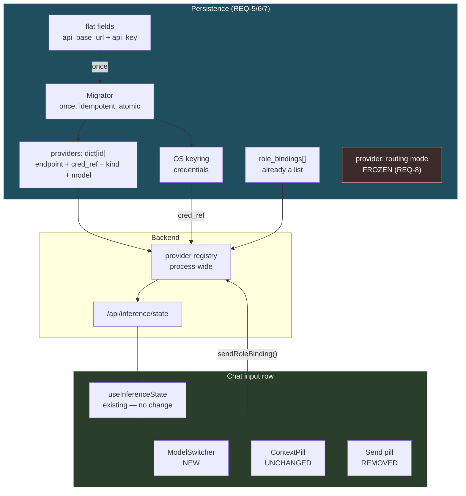
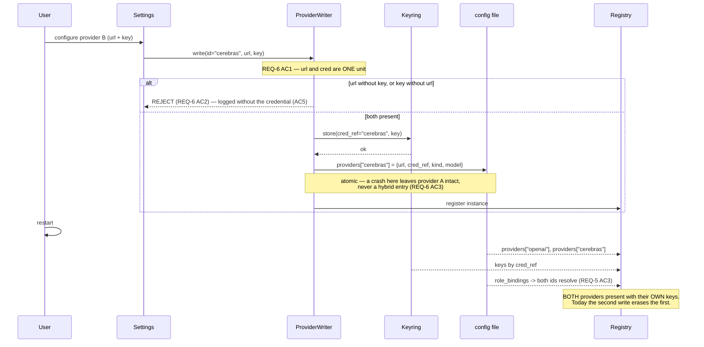

# Design: ContextPill Model Switcher + Provider Config Persistence

## Context

This spec is two changes that share a surface, and the order between them is the whole design.

The visible ask is a model switcher in the chat input row. The enabling change is that
`InferenceConfig` cannot currently store two providers: it holds one `api_base_url` and one
`api_key` ([`iris_config.py:192-193`](../../backend/iris_config.py)), while `role_bindings` is
already a persisted **list** ([`:230`](../../backend/iris_config.py)) that can reference several
providers. The registry holds them all in memory, so multi-provider works right up until restart.

**A switcher built on that storage would lie after every restart.** Persistence lands first.

The flat pair also makes a specific bad state reachable rather than merely possible. `api_base_url`
and `api_key` are separate fields with separate writers, and the `set_model_selection` payload
marks *both* optional ([`useInferenceState.ts:131-132`](../../hooks/useInferenceState.ts)). So
"write B's URL, leave A's key" is expressible today — and the result sends one vendor's secret to
another vendor's server. REQ-6 is a structural fix for that, not a validation rule bolted on top.

**Bounding constraints:**

| Constraint | Source | Consequence |
|---|---|---|
| ContextPill's design is kept | Decision Locked #1 | Switcher is a sibling component, never a new prop |
| Routing mode untouched | Decision Locked #7 / REQ-8 | `provider` field and its semantics are frozen |
| Keys in the OS keyring only | Project rule; REQ-5 AC4 | Config stores a reference, never a key |
| Existing installs must survive | REQ-7 | Migration is mandatory, idempotent, all-or-nothing |
| `loaded` status needed | `local-model-provider-parity` Wave 1 | Gates REQ-2 AC3 / REQ-4 only |
| No new endpoints | REQ-2 Verified | `useInferenceState` already has the data and the writer |

---

## Architecture Overview



Four properties this shape enforces:

1. **`MODE` has no edges.** Routing mode neither reads from nor writes to anything this spec
   changes. That is REQ-8 made structural instead of promised.
2. **Credentials reach the registry only via `cred_ref` → keyring.** No path carries a key through
   the config file or through `/api/inference/state`, so REQ-2 AC7 cannot be violated by adding a
   field somewhere.
3. **`MIG` is the only writer that reads `FLAT`.** Once migrated, the flat fields are dead. Nothing
   else consults them, so there is no second source of truth to drift.
4. **`SW` writes through the existing `sendRoleBinding`.** No new socket message, no new endpoint —
   the switcher is a second view onto plumbing that already works.

---

## Sequence: configuring a second provider, then restarting



The write order is keyring first, then config. Reversed, a crash between them leaves a config entry
whose `cred_ref` points at nothing — a provider that looks configured and cannot authenticate. In
this order the orphan is an unreferenced keyring entry, which is inert.

---

## Data Models

```python
@dataclass
class PersistedProvider:
    id: str              # "openai" | "cerebras" | "local:qwen3-9b" — the collection key
    label: str
    kind: str            # API | LOCAL_OPENAI | INPROCESS | OLLAMA (existing vocabulary)
    endpoint: str        # this provider's URL — never another's
    cred_ref: str        # keyring reference. NEVER the key itself (REQ-5 AC4)
    model: str
    purpose: str = "chat"   # from local-model-provider-parity REQ-2 AC3
```

`endpoint` and `cred_ref` live in the same record. That is the mechanism behind REQ-6: they are not
two fields two writers can update independently — they are one value written together.

```python
@dataclass
class InferenceConfig:
    provider: str = "api"          # ROUTING MODE — FROZEN (REQ-8 AC1)
    providers: dict[str, PersistedProvider] = field(default_factory=dict)
    #   ^ THE SINGLE COLLECTION. Introduced by local-model-provider-parity T1.4 with
    #     local entries; this spec adds API entries to the SAME dict (C1).
    role_bindings: list = field(default_factory=list)                        # unchanged
    config_version: int = 2        # REQ-7 AC4 once-only marker
    # api_base_url / api_key   — read by THIS spec's migrator only, then dead
    # local_model_*            — migrated by local-model-provider-parity T1.4, NOT here
```

Local entries carry `model_path` / `profile` / `custom_params` / `purpose` and **no** `cred_ref` —
local providers are keyless and unmetered
([`provider.py:16-22`](../../backend/agent/inference/provider.py)). API entries carry
`endpoint` / `cred_ref`. One key space, one lookup, two entry shapes.

`config_version` is what makes migration once-only and idempotent. Detecting "has flat fields"
instead would re-run forever on a config that legitimately keeps them.

```typescript
// Frontend — additive to the existing Provider interface in useInferenceState.ts
interface Provider {
  id: string; label: string; kind: string; model: string;
  api_base_url?: string;
  has_key?: boolean;    // boolean ONLY — never a key or a fragment (REQ-2 AC7)
  loaded?: boolean;     // from local-model-provider-parity Wave 1
  purpose?: string;     // chat models only are bindable (REQ-2 AC6)
}
```

---

## Key Decisions

### D-1: Persistence before UI

**Decision.** REQ-5..REQ-8 land before REQ-2's dropdown.

**Rationale.** The switcher's entire value is showing what is actually usable. On today's storage
it would show two providers, and after a restart one of them would be gone — the switcher would be
accurate about a lie. Shipping the UI first also makes the persistence bug *harder* to see, because
the in-memory registry keeps it working for the whole session in which anyone would test it.

### D-2: Endpoint and credential are one record, not one validation

**Decision.** `endpoint` and `cred_ref` are fields of the same `PersistedProvider`, written
together (REQ-6 AC1).

**Rationale.** A validation rule ("reject a URL write without a key") has to be applied at every
writer, and a new writer added later inherits nothing. Putting both in one record keyed by provider
id makes the mismatched pair *unrepresentable* — there is no `api_base_url` field for a writer to
touch on its own. This is the same reasoning as `local-model-provider-parity`'s single
`resolve_device_policy`: concentrate the decision so forgetting it is impossible rather than
discouraged.

**Rejected — keep the flat fields and validate on write.** Every existing writer stays able to
express the bad state; the guard is one forgotten call site away from useless. And the bad state is
the one that sends a key to the wrong vendor.

### D-3: Keyring write precedes config write

**Decision.** Store the credential, then write the config entry (REQ-5 AC4, REQ-6 AC3).

**Rationale.** Asymmetric failure. Config-then-keyring leaves an entry whose `cred_ref` resolves to
nothing — a provider that appears configured, is offered in the switcher, and fails at request
time. Keyring-then-config leaves an unreferenced keyring entry, which nothing reads and which the
next write for that id overwrites.

### D-4: Migration is all-or-nothing and version-marked

**Decision.** Migrate under `config_version`; on any failure leave the original untouched and
report (REQ-7 AC4/AC5).

**Rationale.** A partially migrated config is worse than an unmigrated one: some providers in the
collection, some still flat, and two sources of truth for the same provider. The edge case
"flat fields **and** a collection both present → the collection wins, flat is ignored, never
merged" follows from the same reasoning — merging is exactly how a URL acquires the wrong key.

### D-5: The switcher is a sibling of ContextPill

**Decision.** A new `ModelSwitcher` component beside `ContextPill`; `ContextPillProps` unchanged
(REQ-3 AC1).

**Rationale.** The user asked to keep the pill. Threading model state into it would make every
future switcher change a pill change, and the pill's layout is already tight — its `ACTION_CAP` of
24 chars exists because full phase words overflow `max-w-[160px]`
([`ContextPill.tsx:47-50`](../../components/chat/ContextPill.tsx)). Keeping them separate keeps
that budget stable.

**Layout note.** `ContextPill` currently renders inside a fixed `w-[32px] h-[32px]` container
alongside `ConversationChips` ([`chat-view.tsx:3347-3368`](../../components/chat-view.tsx)) while
the pill itself declares `max-w-[200px]`. The child already exceeds its container. Removing the
Send pill frees 32px plus a gap in this row; the layout work in T2.1 must resolve this existing
overflow rather than inherit it, or the switcher will be positioned against a container whose real
width nothing states.

### D-6: No new backend surface for switching

**Decision.** The switcher reads `useInferenceState` and writes through its existing
`sendRoleBinding` ([`:112-121`](../../hooks/useInferenceState.ts)).

**Rationale.** The hook already fetches `/api/inference/state`, already merges `iris:provider_added`
and `iris:role_bindings_updated`, and already exposes the writer. A new endpoint would be a second
path to the same state, and REQ-4 AC4 requires the switcher and the settings panel to agree — which
is free if they share one source and a standing risk if they do not.

### D-7: Availability is a boolean, all the way out

**Decision.** `has_key: boolean`; no key, no prefix, no length, no masked form crosses the API
boundary (REQ-2 AC7).

**Rationale.** `ModelInferenceSection.tsx:33` already types `has_key?: boolean`, so the pattern
exists and the switcher inherits it. A masked or truncated key is still a key fragment leaving the
backend, and the UI needs exactly one bit to decide whether to offer the provider.

---

## Ripple-Effect Map

| Area / File | Change? | Classification | Why / Evidence |
|---|---|---|---|
| `backend/iris_config.py` — `InferenceConfig` | **Yes** | CHANGE NEEDED | Gains `providers` collection + `config_version` (REQ-5 AC1). Flat fields retained for the migrator, then dead. |
| `backend/iris_config.py:187` — `provider` (routing mode) | **No** | **CONTRACT LOCK** | Frozen (REQ-8 AC1, **CT-P5**). Decision Locked #7. |
| `backend/iris_config.py:238` — `active_provider` alias | **No** | NO CHANGE (verified) | Alias fallback preserved (REQ-8 AC2). |
| `backend/iris_config.py:230` — `role_bindings` | **No** | NO CHANGE (verified) | Already a persisted list; it is the *provider* side that was flat. Entries must resolve post-migration (REQ-7 AC2). |
| `iris_config.from_dict` ([`:236-262`](../../backend/iris_config.py)) | **Yes** | CHANGE NEEDED | Reads the collection; invokes the migrator when `config_version < 2` (REQ-7). |
| Provider write path (`set_model_selection` handler) | **Yes** | CHANGE NEEDED | Writes `PersistedProvider` atomically; rejects mismatched pairs (REQ-6 AC1/AC2). |
| Keyring adapter | **Yes** | CHANGE NEEDED | Per-provider `cred_ref` instead of one key (REQ-5 AC4). |
| `backend/iris_config.py:195-211` — `lm_studio_url` / `ollama_url` | **No** | NO CHANGE (verified) | Behaviour unchanged for installs using them (REQ-8 AC4). Migrated into entries, not repurposed. |
| `local_model_*` flat fields ([`:201-211`](../../backend/iris_config.py)) | **Yes** | CHANGE NEEDED | Migrate to a local provider entry with a namespaced id (REQ-7 AC3), consistent with `local-model-provider-parity` REQ-2. |
| `/api/inference/state` payload | **Yes (additive)** | CHANGE NEEDED | Gains `loaded`, `purpose` (from `local-model-provider-parity` CT-L1). `has_key` **already exists** — emitted by `ProviderInstance.to_dict` ([`provider.py:65`](../../backend/agent/inference/provider.py)) — so it is NO CHANGE, not a new field. Additive; existing consumers unaffected (**CT-P1**). |
| `backend/agent/inference/provider.py:49-53` — keyring fallback | **No** | NO CHANGE (verified) | Already resolves credentials per provider id via `get_secret(self.id)`. REQ-5 AC4 wires to this; it does not replace it. |
| `ProviderInstance.api_key` ([`:42`](../../backend/agent/inference/provider.py)) | **No** | NO CHANGE (verified) | Per-instance field — the **registry already holds multiple providers' keys**. Only persistence is single-slot. |
| `InferenceConfig.providers` collection | **Yes (extend)** | CHANGE NEEDED | Introduced by `local-model-provider-parity` T1.4 with local entries; this spec **extends the same dict** with API entries. Not a second collection (**C1**). |
| `hooks/useInferenceState.ts` | **Yes (types only)** | CHANGE NEEDED | `Provider` interface gains the additive fields. Fetch, event merge, and `sendRoleBinding` are **unchanged** — verified at [`:47-121`](../../hooks/useInferenceState.ts). |
| `components/chat/ContextPill.tsx` | **No** | **CONTRACT LOCK** | `ContextPillProps` and visual design unchanged (**CT-P2**, REQ-3 AC1/AC2). |
| ContextPill's **displayed denominator** | **No code** | NO CHANGE (verified) — **behaviour shifts** | ⚠️ `local-model-provider-parity` REQ-5b reorders `resolve_context_window` so a loaded local model reports its **real** `n_ctx`. The pill sources `max_tokens` from that value via `iris:context_usage` ([`ContextPill.tsx:59-62`](../../components/chat/ContextPill.tsx)), so after that spec a 16k-loaded Mistral will show **16k, not 32k**. No code change here, and the number visibly changes. That is REQ-3 AC3 becoming *more* true — expect it, do not "fix" it. |
| `iris_gateway.py` `set_role_binding` handler | **No (this spec)** | NO CHANGE (verified) — **shared path** | ⚠️ The switcher writes through this exact handler via `sendRoleBinding` (D-6), and `local-model-provider-parity` REQ-3 AC3 **deletes its peer-kernel fan-out** ([`:8605-8618`](../../backend/iris_gateway.py)). If Wave 3 lands before that deletion completes, a switch may propagate inconsistently across kernels. CT-P4 pins the message shape, not the propagation. |
| `components/chat-view.tsx:3293-3310` | **Yes (delete)** | CHANGE NEEDED | Send pill removed (REQ-1 AC1). |
| `chat-view.tsx:1535`, `:3252` | **No** | NO CHANGE (verified) | `Enter` → `handleSendMessage` already exists in both handlers; sending survives the button's removal (REQ-1 AC2). |
| `handleSendMessage` ([`:1056`](../../components/chat-view.tsx)) | **Yes (guards)** | CHANGE NEEDED | The removed button carried `disabled={!inputText.trim() \|\| isTyping \|\| voiceState === 'listening'}` ([`:3296`](../../components/chat-view.tsx)). Those guards must move **into** the send path or they are deleted with the button (REQ-1 AC3). |
| `chat-view.tsx:3347-3368` — input row layout | **Yes** | CHANGE NEEDED | Reflow after removal; resolve the existing `w-[32px]` container / `max-w-[200px]` child overflow (D-5). |
| `components/ModelInferenceSection.tsx` | **No (this spec)** | **CONTRACT LOCK** | Consumes `providers[]` + `role_bindings[]`; already types `has_key?: boolean` ([`:33`](../../components/ModelInferenceSection.tsx)). Additive fields keep it working (**CT-P3**). ⚠️ `lfm25-encoder-integration` T2.4b **does** change it — adding the `purpose === "chat"` filter its unfiltered `providers.map()` ([`:80`](../../components/ModelInferenceSection.tsx)) currently lacks. CT-P3 must not assert the list is unfiltered. |
| `components/dark-glass-dashboard.tsx:1054`, `:1135` | **No** | NO CHANGE (verified) | Reads `role_bindings.find(r => r.role === 'reasoning')?.instance_id` with a `local_model_path` fallback — resolves correctly against migrated bindings. |
| `components/wheel-view/SidePanel.tsx:68` | **No** | NO CHANGE (verified) | Consumes the same hook; additive fields only. |
| Provider registry | **Yes** | CHANGE NEEDED | Hydrated from the collection at startup (REQ-4 AC5, REQ-5 AC5). |
| `backend/audio/*`, TTS | **No** | NO CHANGE (verified) | Not on any path this spec touches. |

---

## Error Handling

| Failure | Response |
|---|---|
| Endpoint written without its credential (or vice versa) | **Reject and report** (REQ-6 AC2). Log without the credential or any fragment (AC5). |
| Crash mid provider-write | Previous entry intact; never a hybrid (REQ-6 AC3). Keyring-first ordering makes the orphan inert (D-3). |
| Keyring unavailable | Provider **not** persisted; tell the user. Never fall back to writing the key into the config file (REQ-5 edge case). |
| Migration fails | Original config untouched, failure reported, app runs unmigrated (REQ-7 AC5). |
| Config file read-only | Same as above — report, do not lose the config. |
| Flat fields **and** collection both present | Collection wins; flat ignored, **never merged** (REQ-7 edge case, D-4). |
| Binding references an absent provider | Reported as a dangling binding, not silently dropped (REQ-5 AC3). |
| Binding fails at switch time | Surface the error; previous selection stays active (REQ-4 AC3). Never show the new one as active. |
| Local model unloaded while its entry is open | Selection fails visibly; never silently binds elsewhere (REQ-2 edge case). |
| No providers configured | Actionable empty state, not an empty dropdown (REQ-2 AC8). |
| Provider state still loading | Loading state, not an empty list — an empty list reads as "none configured". |
| Credential appears in a downstream error string | Redacted before logging (REQ-9 edge case). |

---

## Testing Strategy

```
backend/tests/unit/         migration, provider-write atomicity, cred pairing
backend/tests/contract/     config schema, payload shape, routing-mode freeze
backend/tests/behavioral/   two providers across a restart; switch end-to-end
__tests__/                  ModelSwitcher + input row (jest)
scripts/validate_provider_persistence.py   STANDING CDD HARNESS
```

### Unit

- `test_provider_collection.py` — two API providers with **different** keys persist and reload with
  their own credentials (REQ-5 AC2). The headline assertion; impossible today.
- `test_endpoint_cred_atomic.py` — a write setting an endpoint without its credential is
  **rejected**; a write setting a credential without its endpoint is **rejected**; an endpoint-only
  edit of an *existing* provider is **permitted** (REQ-6 AC1/AC2 + edge case). All three cases, so
  the rule is not over-applied into blocking legitimate edits.
- `test_no_cross_provider_credential.py` — a credential stored under id A is never used for a
  request to id B's endpoint (REQ-6 AC4). The bug this spec exists to make unrepresentable.
- `test_migration.py` — flat → collection preserves endpoint, key and model; `role_bindings` still
  resolve; running twice is a no-op; a mid-migration failure leaves the original intact
  (REQ-7 AC1/AC2/AC4/AC5).
- `test_migration_collection_wins.py` — flat **and** collection present → collection used, flat
  ignored, **not merged** (REQ-7 edge case).
- `test_no_key_in_config_file.py` — after any write, the config file bytes contain no credential
  (REQ-5 AC4). Asserted on the file, not on the object.

### Contract

| ID | Pins | Asserts |
|---|---|---|
| **CT-P1** | `/api/inference/state` payload | `id`/`label`/`kind`/`model`/`api_base_url`/`has_key` retained (`has_key` already exists, [`provider.py:65`](../../backend/agent/inference/provider.py)); `loaded`/`purpose` **additive**; **no** key or fragment present anywhere in the payload (REQ-2 AC7). Compatible with `local-model-provider-parity` CT-L1, which pins the same payload — this one adds the credential-absence assertion. |
| **CT-P2** | `ContextPillProps` | Unchanged — four props, same names and types (REQ-3 AC1). |
| **CT-P3** | `ModelInferenceSection` inputs | Still renders from `providers[]` + `role_bindings[]` unmodified (REQ-4 AC4). |
| **CT-P4** | `set_role_binding` message | Payload shape unchanged; the switcher uses the same message as settings (D-6). |
| **CT-P5** | Routing-mode freeze | `InferenceConfig.provider` field name, vocabulary, and the `active_provider` alias are unchanged (REQ-8 AC1/AC2). |
| **CT-P6** | Config schema | `providers` is keyed by id; every entry has both `endpoint` and `cred_ref`, and `cred_ref` is never a credential (REQ-5 AC1/AC4). |

### Behavioral

- `test_two_providers_survive_restart.py` — configure two API providers with different keys, bind
  Brain to one and Tool to the other, restart, assert **both** resolve with their **own**
  credentials (REQ-5 AC2, REQ-4 AC5). **Fails today**; this is the spec's acceptance evidence.
- `test_second_provider_does_not_erase_first.py` — configure A, configure B, assert A's key is
  still retrievable **without** a restart. Isolates the storage bug from the reload path — today
  the in-memory registry masks it for the whole session.
- `test_upgrade_preserves_existing_provider.py` — start from a real pre-upgrade config, upgrade,
  assert the provider is present, bound, and needs no key re-entry (REQ-7 AC6).
- `test_routing_mode_unchanged.py` — for each `provider` value (`api`, `lm_studio`, `ollama`,
  `iris_local`), the same backend serves the request before and after this spec (REQ-8 AC3).
  Parametrized over all four — dropping one is a test modification.
- `__tests__/ModelSwitcher.test.tsx` — lists only keyed API providers and loaded local models
  (REQ-2 AC2/AC3); selection calls `sendRoleBinding`; a failed bind leaves the previous selection
  active (REQ-4 AC3); empty state when nothing is configured (AC8).
- `__tests__/InputRow.test.tsx` — Send pill absent; `Enter` sends; `Shift+Enter` newlines; the
  removed button's disabled conditions still block a send (REQ-1 AC2/AC3). The guard assertion is
  the one that matters — it is what the deletion silently drops.

### Intertwined

| Real defect | Behavioral test | Contract decomposition |
|---|---|---|
| Single flat `api_key` (`iris_config.py:192-193`) | `test_two_providers_survive_restart` | **CT-P6** |
| Second provider erases the first (masked in-session) | `test_second_provider_does_not_erase_first` | `test_provider_collection` |
| URL/key written independently (`useInferenceState.ts:131-132`) | — | `test_endpoint_cred_atomic`, `test_no_cross_provider_credential` |
| Existing installs would lose their provider | `test_upgrade_preserves_existing_provider` | `test_migration` |
| Send removal drops its disabled guards (`:3296`) | `__tests__/InputRow.test.tsx` | — |
| Routing mode changed as a side effect | `test_routing_mode_unchanged` | **CT-P5** |
| Key leaking to the frontend | — | **CT-P1**, `test_no_key_in_config_file` |

### Standing CDD harness

`scripts/validate_provider_persistence.py` asserts on every run:

1. CT-P1..CT-P6 hold.
2. Two providers with different keys round-trip through config + keyring with their own credentials.
3. No config file written by any path contains a credential or a fragment of one.
4. No `/api/inference/state` response contains a credential or a fragment of one.
5. Every persisted entry has **both** `endpoint` and `cred_ref`; a fixture missing one is rejected.
6. A synthetic pre-upgrade config migrates with bindings intact, and migrating twice is a no-op.
7. Routing mode resolves identically for all four `provider` values, before and after.
8. `ContextPillProps` is unchanged.

Assertions 3 and 4 are the ones worth running on every commit regardless of what changed — a
credential leak is the failure here that no user would report, because nothing about it is visible
from the app.
