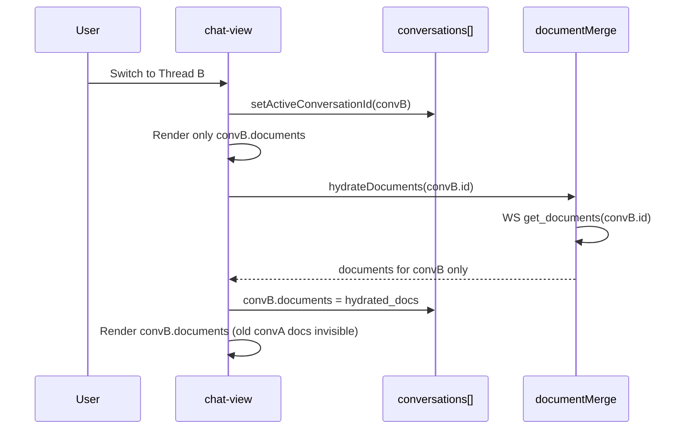
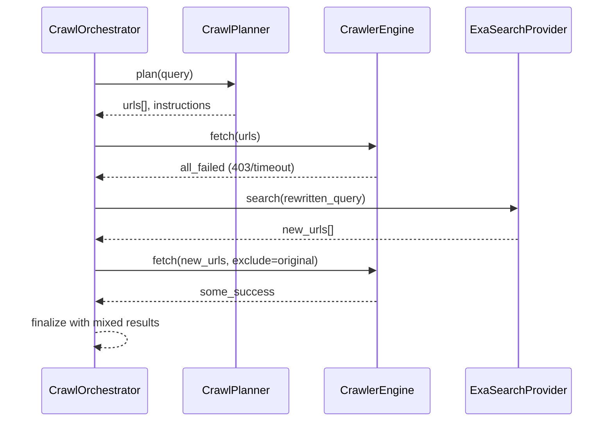
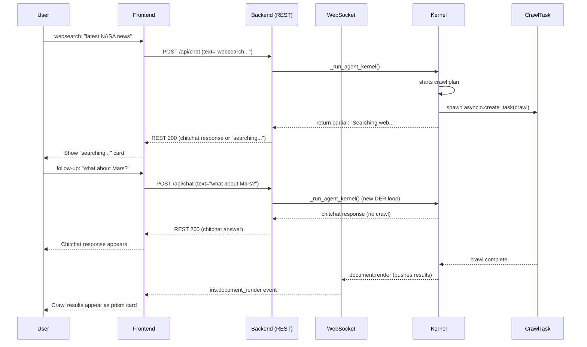

# Design: Cross-Thread Document Isolation + Crawl Reliability

## Context
Session 166 live testing revealed two blocking issues:
1. Frontend renders all documents in a single flat array (`renderedDocuments`) shared across all conversations — no thread isolation.
2. Crawl4AI gets blocked by bot detection (403 from nasa.gov, timeouts) due to basic user-agent. No retry with additional URLs when first batch fails.

## Architecture Overview

```mermaid
graph TB
    subgraph Frontend
        CV[chat-view.tsx] --> CS[conversations state]
        CS --> |conv1.docs| D1[DocRender[]]
        CS --> |conv2.docs| D2[DocRender[]]
        CS --> |conv3.docs| D3[DocRender[]]
        CV --> DM[documentMerge.ts]
        DM --> |hydrate| D2
        DM --> |render| PR[PrismCard]
    end
    subgraph Backend
        OG[orchestrator.py] --> CP[crawl_planner.py]
        CP --> |URLs| CE[crawler_engine.py]
        CE --> |blocked| RETRY{Retry?}
        RETRY --> |yes| EXA[exa.py]
        RETRY --> |no| ERR[Error Result]
        EXA --> |new URLs| CE
        CE --> |success| PASS[Passages]
    end
```

## Sequence: Document Isolation



## Sequence: Crawl Retry with Exa



## Sequence: Follow-Up During Active Crawl



## Data Models

### Frontend Conversation (modified)
```typescript
interface Conversation {
  id: string
  title: string
  lastMessage: string
  createdAt: number
  messages: Message[]
  documents: DocRender[]  // NEW — per-conversation documents
}
```

### DocRender (existing, unchanged)
```typescript
interface DocRender {
  document_id: string
  format: string
  title: string
  content: string
  data: Record<string, unknown>
}
```

### CrawlerEngine stealth config (new)
```python
STEALTH_USER_AGENTS = [
    "Mozilla/5.0 (Windows NT 10.0; Win64; x64) AppleWebKit/537.36 (KHTML, like Gecko) Chrome/131.0.0.0 Safari/537.36",
    "Mozilla/5.0 (Macintosh; Intel Mac OS X 10_15_7) AppleWebKit/537.36 (KHTML, like Gecko) Chrome/131.0.0.0 Safari/537.36",
    "Mozilla/5.0 (Windows NT 10.0; Win64; x64; rv:133.0) Gecko/20100101 Firefox/133.0",
    "Mozilla/5.0 (X11; Linux x86_64) AppleWebKit/537.36 (KHTML, like Gecko) Chrome/131.0.0.0 Safari/537.36",
]
```

## Key Decisions

### D1: Per-conversation documents in state (not a separate store)
**Decision:** Store `documents: DocRender[]` inside each conversation object.
**Rationale:** Matches how `messages: Message[]` already works. No new state management needed. Documents persist naturally in localStorage with the conversation.
**Alternatives rejected:**
- Separate `renderedDocuments` map keyed by conversation_id → more state, harder to persist.
- Backend-only scoping → frontend still needs to know which documents belong to which thread for display.

### D2: Headless Chromium browser, not just headers
**Decision:** Use crawl4ai's headless Chromium with realistic browser fingerprint. Start lightweight (headers + user-agent rotation), escalate to full stealth if needed.
**Rationale:** Many sites check for real browser behavior (JS execution, cookie handling, Sec-Fetch headers) not just User-Agent string. A real headless browser passes most checks. crawl4ai already launches Chromium — we just need to configure it correctly.
**Alternatives rejected:**
- User-agent string only → insufficient for sites that check browser fingerprint.
- Playwright standalone → crawl4ai already wraps Chromium, no need for extra dependency.

### D3: Single retry with rewritten query, not multiple retries
**Decision:** Cap at 1 retry (2 total attempts) with a broader query.
**Rationale:** Multiple retries increase latency. A single retry with a broader query covers the common case (narrow query → no results → broader query → results).
**Alternatives rejected:**
- Exponential backoff → wrong pattern for search (retries same query).
- Unlimited retries → latency explosion, user frustration.

### D4: Websearch-specific TaskListCard, not "thinking..."
**Decision:** During websearch, show a dedicated websearch card with a search icon/spinner instead of the generic "thinking..." indicator. The "thinking..." text is reserved for normal chitchat/LLM-only responses.
**Rationale:** Users reported confusion — they couldn't tell if the system was thinking about a chitchat answer or actively crawling the web. A distinct visual differentiates the two states at a glance.
**Alternatives rejected:**
- Reusing "thinking..." with different text → visually identical, still confusing.
- No indicator at all → users don't know if the system is working.

### D5: Background crawl via asyncio.create_task, not a separate worker
**Decision:** Spawn the crawl as `asyncio.create_task()` within the same process, not in a separate worker thread or process.
**Rationale:** The crawl is already async (crawl4ai uses asyncio). Spawning it in-process avoids serialization overhead, shared state issues, and process management. The per-conversation `asyncio.Lock` prevents race conditions.
**Alternatives rejected:**
- Separate worker process → heavy, adds serialization, shared state complexity.
- Thread pool → Python GIL-limited, crawl4ai is already async.

## Ripple-Effect Map

| Area / File | Change? | Classification | Why / Evidence |
|---|---|---|---|
| `components/chat-view.tsx` (conversation state) | Yes | CHANGE NEEDED | Move `renderedDocuments: DocRender[]` into per-conversation objects (line 119-128, 219) |
| `components/chat-view.tsx` (document:render handler) | Yes | CHANGE NEEDED | Extract `conversation_id` from payload detail (not currently destructured at line 522-533). Append to `conversations[idx].documents` |
| `components/chat-view.tsx` (conversation switch) | Yes | CHANGE NEEDED | Render only active conversation's documents (currently renders ALL from flat array at line 2630) |
| `components/chat-view.tsx` (localStorage persistence) | Yes | CHANGE NEEDED | Persist `documents` array inside each conversation entry alongside `messages` |
| `components/chat-view.tsx` (duplicate detection) | Yes | CHANGE NEEDED | Line 1094: `renderedDocumentsRef.current.some(d => d.turnId === turnId)` must check per-conversation, not global ref |
| `components/chat-view.tsx` (expanded doc lookup) | Yes | CHANGE NEEDED | Line 2888: `renderedDocuments.find(d => d.id === expandedDocId)` must check within active conversation |
| `lib/documentMerge.ts` | Yes | CHANGE NEEDED | `mergeRenderedDocuments` must accept `conversationId` context and merge into correct conversation's documents |
| `hooks/useIRISWebSocket.ts` (task event dispatch) | No | NO CHANGE (verified) | Already dispatches `iris:task_update` with full payload including `conversation_id` at line 1361-1370 |
| `hooks/useTaskProgress.ts` | Yes | INVESTIGATE NEEDED | TaskListCard not showing. May need debug logging to verify event reception. Currently no `conversation_id` filter — OK for now but verify events arrive |
| `backend/crawler/crawler_engine.py` | Yes | CHANGE NEEDED | Add headless Chromium `BrowserConfig` with real user-agent, viewport, browser headers (line 138-141). Add user-agent rotation and retry-on-403 |
| `backend/crawler/orchestrator.py` | Yes | CHANGE NEEDED | Add retry-with-Exa flow when all crawl URLs fail (around line 184-187). Add query rewriting for broader search on retry |
| `backend/crawler/search_providers/exa.py` | No | NO CHANGE (verified) | `ExaSearchProvider.search()` already accepts query strings and returns URLs — no changes needed |
| `backend/crawler/crawl_planner.py` | No | NO CHANGE (verified) | `plan()` already generates URLs from LLM — retry uses Exa, not LLM |
| `backend/agent/agent_kernel.py` | No | NO CHANGE (verified) | `DOCUMENT_RENDER` already includes `conversation_id` in payload (line 3065). No changes needed |
| `backend/agent/ws_event_bridge.py` | No | NO CHANGE (verified) | Broadcasts all events to WS client. No `conversation_id` filter — OK for now since `useTaskProgress` doesn't filter either |
| `backend/agent/document_store.py` | No | NO CHANGE (verified) | Already has `conversation_id` column and `list_for_conversation()` method |
| `backend/iris_gateway.py` (get_documents handler) | No | NO CHANGE (verified) | Already filters by `conversation_id` (line 8234-8286) |
| `backend/iris_gateway.py` (document:render) | No | CONTRACT LOCK | Event shape unchanged; backend already sends `conversation_id` |
| Backend→Frontend WS protocol | No | CONTRACT LOCK | No event shape changes across all three features |
| TaskListCard component | Yes | INVESTIGATE NEEDED + CHANGE | TaskListCard renders at line 2697. Root cause of invisibility: see REQ-6 audit. Fix may involve debug logging + ensuring `task:start` arrives before REST response |
| `backend/agent/tool_bridge.py` (narration) | Yes | CHANGE NEEDED | `_NARRATION_COOLDOWN_S` 8s → 25s. Replace "Fetched page N of M — host" with conversational phrasing using title+snippet (REQ-8) |
| `backend/agent/narration.py` (heartbeat) | Yes | CHANGE NEEDED | `_HEARTBEAT_INTERVAL_S` 12s → removal or integration with actual page findings. Replace "Still researching the web." with meaningful progress (REQ-8) |
| `backend/crawler/orchestrator.py` (page emitter) | Yes | CHANGE NEEDED | Add `title` and `snippet` to `CRAWLER_PAGE_FETCHED` payload (currently only url/page_number/total/host at line 275-281) |
| `backend/crawler/crawler_engine.py` (title extraction) | No | NO CHANGE (verified) | Title already extracted in metadata at line 245. Just needs to be threaded through the event |
| `backend/iris_gateway.py` (page fetched handler) | No | CONTRACT LOCK | `CRAWLER_PAGE_FETCHED` payload shape expands (adds title+snippet). Existing consumers must tolerate new fields |
| `backend/api/chat.py` | Yes | CHANGE NEEDED | Spawn crawl as `asyncio.create_task()` in background instead of blocking on full DER loop. Return partial REST response (REQ-9) |
| `backend/agent/agent_kernel.py` | Yes | CHANGE NEEDED | Add per-conversation `asyncio.Lock` to prevent concurrent kernel execution for same conversation_id. Add method to run crawl as background task (REQ-9) |
| `backend/iris_gateway.py` (crawl results) | Yes | CHANGE NEEDED | When background crawl completes, push `document:render` via WebSocket to the conversation's client (REQ-9) |
| EventBus / WSEventBridge | No | CONTRACT LOCK | Already handles async events. Crawl results pushed via same mechanism |

## Error Handling

| Failure | EARS Response |
|---|---|---|
| BrowserConfig stealth not supported by crawl4ai version | IF crawl4ai version < 0.4 THEN THE SYSTEM SHALL fall back to basic BrowserConfig and log a warning. |
| All user-agents blocked by target site | IF all retries return 403 THEN THE SYSTEM SHALL record failure in HAR and return CrawlResult.error. |
| Exa API rate limited on retry | IF Exa returns 429 THEN THE SYSTEM SHALL respect Retry-After or fall back to error after 10s. |
| localStorage quota exceeded | IF localStorage.setItem throws QUOTA_EXCEEDED THEN THE SYSTEM SHALL log warning and continue (documents lost on refresh). |
| Conversation documents array undefined (migration) | IF conversation.documents is undefined THEN THE SYSTEM SHALL default to empty array. |
| User sends message while kernel locked by active crawl | IF kernel lock is held THEN THE SYSTEM SHALL wait briefly (1s) then return "Crawl in progress, please wait" if lock doesn't release. |
| Background crawl task cancelled or crashed | IF crawl asyncio.Task raises unhandled exception THEN THE SYSTEM SHALL log error and notify user via WS: "Search encountered an error." |

## Testing Strategy

### Contract Tests
- `tests/contract/test_document_scope.py` — Verify document:render event appends only to active conversation.
- `tests/contract/test_conversation_documents_shape.py` — Verify Conversation interface includes `documents: DocRender[]`.

### Behavioral Tests
- `tests/behavioral/test_cross_thread_no_contamination.py` — Create documents in Thread A, switch to Thread B, verify Thread B shows no Thread A documents.
- `tests/behavioral/test_crawl_retry.py` — Mock crawl4ai to return 403 for all URLs, verify Exa retry fires with rewritten query, verify second batch succeeds.
- `tests/behavioral/test_tasklistcard_visibility.py` — Send websearch prompt, verify websearch TaskListCard appears within 5s with searching icon, verify it's visually distinct from "thinking...".
- `tests/behavioral/test_follow_up_during_crawl.py` — Send websearch, while crawl runs send chitchat, verify chitchat answered without blocking crawl completion.
- `tests/behavioral/test_crawl_lock_rejection.py` — Send two simultaneous websearch requests to same conversation, verify second is rejected with "Crawl in progress."

### Unit Tests
- `tests/unit/test_document_merge.py` — Test mergeRenderedDocuments with per-conversation scoping.
- `tests/unit/test_stealth_config.py` — Test user-agent rotation, header generation.
- `tests/unit/test_retry_logic.py` — Test URL deduplication between batches, retry cap enforcement.
