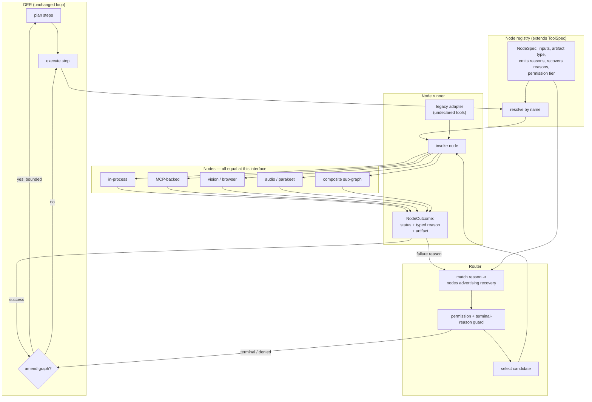

# Design: DAG Node Execution Model

## Context

The websearch feature was specified with interchangeable capabilities and delivered with
them wired behind a fixed funnel. Three symptoms followed, each needing a hand-written
branch: no escalation on a fresh bot-challenge, no pivot when the URL planner returned
nothing, and a retry that re-ran the same planner and failed identically. One structural
gap, three patches.

The gap is not missing infrastructure. IRIS already has:

| Piece | Where | State |
|---|---|---|
| Declarative action descriptors | `tool_registry.py:45 ToolSpec` | rich — executor, permission tier, parallel_safe, long_running |
| Registration | `tool_registry.py:99 register_tool` | works |
| Execution loop | `agent_kernel.py:5908 _execute_plan_der` | works |
| Node records + edges | `der_loop.py:70 NodeRecord`, `_der_finalize_step` | works |
| MCP backing | `mcp/builtin_servers.py`, `ToolSpec.executor="mcp"` | works |
| A second, parallel registry | `crawler/capabilities.py CAPABILITIES` | the pattern already being reinvented |
| A typed failure vocabulary | `crawler/usability.py UsabilityReason` | correct, but crawler-only |

What is missing is narrow and specific: **actions return results, not routable outcomes**,
and **composites are opaque**. Everything else this design needs already exists and should
be extended, not replaced.

Two constraints bound the work. `agent_kernel.py` is 12,291 lines with 117 test files
reaching into its internals (pin `pin_1bb97f28e137`), so a big-bang conversion is not
viable — adoption is strangler-fig with a kill switch. And this codebase has a documented
history of building mechanisms that are never called (19 instances found while delivering
the websearch spec), so every seam introduced here must be pinned by a caller-existence
test, not merely a unit test.

## Architecture Overview



The two edges that do not exist today are `OUT --failure reason--> MATCH` (REQ-4) and
`AM --> P` (REQ-5). Everything else is existing machinery reached through a new interface.

## Sequence / Data Flow

```mermaid
sequenceDiagram
    participant D as DER
    participant R as Node runner
    participant G as Router
    participant A as node: fetch.crawl
    participant B as node: fetch.vision
    participant L as Log / node records

    D->>R: run("fetch.crawl", {url, goal})
    R->>A: invoke
    A-->>R: NodeOutcome(FAILED, reason=CHALLENGE)
    R->>L: node outcome + reason
    R->>G: who recovers CHALLENGE?
    G->>G: terminal-reason guard (robots/permission = stop)
    G-->>R: fetch.vision (advertises CHALLENGE)
    R->>L: routing decision: reason, candidates, pick
    R->>B: invoke
    B-->>R: NodeOutcome(OK, artifact=page)
    R->>L: node outcome + edge crawl->vision
    R-->>D: OK (recovered)
    Note over D: no branch was written for this;<br/>the route came from advertisement
```

The identical flow, with no new code, covers "planner produced no URLs → a node advertising
`NO_CANDIDATES` runs a search-engine discovery" and "transcription produced no segments →
a node advertising `NO_SEGMENTS` runs a vision-based scene split."

## Data Models

```python
# backend/agent/nodes/outcome.py  (NEW — REQ-1)
class NodeStatus(str, Enum):
    OK       = "ok"
    PARTIAL  = "partial"     # produced something, not everything (REQ-1 AC4)
    FAILED   = "failed"
    REFUSED  = "refused"     # deliberate: robots, permission, policy — TERMINAL (REQ-4 AC4)
    UNAVAILABLE = "unavailable"   # backing service absent (REQ-6 AC5)

class Reason(str, Enum):
    """Closed vocabulary (REQ-1 AC3). Seeded from the crawler's proven set and
    widened only from measured need. Adding a member is a deliberate act."""
    NONE            = "none"
    EMPTY           = "empty"
    TOO_SHORT       = "too_short"
    CHALLENGE       = "challenge"
    TRANSPORT_ERROR = "transport_error"
    NO_CANDIDATES   = "no_candidates"     # nothing to work on (e.g. planner gave 0 URLs)
    WALL            = "wall"              # CAPTCHA / login / paywall -> park + ask
    ROBOTS_REFUSED  = "robots_refused"    # TERMINAL, never routed around
    PERMISSION_DENIED = "permission_denied"  # TERMINAL
    BUDGET_EXCEEDED = "budget_exceeded"
    UPSTREAM_ERROR  = "upstream_error"
    UNEXPECTED      = "unexpected"        # reserved for AC2 raise-conversion

@dataclass(frozen=True)
class NodeOutcome:
    status: NodeStatus
    reason: Reason = Reason.NONE
    detail: str = ""
    artifact: Optional["Artifact"] = None
    sub_outcomes: list["NodeOutcome"] = field(default_factory=list)  # REQ-3 AC2

@dataclass
class Artifact:
    """Passed by REFERENCE for large media (REQ-6 edge case) — never forces a
    video or audio file to be materialised into the graph."""
    kind: str          # "pages" | "text" | "audio_ref" | "video_ref" | "frames" | ...
    value: Any = None  # inline for small values
    ref: Optional[str] = None   # handle/path for large media


# backend/agent/nodes/spec.py  (NEW — REQ-2, extends ToolSpec rather than replacing it)
@dataclass
class NodeSpec:
    tool: "ToolSpec"                       # the existing descriptor, untouched
    consumes: tuple[str, ...] = ()         # artifact kinds accepted (REQ-6 AC2)
    produces: str = ""                     # artifact kind produced
    emits_reasons: frozenset[Reason] = frozenset()
    recovers_reasons: frozenset[Reason] = frozenset()   # REQ-4 AC1
    preference: int = 0                    # tie-break; higher wins (REQ-4 edge)
    composite_of: tuple[str, ...] = ()     # REQ-3 AC1
```

## Key Decisions

**D1 — Extend `ToolSpec`; do not create a third registry.** `NodeSpec` *wraps* `ToolSpec`
rather than duplicating its fields. `crawler/capabilities.py` already demonstrates what
happens otherwise: a parallel registry, its own lifecycle, and a second place for a node to
be "registered" but unreachable. REQ-2 AC4 retires that registry through this one.

**D2 — A closed `Reason` enum, seeded from the crawler's proven vocabulary.** Free-form
strings make routing undecidable and turn every policy question into substring matching.
`UsabilityReason` already works in production; this generalises it rather than inventing a
new taxonomy.

**D3 — Refusals are a *status*, not a failure reason to route around.** `REFUSED` plus
`ROBOTS_REFUSED` / `PERMISSION_DENIED` are structurally terminal. The websearch spec learned
this the hard way: escalating a robots.txt refusal to a browser node that does not consult
robots.txt would silently route around compliance for the exact URL just refused. Encoding
it in the type system means no future node author has to remember the rule.

**D4 — Routing is advertisement-based, not exception-based.** A node declares what it can
recover; the router matches. Nobody edits the failing node's module to add a recovery path.
This is the property that makes new pipelines compose without new dispatch code.

**D5 — Composites keep one outer outcome and record inner ones.** `crawler_query` stays a
single callable unit (REQ-3 AC4) so the existing UI card and callers are unchanged, while
its sub-outcomes become visible to the planner (AC2) and re-routable at a sub-node boundary
(AC3). This is what would have made all three websearch patches unnecessary.

**D6 — Amendment is planner-driven only.** A node proposing its own successor would
reintroduce exactly the hidden control flow this spec removes. The planner amends; nodes
only report.

**D7 — Large artifacts pass by reference.** Video and audio pipelines are an explicit
target. A contract forcing materialisation would make them unusable, so `Artifact.ref`
exists from the start rather than being retrofitted.

**D8 — A kill switch from day one.** REQ-7 AC4/AC5. Given the size of `agent_kernel.py` and
the number of tests reaching into it, the ability to return to today's behaviour in one
setting is the precondition for landing this incrementally.

## Ripple-Effect Map

| Area / File | Change? | Classification | Why / Evidence |
|---|---|---|---|
| `backend/agent/nodes/outcome.py` | Yes | CHANGE NEEDED | NEW — `NodeStatus`, `Reason`, `NodeOutcome`, `Artifact` (REQ-1). |
| `backend/agent/nodes/spec.py` | Yes | CHANGE NEEDED | NEW — `NodeSpec` wrapping `ToolSpec` (REQ-2). |
| `backend/agent/nodes/runner.py` | Yes | CHANGE NEEDED | NEW — invoke + legacy adapter + raise-to-outcome conversion (REQ-1 AC2, REQ-7 AC1). |
| `backend/agent/nodes/router.py` | Yes | CHANGE NEEDED | NEW — reason→candidate matching, terminal guard, bounds (REQ-4, REQ-8). |
| `backend/agent/tool_registry.py:45,99,250` | Yes | CHANGE NEEDED | Carry optional node metadata; `register_tool` accepts a `NodeSpec`. Existing fields and every existing registration stay valid (REQ-7 AC3). |
| `backend/agent/tool_bridge.py` | Yes | CHANGE NEEDED | Route execution through the runner when the tool declares node metadata; unchanged path otherwise. |
| `backend/agent/agent_kernel.py:5908 _execute_plan_der` | Yes | CHANGE NEEDED | Consume `NodeOutcome`; consult the router on failure; support bounded amendment (REQ-5). Smallest possible incision — this file is 12,291 lines. |
| `backend/agent/der_loop.py:70 NodeRecord` | No | CONTRACT LOCK | Record shape already carries what REQ-1 AC5 needs. CT-3 pins it so the outcome reason lands in the existing field rather than a parallel one. |
| `backend/agent/tool_decision.py` | Yes | CHANGE NEEDED | TOOL_DISPATCH must record the typed reason. Note the websearch spec already fixed a `success=True error_type=permanent` contradiction here — do not regress it. |
| `backend/crawler/capabilities.py` | Yes | CHANGE NEEDED | Express `fetch.crawl` / `fetch.vision` as `NodeSpec`s; retire the parallel registry (REQ-2 AC4). |
| `backend/crawler/usability.py` | No | NO CHANGE (verified) | `UsabilityReason` is the seed vocabulary for `Reason`; map at the boundary. The single-judge predicate stays exactly as CT-1 pins it. |
| `backend/crawler/orchestrator.py` | Yes | CHANGE NEEDED | `research()` becomes the reference composite (REQ-3 AC5). The hand-written escalation and discovery branches added in the websearch spec become *advertisements* and can then be deleted — that deletion is the proof this spec worked. |
| `backend/mcp/builtin_servers.py`, `backend/mcp/protocol.py` | No | NO CHANGE (verified) | `BuiltinServer._setup_tools` + `MCPTool` already describe MCP tools; `ToolSpec.executor="mcp"` + `mcp_server`/`mcp_tool` are the existing hook (REQ-6 AC4). |
| `backend/tools/vision_mcp_server.py` | No | NO CHANGE (verified) | Its five `vision.*` tools become nodes by registration alone. |
| `backend/vision/browser_session.py` | No | NO CHANGE (verified) | Already exposes navigate/click/type/scroll; becomes node-addressable without modification. |
| `backend/agent/tools/ask_user_tool.py` | No | NO CHANGE (verified) | Non-blocking park/ask already exists and is the correct handler for `Reason.WALL`. |
| `backend/agent/permissions.py` (tier evaluation) | No | CONTRACT LOCK | Tier semantics unchanged; CT-6 pins that a recovery node is evaluated identically (REQ-8 AC1/AC2). |
| Frontend | No | NO CHANGE (verified) | Composites keep one outer outcome (REQ-3 AC4), so card/event shapes are unchanged. |

## Error Handling

| Failure | Response |
|---|---|
| Node raises | Runner converts to `NodeOutcome(FAILED, UNEXPECTED)`; the task never dies (REQ-1 AC2). |
| Reason with no handler | Terminal for that branch, recorded, surfaced honestly (REQ-4 AC6). |
| Recovery node fails identically | Attempt bound makes the second identical failure terminal (REQ-4 AC3). |
| Cyclic advertisement | Same bound is the guard; the cycle is recorded. |
| Duplicate node name at registration | Fail loudly at startup — never shadow silently (REQ-2 edge). |
| MCP server down | Node registers/reports `UNAVAILABLE`; router routes around (REQ-6 AC5). |
| Amendment exceeds bound/budget | Refused, recorded, execution continues on the existing graph (REQ-5 AC5). |
| Amendment removes a consumed node | Rejected as invalid, recorded, no change. |
| Recovery needs a higher permission tier | Blocked and offered to the user; never taken silently (REQ-8 AC2/AC4). |
| Logging failure | Never propagates (REQ-9 AC5). |

## Testing Strategy

```
tests/unit/         pure logic: reason mapping, bound arithmetic
tests/contract/     boundary pins, including caller-existence pins
tests/behavioral/   full-loop graphs with real routing
scripts/validate_node_routing.py    standing CDD harness
```

**Contract tests:**

| ID | Pins |
|---|---|
| CT-1 | Every registered node returns a `NodeOutcome`; no node signals failure by raising (REQ-1 AC2). |
| CT-2 | `Reason` is closed — a node cannot emit an unregistered reason string. |
| CT-3 | The outcome reason reaches the existing `NodeRecord`, not a parallel structure (REQ-1 AC5). |
| CT-4 | **Caller-existence pins** — the router, the runner, and `NodeSpec` each have a real production caller, asserted by AST. This codebase produced 19 built-but-never-called mechanisms while delivering the websearch spec; every seam here gets this guard. |
| CT-5 | `REFUSED` / `ROBOTS_REFUSED` / `PERMISSION_DENIED` are never routed around (REQ-4 AC4, REQ-8 AC3). |
| CT-6 | A recovery node's permission tier is evaluated exactly as a planned node's, and cannot exceed the approved tier (REQ-8 AC1/AC2). |
| CT-7 | An undeclared legacy tool executes unchanged, and the kill switch restores pre-change behaviour byte-for-byte (REQ-7 AC1/AC4/AC5). |
| CT-8 | Duplicate node registration fails at startup rather than shadowing. |
| CT-9 | Composite keeps one outer outcome while recording sub-outcomes (REQ-3 AC2/AC4). |
| CT-10 | Large artifacts pass by reference — no video/audio materialised into the graph (REQ-6 edge). |

**Behavioral tests:**

| ID | Asserts |
|---|---|
| BT-1 | A `CHALLENGE` failure is recovered by a node advertising it, **with no branch written in the failing node's module** — the property the whole spec exists for. |
| BT-2 | A `NO_CANDIDATES` failure routes to a discovery node; the recovered URLs flow through the normal path. |
| BT-3 | A robots refusal is NOT recovered, even though a node capable of fetching it exists. |
| BT-4 | Recovery bound holds: a node failing identically twice is terminal, no loop. |
| BT-5 | Mid-execution amendment preserves completed work and never re-executes satisfied nodes (REQ-5 AC2). |
| BT-6 | A cross-modal graph runs end to end: audio → segments → vision → clip, composed purely by registration. |
| BT-7 | Kill switch off ⇒ behaviour identical to today on the same task. |
| BT-8 | The websearch composite reproduces its current tested behaviour through the node model — the escalation, discovery, and park paths still hold, now by advertisement rather than hand-written branches. |

**Intertwined:** BT-1's failure mode decomposes to CT-4 (the router was never called);
BT-3's to CT-5; BT-7's to CT-7. BT-8 shares fixtures with the websearch spec's existing
BT-11/BT-12 so the migration is proven against already-passing behaviour rather than new
assertions.

**Standing CDD harness:** `scripts/validate_node_routing.py` replays a fixed set of
failure→recovery trajectories (challenge→vision, no-candidates→discovery,
robots→terminal, budget→refused-amendment) through the real runner and router on every
run, asserting both the route taken and the routes correctly *not* taken.
