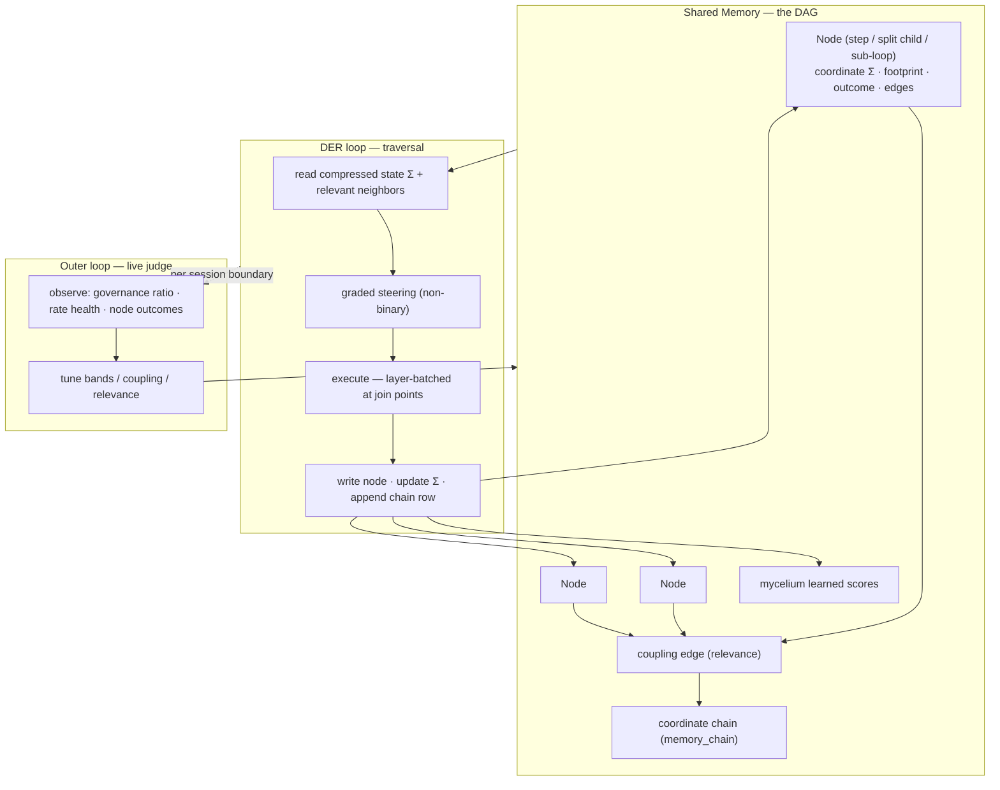
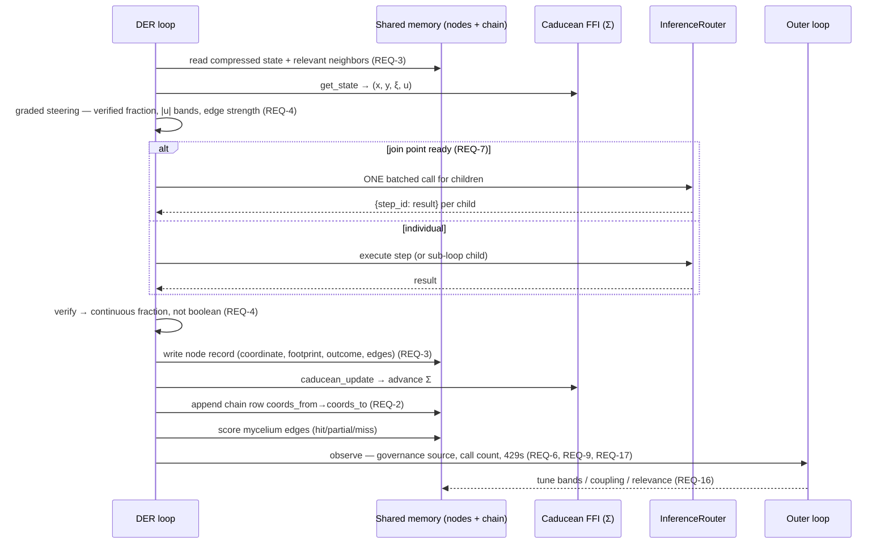

# Design: DER DAG-Inversion — Physics-Governed Execution, Memory-Backed DAG, and Integrity Repairs

## Context

DER was built as a hardcoded Director→Explorer→Reviewer pipeline over a flat queue, gated by binary checks and budgeted from a context window that silently collapses to 8192 when a stale `_model_provider` field is "uninitialized". The memory it is meant to build — a coordinate-addressed chain of branch nodes — writes zero rows because the live database's `memory_chain` table predates the coordinate schema and the durability queue swallows the mismatch. The system's own documented invariant is *"compress everything that happened into one honest current position, then let behavior be a pure reaction to that position"* (CADUCEAN_ARCHITECTURE.md §1) and its own design rule is *"prefer a continuous function of the physics signal over a threshold"* (§10.2). This design makes the execution loop honest to those two rules.

Constraints that bound the design:
- **Zero frontend regressions.** The frontend is wired to every step event (task_progress, tool events, crawler events, context:usage, TTS). Every event shape is contract-locked before behavior changes.
- **Baseline-first.** Wave 0 records the honest test baseline (known: 2006 passed / 148 failed / 17 skipped / 22 errors in the full backend run, largely order-dependent or unrelated; 3 frontend suites are pre-existing exploration fixtures).
- **The layering lives in memory, not in nested execution stacks.** Execution stays a queue-based traversal; what must exist is the node's memory record and its edges.
- **Demand-side rate fix.** Calls per turn drop via layer-batched execution and a synthesis diet; the AIMD ceiling is untouched.

## Architecture Overview

The loop is a traversal over a memory DAG. Every executed unit (step, split child, sub-loop, task) is a **node**: a work unit carrying a coordinate, a compressed footprint, an outcome, and edges. The Caducean FFI compresses all history into Σ = (x, y, ξ, u). Steering consumes the continuous signal (Σ + edge strength + verified fraction). Children of a join point execute as one batched call. The outer loop observes live signals and judges relevance/strength.



## Sequence / Data Flow

Per-step flow with graded steering, node write, and outer-loop observation:



## Data Models

**NodeRecord** (generalized SubLoopFootprint — REQ-3, typed per REQ-18):
```
node_id: str            # step_id or f"{parent}_s{i}"
layer: int              # depth_layer
parent_id: str | None
node_type: str          # task | step | sub_loop (REQ-18)
topic_domain: str       # mycelium DOMAIN_IDS registry value (REQ-18)
execution_domain: str   # voice | der | research — winding axis (REQ-18)
coords_from: str        # format_coords(x,y,ξ,u) before
coords_to: str          # format_coords(x,y,ξ,u) after
content_summary: str    # prior_summary / step insight (bounded bytes)
expected_output: str
ruled_out: str
outcome: str            # VERIFIED | UNVERIFIED | FAILED (label)
verified_fraction: float  # continuous, 0..1 (REQ-4)
edge_ids: list[str]     # coupling/relevance edges (REQ-5, REQ-19)
created_at: float
```

**memory_chain** (canonical coordinate schema — REQ-2):
```
chain_id, thread_id, result, coords_from, coords_to,
nbl_outcome, insight, file_path, landmark_id, created_at
```
Legacy tables (entry_id/sequence/role/content form) gain the coordinate columns via idempotent ALTER (REQ-12 AC2).

**BatchedCall** (REQ-7): `join_point` (parent step_id), `children` [{subloop id}], `batched_prompt` (per `<subloop id="…">…</subloop>`), `results: {step_id: text}` via parse_batched_response.

**NarrationPolicy** (REQ-13): `gate_interval_s`, `heartbeat_interval_s`, `page_cooldown_s`, `filler_cooldown_s`, `max_pending_per_10s`, `max_chars` — config-loaded, defaults equal today's literals.

**GovernanceLog** (REQ-6): `turn_id`, `decision_point`, `source` (memory | live | both), `signal_values` (u, ξ, edge strength, verified fraction), `ts`.

**LinkStore** (REQ-19): the existing mycelium link store (documents|references|implements|depends_on|contains|related_to over pin|landmark|episode|node) extended with `derives_from | part_of | relevant_to | failed_like`. DER parent/depends_on/sub-loop structure, failure-class links, and REQ-5 coupling edges all land here — one store, no second edge store.

**DomainRegistries** (REQ-18): `topic_domain` ← mycelium DOMAIN_IDS (13 topics, spaces.py); `execution_domain` ← request-domain manager (voice | der | research, der_constants.py). Unknown values resolve to the registry's general/unknown with a logged mismatch.

**PhysicsAggregate** (REQ-21): per execution_domain per session — `avg_u`, `oscillation_rate`, `convergence_rate`, `split_count`, `collapse_count`, `n`. Read-only signal consumed by the outer loop (REQ-16) and narration tuning (REQ-15).

## The Architecture in One Page (write the documentation from this)

Two graphs, not one. Confusing them is what makes loops fail to terminate.

**The execution DAG steps FORWARD.** A node runs, finishes, and freezes. Terminal nodes are immutable:
recovery never revives a dead parent, it spawns a NEW node with an edge from the frozen one — the
branch extends forward carrying what was learned. (This property is TRUE in the code today; REQ-24
locks it rather than building it.)

**The memory DAG couples OUTWARD.** A frozen node drops its compressed record into shared memory,
where it can connect over weeks to nodes from entirely different conversations. Execution terminates
because it only ever moves forward; learning accumulates because memory is free to connect sideways.
The earlier failure mode was asking the *active reasoning loop* to hold all of that lateral history —
which is what destroyed its ability to finish.

### The causal vocabulary (this is what a node records)

| Term | In this system | Who sets it |
|---|---|---|
| **Treatment** | `objective_anchor` — the goal handed to the node | the user / the parent |
| **Mediator** | the tool/action chosen + args hash (**REQ-23** — was missing) | **the agent — the only part it controls** |
| **Outcome** | `verified_label` / `verified_fraction` | the Reviewer |
| **Confounders** | Σ `(x, y, ξ, u)` + topology + injected contracts/PiNs | the world, and the state the node ran in |

The whole memory graph is one question asked over and over: *given this Treatment, under these
Confounders, which Mediator produces the best Outcome?*

**Why the Mediator is load-bearing.** It is the only variable the agent chooses, so it is the only
thing it can learn about. Recording state and outcome without the action yields a graph that knows
*that* something worked but never *what* — unrankable and unlearnable. This was the live gap: the
Wave-1 `NodeRecord` had Treatment, Outcome and Confounders, and no Mediator.

**How confounders are discovered (not guessed).** Watch for a mediator that succeeds in one
coordinate region and fails in another. The variance *reveals* the hidden variable — nobody has to
enumerate confounders in advance. This is why per-region scoring matters rather than one global score
per tool.

**How learning happens (the Bayesian loop).** Prior: `BehavioralPredictor` reads the graph and ranks
mediators for the current region. Observation: the node executes and freezes with its triple.
Update: the mycelium scorer moves that edge's weight *in that coordinate region* — the mechanism
already exists and is already coordinate-aware (`scorer.py` splits on hit/miss variance toward
`hit_center`/`miss_center`, condenses by coordinate distance). Posterior: next time in that region a
different mediator ranks highest. Nothing is hardcoded; the ranking moves because the evidence moved.

**Control without hardcoding.** Never force a mediator in the execution DAG — a forced tool cannot
teach you whether a better one existed. Enforce rules by injecting them as CONFOUNDERS (contracts,
PiNs) into the context; the Reviewer vetoes mediators that violate them. The agent still chooses, and
it chooses correctly because its state included the rule. This is the concrete form of the
Decisions-Locked prohibition: a hardcoded branch writes a biased node that is later recalled *as
evidence*, so the bias compounds.

**What a split is for.** When a node fails, the child's objective is to RESOLVE THE BLOCKER, not to
retry the parent's goal (REQ-4 AC4). The child folds back as a compressed observation that changes
the parent's state, and the parent re-decides with information it did not have. A child that restates
the parent's goal is a retry wearing a new id — it spends the budget twice and lands in the same
place, which is what the observed `s2_s0 → s2_s0_s0 → …` cascades were doing.

> DIAGNOSTIC NOTE, recorded so it is not re-litigated: the budget exhaustion actually observed on
> this system (`Token budget exhausted (4054/4000)`) was NOT caused by reverse-looping. It was the
> context window collapsing 256k→8192 (REQ-1), which set the budget to the 4000 floor; splitting then
> amplified a budget already 23× too small. The forward-only property was never violated.

## Key Decisions

- **D-1 Fix (a) for the budget collapse (REQ-1):** resolve the window from the InferenceRouter's active reasoning binding — one source of truth ("what model am I actually using"). Rejected: (b) legacy-field writing alone (leaves two sources of truth), (c) table additions alone (fails when provider is "uninitialized", the actual failure — cerebras/gemma-4-31b is already in the table).
- **D-2 Node landing first (REQ-2) is the foundation task.** Without rows in memory, there is no DAG, no coupling, no live-state input, no synthesis diet. Every other DAG requirement depends on it.
- **D-2a The store is `data/memory.db` and nothing else.** The live probe found THREE schemas across THREE databases: the configured app store (`data/memory.db`) holds a LEGACY `memory_chain` with 1825 rows; the CORRECT coordinate-shaped table sits in `backend/data/memory.db` with 0 rows and is never opened by the app; `.mcm/coordinates.db` is BUILD memory holding 4826 legacy rows and is explicitly out of bounds to the application path (backend/agent/memory.py:339–342). An orphan `memory_chain_v2` is a third shape in two DBs. The migration therefore targets the store named by `memory_config.json` `db_path` — migrating the others would repair a database nobody reads, or corrupt the build graph.
- **D-2b Node landing exists to enable FORGETTING (REQ-3 AC4–AC6).** The record is not an archive, it is permission to drop the tokens from the working context. Two resources stay distinct: the DER budget is a cumulative SPEND cap that pruning cannot refund, but a smaller per-step context is a smaller per-step debit, so forgetting buys THROUGHPUT — more steps inside the same budget. A node that landed and is still carried verbatim in the prompt has bought nothing, which is why REQ-3 AC5 requires the prompt token count per step to be measured, not asserted.
- **D-4a Coupling is decision-provenance, not auto-linking (REQ-5, rewritten).** Retrieval surfaces the candidate branches; the agent decides with them in view; the edge records that decision. An edge written purely by score is a node nobody decided — the biased-node contamination the Decisions Locked prohibition exists to prevent. Ranking is physics/evidence-driven; SELECTION is the agent's. This is also what makes REQ-5 falsifiable: candidate-surfacing coverage is measurable (AC4/AC5), whereas "edges form by relevance" was not.
- **D-4b REQ-5 AC5 target (T17b, measured 2026-08-07): candidate-surfacing coverage >= 0.8.** The measurement wave (real `_der_surface_branch_candidates` over a scenario spread) recorded coverage = 1.0 — every decision with ≥2 relevant branches saw ≥2 of them surfaced (surfacing surfaces ALL candidates up to DER_COUPLING_CANDIDATE_CAP=5). The target is set FROM that observed data minus a conservative margin (1.0 − 0.2 = 0.8), not guessed. A regression that silently pre-selects one candidate by score collapses coverage toward 0 when ≥2 existed and FAILS the contract (CT-ON2b) — the falsifiability AC5 requires. Denominator: the UNCAPPED total that existed (candidates_existed), so a capped 5-of-7 is measured as 5-of-7, never 5-of-5.
- **D-4b Recall is cross-conversation by default (REQ-20 AC1b, resolves OQ-2).** One shared store, Immortus 4D time labelling, Kyudo decay as the cleanup mechanism. Thread/session are ranking inputs, never hard filters — a hard filter would hide precisely the older branches REQ-5 requires the agent to see. Garbage tolerance is by design: REQ-10 challenge detection is justified by ANSWER quality (a challenge page must not be cited as a source or penalize the wrong domain), not by keeping the database clean.
- **D-3 Continuous over threshold everywhere (REQ-4).** Verified fraction is already continuous — consume it continuously. This is the architecture's own rule §10.2.
- **D-4 Coupling driven by compression/expansion (REQ-5).** Edge formation is physics-driven; no hand-authored relevance rules.
- **D-5 Inversion is measured, not coded (REQ-6).** We cannot "code" the alternation without reintroducing hardcoded authority; we instrument it and let the structure produce it. The governance ratio is the observable.
- **D-6 Batching is the rate fix (REQ-7), and it doubles as the layer mechanic** — a join point's children executing as one call is "the next layer executing its branches together." Phase manager stays FLAG-OFF (timing-only; would not cut calls).
- **D-7 Synthesis reads nodes, not history (REQ-8)** — the stateless-past principle applied to the final call: the past is compressed, so the final call consumes the compression.
- **D-8 der_steps is wired from len(completed_items) (REQ-12)** — the count already exists at agent_kernel.py:6290/6339/8726.
- **D-9 Narration measurement gate before any retune (REQ-15).** No threshold moves without the observed |u| distribution and the task-complete/phase-transition coincidence data. Ambient-only stays.
- **D-10 Outer loop gains real session-boundary call sites (REQ-16)** — production wiring, live observations, dead guards stay distinguishable (GuardResult.live semantics preserved).
- **D-11 Two domain axes, never free text (REQ-18).** topic_domain (recall) and execution_domain (physics) are separate registry-backed fields. The production "general" free-text state is the defect this requirement removes.
- **D-12 Reuse the link store, extend the vocabulary (REQ-19).** DER structure is a typed-relationship problem; the mycelium pin_links mechanism already exists and is queried. Extend it, don't build a second edge store.
- **D-13 Ontology doc first, query surface later (REQ-22, OQ-4).** The doc + CI version check make the schema trustworthy; the read-only surface is designed against a stable schema.

## Ripple-Effect Map (MANDATORY)

Every area the change reaches, classified with evidence. "NO CHANGE (verified)" cites proof; "CONTRACT LOCK" gets a CT-ID.

| Area / File | Change? | Classification | Why / Evidence |
|---|---|---|---|
| backend/agent/agent_kernel.py | Yes | CHANGE NEEDED | REQ-1 (window resolve + provider sync + landmine), REQ-2 (chain write), REQ-3 (step context), REQ-4 (steering), REQ-7 (batch wiring at 6985/8914), REQ-8 (synthesis 9827), REQ-12 (der_steps), REQ-14 (log async 9493), REQ-17 (telemetry) |
| backend/agent/inference/router.py | No code | CONTRACT LOCK (CT-B1) | resolve()/health_check_provider (:429–480) already expose the active binding — pin the getter contract so it cannot be removed |
| backend/agent/inference/transport.py | No | NO CHANGE (verified) | Retry-After clamp (:39–41, :99–137) and 3-attempt loop kept per REQ-9; debit-once semantics live at agent_kernel.py:8690, not here |
| backend/agent/rate_meter.py | Yes (minor) | CHANGE NEEDED | REQ-9 AC3 read-only health surface (get_ceiling/draw already exist — expose trajectory); ceilings untouched |
| backend/agent/batch_dispatch.py | Yes | CHANGE NEEDED | REQ-7 wire dispatch_batch into the DER loop (currently test-only); join_point, compose, parse all exist (:176–263) |
| backend/agent/der_loop.py | Yes | CHANGE NEEDED | REQ-4 graded reviewer verdicts (:620–654), REQ-6 governance source per decision; DirectorQueue readiness stays |
| backend/agent/tool_decision.py | Yes (minor) | CHANGE NEEDED | REQ-7 sub-loop children skip per-child resolve when batched; ToolDecisionBox stays for non-subloop steps |
| backend/agent/der_constants.py | Yes | CHANGE NEEDED | REQ-4 graded helpers, REQ-15 band retune target (U_SPLIT/U_CONVERGED :233/:246); floor 4000 and fractions unchanged (REQ-1 keeps) |
| backend/agent/caducean_trajectory.py | Yes | CHANGE NEEDED | REQ-12 AC2 legacy ALTER migration (:41–56, :117–119 pattern); REQ-16 record_session_exit wiring (:402–463) |
| backend/agent/outer_loop.py | Yes | CHANGE NEEDED | REQ-16 production call sites; _score_with_liveness semantics preserved (:150–234); GuardResult.live untouched |
| backend/memory/mycelium/interpreter.py | Yes | CHANGE NEEDED | REQ-12 AC1 BehavioralPredictor __init__ (:205) |
| backend/memory/mycelium/spaces.py | Yes (minor) | CHANGE NEEDED | REQ-18 topic registry source — DOMAIN_IDS (13 domains) reused as-is, no schema change |
| backend/memory/mycelium/interface.py | Yes | CHANGE NEEDED | REQ-19 link-store writes/reads for DER structure; REQ-20 recall filters (recall_decoder :464); REQ-21 aggregate reads |
| backend/memory/mycelium/extractor.py | Yes (minor) | CHANGE NEEDED | REQ-18 map free text → registry values at write time (:187–193 keyword patterns) |
| specs/der-dag-inversion/ontology.md | New | CHANGE NEEDED (new doc) | REQ-22 canonical ontology reference + CI version check against the live schema |
| backend/agent/explorer.py, backend/agent/evidence.py, backend/memory/live_context.py | Yes | CHANGE NEEDED | REQ-12 AC1 drop/accept the myc arg at :107/:69/:127; "…failed" logs at :118/:79 become impossible |
| backend/utils/observability.py | Yes | CHANGE NEEDED | REQ-12 AC3 der_steps assignment; REQ-6 governance fields; REQ-17 telemetry (:95–137) |
| backend/agent/narration.py | Yes | CHANGE NEEDED | REQ-13 config + unified gating (:212 gate, :105 heartbeat); REQ-14 async writes (:53–59) |
| backend/agent/tools/speak_tool.py | Yes (minor) | CHANGE NEEDED | REQ-13 policy from config (:29–31, :106–107); speak() emission contract unchanged |
| backend/agent/tool_bridge.py | Yes | CHANGE NEEDED | REQ-13 content dedup + config cooldown (:1893, :1956–1973); REQ-11 relay fields (:2569–2605) — see CT-C3 |
| backend/agent/agent_kernel.py (narration hook) | Yes | CHANGE NEEDED | REQ-14 async write (:9493–9529); REQ-15 measurement hooks (:9465–9540) |
| backend/crawler/crawler_engine.py | Yes | CHANGE NEEDED | REQ-10 interstitial detection (:370–381, :399–405); REQ-11 single emission authority |
| backend/crawler/crawl_runner.py | Yes | CHANGE NEEDED | REQ-10 detection in _plain_http_fetch (:374–482); REQ-11 no duplicate page-done (:448–455) |
| backend/crawler/orchestrator.py | Yes | CHANGE NEEDED | REQ-10 penalize 200-challenge (:426–453); REQ-11 OPEN_TAB url/job_id (:270–273), emitter dedup (:400–410) |
| backend/crawler/crawl_worker.py | No | NO CHANGE (verified) | emits progress via runner relay; dedup handled at orchestrator emitter |
| backend/crawler/source_registry.py | Yes | CHANGE NEEDED | REQ-10 challenge penalize path (:122–142) alongside 403/404 |
| backend/iris_gateway.py | Yes | CHANGE NEEDED | REQ-8 prepare_spoken_text live in streaming (:2714–2849); REQ-11 relay sets (:8917–8932); REQ-16 session-end hook |
| backend/memory/interface.py / backend/agent/memory.py | Yes | CHANGE NEEDED | REQ-16 call record_session_exit from real session end (memory.py:342 currently uncalled); REQ-2 chain init |
| backend/agent/ws_event_bridge.py | No code | CONTRACT LOCK (CT-C1) | forward-set must stay complete after OPEN_TAB payload change; UTTERANCE_START/DONE remain unbridged (ambient narration) |
| backend/agent/structured_response.py | No | NO CHANGE (verified) | speak/show split semantics unchanged (response path only) |
| backend/agent/verifier.py | No | NO CHANGE (verified) | SemanticVerifier continuous fraction already produced (:189); only its consumption changes (REQ-4) |
| backend/api/caducean_debug.py | Yes (minor) | CHANGE NEEDED | :222–226 reads resolver output — add active-binding display; existing fields stay |
| backend/main.py | Yes (minor) | CHANGE NEEDED | :960 sentinel getattr default stays as fallback; startup binding sync (REQ-1 AC2) |
| components/dark-glass-dashboard.tsx | Yes | CHANGE NEEDED | REQ-11 openTab guard (:572–592, :591): don't force active tab to a url-less dashboard tab unless data present; web-tab creation (:604–626, :773–790) untouched |
| hooks/useIRISWebSocket.ts | No | NO CHANGE (verified) | relays event payloads as-is (:1247–1303); OPEN_TAB payload extension is additive |
| hooks/useCrawl.ts | No | NO CHANGE (verified) | dedups by url (:101); server-side single-emission makes it a no-op safety net |
| hooks/useBrowserNavOverlay.ts, hooks/useActiveFrameSrc.ts | No | NO CHANGE (verified) | overlay reacts to existing event types; frame routing (:71–74) already returns undefined for non-web tabs |
| components/chat-view.tsx, ModelSwitcher.tsx, ContextPill | No | NO CHANGE (verified) | TTS highlight, context:usage events unchanged; budget-source change is internal |
| types/iris.ts | Yes | CHANGE NEEDED | REQ-11 OPEN_TAB payload type gains optional url/job_id (:128–137) |
| backend/tests/contract/* | Yes | CONTRACT LOCK | new CT-B1/B2 (budget), CT-N1/N2 (node landing), CT-C1/C2/C3 (crawler), CT-G1 (governance), CT-O1 (outer loop); existing CT-1..10/CU-1..8/I1..7/S1..5 must stay green |
| scripts/validate_*.py (10 harnesses) | Yes | CHANGE NEEDED | extend with node-landing, budget-source, dedup, governance-ratio, narration-trigger assertions (REQ-17, CDD standing) |
| tests/behavioral/test_param_ratchet_recovery.py | Yes | CHANGE NEEDED | legacy fixture (:168–172) updated to reflect migrated-schema reality or kept as explicit legacy-input case |
| Data: **data/memory.db** (configured store) | Yes | CHANGE NEEDED (migration) | REQ-2 AC3 — idempotent coordinate ALTER on the LEGACY memory_chain, preserving its 1825 rows (coords null for legacy rows; recall must tolerate). This is the ONLY database the app migrates |
| Data: backend/data/memory.db | No | NO CHANGE (verified) | Holds the correct coordinate shape with 0 rows but is NOT the configured store (memory_config.json db_path = data/memory.db). Do not migrate or write — it is a stray artifact; REQ-2 AC2 makes writing here a defect |
| Data: .mcm/coordinates.db | No (app) / offline only | OUT OF BOUNDS at runtime | BUILD memory, 4826 legacy rows. backend/agent/memory.py:339–342 explicitly forbids the app path from writing it (REQ-2 AC5). Schema parity for the promised inheritance is REQ-2b — a one-shot HUMAN-RUN offline migration, never at app start |
| Data: memory_chain_v2 (orphan, 0 rows, `data/memory.db` + `.mcm/coordinates.db`) | Yes | CHANGE NEEDED (resolve) | REQ-2 AC4 / OQ-5 — a third empty shape with no writer must be folded or dropped, not left to be written to by a future agent |
| data/memory_config.json | No code | CONTRACT LOCK (CT-N3) | `db_path` is the single source of truth for the store location; pin it so the chain writer cannot drift back to a hardcoded path |

## Error Handling

- **Chain write failure (REQ-2):** log step id + increment drop counter; the step itself never fails. Counter surfaces in REQ-17 telemetry.
- **Batched call parse failure (REQ-7):** fall back to individual child execution; no partial-loss silent state.
- **Unresolved context window (REQ-1):** tagged WARN naming provider+model+source, conservative default, telemetry marks source="default" so it is visible, not silent.
- **Challenge page (REQ-10):** not saved, source penalized once, logged with signature for tunability.
- **Narration log (REQ-14):** lossy-safe — never blocks or raises from the DER hot path.
- **Outer loop observation gaps (REQ-16):** GuardResult.live=False semantics preserved — dead guards report dead, they never pass silently.
- **Frontend event gaps:** every changed shape has a contract test; a missing field on the frontend side fails the contract before behavior.
- **Registry miss (REQ-18):** record general/unknown + log the mismatch; never invent free text.
- **Link target missing (REQ-19):** drop the link, keep the node write, log once.
- **Filtered recall empty (REQ-20):** widen scope one level at a time (relationship → type → domain); log the winning scope; never silently return zero.
- **Aggregation failure (REQ-21):** skip and log; never errors the turn.

## Testing Strategy

Organized per the standing CDD model — this system is ONE recursive operator at four scales; bugs live in the seams.

```
tests/unit/         pure logic: graded steering math, band retune, batched parse, challenge signatures
tests/contract/     boundary pins:
                      CT-B1 router active-binding getter contract (budget source)
                      CT-B2 unresolved window degrades loudly (source tag + WARN)
                      CT-N1 memory_chain row shape (coords_from/coords_to) per step
                      CT-N2 legacy memory_chain ALTER idempotence
                      CT-C1 ws_event_bridge forward-set completeness
                      CT-C2 OPEN_TAB payload carries url/job_id; relay sets pinned
                      CT-C3 CRAWLER_PAGE_FETCHED single emission per (job_id, page_number)
                      CT-G1 governance log shape (source ∈ memory|live|both)
                      CT-O1 outer loop fires at real session boundary
                      CT-ON1 node record carries node_type + both domain axes (REQ-18)
                      CT-ON2 link-store shape: parent/depends_on/failed_like with extended vocabulary (REQ-19)
                      CT-ON3 recall filter widen-order relationship → type → domain (REQ-20)
                      CT-ON4 per-domain aggregate exists after a session (REQ-21)
                      (existing CT-1..CT-10, CU-1..8, CT-I1..I7, CT-S1..S5 stay green)
tests/behavioral/   full-loop drives:
                      node landing: real task → ≥1 chain row per step
                      call-count: FULL-mode task with splits → ≥30% fewer calls vs Wave 0 baseline
                      no phantom tab: crawl end does not hijack the active tab without data
                      no duplicate page events on the merge path
                      narration: measurement gate output; retune-then-hear; explicit-trigger path
                      der_steps honesty in [LAYERS]
                      ontology: failed node found via failed_like walk; per-domain aggregate present; registry-miss logged
scripts/validate_der_*.py   standing CDD harness extended with the new assertions (REQ-17)
```

**Physics-aware:** inject Caducean u/ξ trajectories and assert system-level outcome — graded steering takes the mid-band path (REQ-4 AC2), coupling edges form on compression/expansion (REQ-5), narration fires on retuned bands or explicit triggers (REQ-15).

**Intertwined:** every behavioral gap found decomposes into the contract test that would have caught it (e.g., a duplicate page event found in behavioral → CT-C3 already exists).

**Wave 0 gate:** the honest baseline (2006/148/17/22 backend; 22/25 frontend suites) is recorded before any change; the 148 failures are triaged into order-dependent/standalone-real/stale classes with file:line notes, so a red run later is attributable.
