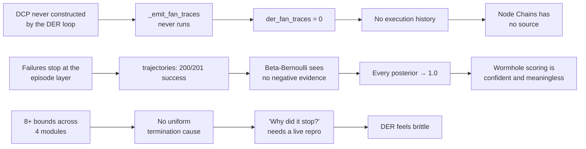
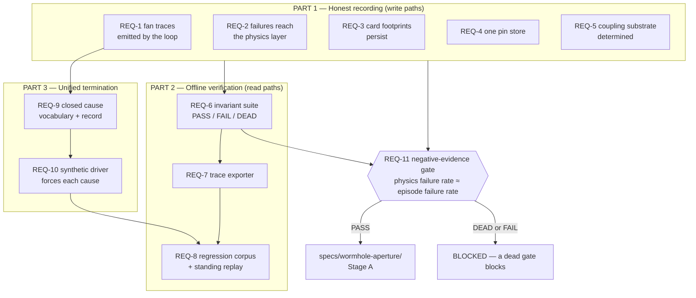
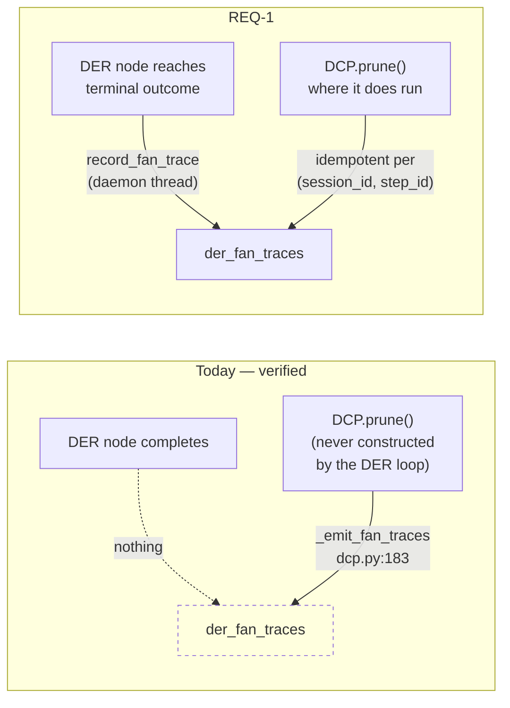

# Design: DER GROUND TRUTH

**Requirements:** `specs/der-ground-truth/requirements.md`
**Blocks:** `specs/wormhole-aperture/` gates G0 / G0b

---

## Context

This spec exists because a measurement contradicted an assumption. The application store
holds 201 physics trajectories of which 200 are successes, while the episode layer holds
55 failures out of 207 rows. Simultaneously the per-node execution trace table is empty,
the coordinate edge store is empty, the semantic store that backs card footprints and
crystallised skills is empty, and the pin table the pin store writes to is empty while a
differently-named one holds rows.

Every one of those is a WRITE-PATH problem, not a logic problem — which is good news,
because write-path problems are provable from a database and a unit test. That shapes the
whole design: **nothing here needs the application running.**

The constraint that drives every decision below is Decisions Locked 2 — offline-first
verification. The user's DER work is currently gated on manual developer-mode runs that
cost too much time. Removing that gate is the deliverable, not a convenience.

### The causal chain



The three chains are independent causes with one shared consequence: the system cannot be
improved from its own records, so every improvement costs a manual session.

---

## Architecture Overview

Three parts, each independently shippable, in dependency order.



**Part 1 must land before Part 2 is meaningful** — an invariant suite over empty tables
reports DEAD, which is correct but not useful. **Part 3 is independent of Parts 1–2** and
can be built in parallel; it only joins them at the corpus (REQ-8 AC1 wants traces of each
termination cause).

---

## Sequence / Data Flow

### The offline verification loop (what replaces manual testing)

```mermaid
sequenceDiagram
    autonumber
    participant DEV as Developer
    participant EXP as export_der_traces.py
    participant DB as data/memory.db (read-only)
    participant COR as traces corpus (committed)
    participant HAR as validate_der_*.py
    participant INV as validate_store_invariants.py

    Note over DEV: No application running. No GUI. No model.
    DEV->>EXP: --session <id> | --since <date> | --outcome failure
    EXP->>DB: read episodes / trajectories / fan traces / commits / exits
    DB-->>EXP: rows
    EXP->>EXP: build frames; redact user content (REQ-7 AC4)
    EXP-->>COR: trace.json (+ gap markers where records are incomplete)
    DEV->>HAR: replay corpus
    HAR->>COR: load every trace
    HAR-->>DEV: contract + behavior report, non-zero on break
    DEV->>INV: run against the LIVE store
    INV->>DB: invariant queries (read-only)
    INV-->>DEV: PASS / FAIL / DEAD per invariant, non-zero on FAIL or DEAD
    Note over DEV,INV: A newly observed defect is exported once<br/>and becomes a permanent regression guard.
```

### Fan-trace emission — before and after



The writer, the row shape, and the table are unchanged. Only the call site moves. That is
deliberate — it keeps the change reviewable and keeps `record_fan_trace`'s existing
failure handling (`caducean_trajectory.py:315`) intact.

---

## Data Models

### Termination cause (REQ-9) — a closed vocabulary

Follows the discipline of `NodeOutcome.Reason` (`backend/agent/nodes/outcome.py:40`):
enumerated, closed, with a reserved member for the unrecognised.

| cause | fired by | existing bound |
|---|---|---|
| `natural` | queue drained, all items complete | `DirectorQueue.is_complete` — `der_loop.py:698` |
| `sufficiency` | findings judged sufficient before grafting | `_der_findings_sufficient` — `agent_kernel.py:10103` |
| `cycle_cap` | cycle counter hit the cap | `DER_MAX_CYCLES=40` — `der_constants.py:199`, `hit_cycle_limit` `der_loop.py:707` |
| `token_budget` | mode token budget exhausted | `DER_TOKEN_BUDGETS` — `der_constants.py:83` |
| `turn_wallclock` | turn wall-clock expired | `_DER_TURN_BUDGET_S=600` — `agent_kernel.py:125` |
| `veto_cap` | reviewer vetoed one item past the cap | `DER_MAX_VETO_PER_ITEM=2` — `der_constants.py:196` |
| `graft_cap` | recovery grafts exhausted | `DER_MAX_GRAFTS=3` — `der_constants.py:197` |
| `depth_cap` | sub-loop depth exceeded | `MAX_DEPTH=3` — `der_constants.py:237` |
| `zero_yield` | consecutive zero-usable-page jobs | FAULTLINE §11 — `orchestrator.research()` |
| `permission_refused` | terminal permission outcome | `Reason.PERMISSION_DENIED` — `nodes/outcome.py` |
| `user_abort` | user cancelled | gateway |
| `unexpected` | reserved — unrecognised, counted, never discarded | REQ-9 AC6 |

Recorded per run alongside the bound's **configured** value and its **measured** value at
exit (REQ-9 AC3), so "how close was it" is answerable without a reproduction. Written to
the existing `caducean_session_exits` (415 rows today) rather than to a new table.

### Trace file (REQ-7) — the existing harness format, unchanged

`scripts/validate_der_cli_harness.py` already documents and consumes it: a JSON list of
frames with `task:start` / `task:progress` / `task:done` | `task:fail`, each carrying the
identity set (`card_id`, `card_relation`, `conversation_id`, `agent_id`, `project_id`).
The exporter targets this format exactly — it does not invent a second one. Two additions,
both additive and both ignorable by the current harness:

- `_schema_version` on the file, so a trace exported before a contract change is skipped
  with a REPORTED skip rather than misread (REQ-7 edge case).
- `_gap` markers where the stored record is incomplete, so a missing frame is visible as a
  gap rather than interpolated away (REQ-7 AC5).

### Invariant report (REQ-6)

```
INVARIANT                              RESULT   OFFENDING   EXAMPLE
failure_reconciliation                 FAIL     54          episode 3f2a…  (ep=55, traj=1)
every_step_has_fan_trace               DEAD     —           der_fan_traces is empty
commits_carry_verified_label           PASS     0
terminal_card_has_footprint            DEAD     —           semantic_entries is empty
pin_links_reference_existing_pins      FAIL     354         link 9c11…
run_records_termination_cause          DEAD     —           cause column absent
------------------------------------------------------------------
2 PASS · 2 FAIL · 3 DEAD → exit 1
```

**DEAD is not PASS.** An invariant whose input cannot be computed is reported dead and
exits non-zero, matching the `live` vs `passed` distinction that
`backend/agent/outer_loop.py:27-37` documents after a three-metric gate accepted on one
metric for months. This is the single most important design rule in the spec: an empty
table currently makes every assertion over it vacuously true, which is exactly how the
present state went unnoticed.

---

## Key Decisions

1. **Move the call site, not the contract (REQ-1).** `record_fan_trace`, its row shape,
   its table, and its error handling stay untouched. Rejected: rewriting emission into the
   DER loop with a new shape — it would make the diff unreviewable and lose the existing
   failure handling at `caducean_trajectory.py:315`.
2. **Determine before fixing (REQ-3 AC4, REQ-4 AC1, REQ-5 AC1).** For each empty store the
   spec requires establishing WHY it is empty — never called, called and failing, or
   writing elsewhere — before changing behaviour. Three empty tables with three different
   causes fixed by one guessed change is how a second round of silent breakage starts.
3. **DEAD blocks (REQ-6 AC2/AC3, REQ-11 AC5).** Applied uniformly to invariants and gates.
   This codebase has a documented instance of the opposite costing months.
4. **Record the bounds; do not add bounds (REQ-9 AC5).** Eight-plus termination controls
   already exist, each added reactively after an incident. Adding a ninth before the
   distribution of the existing eight is visible would be guessing. Rejected: a unified
   "smart" termination policy — that is a redesign, and it needs this spec's data first.
5. **Reuse `caducean_session_exits` for the termination cause.** 415 rows already exist;
   the exit record is real, it just lacks an enumerated cause. Rejected: a new
   `der_terminations` table — a second exit record would immediately diverge from the
   first.
6. **The exporter targets the existing harness format.** The consumer already exists and is
   documented. Rejected: a richer bespoke trace format — it would strand the nineteen
   harnesses already written.
7. **Redaction at export (REQ-7 AC4).** A corpus that carries conversation text cannot be
   committed, and an uncommittable corpus is not a regression suite. Redacting at the
   producer keeps the harnesses unchanged.
8. **The invariant suite runs against the LIVE store; the corpus runs in CI.** They are not
   substitutes (REQ-8 AC5). A corpus proves the code handles recorded history; only the
   live store proves today's recording is honest.

---

## Ripple-Effect Map (MANDATORY)

| Area / File | Change? | Classification | Why / Evidence |
|---|---|---|---|
| `backend/agent/caducean_trajectory.py:293` `record_fan_trace` | No | **CONTRACT LOCK (CT-GT-1)** | REQ-1 AC3 moves the call site only. Row shape and error handling (`:315`) stay |
| `backend/agent/dcp.py:152,183` `_emit_fan_traces` | Yes | CHANGE NEEDED | Becomes a secondary, idempotent emitter (REQ-1 AC5) instead of the sole one |
| `backend/agent/der_loop.py` node finalize site | Yes | CHANGE NEEDED | New primary emission point for REQ-1 AC1; must be off the critical path |
| `backend/agent/der_loop.py:698,707` `is_complete` / `hit_cycle_limit` | Yes | CHANGE NEEDED | Additive — each returns/records its termination cause (REQ-9 AC2) |
| `backend/agent/der_constants.py:196-237` | No | NO CHANGE (verified) | REQ-9 AC5 forbids adding or changing bounds. The constants are READ to populate the cause table's configured values |
| `backend/agent/agent_kernel.py:125` `_DER_TURN_BUDGET_S` | No | NO CHANGE (verified) | Read, not changed. It becomes the `turn_wallclock` cause's configured value |
| `backend/agent/agent_kernel.py:10103` `_der_findings_sufficient` | Yes | CHANGE NEEDED | Additive — records the `sufficiency` cause when it short-circuits. The gate's advisory-on-failure semantics (FAULTLINE §11) are preserved |
| `backend/agent/caducean_trajectory.py:226` `record` | No | NO CHANGE (verified) | Already takes `outcome` as a required parameter — REQ-2 is a CALL-SITE gap, not a recorder gap |
| `backend/agent/caducean_trajectory.py:484` `record_commit` | No | NO CHANGE (verified) | Already takes `verified_label`; REQ-2 AC2 is about reaching it on every path |
| `backend/agent/caducean_trajectory.py:518` `record_session_exit` | Yes | CHANGE NEEDED | Gains the enumerated cause + configured/measured values (REQ-9 AC3) |
| `backend/memory/card_footprint.py:37` `save_card_footprint` | Yes | CHANGE NEEDED | REQ-3 AC2 — keep never-raise, add a failure COUNTER so a persistent failure stops being silent (`:57-59` documents the silence) |
| `backend/memory/semantic.py:88` `semantic_entries` | No | NO CHANGE (verified) | The table and interface are fine; REQ-3 AC4 establishes why nothing reaches them before touching either |
| `backend/memory/pin_store.py:18,193,238` | Yes | CHANGE NEEDED | REQ-4 AC2 — point at the authoritative table once determined. CT-GT-2 pins the name afterwards |
| `backend/memory/mycelium/scorer.py:91,200` `EdgeScorer` | No | NO CHANGE (verified) | REQ-5 determines whether anything should call it. The code is sound; the question is whether it has callers |
| `backend/memory/db.py` schema | Possibly | CHANGE NEEDED (conditional) | Only if REQ-9 needs a column on `caducean_session_exits`. Additive, idempotent, guarded like the existing ALTER path at `:539` |
| `scripts/validate_der_cli_harness.py` | No | **CONTRACT LOCK (CT-GT-3)** | The trace format is the exporter's target (REQ-7 AC1). Its B-2 invariant (exactly one terminal frame) is extended by REQ-10 AC3, not replaced |
| `scripts/validate_der_integrity.py` and the other 18 harnesses | Yes | CHANGE NEEDED | Extended to consume the corpus (REQ-8 AC2). Existing assertions preserved |
| `scripts/export_der_traces.py` | Yes | NEW | REQ-7 |
| `scripts/validate_store_invariants.py` | Yes | NEW | REQ-6 |
| `tests/traces/` corpus | Yes | NEW | REQ-8. Committed, redacted, bounded |
| `backend/agent/tool_errors.py` | No | NO CHANGE (verified) | FAULTLINE's wall ledger and labels are read by REQ-9's `zero_yield` cause; nothing in the taxonomy changes |
| `backend/agent/outer_loop.py:27-37` | No | NO CHANGE (verified) | Its `live` vs `passed` distinction is the DESIGN PRECEDENT for REQ-6 AC2, not a target |
| `backend/agent/nodes/outcome.py:40` `Reason` | No | **CONTRACT LOCK (CT-1)** | REQ-9's vocabulary is a SEPARATE enum at the run level. Node-level reasons are not extended |
| `graph_edges` (997,262 rows) | No | NO CHANGE (out of scope) | MCM build-store data resident in the application DB. Documented by REQ-5 AC1, changed by nothing here |
| `specs/wormhole-aperture/` | Yes | CHANGE NEEDED | Its G0/G0b gates now point here; Decisions Locked 2 is revised pending REQ-5's determination |
| `hooks/useTaskProgress.ts:447-453` `sortSteps` | Yes | CHANGE NEEDED | REQ-17. Unnumbered rows collapse to `MAX_SAFE_INTEGER`; phase nodes are created without a key (`:908-920`) so they can never sort into sequence |
| `hooks/useTaskProgress.ts:952-958` phase-progress partial | Yes | CHANGE NEEDED | REQ-18. Advances `totalSteps` without recomputing `currentStep`; the same value feeds the orb badge denominator |
| `hooks/useTaskProgress.ts:72-76` `deriveCurrentStep` | Yes | CHANGE NEEDED | REQ-18 AC1. Index-based derivation is a third, independent notion of position |
| `hooks/useTaskProgress.ts:929-946` detail targeting | Yes | CHANGE NEEDED | REQ-21 AC2. Per-item detail lands only on the newest working phase node, leaving every other row blank |
| `hooks/useTaskProgress.ts:51,916-918` phase verb | No | **CONTRACT LOCK (CT-GT-9)** | `pin_587a3e612558` item 4 appears ALREADY FIXED — phase nodes carry `phase` and the verb derives from `PHASE_VERB[phase]`. Pin it so it cannot silently regress to keyword matching (REQ-21 AC5) |
| `backend/agent/agent_kernel.py:5066-5068` planner step_number | Yes | CHANGE NEEDED | REQ-17 AC2. The planner LLM self-reports `step_number` with a positional fallback — an untrusted source for render order |
| `backend/agent/agent_kernel.py:7756` graft numbering | Yes | CHANGE NEEDED | REQ-17 AC3. `len(completed_items)` can COLLIDE with a planner-assigned number |
| `__tests__/hooks/useTaskProgress.card-contract.test.tsx` | No | **CONTRACT LOCK (CT-GT-6)** | REQ-19 AC5 — the reducer suite is ADDITIVE-only. It is joined by an emitter contract, never weakened. Its traces become fixtures |
| `components/chat-view.tsx:183-212` `taskCardToMatrixProps` | Yes | CHANGE NEEDED | REQ-20 AC1. Pure function of a `TaskCard` — drops the ordering key and the progress pair on the way to the CLI |
| `lib/cli/CLITaskProgressRenderer.ts:62-87` row/card types | Yes | CHANGE NEEDED | REQ-20. `TaskStepItem` has no ordering key; `TaskCardProps` has no `currentStep`/`totalSteps` |
| `lib/cli/CLITaskProgressRenderer.ts:110-344` render internals | No | NO CHANGE (verified) | Width, Unicode, padding, right-wall closure are correct and covered by `__tests__/cli/CLITaskProgressRenderer{,.baseline}.test.ts`. This spec adds ordering and progress ABOVE them |
| `lib/cards/verbRegistry` | No | NO CHANGE (verified) | The shared-mapping PRECEDENT REQ-20 AC4 follows (design note T8a: GUI and CLI share one verb mapping, never two) |
| `components/chat/TaskListCard.tsx` | Yes | CHANGE NEEDED | REQ-18 AC3/REQ-21 — consumes the single derivation for counter, orb ring, and per-row summary. **No visual-language change** (REQ-21 AC6) |
| Frontend chassis / palette / Liquid Ink styling | No | NO CHANGE (verified) | REQ-21 AC6 explicitly excludes restyling. The aesthetic is not the defect |

**Ripple summary:** 12 CHANGE NEEDED · 9 NO CHANGE (verified) · 4 CONTRACT LOCK · 3 NEW files.

---

## Error Handling

| Failure | Response |
|---|---|
| Fan-trace write fails | THE SYSTEM SHALL log and continue; the node's execution is never blocked by its own observability (`caducean_trajectory.py:315` precedent) |
| Fan-trace emitted twice (loop + DCP) | THE SYSTEM SHALL upsert idempotently on `(session_id, step_id)` (REQ-1 AC5) |
| Node raises before producing an outcome | THE SYSTEM SHALL write a row with the reserved `unexpected` reason — a missing row and a failed row must never be indistinguishable |
| Footprint write fails persistently | THE SYSTEM SHALL keep never-raising AND increment a failure counter, so silence becomes a number (REQ-3 AC2) |
| Invariant input uncomputable | THE SYSTEM SHALL report **DEAD** and exit non-zero. Never PASS |
| Exporter finds an incomplete session | THE SYSTEM SHALL emit a `_gap` marker, never interpolate frames |
| Exporter produces an empty trace | THE SYSTEM SHALL exit non-zero with the reason; never write a silent empty file |
| Corpus trace invalid after an intentional contract change | THE SYSTEM SHALL require re-export and record the change; hand-editing a trace to pass is forbidden |
| Two bounds trip in the same cycle | THE SYSTEM SHALL record the one that stopped dispatch as the cause and the other as a co-occurring near-miss |
| Process exits without running its exit path | THE SYSTEM SHALL treat the absent cause as an invariant FAILURE (REQ-6 AC1), not as an untracked normal case |
| Corpus truncated by size bounds | THE SYSTEM SHALL log what was dropped and why. Silent truncation reads as full coverage |

---

## Testing Strategy

```
backend/tests/unit/         pure logic — cause classification, trace frame building,
                            redaction, idempotent upsert key
backend/tests/contract/     CT-GT-* boundary pins
backend/tests/behavioral/   BT-GT-* full-loop drives, headless
scripts/validate_store_invariants.py   LIVE-STORE invariant suite (REQ-6)
scripts/validate_der_*.py              STANDING HARNESSES, now corpus-driven (REQ-8)
```

### Contract tests

| ID | Pins |
|---|---|
| **CT-GT-1** | `record_fan_trace` row shape and signature unchanged; the new call site produces a byte-identical row to the DCP path |
| **CT-GT-2** | `PinStore` reads and writes the authoritative table, by name. Prevents a future edit re-splitting the two stores |
| **CT-GT-3** | The exported trace format matches what `validate_der_cli_harness.py` consumes; a round-trip export→replay preserves every identity key |
| **CT-GT-4** | The termination-cause enum is closed; an unrecognised cause maps to `unexpected` and is counted, never dropped |
| **CT-GT-5** | An invariant with uncomputable input reports DEAD, and DEAD exits non-zero |
| **CT-GT-6** | The EMITTER contract: ordering key present and unique, one terminal frame per `task:start`, no `stepNumber` collision, phase transitions carry `phase`+`phase_sequence`. Asserted on a trace independently of any renderer (REQ-19) |
| **CT-GT-7** | Counter numerator and denominator come from one derivation; numerator never exceeds denominator; the orb ring reads the same value (REQ-18) |
| **CT-GT-8** | The GUI-to-CLI adapter preserves the ordering key and the progress pair; GUI and CLI render the same sequence from one derivation (REQ-20) |
| **CT-GT-9** | Phase-node verbs derive from `PHASE_VERB[phase]`, never from description keywords — regression pin for `pin_587a3e612558` item 4 |
| **CT-1** | `NodeOutcome.Reason` unchanged — the run-level cause vocabulary is a separate enum |

### Behavioral tests (all headless — no app, no model, no network, no GUI)

| ID | Asserts |
|---|---|
| **BT-GT-1** | A DER run with no pruning whatsoever still writes one `der_fan_traces` row per executed node. **This is REQ-1's proof and the whole reason the table is empty today** |
| **BT-GT-2** | A run where DCP DOES fire writes each row exactly once, not twice |
| **BT-GT-3** | A failed step produces a failure trajectory row AND a FAILED commit label. Drive a genuine failure, not a mocked one |
| **BT-GT-4** | Episode-layer and physics-layer failure counts reconcile over a synthetic run set. **REQ-11's proof** |
| **BT-GT-5** | Each of the twelve termination causes can be forced deterministically, is recorded correctly, and finalises honestly — **a run stopped by a bound never reports success** |
| **BT-GT-6** | No termination path leaves a card without a terminal frame — the existing B-2 invariant extended across every cause |
| **BT-GT-7** | Export→replay round trip: a real recorded session exports, replays through the harness, and reproduces the same contract verdicts |
| **BT-GT-8** | A terminal card produces a retrievable footprint, readable by `card_id` alone with no conversation loaded |
| **BT-GT-9** | The invariant suite run against a deliberately corrupted store reports the exact offending rows, not a generic failure |
| **BT-GT-10** | A real DER trace with interleaved planner steps and phase transitions renders rows in **chronological order**, with phase nodes BETWEEN the planner steps they occurred between — not banished to the end (REQ-17 AC4) |
| **BT-GT-11** | Across a full run the counter is monotonic and always ≤ denominator, and the orb ring matches it at every frame. **Drive a real captured trace, not a hand-built one** |
| **BT-GT-12** | The existing captured traces (conv-44/49/51) are run through the emitter contract and their violations REPORTED. **This is the measurement that explains why the suite is green while the card is wrong** (REQ-19 AC3) |
| **BT-GT-13** | Trace → reducer → adapter → CLI frame, end to end, headless. GUI and CLI agree on sequence and progress for the same trace (REQ-20 AC5/AC6) |
| **BT-GT-14** | A completed row retains its summary after the next phase begins, and a terminal card advertises no live page (REQ-21 AC1/AC3) |

### Intertwined

Each behavioral gap decomposes into the contract test that would have caught it,
pre-declared so a failure becomes a permanent guard:

- BT-GT-1 fails → CT-GT-1 gains a static assertion that the DER finalize path calls the
  emitter.
- BT-GT-3 fails → CT-GT-4 gains the specific outcome value that was lost.
- BT-GT-7 fails → CT-GT-3 gains the specific identity key that did not survive the round
  trip.

### The anti-vacuity rule

Every assertion in this spec must be checked against an EMPTY input and must fail or report
DEAD there. An assertion that passes over an empty table is the exact failure mode that let
five empty stores go unnoticed, and it is the one thing this spec cannot afford to
reproduce. `validate_store_invariants.py` carries a self-test that runs its own invariants
against an empty database and asserts that **none of them report PASS**.

### Physics-aware

- Inject a failing u/ξ trajectory and assert the failure is visible at every layer —
  episode, trajectory, commit, fan trace. Four layers, one failure, one test.
- Inject a run that converges naturally versus one killed by the turn wall-clock and assert
  they are distinguishable from stored data alone. Today they are not.

### Standing CDD harness

`scripts/validate_der_*.py` becomes corpus-driven (REQ-8 AC2): one command replays every
committed trace through every harness, headless, exiting non-zero on any break.
`scripts/validate_store_invariants.py` runs against the live store as a separate,
complementary check. Neither substitutes for the other (REQ-8 AC5).

---

## Gates

| Gate | Blocks | Evidence required |
|---|---|---|
| **GT-G1 — Determination** | Any fix to REQ-3 / REQ-4 / REQ-5 | Written answer for each empty store: never called, called and failing, or writing elsewhere |
| **GT-G2 — Recording** | Part 2 being treated as meaningful | `der_fan_traces` non-zero from a real run with no pruning; footprints persisting |
| **GT-G3 — Anti-vacuity** | Shipping the invariant suite | The suite's self-test proves no invariant reports PASS against an empty database |
| **GT-G4 — Negative evidence** | `specs/wormhole-aperture/` Stage A scoring | Physics-layer failure rate reconciled with the episode layer; residual explained; failure traces in the corpus |
| **GT-G5 — Offline** | Declaring this spec complete | Every requirement verified with zero developer-mode application runs |
| **GT-G6 — Emitter honesty** | Any card-rendering fix being called done | The captured traces have been run through the emitter contract and their violations recorded (REQ-19 AC3). Fixing the reducer before knowing whether the input was legitimate is how the current green-suite/broken-card state arose |

A gate whose input cannot be computed is **DEAD, not passing**, and a dead gate blocks
(`backend/agent/outer_loop.py:27-37`).
