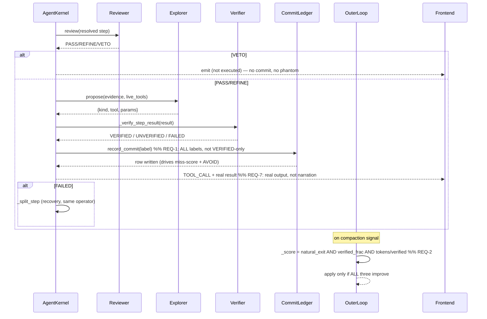

# Design: DER Loop Integrity + Honest Display

## Context
The DER loop is the execution core of IRIS Voice. A design audit (read against the
blueprint, not the code) raised 7 findings (A–G). Code-level verification on
`feat/agent-multi-step-tool-execution` confirmed:

- **A (membrane gone)** — FALSE. `Reviewer._heuristic_review` (der_loop.py:609-624) with the
  `_DESTRUCTIVE` screen is instantiated (agent_kernel.py:387) and called (agent_kernel.py:5149).
  Covered by `test_der_rc1_preexec_validation.py`. No action.
- **B (commit-only-on-VERIFIED)** — REAL. `agent_kernel.py:6551` gates `record_commit` on
  `== "VERIFIED"`. FAILED/UNVERIFIED write no labeled outcome → starves miss-scoring + AVOID.
- **C (outer-loop gate)** — REAL. `outer_loop.py:35` `HELD_OUT_WHITELIST=("natural_exit",)`
  and `:108-120` score on natural_exit_rate only. Reward-hackable via U_SPLIT.
- **D (reflection)** — PARTIAL. `TrailingDirector` exists and is called (agent_kernel.py:6827)
  but only on gap detection, not VERIFIED-but-shallow.
- **E (fallback)** — PARTIAL. Evidence reaches reasoning prompt; crawler is Fallback-1 only
  for research class (correct), but ordering is a minor preference issue.
- **F (phase-0 leftovers)** — MOSTLY DONE. `episodic.py` at `memory/episodic.py`; EWMA
  unlearning present (:326-336); `outcome_type` enum includes partial. Stale audit claim.
- **G (W0 flat)** — REAL. `agent_kernel.py:5564,6852` debit `len(_children)` flat, not
  `tokens/AVG_STEP_COST`. `AVG_STEP_COST=1500` (der_constants.py:137) unused for debit.

Separately, the **user identified the frontend display** as the clearly broken/flawed layer:
DER-internal step-resolution text and phantom tasklist cards are shown instead of real tool
output. This spec repairs B/C/G (real), D/E (minor), the 3 stale tests, and adds the honest
display layer (REQ-7). Fundamental loop values are preserved.

## Architecture Overview

```
                 ┌─────────────────────────────────────────────────────┐
                 │  EXECUTION LOOP (agent_kernel._der_run_step_execution)│
                 └───────────────┬─────────────────────────────────────┘
                                 │
        ┌────────────┬───────────┼──────────────┬──────────────────┐
        ▼            ▼           ▼              ▼                  ▼
   Reviewer     Explorer     Verifier      Commit Ledger       Split Op
   (memb, A)    propose(E)   _verify_      record_commit      _split_step
   _heuristic   evidence→    _result       (REQ-1: ALL         (G: measured
   _review      tool/reason  VERIFIED/     labeled, not        debit)
   (A: kept)    (E: kept)    UNVERIFIED/   VERIFIED-only)
                             FAILED)        │
                                             ▼
                                  caducean_trajectory
                                  record_commit(label)  ◄── REQ-1
                                             │
                 ┌───────────────────────────┼───────────────────────────┐
                 ▼                           ▼                           ▼
        pheromone miss (−0.08)      AVOID header gen          crystallization
        (B: now fed by FAILED)      (B: now fed by FAILED)    (gated VERIFIED only)
                 │
                  ▼
         OUTER LOOP (outer_loop.OuterTuner)  ◄── REQ-2 compound gate
         _score = natural_exit AND verified_frac AND tokens/verified
                  │
                  ▼
         COMMUNICATION (agent-driven)  ◄── REQ-7
         post-step hook reads committed outcome → decides silence / brief / incremental
         splits speak (TTS) vs display (chat/doc); cancels stale narration on state change
                  │
                  ▼
         FRONTEND (ChatView + TaskListCard + documents)  ◄── REQ-8 honest display
         driven by QueueItem + commit ledger (real toolName/resultPreview/status)
         coherent with spoken narration; consumes IRISStreamEvent.TOOL_CALL/result
```

### Communication architecture (REQ-7) — replaces the fixed timer heartbeat
The current `narration.py` emits a fixed 12s "Still researching the web…" heartbeat on slow
tools. That is a *timer*, not a *decision*. REQ-7 replaces it with an agent-driven
communication step triggered by **physics events**, implemented as a **latency-cheap
post-step hook**:

```
step completes → commit ledger written (REQ-1, real label)   [no new inference here]
       │
       ▼
PHYSICS EVENT fires: |u| band crossing (oscillating→converged) / split / Sub-Loop collapse
       │   (same u/ξ that governs execution → narration timing; the two cannot drift)
       ▼
communicate() hook (LOCAL, cheap): reads committed outcome + task shape
       │   applies rule: silence / brief / incremental  — NO LLM on silent steps
       ├─ short task  → emit NOTHING (silence; result already in chat)   [AC2]
       ├─ physics-event → emit INCREMENTAL update (speak=condensed, display=full) [AC3]
       └─ done        → emit BRIEF summary
       │
       ▼  (LLM invoked ONLY to author speak_text when a narration is warranted)
split into:  speak_text  ──► TTS (tts.py)        [short, spoken]
             display_text ──► ChatView/Document  [full, visible]
       │
       ▼
coherence guard: spoken words ⊆ visible text; cancel stale narration on state change [AC6,AC7]
```

Latency note: the hook is a local read + rule on every step (microseconds); the LLM
condensation fires only on the few steps that merit narration. Common case (silence) adds
zero latency. The physics signal (not a timer) decides *when* to speak, so the user hears
updates exactly when the trajectory's shape changes — during the long tasks where they are
waiting.

## Sequence / Data Flow



## Data Models

### Commit ledger row (caducean_trajectory.record_commit)
```
session_id      TEXT
step_id         TEXT
commit_hash     TEXT
message         TEXT
u               REAL
xi              REAL
verified_label  TEXT   -- NEW: "VERIFIED" | "UNVERIFIED" | "FAILED"  (REQ-1)
ts              REAL
```
Currently `record_commit` is called only on VERIFIED. REQ-1 changes the call site
(agent_kernel.py:6551) to call for every executed action and pass `verified_label`.

### Outer-loop score (outer_loop._score)
```
held_out: List[session_exit rows]
returns: {
  natural_exit_rate:      float,   -- existing
  verified_fraction:      float,   -- NEW (REQ-2)
  tokens_per_verified:    float,   -- NEW (REQ-2)
}
accept iff: new.natural_exit >= base.natural_exit
        AND new.verified_fraction >= base.verified_fraction
        AND new.tokens_per_verified <= base.tokens_per_verified
```

### Work-unit debit (agent_kernel)
```
per step:  work_units -= max(1, measured_tokens // AVG_STEP_COST)   -- REQ-3 (was len(_children))
on split:  work_units -= width   (prepay, Φ invariant preserved)
```

## Key Decisions
1. **Commit-all-labeled (REQ-1)** over commit-on-verified: the audit's strongest point.
   Crystallization + hit-scoring stay gated on VERIFIED; only the *ledger write* becomes
   universal. This restores the failure-learning channel without weakening G4/G5 guarantees.
2. **Compound gate (REQ-2)** over single natural_exit_rate: directly closes the §9.4
   circularity the handoff warned about. Per-domain via the existing `domain` column.
3. **Measured debit (REQ-3)** over flat unit: `AVG_STEP_COST` becomes a real tunable the
    outer loop can own (connects to REQ-2's token metric). Floor of 1 prevents zero-debit.
4. **Communication is agent-driven, not a timer (REQ-7)** — the existing `narration.py`
   12s heartbeat is replaced by a `communicate()` hook that reads the *committed outcome*
   (REQ-1) and decides silence / brief / incremental. Narration is always grounded in real
   records, never in DER-internal strings. This is the user's explicitly broken layer and is
   treated as first-class, equal in importance to the backend integrity fixes.
5. **Display is driven by real records, coherent with speech (REQ-8)** — `TaskListCard` and
   chat stream read `QueueItem` + commit ledger (real `toolName`/`resultPreview`/status), not
   narration text. Spoken words ⊆ visible text; the two never contradict.
6. **A is not fixed** — verification proved the membrane exists and is wired. Documenting
   this prevents wasted work (auditor was wrong on A).

## Data Models (communication)

### Communication decision (new, post-step hook)
```
task_id         TEXT
shape           "short" | "long" | "blocking"
decision        "silence" | "brief" | "incremental"   -- agent-chosen (REQ-7 AC1)
speak_text      TEXT   -- condensed, TTS reads (REQ-7 AC4)
display_text    TEXT   -- full, chat/doc shows
state_anchor    TEXT   -- step_id the narration refers to (coherence guard, REQ-7 AC5)
superseded_by   TEXT   -- later decision that cancelled this one (REQ-7 AC6)
```
The hook reads the committed outcome (REQ-1) so `speak_text`/`display_text` are always
derived from real labels, never from "[step N completed]".

## Error Handling
- Commit write fails → debug log, step continues (REQ-1 AC5).
- Token count unavailable → debit floor 1, debug log (REQ-3 edge).
- `AVG_STEP_COST` ≤ 0 → clamp to 200 minimum (REQ-3 edge).
- Outer loop < held_out_count sessions → return None, no proposal (REQ-2 edge, existing).
- TrailingDirector unavailable → skip depth check, debug log (REQ-4 edge).
- Frontend missing backend event for a step → render "unknown", never fabricate (REQ-8 edge).
- TTS unavailable / muted → `speak_text` degrades to display-only, no error to user (REQ-7 edge).
- Long task fails mid-way → agent speaks failure honestly, not a queued success (REQ-7 edge).
- User interrupts mid-task → in-progress narration cancelled, agent re-orients (REQ-7 edge).

## Testing Strategy — contract + behavioral, intertwined (standing CDD harness)

This system is ONE recursive operator at four scales; bugs live in the SEAMS between parts,
not inside them. Unit tests alone are insufficient and can hide real breaks (phantom card,
success spoken after failure, self-tuning that cheats its own metric). Testing is therefore
layered and cross-cutting, organized as:

```
tests/unit/         pure logic only (no I/O, no cross-layer)
tests/contract/     boundary pins (interface shapes, caught BEFORE behavior)
tests/behavioral/   full-loop drives (emergent properties, run system as it runs)
scripts/validate_der_*.py   STANDING CDD HARNESS — replays recorded trajectories
                            through the FULL stack; asserts contracts + behaviors EVERY run
```

**Contract tests (pin every boundary):**
- backend → frontend event shape: `IRISStreamEvent.TOOL_CALL` / `result` / `VALIDATION_FAILED`
  carry real `toolName` + `resultPreview` + status (no narration string).
- agent → TTS text shape: `speak` (condensed, never internal) vs `display` (full); `speak ⊆ display`.
- loop → ledger record shape: `(state, action, verified_label)` for ALL outcomes (REQ-1).
- outer loop → metric shape: compound gate inputs (natural_exit, verified_fraction, tokens/verified).

**Behavioral tests (drive a FULL task through the real loop):**
- plan → execute → verify → commit → narrate → display, assert EMERGENT properties:
  no phantom card, spoken ⊆ visible, failure recorded AND shown, self-tuning REJECTS the hack.
- inject Caducean `u`/`ξ` trajectory states (physics-aware): split when oscillating, silence
  when converged, narration fires on band crossing.

**Intertwined rule:** contract + behavioral share fixtures and assertions. Every behavioral
gap found DECOMPOSES into the contract test that would have caught it, so the gap becomes a
permanent guard. Contract tests are derived from real behavioral traces, not invented.

**Standing CDD harness:** `scripts/validate_der_*.py` replays recorded trajectories through
the full stack and asserts contracts + behaviors on EVERY run. This is the gap-finding
instrument — if we test correctly, we find the gaps and errors.

### Per-requirement test mapping
- **REQ-1 (unit+contract):** `tests/contract/test_ledger_contract.py` — `record_commit` called
  for VERIFIED/UNVERIFIED/FAILED; miss-score delta fires on FAILED; crystallization NOT called
  on FAILED/UNVERIFIED.
- **REQ-2 (behavioral+contract):** `tests/behavioral/test_outer_loop_hack.py` — "never split"
  (U_SPLIT=1.0) REJECTED; all-three improvement ACCEPTED; per-domain gate; metric shape pinned.
- **REQ-3 (unit):** `tests/unit/test_work_units.py` — debit == measured//AVG_STEP_COST (not
  len(_children)); Φ non-increasing.
- **REQ-4 (behavioral):** `tests/behavioral/test_depth_check.py` — VERIFIED-but-shallow triggers
  analyze_gaps.
- **REQ-5 (contract):** `tests/contract/test_resolver_fallback.py` — non-research unparseable ⇒
  reasoning/pheromone, not crawler.
- **REQ-6 (harness):** fix 3 stale tests; full suite 0 failures.
- **REQ-7 (contract+behavioral):** `tests/contract/test_narration_contract.py` — short⇒silence;
  physics-event⇒incremental (not timer); `speak_text` never "[step N completed]"; stale
  cancelled; `speak ⊆ display`. `tests/behavioral/test_narration_flow.py` — full task, assert
  spoken matches visible, mid-fail speaks failure.
- **REQ-9 (contract+behavioral):** `tests/contract/test_narration_log_contract.py` — every
  narration decision (incl. silence) writes a structured entry with the required fields;
  split/collapse entries include u/ξ; scoped by conversation_id; log write is off the
  critical path (async). `tests/behavioral/test_narration_log_flow.py` — drive a task with
  multiple physics triggers; assert the log reconstructs per-thread trigger frequency and
  intervals; assert TTS playback entries present with status.
- **REQ-8 (behavioral+contract):** `tests/behavioral/test_display_flow.py` — TaskListCard driven
  by QueueItem+commit (real toolName/resultPreview); no phantom card on no-output; FAILED
  renders fail not done; Pacman signals (avoided/retried/crystallized) visible; spoken matches
  visible. `tests/contract/test_event_shape.py` — event→TaskStep mapping pinned.
- **Invariant (G1–G5):** `tests/behavioral/test_der_invariants.py` must stay green (no
  regression from REQ-1). The CDD harness includes these on every run.
