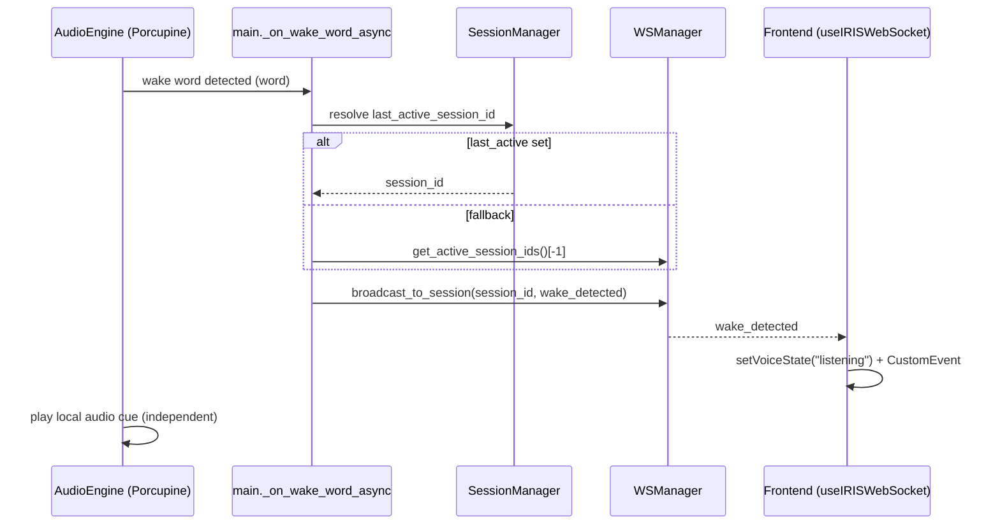
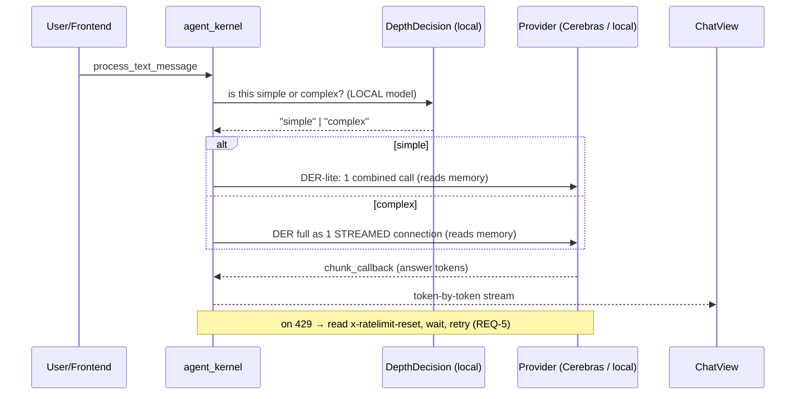

# Design: DER Streamed Thinking + Wake-Word Last-Active Session Binding

## Context
Two regressions block live use of IRIS Voice:
1. **Wake word dead at startup.** `main.py:_on_wake_word_async` resolves the session via
   `get_session_id_for_client("iris")` first, which returns `None` when the frontend's
   WS session is not yet "active" (startup race). It then falls to headless mode and
   sends `wake_detected` to a nonexistent client — swallowed by `except: pass`. The
   frontend handler (`useIRISWebSocket.ts:652`) is correct; the backend just never
   delivers the message. After a manual trigger the session becomes active and it works.
2. **Rate limit from DER burst.** Every prompt runs the full DER loop
   (TaskClassifier → Reviewer → TrailingDirector → ModeDetector → execution) = ~4-5
   separate Cerebras calls (`agent_kernel.py:2150-2344`). Cerebras tier = 5 req/min
   (confirmed in live headers). The first prompt nearly exhausts the quota; the second
   hits 429 and the retry (`agent_kernel.py:2291-2298`) waits only 1-2s then fails.

Constraints: DER must remain a memory-driven thinking process; the final answer must
stream token-by-token to ChatView; the depth decision must be nuanced (not "short =
simple").

## Architecture Overview

```
┌─────────────┐   wake word    ┌──────────────────┐   broadcast_to_session   ┌──────────────┐
│ AudioEngine │──────────────►│ main.py          │──────────────────────────►│ Frontend     │
│ (Porcupine) │  (local cue)  │ _on_wake_word_   │   wake_detected          │ useIRISWS    │
└─────────────┘               │ async (REQ-1/2)  │                          │ →voiceState  │
                              └────────┬─────────┘                          └──────────────┘
                                       │ resolves via last_active_session_id
                              ┌────────▼─────────┐
                              │ SessionManager   │  NEW: last_active_session_id (recency)
                              │ (sessions/*.py)  │
                              └──────────────────┘

User prompt ──► gateway.process_text_message ──► agent_kernel.process_text_message
                                                    │
                                          ┌─────────▼─────────┐
                                          │ DepthDecision      │ LOCAL/CHEAP model (REQ-4 AC2)
                                          │ (simple? complex?) │ never Cerebras
                                          └─────────┬─────────┘
                                          ┌─────────▼─────────┐
                                simple ──►│ DER-lite           │ 1 combined call + memory (REQ-4)
                                complex──►│ DER full (streamed)│ 1 streamed connection (REQ-3)
                                          └─────────┬─────────┘
                                                    │ chunk_callback (answer stream #2)
                                          ┌─────────▼─────────┐
                                          │ ChatView          │ token-by-token (REQ-3 AC3)
                                          └───────────────────┘
```

## Sequence / Data Flow

### Wake-word → frontend (REQ-1, REQ-2)


### Prompt → DER (REQ-3, REQ-4, REQ-5)


## Data Models

### SessionManager — new field
```python
class SessionManager:
    # existing: client_to_session: Dict[str, str]
    # NEW:
    last_active_session_id: Optional[str] = None          # recency pointer
    _session_activity_order: List[str] = []               # append/update on activity

    def touch_session(self, session_id: str) -> None:
        """Update last_active_session_id + recency order. Called on connect,
        message, switch."""
```

### DepthDecision result
```python
@dataclass
class DepthDecision:
    path: Literal["lite", "full"]
    confidence: float          # how sure the local model is
    reason: str               # for observability (REQ-6)
```

## Key Decisions
1. **Recency in SessionManager, not WSManager.** `get_active_session_ids()` returns
   dict-insertion order (ws_manager.py:357). Adding `last_active_session_id` to
   `SessionManager` (the source of truth for sessions) is cleaner than mutating WS
   ordering. `touch_session()` is called from `ws_manager.connect` (line 138 area) and
   from the message path.
2. **Broadcast, not single client.** `broadcast_to_session` already exists
   (ws_manager.py:332). We use it for `wake_detected` so every client in the session
   reacts — fixes the "frontend doesn't react" symptom directly.
 3. **No separate depth-decision model (verified redundant).** Code audit showed
    `_is_chitchat` (agent_kernel.py:1627) is a PURE HEURISTIC (0 model calls) and already
    routes chit-chat to `_respond_direct` (1 Cerebras call). Simple prompts do NOT hit
    DER. The quota burner is the DER PLANNING path (4 stages x 3 retries). So REQ-4 is
    retargeted: collapse the DER planning-path burst (stream it / merge stages), not add
    a redundant local classifier. Short-but-complex text is not in the chit-chat
    patterns, so it already reaches DER — nuance preserved for free.
 4. **Streamed DER for the planning path.** The DER loop (4953-5042) runs as ONE streamed
    Cerebras connection instead of 4 discrete stages x retries. Both consult Mycelium
    memory; neither fires the 5-call burst. The `chunk_callback` mechanism
    (agent_kernel.py:2332) is extended to the Cerebras path so the answer streams to
    ChatView.
 5. **Safe default on DER-stage failure = FULL DER / ledger record** (REQ-4 AC4, REQ-5).
    Never silently degrade.

## Ripple-Effect Map (areas these changes touch — verified)
- **backend/main.py** (`_on_wake_word_async`): session resolution rewritten; `except:
  pass` replaced with logged fallback; uses `broadcast_to_session`.
- **backend/sessions/session_manager.py**: NEW `last_active_session_id` + `touch_session()`.
- **backend/ws_manager.py**: `connect` (line 117-138) calls `touch_session`; no API
  change needed for broadcast (already exists).
- **backend/agent/agent_kernel.py**: NEW `DepthDecision` call (local model) at
  `process_text_message` entry; DER-lite branch; Cerebras path switched to streaming;
  429 retry rewritten (REQ-5).
- **Frontend `useIRISWebSocket.ts:652`**: NO change needed — already handles
  `wake_detected` → `voiceState`. Verified correct.
- **Frontend `NavigationContext.tsx` / `XurOrb.tsx`**: NO change needed — `voiceState`
  already drives the orb animation on `wake_detected`.
- **Frontend ChatView**: consumes existing token stream; verify the streaming message
  shape is unchanged (contract test CT-1).
- **Agent session-creation logic**: unchanged — new sessions still created only by the
  agent; wake word only binds.
- **Observability (REQ-6)**: new scoped logs; must be bounded (sampled) to avoid
  unbounded growth.

## Error Handling
- Wake resolution fails → headless + logged (no silent swallow).
- Depth-decision fails → FULL DER (safe default).
- Stream error mid-thinking → clear failure + ledger record, no silent hang.
- 429 → wait for reset (REQ-5), surface "rate limited, retrying" to user.
- All retries exhausted → ledger record + user-visible error.

## Testing Strategy
Organized as tests/unit | tests/contract | tests/behavioral, plus the standing CDD
harness (scripts/validate_der_*.py).

### Contract tests (tests/contract/)
- CT-1: `wake_detected` WS message shape unchanged (frontend handler still parses it).
- CT-2: `chunk_callback` / streaming answer message shape unchanged for ChatView.
- CT-3: `DepthDecision` result shape (`path`/`confidence`/`reason`).
- CT-4: `last_active_session_id` field present on SessionManager; `touch_session`
  updates recency.

### Behavioral tests (tests/behavioral/)
- BT-1: Wake word at startup (no prior manual trigger) → frontend `voiceState` becomes
  "listening" (simulate WS connect then immediate wake; assert broadcast delivered).
- BT-2: Create new frontend thread → wake word binds to it (assert `last_active_session_id`
  updated and `wake_detected` routed there).
- BT-3: Simple prompt → ≤1 Cerebras call + 1 local depth call; answer streams
  token-by-token.
- BT-4: Short-but-complex prompt → FULL DER engaged (nuance verified).
- BT-5: 429 response → system waits for `x-ratelimit-reset` and retries successfully
  (no immediate 1-2s failure).

### Unit tests (tests/unit/)
- UT-1: `touch_session` recency ordering (most-recent wins).
- UT-2: DepthDecision local-model call does NOT hit Cerebras (mock provider, assert 0
  Cerebras calls).
- UT-3: 429 backoff computes wait from `x-ratelimit-reset`.

### Intertwined
Every behavioral gap found DECOMPOSES into the contract test that would have caught it.
E.g. BT-1 failing ⇒ CT-1/CT-4 gap.

### Standing CDD harness
Extend scripts/validate_der_*.py with trajectories: (a) wake-at-startup, (b)
new-thread-wake, (c) simple-prompt-quota, (d) short-complex-prompt, (e) 429-reset.
Assert contracts + behaviors on EVERY run.
