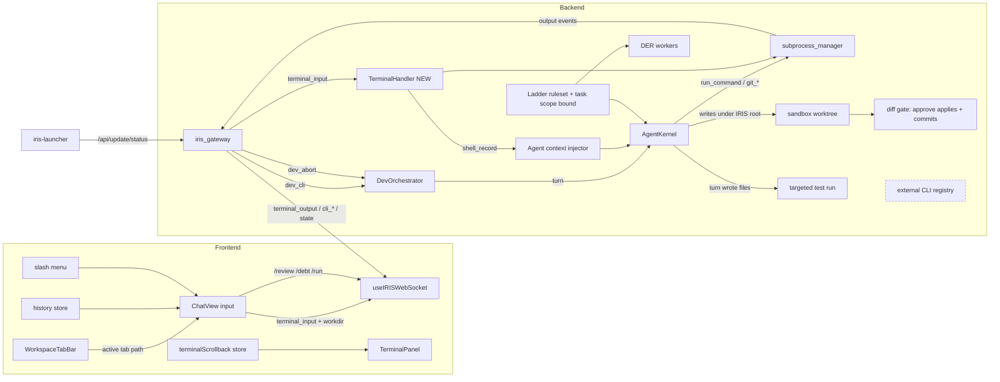
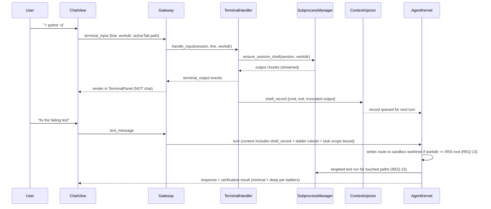

# Design: Developer-Mode CLI as IDE (dev-cli-ide)

## Context
Developer mode's CLI surface is half-built, and the half that exists points at the wrong agent. The gateway routes `terminal_input` to a module that does not exist; `dev_cli` routes to external CLIs (kilo/claude/opencode) rather than IRIS's own kernel; the agent's dev tools hard-reject any working directory outside the IRISVOICE root; `workdir` is accepted but never sent; shell output never reaches the agent; and the chat/terminal streams were visually merged against the product intent. This design closes those gaps using the existing DevOrchestrator/subprocess_manager infrastructure, the existing scrollback store, and the existing task-card system — no new frameworks.

Constraints:
- Backend is FastAPI + WS; all I/O async; subprocess work lives in `backend/dev/subprocess_manager.py`.
- Frontend is Next.js 15; the scrollback store (`components/terminal/terminalScrollback.ts`) is the single terminal state owner (bounded 500 lines).
- Capability gate `CapabilitySet.TERMINAL` already guards both message types (iris_gateway.py:10415, 10486).
- Windows-first (PowerShell host), but shell resolution must be platform-aware.
- IRIS's own AgentKernel is the only agent (D7). External coding CLIs are removed, not abstracted behind an interface — routing work into a third-party tool loses the coordinate graph, the ledger, and the conversation context, which is the memory robustness this project exists to keep.
- Every task carries a scope bound (D8). The design's job is to make each requirement implementable in the smallest coherent change; where a requirement invites a framework, the design names the non-framework instead.

## Architecture Overview



## Sequence / Data Flow



## Data Models

```python
# backend/dev/terminal_handler.py (NEW)
@dataclass
class ShellSession:
    session_id: str
    workdir: str
    proc: asyncio.subprocess.Process   # persistent shell (powershell -NoExit / bash)
    output_buffer: deque[str]          # bounded
    started_at: float

# injected to agent context
@dataclass
class ShellRecord:
    command: str
    exit_code: int | None
    output_head: str      # truncated per budget
    output_tail: str
    elided_bytes: int
    workdir: str
    ts: float
```

```typescript
// components/workspace/workspaceStore (extend tab)
interface WorkspaceTab { id: string; label: string; type: string; path: string; isVirtual: boolean }
// active tab with !isVirtual && path is a directory => workdir source

// terminalScrollback store (extend)
interface TerminalState {
  lines: TerminalLine[]; questions: TerminalQuestion[]; isOpen: boolean;
  history: string[];          // NEW, bounded 200
  historyIndex: number;       // NEW
  sessionState: 'idle'|'working'|'blocked'|'done';  // NEW (REQ-5 AC3)
  workdir: string;            // NEW (REQ-4 AC4)
}
```

WS message shapes (CONTRACT LOCK):
- send: `terminal_input { line: string, workdir?: string }` — workdir added (was line-only)
- send: `dev_cli { query: string, workdir?: string }` — workdir added
- send: `dev_abort {}` — existing backend shape (iris_gateway.py:10451)
- recv: `terminal_output { line, proc_id }`, `cli_activity { tool_name, workdir }`, `cli_started`, `cli_output` — existing types/iris.ts:258-272, unchanged

## Key Decisions
1. **Persistent per-session shell** (PowerShell `-NoExit` on Windows, `$SHELL` elsewhere) inside subprocess_manager, keyed by session_id. Alternative rejected: one-shot commands (loses cwd/env state, REQ-1 AC2).
2. **Context injection at turn assembly, not at output time.** ShellRecords queue on the session; AgentKernel pulls them when assembling the next turn's context. Avoids mutating an in-flight turn (REQ-2 edge case).
3. **De-unify by exclusion, not deletion of the store.** `unifiedTimeline` (chat-view.tsx:706) is removed from the render path; the scrollback store stays authoritative for the terminal panel. Chat keeps messages+cards only.
4. **Workdir from active tab, validated backend-side.** Frontend sends it; backend re-validates existence (never trusts the client path). Virtual tabs send nothing.
5. **Ladder as a compact static ruleset** (<600 tokens) injected at system-prompt assembly when `irisMode==='developer'` and intensity != off. Alternative rejected: per-turn dynamic prompts (token churn, no persistence).
6. **Depth ladder is part of the same ruleset, ordered AFTER minimality** — the rungs answer "how small", the depth rungs answer "how sure". Explicit statement that understanding/verification are never minimized (user directive D3).
7. **Global subprocess semaphore (default 4)** in subprocess_manager; sessions queue with position. Protects the "must not crash" requirement (D2) on memory-constrained machines.
8. **/debt reuses task cards** with a `debt` tag and file:line dedupe key — no new ledger store.
9. **IRIS's AgentKernel replaces the external CLI registry outright.** `dev_cli` dispatches to the kernel turn path with the session workdir and conversation context. `cli_tools.yaml` and `cli_registry.py` are deleted; `_select_tool` and its LLM call go with them. DevOrchestrator keeps only what the frontend contract needs — subprocess lifecycle, output streaming, file-watcher wiring, `cli_*` emission. Alternative rejected: a pluggable agent-backend interface. There is one agent; an abstraction over a set of size one is the over-build this spec's own D3 forbids.
10. **One shell substrate, not three.** Today code executes three ways with three root policies: the new per-session shell (REQ-1), the agent's one-shot `subprocess.run(shell=True)` (`tool_bridge.py:1830`), and MCP `file_manager` writes (`tool_bridge.py:1392`). The agent's shell moves onto the session `ShellSession` so bounds, semaphore, injection, and abort apply once rather than being reimplemented per caller. Alternative rejected: leaving the agent's shell alone — it means REQ-8's abort cannot stop an agent-launched runaway, which is the case that actually matters.
11. **Workdir is resolved once per turn and bound into tool execution; the repo-root guard becomes an allowlist.** `_execute_dev_tool` currently resolves cwd from a hardcoded `_DEFAULT_REPO` and rejects anything outside it (`tool_bridge.py:1742-1757`). That guard is the only thing stopping the agent from running shell commands anywhere on disk, so it is replaced — by an allowlist built from the existing project registry (`GET /api/projects`) — never merely deleted. Alternative rejected: per-tool `cwd` parameters (every call site becomes a place to forget).
12. **Self-edits land in the existing sandbox worktree.** When the resolved workdir is the IRIS root, agent writes route through `ensure_worktree()` (`git_ops.py:191`); promotion to the live tree is a user action via `/api/git/worktree/merge`. No new isolation mechanism — the worktree API already exists at `backend/main.py:1518-1546` and is simply unused. Alternative rejected: auto-restart/hot-reload on self-edit (a bad change would take the assistant down with it).
13. **The diff gate becomes a pre-apply gate.** `approve_write`/`reject_write` (`git_ops.py:161-176`) currently only mutate a status string while the write is already on disk, and `_pending_writes` is a process-global list. Approve applies and commits; reject discards; the queue is session-scoped and bounded. The session-end scan stays as a backstop, not the primary path. This also removes a live violation of the spec's own REQ-5 AC1.
14. **Verification is a system behavior, not a prompt instruction.** A dev turn that wrote files runs the targeted test command for the touched paths and attaches the result. Targeted, never full-suite — a gate slow enough to be worth skipping will be skipped, and REQ-15 AC3 forbids reporting success on a failure.
15. **Anti-overcoding binds at task granularity (D8).** The ladder answers "how small"; the task's `DONE =` / `NOT THIS =` lines answer "how far". REQ-9 AC6 injects both verbatim into the turn, and REQ-9 AC7 makes adherence falsifiable by having `/review` emit a structured verdict the ledger records. Without AC7 the spec's "adherence verifiable in the ledger" claim is untestable — REQ-12 logs only intensity *changes*.
16. **Updater: interface and build config here, pipeline in the launcher spec.** D4's ownership is correct — iris-launcher launches the widget in developer mode and drives the pipeline through the backend on :8090. But signing keys, `bundle.targets`, the updater plugin, and static export live in `src-tauri/` and `next.config.mjs`; the launcher's repo cannot supply them. So this spec lands the config (REQ-17) and pins the endpoints the launcher calls (REQ-16), and stops there.

17. **Search is ripgrep, bundled — and it is a discipline prerequisite, not a convenience.** `grep_files` (content) and `glob_files` (paths, mtime-sorted) wrap a bundled `rg` binary resolved before PATH. The speed comes from what it *skips* and what it *returns*, not from scan rate: `.gitignore` respected by default (measured here: `rg --files` = 8,653 files instantly, while `find node_modules -type f` could not finish counting in 100 s — and `list_directory(recursive=True)` is `Path.rglob("*")` over that second tree, `builtin_servers.py:459`), bounded output, and paths-not-contents so the agent reads only what matters. Alternative rejected: shelling out to `dir /s`/`findstr` via `run_command` (Windows-only, unbounded, no ignore rules). Alternative rejected: a semantic/embedding index (the coordinate graph is already the semantic layer). **This gates REQ-9**: the minimality ladder's rung 2 is "is it already in the codebase?", and an agent that cannot cheaply answer that will write a duplicate — the most common over-build there is.
18. **Dev/shell failures get explicit FAULTLINE labels; a non-zero exit is not a tool failure.** FAULTLINE already covers this surface structurally — `normalize_failure` sits at the `ToolBridge.execute_tool()` choke point (FAULTLINE §4) — but §8 lists dev/git as Roadmap, so labels are heuristic guesses today, and REQ-1 AC5 / REQ-4 AC6 add failure modes with no label at all. REQ-19 registers them as DATA (`register_error_label`), never new branches. The load-bearing distinction: a failing `pytest` is a *successful* tool call with `returncode != 0`. Typing it as a tool error makes the reviewer re-run the test instead of fixing the code — precisely the blind-retry loop FAULTLINE §1 exists to prevent.


### Added 2026-08-26 — context lifetime and the concurrency lanes (REQ-22 … REQ-25)

21. **Delivery and retention are two lifetimes over ONE store, and Key Decision 2 is amended.** KD2 said "context injection at turn assembly"; it was silent on how long the injected block then lives, and the first implementation answered that with `add_message("system", ...)`. That answer was wrong in both directions at once: it made the block permanent enough to be expensive (re-sent on every LLM call of every later turn until FIFO eviction, 1 of 10 window slots, written to `conversation.json`) and temporary enough to be useless (gone after ~5 exchanges, with no way to get it back). The split: DELIVERY is ephemeral — the block is appended to the turn's local outgoing context list, exactly as the @-card block already is, so it is paid for once on the turn that has shell activity. RETENTION is durable but out-of-prompt — drained records stay in a bounded in-memory history, addressable by ref. Alternative rejected: routing shell output through the memory system as a recall. Shell output is not recall; it has no history, no posterior, and no signature, and `recall_memory` is a `min_score=0.40` similarity search that returns summaries. Writing telemetry into a semantic store so the same turn can retrieve it back approximately is strictly worse than holding it.

22. **The index line is the load-bearing half of the retention design.** A pull tool alone was rejected, and correctly: an opt-in read fails silently when the user says only "fix the failing test". The fix is not to abandon the tool but to remove the opt-in from the part that matters. The block always carries a one-line index for retained output that is not present verbatim — command, exit code, ref, retained size. Retrieval stays opt-in; AWARENESS does not. This is what makes "the agent cannot see the old bytes" safe rather than a licence to invent them. Cost is ~15 tokens per line, capped, versus a ~500-token block re-paid 5-15x per turn.

23. **A read can never widen what an injection allowed.** Retention stores the record AFTER REQ-2 AC4 redaction and the 8 KB head+tail truncation, so `read_shell_output` returns the same bytes that were already eligible for the prompt. Deny-listed commands are not recorded at all, so they cannot be retained. The tool sits behind the same TERMINAL capability as `run_command`. Alternative rejected: retaining raw output and redacting on read (two redaction sites, one of which is on the read path where a mistake is invisible).

24. **No context zone without a writer.** `ContextManager.active_tool_state` was removed rather than wired. It is an ANCHOR zone (never compressed) and `ContextManager.clear_session` has no caller in the kernel, so the first code to use it would leak context for the process lifetime — and it reads like the obvious home for live tool output, which is what makes it dangerous rather than merely unused. Step results already go to `working_history`, which excerpts and compresses. `specs/agent_loop_design.md` carries a SUPERSEDED note at the line that prescribed the zone.

25. **Three lanes on one socket, chosen by what the frame costs and when it must land.** The per-session lock exists to order a session's TURNS; it was also, accidentally, ordering everything else against them. The lanes are now explicit: (a) INLINE control frames — `ping`, `request_state`, `question_response` — tiny, must land during a turn, safe to run in the reader loop; (b) UNLOCKED background frames — `terminal_input` — must land during a turn but can run for minutes, so they dispatch as tasks WITHOUT the lock; (c) LOCKED background frames — everything else, including `text_message`. Ordering is not lost in lane (b): `SubprocessManager` holds a per-session `_cmd_lock`, so a session's commands stay ordered against each other. What lane (b) drops is the coupling between the shell and the agent's turn, which never had a reason to exist — developer mode advertises a terminal beside the agent, and behind the lock it was a terminal that stopped whenever the agent thought.

26. **A message typed during a turn is a steer, not a new turn.** REQ-15 built the whole steering channel — inbox, boundary drain, plan revision, queued/considered acks — and nothing ever sent to it; the UI kept sending `text_message`, which queued behind the lock. The routing decision lives in the frontend because that is the only place that knows a card is working. Alternative rejected: making the backend reclassify a `text_message` that arrives mid-turn — the message is already behind the lock by the time the backend sees it, so the backend cannot observe "mid-turn" for that frame at all. Two latent defects surfaced when the sender was added and are fixed with it: the REQ-15 handler read `text` only from the frame's top level while the client wraps everything in `payload`, and the inbox is drained only inside the DER loop, so a record queued while no task ran would have been applied to the next one.

### Deferred to `specs/agent-blackboard-coordination`
19. **Blackboard coordination, not A2A messaging (user directive).** All inter-agent coordination state (claims, handoffs, results, warnings) lives in the application's coordinate memory DB (`.mcm/coordinates.db`, WAL-mode, concurrent-safe — the same store that coordinated 257 build sessions via atomic claim_work + heartbeats). Agents never message each other directly. The only push signal is a pointer-only WS notification ("record written in your scope") so agents pull fresh state at turn boundaries instead of polling blindly — the DB is the source of truth; a lost notification self-heals on the next turn-boundary read. Records are conversation/session-scoped; cross-session visibility happens only through explicit handoff records.
20. **Task cards are the shared-work pointer (user directive).** Agents share card IDs through coordination records; the receiving agent resolves `taskcard:<id>` to content via the SAME backend resolution the @taskcard mention already uses (chat-view.tsx:4308-4311 — the resolver exists, agent-side is a new caller, not a new path). Cards stay user-visible; agent mutations reflect in the user's card view. No separate agent-only work-item store.

## Ripple-Effect Map (MANDATORY)

| Area / File | Change? | Classification | Why / Evidence (file:line) |
|---|---|---|---|
| `backend/dev/terminal_handler.py` | Yes — NEW FILE | CHANGE NEEDED | Imported at iris_gateway.py:10495 but does not exist; every `>` command errors |
| `backend/dev/subprocess_manager.py` | Yes | CHANGE NEEDED | Add persistent-shell sessions, global semaphore, output bounds |
| `backend/dev/orchestrator.py` | Yes | CHANGE NEEDED | REQ-0: dispatch to AgentKernel; remove `_select_tool` + its LLM call (orchestrator.py:66-79). Accept+validate workdir; surface session state |
| `backend/dev/cli_tools.yaml` | Yes — DELETE | CHANGE NEEDED | REQ-0 AC2 / D7 — external CLI registry (kilo/claude/opencode) removed, not demoted |
| `backend/dev/cli_registry.py` | Yes — DELETE | CHANGE NEEDED | REQ-0 AC2 — sole consumer is the deleted YAML |
| `backend/agent/tool_bridge.py` | Yes | CHANGE NEEDED | REQ-4 AC5-6: workdir binding + replace `startswith(_DEFAULT_REPO)` guard with project-registry allowlist (:1742-1757). REQ-1 AC5: `run_command` (:1830) and `git_*` move onto ShellSession |
| `backend/git_ops.py` | Yes | CHANGE NEEDED | REQ-14: `approve_write`/`reject_write` (:161-176) must apply/discard, not flip a string; `_pending_writes` (:139) session-scoped + bounded. REQ-13: `ensure_worktree()` (:191) becomes the agent's self-edit write path |
| `backend/sessions/session_manager.py` | Yes | CHANGE NEEDED | REQ-14 AC3 — session-end diff scan (:286-336) demoted from primary path to backstop |
| `backend/main.py` | Yes | CHANGE NEEDED | REQ-0 AC4: repoint `/api/dev/cli-tools` (:1221) at IRIS's own command surface. REQ-16: add `/api/update/status` + `/api/update/check` |
| Verification gate (turn post-processing) | Yes — NEW | CHANGE NEEDED | REQ-15 — targeted test run on any dev turn that wrote files; result attached to the turn |
| `backend/agent/tool_registry.py` | Yes | CHANGE NEEDED | REQ-18 — register `grep_files` + `glob_files` (read_only, parallel_safe). Today the only file tools are read/write/list/create/delete (:608-632) and `search` (:948) is a WEB tool |
| `backend/mcp/builtin_servers.py` | Yes | CHANGE NEEDED | REQ-18 — `list_directory(recursive=True)` is `Path.rglob("*")` with no ignores and no bound (:459-467); it must gain a bound and defer recursive discovery to `glob_files` |
| Bundled `rg` binary (`src-tauri` resources) | Yes — NEW | CHANGE NEEDED | REQ-18 AC6 — ripgrep resolved from the bundle before PATH; a core agent tool cannot depend on the user's PATH |
| `backend/agent/tool_errors.py` (FAULTLINE) | Yes — DATA EDIT | CHANGE NEEDED | REQ-19 — register dev/shell Layer-2 labels. FAULTLINE §8 lists dev/git as Roadmap (heuristic classification today); §2 requires registration, not new branches |
| `src-tauri/tauri.conf.json` | Yes | CHANGE NEEDED | REQ-17 AC1/AC3 — add `nsis` target, `plugins.updater` (pubkey + endpoints), `createUpdaterArtifacts` |
| `src-tauri/Cargo.toml` | Yes | CHANGE NEEDED | REQ-17 AC3 — `tauri-plugin-updater` absent today |
| `next.config.mjs` + `package.json` | Yes | CHANGE NEEDED | REQ-17 AC2 — no `output: 'export'`, and `rewrites()` is incompatible with it; `frontendDist: "../dist"` is never produced by `npm run build` |
| `.gitmodules` | Yes — NEW FILE | CHANGE NEEDED | REQ-17 AC4 — `iris-launcher` is a gitlink (mode 160000 @ 555a40b1) with no URL registered; a clean clone yields an empty directory |
| `backend/iris_gateway.py` | Yes | CHANGE NEEDED | Pass workdir through (10497-1098); wire context-injector hook |
| Agent context assembly (AgentKernel turn assembly) | Yes | CHANGE NEEDED | Pull queued ShellRecords into next turn context (REQ-2) |
| System-prompt assembly | Yes | CHANGE NEEDED | Inject ladder ruleset when developer mode + intensity (REQ-9) |
| `components/chat-view.tsx` | Yes | CHANGE NEEDED | Remove unifiedTimeline from render (706-722, 731); add workdir to terminal_input/dev_cli sends (1690, 1670); ↑/↓ history (onKeyDown 4359); Ctrl+C abort; slash menu; compact system notice on injection |
| `components/terminal/terminalScrollback.ts` | Yes | CHANGE NEEDED | Add history + sessionState + workdir fields; keep 500-line bound |
| `components/terminal/TerminalPanel.tsx` | Yes | CHANGE NEEDED | Show workdir + session state; output-arrival indicator |
| `components/workspace/WorkspaceTabBar.tsx` | No | NO CHANGE (verified) | Already exposes active tab with path (WorkspaceTabBar.tsx:84, 114-118); ChatView reads active tab from store |
| `components/workspace/FilePickerModal.tsx` | No | NO CHANGE (verified) | Already returns local paths + isVirtual flag (FilePickerModal.tsx:13, 25-27, 45) |
| `types/iris.ts` cli_* messages | No | CONTRACT LOCK | Shapes at types/iris.ts:258-272 unchanged; CT-1 pins them |
| Capability gate `CapabilitySet.TERMINAL` | No | CONTRACT LOCK | Gate behavior at iris_gateway.py:10414-10427, 10483-10492 unchanged; CT-2 pins |
| Coordinate memory DB (`.mcm/coordinates.db`) | No | MOVED OUT | Coordination records deferred to `specs/agent-blackboard-coordination` (REQ-5 scope split). That spec owns the migration obligation, since CLAUDE.md commits this DB to transferring into the application runtime store via `scripts/migrate_build_store_inheritance.py` |
| Question-answer resolution path | No | CONTRACT LOCK | chat-view.tsx:1623-1637 + terminalScrollback.ts:709-764 unchanged; CT-3 pins |
| @taskcard mention picker | No | CONTRACT LOCK | chat-view.tsx:4312-4345; slash menu must not hijack '@' — CT-4 |
| Scrollback 500-line bound | No | CONTRACT LOCK | terminalScrollback.ts bound; CT-5 |
| `__tests__/InputRow.test.tsx` | Yes | CHANGE NEEDED | Placeholder/behavior assertions may need the new menu/history accounted for — inputs preserved, no weakening |
| iris-launcher | No | NO CHANGE — CONTRACT ONLY | D4: launcher owns the rebuild/update/rollback pipeline and drives it via the backend API on :8090. Its `RebuildPage.tsx:4` is currently wired to `mockRebuildStatus`; REQ-16 gives it real endpoints to call. No launcher code changes in this spec |

## Error Handling
- Shell spawn failure (no shell found / workdir invalid): explicit `terminal_output` error line naming path + shell; session marked failed; next input retries spawn (REQ-1 AC3).
- Subprocess output flood: bounded deque; overflow drops oldest and emits one `…N lines elided` marker; injection truncates per REQ-12 budget.
- Abort escalation: SIGTERM/TerminateProcess → 3s grace → tree-kill; abort always logged even if process already exited (idempotent).
- Context injection failure (serialization error): log + skip injection; never block the command's own output path.
- Search pattern is invalid regex (REQ-18): explicit error naming the pattern. An empty result and a bad pattern must never look alike to the agent.
- Search result set exceeds the cap (REQ-18 AC4): truncate and SAY SO. A silently truncated search reads as "nothing else matches", which is worse than an error.
- Command exits non-zero (REQ-19 AC2): `success: True` with the exit code — a failing test is a result, not a tool fault.
- Ladder injection failure: dev turn proceeds without ruleset; warning logged (degraded, not broken).
- Worktree creation failure on a self-edit (REQ-13): REJECT the write with an explicit error. Never fall back to writing the live tree — a degraded safety rail is worse than an absent one, because the user believes it held.
- Workdir outside every registered project root (REQ-4 AC6): reject with the same explicit error text as the current guard, naming the path.
- Test command not discoverable for the workdir (REQ-15): report "no test command configured". Never assume green.
- Secret pattern matched in output (REQ-2 AC4): redact and continue; deny-listed target means suppress injection entirely and say so in the panel.
- Semaphore queue overflow (cap + max queue): reject with explicit "N sessions running, try again" message.

## Testing Strategy
- `tests/unit/` — pure logic: ShellRecord truncation (head+tail+elided math), history recall index transitions, marker scanner regex + dedupe keys, ladder ruleset text assembly per intensity, `glob_files` mtime ordering, search-result cap + truncation-notice math.
- `tests/unit/test_tool_errors.py` (EXTEND, do not rewrite — 17 existing tests, FAULTLINE §9) — the REQ-19 labels carry valid Layer-1 dimensions; non-zero exit does NOT produce an `error_type`; `aborted` is excluded from the failure budget.
- `tests/contract/` — CT-1 cli_* WS shapes (`test_dev_cli_ws_shapes.py`, types/iris.ts:258-272); CT-2 capability gate rejects in personal mode (`test_terminal_capability_gate.py`); CT-3 question-answer resolution untouched (`test_question_answer_precedence.py`); CT-4 '@' picker precedence over slash menu (`__tests__/slashMenuPrecedence.test.tsx`); CT-5 scrollback 500-line bound (`test_scrollback_bound.py`); CT-6 additive `workdir` payload (`test_workdir_payload_additive.py`).
- `tests/contract/` safety rails — `test_self_edit_isolation.py` (agent write under the IRIS root lands in the worktree, not the live tree); `test_diff_gate_applies.py` (approve commits, reject leaves nothing, queues session-scoped); `test_verification_gate.py` (failing targeted test ⇒ turn reports unverified).
- `tests/behavioral/` — full-loop drives: IRIS's own agent runs the turn with no external CLI on PATH (REQ-0); `> command` → terminal panel shows output → next agent turn quotes real output (no hallucinated state); two conversations, two workdirs, concurrent commands, assert zero cross-talk and semaphore queueing at cap; `grep_files` on a seeded repo returns matching paths and NO `node_modules` hits, within the result cap; `/review` on a seeded over-built diff returns only a delete-list; `/debt` on a seeded repo produces deduped cards; Ctrl+C kills a `> ping -t`-style endless command and input stays usable.
- Physics-aware: inject blocked-awaiting-question state mid-shell-stream; assert state badge flips and question resolution still wins over shell parsing (existing precedence, terminalScrollback.ts:701-708).
- Standing harness: extend `scripts/validate_der_*.py` replay family with a dev-cli trajectory (shell → inject → agent turn) asserted on every run.
