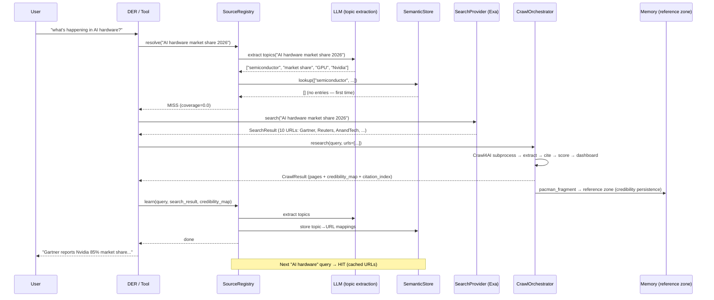
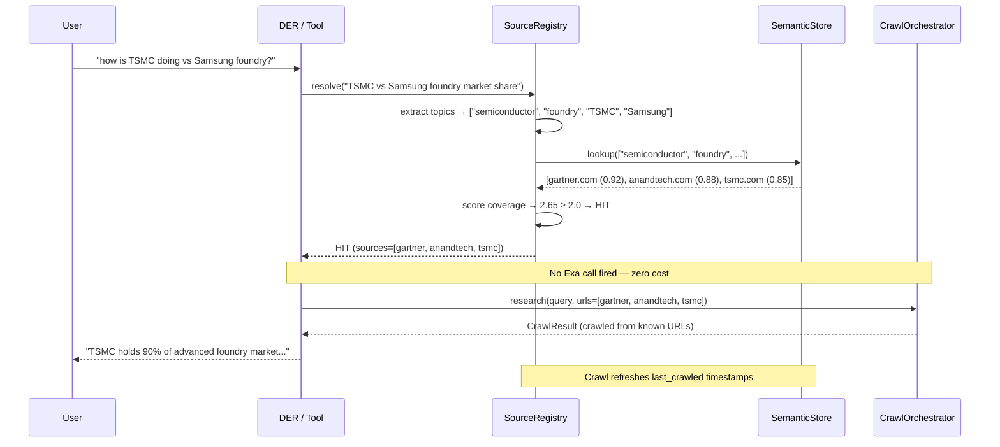
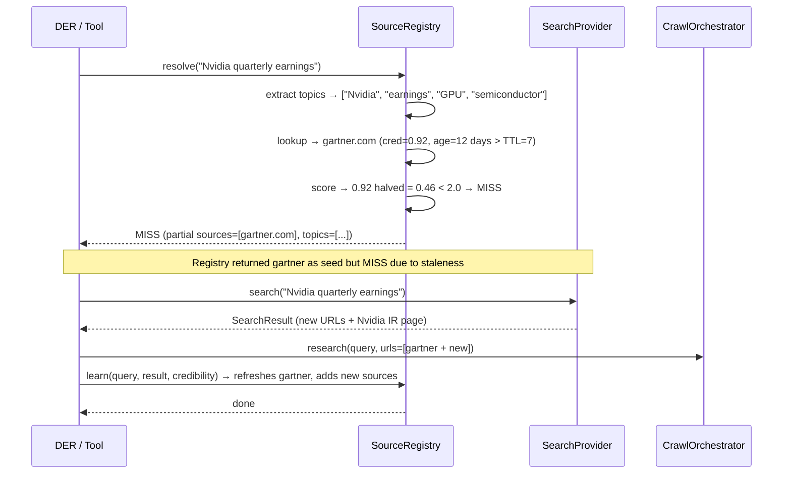

# Design: Exa Search + Smart Source Registry

## Context

IRIS Voice currently generates search URLs via the LLM (Cerebras) or via a
hardcoded DuckDuckGo scrape (now removed). This design adds two layers above
the existing Crawl4AI pipeline:

1. **SearchProvider abstraction** — Exa (and future providers) as pluggable
   search backends for URL discovery.
2. **SourceRegistry** — a learned topic→URL knowledge base stored in semantic
   memory, updated after every crawl, so the system intelligently decides
   whether to search fresh or reuse known sources.

The SourceRegistry connects to three existing memory layers:
- **Semantic memory** (`memory/semantic.py`) — stores topic→URL mappings
  cross-session (category `"source_registry"`).
- **Episodic memory / reference zone** (`memory/episodic.py`, zone `"reference"`)
  — stores per-URL credibility and citation provenance from past crawls.
- **PacmanFragment** (`actions/pacman_fragment.py`) — writes crawl credibility
  and citations to the reference zone; the SourceRegistry reads from it.

**Constraints:**
- API key in `.env` (not git-tracked).
- Provider switchable at runtime.
- `search` tool (quick): ~1s via Exa content directly.
- `crawler_query` tool (deep): Exa URLs → Crawl4AI subprocess.
- SourceRegistry learns automatically — no manual configuration needed.
- All 28 existing crawl tests must still pass.

---

## Architecture Overview

```
┌─────────────────────────────────────────────────────────────────────┐
│                      SOURCE REGISTRY (NEW)                          │
│                                                                     │
│  ┌─────────────────────────────────────────────────────────────┐   │
│  │  SourceRegistry.resolve(query)                                │   │
│  │    ├─ LLM extracts topics                                     │   │
│  │    ├─ SemanticStore.lookup(topic) → known URLs                │   │
│  │    ├─ Reference zone lookup → credibility scores              │   │
│  │    ├─ Compute coverage score (credibility × freshness)        │   │
│  │    └─ Return HIT (sources) or MISS                            │   │
│  └─────────────────────────────────────────────────────────────┘   │
│                        │                                            │
│              ┌─────────┴─────────┐                                  │
│              ▼                   ▼                                  │
│         HIT (cache)          MISS (search)                          │
│              │                   │                                  │
│              ▼                   ▼                                  │
│      CrawlPlan from       SearchProvider.search(query)              │
│      cached URLs              │                                     │
│              │                ▼                                     │
│              │         CrawlOrchestrator                             │
│              │         └─ Crawl4AI subprocess                        │
│              │         └─ extract/cite/score                         │
│              │         └─ CRAWLER_COMPLETE                           │
│              │                │                                     │
│              └──────┬────────┘                                     │
│                     ▼                                               │
│              SourceRegistry.learn(query, result, credibility)        │
│                ├─ Save topic→URL mappings to SemanticStore          │
│                └─ (credibility already in reference zone)           │
└─────────────────────────────────────────────────────────────────────┘
                              │
                              ▼
┌─────────────────────────────────────────────────────────────────────┐
│                      MEMORY LAYER (EXISTING)                        │
│                                                                     │
│  ┌──────────────────┐  ┌────────────────────┐  ┌────────────────┐  │
│  │  Semantic Store  │  │  Episodic / Ref    │  │  Working       │  │
│  │                  │  │                    │  │                │  │
│  │  source_registry │  │  credibility_map   │  │  current       │  │
│  │  topic→URL maps  │  │  citation_index    │  │  conversation  │  │
│  │  (cross-session) │  │  per-URL scores    │  │  (per-thread)  │  │
│  └──────────────────┘  └────────────────────┘  └────────────────┘  │
└─────────────────────────────────────────────────────────────────────┘
```

### File map

| File | Status | Role |
|------|--------|------|
| `backend/crawler/search_providers/__init__.py` | **NEW** | Package init + `get_search_provider()` factory |
| `backend/crawler/search_providers/base.py` | **NEW** | `SearchProvider` ABC, `SearchResult`, `SearchResultItem` |
| `backend/crawler/search_providers/exa.py` | **NEW** | `ExaSearchProvider` — Exa API client |
| `backend/crawler/search_providers/llm.py` | **NEW** | `LLMSearchProvider` — existing `_call_llm` logic |
| `backend/crawler/source_registry.py` | **NEW** | `SourceRegistry` — topic→URL knowledge base, resolve + learn |
| `backend/crawler/crawl_planner.py` | **MODIFIED** | `plan()` delegates to `SourceRegistry` first, then `SearchProvider` |
| `backend/crawler/orchestrator.py` | **MODIFIED** | `research()` calls `SourceRegistry.learn()` after completion |
| `backend/agent/tool_bridge.py` | **MODIFIED** | `_execute_web_search` + `_execute_crawler_query` use registry |
| `backend/memory/semantic.py` | **MODIFIED** | New category `"source_registry"` added to `HEADER_CATEGORIES` |
| `backend/iris_config.json` | **MODIFIED** | New `search.*` config keys |
| `.env` | **MODIFIED** | New `EXA_API_KEY` env var (gitignored) |
| `components/wheel-view/SidePanel.tsx` | **MODIFIED** | "Search" settings section |
| `backend/tests/contract/test_exa_provider.py` | **NEW** | Exa provider contract tests |
| `backend/tests/contract/test_source_registry.py` | **NEW** | SourceRegistry unit tests |
| `backend/tests/integration/test_search_providers.py` | **NEW** | Provider switching + fallback tests |

---

## Data Models

```python
# ── SearchProvider layer ──────────────────────────────────────────────

@dataclass
class SearchResultItem:
    url: str
    title: str = ""
    snippet: str = ""          # highlights / short excerpt
    content: str = ""          # full extracted text (from Exa or Crawl4AI)
    score: float = 0.0         # provider relevance [0, 1]
    published_date: str = ""   # ISO date

@dataclass
class SearchResult:
    query: str
    results: list[SearchResultItem] = field(default_factory=list)
    provider: str = ""          # "exa", "llm"

class SearchProvider(ABC):
    async def search(self, query: str, max_results: int = 10) -> SearchResult: ...

class SearchProviderError(Exception):
    def __init__(self, message: str, retry_after: Optional[float] = None): ...

# ── SourceRegistry layer ──────────────────────────────────────────────

@dataclass
class RegisteredSource:
    """A URL known to be useful for specific topics."""
    url: str
    domain: str                    # bloomberg.com
    topics: list[str]              # ["finance", "market share"]
    credibility: float             # 0-1 weighted running average
    last_crawled: str              # ISO timestamp
    crawl_count: int               # times successfully crawled
    last_error: str = ""           # last error message (if failed)

@dataclass
class ResolveResult:
    hit: bool
    sources: list[RegisteredSource] = field(default_factory=list)
    coverage_score: float = 0.0
    topics: list[str] = field(default_factory=list)

class SourceRegistry:
    """Learned topic→URL mappings, stored in semantic memory."""

    async def resolve(self, query: str) -> ResolveResult:
        """Given a query, determine if known sources suffice."""
        topics = await self._extract_topics(query)          # LLM call
        sources = await self._lookup_topics(topics)         # SemanticStore read
        coverage = self._score_coverage(sources)            # credibility × freshness
        if coverage >= self._threshold:
            return ResolveResult(hit=True, sources=sources, coverage_score=coverage, topics=topics)
        return ResolveResult(hit=False, topics=topics, coverage_score=coverage)

    async def learn(self, query: str, search_result: SearchResult,
                    credibility_map: dict[str, float]):
        """Save successful URLs to the registry."""
        topics = await self._extract_topics(query)
        for item in search_result.results:
            cred = credibility_map.get(extract_domain(item.url), 0.5)
            if cred >= 0.3:
                self._save_entry(item.url, extract_domain(item.url), topics, cred, item)

    async def _extract_topics(self, query: str) -> list[str]:
        """LLM: extract 3-5 key topics from the query."""
        ...

    def _score_coverage(self, sources: list[RegisteredSource]) -> float:
        """Weighted score: credibility × freshness × diversity."""
        ...
```

---

## Sequence Diagrams

### Flow 1: First search on a new topic (MISS → Exa → learn)



### Flow 2: Second search on related topic (HIT → skip search)



### Flow 3: Known topic but stale (partial HIT → merge + search)



---

## Decision Function (resolve algorithm)

```
resolve(query):
  1. LLM: extract_topics(query) → ["topic_a", "topic_b", "topic_c", ...]
  
  2. For each topic, lookup in SemanticStore("source_registry", "topic:<normalized>")
     → List of RegisteredSource[url, domain, credibility, last_crawled, crawl_count]
  
  3. For each source, apply freshness decay:
     age_days = now - last_crawled
     if age_days > TTL (7): credibility *= 0.5    # stale, penalize
     if age_days > TTL * 2: credibility *= 0.1     # very stale, nearly worthless
  
  4. Coverage score = Σ(credibility × log(crawl_count + 1)) for all unique URLs
     (log factor rewards frequently-successful URLs)
  
  5. Topic coverage: what fraction of topics have ≥1 source with credibility > 0.4?
     if topic_coverage < 0.5: coverage *= 0.5   # penalty for partial topic coverage
  
  6. if coverage ≥ threshold (default 2.0): return HIT(sources)
     else: return MISS(seed_sources=sources)     # MISS but pass known URLs as seeds
```

---

## Connection to Mycelium Memory

```
SourceRegistry
  │
  ├── WRITE topic→URL mappings
  │     → SemanticStore.store(category="source_registry", key="topic:<normalized>", value=json)
  │     → Cross-session, survives restarts
  │
  ├── READ topic→URL mappings
  │     → SemanticStore.retrieve(category="source_registry", key="topic:<normalized>")
  │
  ├── READ credibility scores
  │     → EpisodicStore / reference zone → already stored by pacman_fragment.execute()
  │     → query by domain to get historical credibility
  │
  └── WRITE updated credibility (after crawl)
        → Already handled by pacman_fragment.execute() — no change needed
        → SourceRegistry.learn() just reads back from it
```

The SourceRegistry does NOT duplicate credibility data — it reads from the
reference zone at resolve time and writes only the topic→URL mappings to
semantic memory. This keeps the memory framework the single source of truth.

---

## Key Decisions

| # | Decision | Rationale | Alternatives |
|---|----------|-----------|-------------|
| D1 | `SourceRegistry` in semantic memory (category `"source_registry"`) | Cross-session persistence; built-in versioning; no new DB schema | JSON file (not in memory framework); episodic memory (session-scoped) |
| D2 | Topic extraction via LLM (Cerebras) | LLM is already warm; a single cheap classification call | Keyword extract (less accurate); Exa categories (1 extra API call) |
| D3 | Coverage score: weighted sum of credibility × freshness | Simple to compute and tune; single threshold parameter | ML scoring (over-engineered); Boolean logic (too rigid) |
| D4 | Exa for search → Crawl4AI for extraction (deep path only) | Best latency for quick lookups (1s); best thoroughness for deep crawls | Always Crawl4AI (slow for quick queries); always Exa (less thorough) |
| D5 | Fallback chain: SourceRegistry → SearchProvider → LLM → empty | Graceful degradation at every layer | Only one path (brittle) |
| D6 | Credibility from reference zone, not duplicated | Single source of truth for crawl quality data │ | Storing credibility in SourceRegistry (duplicated, stale risk) |
| D7 | Seed URLs passed from MISS ResolveResult | Even partial coverage is useful — known URLs are not discarded | Drop known URLs on MISS (waste of learned knowledge) |

---

## Configuration

### `iris_config.json` additions
```json
{
  ...existing...,
  "search": {
    "provider": "exa",              // "llm" | "exa"
    "registry_threshold": 2.0,      // coverage score threshold for HIT
    "registry_ttl_days": 7,         // days before URL freshness decays
    "enabled": true
  }
}
```

### `.env` addition
```
EXA_API_KEY=sk-your-key-here
```

---

## Error Handling

| Failure | Detection | Response | Recovery |
|---------|-----------|----------|----------|
| Exa API key missing | `EXA_API_KEY` not set | Factory returns `LLMSearchProvider` + log warning | User sets key via UI |
| Exa HTTP 401 (invalid key) | Response status | `SearchProviderError` → fallback to LLM | Log error, user fixes key |
| Exa HTTP 429 (rate limit) | Response + Retry-After | Fallback to LLM, log warning | Auto-retry after window |
| Exa timeout | httpx timeout | Fallback to LLM | Log warning |
| LLM topic extraction fails | LLM returns empty / error | Return empty topic list → MISS (fires search) | Search result still works |
| SemanticStore unavailable | Store read/write exception | Log error, treat as MISS (fires search) | Next resolve retries |
| Stale URL returns 404 | Crawl4AI fails on page | `PageData.error`, credibility penalized ×0.5 | Next crawl → registry drops it |
| Config file missing/corrupt | File not found / parse err | Default to `"llm"`, `registry_threshold=2.0` | Safe fallback |

---

## Testing Strategy

| Tier | What | How | REQ |
|------|------|-----|-----|
| **Unit** | `RegisteredSource`, `ResolveResult`, `SearchResultItem` | Pure data construction | REQ-1 |
| **Unit** | `SourceRegistry._score_coverage()` | Hardcoded inputs → expected score | REQ-11 |
| **Unit** | `SourceRegistry._extract_topics()` mock | Mock LLM returns topics | REQ-11 |
| **Contract** | Exa HTTP payload + response mapping | Mock HTTP server (`pytest-httpx`) | REQ-2, REQ-10 |
| **Contract** | Exa error mapping (401, 429, timeout) | Mock HTTP server | REQ-2, REQ-10 |
| **Contract** | `LLMSearchProvider` preserves `_call_llm` behavior | Mock LLM client | REQ-6 |
| **Contract** | `SourceRegistry.resolve` HIT vs MISS | Pre-populate semantic store, assert HIT/MISS | REQ-11, REQ-12 |
| **Contract** | `SourceRegistry.learn` stores correct data | Mock SearchResult + credibility, verify store reads | REQ-13 |
| **Contract** | Freshness decay: TTL-aged URL scores halved | Set TTL=1, source age=2 days, assert score halved | REQ-14 |
| **Integration** | `CrawlPlanner.plan()` with SourceRegistry HIT | Registry returns URLs → plan has URLs, no Exa | REQ-12 |
| **Integration** | `CrawlPlanner.plan()` with SourceRegistry MISS | Registry MISS → plan calls Exa | REQ-12 |
| **Integration** | Fallback chain: Exa → LLM → empty | Exa mock raises, verify LLM called | REQ-9 |
| **Integration** | Seed URLs from partial HIT | Registry returns partial + MISS → plan includes seeds + new | REQ-12 |
| **Integration** | `_execute_web_search` HIT → returns cached content | Registry HIT, verify No Exa/Crawl4AI called | REQ-4, REQ-12 |
| **Existing** | All 28 crawl tests still pass | Existing test suite | ALL |
