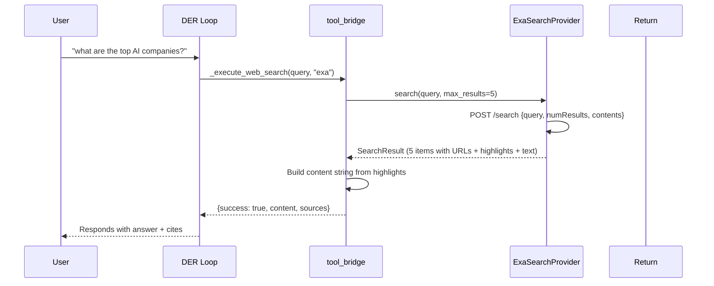
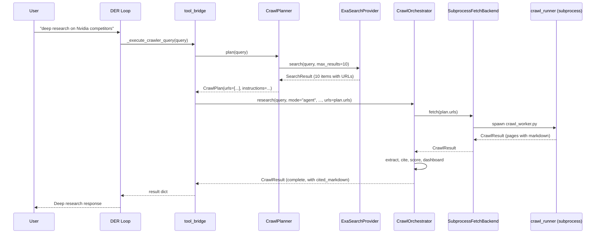
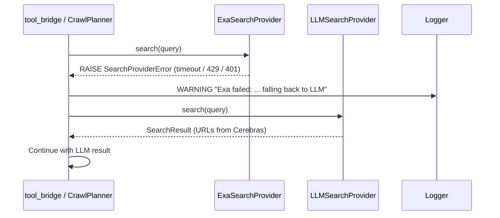

# Design: Exa Search Provider Integration

## Context

IRIS Voice currently generates search URLs via the LLM (Cerebras) using a
prompt that asks for authoritative URLs (`CrawlPlanner._call_llm`). This is
free but depends on the LLM's parametric knowledge — it cannot discover new
or obscure pages. Exa provides a neural embedding search API that finds pages
by *meaning*, includes built-in content extraction (highlights + full text),
and returns results in ~1s. This design adds Exa as a **configurable,
drop-in replacement** for the URL-generation step, while keeping the existing
Crawl4AI subprocess pipeline for deep content extraction.

**Constraints:**
- API key must not be in git-tracked files (matches `PICOVOICE_ACCESS_KEY` in `.env`).
- Provider must be switchable at runtime (no restart).
- The `search` tool (quick lookup) should be fast (~1s) — use Exa content directly.
- The `crawler_query` tool (deep crawl) should use Crawl4AI for full extraction.
- All 28 existing crawl tests must still pass.

---

## Architecture Overview

```
┌───────────────────────────────────────────────────────────────────────┐
│                      SEARCH PROVIDER LAYER (NEW)                     │
│                                                                       │
│  SearchProvider (ABC) ←──── LLMSearchProvider (existing _call_llm)   │
│       ▲                    └─── ExaSearchProvider (new — Exa API)     │
│       │                    └─── BraveSearchProvider (future)           │
│       │                    └─── TavilySearchProvider (future)          │
│       │                                                               │
│  search(query, max_results) → SearchResult { items[] }               │
└───────────────────────┬───────────────────────────────────────────────┘
                        │
          ┌─────────────┴─────────────┐
          │                           │
          ▼                           ▼
┌──────────────────┐      ┌──────────────────────────────┐
│  search TOOL     │      │  crawler_query TOOL          │
│  (quick lookup)  │      │  (deep research)             │
│                  │      │                              │
│  Exa → content   │      │  Exa → URLs → CrawlPlan     │
│  ↓               │      │                ↓             │
│  return text     │      │  CrawlOrchestrator           │
│                  │      │  └─ Crawl4AI subprocess      │
└──────────────────┘      │  └─ extract/cite/score      │
                          │  └─ CRAWLER_COMPLETE         │
                          └──────────────────────────────┘
```

### File map (new/changed)

| File | Status | Role |
|------|--------|------|
| `backend/crawler/search_providers/__init__.py` | **NEW** | Package init, factory function `get_search_provider()` |
| `backend/crawler/search_providers/base.py` | **NEW** | `SearchProvider` ABC, `SearchResult`, `SearchResultItem`, `SearchProviderError` |
| `backend/crawler/search_providers/exa.py` | **NEW** | `ExaSearchProvider` — Exa API client |
| `backend/crawler/search_providers/llm.py` | **NEW** | `LLMSearchProvider` — moves `_call_llm` + `_parse` + `_fallback_plan` from `crawl_planner.py` |
| `backend/crawler/crawl_planner.py` | **MODIFIED** | `CrawlPlanner.plan()` delegates to active `SearchProvider` |
| `backend/crawler/orchestrator.py` | **MODIFIED** | `CrawlOrchestrator` passes `session_id` to planner for provider selection |
| `backend/agent/tool_bridge.py` | **MODIFIED** | `_execute_web_search` uses `SearchProvider` directly when Exa is active |
| `backend/iris_config.json` | **MODIFIED** | New `search.provider` config key |
| `.env` | **MODIFIED** | New `EXA_API_KEY` env var (gitignored) |
| `components/wheel-view/SidePanel.tsx` | **MODIFIED** | New "Search" section with provider dropdown + API key input |
| `hooks/useSettings.ts` or equivalent | **MODIFIED** | New WS message types for saving search config |
| `backend/tests/contract/test_exa_provider.py` | **NEW** | Contract tests for ExaSearchProvider |
| `backend/tests/integration/test_search_providers.py` | **NEW** | Integration tests for fallback + provider switching |

---

## Data Models

```python
# backend/crawler/search_providers/base.py

from dataclasses import dataclass, field
from abc import ABC, abstractmethod
from typing import Optional


@dataclass
class SearchResultItem:
    """One search result from any provider."""
    url: str
    title: str = ""
    snippet: str = ""          # Short excerpt (for quick display)
    content: str = ""          # Full extracted text (for deep use)
    score: float = 0.0         # Relevance score [0, 1] from provider
    published_date: str = ""   # ISO date string or empty
    metadata: dict = field(default_factory=dict)  # Provider-specific extras


@dataclass
class SearchResult:
    """Normalised result from any SearchProvider."""
    query: str
    results: list[SearchResultItem] = field(default_factory=list)
    provider: str = ""          # "exa", "llm", etc.
    total: int = 0              # Total results available (if known)


class SearchProviderError(Exception):
    """Raised when a search provider fails (auth, rate-limit, timeout, etc.)."""
    def __init__(self, message: str, retry_after: Optional[float] = None):
        super().__init__(message)
        self.retry_after = retry_after


class SearchProvider(ABC):
    """Abstract base for all search backends."""

    @abstractmethod
    async def search(self, query: str, max_results: int = 10) -> SearchResult:
        ...
```

---

## Sequence Diagrams

### Flow A: `search` tool with Exa (quick lookup)



### Flow B: `crawler_query` tool with Exa + Crawl4AI (deep crawl)



### Flow C: Fallback when Exa fails



---

## Key Decisions

| # | Decision | Rationale | Rejected alternatives |
|---|----------|-----------|----------------------|
| D1 | `SearchProvider` ABC with `search(query, max_results)` | Single uniform interface for all providers. New provider = one class. | Making `CrawlPlanner` call Exa directly (tight coupling). |
| D2 | `search` tool uses Exa content directly (no Crawl4AI) | ~1s vs ~30s latency for quick lookups. Exa content is sufficient for snippets. | Always routing through Crawl4AI (slow for quick questions). |
| D3 | `crawler_query` uses Exa URLs + Crawl4AI extraction | Best of both: Exa's semantic URL discovery + Crawl4AI's thorough extraction. | Only using Exa content (less thorough than Crawl4AI). |
| D4 | API key in `.env` (not keyring) | Matches `PICOVOICE_ACCESS_KEY` pattern. Simple, no additional deps. | OS keyring (more complex, no existing pattern). |
| D5 | Fallback chain: Exa → LLM → empty | Graceful degradation. LLM is free and always available. | Fail open (return error) — bad UX; fail closed (no search) — worse. |
| D6 | Runtime config from `iris_config.json` | Config changes take effect immediately on next search. No restart. | Environment variable only (requires restart to change). |
| D7 | Exa `type: "auto"` (default search mode) | Best balance of speed (~1s) and quality. Exa's neural search used. | `deep` mode (4-15s, overkill for most queries). |

---

## Error Handling

| Failure | Detection | Response | Recovery |
|---------|-----------|----------|----------|
| Exa API key missing | `EXA_API_KEY` env var not set | `ExaSearchProvider.__init__` raises `ValueError` | Factory catches, logs warning, returns `LLMSearchProvider` |
| Exa HTTP 401 (invalid key) | `httpx` response status | `SearchProviderError("invalid API key")` | Fall back to LLM, log error |
| Exa HTTP 429 (rate limited) | `httpx` response status + `Retry-After` header | `SearchProviderError("rate limited", retry_after=N)` | Fall back to LLM, log warning |
| Exa HTTP 5xx / timeout (30s) | `httpx` raises / timeout | `SearchProviderError("upstream timeout")` | Fall back to LLM |
| Exa returns non-JSON | `json.JSONDecodeError` | `SearchProviderError("unexpected response")` | Fall back to LLM |
| Exa returns empty results | Response JSON `results: []` | Return `SearchResult` with empty items (not error) | N/A — caller sees "no results" |
| Both Exa + LLM fail | LLM also returns empty | Empty plan → orchestrator emits `CRAWLER_ERROR` | Normal existing behavior |
| Config file missing/corrupt | File not found / parse error | Default to `"llm"` with log warning | Safe fallback |

---

## Configuration Schema

### `iris_config.json` addition

```json
{
  ...existing keys...,
  "search": {
    "provider": "exa",
    "enabled": true
  }
}
```

### `.env` addition

```
EXA_API_KEY=sk-your-key-here
```

### Frontend Settings UI shape

```
Search Settings
┌─────────────────────────────────────┐
│ Search Provider: [LLM ▼]            │
│                                     │
│ (if Exa selected):                  │
│ Exa API Key: [•••••••••••••••]     │
│ [Save API Key]                      │
└─────────────────────────────────────┘
```

---

## Testing Strategy

| Tier | What | How | REQ |
|------|------|-----|-----|
| **Unit** | `SearchResult`, `SearchResultItem`, `SearchProviderError` | Pure data construction | REQ-1 |
| **Contract** | Exa HTTP payload shape + response mapping | Mock HTTP server (`pytest-httpx` or `respx`) | REQ-2, REQ-10 |
| **Contract** | Error mapping (401, 429, timeout, non-JSON) | Mock HTTP server returns error status codes | REQ-9, REQ-10 |
| **Contract** | `LLMSearchProvider` preserves existing `_call_llm` behavior | Mock LLM client | REQ-6 |
| **Integration** | `CrawlPlanner.plan()` delegates to configured provider | Test with real config + mock providers | REQ-3, REQ-5 |
| **Integration** | Fallback chain: Exa → LLM → empty | Exa mock raises, verify LLM called | REQ-9 |
| **Integration** | `_execute_web_search` with Exa returns correct shape | Mock `ExaSearchProvider.search()` | REQ-4 |
| **Integration** | Frontend saves API key → backend stores in `.env` | Trigger WS save, verify file | REQ-7, REQ-8 |
| **Existing** | All 28 crawl tests still pass (contract + transport + integration + behavioral) | Existing test suite | ALL |

---

## Data Flow Diagram (full request lifecycle)

```mermaid
flowchart TB
    CFG["iris_config.json<br/>search.provider"] --> FACT["get_search_provider()<br/>factory"]
    CFG -->|`"exa"`| EXA["ExaSearchProvider"]
    CFG -->|`"llm"`| LLM["LLMSearchProvider"]

    FACT --> CONTROLLER{Which endpoint?}

    CONTROLLER -->|search tool| SEARCH["_execute_web_search"]
    CONTROLLER -->|crawler_query| DEEP["_execute_crawler_query"]

    SEARCH -->|Exa active| EXA_SEARCH["Exa.search(query)"]
    EXA_SEARCH -->|fails| FALLBACK["Fall back to LLM.search"]
    EXA_SEARCH -->|succeeds| SEARCH_RESULT["Build result from<br/>highlights + URLs"]
    SEARCH -->|LLM active| LLM_CRAWL["CrawlOrchestrator.research()"]
    SEARCH_RESULT --> TOOL_RETURN["Return to DER loop"]
    LLM_CRAWL --> TOOL_RETURN

    DEEP --> PLAN["CrawlPlanner.plan(query)"]
    PLAN -->|uses| CONTROLLER
    PLAN --> CRAWL["CrawlOrchestrator.research()"]
    CRAWL --> CRAWL4AI["Crawl4AI subprocess<br/>+ extract/cite/score"]
    CRAWL4AI --> DASHBOARD["Emit CRAWLER_STARTED,<br/>PAGE_FETCHED, CRAWLER_COMPLETE"]
    DASHBOARD --> TOOL_RETURN
```
