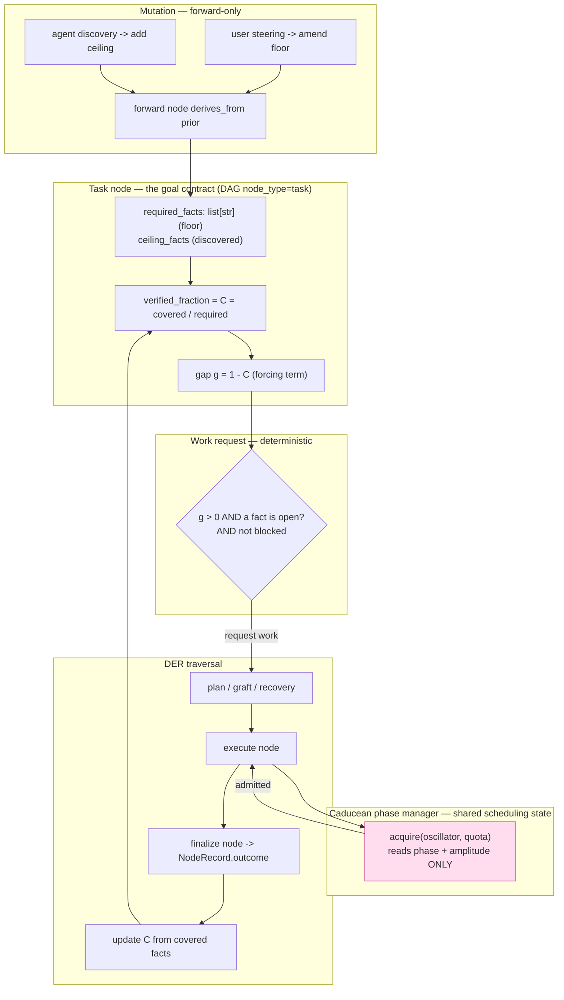
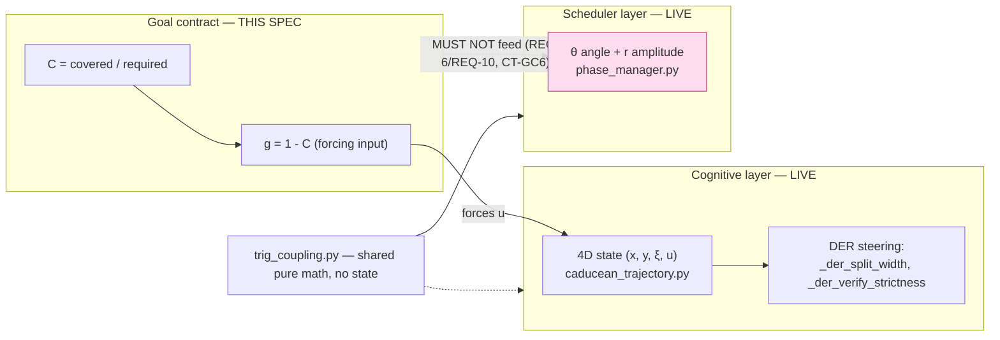
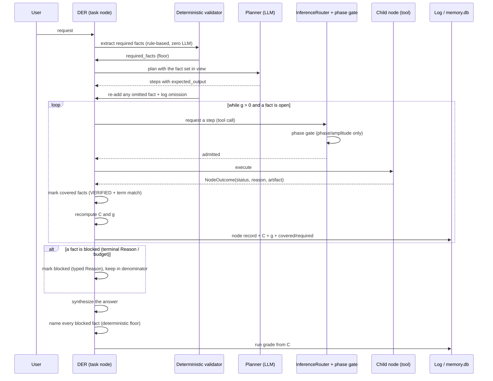

# Design: Goal Contract & DAG Coverage

## Context

The turn ends when the step queue empties, not when the goal is met. Four independent LLM decisions (plan, tool resolve, URL generation, synthesis) each decide alone, and no shared goal state exists, so the same prompt produced five outcomes live (D3/D7/D8/D9/D10, `.iris-logs/backend-20260911-*`). The tool-result-envelope spec built the per-step substrate — `match`, `criticality`, `verified_fraction`, `evaluate_streak`, `evaluate_run_grade`. It did not wire a goal-level coverage signal into the loop condition, and the run grade reads step envelopes only, so a failed step (which produces no envelope) cannot lower the grade.

Two constraints bound this design:

- **Physics over gates.** The repository's own rule: *prefer a continuous function of the physics signal over a threshold* (`specs/der-dag-inversion/design.md` §5). Coverage must be a fraction the existing graded-steering code consumes, not a new boolean branch.
- **The DAG DER is the substrate.** Execution is a forward-only traversal over a memory DAG; nodes are immutable once frozen; recovery spawns a NEW node carrying `derives_from` to the frozen parent (`backend/agent/der_links.py:14`). The contract must be a projection of that DAG, not a second system beside it.

## Architecture Overview

The goal contract is the **task node's** record. Coverage is the task node's `verified_fraction`. The gap `g = 1 − C` requests work; the Caducean phase gate admits work. The two gates are ANDed and orthogonal.



The phase manager is on the model-call path only. It never reads `RF`, `C`, or `G`. That is the §5 rule and it is pinned by a contract test.

### Phase-layer placement (no new layer)

Three phase-bearing layers already exist. This spec adds a **forcing input to the cognitive layer**; it adds no layer, no oscillator, and no state variable.



Read the arrows literally:

- `G` → `u`: the goal contract **drives** the cognitive layer. That is its only coupling.
- `GOAL` ⇢ `SCHED`: **forbidden**. The scheduler must not read goal or cognitive state (`docs/CADUCEAN_CONCURRENCY_MODEL.md` §5).
- `trig_coupling.py` is shared math, not shared state.

The layers are different dimensional systems — 4D cognitive, 2D scheduler (θ, r), and the cross-session coupling layer (OFF). They govern different questions in parallel. They are **not** one merged state, and the scheduler's separation is enforced by contract.

## Sequence / Data Flow



## Data Models

**NodeRecord extension** (`backend/agent/der_loop.py:74-189`) — additive, bounded:

```python
# NEW fields on the existing NodeRecord dataclass
required_facts: List[str] = field(default_factory=list)   # floor — task node only
ceiling_facts: List[str] = field(default_factory=list)     # discovered, never blocking
covered_facts: List[str] = field(default_factory=list)     # subset of required, VERIFIED
blocked_facts: List[Dict[str, str]] = field(default_factory=list)
#   each: {"fact": <text>, "reason": <Reason value>, "evidence": <short>}
contract_version: int = 1        # increments on every amendment
```

`expected_output: str` stays the human-readable summary. `verified_fraction` is reused unchanged as the coverage carrier.

**GoalContract (pure functions, no class state)** — `backend/agent/goal_contract.py` (NEW):

```python
@dataclass(frozen=True)
class Contract:
    required: tuple[str, ...]        # floor
    ceiling: tuple[str, ...] = ()    # discovered
    version: int = 1

@dataclass(frozen=True)
class Coverage:
    covered: tuple[str, ...]
    blocked: tuple[tuple[str, str], ...]   # (fact, reason)
    required_n: int
    ceiling_n: int
    C: float                               # covered / required, 0..1
    g: float                               # 1 - C
    rho: float = 0.0                       # ΔC / (g · Δs) — progress ratio; stall when < GOAL_STALL_RATE
    ds: float = 0.0                        # work spent this cycle (tokens)
```

Pure API (deterministic, zero LLM, unit-testable):

- `extract_required(request: str) -> tuple[str, ...]` — rule-based fact extraction.
- `map_to_steps(facts, steps) -> tuple[str, ...]` — returns omitted facts (validator re-add).
- `mark_coverage(contract, node_outcomes, results) -> Coverage` — set-union coverage; VERIFIED + term match.
- `progress_ratio(prev_c: float, new_c: float, g: float, ds: float) -> float` — `ΔC / (g · Δs)`; the stall signal. A slow-but-progressing cycle keeps `ρ` above the line; a no-progress cycle falls below it.
- `amend(contract, *, add=(), remove=(), source, reason) -> Contract` — floor protection enforced here.
- `add_ceiling(contract, facts) -> Contract` — capped, never blocks.
- `is_blocked(reason: Reason) -> bool` — via `nodes/outcome.py` terminal vocabulary, plus `APPROVAL_UNAVAILABLE`.

**Amendment record** — written as a forward node with `derives_from` (existing `DerLinkWriter.link_*`, `der_links.py:41`). Payload: `{who, when, why, add, remove, version_from, version_to}`.

## Key Decisions

**KD-1 — The contract is the task node, not a new store.**
Default: a separate `goal_contract` table + service.
Why the default exists: it is the obvious place to put mutable state.
Alternatives: (a) new table/service; (b) task node fields; (c) prompt-only tracking.
Chosen: **(b)**. It reuses the DAG's node identity, `verified_fraction`, and edge vocabulary; the scoreboard is a read of the DAG; memory.db stays the durable record. (a) adds a store with no reader for its edges and splits the truth. (c) is the current behavior and is exactly what fails.
Cost: `NodeRecord` grows by five bounded fields. All are additive with defaults, so every existing constructor is unaffected.

**KD-2 — Coverage is a continuous fraction, not a gate.**
Default: `if covered == required: stop`.
Why the default exists: it is simple to read.
Alternatives: (a) boolean gate; (b) continuous fraction consumed by existing physics; (c) score with weights.
Chosen: **(b)**. `_der_split_width` (`agent_kernel.py:11555`) already consumes a continuous `verified_fraction`; `evaluate_streak`'s idling shape (`tool_envelope.py:910`) already detects an unmoved fraction. Feeding `C` into those makes termination a convergence, and makes a stalled goal visible as a flat line. This is the repository's own §10.2 rule.
Rejected: (a) hides failure behind a branch and is the current gap; (c) needs weights with no measured basis.

**KD-3 — The gap `g = 1 − C` is the forcing term, so termination is physics convergence.**
Default: a loop `while`-condition on coverage.
Alternatives: (a) while-loop condition; (b) gap as a forcing amplitude on the existing oscillator; (c) a fixed extra-steps budget.
Chosen: **(b)** with (a) as the literal guard. As `C → 1`, `g → 0`, the driving force vanishes and `u` settles to its attractor — the existing termination. No new termination authority is created. (c) spends a fixed budget regardless of the goal.
Cost: the forcing gain needs a constant (`GOAL_FORCING_GAIN`, UNVERIFIED) and live tuning.

**KD-4 — Floor immutable to the agent; ceiling free; forward-only amendments.**
Default: one mutable goal list.
Why the default exists: simplest to implement.
Alternatives: (a) one mutable list; (b) floor/ceiling split with a protected floor; (c) planner-owned contract.
Chosen: **(b)**. A single mutable list lets the agent lower its own bar — the exact D3 failure. Protection is a property of the mutator, not of the agent's goodwill: `amend` refuses agent-sourced removals of floor facts. (c) is the current behavior and dropped 3 of 4 asks.
Cost: two lists and a source field on every amendment.

**KD-5 — The phase manager is the shared scheduling state and stays orthogonal.**
Default: let the scheduler read goal urgency to prioritize open facts.
Why the default is tempting: it seems efficient.
Alternatives: (a) scheduler reads goal state; (b) orthogonal gates ANDed; (c) goal state replaces the scheduler.
Chosen: **(b)**. `docs/CADUCEAN_CONCURRENCY_MODEL.md` §5 forbids the scheduler from consuming a signal correlated across the things it keeps apart; two sessions that think alike would schedule alike. (a) breaks the de-correlation guarantee and looks fine until it fails. (c) removes provider-collision safety.
Cost: the two gates must both be consulted; a small amount of glue.

**KD-6 — Deterministic extraction, planner mapping, deterministic validator.**
Default: planner-only declaration.
Alternatives: (a) planner-only; (b) deterministic extraction only; (c) deterministic extraction + planner mapping + validator.
Chosen: **(c)**. The deterministic extractor guarantees the fact exists; the planner maps it to real steps (flexibility); the validator re-adds anything dropped. (a) is the current behavior; (b) cannot map facts to tool steps.

**KD-7 — Run grade from coverage, with blocked facts named.**
Default: grade from step envelopes (current).
Alternatives: (a) step envelopes; (b) coverage + blocked list; (c) model-judged grade.
Chosen: **(b)**. A failed step produces no envelope today, which is why D7 graded pass. Coverage is denominator-shaped, so a blocked fact cannot raise `C`. (c) is a model voting on its own work.

**KD-8 — Stall is a rate, not a step count.**
Default: `GOAL_STALL_N` = N unchanged-`C` nodes before idling (the original draft).
Why the default exists: a count is trivial to implement.
Alternatives: (a) fixed count `N`; (b) gap-scaled count `N = f(g)`; (c) dimensionless rate `ρ = ΔC / (g · Δs)`.
Chosen: **(c)**, with (b) as a fallback only if measurement shows the rate is noisy. A count is blind to how much work each node cost and how far from the goal the run is. The rate makes patience shrink as the gap grows: far from the goal, one wasted cycle fails fast; near the goal, a slow-but-progressing cycle keeps its patience. This is the "speed into accuracy" target — maximize `dC/ds`, not speed.
Rejected: (a) burns budget far from the goal; (b) quantizes the same signal the rate already carries continuously.
Cost: `GOAL_STALL_RATE` (`ρ_min`) needs live tuning; the rate needs `Δs` (work spent) to be measured per cycle, which the token accounting already provides.

**KD-9 — A step that cannot run fails fast; simple writes auto-approve, shell stays gated.**
Default: wait for the permission timeout, then fail (current behavior).
Why the default exists: the approval flow assumes a human is present.
Alternatives: (a) wait for timeout; (b) hardcode "never use shell"; (c) detect un-attendable approval before dispatch and settle with a typed `Reason`.
Chosen: **(c)**. (a) burned 162 s in D1/D11 and crashed. (b) is exactly the tool-specific tailoring the vast-domain lock forbids, and shell is correct in some situations. (c) keeps the planner free to choose any tool and makes the system honest about a choice it cannot fulfill.
Rejected: (a) wastes budget and hides the failure; (b) narrows the vast domain.
Cost: a new closed-vocabulary member `APPROVAL_UNAVAILABLE` and one pre-dispatch check. Distinguished from `PERMISSION_DENIED` (policy refused) and `UNAVAILABLE` (backing service absent) so the loop reroutes or blocks correctly.

**Consent decision (session-327, owner, final):** an **Auto-approve toggle** becomes the consent authority, separate from mode. ON: reads, writes, shell commands, and GUI actions auto-approve in both modes. OFF: writes and shell ask; reads stay auto. **Destructive and deletion/removal commands stay gated at all times.** This supersedes the earlier "keep shell gated" choice: the terminal/GUI tools leave `_ALWAYS_ASK_TOOLS` (`permissions.py:191`) and come under the toggle; only the DESTRUCTIVE tier stays in the always-gate set. The shell safety net is the destructive-command detector (`_DESTRUCTIVE_PARAM_PATTERNS`, `permissions.py:274`), which this spec requires to cover deletion/removal command forms.

**KD-10 — The goal contract reuses the cognitive layer; it adds no phase layer.**
Default: treat "phase" as one thing and wire the goal into whatever phase is nearest.
Why the default is tempting: the word "phase" appears in several modules, so they look like one system.
Alternatives: (a) one merged phase state; (b) a new goal-phase layer; (c) a forcing input to the existing cognitive layer, scheduler untouched.
Chosen: **(c)**. The cognitive layer already carries `u` and the DER steering already consumes it (`_der_split_width`, `_der_verify_strictness`); the gap `g` is a forcing input to that existing state. (a) breaks the scheduler's de-correlation guarantee (`docs/CADUCEAN_CONCURRENCY_MODEL.md` §5, CT-3/CT-4) — two sessions that think alike would schedule alike. (b) adds a fourth state variable with no consumer and a second termination authority.
Rejected: (a) destroys the scheduler's only job; (b) is a layer with no reader.
Cost: none beyond the taxonomy statement and CT-GC11. The distinction must be written down or a future edit will merge the layers.

**KD-11 — A fail-fast is a failure and must teach.**
Default: settle the step and move on.
Why the default is tempting: the step never reached the tool, so it looks like "no failure happened."
Alternatives: (a) settle silently; (b) route the fail-fast through the normal `execute_tool` path just to be typed; (c) emit the FAULTLINE canonical shape at the pre-dispatch site and feed the same learning hooks.
Chosen: **(c)**. (a) is the decoration FAULTLINE §11 forbids — the agent would never learn that this mediator failed in this region. (b) would dispatch a tool that cannot run, which is the hang we are removing. (c) keeps the short-circuit and still teaches.
Rejected: (a) silent failure; (b) re-introduces the hang.
Cost: the pre-dispatch site must build the canonical shape and call the learning hooks directly. `APPROVAL_UNAVAILABLE` is a DATA registration, not a branch.

**KD-12 — Consent is a separate control from capability.**
Default: let the mode decide approval (current `get_permission_action(tier, level)`).
Why the default exists: it was the first place a mode was available.
Alternatives: (a) mode decides approval; (b) "permission toggle off = everything auto-approves"; (c) a separate Auto-approve toggle, mode governs capability only.
Chosen: **(c)**. (a) is the current coupling and is why "developer mode requires approval for writes" felt wrong. (b) is dangerous: switching to Personal to *restrict* access would also remove all oversight — the user asks for less access and gets less consent. (c) makes each control answer one question: mode = which doors, toggle = whether a guard watches.
Rejected: (a) conflates two questions; (b) inverts the user's intent on the restrictive path.
Cost: a config flag, one toggle in `PermissionsSettingsCard`, and `get_permission_action` takes `auto_approve` instead of `level`. The always-gate set shrinks to the DESTRUCTIVE tier; the destructive-command detector must be strengthened to cover deletion/removal forms, or shell becomes an unguarded deletion path.

## Ripple-Effect Map (MANDATORY)

| Area / File | Change? | Classification | Why / Evidence |
|---|---|---|---|
| `backend/agent/der_loop.py:74-189` (`NodeRecord`) | Yes | CHANGE NEEDED | Add five bounded fields (`required_facts`, `ceiling_facts`, `covered_facts`, `blocked_facts`, `contract_version`). Additive with defaults; `expected_output` and `verified_fraction` unchanged. |
| `backend/agent/goal_contract.py` | Yes | CHANGE NEEDED | NEW — pure `Contract`/`Coverage`, `extract_required`, `map_to_steps`, `mark_coverage`, `amend`, `add_ceiling`. Zero LLM, zero I/O. |
| `backend/agent/agent_kernel.py:8116 _execute_plan_der` | Yes | CHANGE NEEDED | Build the contract at plan start; request work while `g>0`; recompute `C` at finalize. Smallest incision — the loop scaffold already exists. |
| `backend/agent/agent_kernel.py:14829 _der_finalize_step` | Yes | CHANGE NEEDED | Mark covered facts, stamp `C` onto the task node, log `C/g`. |
| `backend/agent/agent_kernel.py:16305 _der_plan_next_step` | Yes | CHANGE NEEDED | Answer `done` from `C` and open facts, not only queue state; carry `g`. |
| `backend/agent/agent_kernel.py:12736 _der_synthesize_success_outcome` / `12671 _der_synthesize_outcome` | Yes | CHANGE NEEDED | Final answer must name every blocked fact; the deterministic summary is the floor. |
| `backend/agent/agent_kernel.py:5679 _der_report_run_grade` | Yes | CHANGE NEEDED | Grade from `C` + blocked list, not only step envelopes. |
| `backend/agent/agent_kernel.py:9883 _der_check_steering` / `10447 _der_apply_steering` | Yes | CHANGE NEEDED | Route user steering through `amend` (source=user). |
| `backend/agent/agent_kernel.py:10634 _der_amend_graph` | Yes | CHANGE NEEDED | Write the forward amendment node (`derives_from`). |
| `backend/agent/der_links.py:41 DerLinkWriter` | No | CONTRACT LOCK | `derives_from` already exists (`:14`); the amendment reuses it. CT-GC4 pins the edge. |
| `backend/agent/nodes/outcome.py:40-76` | Yes | CHANGE NEEDED | Add `Reason.APPROVAL_UNAVAILABLE` (REQ-9 AC9.2) — distinct from `PERMISSION_DENIED` (policy refused) and `UNAVAILABLE` (service absent). Existing members unchanged. |
| `backend/agent/tool_envelope.py:910 evaluate_streak` | Yes (minor) | CHANGE NEEDED | The idling shape consumes `C`; no new shape needed. CT-GC5 pins the input. |
| `backend/agent/tool_envelope.py:969 evaluate_run_grade` | Yes (minor) | CHANGE NEEDED | Accept coverage input; keep the envelope reasons. |
| `backend/agent/inference/router.py:977-980` | No | CONTRACT LOCK (CT-GC6) | The phase gate stays the single scheduling chokepoint; it must not read goal state. |
| `backend/agent/phase_manager.py` | No | NO CHANGE (verified) | The gate API (`acquire`) is unchanged; orthogonality is a property of the caller. |
| `backend/agent/caducean_trajectory.py:1-14` | No | CONTRACT LOCK (CT-GC11) | The cognitive 4D layer is the goal contract's only phase coupling; its recorded shape is unchanged. |
| `backend/agent/coupled_registry.py:1-40` | No | NO CHANGE (verified) | The cross-session coupling layer is OFF and untouched; the goal contract neither reads nor writes it. |
| `backend/agent/der_constants.py` | Yes | CHANGE NEEDED | `GOAL_REQUIRED_FACTS_CAP`, `GOAL_CEILING_CAP`, `GOAL_STALL_RATE` (retires `GOAL_STALL_N`), `GOAL_FORCING_GAIN` (all UNVERIFIED starting points). |
| `backend/agent/tool_bridge.py` (dispatch path) | Yes | CHANGE NEEDED | REQ-9: detect an un-attendable approval before dispatch and settle with `Reason.APPROVAL_UNAVAILABLE` — never wait the 120 s timeout. REQ-11: emit the FAULTLINE canonical shape at the pre-dispatch site and feed `_record_tool_event` (`:1799`) + the learning hooks, since the short-circuit bypasses `normalize_failure` (`:1183-1184`). The permission matrix is untouched. |
| `backend/agent/tool_errors.py` | Yes | DATA EDIT | REQ-11 AC11.2: `register_error_label("approval_unavailable", retryable="maybe", blame="world", info_state="blocked", ...)` — a DATA edit per FAULTLINE Layer 2, never a new branch. |
| `backend/agent/permissions.py:348-369` | Yes | CHANGE NEEDED | REQ-9 AC9.4: `get_permission_action` takes `auto_approve` instead of `level`; the toggle governs reads/writes/shell/GUI. `_ALWAYS_ASK_TOOLS` (`:191`) shrinks to the DESTRUCTIVE tier. The destructive detector (`:274`) grows deletion/removal forms (AC9.6). CT-GC10 pins the new behavior. |
| `backend/capabilities.py:56-68` | No | CONTRACT LOCK (CT-GC10) | `CapabilitySet._TERMINAL_TOOLS` still governs **capability** (personal has no terminal; developer does). It no longer feeds always-ask. CT-GC10 pins that capability and consent stay separate. |
| `backend/tests/contract/`, `tests/behavioral/`, `tests/unit/` | Yes | CONTRACT LOCK | New CT-GC1..CT-GC8 + BT-GC1..BT-GC5; existing suites stay green. |
| `scripts/validate_goal_coverage.py` | Yes | CHANGE NEEDED | NEW standing CDD harness — replays recorded trajectories, asserts coverage + blocked naming. |
| Frontend | No new component | CONTRACT LOCK (CT-GC12) | REQ-12: the existing `PermissionCard` renders `APPROVAL_UNAVAILABLE` honestly; the `personal`/`developer` toggle stays the matrix authority; "approval UI attached" uses existing WS presence. No new component. |
| `hooks/useIRISWebSocket.ts:1705-1719` | No | CONTRACT LOCK (CT-GC12) | The permission event forward-set (`permission:request/granted/denied`) must stay complete; the fail-fast path adds no new event type. |
| `components/chat/PermissionCard.tsx` | No | CONTRACT LOCK (CT-GC12) | The approval UI is the "attached" signal's counterpart; its props/shape are unchanged. |
| `components/chat/PermissionsSettingsCard.tsx` | Yes | CHANGE NEEDED | REQ-12 AC12.4: add the Auto-approve toggle next to the mode segmented control (`:194`); the card already re-fetches `/api/config` after a change (`:84`). Mode remains the capability authority (AC12.3). |

**Ripple note (surfaced, not silently widened):** the "planner picks `run_command` over `list_directory`" observation is **situation dependent** and is NOT a tool-specific patch. Two general properties follow. (1) **Fail-fast on un-runnable steps** is IN scope as REQ-9 — the D1/D11 hang was the real defect, not the planner's choice. (2) **Capability advertisement** — a tool must describe what it can do well enough for the planner to choose correctly across vast domains — is a general registry-quality concern and remains a separate spec. No requirement here tailors behaviour to a specific tool or task shape.

## Error Handling

| Failure | Response |
|---|---|
| Extraction finds no fact | Fallback fact = request summary; logged degenerate (AC1.6). |
| Planner omits a fact | Validator re-adds it; omission logged (AC1.3). |
| Coverage computation raises | `C` stays at its last value; grade is `unavailable`; never silently pass (AC8.x edge). |
| `C` unmoved across N nodes | Idling shape → `try_different`/replan (AC3.4). |
| Fact blocked by terminal `Reason` | Kept in denominator; named in answer; never retried (AC5.1/5.2/5.3). |
| Answer omits a blocked fact | Deterministic summary replaces it (AC5.4). |
| Phase manager fails | Admit the call (no scheduling); log; never an outage (AC6.4). |
| Chosen tool cannot run (no approval UI) | Settle `APPROVAL_UNAVAILABLE` before dispatch; reroute or block the fact; never wait the timeout (AC9.1/9.3). |
| Stall ratio `ρ` computation fails | Treat as not-stalled this cycle (patience), log; never a false fail-fast. |
| Amendment after finalize | Recorded as a new turn; never applied retroactively (AC4 edge). |
| Logging failure | Detached; never affects the turn. |

## Testing Strategy

This system is ONE recursive operator at four scales; bugs live in the SEAMS. Organize:

```
tests/unit/         pure logic only (no I/O, no cross-layer)
tests/contract/     boundary pins (interface shapes, caught BEFORE behavior)
tests/behavioral/   full-loop drives (emergent properties, run system as it runs)
scripts/validate_goal_coverage.py   standing CDD harness — replays recorded trajectories
```

**Contract tests (pin every boundary):**

| ID | Pins |
|---|---|
| CT-GC1 | `NodeRecord` carries `required_facts`/`covered_facts`/`blocked_facts`/`contract_version`; `expected_output` and `verified_fraction` unchanged. |
| CT-GC2 | `extract_required` is deterministic — same input, same output; zero LLM calls (AST-asserted no router import). |
| CT-GC3 | The validator re-adds every deterministically-extracted fact the planner omits (AC1.3). |
| CT-GC4 | An amendment writes a forward node with `derives_from` to the prior contract state. |
| CT-GC5 | `evaluate_streak` consumes `C`; the idling shape fires on an unmoved `C`. |
| CT-GC6 | **The phase manager never reads goal state** — the scheduler path imports no coverage/required-fact symbol (AST + call-graph assertion). Extends CT-3 of the concurrency model. |
| CT-GC7 | A blocked fact keeps `C` from rising — the denominator never shrinks on block. |
| CT-GC8 | **Caller-existence pin** — `mark_coverage`, `amend`, and the coverage consumer each have a real production caller (AST). This codebase produced 19 built-but-never-called mechanisms during the websearch spec; every seam here gets this guard. |
| CT-GC9 | `Reason.APPROVAL_UNAVAILABLE` exists and is distinct from `PERMISSION_DENIED` and `UNAVAILABLE`; a blocked fact records the exact reason (AC9.2). |
| CT-GC10 | Capability and consent are separate — mode governs capability only; the Auto-approve toggle governs reads/writes/shell/GUI; DESTRUCTIVE stays gated in both toggle states (AC9.4, AC12.3). |
| CT-GC14 | The destructive detector covers deletion/removal command forms and gates them even with Auto-approve ON (AC9.6). |
| CT-GC11 | The goal contract adds no new phase layer — `goal_contract.py` imports no oscillator/phase module; the gap feeds the cognitive `u` path only; the scheduler path is unchanged (REQ-10 AC10.1/AC10.2). |
| CT-GC12 | The fail-fast emits the FAULTLINE canonical shape (`success/error/error_type/retryable/blame/info_state/details.raw/ts`); the permission event forward-set is unchanged; no new event type (AC11.1, AC12.1/12.3). |
| CT-GC13 | A fail-fast/blocked step feeds the learning hooks — `_record_tool_event`, `verified_label` → `task:learning`, `record_region_mediator_outcome`, `link_failed_like` (AC11.3/11.4/11.5). |

**Behavioral tests (run the system as it runs):**

| ID | Asserts |
|---|---|
| BT-GC1 | An N-deliverable request yields exactly N required facts, and the terminal answer covers or names all N. |
| BT-GC2 | A run with an uncovered, unblocked fact does NOT report pass (D7 shape). |
| BT-GC3 | A stalled `C` across N nodes triggers `try_different`/replan. |
| BT-GC4 | User steering amends the floor; the goal identity survives; scope up/down moves `C` predictably. |
| BT-GC5 | The phase gate and the goal gate are independent: a denied admission does not fabricate coverage, and an open fact does not bypass the gate. |
| BT-GC6 | A step whose chosen tool cannot run settles within 1 s with `APPROVAL_UNAVAILABLE`; the loop reroutes or blocks the fact; no hang (D1/D11 shape). |
| BT-GC7 | The stall signal is a rate: a no-progress cycle far from the goal trips idling fast; a slow-but-progressing cycle near the goal does not. |
| BT-GC8 | A fail-fast on an un-runnable tool emits a typed FAULTLINE record AND a learning signal — the failure is recallable by cause and the mediator's region score moves (AC11). |
| BT-GC9 | With Auto-approve ON, a write and a shell command run without asking; a delete/removal command still prompts (AC9.4/AC9.6). |

**Physics-aware:** inject Caducean `u`/`ξ` trajectories and assert the system-level outcome — the split width moves as `C` moves (AC3.3), an oscillating `u` with an open fact splits, and a converged `u` with `C=1` finalizes.

**Intertwined:** every behavioral gap found decomposes into the contract test that would have caught it. BT-GC2 decomposes to CT-GC7; BT-GC5 to CT-GC6; BT-GC4 to CT-GC4; BT-GC6 to CT-GC9/CT-GC10; BT-GC7 to CT-GC5; BT-GC8 to CT-GC13; BT-GC9 to CT-GC14.

**Standing CDD harness:** `scripts/validate_goal_coverage.py` replays the recorded D3/D7/D8/D9/D10 trajectories through `goal_contract` + the real finalize path and asserts: the required-fact count, terminal `C`, blocked naming, and grade. This is the gap-finding instrument — the same five probes that varied five ways must now terminate with the same coverage verdict.

**Live-verification gate:** the five-probe replay must run live against a fresh backend (`.env` Config B, `IRIS_PHASE_SCHEDULER=1`) and produce the same terminal coverage verdict on all five. A target that passes unit tests but varies live is not done.
