# Design: In-App Browser Surface

## Context

This feature attaches at the module seam pinned by `specs/long-horizon-der-execution`
REQ-17 (`tests/contract/test_module_seam_contract.py`). DER's step loop dispatches
generically through `execute_tool(tool_name=item.tool, ...)`; nothing here adds a branch to it.

Three existing facts constrain the design:

1. **The frame is refused today.** `components/dark-glass-dashboard.tsx:1421` sets
   `src={activeTab?.url ?? browserUrl}` directly. `X-Frame-Options`/`frame-ancestors`
   makes that fail for most sites, including the default `https://www.google.com`.
2. **The trust model already decided where external content lives.**
   `backend/memory/mycelium/kyudo.py` `CellWall.ZONE_PERMEABILITY` (:118-121) lets
   `HyphaChannel.EXTERNAL` enter `REFERENCE_ZONE` and nothing above it. Rendering must not
   contradict that.
3. **The overlay already exists and works.** `hooks/useBrowserNavOverlay.ts` +
   `components/iris/browser/BrowserNavigationOverlay.tsx` consume `iris:open_tab` /
   `iris:crawler_*` and trace on `iris:nav_overlay_state`. This feature feeds it; it does not
   change it.

## The central tension, and how it resolves

Making a page render in-app wants it **close** (same origin, scriptable, observable).
Keeping it safe wants it **far** (sandboxed, no credentials, no app access). The obvious
implementation — proxy through the app's own origin — grants foreign HTML the app's cookies,
`localStorage`, and same-origin API access. That is a strictly larger capability than the
memory layer grants the same bytes, and it would make the rendering layer the weakest link
in a trust model the rest of the system enforces carefully.

The resolution is that **the parent never reaches in; the child only speaks out.**

```mermaid
flowchart TB
  subgraph app["Application origin (trusted)"]
    panel["Browser panel<br/>dark-glass-dashboard.tsx"]
    overlay["BrowserNavigationOverlay<br/>(REQ-16 AC6-AC9)"]
    proto["View protocol<br/>validate origin + shape"]
  end

  subgraph frame["Sandboxed frame — NO allow-same-origin"]
    page["Foreign HTML"]
    agentjs["injected view-agent<br/>reports scroll / accepts scrollTo+highlight"]
  end

  subgraph backend["Backend"]
    replay["Capture replay<br/>job_id + page_number"]
    proxy["Fetch proxy<br/>strip frame headers, rewrite refs"]
    egress["Egress guard<br/>resolve + re-check per hop"]
    crawler["Existing crawler<br/>(captures already exist)"]
  end

  panel -->|scrollTo / highlight| proto
  proto -->|postMessage| agentjs
  agentjs -->|scroll offset, doc height| proto
  proto --> overlay
  crawler --> replay
  replay -->|agent navigation| frame
  proxy --> egress
  egress -->|http/https, public only| net["Internet"]
  proxy -->|user-typed URL| frame

  classDef danger fill:#3b1111,stroke:#a33
  class frame,page danger
```



The frame is sandboxed without `allow-same-origin`, so its origin is opaque: it cannot read
app cookies, cannot touch `localStorage`, and same-origin `fetch` against the app's API is
meaningless to it. The parent therefore *cannot* script into it either — which is exactly why
the view-agent exists. Visibility is bought with a narrow, validated message protocol rather
than with origin access.

## Two paths, and why they are not one

| | Agent navigation (REQ-1) | User-typed URL (REQ-2) |
|---|---|---|
| Source of bytes | Capture the crawler already fetched | Live server-side fetch |
| Network cost | None (already paid) | One request |
| Provenance | Exact — same bytes the agent reasoned over | Live; may differ from any capture |
| Failure mode | "capture unavailable" (explicit, REQ-1 AC3) | Upstream status/reason (REQ-2 AC4) |
| Trust | `EXTERNAL` → `REFERENCE_ZONE` | `EXTERNAL` → `REFERENCE_ZONE` |
| Egress guard | Not applicable | Required (REQ-5) |

Collapsing these would cost the property that makes the agent path worth having: that what
the user sees **is** what the agent read. A second live fetch can return different bytes —
different A/B bucket, different personalization, a page that changed. Then the panel is
showing a plausible illustration of the agent's reasoning rather than evidence of it.

## The view protocol

One channel, two directions, fixed shapes. Anything not matching is dropped.

```
frame → parent   { __iris: "view", v: 1, kind: "scroll",  top, height, viewport }
frame → parent   { __iris: "view", v: 1, kind: "ready",   height }
parent → frame   { __iris: "cmd",  v: 1, kind: "scrollTo", top, smooth }
parent → frame   { __iris: "cmd",  v: 1, kind: "highlight", rects: [{x,y,w,h}] }
```

Because the frame is sandboxed to an opaque origin, its `postMessage` arrives with
`origin === "null"`. The parent therefore cannot authenticate by origin alone and MUST also
match on the frame reference (`event.source === iframe.contentWindow`) plus the shape above.
REQ-4 AC4 requires both checks; either alone is insufficient, and this is the single easiest
place in the feature to introduce a hole.

## Egress guard

The proxy is a server-side fetcher with a caller-supplied target: textbook SSRF. The guard is
not a wrapper around the fetch, it is *part of* it.

The subtle failure is DNS rebinding: a hostname that resolves public on the check and private
on the fetch. Checking the name is therefore not enough — the guard resolves the host, rejects
the address by class, and the fetch **uses the address that was checked**. REQ-5 AC2 extends
the same rule to every redirect hop, because a public URL redirecting to `127.0.0.1` defeats a
first-hop-only check completely.

## Ripple-Effect Map

| Change | Direct effect | Ripples into | Guard |
|---|---|---|---|
| Panel iframe gains `sandbox` | Foreign content loses same-origin | The existing `srcDoc` HTML-tab branch (`:1381`) is agent-authored, not foreign — it must keep working | Contract test asserts the HTML-tab branch renders while the web branch is sandboxed |
| Capture retention added | Memory/disk growth per crawl | Long crawls; REQ-1 AC5 eviction must not fail an in-flight task | Behavioral test: crawl past the bound, task still completes |
| Proxy endpoint added | New public surface on the backend | The app-wide internet gate must cover it (REQ-2 AC5), same as `crawler_query` | Contract test: web mode off ⇒ proxy refuses and names the gate |
| View-agent injected | Served HTML is modified | Pages that strip scripts; CSP on the target page | REQ-4 AC5 degradation test — never throws |
| Address-bar submit re-routed | User navigation goes through the proxy | The pre-existing back-button bug (`:1395` calls `window.history.back()` on the APP) becomes more visible | Fix the back button in the same wave; it is a real defect independent of this feature |
| Both paths trace `surface="in-app"` | REQ-18 trace gains `replay`/`proxy` discrimination | `der_trace.py` bounded-entry accounting | Existing REQ-18 contract test extended, not replaced |

## Testing strategy

Per `CLAUDE.md`, layered and cross-cutting — a green unit suite that misses a cross-layer
failure is worse than honest.

- **Contract** — sandbox attributes present and `allow-same-origin` absent; frame headers
  stripped; view-protocol messages rejected on bad shape, bad `source`, and bad version;
  egress guard refuses each address class and each disallowed scheme; internet gate covers the
  proxy.
- **Behavioral** — drive a full crawl and assert the panel shows the captured bytes, the frame
  scrolls as pages are read, and the overlay's existing state sequence still fires; then
  disable the proxy and assert the crawl task still completes (REQ-6 AC1).
- **Adversarial** — a page that frame-busts, a page that strips the injected script, a redirect
  chain terminating at loopback, an IPv6-mapped private address, and a message crafted to look
  like the view protocol. Each asserts a *refusal*, and each must be shown able to fail before
  it is trusted.

Every assertion in this feature must be proven failable — the security requirements especially,
since a guard that cannot fail its own test is indistinguishable from an absent guard.
