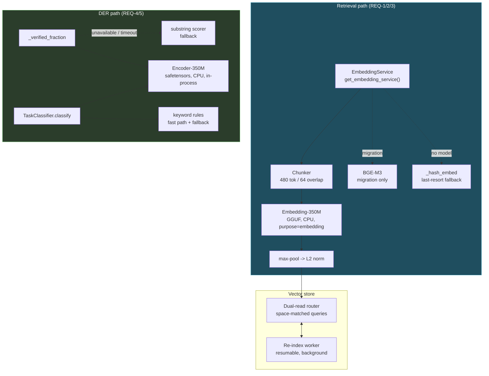
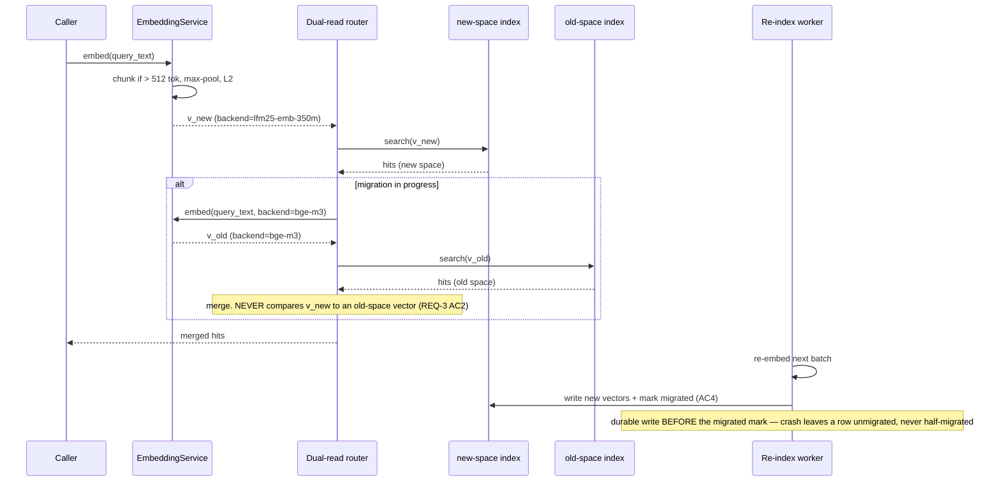

# Design: LFM2.5 Encoder Integration

## Context

Three replacements, one shared constraint: each swaps a **working** component for a smaller one.
That framing drives every decision below. The risk here is not that something breaks loudly — it is
that something degrades silently and nobody notices for months.

Two facts make silent degradation the default failure mode:

1. **BGE-M3 and Embedding-350M are both 1024-dim.** Comparing across the two spaces produces a
   number, not an error. A dimension change would have crashed; this one just returns worse results.
2. **A truncated document still embeds fine.** Embedding-350M's 512-token window silently drops
   everything past token 512 of the 21% of PiNs that exceed it. The vector is valid. The document is
   simply no longer findable by its own content.

Neither is caught by a green test suite that does not specifically look for it. REQ-3 AC2 and
REQ-2 exist because of these two facts, and REQ-8 exists because neither can be trusted to a
review.

**Bounding constraints:**

| Constraint | Source | Consequence |
|---|---|---|
| Zero-shot only | Decision Locked #1 | Quality is what it is; REQ-8 measures rather than fixes |
| Encoder-350M has no sentence head | Model card; Decision Locked #2 | It cannot serve retrieval — two models, two jobs |
| 512-token context | Embedding-350M | REQ-2 chunking is mandatory, not an optimization |
| Both CPU | `local-model-provider-parity` #6 | No VRAM accounting; no throughput target |
| `purpose` + multi-instance ids | `local-model-provider-parity` Wave 2 | Hard prerequisite |
| DER band thresholds frozen | REQ-4 AC2 | Scorer change is measurable in isolation |

---

## Architecture Overview



Three properties this shape enforces:

1. **Every model has a fallback that needs no model.** `_hash_embed` for retrieval, the substring
   scorer for verification, the keyword rules for classification. No encoder failure can take a
   subsystem down — it can only make it less good.
2. **The chunker sits above the model, not inside it.** Index-time and query-time text traverse the
   *same* `ES → CHUNK → E350 → POOL` path, which is what makes REQ-2 AC2 structural rather than a
   convention two call sites have to remember.
3. **`DUAL` is the only thing that reads vectors.** Provenance checking has one home, so REQ-3 AC2
   cannot be forgotten at a call site.

---

## Sequence: query during re-index (the dual-read case)



The re-index worker writes the vector *before* setting the migrated flag. The reverse order is the
tempting one (mark, then write) and it produces a row that dual-read believes is migrated while its
new vector does not exist — invisible until that document stops being found.

---

## Data Models

```python
@dataclass(frozen=True)
class EmbeddingBackend:
    name: str            # "lfm25-emb-350m" | "bge-m3" | "hash"
    dim: int             # 1024 for both neural backends
    max_tokens: int      # 512 | 8192 | inf
    device: str          # "cpu" (REQ-1 AC6)

@dataclass(frozen=True)
class Embedding:
    vector: list[float]
    backend: str         # provenance — REQ-1 AC5. NEVER inferred.
    chunk_count: int     # 1 = unchunked (REQ-2 AC5)
    truncated: bool      # True if the AC3 chunk bound dropped a tail
```

`backend` is a stored field, not a derived one. Deriving it from "whatever is configured now" is
exactly what breaks during migration, when both spaces exist at once.

```python
@dataclass
class ReindexProgress:
    total_rows: int
    migrated_rows: int
    from_backend: str
    to_backend: str
    state: str           # "idle" | "running" | "interrupted" | "complete"
    last_row_id: Optional[str]   # resume point (REQ-3 AC5)
```

```python
@dataclass(frozen=True)
class VerificationScore:
    fraction: float      # [0.0, 1.0] — contract preserved (REQ-4 AC2)
    scorer: str          # "encoder" | "substring" | "fallback"
    per_assertion: list[float]
    band: str            # VERIFIED | UNVERIFIED | FAILED
```

---

## Key Decisions

### D-1: Two models, two runtimes, two jobs

**Decision.** Embedding-350M via GGUF/llama.cpp as a `purpose="embedding"` provider;
Encoder-350M in-process via `transformers` + `torch`.

**Rationale.** Embedding-350M's job is "text in, 1024 floats out" — exactly what the GGUF embedding
path already does, and it inherits provider registration, load state and CPU placement for free.
Encoder-350M is a base MLM: it emits token representations and needs a task head bolted on for
classification and entailment. That is a `transformers` job, and forcing it through the GGUF path
would mean reimplementing pooling and head logic against a runtime that does not want to expose it.

**Rejected — one runtime for both.** Superficially cleaner, and it costs either a reimplementation
of head logic in the GGUF path or the loss of provider integration for the embedder. The models are
genuinely different shapes; pretending otherwise adds work in both directions.

**Rejected — Encoder-350M for retrieval.** It has no sentence-vector head. Mean-pooling a base MLM's
token outputs produces a vector, but not a good sentence vector — this is the well-known failure
mode that bi-encoder training exists to fix. Decision Locked #2.

### D-2: `_hash_embed` stays

**Decision.** Retain the hash-projection fallback unchanged (REQ-1 AC3).

**Rationale.** It has already earned its place: it is what keeps memory functional when
`sentence-transformers` is absent, and this spec adds *more* model-load failure modes, not fewer.
Its accuracy is low, but "low" and "unavailable" are different categories of outcome for a memory
subsystem.

### D-3: Max-pool, not mean-pool

**Decision.** Element-wise max across chunk vectors, then L2-normalise (REQ-2 AC1/AC4).

**Rationale.** A 4000-token research document that answers a query in one paragraph should be
retrieved on that paragraph. Mean-pooling dilutes it by the other seven chunks — the longer the
document, the worse it is found, which is precisely backwards. Max-pool keeps the strongest
per-dimension signal from any chunk.

**Normalise after, not before.** Normalising each chunk then max-pooling produces a vector that is
not unit-length, quietly breaking the cosine assumption every caller makes.

**Rejected — store per-chunk vectors and search them individually.** Better recall, and it changes
the store schema, the row-to-document mapping and every result-dedup path. That is a larger change
than this spec, and it is the direction ColBERT (REQ-6 AC2) would take anyway — so doing it here
would be building half of a deferred feature.

### D-4: Provenance is stored, and cross-space comparison is refused

**Decision.** Every persisted vector carries its `backend`. The dual-read router refuses to score
two vectors whose backends disagree (REQ-3 AC2).

**Rationale.** This is the spec's single most important guard, and it exists because the two
backends share a dimension. There is no runtime signal that a cross-space comparison happened —
no exception, no shape mismatch, no NaN. Just a plausible number and worse results. A refusal at the
one place vectors are compared is the only mechanism that catches it; a code review will not.

**Rejected — infer the backend from current configuration.** Correct exactly when no migration is in
flight, which is the only time it matters.

**Rejected — change the dimension to force a mismatch.** Would make the error loud, and would also
mean a schema change and losing the drop-in property that makes REQ-1 reversible. The refusal check
buys the same safety without the cost.

### D-5: The stub guard runs before the encoder, always

**Decision.** `_STUB_RE` with nothing substantial remaining scores `0.0` before any semantic
scoring (REQ-4 AC3).

**Rationale.** The existing code puts the stub check first
([`agent_kernel.py:7167-7170`](../../backend/agent/agent_kernel.py)) and that ordering is
load-bearing: it is what makes "no silent success" true. A semantic scorer is exactly the component
that would rescue a well-phrased stub — *"I have retrieved the user's email address"* is a strong
entailment of the assertion and a complete failure to do the work. The guard must be unreachable by
the encoder, not merely weighted against it.

### D-6: Bands frozen while the scorer changes

**Decision.** `0.8` / `0.3` do not move in this spec (REQ-4 AC2).

**Rationale.** The scorer's output distribution will shift — substring containment is bimodal
(0 or 1 per assertion), entailment is continuous. Retuning the bands at the same time makes it
impossible to attribute any change in VERIFIED rate to either. Measure first (REQ-8 AC3), retune in
a separate change with evidence.

### D-7: The encoder informs classification before it decides it

**Decision.** Log both keyword and encoder classes during rollout; the encoder becomes
authoritative only above a confidence floor set from that data (REQ-5 AC4/AC5).

**Rationale.** The keyword classifier's failure mode is known and bounded — unknown vocabulary
falls through to `quick_edit`. The encoder's failure mode is unknown. Running both and measuring
disagreement is how the floor gets a value instead of a guess, and it is cheap: classification runs
once per turn.

### D-8: ColBERT is a seam, not a build

**Decision.** `purpose="rerank"` is specified; the model is not integrated (REQ-6 AC2, REQ-8 AC6).

**Rationale.** Reranking improves a retrieval baseline. There is no measured baseline yet. Building
it now means tuning two unmeasured components against each other.

---

## Ripple-Effect Map

| Area / File | Change? | Classification | Why / Evidence |
|---|---|---|---|
| `backend/memory/embedding.py` — `EmbeddingService` | **Yes** | CHANGE NEEDED | Backend selection, chunking, provenance (REQ-1, REQ-2). |
| `backend/memory/embedding.py` — `get_embedding_service()` ([`:316`](../../backend/memory/embedding.py)) | **No** | **CONTRACT LOCK** | Sole accessor; signature unchanged so no call site moves (**CT-E1**). |
| `backend/memory/embedding.py` — `_hash_embed` ([`:37`](../../backend/memory/embedding.py)) | **No** | NO CHANGE (verified) | Dependency-free fallback, retained verbatim (REQ-1 AC3, D-2). |
| `backend/memory/config.py` | **Yes** | CHANGE NEEDED | Gains backend selection + model paths. |
| Vector store rows | **Yes** | CHANGE NEEDED | Gain a `backend` provenance column (REQ-1 AC5, REQ-3 AC2). Dimension unchanged at 1024 — **no width change**. |
| Similarity / search path | **Yes** | CHANGE NEEDED | Provenance check before scoring; dual-read merge (REQ-3 AC2/AC3, D-4). |
| `backend/crawler/rerank.py:67` `_embed` | **Yes** | CHANGE NEEDED | Second embedding consumer. Must route through `EmbeddingService` so it inherits chunking and provenance — otherwise it silently truncates at 512 while the memory path chunks. |
| `agent_kernel._verified_fraction` ([`:7146`](../../backend/agent/agent_kernel.py)) | **Yes** | CHANGE NEEDED | Substring → semantic (REQ-4). |
| `agent_kernel._verify_step_result` ([`:7159-7175`](../../backend/agent/agent_kernel.py)) | **No** | **CONTRACT LOCK** | Bands `0.8`/`0.3` and the VERIFIED/UNVERIFIED/FAILED vocabulary are unchanged (**CT-E3**, D-6). |
| `agent_kernel._STUB_RE` guard ([`:7167-7170`](../../backend/agent/agent_kernel.py)) | **No** | **CONTRACT LOCK** | Must remain **upstream** of scoring (**CT-E4**, D-5). Ordering is the requirement. |
| `agent_kernel.py:5929` — `_verified_fraction` call | **No** | NO CHANGE (verified) | Consumes a float; return contract preserved by REQ-4 AC2. |
| `kyudo.TaskClassifier.classify` ([`:566`](../../backend/memory/mycelium/kyudo.py)) | **Yes** | CHANGE NEEDED | Encoder path added; keyword rules retained as fast path + fallback (REQ-5). |
| `agent_kernel.py:4428-4432` — classifier call site | **No** | NO CHANGE (verified) | Already wraps `classify` in try/except and defaults to `"full"` on failure; REQ-5 AC2's fallback needs nothing new here. |
| `TASK_CLASS_SPACE_MAP` | **No** | NO CHANGE (verified) | REQ-5 AC1 adds no classes, so the map is complete as-is. |
| DER ledger record shape | **No** | **CONTRACT LOCK** | `verified_label` for all outcomes unchanged (**CT-E5**). The outer loop reads it. |
| `local_model_manager.resolve_device_policy` | **No** | NO CHANGE (verified) | `local-model-provider-parity` T3.0 already returns CPU + empty ladder for `embedding`/`rerank`; this spec consumes it. |
| `backend/audio/parakeet_service.py` | **No** | NO CHANGE (verified) | Separate GPU service, untouched (Non-Requirements). |
| TTS pipeline | **No** | NO CHANGE (verified) | Not on any path this spec touches. |
| `components/ModelInferenceSection.tsx:80` — `providerOptions` | **Yes** | **CHANGE NEEDED (cross-spec)** | ⚠️ **This spec breaks a NO-CHANGE claim in `local-model-provider-parity` (CT-L6).** `providerOptions = providers.map(...)` maps **every** provider with **no `purpose` filter**, so the moment Embedding-350M and ColBERT register (REQ-6 AC1/AC2) they appear in the settings **Brain/Tool** dropdowns — directly violating REQ-6 AC3. That spec was correct that its *own* changes leave this file working; it becomes wrong once non-chat providers exist. **This spec must add the `purpose === "chat"` filter here.** |
| `ModelInferenceSection` `handleBrainChange` + `useSameModel` ([`:85-91`](../../components/ModelInferenceSection.tsx)) | **No** | NO CHANGE (verified) | Fires two `sendRoleBinding` calls when "same model" is on. Correct for chat providers; unreachable for encoders once the filter above excludes them. |
| `components/chat-view.tsx` switcher (Spec 3 T3.3) | **No (this spec)** | NO CHANGE (verified) | `contextpill-model-switcher` T3.3 already filters to chat purposes. The **settings** panel above was the unfiltered one. |
| `backend/api/caducean_debug.py` | **Yes** | CHANGE NEEDED | Gains embedding backend, re-index progress, encoder load state (REQ-9 AC3). |
| `docs/CADUCEAN_ARCHITECTURE.md` §9 | **Yes** | CHANGE NEEDED | Status table gains the encoder path. |

---

## Error Handling

| Failure | Response |
|---|---|
| Embedding-350M missing or fails to load | `_hash_embed` fallback + loud warning (REQ-1 edge case). Memory functions at reduced quality. |
| Encoder-350M missing or fails to load | Substring scorer + keyword classifier (REQ-4 AC4, REQ-5 AC2). DER unaffected in shape. |
| Encoder exceeds its time budget | Fall back for that call, log it; do not stall the step (REQ-4 AC6). |
| Text exceeds 512 tokens | Chunk + max-pool (REQ-2 AC1). Never truncate silently. |
| Text exceeds the chunk bound | Drop the tail **with a log line** (REQ-2 AC3). |
| Cross-backend similarity attempted | **Refuse and raise** (REQ-3 AC2). Never return a number. |
| Re-index interrupted | Resume from `last_row_id`; a row is unmigrated or migrated, never between (REQ-3 AC5). |
| Re-index hits a corrupt row | Skip, log, continue (REQ-3 edge case). One row cannot stall migration. |
| Re-index started twice | No-op + log (REQ-3 edge case). Not a second worker. |
| Model artifact corrupt | Detect before load, re-fetch (REQ-7 AC3). Never load a corrupt file. |
| Model absent locally | Report path and expectation; **no** silent download (REQ-7 AC2). |
| Logging fails | Swallow; never fail a retrieval or verification (REQ-9 AC4). |

---

## Testing Strategy

```
backend/tests/unit/         chunking, pooling, scorer logic, device policy
backend/tests/contract/     service interface, band contract, stub ordering, provenance
backend/tests/behavioral/   full retrieval, live re-index, DER verification end-to-end
scripts/validate_encoder_path.py   STANDING CDD HARNESS
scripts/eval_embedding_quality.py  REQ-8 MEASUREMENT (probe sets live in-repo)
```

### Unit

- `test_chunk_and_pool.py` — text over 512 tokens produces >1 chunk; pooling is element-wise max;
  L2 norm applied **after** pooling; text under the window is **byte-identical** to the unchunked
  path (REQ-2 AC5). Parametrized across sub-window, exact-window, and multi-chunk lengths.
- `test_pooling_is_max_not_mean.py` — a document whose single strong chunk is surrounded by
  unrelated chunks still scores high against that chunk's query. Constructed so mean-pooling
  **fails** it: the distinguishing case, not a generic pooling test.
- `test_verified_fraction_semantic.py` — a paraphrase scores > 0.0 (fails today); a stub scores
  exactly 0.0; a result restating the assertion without doing the work does **not** score as
  satisfied (REQ-4 edge case).
- `test_encoder_fallback.py` — encoder unavailable, erroring, and timing out each produce the
  substring result with `scorer="fallback"` logged (REQ-4 AC4).
- `test_classifier_confidence_floor.py` — below the floor defers to keywords; above it uses the
  encoder; the returned tuple shape is unchanged (REQ-5 AC3/AC4).

### Contract

| ID | Pins | Asserts |
|---|---|---|
| **CT-E1** | `EmbeddingService` interface | `get_embedding_service()` and method signatures unchanged across the backend swap (REQ-1 AC1). |
| **CT-E2** | Vector shape + provenance | Every persisted vector is 1024-dim **and** carries a non-empty `backend` (REQ-1 AC2/AC5). |
| **CT-E3** | DER band contract | `_verified_fraction` returns `[0.0, 1.0]`; the `0.8`/`0.3` thresholds and the three label strings are unchanged (REQ-4 AC2). |
| **CT-E4** | Stub-guard ordering | The `_STUB_RE` check runs **before** any scorer. Asserted by injecting a scorer that returns `1.0` unconditionally and requiring a bare stub to still score `0.0` — a test the encoder cannot satisfy its way past (D-5). |
| **CT-E5** | Ledger record shape | `verified_label` present for all outcomes; the outer loop's input is unchanged. |
| **CT-E6** | Cross-space refusal | Scoring two vectors with differing `backend` **raises**; it never returns a float (REQ-3 AC2). |
| **CT-E7** | Local provider registration | Both encoders register with `purpose` in `{embedding, rerank}`, `device="cpu"`, and are **not** bindable to `reasoning`/`tool_execution` (REQ-6 AC1/AC3). |

### Behavioral

- `test_long_pin_retrievable_by_tail.py` — index a PiN whose distinguishing content sits **past
  token 512**, query for that content, assert it is returned (REQ-2). Fails against a truncating
  implementation; this is the 21%-of-PiNs case.
- `test_reindex_no_outage.py` — start a re-index over a populated store, issue queries throughout,
  assert every query returns results and none mixes spaces (REQ-3 AC1/AC3).
- `test_reindex_resumes.py` — kill mid-migration, restart, assert no row is re-embedded, no row is
  half-migrated, and migration completes (REQ-3 AC4/AC5).
- `test_reindex_write_before_mark.py` — inject a crash **between** vector write and migrated mark;
  assert the row reads as unmigrated and is retried, never as migrated-without-a-vector.
- `test_der_verifies_paraphrase.py` — drive a real DER step whose result satisfies its expected
  output in different words; assert the ledger records VERIFIED and the displayed outcome matches
  the spoken one (REQ-4, CT-E5).
- `test_der_rejects_wellphrased_stub.py` — a result that eloquently claims completion without doing
  the work is recorded FAILED (D-5). The inverse of the above, and the one a semantic scorer is
  most likely to break.
- `test_encoders_do_not_shrink_chat_context.py` — derive a chat context, load both encoders,
  re-derive: **identical** (REQ-6 AC4). This spec's side of `local-model-provider-parity` REQ-5 AC9.
- `test_memory_survives_missing_models.py` — with both encoders absent, memory writes and retrieves
  via `_hash_embed` and DER verifies via substring; nothing raises (REQ-1/4/5 fallbacks).

### Intertwined

| Real defect | Behavioral test | Contract decomposition |
|---|---|---|
| Truncation past 512 tokens (silent) | `test_long_pin_retrievable_by_tail` | `test_chunk_and_pool` |
| Cross-space comparison (silent, same dim) | `test_reindex_no_outage` | **CT-E6** |
| Half-migrated row (silent) | `test_reindex_write_before_mark` | — |
| Substring scorer fails paraphrase (`:7156`) | `test_der_verifies_paraphrase` | `test_verified_fraction_semantic` |
| Semantic scorer rescues a stub (new risk) | `test_der_rejects_wellphrased_stub` | **CT-E4** |
| Encoder on GPU steals chat VRAM | `test_encoders_do_not_shrink_chat_context` | **CT-E7** |
| Keyword classifier falls through on unknown vocabulary (`:587`) | — | `test_classifier_confidence_floor` |

### Physics-aware

- Verification labels feed the ledger, which feeds the outer loop's `_verified_fraction`-derived
  guard. A scorer change that moves the VERIFIED rate moves a self-tuning input. Assert that the
  outer loop's held-out score is computed from the **same** labels the user was shown — a scorer
  that inflates VERIFIED while the displayed outcome says otherwise is reward-hacking by accident.

### Standing CDD harness

`scripts/validate_encoder_path.py` asserts on every run:

1. CT-E1..CT-E7 hold.
2. Every persisted vector is 1024-dim and carries a `backend` tag.
3. A synthetic 4× -window document is retrievable by content from **each** of its chunks — not just
   the first. First-chunk-only retrieval is truncation wearing chunking's clothes.
4. Max-pool is verifiably not mean-pool on the constructed case.
5. A cross-backend comparison **raises**.
6. A simulated interrupted re-index resumes with no row re-embedded and none half-migrated.
7. The stub guard survives a scorer stubbed to return `1.0` unconditionally.
8. Both encoders resolve to `device="cpu"` with `counts_against_vram=False`.
9. With both encoders loaded, a chat model's derived context is unchanged.

Assertions 3 and 7 are the two that decide whether this spec landed. 3 catches chunking that
technically chunks but retrieves only the head; 7 catches a semantic scorer that quietly became a
way for stubs to pass.

### Measurement (REQ-8 — not a pass/fail test)

`scripts/eval_embedding_quality.py` reports, against in-repo probe sets:

| Metric | BGE-M3 | Embedding-350M |
|---|---|---|
| recall@1 / @5 / @10 | baseline | measured |
| index-time latency per doc | baseline | measured |
| query latency | baseline | measured |
| resident memory | ~2.3 GB | measured |

and for verification, **both error directions separately** (REQ-8 AC3):

| Metric | substring | encoder |
|---|---|---|
| paraphrase recognized (fewer false FAILED) | baseline | measured |
| unsatisfied-but-overlapping rejected (fewer false VERIFIED) | baseline | measured |
| stub rejected | 100% required | 100% required |

The stub row is the only one with a hard requirement. If Embedding-350M's recall lands materially
below BGE-M3, that is a finding under REQ-8 AC5 — **do not adjust the probe set to close the gap.**
The probe set is the measuring instrument; reshaping it to produce a favourable number destroys the
only evidence that the swap was safe.
