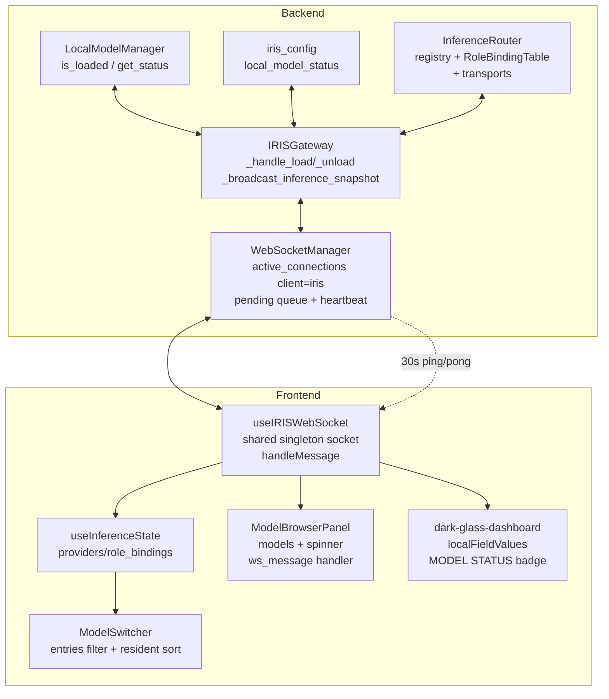
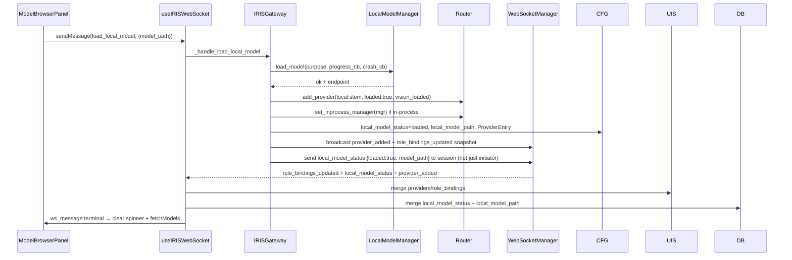
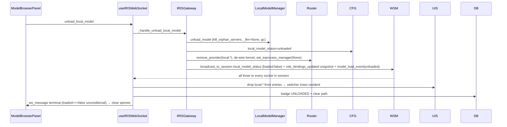
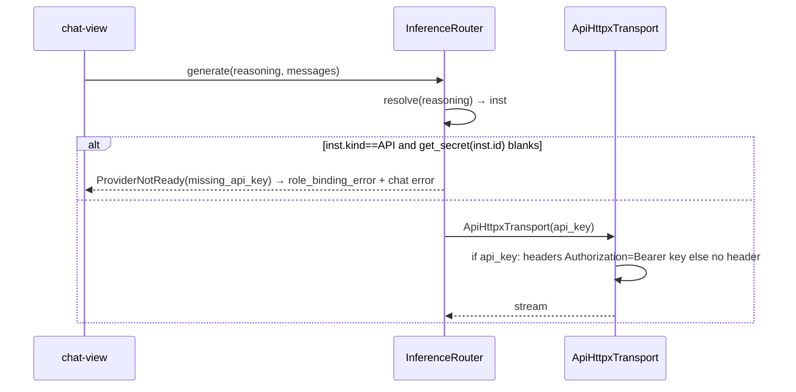

# Design: Local Model Lifecycle & Frontend Sync

## Context
IRIS Voice runs a local LLM (`LocalModelManager`, in-process `llama-cpp-python` or `llama-server:8082`) that is also a first-class `ProviderInstance` (`local:<stem>`) in the `InferenceRouter`. The frontend has three independent views of that state:

- **Manager live:** `_llm` / `_process` / `_current_model_path` is truth.
- **Config persisted:** `cfg.inference.local_model_status` is what survives restart (boot resets it to `unloaded` at `backend/main.py:376`).
- **Router registry:** `ProviderInstance(loaded, kind)` + `RoleBindingTable` is what `generate(role)` actually routes to. The registry is a **process-wide singleton** (`router.py:254` → `get_provider_registry()`), so every kernel and `status_snapshot` see the same providers.
- **Frontend stores:** `useInferenceState` (`providers/role_bindings`), `dark-glass-dashboard localFieldValues` (badge), `ModelBrowserPanel` (`models[]` + spinner).

**Root cause of the red trigger (user-confirmed):** The red appears on the SAME local model the user loaded AND set as brain — it is the frontend `loaded` flag going stale, NOT an API-provider brain. The model is resident on the GPU (manager + registry both have `loaded=True`), but the frontend `providers` list shows `loaded=False` (or the provider is missing from the usable `entries`), so `ModelSwitcher.tsx:226` renders red. The registry being shared means the backend is consistent; the frontend is what drifts. The fix is REQ-4 (reconcile `loaded` on every WS `connected`) + REQ-2 (make the red actionable with a specific reason + correction).

All three servers (brain LLM `8082`, vision `18181`, crawler) are broadcast to dashboards via a single WS (`client="iris"`). The WS is the only live sync; a dropped frame leaves the views diverged until a manual refresh — the exact fragility the user reports.

Constraints:
- No new backend surface for the switcher (`sendRoleBinding` via `set_role_binding` already exists).
- Heavy imports lazy, no blocking in async hot paths.
- Keep behavior portable (no Tauri-only fix that breaks browser).

## Architecture Overview



## Sequence / Data Flow

### Load



### Unload (fixed)



### Bearer guard



## Data Models

```ts
// Backend snapshot (already existing, kept compatible)
interface InferenceSnapshot {
  providers: ProviderInstance[] // {id, label, kind, model, api_base_url, loaded, vision_loaded, has_key?}
  role_bindings: RoleBinding[]  // {role, instance_id, model_override}
  default_role: string
  provider_presets: ProviderPreset[]
  model_catalog: Record<string, {id,name}[]>
}

// WS local_model_status (extended with path on success — already sent, now consumed)
type LocalModelStatusPayload =
  | { loaded: true, status: "loaded", model_path: string, profile: string }
  | { loaded: false, model_path: null, profile: null }
  | { loaded: false, status: "error", model_path: string, error: string }

// Health extension (REQ-2) — additive, not breaking
type RoleHealth = { ok: boolean, reason?: "missing_api_key" | "missing_provider" | "local_not_loaded" }
```

## Key Decisions

| Decision | Rationale | Rejected |
|---|---|---|
| Guard Bearer at router `resolve` + transport, not only transport | Prevents ever building `Bearer ` and gives a typed error the UI can act on; transport guard alone would still be a late failure | Only guarding in transport — too late, still a crash path |
| `ProviderNotReadyError` lives in `exceptions.py` with `ErrorCode.PROVIDER_NOT_READY` | Reuses the existing `AgentException`/`format_exception_for_response` contract so the router, gateway, and chat path all catch one type | A bare `RuntimeError` — not typed, not catchable by the existing error machinery |
| Broadcast unload status to session, not just `send_to_client` | `send_to_client` misses the Tauri vs browser socket that didn't initiate; broadcast makes any surviving socket reconcile. The `role_bindings_updated` snapshot is ALREADY broadcast via `_broadcast_inference_snapshot` (iris_gateway.py:9178) — only the status needs the broadcast added | Keep initiator-only and rely on 30s `system_status` tick — too slow, user sees 30s of stale red |
| Make `ModelBrowserPanel` terminal on any `loaded===false` without `unloadInFlightRef` | The flag is what wedges after a prior lost frame; loaded boolean is truth and idempotent | Keep `&& unloadInFlightRef` gate — preserves wedge |
| Single shared WS per page (module singleton connection manager) | Fixes `active_connections["iris"]` churn without touching backend `client="iris"` contract | Keep per-hook `wsRef` and add jitter — masks but doesn’t fix |
| Dashboard syncs `local_model_path` from status payload | Makes the card truthful without a new WS type; mirrors the existing `status` mapping that already handles half the payload | Add a new `local_model_path_updated` event — new surface for same fact |
| Red trigger is actionable, not auto-rebinding (OQ-1) | User confirmed red is on the resident local model (stale `loaded`), not an API brain, and wants red to inform, not silently override. So: reconcile `loaded` on reconnect (T7) + surface the specific reason in `title` (T8b). No auto-bind. | Auto-bind brain to loaded local model — silently overrides user's explicit choice |

## Ripple-Effect Map (MANDATORY)

| Area / File | Change? | Classification | Why / Evidence |
|---|---|---|---|
| `backend/agent/inference/transport.py:546` | Yes | CHANGE NEEDED | Unconditional `Bearer {key}` → guard `if api_key.strip():` before header; aligns with `router.py:1138` guard |
| `backend/agent/agent_kernel.py:2917` `_dispatch_api` | Yes | CHANGE NEEDED | Same unconditional header; must guard identically |
| `backend/agent/inference/router.py:817 _build_transport API` | Yes | CHANGE NEEDED | Fetch key, strip, if blank raise `ProviderNotReady(missing_api_key)` instead of building transport; health contract |
| `backend/agent/inference/router.py:760 health_check` | Yes | CHANGE NEEDED | Return `ok=False, reason=missing_api_key` for API with blank secret so snapshot health is truthful |
| `backend/iris_gateway.py:9121 _handle_unload_local_model` | Yes | CHANGE NEEDED | Add `broadcast_to_session(local_model_status {loaded:false})` to match the load path (which already broadcasts at `iris_gateway.py:9042-9045`). The `role_bindings_updated` snapshot is ALREADY broadcast via `_broadcast_inference_snapshot(session_id)` at `iris_gateway.py:9178` — do NOT add a second one. Only the status is initiator-only today (`send_to_client` at `:9180`). |
| `backend/agent/exceptions.py` | Yes | CHANGE NEEDED | Add `ProviderNotReadyError` + `ErrorCode.PROVIDER_NOT_READY` (1005) so the Bearer guard raises a typed, catchable exception through the existing `AgentException`/`format_exception_for_response` machinery (exceptions.py:48-69, 265-275). |
| `hooks/useIRISWebSocket.ts:1287 local_model_status case` | Yes | CHANGE NEEDED | Extend to sync `local_model_path` from payload into `localFieldValues` + dispatch `iris:local_model_status` with `{status, model_path}` |
| `components/dark-glass-dashboard.tsx:1037 handleLocalModelStatus` | Yes | CHANGE NEEDED | Consume `model_path` and write `local_model_path` into `local_model` + `local-model-card` buckets alongside status |
| `components/dashboard/ModelBrowserPanel.tsx:143 handler` | Yes | CHANGE NEEDED | Make `loaded===false` terminal unconditionally (not only with `unloadInFlightRef`), clear `isLoading/loadPhase` and always `fetchModels()` |
| `hooks/useInferenceState.ts:117 role_bindings_updated + 145 system_status` | Yes | CHANGE NEEDED | Add re-fetch on `connected` transition; keep field-wise merge (already correct at `:122-127`). The WS `request_state` push exists but depends on `peek_active_kernel` (iris_gateway.py:7235) which can return None → empty snapshot; REST `/api/inference/state` (main.py:1828) reads the shared registry directly (iris_gateway.py:8989) so it is the reliable reconciliation. |
| `hooks/useIRISWebSocket.ts:38 shared socket` | Yes | CHANGE NEEDED | Introduce module-singleton `sharedWsRef` + refcount so multiple hook instances share one `WebSocket`/`ws:message` listener; keep existing singleton stores for `voiceState/activeConvId` as proof the pattern already works |
| `components/ModelSwitcher.tsx:226 trigger color` | Yes | CHANGE NEEDED | Red is currently `brainAvailable || !brainBinding ? glow : red` with only `(unavailable)` in title. Add per-reason `title` (REQ-2 AC2) so red is actionable: `local_not_loaded` / `missing_api_key` / `missing_provider`. The `entries` filter + resident sort at `:132/:151` stay. |
| `components/ModelInferenceSection.tsx` | No | NO CHANGE (verified) | Settings-panel consumer of `useInferenceState` (chatProviders, brainBinding, sendRoleBinding at `:148-188`); benefits from the hook fix, no code change |
| `backend/iris_gateway.py:535 _hydrate_local_provider_on_startup` | No | NO CHANGE (verified) | Already re-registers the local provider after a backend restart when config says loaded + server reachable — related sync path, not the current bug |
| `components/ModelSwitcher.tsx:132 entries filter` | No | NO CHANGE (verified) | Already filters `API→has_key, ollama→true, else loaded` and sorts resident first; no change needed — `hooks/useInferenceState.ts` feeding it correctly is the fix |
| `backend/agent/inference/router.py:1138 _DirectVisionClient` | No | NO CHANGE (verified) | Already guards `if self._api_key:` before header — `backend/agent/inference/router.py:1137-1139` |
| `backend/ws_manager.py:102 replace stale` | No | CONTRACT LOCK | Must keep not calling `stale_ws.close()` before `accept()` — `ws_manager.py:130-144` comment pins this; CT-2 protects |
| `backend/main.py:376 boot reset` | No | NO CHANGE (verified) | Already resets `local_model_status` to `unloaded` on boot; verified at `backend/main.py:365-384` |
| `backend/iris_gateway.py:7218 request_state snapshot` | No | CONTRACT LOCK | Already broadcasts full inference snapshot on every `request_state`; CT-1 protects key parity |
| `data/cards.ts:204 local_model_path` | No | CONTRACT LOCK | Field id unchanged; frontend sync only writes value — contract test pins id exists |

## Error Handling

- `IF get_secret(instance_id) blank for API THEN THE SYSTEM SHALL` return `role_binding_error {error:"missing_api_key", role, instance_id}` and `system_status.health.reason="missing_api_key"`; chat path returns `ProviderNotReady` mapped to user message `API key missing for <label> — add it in Settings → Model & Inference`.
- `WHEN unload_model throws THEN THE SYSTEM SHALL` still broadcast `local_model_status {status:"error", loaded:false}` and keep spinner cleared; no orphan provider remains.
- `WHEN WS disconnected THEN THE SYSTEM SHALL` buffer `load/unload` (queued via `messageQueueRef`) and on `connected` re-pull REST snapshot + `get_local_model_status`; if still inconsistent after 30s, `ModelBrowserPanel` fallback `fetchModels()` clears wedge.
- `WHEN Tauri Rust WS and browser WS race for client="iris" THEN THE SYSTEM SHALL` keep single shared socket so only one `active_connections["iris"]` is ever created; replacement follows `ws_manager.py:110-114` without spurious `WebSocket is not connected` error.

## Testing Strategy

```
tests/unit/         pure logic: Bearer guard, status mapping, health reason, path sync
tests/contract/     boundary pins: snapshot key parity, local_model_status shape, WS event contract
tests/behavioral/   full-loop: load/unload through GW→LMM→Router→WS→UI convergence
scripts/validate_*  standing CDD harness replays
```

- **Contract tests (CT):**
  - **CT-1 — Snapshot key parity** (`test_inference_snapshot_key_parity.py` extended): `build_inference_snapshot(None)` and `build_inference_snapshot(router)` share keys; REST and WS `role_bindings_updated` carry same shape.
  - **CT-2 — WS replace contract** (`test_ws_replace.py`): rapid reconnect does not cause `RuntimeError: WebSocket is not connected. Need to call 'accept' first.` — `ws_manager.py:130-144` invariant.
  - **CT-3 — `local_model_status` shape** (`test_local_model_status_section_key_contract.py`): payload always carries `loaded` boolean; `status` string is derived identically in `useIRISWebSocket.ts:1293`. New `model_path` field is optional and does not break old consumers.
  - **CT-4 — Bearer never empty** (new): `ApiHttpxTransport` never sends `Authorization: Bearer `; empty key omits header.
  - **CT-5 — Provider health** (new): API provider with blank secret resolves to `{ok:false, reason:"missing_api_key"}`.

- **Behavioral tests:**
  - **B-1 — Unload converges without refresh:** drive `load_local_model` → assert `local:*` in `providers` and badge `loaded`; then `unload_local_model` → assert `providers` loses `local:*`, badge `unloaded`, `LMM.is_loaded()==False`, no refresh.
  - **B-2 — Reconnect heals drift:** lose WS for 5s after load, reconnect → assert UI re-derives `loaded` from REST+`get_local_model_status` without manual refresh.
  - **B-3 — Missing key surfaces, not crashes:** bind `reasoning=cerebras` with no key, call `generate` → assert `ProviderNotReady(missing_api_key)` not `InvalidHeader`, and chat error is user-actionable.
  - **B-4 — Unload frees VRAM (observability, not hard gate):** after unload assert `LMM.is_loaded()==False` AND log free-VRAM delta via `get_hardware_info`; a reference cycle keeping `_llm` alive would show a non-zero delta and is caught by the harness, not a flaky hard assert.

- **Intertwined:** B-3’s missing-key trace decomposes into CT-4 + CT-5. B-1’s unload wedge decomposes into CT-3 (loaded boolean terminal) + `ModelBrowserPanel` handler contract.

- **Standing CDD harness:** `scripts/validate_der_*.py` family extended with a `validate_local_model_lifecycle.py` replay that loads a tiny GGUF (or mocked LMM) through the full GW→WS→UI path and asserts contracts + behaviors every run.

