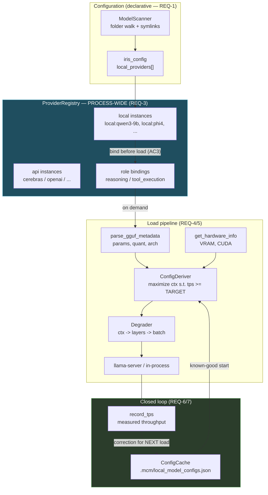
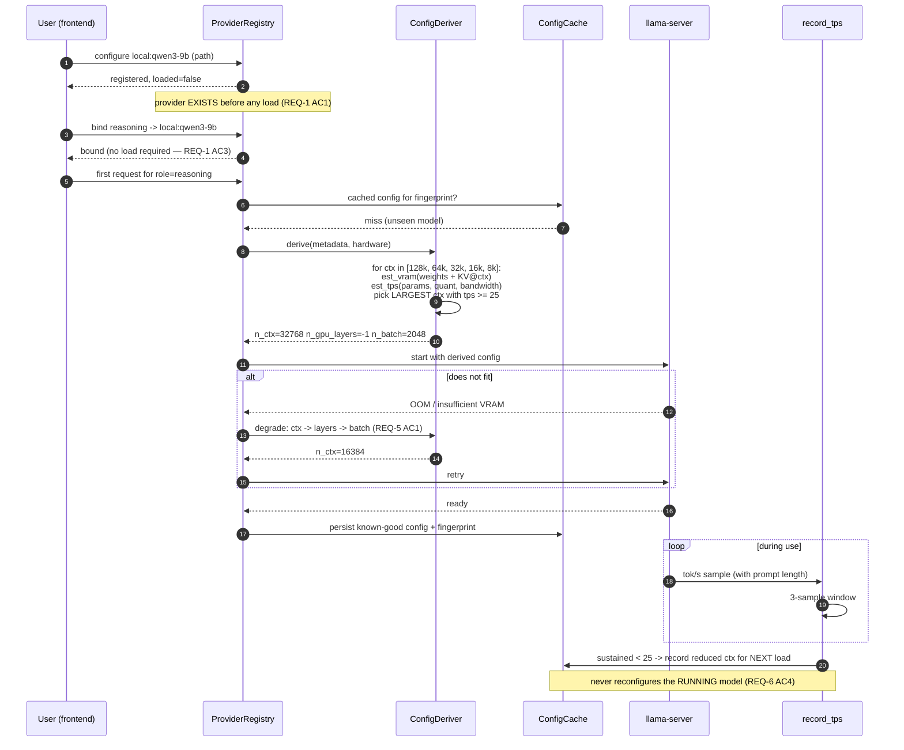

# Design: Local Model Provider Parity + Auto-Optimizing Loader

## Context

Two independent problems share one spec because they share one root: **the local path treats a
model as a runtime event, where the API path treats a provider as configuration.**

**Problem A — identity.** A local `ProviderInstance` is constructed inside the model-load handler
([`iris_gateway.py:7896`](../../backend/iris_gateway.py)), under the hardcoded id `"local"`, and
then fanned out to every peer kernel's router ([`:7910`](../../backend/iris_gateway.py)). So the
provider does not exist until a load succeeds, there is exactly one local slot, and provider state
lives per-kernel rather than per-process.

**Problem B — tuning.** The loader claims to optimize but applies presets. `PROFILES`
([`local_model_manager.py:92`](../../backend/agent/local_model_manager.py)) hardcodes
`n_ctx=32768` for `balanced`, tuned — per its own comment — for *"RTX 3070 8GB with
Qwen3.5-9B-Q3_K_S"*. `recommend_profile` yields two outcomes and never touches context or layer
count. `record_tps` measures throughput and only warns, at a threshold of 8 tok/s.

**Bounding constraints:**

| Constraint | Source | Consequence |
|---|---|---|
| Target is ≥25 tok/s at max context | Decision Locked #2 | Tuning is a **search**, not a preset lookup |
| User swaps models constantly | Decision Locked #3 | Derivation must work for unseen models; caching must be per-model |
| Two local models must coexist | Decision Locked #1 | Kills the single `"local"` id |
| Embedding-350M + ColBERT are local too | `lfm25-encoder-integration` | Local instances must support non-chat roles |
| llama-server / MTP path must not regress | `balanced_mtp`, `force_subprocess` | Derivation must be able to *produce* the MTP configuration, not bypass it |
| Frontend already renders role bindings | `ModelInferenceSection.tsx` | Adding `loaded` status must be additive to the payload |

---

## Architecture Overview



Two properties this shape enforces:

1. **Configuration flows into the registry; loading flows out of it.** The arrow from `LOC` to
   the load pipeline goes through `BIND` — a provider is registered, *then* bound, *then* loaded.
   Today that chain runs backwards.
2. **The learning arrow returns to `CACHE`, never to `SERVE`.** Measurements change the *next*
   load (REQ-6 AC4); they never reconfigure a running model, so a session in flight is never
   disrupted by tuning.

---

## Sequence: first load of an unseen model



---

## Data Models

### `LocalProviderConfig` — declarative, persisted (REQ-1, REQ-2)

```python
@dataclass
class LocalProviderConfig:
    id: str                    # "local:qwen3-9b" — namespaced, never the literal "local"
    label: str                 # user-facing
    model_path: str            # absolute, may be reached via symlink
    purpose: str = "chat"      # "chat" | "embedding" | "rerank"  (REQ-2 AC3)
    profile: Optional[str] = None      # user override; None => derive (REQ-4 AC4/AC5)
    custom_params: Optional[dict] = None
```

`purpose` is what lets Embedding-350M and ColBERT register as local providers without competing
for `reasoning` / `tool_execution` bindings.

### Runtime status — additive to the existing snapshot payload

```python
{
  "id": "local:qwen3-9b",
  "kind": "inprocess",
  "loaded": False,          # NEW (REQ-1 AC2)
  "loading": False,         # NEW
  "purpose": "chat",        # NEW
  "active_config": None,    # populated once loaded
  "recent_tps": None,
}
```

Additive so `ModelInferenceSection.tsx` and the Spec-3 dropdown keep working before they consume
the new fields.

### `DerivedConfig` and `CachedConfig` (REQ-4, REQ-7)

```python
@dataclass
class DerivedConfig:
    n_ctx: int
    n_gpu_layers: int
    n_batch: int
    est_vram_gb: float
    est_tps: float
    source: str          # "cache" | "derived" | "user_override" | "degraded"
    degraded_from: Optional[dict] = None   # REQ-9 AC2

@dataclass
class CachedConfig:
    fingerprint: str     # path + size + mtime  (REQ-7 AC2)
    hw_fingerprint: str  # gpu name + total VRAM (REQ-7 AC4)
    config: DerivedConfig
    measured_tps: Optional[float]
    updated_at: float
```

### Constants

| Constant | Default | Env | REQ |
|---|---|---|---|
| `TARGET_TPS` | `25.0` | `IRIS_LOCAL_TARGET_TPS` | 4, 6 |
| `MIN_CTX` | `4096` | `IRIS_LOCAL_MIN_CTX` | 5 |
| `CTX_LADDER` | `[131072, 65536, 32768, 16384, 8192, 4096]` | — | 4 |
| `TPS_SAMPLE_WINDOW` | `3` | — | 6 |
| `TPS_DEADBAND` | `0.15` | — | 6 |
| `CONFIG_CACHE_PATH` | `.mcm/local_model_configs.json` | — | 7, Q3 |
| `SCAN_MAX_DEPTH` | `8` | — | 8 |

`TPS_DEADBAND` prevents the oscillation named in REQ-6's edge cases: a measurement within 15% of
target records no correction.

---

## Key Decisions

### D-1: Registration is declarative; loading is a state transition on an existing instance

**Decision.** `LocalProviderConfig` entries register at router init. Loading flips `loaded` on an
instance that already exists.

**Rationale.** This single inversion resolves most of Problem A. Dead bindings on restart, the
order-dependent UX, and the "load before you can bind" guard all follow from creation-on-load.
Making local declarative makes it structurally identical to API providers, which is the parity
Decision Locked #1 asks for.

**Rejected — keep creation-on-load and add a placeholder.** A placeholder that becomes real on
load is two representations of one thing; the frontend would need to know which it is holding.

### D-2: Namespaced ids (`local:<stem>`), migrated in one change

**Decision.** Ids become `local:<model-stem>`. Every site matching the literal `"local"` migrates
in the same change.

**Rationale.** REQ-2 AC4 is emphatic because a partial migration is worse than none: a binding
referencing `"local"` while the registry holds `local:qwen3-9b` is dead and looks configured. The
audit found the literal at [`iris_gateway.py:7896`, `:8580`](../../backend/iris_gateway.py) and
[`agent_kernel.py:962`, `:8476`, `:8544`](../../backend/agent/agent_kernel.py) — plus a
context-window table at [`agent_kernel.py:926-931`](../../backend/agent/agent_kernel.py) keyed on
`("local", <model>)` that must keep resolving.

**Migration:** persisted bindings referencing bare `"local"` resolve to the single configured
local instance if exactly one exists; otherwise they surface as unresolved rather than silently
picking one.

### D-3: Maximize context subject to a throughput floor — a search, not a preset

**Decision.** Walk `CTX_LADDER` downward, estimate VRAM (weights **+ KV cache at that context**)
and throughput, and take the largest context predicted to clear `TARGET_TPS`.

**Rationale.** Directly encodes Decision Locked #2. The current presets cannot express it: a fixed
`n_ctx=32768` under-serves a small model and over-commits a large one. Note AC3's correction —
`estimate_vram_gb` models **weights only**
([`local_model_manager.py:906`](../../backend/agent/local_model_manager.py)), which is precisely
the term that is context-independent, so it cannot inform a context choice. KV-cache size must
enter the estimate for the search to mean anything.

**Rejected — more presets.** Adding `balanced_16k`, `balanced_64k` etc. reproduces the same
problem at finer grain: presets are indexed by guess, not by the model in hand.

### D-4: Degrade in a fixed order — context, then layers, then batch

**Decision.** Context first, GPU layers second, batch last.

**Rationale.** Ordered by cost-to-benefit. Context reduction reclaims KV-cache VRAM with no effect
on tok/s; moving layers to CPU is the steepest throughput cost; batch size mainly affects prefill,
not generation. Reversing this trades away the thing the user is optimizing for.

**Rejected — the current GPU-only rejection policy.** Deliberately chosen once
([`:941-946`](../../backend/agent/local_model_manager.py)) and correct for a fixed deployment; wrong
for a user who swaps models constantly, where it turns a slow load into a dead end.

### D-5: Corrections apply at next load, never to a running model

**Decision.** `record_tps` writes to `ConfigCache`; nothing reconfigures a live server.

**Rationale.** Closing the loop (REQ-6) is the fix for measure-and-discard, but a *tight* loop
would reload a model mid-conversation. The slow loop gets the learning without the disruption —
the same reasoning as the outer loop tuning physics constants between sessions rather than within
one.

### D-6: One process-wide registry; delete the fan-out

**Decision.** Providers and bindings move to a process-wide singleton. The peer-kernel loops go.

**Rationale.** The fan-out at [`iris_gateway.py:7910`](../../backend/iris_gateway.py) is a
workaround whose own comment documents the bug it patches — `/api/inference/state` reading a
different kernel than the WS session. Its comment also notes the pattern was applied twice more
elsewhere, so the workaround is spreading. One registry removes the class of bug rather than the
third instance of it.

---

## Ripple-Effect Map

| Area / File | Change? | Classification | Why / Evidence |
|---|---|---|---|
| `backend/agent/inference/registry.py` | **Yes** | CHANGE NEEDED | Becomes process-wide; holds `loaded` / `purpose` (REQ-1 AC2, REQ-3 AC1). |
| `backend/agent/inference/provider.py` | **Yes** | CHANGE NEEDED | `ProviderInstance` gains `loaded`, `loading`, `purpose`, `active_config`. Additive — `to_dict` keeps existing keys (REQ-1 AC2). |
| `backend/agent/inference/router.py` | **Yes** | CHANGE NEEDED | `_apply_config` registers local providers from config (REQ-1 AC1); reads the shared registry (REQ-3). Public surface unchanged (REQ-3 AC4). |
| `backend/iris_gateway.py:7896` | **Yes** | CHANGE NEEDED | Load handler stops **creating** the instance; flips status on an existing one (D-1). |
| `backend/iris_gateway.py:7910` | **Yes (delete)** | CHANGE NEEDED | Peer-kernel fan-out loop removed, not extended (REQ-3 AC3). |
| `backend/iris_gateway.py:8580` | **Yes** | CHANGE NEEDED | Binding guard becomes a status flag, not a veto (REQ-1 AC6). |
| `backend/agent/agent_kernel.py:962, :8476, :8544` | **Yes** | CHANGE NEEDED | Literal `"local"` comparisons migrate to namespaced ids (D-2, REQ-2 AC4). |
| `backend/agent/agent_kernel.py:926-931` | **Yes (careful)** | CHANGE NEEDED | Context-window table keyed `("local", <model>)`. Must keep resolving after renaming, or `resolve_context_window` silently returns a wrong window — which feeds `DER_WORK_UNITS_0` and the DER token budget. |
| `backend/agent/local_model_manager.py` — `PROFILES` | **No** | NO CHANGE (verified) | Retained as user-selectable overrides (REQ-4 AC4). `balanced_mtp` and `force_subprocess` untouched so MTP does not regress. |
| `local_model_manager.estimate_vram_gb` | **Yes** | CHANGE NEEDED | Must include KV cache at the target context; currently weights-only (`params_b × bpw / 8 × 1.1`, [`:906`](../../backend/agent/local_model_manager.py)) — context-independent and so unusable for D-3's search. |
| `local_model_manager.recommend_profile` | **Yes** | CHANGE NEEDED | Two-outcome preset selector replaced by `ConfigDeriver` (REQ-4). |
| `local_model_manager.record_tps` | **Yes** | CHANGE NEEDED | Threshold 8 → `TARGET_TPS`; writes corrections to `ConfigCache` instead of only warning (REQ-6). |
| `local_model_manager.scan_models` | **Yes (minor)** | CHANGE NEEDED | Symlink traversal + dedupe + depth bound (REQ-8 AC1/AC4). Split-shard grouping preserved. |
| `local_model_manager.load_model` | **Yes** | CHANGE NEEDED | Consumes `DerivedConfig`; drives the degradation retry loop (REQ-5). |
| `_parse_load_progress` | **No** | NO CHANGE (verified) | Progress parsing is orthogonal to configuration choice; phases (`init → loading → context → ready`) still apply. |
| `InProcessTransport` | **No** | **CONTRACT LOCK** | `generate()` signature and the `(text, thinking, tool_calls)` 3-tuple are unchanged (**CT-L4**). |
| `InferenceRouter.generate()` | **No** | **CONTRACT LOCK** | The phase-scheduler gate lives here (`caducean-phase-scheduler` REQ-13). Registry changes must not alter its signature or the gate call (**CT-L5**). |
| `quota_key()` / `rate_meter` | **No** | NO CHANGE (verified) | Local kinds are unmetered by `ProviderKind` ([`provider.py:16-22`](../../backend/agent/inference/provider.py)); more local instances are still unmetered. |
| `components/ModelInferenceSection.tsx` | **No (this spec)** | **CONTRACT LOCK** | Consumes `providers[]` + `role_bindings[]`. New fields are additive so it keeps working unmodified (**CT-L6**). Rendering `loaded` is `contextpill-model-switcher`. |
| `iris_config.py` | **Yes** | CHANGE NEEDED | Gains `local_providers: List[LocalProviderConfig]`. Existing flat `local_model_path` fields migrate to a single entry. |
| `.mcm/local_model_configs.json` | **Yes (new)** | CHANGE NEEDED | Per-model cache, following `der_params.json` / `provider_ceilings.json` (REQ-7, Q3). |
| `docs/CADUCEAN_ARCHITECTURE.md` §9 | **Yes** | CHANGE NEEDED | Component status table gains the local provider path. |

---

## Error Handling

| Failure | Response |
|---|---|
| Model file missing at load | Provider stays registered, `loaded=false`, typed `ModelNotFoundError` naming the path (REQ-1 edge case). Never a generic failure. |
| Metadata unparseable | Fall back to the `balanced` preset, log the reason, continue (REQ-4 edge case). |
| Derived config does not fit | Degrade ctx → layers → batch (REQ-5 AC1); report each step (REQ-9 AC2). |
| No viable config at all | Fail with the constraint that could not be satisfied (REQ-5 AC3). Below `MIN_CTX` reports unusable-on-this-hardware rather than loading uselessly. |
| Role bound to unloaded local, request arrives | Load on demand, or fail with a typed actionable error. **Never** silently fall back to another provider (REQ-1 AC4) — a silent swap would make the user think local is working when it is not. |
| Corrupt config cache | Discard, derive fresh (REQ-7 AC5) — the `outer_loop._load_params` tolerance pattern. |
| Hardware changed since caching | Invalidate on `hw_fingerprint` mismatch, re-derive (REQ-7 AC4). |
| Scan hits unreadable file / circular symlink | Skip that entry, continue; depth-bounded by `SCAN_MAX_DEPTH` (REQ-8 AC5, edge case). |
| Two models requested, VRAM insufficient | Report capacity at bind/load. **Never** silently unload the other (REQ-2 AC5). |

---

## Testing Strategy

```
backend/tests/unit/         pure derivation, estimation, cache logic
backend/tests/contract/     registry + transport + payload shape pins
backend/tests/behavioral/   full load path, degradation, closed loop
scripts/validate_local_model_path.py    STANDING CDD HARNESS
```

### Unit

- `test_config_deriver.py` — largest context clearing `TARGET_TPS` is chosen; a small model gets
  **more** than 32k and a large one **less**, from the same code path (the property presets cannot
  express); `MIN_CTX` floor holds.
- `test_vram_estimate_includes_kv.py` — estimate **increases with context**. Against today's
  weights-only formula this fails, which is the point: a context-independent estimate cannot
  inform a context search.
- `test_degradation_order.py` — ctx exhausted before layers, layers before batch (D-4).
- `test_config_cache.py` — fingerprint changes on file mtime/size; `hw_fingerprint` mismatch
  invalidates; corrupt file falls back to derivation.
- `test_tps_correction.py` — sustained below target records a **reduced-context** next-load config;
  comfortably above with headroom records an **increased** one; within `TPS_DEADBAND` records
  nothing (anti-oscillation).

### Contract

| ID | Pins | Asserts |
|---|---|---|
| **CT-L1** | Provider payload shape | `providers[]` keeps `id`/`label`/`kind`/`model`/`has_key`; `loaded`/`loading`/`purpose` are **additive** so `ModelInferenceSection.tsx` is unaffected (REQ-1 AC2). |
| **CT-L2** | Local id namespacing | No registry id equals the bare literal `"local"`; every local id matches `local:*` (D-2). |
| **CT-L3** | Registry is process-wide | `/api/inference/state` and a WS-session kernel return the **same** instance set (REQ-3 AC2). |
| **CT-L4** | `InProcessTransport.generate` | Signature and 3-tuple return unchanged. |
| **CT-L5** | `InferenceRouter.generate` | Signature unchanged **and the phase-gate call is still present** — registry work must not drop it. |
| **CT-L6** | Role-binding message shape | `set_role_binding` payload and `role_binding_error` shape unchanged; binding no longer rejected for unloaded local (REQ-1 AC6). |
| **CT-L7** | Context-window resolution | `resolve_context_window` returns the same value for the same model after id migration — it feeds `DER_WORK_UNITS_0`, so a silent change alters the DER token budget. |

### Behavioral

- `test_bind_before_load.py` — configure local, bind `reasoning`, **never load**; binding succeeds
  and persists. Fails today at `iris_gateway.py:8580`.
- `test_two_local_models.py` — two local instances bound to `reasoning` and `tool_execution`
  simultaneously, each serving its own role. **Impossible today** — the headline REQ-2 assertion.
- `test_binding_survives_restart.py` — bind local, restart, binding still resolves to a registered
  provider (REQ-1 AC5).
- `test_degrades_not_rejects.py` — a model too large for VRAM loads at reduced context instead of
  being rejected (REQ-5). Fails today by explicit policy.
- `test_closed_loop_tuning.py` — inject sustained sub-target throughput, assert the **next** load
  uses a reduced context and the **running** model was not reconfigured (REQ-6 AC2/AC4).
- `test_unseen_model_autotunes.py` — a model with no cache entry loads with derived (not preset)
  parameters, and the decision is logged with `source="derived"` (REQ-4, REQ-9 AC1).
- `test_no_silent_provider_fallback.py` — a request for a role bound to an unloaded local provider
  either loads it or errors; it **never** answers from a different provider (REQ-1 AC4). This is
  the one whose failure would be invisible in normal use.

### Intertwined

| Real defect | Behavioral test | Contract decomposition |
|---|---|---|
| Provider created on load (`:7896`) | `test_bind_before_load` | CT-L1 (status is representable) |
| Single `"local"` id (`:7896`, `:8580`) | `test_two_local_models` | CT-L2 (no bare literal) |
| Per-kernel fan-out (`:7910`) | `test_binding_survives_restart` | CT-L3 (one registry) |
| Presets ignore the model (`PROFILES`) | `test_unseen_model_autotunes` | — |
| Weights-only VRAM estimate (`:906`) | `test_degrades_not_rejects` | `test_vram_estimate_includes_kv` |
| tok/s measured, never applied (`:1189`) | `test_closed_loop_tuning` | — |

### Standing CDD harness

`scripts/validate_local_model_path.py` asserts on every run:

1. CT-L1..CT-L7 hold.
2. No registry id is the bare literal `"local"`.
3. `/api/inference/state` and a WS-session kernel agree on the provider set.
4. For a synthetic small / medium / large model against a synthetic hardware profile, the deriver
   produces **three different** contexts — proving derivation, not preset selection.
5. VRAM estimate is **monotonically increasing** in context.
6. A simulated sub-target throughput run changes the next-load config and leaves the running
   config untouched.
7. Degradation order is ctx → layers → batch.
8. `balanced_mtp` / `force_subprocess` still reachable — MTP is not regressed.

Assertion 4 is the one that decides whether REQ-4 actually landed: identical contexts across three
model sizes means presets are still in charge under a new name.
