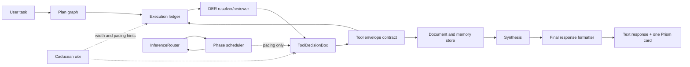
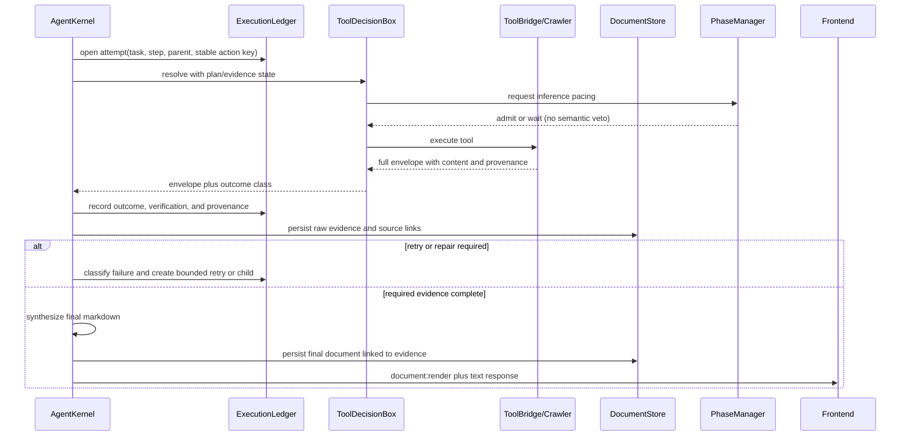

# Design: Long-Horizon DER Execution

## Context

IRIS Voice has a recursive DER operator and a separately designed phase scheduler,
but the live Python 3.13 run exposed seam failures rather than physics-math failures:
a successful `{success, content, sources}` envelope was reduced to `None`, convergence
vetoed required child searches, read-only document access was treated as a duplicate
side effect, and final rendering discarded source provenance.

The design preserves the architecture's central boundary: physics schedules and shapes
work; explicit execution state decides what work is required and whether it is complete.

## Architecture Overview



The execution ledger is the semantic authority. The phase scheduler is the temporal
authority. Caducean state may influence width, priority, or delay, but cannot remove a
required tool from the plan. Tool envelopes remain structured until both textual
verification and document capture consume them.

## Sequence / Data Flow



## Module Seam Architecture (REQ-10–REQ-18)

The foundation (plan → gather → verify → commit → synthesize → render) SHALL
complete a websearch task with the encoder absent. Websearch, the in-app
browser, and vision attach to that foundation as `ToolSpec`-declared modules;
none of them require a change to DER's control flow to attach, and none of
them — including the encoder — are on DER's critical path to completion.

```mermaid
flowchart TB
    subgraph DER["DER foundation (REQ-1..REQ-9, unchanged control flow)"]
        PL[Plan] --> EX[Execute step]
        EX --> VF[Verify: SemanticVerifier]
        VF --> CM[Commit ledger]
        CM --> FOLD{evidence gathered\nfor this goal?}
        FOLD -- "yes, weak score (REQ-13)" --> SY[Synthesize]
        FOLD -- "no evidence yet / genuine\nsemantic failure (REQ-4)" --> SPL[Split into sub-loop]
        SPL --> EX
        SY --> REND[Final render: text + 1 Prism card]
    end
    subgraph SCORER["Verification enhancement seam (REQ-11)"]
        VF -. "score, scorer_tag" .-> ENC{Encoder\npresent?}
        ENC -- "yes: semantic" --> ESC[Encoder score]
        ENC -- "no: fallback" --> FSC[Graded substring/overlap score]
        ESC -.-> VF
        FSC -.-> VF
    end
    subgraph MODULES["Capability modules (REQ-16, REQ-17) — attach via ToolSpec only"]
        WS[websearch: crawler_query / web_search]
        BR[browser: open_url, search]
        VI[vision: vision_detect_element, ...]
    end
    EX -- "ToolSpec dispatch\n(executor/mcp_server/mcp_tool)" --> WS
    EX -- "ToolSpec dispatch" --> BR
    EX -- "ToolSpec dispatch" --> VI
    BR --> INAPP[In-app iframe surface\n(iris:open_tab)]
    BR -. "explicit user click only" .-> EXT[OS browser]
    WS --> HAR[HAR provenance file]
    STEER[User steering / pause / stop\n(REQ-15)] -. "considered at step\nboundary only" .-> PL
    STEER -. "revises" .-> REV[Plan revision event\n(REQ-14, reuses task:start merge)]
    REV -.-> PL
    TRACE[Correlated trace (REQ-18)] -. "scorer_tag + score,\nsynthesis path, revision origin,\nsteering ack, nav surface" .-> DER
    TRACE -.-> SCORER
    TRACE -.-> MODULES
```

Removing the encoder collapses the `SCORER` subgraph to the `FSC` branch only
— DER's shape (plan/execute/verify/commit/synthesize/render) is identical
either way. Removing a module (e.g. vision) removes one `ToolSpec` dispatch
edge — DER's control flow does not change.

## Data Models

### ExecutionAttempt

```text
task_id: str
step_id: str
attempt_id: str
parent_step_id: str | null
action_key: str
tool: str | null
state: planned | running | retrying | terminal
outcome: success | transient | invalid_args | unavailable | empty | semantic | permanent
verified_label: VERIFIED | UNVERIFIED | FAILED
started_at: float
finished_at: float | null
duration_ms: int | null
source_document_ids: list[str]
source_urls: list[str]
error_type: str | null
```

### ToolEnvelope

```text
success: bool
content/result/output/text: optional payload
sources: list[{url, title}]
har_path: str | null
error: str | null
error_type: str | null
cached: bool
```

### FinalRender

```text
document_id: str
turn_id: str
conversation_id: str
format: markdown | table | html | diagram | text
content: str
sources: list[{url, title}]
har_path: str | null
source_document_ids: list[str]
trust: trusted | untrusted
```

`trust` (REQ-22) is set from provenance/`HyphaChannel` assignment ONLY — never from
`ExecutionAttempt.verified_label` or `ScorerTrace.score`. The two fields on a rendered
result are independent: a `VERIFIED` attempt may render with `trust: untrusted`.

### SubLoopFootprint (REQ-21)

```text
step_id: str            # the sub-loop child's own step_id
parent_step_id: str
objective_anchor: str    # inherited today; restated here for completeness
prior_summary: str       # bounded: what has been attempted/gathered for this goal so far
coordinate_ref: str | null   # memory/coordinate lookup key for the full prior evidence, if any
size_bytes: int          # for enforcing the bound in AC2 (Open Question: exact cap)
created_at: float
```

Carried on the child `QueueItem` (a new bounded field, not the full parent message
history) so it survives DCP pruning (REQ-21 AC3) and lets a resumed child reconstruct
context from the footprint plus the existing `TaskRecord`/`ExecutionAttempt` ledger
(REQ-9, REQ-2) without replaying the unpruned conversation.

### ScorerTrace (REQ-11, REQ-18)

```text
task_id: str
step_id: str
assertion: str
score: float
scorer_tag: semantic | fallback
encoder_score: float | null
fallback_score: float | null
created_at: float
```

### PlanRevision (REQ-14, REQ-18)

```text
task_id: str
revision_id: str
origin: sub_loop_split | user_steering
added_step_ids: list[str]
revised_step_ids: list[str]
dropped_step_ids: list[str]
applied_at_step_id: str | null
created_at: float
```

### SteeringMessage (REQ-15, REQ-18)

```text
task_id: str
message_id: str
kind: steer | pause | stop
text: str | null
received_at: float
applied_at_step_id: str | null
acknowledged: bool
resent: bool
```

### BrowserNavigation (REQ-16, REQ-18)

```text
task_id: str
step_id: str | null
url: str
surface: in_app | external
job_id: str | null
har_path: str | null
user_initiated: bool
created_at: float
```

### TaskRecord and FailureEvidence

```text
TaskRecord:
  task_id: str
  conversation_id: str
  lifecycle: planned | running | paused | completed | partial | failed | cancelled
  plan_version: str
  required_step_ids: list[str]
  completed_step_ids: list[str]
  pending_step_ids: list[str]
  active_attempt_id: str | null
  next_action: str | null
  final_document_id: str | null
  revision: int
  updated_at: float

FailureEvidence:
  failure_id: str
  task_id: str
  step_id: str
  attempt_id: str
  class: transient | invalid_args | unavailable | empty | semantic | permanent
  input_summary: str
  tool: str | null
  error_type: str | null
  error_summary: str
  source_document_ids: list[str]
  recovered: bool
  created_at: float
```

`TaskRecord` is the resumable lifecycle source of truth. `ExecutionAttempt` and
`FailureEvidence` are append-oriented learning history. A failure may pause, retry,
partially complete, or terminate a task, but it never mutates historical evidence into
success and never deletes pending work.

### Persistence transaction boundary

For each action, the durable transition is ordered as follows:

```text
1. Persist TaskRecord revision N + ExecutionAttempt(running)
2. Execute the action
3. Persist outcome + FailureEvidence/commit row + TaskRecord revision N+1
4. Only after durable persistence, emit task:learning, task completion, or render-finalized events
5. Resume uses the persisted revision and attempt id; completed side effects are not replayed
```

If step 3 fails, the task remains non-terminal and a bounded persistence retry/outbox
records the problem. Learning events are derived from durable rows rather than being the
only copy of a failure.

## Key Decisions

1. **Ledger over physics veto.** `u=0` means stable oscillator behavior, not semantic task completion.
2. **Stable action identity.** Use normalized text plus explicit query/tool parameters and a cryptographic digest; never use Python's process-randomized `hash()` as a durable key.
3. **Full envelope preservation.** A tool result without `result` is not empty; the envelope itself remains available to formatting and capture.
4. **Failure taxonomy before fan-out.** Recursive split is reserved for semantic or unresolved work, not transport, provider, or envelope errors.
5. **One final card.** Intermediate captures persist evidence. The final synthesized answer renders once with inherited source provenance; explicit `show` remains authoritative.
6. **Failure is information, not task termination.** Failure evidence is append-only and
   available to future routing; lifecycle state separately records whether the task still
   has resumable work.
7. **Resume is idempotent.** A reconnect or restart reuses the persisted task revision and
   attempt identity; completed side effects are not replayed, while unfinished actions may
   resume within their remaining policy budget.
8. **Persistence gates terminal state.** No task is marked completed, and no terminal
   learning/presentation event is emitted, until the corresponding outcome and lifecycle
   revision are durable. Failure persistence is never best-effort-only.
9. **Encoder is an enhancement, never a dependency.** The fallback scorer (REQ-11) is
   graded, not binary, so removing the encoder degrades precision, not completion. The
   `_WEB_CONTENT_TOOLS` CONTENT SUFFICIENCY check (`agent_kernel.py:7736-7759`) already
   proves a search/crawl step can verify without the encoder; REQ-12 closes the remaining
   gap by making the success path synthesize instead of concatenate.
10. **Fold forward, not back.** A weak (non-`FAILED`) verification score after evidence has
    been gathered proceeds to synthesis with an honest confidence label. Split remains
    reserved for genuine, unclassified semantic failure (REQ-4/REQ-13); transport/provider
    failures already do not fan out.
11. **Modules attach at the `ToolSpec` seam, never inside DER's control flow.** Websearch,
    browser, and vision are `ToolSpec`-declared dispatch targets; adding or removing one
    changes a registry entry, not a branch inside the step-execution loop (REQ-17).
12. **The agent's browser is in-app by default, and visible.** `open_url` is routed the
    same way `search` already is (REQ-16); the OS browser is reached ONLY through an
    explicit, user-initiated click on the dashboard's existing "open externally"
    control. Navigation, scroll, and scrape SHALL be visible on that in-app surface with
    a narrating overlay, not a hidden headless fetch.
13. **Coupling, expansion, COMPRESS, and condense are four distinct mechanisms.** They
    SHALL be called by the canonical names below, not used interchangeably (REQ-19).
14. **Build memory and application memory are two different databases with two different
    lifetimes.** `.mcm/coordinates.db` is MCM SDK build tooling used while developing
    IRIS; `backend/data/memory.db` is the application's own coordinate store. The
    application is intended to inherit the MCM schema later — they are not the same
    database now, and no runtime application call site SHALL write to the former (REQ-20).
15. **Trust and verification are orthogonal axes.** A result's `verified_label`/score
    (REQ-11) SHALL NEVER be read as an input to its `HyphaChannel`/trust classification;
    trust is assigned by provenance and enforced by the existing `kyudo.py` zone rules,
    which DER adopts rather than redefines (REQ-22).

## Canonical Vocabulary (REQ-19)

Four mechanisms in this codebase share overlapping informal names ("expand," "compress,"
"condense," "coupling"). This table is the single source of truth for what each SHALL be
called going forward. New code SHALL use these names; the two existing name collisions
(rows 3↔5 and 2↔4) SHALL carry a disambiguating docstring at their definition site rather
than a rename, unless a maintainer separately chooses to rename the underlying method.

| # | Canonical name | What it actually does | Ground truth | Do NOT confuse with |
|---|---|---|---|---|
| 1 | **Session Coupling** | Couples two active SESSIONS' physics parameters `(a, s)` via FFI based on phase alignment; assigns nucleus/barrier roles. Never touches a step or memory. | `backend/agent/coupled_registry.py:148-337` (`_sessions` dict `:153-155`; `apply_coupling` reads `(a,b,s)` at `:262-265`, writes `(a,s)` at `:336`; `_role_energy` `:108-116`). Grep for `memory\|mycelium\|episodic\|store\|db\|coords` in this file: NOT FOUND. | Step Expansion, Node Expansion — coupling adds no steps and touches no coordinate graph. |
| 2 | **Step Expansion** (growth-width split) | Creates new `QueueItem` STEPS as children when live `\|u\|` is below `U_SPLIT`. | `backend/agent/agent_kernel.py:6594-6609` (`_growth_width`), `der_constants.py:233,246` (`U_SPLIT=0.5`, `U_CONVERGED=0.85`), called from `_split_step` (`:6659`). Step-adding call sites: `:6514`, `:8221`, `:8592-8601`, `:8782-8787`. | Node Expansion (row 4) — different axis (`\|u\|` vs. edge-hit variance), different target (a plan step vs. a coordinate-graph node). |
| 3 | **COMPRESS Recommendation** | An integer action code (`1`) returned by `ffi_caducean_recommend()` / passed to `ffi_caducean_update()`. Consumed only as: a raw action int (`agent_kernel.py:6578-6582`), an LLM temperature modulator (`:7064-7085`), a plan-expansion gate (`:8565-8580`), and a persisted DB column (`:8397-8409`). It COMPACTS NOTHING. | `backend/agent/agent_kernel.py:6578-6582,7064-7085,8397-8409,8565-8580` | Node Condense (row 5), DCP Message Pruning (row 6), mcm_compress (row 8) — none of those run when `rec==1`; the recommendation is a scheduling/pacing hint only. |
| 4 | **Node Expansion** (mycelium) | Splits a coordinate-graph NODE into two children when its outbound-edge hit/miss variance exceeds `SPLIT_THRESHOLD=0.40`. | `backend/memory/mycelium/scorer.py:314+` (`expand`) | Step Expansion (row 2) — same English word, unrelated target and trigger. |
| 5 | **Node Condense** (mycelium) | Merges two coordinate-graph NODES within `CONDENSE_THRESHOLD<=0.04` distance, re-pointing edges to the survivor. | `backend/memory/mycelium/scorer.py:233-308` (`condense`) | Landmark Crystallization (row 7) — same method name `condense()`, unrelated operation (node merge vs. session-to-landmark promotion). |
| 6 | **DCP Message Pruning** | Drops/dedups chat messages from context before an LLM call (3-pass: turn protection, tool-call dedup, error-age purge). | `backend/agent/dcp.py:1-9` (overview), `:46-47` (budget note) | Node Condense (row 5), mcm_compress (row 8) — DCP operates on message history, not the coordinate graph or build-memory DB. |
| 7 | **Landmark Crystallization** | Promotes a session's accumulated score into a permanent `Landmark` record. | `backend/memory/mycelium/landmark.py:147+` (`Landmark.condense`) | Node Condense (row 5) — same method name, unrelated operation. |
| 8 | **mcm_compress** (external, build-tooling only) | Checkpoints the MCM SDK build-memory session and force-prunes the OpenCode agent's context. Has NO backend implementation in this repository. | Referenced in `CLAUDE.md`/`AGENTS.md`; implemented by the external OpenCode `mcm-cad` plugin, operating on `.mcm/coordinates.db` (build memory, see Key Decision 14 / REQ-20). | ALL of the above — it is not part of the IRIS Voice runtime application and SHALL NOT be implied to compact any application-owned state. |

## Ripple-Effect Map

| Area / File | Change? | Classification | Why / Evidence |
|---|---|---|---|
| `backend/agent/tool_decision.py` | Yes | CHANGE NEEDED | Preserve full envelopes and distinguish idempotent reads from side effects. The live root failure occurred at this boundary. |
| `backend/agent/agent_kernel.py` | Yes | CHANGE NEEDED | Gather policy, attempt ledger, failure classification, and final provenance live here (`:7020-7159`, `:7947-8005`, `:3081-3149`). |
| `backend/agent/der_execution_ledger.py` | Yes | CHANGE NEEDED | New semantic authority for attempts, identity, recovery, and completion. |
| `backend/agent/phase_manager.py` | No | NO CHANGE (verified) | Owns scheduler theta/rate state; separation is required by `CADUCEAN_ARCHITECTURE.md:167-205`. Add boundary tests instead of semantic coupling. |
| `backend/agent/tool_bridge.py` | Contract lock | CONTRACT LOCK | Returns `{success, content, sources, trust}` at `:2275-2282`; memory and provenance must remain stable. |
| `backend/crawler/crawl_runner.py` | Contract lock | CONTRACT LOCK | Fallback returns PageData and HAR provenance; the ledger consumes its outcome rather than crawler internals. |
| `backend/crawler/orchestrator.py` | Contract lock | CONTRACT LOCK | Shared WS/agent funnel passes `CrawlResult` into extraction and citation stages; fetch boundary is at `:178-220`. |
| `backend/agent/event_bus.py` | Contract lock | CONTRACT LOCK | `DOCUMENT_RENDER` must carry content, URLs, HAR, turn, conversation, and document IDs. |
| `backend/agent/ws_event_bridge.py` | Contract lock | CONTRACT LOCK | Forwards `DOCUMENT_RENDER` and task events to websocket consumers; the event allowlist includes the render boundary at `:49`. |
| `backend/api/chat.py` | Contract lock | CONTRACT LOCK | Subscribes/forwards `DOCUMENT_RENDER` at `:339` and `:369`; backend-to-frontend delivery must remain intact. |
| `hooks/useIRISWebSocket.ts` | No | NO CHANGE (verified) | Handles `document:render` and forwards `iris:document_render` at `:1392-1398`. |
| `components/chat-view.tsx` | No | NO CHANGE (verified) | Listens for `iris:document_render` at `:617-686`. Add tests if payload expands. |
| `components/chat/RichDocument.tsx` | No | NO CHANGE (verified) | Owns Prism Glass markdown rendering at `:32-35`. |
| `hooks/useTaskProgress.ts` | Contract lock | CONTRACT LOCK | Consumes task progress, `step_id`, `detail_url`, and `step_done`; existing F1–F3 tests must remain green. |
| `components/chat/TaskListCard.tsx` | No | NO CHANGE (verified) | Renders `TaskStep` records from `useTaskProgress`; source URL presentation must not regress while the final Prism card is added. |
| `backend/memory/*` | Contract lock | CONTRACT LOCK | Retrieval and source provenance need tests; coordinate-address recall remains UNEXERCISED per architecture §8. |
| `backend/agent/caducean_trajectory.py` | Contract lock | CONTRACT LOCK | Existing commit/session-exit persistence at `:357-447` remains learning history; task lifecycle rows must not duplicate verified counts. |
| Runtime task/queue persistence | Yes | CHANGE NEEDED | A durable `TaskRecord` and failure-evidence store is required for restart/resume; current in-memory queue state is insufficient for REQ-9. |
| Runtime memory database / persistence adapter | Yes | CHANGE NEEDED | Must provide atomic revisioned task updates, append-only failure evidence, retry/outbox behavior, and crash recovery without using the MCM coordinate database. |
| Conversation reconnect/session restoration | Yes | CHANGE NEEDED | Must rehydrate `TaskRecord` before accepting resume or duplicate client actions. |
| `tests/contract/*` | Yes | CHANGE NEEDED | Pin envelope, ledger, physics boundary, and final provenance. |
| `tests/behavioral/*` | Yes | CHANGE NEEDED | Drive the complete search → synthesis → render loop and multi-domain recovery. |
| `scripts/validate_der_*.py` | Yes | CHANGE NEEDED | Replay bounded trajectories and assert no duplicate/veto/completion regressions. |

### Ripple-Effect Map additions (REQ-10–REQ-18)

| Area / File | Change? | Classification | Why / Evidence |
|---|---|---|---|
| `backend/agent/verifier.py` (`_substring_score`, `_score_assertion`) | Yes | CHANGE NEEDED | REQ-11: replace binary containment (`:281-284`) with a graded fallback; `verified_fraction`/`_score_assertion` (`:204-279`) already return `(score, scorer_tag)` — only the fallback's internals change. |
| `backend/agent/agent_kernel.py` (`_der_synthesize_outcome` call site) | Yes | CHANGE NEEDED | REQ-12: success path (`:6356-6357`) must synthesize instead of `"\n".join(...)`; wire or replace the dead `_synthesize_response` (`:9019`, zero call sites). |
| `backend/agent/agent_kernel.py` (split gate) | Yes | CHANGE NEEDED | REQ-13: extend the existing `step_success`/FAILED-only split gate (`:8116-8138`) so a merely-weak graded score (REQ-11) also folds forward instead of splitting; the D4 transient/unavailable/invalid/empty/permanent no-split gate (`:8148-8206`) is already correct and stays. |
| `backend/agent/agent_kernel.py` (`task:start` emit sites) | Yes | CHANGE NEEDED | REQ-14: tag each `task:start` payload with a revision `origin` (`sub_loop_split` vs `user_steering`) at the existing emit sites (`:4770-4781`, `:5635-5656`); the frontend merge logic itself is NO CHANGE. |
| `backend/main.py` (`_session_message_locks`, `_dispatch`) | Yes | CHANGE NEEDED | REQ-15: a mid-turn message today only queues behind the per-session lock (`:2131`, `:2192-2214`); a new channel must let it reach the RUNNING loop at a step boundary instead of waiting for `handle_message` to return. |
| `backend/mcp/builtin_servers.py` (`BrowserServer.execute_tool`) | Yes | CHANGE NEEDED | REQ-16: `open_url` (`:109-114`) still calls `webbrowser.open`; must route in-app like `search` (`:116-121`, already fixed per `tool_bridge.py:1241-1246`). |
| `backend/agent/tool_bridge.py` (`open_url` dispatch) | Yes | CHANGE NEEDED | REQ-16: intercept `"open_url"` before the `mcp_tools` table (`:1211-1212`) the same way `"search"` is intercepted (`:1247-1254`). |
| `backend/agent/tool_executor.py` (`_open_url`, `_search`) | Yes | CHANGE NEEDED | REQ-16: duplicate `webbrowser.open` implementation (`:631-652`) must be removed or made unreachable. |
| `backend/agent/tool_registry.py` (`open_url` ToolSpec) | Yes | CHANGE NEEDED | REQ-16: set `requires_internet=True` (currently unset at `:334-340`) so the internet gate applies. |
| `components/dark-glass-dashboard.tsx` (agent-navigation wiring) | Small | CHANGE NEEDED | REQ-16: route agent-initiated `open_url` through the existing `iris:open_tab` listener (`:620-641`) — the iframe/address-bar surface itself (`:464-466`, `:970-979`, `:1345-1380`) needs no change. |
| `backend/agent/tool_registry.py` (`ToolSpec` dataclass) | No | NO CHANGE (verified) | REQ-17: the field set (`:44-70`) already covers everything a new module needs to declare; no new fields required. |
| `backend/crawler/crawler_engine.py`, `crawl_runner.py` (Crawl4AI + HAR + httpx fallback) | No | NO CHANGE (verified) | REQ-17: reference implementation of the module seam — Crawl4AI/Playwright (`crawler_engine.py:155-171`), HAR generation (`:91-107`, called at `:385` and `crawl_runner.py:327,345`), httpx fallback (`crawl_runner.py:370-395`) are all already correct; this feature does not touch them. |
| `backend/tools/vision_mcp_server.py`, vision `ToolSpec`s | No | NO CHANGE (verified) | REQ-17: vision is already wired end to end (`vision_mcp_server.py:26-53`, `tool_registry.py:244-275`) — a second reference implementation of the seam. |
| `hooks/useTaskProgress.ts` (`task:start` merge-by-id) | No | NO CHANGE (verified) | REQ-14: the merge logic at `:210-227` (keep live status, refresh description/tool) already supports plan revision; only the backend payload needs a new `origin` field, which this hook can ignore or pass through. |
| `hooks/useTaskProgress.ts` (`update_step` writes `activeDetail` only) | No | NO CHANGE (verified) | REQ-14 AC3: the invariant that live progress never overwrites `description` already holds (`:377-398`); this feature adds a regression test, not a code change. |
| `components/chat-view.tsx` (`handleSendMessage` guard) | No | NO CHANGE (verified) | REQ-15: the `isTyping` send guard is already removed (`:1131-1139`); the frontend can already send mid-turn. The gap this feature closes is entirely `backend/main.py`. |
| `backend/tests/contract/test_der_band_contract.py` (0.8/0.3 bands, CT-E3) | No | CONTRACT LOCK | REQ-11 AC2: the band thresholds and label strings this file pins remain unchanged; only the fallback scorer feeding them changes granularity. |
| `components/dark-glass-dashboard.tsx` (iframe browser panel) | No | NO CHANGE (verified) | REQ-16: the in-app surface (`browserUrl`/`iframeRef` at `:464-466`, navigate handler at `:970-979`, address bar + iframe + explicit external-open button at `:1345-1380`) already exists; REQ-16 only needs `open_url` routed to it. |

### Ripple-Effect Map additions (REQ-19–REQ-22)

| Area / File | Change? | Classification | Why / Evidence |
|---|---|---|---|
| `backend/agent/caducean_trajectory.py` (`CaduceanTrajectoryRecorder.__init__`, docstring) | Yes | CHANGE NEEDED | REQ-20: the `db_conn is None` fallback (`:125-136`) silently binds to `.mcm/coordinates.db` (build memory) instead of the application store; the constructor docstring (`:107-110`) falsely claims it is always backed by the same DB as `MemoryInterface`. Both need correction. |
| `backend/agent/agent_kernel.py` (`record_commit` call site) | Yes | CHANGE NEEDED | REQ-20: `CaduceanTrajectoryRecorder()` constructed with no argument (`:8244`) must bind to the application's `MemoryInterface`, matching the already-correct pattern at `:8435` (`get_trajectory_recorder(self._memory_interface)`). |
| `backend/agent/coupled_registry.py` | No | NO CHANGE (verified) | REQ-19/REQ-21: confirmed to touch only session physics state (`_sessions: Dict[str, _SessionRecord]`, reads/writes via `ffi_caducean_get_state`/`ffi_caducean_set_params` only); grep for `memory\|mycelium\|episodic\|store\|db\|coords` in this file returns NOT FOUND. Session Coupling stays out of scope for the sub-loop footprint (REQ-21) and the trust axis (REQ-22) — it never touches either. |
| `backend/memory/mycelium/scorer.py` (`condense`, `expand`) | No | NO CHANGE (verified) | REQ-19: confirmed correct as Node Condense (`:233-308`, merges within `CONDENSE_THRESHOLD<=0.04`) and Node Expansion (`:314+`, splits at variance `>0.40`); this feature only adds a disambiguating docstring pointing at the canonical-vocabulary table, not a behavior change. |
| `backend/memory/mycelium/kyudo.py` (`HyphaChannel`, `CellWall` zone rules) | Contract lock | CONTRACT LOCK | REQ-22: `HyphaChannel`/`CellWall`/`RagIngestionBridge` (`:40-179`) are the TRUST AUTHORITY this requirement adopts rather than redefines. DER's `FinalRender.trust` and REQ-11's verification score SHALL read/write through this existing model, never bypass or duplicate it. |
| `backend/memory/mycelium/interface.py` (`ingest_document_data` trust routing) | Contract lock | CONTRACT LOCK | REQ-22: `trust=="untrusted" -> HyphaChannel.EXTERNAL -> REFERENCE_ZONE` and crystallization-exclusion (`:667-684`) is the existing enforcement DER's data model must remain consistent with. |
| `backend/agent/der_loop.py` (`QueueItem` dataclass) | Yes | CHANGE NEEDED | REQ-21: add a bounded `footprint` (or equivalently-named) field so sub-loop children (constructed at `agent_kernel.py:6669-6679`) carry more than `description`/`objective_anchor`; every other field currently takes the dataclass default (`:76-93`) for a child. |
| `backend/agent/agent_kernel.py` (`_split_step` child construction) | Yes | CHANGE NEEDED | REQ-21: populate the new `QueueItem.footprint` at the child-construction site (`:6669-6679`) from the parent's prior attempts/evidence, bounded per AC2. |
| `components/dark-glass-dashboard.tsx` (browser overlay layer) | Yes | CHANGE NEEDED | REQ-16 AC8/AC9: a new narration overlay on the existing iframe surface (`:1345-1380`, unchanged) is required; the existing `iris:crawler_started`/`iris:crawler_page_fetched` precedent (`dashboard-wing.tsx:105-136`) is a page-count indicator, not this overlay, and does not by itself satisfy the new behavioral ACs. |
| `backend/tools/vision_mcp_server.py`, vision `ToolSpec`s | No | NO CHANGE (verified) | REQ-16: reused as the overlay's data source (`vision_analyze_screen`, `vision_detect_element`) through the existing `ToolSpec` dispatch (`tool_registry.py:244-275`); no new server or tool needed. |
| `backend/agent/verifier.py` (`verified_fraction`/`_score_assertion` return value) | Contract lock | CONTRACT LOCK | REQ-11 AC6/REQ-22: `(score, scorer_tag)` SHALL remain the only thing these functions return — no trust/channel field is added to or read from this return value; trust stays entirely out of the verifier's surface. |

## Error Handling

- Malformed envelopes become `invalid_args` or `permanent` and are recorded; they do not become empty successful results.
- Provider 429s and timeouts become `transient`; the scheduler controls delay and the ledger controls retry count.
- Valid tools with empty content become `empty`; alternate-source policy handles them.
- Semantic verification failures may repair or split; transport failures do not fan out recursively.
- Missing memory becomes bounded degraded retrieval, never an `AttributeError` that poisons a step.
- A task persistence failure prevents false `completed` state and emits an explicit persistence error; the user response remains honest.
- A restart rehydrates task state before accepting a resume request; duplicate resume requests are idempotent.
- A crash between execution and persistence leaves the task non-terminal and recoverable; a crash after persistence does not replay the completed side effect.
- Render persistence failure does not block the text response; the render reports missing provenance explicitly.
- All recovery paths have bounded work-unit and attempt limits.
- Encoder import/inference errors degrade to the graded fallback scorer (REQ-11); they never fail the step or block completion (mirrors the existing `_score_assertion` try/except at `verifier.py:268-276`).
- A weak (non-`FAILED`) verification score after evidence has been gathered folds forward to synthesis with an honest confidence label; it does not raise or trigger a split (REQ-13).
- An unacknowledged steering message is re-sent rather than silently dropped; a stop is never delayed behind an unrelated steering message (REQ-15).
- A denied or misconfigured internet-access gate on `open_url` returns an explicit capability error, matching the existing gate behavior for other network tools (REQ-16 AC3).
- A module's `ToolSpec` registration failure (bad dispatch target) is reported at registration time, not as a silent no-op at call time (REQ-17).
- A `CaduceanTrajectoryRecorder` constructed without an explicit `MemoryInterface` binding fails loudly (raises or logs at ERROR) rather than silently writing to the build-memory database (REQ-20 AC2).
- A sub-loop child whose `SubLoopFootprint.coordinate_ref` is pruned or unavailable degrades to its inherited text fields (`description`/`objective_anchor`) rather than failing the step (REQ-21).
- A graded fallback score (REQ-11) never raises, never blocks, and — per REQ-22 — never mutates a result's `trust` field; scoring and trust assignment are fully independent failure domains.

## Testing Strategy

### Contract

- Dispatch preserves `content`, `sources`, `har_path`, `cached`, and errors.
- Ledger rows contain attempt fields and verified labels for success, partial, and failure.
- Physics boundary proves scheduler pacing does not become semantic tool authorization.
- `DOCUMENT_RENDER` contains final content, URLs, HAR, document ID, turn ID, and conversation ID.
- `verified_fraction`/`_score_assertion` return `(score, scorer_tag)` for both the encoder and fallback paths; the `0.8`/`0.3` bands and label strings remain exactly as pinned by `test_der_band_contract.py` CT-E3/CT-E5 (REQ-11).
- The step-execution split gate only fires for a genuine, unclassified semantic failure; a weak non-`FAILED` score does not reach `_split_step` (REQ-13).
- `open_url` dispatch is intercepted before the `mcp_tools` table exactly like `search` already is, and never calls `webbrowser.open` (REQ-16).
- `open_url`'s `ToolSpec` carries `requires_internet=True` and is denied when the internet gate is closed (REQ-16 AC3).
- `backend/agent/coupled_registry.py` contains zero references to `memory|mycelium|episodic|store|db|coords` (REQ-19 AC5).
- A DER commit recorded through the application's normal call path writes into `backend/data/memory.db`'s trajectory/commit tables, never into `.mcm/coordinates.db` (REQ-20 AC3).
- A graded fallback score change (REQ-11) is asserted to leave a result's `trust`/`HyphaChannel` classification byte-for-byte unchanged (REQ-11 AC6, REQ-22).
- A crawl/HAR-sourced result that scores `VERIFIED` at `1.0` still asserts `trust: untrusted` and a zone no higher than `REFERENCE_ZONE` (REQ-22 AC2/AC3).

### Behavioral

- Full search → crawl/fallback → capture → synthesis → final text + one Prism card.
- Successful crawl never produces verify-failed split because of envelope loss.
- Failed required web work can retry or use an alternate source while converged physics remains stable.
- Repeated `get_rendered_documents` reads do not become duplicate-call failures.
- A three-domain task completes or emits an honest incomplete outcome with remaining nodes.
- A crash/restart replay resumes unfinished work without replaying completed side effects and preserves failure evidence.
- Failure evidence remains queryable after the task later succeeds; recovery does not erase the original miss.
- A websearch task completes end to end with the encoder ABSENT: evidence gathered, synthesis reached, one Prism card with sources rendered, no re-gather loop (the top-level acceptance gate for REQ-10–REQ-18).
- A successful task with zero failed steps still synthesizes (not raw-concatenates) its final answer (REQ-12).
- A weak-but-non-`FAILED` verification result on a task with prior evidence proceeds directly to synthesis with a lower confidence label instead of spawning a duplicate gathering step (REQ-13).
- A mid-task plan revision (add/revise/drop steps) is visible in the task card without ever overwriting a step's live progress, and without ever destroying an already-completed step's status (REQ-14).
- A mid-task steering message is acknowledged, considered at the next step boundary, and can revise the plan without aborting the task; a stop aborts at the next boundary; a pause suspends and a later resume does not repeat completed side effects (REQ-15).
- An agent-initiated `open_url`/`search` call opens the in-app browser surface; the OS browser only opens via the dashboard's explicit "open externally" button (REQ-16).
- A new capability module (declared purely via `ToolSpec`) can be exercised through the step-execution loop with zero changes to DER's plan/execute/verify/commit/synthesize control flow (REQ-17).
- A single correlated trace for one task shows scorer tag/score, synthesis path, every revision's origin, every steering message's acknowledgement and applied boundary, and every navigation's target surface (REQ-18).
- An agent-initiated `open_url` navigation is visibly reflected in the in-app iframe (address bar and content change), and a subsequent scroll/scrape shows a corresponding overlay/visual cue (REQ-16 AC6/AC7).
- The browser overlay narrates a changing sub-goal across a multi-page navigation sequence, sourced through existing vision `ToolSpec` calls and/or crawler progress events, and its state transitions appear in the REQ-18 trace (REQ-16 AC8/AC9).
- A growth-width split's children each carry a `SubLoopFootprint`; after a simulated DCP prune of the message history, a child step still resumes correctly using only its footprint plus the ledger (REQ-21).
- A task whose evidence is entirely external (crawl/HAR) reaches a `VERIFIED`/high-confidence final answer while every contributing source, and the final render, remain `trust: untrusted` end to end (REQ-22, ties to REQ-6's Prism card).

### Physics-aware CDD

- Replay converged, oscillating, loaded, and scheduler-disabled states with identical plan state.
- Assert physics changes pacing/width but not required-tool authorization.
- Assert synthesis re-gather is denied by evidence/plan state, not `u`.
- Assert no 429 amplification from retries, split children, or graft planning.
- Inject crashes between execution, commit, and presentation; assert lifecycle persistence and exactly-once terminal transition.
- Run persistence-outage and reconnect scenarios; assert no false completion, no duplicate side effect, and durable failure learning.

### Standing harness

Run the existing `scripts/validate_der_*.py` family plus new trajectory replays on every
change. Keep known unrelated failures explicitly classified; do not weaken their inputs
or assertions to obtain a green run.
