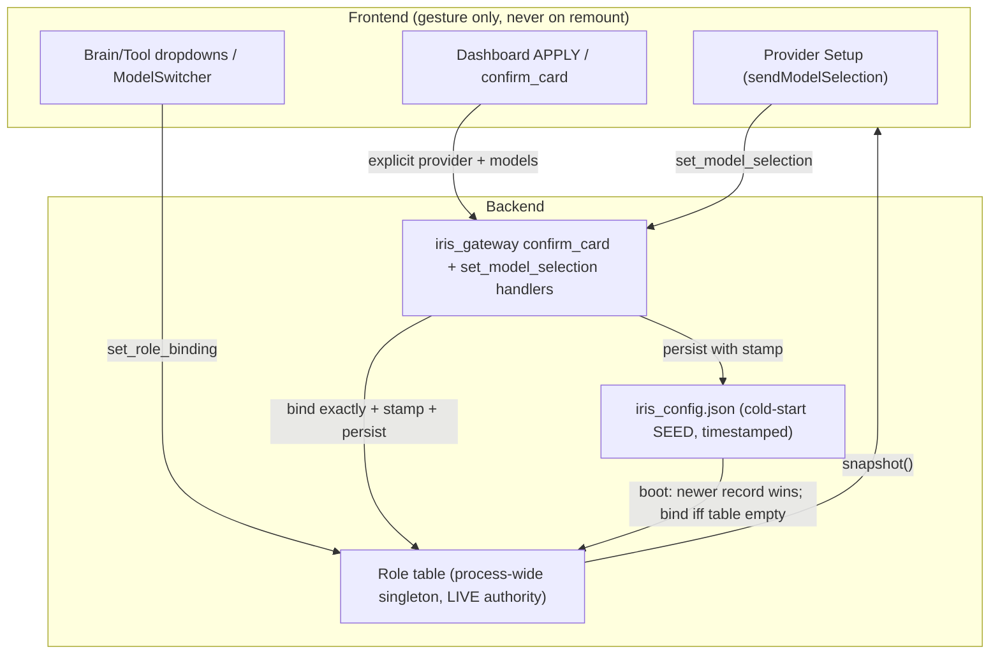

# Design: Model Selection Authority

## Context
Three selection surfaces (Dashboard Models card, Brain/Tool dropdowns, wheel-view/model switcher) write through three backend paths (`confirm_card`, `set_model_selection`, `set_role_binding`) into one process-wide role table, with `iris_config.json` as a conflicting second writer (flat provider fields + role_bindings, no timestamps). Two heuristics ("flat is stale" at boot, "live choice wins" at seed) guess wrong in opposite directions depending on which record is actually fresh — 08-16 needed flat-ignored, 09-03 needed flat-honored. Local-model visibility (scan → registry → snapshot → dropdown options) has an unlocated break. Constraints: widget remounts must be no-ops; restarts must preserve; no paid API calls in verification.

## Architecture Overview
One authority ladder, enforced at a single choke point per writer:



Authority order: **explicit gesture > timestamped persist > cold seed**. Nothing else writes.

## Sequence / Data Flow

```mermaid
sequenceDiagram
    participant U as User dropdown
    participant F as Frontend card
    participant G as iris_gateway
    participant R as Role table
    participant C as iris_config.json
    U->>F: pick provider + model (gesture)
    F->>G: confirm_card / set_model_selection
    G->>G: resolve effective provider+models (catalog guard)
    G->>R: bind roles EXACTLY (switch) or preserve (echo)
    R-->>G: bound
    G->>C: persist provider + bindings + overrides + selected_at
    G->>F: broadcast snapshot (all surfaces sync in 1 tick)
    Note over R,C: Boot: compare selected_at; newer wins; bind iff table empty
    Note over F: Remount: re-fetch snapshot only, zero sends
```

## Data Models
```python
# InferenceConfig += (backend/iris_config.py:277)
provider_selected_at: float = 0.0   # epoch of last EXPLICIT user selection
role_bindings: list                 # [{role, instance_id, model_override}] + each entry
                                    # carries selected_at (same clock as above)
# Snapshot (status_snapshot.py:132) += selected_at per binding (already
# projects _r.snapshot(); extend snapshot shape, not a new endpoint)
```

## Key Decisions
- **Timestamps over heuristics (chosen).** The flat-vs-bindings contradiction is undecidable without recency. One float per record ends the guessing permanently.
  Rejected: always-bind-flat-on-boot (reintroduces the 08-16 revert); flat-always-stale (the 09-03 bug); version counters (clock skew-free but opaque to humans reading config).
- **Choke-point binding (chosen).** All gesture paths funnil through `set_role_binding` semantics (exact bind + stamp + persist + broadcast). Rejected: per-path ad-hoc binding (the current sprawl — three paths, three opinions — is the disease).
- **Echo detection stays** (`_provider_switch` logic): same-provider APPLY preserves splits. It is correct and remount-safe; the bug was never here.
- **Local model for real e2e (chosen).** Paid providers can't be the proof loop (trial burn, flakiness). A loaded GGUF through the real router is fully real: real backend, real WS, real inference, real restart.
- **Swarm seam (chosen): defer + surface, don't decide.** The future swarm spec owns swarm lifecycle; this spec only guarantees a switch during swarm is recorded (timestamped intent + snapshot flag + authority log) instead of silently swallowed as today. No swarm logic here.
- **Unload fallback (chosen): loud, not silent.** Fall back to last API AND user-facing message, because a quiet fallback is indistinguishable from the revert class this spec kills.
- **No frontend redesign.** `ModelInferenceSection` already sends correctly (`:213-246` guards); remount behavior already correct (`useInferenceState` version guards). Frontend work is verify-only unless T0 finds otherwise.

## Ripple-Effect Map
| Area / File | Change? | Classification | Why / Evidence |
|---|---|---|---|
| `iris_config.py:277` InferenceConfig | Yes | CHANGE NEEDED | add `provider_selected_at` + per-binding stamps; migration default 0.0 |
| `agent_kernel.py:14383` set_model_selection | Yes | CHANGE NEEDED | stamp explicit selections; bind exactly on preserve=False |
| `iris_gateway.py:1613` confirm_card | Yes | CHANGE NEEDED | stamp + persist on APPLY; keep echo-preserve branch |
| `iris_gateway.py:6815` _handle_set_model_selection | Yes | CHANGE NEEDED | stamp + persist (same choke-point semantics) |
| `main.py:604-642` boot restore | Yes | CHANGE NEEDED | newer-record-wins + bind-iff-empty (replaces flat-stale heuristic) |
| `inference/router.py:336-382` seed | Yes | CHANGE NEEDED | accept stamped seed; keep skip-if-bound |
| `status_snapshot.py:132` snapshot | Yes | CHANGE NEEDED | project selected_at (shape extension, same endpoint) |
| `ModelInferenceSection.tsx:176-246` senders | No | NO CHANGE (verified) | sends correctly with guards — :213-221 |
| `useInferenceState.ts:270-341` remount/fetch | No | NO CHANGE (verified) | gesture-only sends; version-guarded fetch |
| `useIRISWebSocket model_selection_updated` | No | NO CHANGE (verified) | rebroadcasts payload — :1379-1382 |
| `test_provider_switch_keeps_own_model` + `test_provider_survives_restart` + `test_chat_row_and_card_agree` | No code | CONTRACT LOCK | must stay green; encode current correct behavior |
| `set_role_binding` API shape | No code | CONTRACT LOCK | frontend + wheelview + switcher depend on it — CT-ROLE-1 |
| snapshot shape `providers/role_bindings` | No code | CONTRACT LOCK | dropdown option builders depend on it — CT-SNAPSHOT-1 |
| Local-model scan→registry→snapshot chain | TBD | Phase 0 discovery | T0 locates the missing-dropdown break before any fix |

## Error Handling
- Bind to unknown instance → `role_binding_error`, previous bindings kept (existing `set_role_binding` contract).
- Empty model + named provider → catalog default, never cross-provider wear (existing guards kept).
- Corrupt/partial config at boot → boot unbound (wait-for-user), never guess; warning logged.
- Persistence write failure → live table still updated (memory of record is the table, not the file); error logged.
- Timestamp tie / both zero → current heuristic + explicit warning (migration window only).

## Testing Strategy
```
tests/unit/         stamp compare, echo-vs-switch predicate, catalog-guard (pure logic)
tests/contract/     CT-ROLE-1 (set_role_binding shape), CT-SNAPSHOT-1 (snapshot shape),
                    CT-AUTHORITY-1 (every apply path emits authority-chain line),
                    CT-PERSIST-1 (persist writes provider+bindings+overrides+stamp atomically)
tests/behavioral/   existing provider trio must stay green (no code changes there)
scripts/            NEW standing harness: scripts/validate_model_selection_e2e.py —
                    drives the REAL backend (manager-launched) over WS+REST:
                    switch → next-turn routing → restart → remount simulation →
                    20-cycle soak; local GGUF only, zero API spend
```
- **Contract tests** pin every boundary the three writers share (binding shape, snapshot shape, persist atomicity, authority log line). A future edit breaks the interface first, loudly.
- **Behavioral (real, non-synthetic):** the harness boots the real backend, loads a real local model, APPLYs over a real WS, sends a real message, asserts the turn was served locally (no `api.*` POST in `.iris-logs`, router log shows `instance=local:*`), restarts, asserts persistence, reconnects fresh (remount) with zero sends and asserts no drift, repeats 20 cycles. The "user" is scripted; everything else is production.
- **Intertwined:** every harness failure decomposes into the contract test that would have caught it (e.g. crossed pair → CT catalog-guard test).
