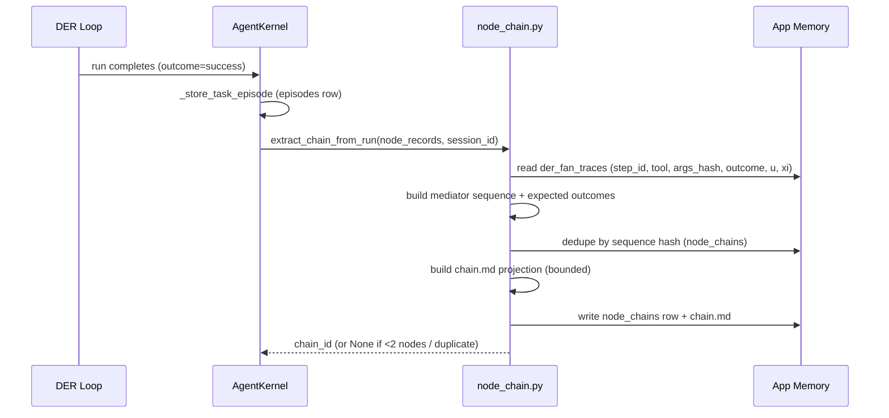
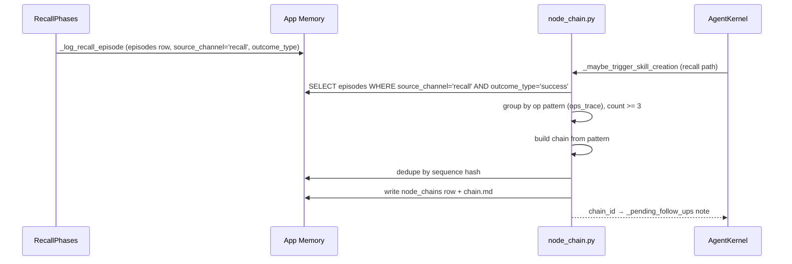
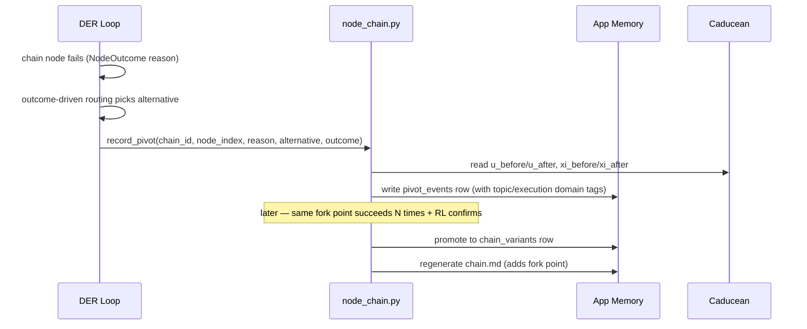

> **SUPERSEDED (2026-08-23).** This spec is merged into
> [`specs/wormhole-aperture/`](../wormhole-aperture/) as **Stage C — Node Chains**.
> Node Chains is no longer a peer feature: it is the CONSUMER that proves a delivered
> recall was worth delivering. Its REQ IDs are preserved via the mapping table in
> `specs/wormhole-aperture/requirements.md` (NC REQ-1..15 -> REQ-18..31).
> Do not implement from this file. Kept for provenance only.

# Design: Node Chains — Emergent, Composable Skills

## Context

IRIS records every action as a node with a mediator, an outcome, and an RL signal,
but never reads those traces back as executable plans. The current skill genesis
(`workflow_capture.py`) captures an order-insensitive set of tool names from the live
run only, and the recall-episode genesis path was designed but never wired (failing
C3 test). Node chains make successful node paths first-class, loadable, RL-scored
chains that seed future execution, with pivots recorded as queryable events.

This builds on two existing specs:
- **dag-node-execution-model** — every action is a node; typed routable outcomes;
  outcome-driven routing; mid-execution re-planning; strangler-fig adoption.
- **der-dag-inversion** — the DER loop as the execution substrate.

The chain layer adds: extraction (live + recall), pivot recording, RL-scored
promotion, chain-guided execution, and the minimal `chain.md` projection.

## Architecture Overview

```
┌────────────────────────────── APP MEMORY (data/memory.db) ──────────────────────────────┐
│                                                                                          │
│  TRACE LAYER (exists)                    CHAIN LAYER (new)                               │
│  ┌──────────────────────────┐            ┌──────────────────────────────┐                │
│  │ der_fan_traces           │            │ node_chains                 │                │
│  │  (step_id, tool, args,   │──extract──▶│  chain_id, name, trigger,   │                │
│  │   outcome, u, xi)        │            │  nodes[], stats, provenance │                │
│  ├──────────────────────────┤            ├──────────────────────────────┤                │
│  │ episodes                 │            │ pivot_events                │                │
│  │  (source_channel,        │──extract──▶│  chain_id, node_index,      │                │
│  │   outcome_type,          │            │  trigger, alternative,      │                │
│  │   tool_sequence)         │            │  outcome, u/xi delta        │                │
│  ├──────────────────────────┤            ├──────────────────────────────┤                │
│  │ mycelium_traversals      │            │ chain_variants              │                │
│  │  (path_node_ids,         │──promote──▶│  (fork point → variant)     │                │
│  │   path_score, outcome)   │            └──────────────────────────────┘                │
│  ├──────────────────────────┤            ┌──────────────────────────────┐                │
│  │ caducean_trajectories    │──RL signal─▶ chain.md projection (REQ-7)  │                │
│  │  (x, y, xi, u, action,   │            │  generated, minimal, bounded │                │
│  │   outcome, eml_after)    │            └──────────────────────────────┘                │
│  └──────────────────────────┘                                                     │
└──────────────────────────────────────────────────────────────────────────────────┘
        ▲                                        │
        │ chain-guided seeding (REQ-6)           │ PivotEvent on deviation (REQ-4)
        │                                        ▼
┌─────────────────────────── DER LOOP (unchanged execution) ───────────────────────────┐
│  DirectorQueue (seeded from chain OR free plan)                                      │
│  └─ Node execution (NodeOutcome, split/fold-back, probe, chosen_branch)              │
│       └─ outcome-driven routing (dag-node-execution-model REQ-4)                     │
└──────────────────────────────────────────────────────────────────────────────────────┘
```

## Sequence / Data Flow

### Chain extraction from a live DER run (REQ-2)



### Chain extraction from recall episodes (REQ-3 — fixes C3)



### Pivot recording + promotion (REQ-4, REQ-5)



## Data Models

### NodeChain (new table `node_chains`)

| field | type | notes |
|---|---|---|
| chain_id | TEXT PK | uuid |
| name | TEXT | derived from first mediator, human-readable |
| trigger | TEXT | when to use (from task class / domain tags) |
| sequence_hash | TEXT | stable hash of mediator sequence — dedupe key |
| nodes | TEXT (JSON) | ordered `[{mediator, tool_version, args_schema, expected_outcome, verified_fraction, context_signature}]` |
| fork_points | TEXT (JSON) | `[{node_index, reason, variants[]}]` |
| stats | TEXT (JSON) | `{uses, success_rate, avg_score, size_bytes, load_cost}` |
| provenance | TEXT (JSON) | `{source: live|recall, session_id, task_summary, created_at}` |
| confidence | REAL | 0..1, updated by RL signal |
| chain_md_path | TEXT | generated projection path |
| created_at / updated_at | REAL | |

### PivotEvent (new table `pivot_events`)

| field | type | notes |
|---|---|---|
| pivot_id | TEXT PK | uuid |
| chain_id | TEXT | FK → node_chains |
| node_index | INTEGER | where it forked |
| trigger | TEXT | NodeOutcome Reason (closed vocab, nodes/outcome.py:40) |
| alternative_taken | TEXT | mediator chosen instead |
| outcome | TEXT | OK / PARTIAL / FAILED |
| u_before / u_after | REAL | RL delta (nullable) |
| xi_before / xi_after | REAL | RL delta (nullable) |
| topic_domain / execution_domain | TEXT | task-relevance tags (registry-backed) |
| promoted | INTEGER | 0/1 — became a variant |
| created_at | REAL | |

### ChainVariant (new table `chain_variants`)

| field | type | notes |
|---|---|---|
| variant_id | TEXT PK | uuid |
| chain_id | TEXT | FK → node_chains |
| fork_node_index | INTEGER | where the fork diverges |
| nodes | TEXT (JSON) | the alternative suffix |
| pivot_ids | TEXT (JSON) | justifying PivotEvents |
| success_count | INTEGER | N successes at this fork |
| rl_confirmed | INTEGER | RL signal confirmed improvement |
| created_at | REAL | |

### chain.md (generated projection — REQ-7, REQ-8)

```markdown
---
name: <chain name>
trigger: <when to use>
confidence: <0..1>
nodes: <count>
chain_id: <stable reference — the LINK, never a content hash>
---

# <Chain name>

## Purpose
<one line: what this chain accomplishes>

## Nodes
1. <mediator> → <expected outcome>
2. <mediator> → <expected outcome>
...

## Forks
- node 2: IF <reason> THEN try <alternative> → <outcome>
```

Size-bounded (REQ-8 AC1). No tutorial, no phases, no examples. Generated, never
hand-written.

**Storage + linking (REQ-7 AC6-AC10):**

```
data/chains/<chain_id>.md          ← the loadable file (app data dir)
        ▲  chain_md_path (chain → file)          ▲  chain_id in frontmatter (file → chain)
        │                                         │
node_chains.chain_id ──chain_md_hash──▶ staleness detection (hash differs → regenerate)
        │
        └──pin_links (relationship='chain_md')──▶ pins table
                                                   pin_type='chain_md'
                                                   ref_status: alive|stale  ← upgradability tracker
                                                   last_validated: timestamp
```

- **Link = stable `chain_id`** (both directions). Never a content hash — a hash
  changes on every regeneration and would break the link.
- **Hash = staleness detector only.** `chain_md_hash` on the chain record; when the
  chain changes, hash differs → regenerate → update hash. Idempotent: same chain_id,
  new content.
- **Pin = searchable index + upgradability tracker.** Each chain.md is registered as
  a pin (`pin_type='chain_md'`), linked to its chain via `pin_links`. Chain changes →
  pin `ref_status='stale'` → regenerated → `ref_status='alive'` + `last_validated`
  updated. Future agents find chains via `pin_search`.

## Key Decisions

1. **Chains live in app memory, not MCM.** The MCM coordinate graph is the dev/build
   instrument; the app's runtime memory (`data/memory.db`) is where the agent's
   behavior lives. Chains are runtime objects.
2. **New tables, not mycelium reuse.** `mycelium_traversals`/`mycelium_landmarks`
   are the trace source; chains are a first-class consumer. New tables keep the
   chain layer queryable and independent of mycelium's decay/merge lifecycle.
3. **Extraction reads traces, not the tool-name heuristic.** `workflow_capture.py`'s
   Jaccard-on-tool-names is replaced by sequence-hash dedupe on mediators. Order,
   outcomes, and params are preserved.
4. **Chain-guided execution seeds the queue; it does not replace DER.** The
   DirectorQueue is seeded from the chain; every node still runs through NodeOutcome
   + routing + fold-back. Determinism is a prior, not a cage.
5. **Pivots are RL events.** The u/ξ delta is part of the PivotEvent record, and
   promotion requires RL confirmation — the Caducean engine is the reinforcement
   signal, not a separate reward system.
6. **chain.md is a projection, not a source.** Hand-written md files are never chain
   sources. This is what prevents the bloat the user is concerned about.
7. **Agent-created nodes are NODE GRAFTS.** A graft grows a node from a chain
   (`origin='chain_graft'`, REQ-10) or a script (`origin='script_graft'`, REQ-11) and
   integrates it into the registry. `origin='native'` covers built-in/MCP/hand-
   registered nodes — NOT grafts. A failed self-test REJECTS the graft without
   touching the registry. Chain grafts need no approval (composition of approved
   nodes); script grafts default to `read_only` and require approval to escalate.
   "Graft" has DER precedent (`DirectorQueue.graft_attempts`, der_loop.py:262).

## Use Cases (grand vision)

### UC-1: Video editing pipeline (the reference composite)
User uploads a video to ChatView or references a file location. The agent composes
`analyze_video_frames` (VLM) → `transcribe_media` (Parakeet) → `clip_video` (ffmpeg)
→ (grafted) `add_captions` / `add_music` — all registered nodes
(`tool_registry.py:876,891,909`). First run: free planning, captured as a chain
(REQ-2). Later runs: chain-seeded (REQ-6), pivots recorded (REQ-4), improvements
promoted (REQ-5, REQ-13).

### UC-2: Self-created MCP servers (script-graft pattern)
An MCP server is a script speaking JSON-RPC over stdio/HTTP. The agent writes the
server script and grafts it as a node (`origin='script_graft'`, REQ-11) — bridging to
any API/CLI/database without backend code. The sandbox defaults to NO network
(REQ-11 AC2); going online requires user approval (REQ-11 AC3). The
`mycelium_mcp_registry` accepts runtime-registered servers with a trust level. This
is NOT a separate feature — it is the script-graft pattern applied to the MCP
protocol.

### UC-3: Cross-domain composition
Any registered node composes with any other (REQ-14 AC5 — verified no domain filter
exists). A single chain may span vision + audio + memory + web + editing. Artifact
compatibility is validated at composition (REQ-14 AC4); the chain's permission tier
is the max of its nodes, approved as a unit (REQ-15).

## Ripple-Effect Map (MANDATORY)

| Area / File | Change? | Classification | Why / Evidence |
|---|---|---|---|
| `backend/agent/node_chain.py` (NEW) | Yes | CHANGE NEEDED | New module: NodeChain/PivotEvent/ChainVariant models, extraction (live+recall), pivot recording, promotion, chain.md generation |
| `backend/memory/db.py` | Yes | CHANGE NEEDED | New tables `node_chains`, `pivot_events`, `chain_variants` (schema at `:229` mycelium_traversals pattern) |
| `backend/agent/agent_kernel.py` | Yes | CHANGE NEEDED | `_maybe_trigger_skill_creation` (`:1535`) rewritten: live-run extraction + recall-episode path (currently returns early on empty tool_sequence `:1561`); call site `:7021` |
| `backend/agent/workflow_capture.py` | Yes | CHANGE NEEDED | Refactored to produce chains (mediator sequences) instead of tool-name sets; `should_capture`/`self_test_skill` logic superseded by sequence-hash dedupe + registered-tool validation |
| `backend/agent/der_loop.py` | Yes | CHANGE NEEDED | `DirectorQueue` (`:243`) gains chain-seeded construction; NodeRecord finalize site records pivot on deviation |
| `backend/agent/recall_phases.py` | No code | NO CHANGE (verified) | `_log_recall_episode` (`:433`) already records `ops_trace` + `outcome_type` + `[recall:{ops_key}]` prefix — chain extraction reads these rows |
| `backend/agent/caducean_trajectory.py` | Yes | CHANGE NEEDED | Pivot recording reads u/xi from `der_fan_traces`/`caducean_trajectories`; may add a read helper |
| `backend/memory/mycelium/store.py` | No code | NO CHANGE (verified) | `log_traversal` (`:546`) already records `path_node_ids` + `path_score` — chain extraction reads them |
| `backend/agent/nodes/outcome.py` | No code | CONTRACT LOCK | `NodeStatus`/`Reason` closed enum (`:30,:40`) is the pivot trigger vocabulary — pin with contract test CT-1 |
| `backend/memory/pins.py` (or equivalent) | Yes | CHANGE NEEDED | chain.md pin registration (`pin_type='chain_md'`), `pin_links` chain→pin, `ref_status` staleness tracking (REQ-7 AC8-AC9) |
| `backend/agent/auto_research.py` | Yes | CHANGE NEEDED | `AutoResearchRunner` reads `named_skills` for refinement (`:364` `_pick_skill_candidate`) — must also read chains |
| `backend/memory/semantic.py` | No code | CONTRACT LOCK | `named_skills` category shape (`:320` update_user_display) — skill UI depends on it; pin with contract test CT-2 |
| `backend/agent/semantic_gate.py` | No code | NO CHANGE (verified) | Routes on rules + coordinates, not skills — unaffected |
| `backend/agent/tests/test_recall_fixes.py` | No code | CONTRACT LOCK | `TestC3SkillGenesisSql` (`:239`) must pass with new recall-based genesis — the test is the requirement |
| `backend/tests/test_workflow_capture.py` | Yes | CHANGE NEEDED | Existing capture tests (`:55-134`) assert tool-name-set behavior — superseded by chain extraction; assertions preserved where behavior is preserved |
| Skill UI / frontend | Yes | CHANGE NEEDED | Displays `named_skills`; may add chain display (chain.md list) |
| `backend/agent/tool_registry.py` | Yes | CHANGE NEEDED | `ToolSpec` gains `origin` field (`native`/`chain_graft`/`script_graft`), `executor="script"` type (`:58`), `context_signature` (REQ-12 AC1), and `version`/`signature_hash` (REQ-13 AC1); `register_tool` (`:99`) accepts grafts; duplicate guard reused |
| `backend/agent/tool_bridge.py` | Yes | CHANGE NEEDED | Script-graft dispatch (`:825` media tools pattern) — runs sandboxed subprocess, maps exit to NodeOutcome |
| `backend/agent/script_sandbox.py` (NEW) | Yes | CHANGE NEEDED | Sandbox runner: subprocess + timeout + no shell expansion + bounded args + no network by default (REQ-11 AC2) |
| `backend/agent/tool_evolution.py` (NEW) | Yes | CHANGE NEEDED | Tool-change detection (signature/version diff), chain re-validation trigger, improvement feedback (REQ-13) |

## Error Handling

| Failure mode | Response |
|---|---|
| Extraction finds < 2 successful nodes | No chain; logged at debug (REQ-2 AC4) |
| Recall query returns < 3 matching episodes | No chain; logged (REQ-3 AC1) |
| Chain already exists (sequence hash match) | Dedupe — no new chain; usage counter incremented |
| RL signal unavailable at pivot time | u/xi recorded as null; pivot still recorded (REQ-4 edge) |
| Promotion conditions not met | Pivot stays recorded; refusal logged with cause (REQ-5 AC4) |
| chain.md generation fails (unwritable dir) | Chain stays in memory; retry on next change; never fatal (REQ-7 edge) |
| Chain archive threshold reached | Deferred to maintenance pass; never on critical path (REQ-8 edge) |
| Chain node's mediator unavailable at execution | Node skipped with recorded reason; chain flagged for re-validation (REQ-6 edge) |
| Chain-guided execution disabled | Free planning, exactly as today (REQ-6 AC5) |

## Testing Strategy

Organized per the project standard (contract + behavioral + unit + standing CDD
harness):

```
backend/tests/unit/         pure logic only (extraction, dedupe, promotion math)
backend/tests/contract/     boundary pins (chain record shape, pivot record shape,
                            chain.md format, named_skills compatibility)
backend/tests/behavioral/   full-loop drives (chain-seeded DER run, pivot recorded
                            during real execution, promotion after N+RL)
scripts/validate_der_*.py   standing CDD harness — replay recorded trajectories
                            through the FULL stack; assert chains + pivots emerge
```

- **Contract tests:**
  - CT-1: NodeOutcome Reason vocabulary unchanged (pivot trigger vocabulary) —
    pins `nodes/outcome.py` closed enum.
  - CT-2: `named_skills` semantic category shape unchanged — skill UI keeps working.
  - CT-3: NodeChain record shape (all REQ-1 AC1 fields present).
  - CT-4: PivotEvent record shape (all REQ-4 AC2 fields present).
  - CT-5: chain.md format (frontmatter fields + bounded size, REQ-7/REQ-8).
  - CT-6: chain.md pin registration — `pin_type='chain_md'`, `pin_links`
    relationship='chain_md', `ref_status` flips stale→alive on regeneration
    (REQ-7 AC8-AC9).
  - CT-7: context signature shape on every node (domain + artifact contract + intent,
    REQ-12 AC1) and graft near-duplicate refusal (REQ-12 AC4).
  - CT-8: tool version/signature_hash on chain nodes (REQ-13 AC1) and chain
    re-validation trigger on tool signature change (REQ-13 AC2).
  - CT-9: chain permission resolution — tier = MAX of node tiers, chain-as-unit
    approval, approved tier recorded, re-check on tool evolution (REQ-15 AC1-AC5).
- **Behavioral tests:**
  - BT-1: Full DER run with outcome=success produces a chain (REQ-2).
  - BT-2: 3 successful recall episodes produce a chain — the C3 test path (REQ-3).
  - BT-3: Chain-seeded run pivots on a routable failure and records a PivotEvent
    (REQ-4, REQ-6).
  - BT-4: Repeated successful pivot + RL confirmation promotes a variant (REQ-5).
  - BT-5: chain.md never exceeds the size bound even for long chains (REQ-8).
  - BT-6: Chain replay with two similar tools picks the context-fit tool, not the
    name-match (REQ-12 AC3); a wrong-fit mediator triggers a pivot.
  - BT-7: A tool signature change flags referencing chains stale and re-validates
    them; an improved tool bumps chain confidence (REQ-13 AC2, AC4).
- **Physics-aware:** inject Caducean u/ξ states and assert promotion fires only when
  RL confirms (REQ-5 AC4) — split when oscillating, no promotion when neutral.
- **Standing CDD harness:** extend `scripts/validate_der_*.py` to replay recorded
  trajectories and assert chains + pivots emerge from the replay, contracts hold on
  every run.

The failing C3 test (`test_recall_fixes.py::TestC3SkillGenesisSql`) is the
requirement for REQ-3 — it must pass unmodified.