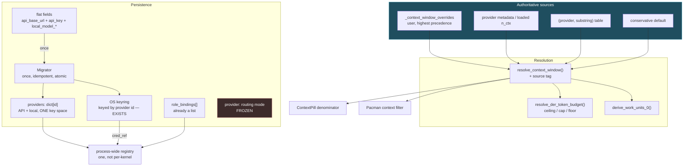
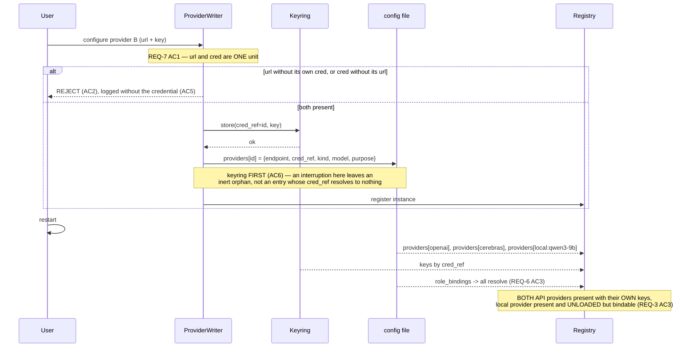

# Design: Phase 1 — Foundation

## Context

This phase exists because three subsystems share one defect shape: **an authoritative value exists,
and a guess outranks it.**

| Subsystem | Authoritative value | The guess that beat it |
|---|---|---|
| DER budget | `window × 0.9` | `DER_TOKEN_BUDGETS[class]` applied as a floor |
| Context window | loaded `n_ctx` / provider metadata | `(provider, substring)` table, then an 8k default |
| Providers | the in-memory registry (already multi-provider) | a config with one `api_base_url` + one `api_key` |

Grouping them into one phase is the whole point of the re-cut. They were previously split across
three topic specs, which produced cross-spec conflicts (two collections migrating the same fields;
a `NO CHANGE (verified)` claim that expired) rather than one coherent change.

**Bounding constraints:**

| Constraint | Source | Consequence |
|---|---|---|
| One collection keyed by id | Decision Locked #1 | Local and API entries share a key space |
| Endpoint + credential are one record | Decision Locked #2 | Mismatch is unrepresentable, not validated |
| Keyring already per-id | Decision Locked #3 | Wire to it; do not rebuild |
| Routing mode frozen | Decision Locked #4 / REQ-9 | `provider` field is untouchable this phase |
| Mode table is a ceiling | Decision Locked #5 | Table values and `get_token_budget` unchanged |
| Never guess a window upward | Decision Locked #6 | No provider-wide default above the conservative one |

---

## Architecture Overview



Four properties this shape enforces:

1. **`resolve_context_window()` has exactly one output, consumed by four things.** Budget, work
   units, ContextPill, and Pacman all read the same value — which is why the old defect produced
   four unrelated-looking symptoms, and why AC4's "same window" requirement is structural.
2. **Precedence is a strict order, top to bottom.** Override → authoritative → table → default. The
   old code ran the table *before* the authoritative source; the arrow order here is the fix.
3. **`MODE` has no edges.** Routing mode neither reads from nor writes to anything this phase
   changes — REQ-9 made structural rather than promised.
4. **`MIG` is the only reader of `FLAT`.** After migration the flat fields are dead, so there is no
   second source of truth to drift.

---

## Sequence: configuring a second provider, then restarting



---

## Data Models

```python
@dataclass
class ProviderEntry:
    """One entry in THE single collection. API and local share the key space."""
    id: str              # "openai" | "cerebras" | "local:qwen3-9b"
    label: str
    kind: str            # API | LOCAL_OPENAI | INPROCESS | OLLAMA
    model: str
    purpose: str = "chat"          # chat | embedding | rerank  (REQ-4 AC3)
    # API entries only — written together, never independently (REQ-7 AC1)
    endpoint: Optional[str] = None
    cred_ref: Optional[str] = None # keyring reference. NEVER the key.
    # Local entries only
    model_path: Optional[str] = None
    profile: Optional[str] = None
```

`endpoint` and `cred_ref` are fields of the *same record*. That is the mechanism behind REQ-7:
there is no standalone `api_base_url` for a writer to touch alone.

```python
@dataclass
class InferenceConfig:
    provider: str = "api"                 # ROUTING MODE — FROZEN (REQ-9)
    providers: dict[str, ProviderEntry] = field(default_factory=dict)   # THE collection
    role_bindings: list = field(default_factory=list)                   # unchanged
    config_version: int = 2               # REQ-8 AC3 once-only marker
    # api_base_url / api_key / local_model_* — read by the migrator only, then dead
```

```python
@dataclass(frozen=True)
class ResolvedWindow:
    tokens: int
    source: str          # "override" | "authoritative" | "table" | "default"  (REQ-10 AC1)
```

`source` is what makes REQ-2 AC4 checkable — "unknown" must be visible, and a boolean
"was it a default" is the smallest thing that makes it so.

---

## Key Decisions

### D-1: The mode table becomes a ceiling; the floor is applied last and clamped

```python
_window_cap   = max(int(window * DER_WINDOW_UTILISATION), 1)
_mode_ceiling = DER_TOKEN_BUDGETS.get(task_class, ...)
_budget       = min(_mode_ceiling, _window_cap)
return          max(_budget, min(DER_BUDGET_MIN_FLOOR, _window_cap))
```

**Rationale.** The original intent — "never go below a sane minimum" — was right; `max()` was the
wrong operator for it. Because every table value is 15k–80k, `max(window×0.9, floor)` made the floor
win for any model under ~44k, so the derivation was dead code and an 8k model was authorised 40k.
Applying the floor **last** and clamping it by the window makes an overcommit unrepresentable rather
than merely unlikely.

**Rejected — delete the mode table.** `_decide_mode` ([`der_loop.py:220`](../../backend/agent/der_loop.py))
routes to QUICK below `BUDGET_ABSOLUTE_MIN` and `_should_escalate`
([`:283-289`](../../backend/agent/der_loop.py)) compares remaining budget against `mode_budget`.
Without the table, escalation loses its comparison basis and a 256k model hands a single-tool
"quick" task 230k.

**Deferred — fractions instead of absolute tokens.** OQ-1. Changing the ceiling *semantics* in the
same phase as the floor *fix* would make neither attributable.

### D-2: Precedence is override → authoritative → table → default

**Decision.** The substring table drops below any authoritative source (REQ-2 AC2).

**Rationale.** The existing code already contains the correct comment — the loaded-`n_ctx` branch
states the table *"would otherwise under/over-size the budget vs the real window"* — and then runs
the table first anyway. The authoritative path existed; only its position was wrong.

### D-3: A too-high default is a bug; a too-low default is a cost

**Decision.** No provider-wide default above the conservative one (REQ-2 AC6).

**Rationale.** Budget is `window × 0.9`. Overstating the window re-creates precisely the overcommit
this phase removes, and it does so *silently*. Understating it wastes capacity, which is visible and
correctable by an override. The asymmetry is the whole reason `("cerebras", "", N)` was **not**
added alongside the confirmed `gemma-4-31b` entry.

### D-4: Endpoint and credential are one record, not one validation

**Decision.** Both live in `ProviderEntry`, written together (REQ-7 AC1).

**Rationale.** A validation rule must be applied at every writer, and a writer added later inherits
nothing. Putting both in one record makes the mismatched pair *unrepresentable*. Same reasoning as
D-1: concentrate the decision so forgetting it is impossible rather than discouraged.

### D-5: Keyring write precedes config write

**Decision.** Store the credential, then write the entry (REQ-7 AC6).

**Rationale.** Asymmetric failure. Config-then-keyring leaves an entry whose `cred_ref` resolves to
nothing — a provider that looks configured, gets offered, and fails at request time.
Keyring-then-config leaves an unreferenced keyring entry, which nothing reads and the next write for
that id overwrites.

### D-6: One collection, ownership split by entry kind

**Decision.** Local and API entries share `providers` and its key space (REQ-6 AC7).

**Rationale.** Two collections would reproduce at the config layer exactly the split-registry problem
REQ-5 exists to delete, and give the frontend two places to look for "a provider". This is the M1
conflict from the previous spec cut, designed out by putting both in one phase.

---

## Ripple-Effect Map

| Area / File | Change? | Classification | Why / Evidence |
|---|---|---|---|
| `der_constants.resolve_der_token_budget` | **Done** | CHANGE LANDED (`01e6625b`) | D-1. Purely additive — `DER_TOKEN_BUDGETS` / `get_token_budget` byte-identical. |
| `agent_kernel.py:5352` | **Done** | CHANGE LANDED (`01e6625b`) | Consumes the resolver; logs budget+window+class+units. |
| `der_loop._decide_mode` (`:220`), `_should_escalate` (`:283-289`) | **No** | **CONTRACT LOCK** | Both read `DER_TOKEN_BUDGETS`; the table must keep its shape and values (**CT-F1**, REQ-1 AC6). |
| `agent_kernel.resolve_context_window` (`:934-975`) | **Yes** | CHANGE NEEDED | Reorder to D-2 precedence; return a `ResolvedWindow` with `source` (REQ-2, REQ-10 AC1). |
| `_KNOWN_CONTEXT_WINDOWS` (`:884-932`) | **Yes (add only)** | CHANGE NEEDED | Retained as the below-authoritative fallback. Add confirmed entries only — **never** a raised provider-wide default (REQ-2 AC6, D-3). |
| `derive_work_units_0` | **No** | **CONTRACT LOCK** | Signature unchanged; must receive the **same** window as the budget (**CT-F2**, REQ-1 AC4). |
| `iris_gateway.py:7896` | **Yes** | CHANGE NEEDED | Load handler stops **creating** the instance; flips status on an existing one (REQ-3 AC1). |
| `iris_gateway.py:7910` | **Yes (delete)** | CHANGE NEEDED | Fan-out loop 1 of 3 (REQ-5 AC3). |
| `iris_gateway.py:8605-8618` | **Yes (delete)** | CHANGE NEEDED | Fan-out 2 of 3 — `set_role_binding` peer propagate. **Phase 5's switcher writes through this handler**, so a half-deletion surfaces there first. |
| `iris_gateway.py:6012` | **Yes (delete)** | CHANGE NEEDED | Fan-out 3 of 3 — `_handle_set_model_selection`. |
| `iris_gateway.py:1339-1407` | **Yes** | CHANGE NEEDED | Startup restore calls `set_model_selection` then `set_role_binding` with a load-bearing ordering comment. Hydration must not double-apply; the ordering must survive. |
| `iris_gateway.py:8580` | **Yes** | CHANGE NEEDED | Binding guard becomes a status flag, not a veto (REQ-3 AC6). |
| `agent_kernel.py:962, :8476, :8544` | **Yes** | CHANGE NEEDED | Literal `"local"` comparisons migrate to namespaced ids (REQ-4 AC4). |
| `inference/registry.py`, `provider.py`, `router.py` | **Yes** | CHANGE NEEDED | Process-wide registry; `ProviderInstance` gains `loaded`/`loading`/`purpose`. Additive `to_dict` (REQ-3 AC2, REQ-5). |
| `provider.py:49-53` — keyring fallback | **No** | NO CHANGE (verified) | Already resolves per provider id via `get_secret(self.id)`. REQ-6 AC4 wires to it; **do not rebuild** (Decision Locked #3). |
| `provider.py:65` — `has_key` | **No** | NO CHANGE (verified) | Already emitted. It is **not** a new field. |
| `provider.py:42` — `api_key` per-instance | **No** | NO CHANGE (verified) | Registry already holds several providers' keys; only persistence is single-slot. |
| `InferenceRouter.generate()` | **No** | **CONTRACT LOCK** | The phase-scheduler gate lives here. Registry work must not drop it (**CT-F3**, REQ-5 AC6). |
| `InProcessTransport.generate` | **No** | **CONTRACT LOCK** | Signature + 3-tuple unchanged (**CT-F4**). |
| `iris_config.py` | **Yes** | CHANGE NEEDED | Gains `providers` + `config_version`. Migrates **both** API and local flat fields (REQ-8 AC1). |
| `iris_config.py:187` — `provider` | **No** | **CONTRACT LOCK** | Routing mode frozen (**CT-F5**, REQ-9). |
| `iris_config.py:230` — `role_bindings` | **No** | NO CHANGE (verified) | Already a list; it was the *provider* side that was flat. |
| `/api/inference/state` payload | **Yes (additive)** | CHANGE NEEDED | Gains `loaded`, `loading`, `purpose`. `has_key` already present. Additive so consumers are unaffected (**CT-F6**). |
| `components/ModelInferenceSection.tsx` | **No (this phase)** | **CONTRACT LOCK** | Consumes `providers[]` + `role_bindings[]`; additive fields keep it working (**CT-F7**). ⚠️ **Phase 4 changes it** — `providerOptions` maps unfiltered (`:80`), so it must gain a `purpose === "chat"` filter once non-chat providers exist. This lock is valid for Phase 1 only. |
| `hooks/useInferenceState.ts` | **No (this phase)** | NO CHANGE (verified) | Already fetches `/api/inference/state`, merges `provider_added` / `role_bindings_updated`, exposes `sendRoleBinding` (`:47-121`). Phase 5 adds types only. |
| ContextPill denominator | **No code** | NO CHANGE — **behaviour shifts** | After REQ-2, a 16k-loaded Mistral shows **16k not 32k**, and an unlisted provider stops showing 8.2k. Expected; do not "fix" it back. |
| `quota_key()` / `rate_meter` | **No** | NO CHANGE (verified) | Local kinds unmetered by `ProviderKind` (`provider.py:16-22`); more local instances stay unmetered. |
| `backend/audio/parakeet_service.py`, TTS | **No** | NO CHANGE (verified) | Not on any path this phase touches. |

---

## Error Handling

| Failure | Response |
|---|---|
| Window unknown for a provider | Conservative default, `source="default"`, logged and exposed (REQ-2 AC4). Never a raised default (D-3). |
| Budget would exceed the window | Impossible by construction (D-1); asserted by CT-F2 and the harness. |
| Endpoint written without its own credential | **Reject and report** (REQ-7 AC2); log without the credential (AC5). |
| Crash mid provider-write | Previous entry intact (AC3); keyring-first ordering makes the orphan inert (D-5). |
| Keyring unavailable | Provider **not** persisted; user told. Never fall back to the config file. |
| Migration fails | Original config untouched, failure reported, app runs unmigrated (REQ-8 AC4). |
| Flat fields **and** collection both present | Collection wins; flat ignored, **never merged** (REQ-8 AC6). |
| Binding references an absent provider | Reported as dangling, not silently dropped (REQ-6 AC3). |
| Model file missing at load | Provider stays registered, `loaded=false`, typed error naming the path (REQ-3). |
| Role bound to unloaded local, request arrives | Load on demand or typed error. **Never** silently answer from another provider (REQ-3 AC4). |
| Credential in a downstream error string | Redacted before logging (REQ-10). |

---

## Testing Strategy

```
backend/tests/unit/         budget allocation, window precedence, migration, cred pairing
backend/tests/contract/     registry, payload shape, routing freeze, table shape
backend/tests/behavioral/   two providers across restart, bind-before-load, no overcommit
scripts/validate_phase1_foundation.py   STANDING CDD HARNESS
```

### Unit

- `test_der_budget_allocation.py` — **parametrized over windows {2k, 8k, 32k, 128k, 256k} × classes
  {quick, implement, full}**: budget never exceeds the window; the mode ceiling binds on large
  windows; the floor never exceeds the window (REQ-1 AC7). Dropping a window or a class from the
  parametrize list is a test modification.
- `test_window_precedence.py` — override > authoritative > table > default, and `source` is tagged
  correctly for each (REQ-2 AC2/AC3, REQ-10 AC1).
- `test_no_raised_provider_default.py` — no provider-wide table entry exceeds the conservative
  default (REQ-2 AC6, D-3). Guards the asymmetry, which is easy to "helpfully" break.
- `test_endpoint_cred_atomic.py` — **all three cases**: url-without-cred rejected, cred-without-url
  rejected, endpoint-only edit of an *existing* provider **permitted** (REQ-7 AC1/AC2 + edge case).
  The third case stops the rule being over-applied into blocking key rotation.
- `test_no_cross_provider_credential.py` — REQ-7 AC4.
- `test_no_key_in_config_file.py` — after any write, the config file **bytes** contain no
  credential. Asserted on the file, not the object.
- `test_migration.py` — flat → collection preserves endpoint/key/model for **both** API and local
  fields; bindings still resolve; twice is a no-op; failure leaves the original intact (REQ-8).
- `test_migration_collection_wins.py` — REQ-8 AC6, never merged.

### Contract

| ID | Pins | Asserts |
|---|---|---|
| **CT-F1** | DER mode table | `DER_TOKEN_BUDGETS` keys and values unchanged; `get_token_budget` behaviour unchanged (REQ-1 AC6). |
| **CT-F2** | Budget ↔ work units | Both derive from the **same** window; budget ≤ window for every class (REQ-1 AC1/AC4). |
| **CT-F3** | `InferenceRouter.generate` | Signature unchanged **and the phase-gate call still present** (REQ-5 AC6). |
| **CT-F4** | `InProcessTransport.generate` | Signature + 3-tuple return unchanged. |
| **CT-F5** | Routing-mode freeze | `provider` field name, vocabulary, and the `active_provider` alias unchanged (REQ-9). |
| **CT-F6** | `/api/inference/state` payload | `id`/`label`/`kind`/`model`/`api_base_url`/`has_key` retained; `loaded`/`loading`/`purpose` additive; **no** credential anywhere in the payload. |
| **CT-F7** | Registry is process-wide | `/api/inference/state` and a WS-session kernel return the **same** instance set (REQ-5 AC2). |
| **CT-F8** | Local id namespacing | No registry id equals the bare `"local"`; every local id matches `local:*` (REQ-4 AC1). |
| **CT-F9** | Config schema | `providers` keyed by id; every API entry has **both** `endpoint` and `cred_ref`; `cred_ref` is never a credential (REQ-6). |

### Behavioral

- `test_no_budget_overcommit.py` — an unlisted provider resolving to the default must **not**
  produce a budget above its resolved window. The live cerebras case (REQ-1).
- `test_two_providers_survive_restart.py` — two API providers, different keys, bound to different
  roles; restart; **both** resolve with their **own** credentials (REQ-6 AC2). **Fails today** —
  the headline acceptance evidence.
- `test_second_provider_does_not_erase_first.py` — **no restart**. Isolates the storage bug from
  the reload path; today the in-memory registry masks it for the whole session anyone would test in.
- `test_bind_before_load.py` — configure local, bind `reasoning`, **never load**; binding succeeds
  and persists (REQ-3 AC3). Fails today at `iris_gateway.py:8580`.
- `test_two_local_models.py` — two local instances bound to `reasoning` and `tool_execution`
  simultaneously (REQ-4 AC2). **Impossible today.**
- `test_binding_survives_restart.py` — REQ-3 AC5, REQ-6 AC3.
- `test_upgrade_preserves_existing_provider.py` — from a real pre-upgrade config; provider present,
  bound, no key re-entry (REQ-8 AC5).
- `test_routing_mode_unchanged.py` — **parametrized over all four** `provider` values against a
  recorded baseline (REQ-9 AC3). Dropping one is a test modification.
- `test_no_silent_provider_fallback.py` — a request for a role bound to an unloaded local provider
  either loads it or errors; it **never** answers from a different provider (REQ-3 AC4). The one
  whose failure would be invisible in normal use.

### Intertwined

| Real defect | Behavioral test | Contract decomposition |
|---|---|---|
| Floor beat the derived budget | `test_no_budget_overcommit` | **CT-F2**, `test_der_budget_allocation` |
| Table outranked the authoritative window | `test_no_budget_overcommit` | `test_window_precedence` |
| Provider created on load (`:7896`) | `test_bind_before_load` | **CT-F6** (status representable) |
| Single `"local"` id | `test_two_local_models` | **CT-F8** |
| Per-kernel fan-out (3 sites) | `test_binding_survives_restart` | **CT-F7** |
| Single flat `api_key` | `test_two_providers_survive_restart` | **CT-F9** |
| Second provider erases first (masked in-session) | `test_second_provider_does_not_erase_first` | `test_endpoint_cred_atomic` |
| Routing changed as a side effect | `test_routing_mode_unchanged` | **CT-F5** |

### Physics-aware

- `DER_WORK_UNITS_0` is the unified termination resource. Assert that a task on a small window
  terminates on **work units** rather than by exhausting a budget it should never have been given —
  i.e. that budget and units agree on when to stop (REQ-1 AC4).

### Standing CDD harness

`scripts/validate_phase1_foundation.py` asserts on every run:

1. CT-F1..CT-F9 hold.
2. Budget ≤ window for every (window, class) pair in the REQ-1 AC7 matrix.
3. Budget and work units derive from the same window.
4. No provider-wide table default exceeds the conservative default.
5. No config file written by any path contains a credential or fragment.
6. No `/api/inference/state` response contains a credential or fragment.
7. Every API entry has **both** `endpoint` and `cred_ref`; a fixture missing one is rejected.
8. Two providers with different keys round-trip through config + keyring with their own credentials.
9. A synthetic pre-upgrade config migrates with bindings intact; migrating twice is a no-op.
10. Routing resolves identically for all four `provider` values.
11. No registry id is the bare literal `"local"`.

Assertions **2 and 5–6** are the ones worth running on every commit regardless of what changed: an
overcommit and a credential leak both fail silently, and neither produces a user report.
