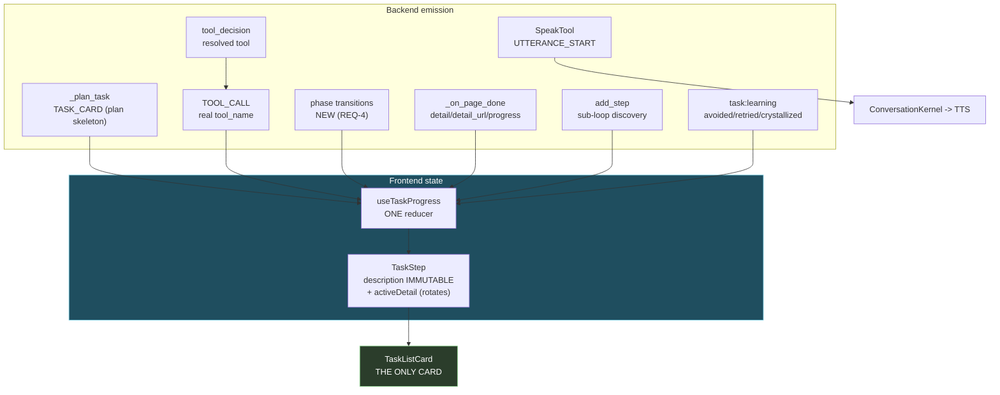
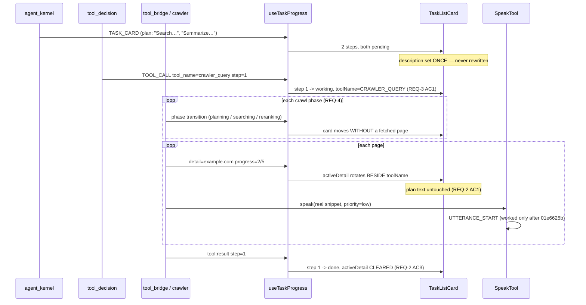

# Design: Phase 2 — The Instrument

## Context

This phase makes the app tell the truth about its own execution. It exists because three of its
four preconditions were broken in ways that produced *plausible* output rather than errors — the
hardest class to notice:

| Was | Symptom | Status |
|---|---|---|
| `speak()` raised `NameError` on every call | "narration is inconsistent" | fixed `01e6625b`, untested |
| `update_step` overwrote `description` | plan text vanished mid-task | fixed `01e6625b`, untested |
| `tool:call` never wrote `toolName` | card showed the planner's guess | fixed `01e6625b`, untested |
| progress emitted only on fetched pages | card sits at 0/2 during real work | **REQ-4, open** |
| `npx jest` runs 0 tests | none of the above was caught | **REQ-6, open** |

The ordering insight: **REQ-6 comes early, not last.** Three display bugs survived indefinitely
because no frontend test has ever run. Writing more display code before the suite executes repeats
the condition that produced them.

**Bounding constraints:**

| Constraint | Source | Consequence |
|---|---|---|
| One card, no fallback | Decision Locked #1 | No second component; degenerate state is the *same* card |
| Plan immutable | Decision Locked #2 | Progress needs its own field — done, needs tests |
| Agent decides speech | Decision Locked #6 | Not a fixed-interval heartbeat alone |
| Spoken ⊆ visible | Decision Locked #7 | Coherence is assertable from logs |
| Phase 1 green | execution order | Registry + budget truthful before display is trusted |

---

## Architecture Overview



Three properties this shape enforces:

1. **One reducer, one card.** Every backend signal funnels through `useTaskProgress` into one
   component. A "different card" cannot exist because there is nowhere to build one (REQ-1 AC2).
2. **`description` and `activeDetail` are different fields with different lifetimes.** The plan is
   written once at `task:start`; detail is written by progress and cleared on terminal transitions.
   Separating them is what makes REQ-2 structural rather than a convention.
3. **`PH` is the only new emitter.** Everything else already exists. REQ-4 is an emission gap, not
   an architecture change — which is why "rewrite the crawl pipeline" is a Non-Requirement.

---

## Sequence: a websearch, told truthfully



---

## Data Models

```typescript
export interface TaskStep {
  id: string
  /** PLAN text. Immutable for the life of the step (REQ-2 AC1). */
  description: string
  status: TaskStepStatus
  /** RESOLVED tool, adopted from tool:call (REQ-3 AC1). */
  toolName?: string
  /** Live rotating source, beside toolName. Cleared on terminal (REQ-2 AC2/AC3). */
  activeDetail?: string
  activeProgress?: string
  resultPreview?: string
}
```

Two fields, two lifetimes. `description` is written at `task:start` and by a plan revision that
preserves status; `activeDetail` is written by progress and cleared by every terminal transition.

```python
# REQ-4: structured phase transition — no sentence parsing (REQ-2 AC4)
{
  "phase": "planning" | "searching" | "fetching" | "reranking" | "extracting" | "citing",
  "detail": str,            # host/title when applicable
  "detail_progress": str,   # "2/5"
  "update_step": True,
}
```

---

## Key Decisions

### D-1: `description` and `activeDetail` are separate fields, not one field with modes

**Decision.** Progress never writes `description` (REQ-2 AC1).

**Rationale.** The old code had one field and a flag, and the flag lost: `update_step=true`
overwrote the plan. With one field there is no way to render "what I set out to do" and "what I am
doing" at once, and no way to recover the plan after it is overwritten. Two fields make the plan
*unlosable* rather than *usually preserved*.

### D-2: The card adopts the resolved tool, it does not wait for it

**Decision.** Render the plan immediately; update `toolName` when `tool:call` arrives (REQ-3 AC1).

**Rationale.** Resolution lands ~1s after planning. Waiting would leave the card blank during the
most uncertain second of the task; ignoring the update leaves it permanently wrong. Adopting on
arrival is the only option that is both immediate and correct.

### D-3: Phase transitions, not more page events

**Decision.** Emit on phase boundaries inside the tool (REQ-4 AC1).

**Rationale.** The card's stillness is not a UI problem — the pipeline only speaks once, on
`CRAWLER_PAGE_FETCHED`. Plan, search, rerank, extract and cite are all invisible. Adding UI polish
to a silent backend produces a prettier still card.

**Rejected — infer progress from elapsed time.** A progress bar that moves without evidence is the
phantom-card failure in a new costume.

### D-4: Jest runs before new display code is written

**Decision.** REQ-6 lands in Wave 1, not at the end.

**Rationale.** Three display bugs survived because no frontend test has ever executed. Writing REQ-2
through REQ-5 into an unverifiable suite repeats exactly the condition that produced them. This is
the cheapest structural change in the phase and it protects every task after it.

### D-5: Speech failures are failures

**Decision.** A swallowed speech exception is logged as a failure, not normal operation (REQ-7 AC6).

**Rationale.** `tool_bridge` caught the `NameError`, logged a WARNING, returned
`{"status": "error"}`, and continued — so a **100% failure rate** presented as intermittence for as
long as it existed. Any swallow that leaves TTS silent must be loud enough to notice.

---

## Ripple-Effect Map

| Area / File | Change? | Classification | Why / Evidence |
|---|---|---|---|
| `hooks/useTaskProgress.ts` — `tool:call` | **Done** | CHANGE LANDED (`01e6625b`) | Adopts resolved `toolName` (REQ-3 AC1). **Untested** — REQ-6/T1.x. |
| `hooks/useTaskProgress.ts` — `update_step` | **Done** | CHANGE LANDED (`01e6625b`) | Writes `activeDetail`, not `description` (REQ-2). **Untested.** |
| `hooks/useTaskProgress.ts` — terminal cases | **Done** | CHANGE LANDED (`01e6625b`) | Clears detail on result/error/step_done/task:done (REQ-2 AC3). **Untested.** |
| `components/chat/TaskListCard.tsx` | **Done** | CHANGE LANDED (`01e6625b`) | `Xur` on working step; detail beside tool name with keyed fade (REQ-2 AC2/AC5). **Untested.** |
| `backend/agent/tool_bridge.py` `_on_page_done` | **Done** | CHANGE LANDED (`01e6625b`) | Emits `detail` / `detail_url` / `detail_progress` (REQ-2 AC4). `description` + `update_step` kept so `test_crawler_task_progress` passes as written. |
| `backend/agent/tools/speak_tool.py` | **Done** | CHANGE LANDED (`01e6625b`) | `NameError` fix (REQ-7). **Untested** — a regression would silently re-mute the agent. |
| Crawl pipeline phase emission | **Yes** | CHANGE NEEDED | REQ-4 AC1. New emitters at phase boundaries in `orchestrator` / `crawl_runner`. OQ-1 identifies the seams. |
| `backend/agent/task_kernel.py:211-219` | **Yes** | CHANGE NEEDED | `_on_task_start` drops `steps` entirely (REQ-3 AC5). Either forward them or document why this path carries none. |
| `backend/agent/narration.py:140` | **No (code)** | NO CHANGE (verified) | Already emits real progress, not `"Still researching"` — implements `cross-thread-crawl-fix` REQ-8 AC5. **T36 is still unchecked**; REQ-7 AC7 closes it. |
| `backend/tests/contract/test_narration_contract.py:63` | **Yes** | CHANGE NEEDED | Asserts `"Still" in t` — superseded wording. Update **with** T36 (REQ-7 AC7), not as a drive-by. |
| `backend/tests/behavioral/test_narration_flow.py:175` | **Yes** | CHANGE NEEDED | Asserts `"researching"` — same cause. |
| `backend/tests/behavioral/test_kernel_separation_behavior.py:134` | **Yes** | CHANGE NEEDED | Asserts synchronous `tts.speak`; `_on_utterance_start` now dispatches via a daemon thread ([`conversation_kernel.py:415-420`](../../backend/agent/conversation_kernel.py)). Stale design assumption **and** racy. |
| `backend/tests/test_crawler_task_progress.py` | **Yes** | CHANGE NEEDED | Two failures: stub `_fake_run` missing `job_id` (production gained it), and `InternetGate` blocking `search` in-fixture. Both are double/fixture repairs — **not** assertion weakening. |
| `jest.config` / suite entry points | **Yes** | CHANGE NEEDED | 7/7 suites fail to parse; 0 tests run (REQ-6 AC1). |
| `components/chat-view.tsx:2986` | **No** | **CONTRACT LOCK** | Single `TaskListCard` render site — there must remain exactly one (**CT-I1**, REQ-1 AC2). |
| `components/chat-view.tsx:2973` | **Yes** | CHANGE NEEDED | The "thinking…" no-steps branch is the degenerate state that reads as a second card (REQ-1 AC3). |
| `components/chat/ContextPill.tsx` | **No** | **CONTRACT LOCK** | Props and design unchanged; Phase 5 owns it (**CT-I2**). Its denominator shifts from Phase 1 REQ-2 — expected. |
| `conversation_kernel._on_utterance_start` | **No** | NO CHANGE (verified) | Threaded dispatch is correct ([`:413-420`](../../backend/agent/conversation_kernel.py)); the **test** is stale, not the code. |
| `agent_kernel.py:7724-7732` `add_step` | **No** | NO CHANGE (verified) | Already emits real `description` + `tool_name` (REQ-5 AC5). Behaviour under splits is unverified — tested, not changed. |
| `InferenceRouter.generate()` phase gate | **No** | **CONTRACT LOCK** | Untouched by this phase (**CT-I3**). The phase scheduler passed live testing; do not disturb. |
| Phase 1 registry / budget | **No** | NO CHANGE (verified) | Phase 2 consumes, never modifies. |

---

## Error Handling

| Failure | Response |
|---|---|
| Speech raises | Logged as a **failure** with the exception type (REQ-7 AC6, D-5). Never a silent WARNING-and-continue. |
| TTS unavailable | Logged once; work continues; the card still shows progress. |
| Progress emit fails | Swallowed, work continues (REQ-4 AC3) — but the emit path must not be the only progress signal. |
| Phase event flood | Rate-bounded (REQ-4 AC4); the card must not flicker. |
| Backend event for a step missing | Render "unknown"; never fabricate or mark done (REQ-1 AC5). |
| Step vetoed / failed | True status and real error (REQ-1 AC4). Never success styling. |
| Task ends with detail still set | Cleared (REQ-2 AC3). |
| Plan revised after steps completed | Completed status preserved (REQ-5 AC4). |
| Step cap reached | Explicit indication, not silent truncation. |

---

## Testing Strategy

```
__tests__/                  useTaskProgress reducer + TaskListCard render (REQ-6)
backend/tests/unit/         phase-emission shaping, narration gating
backend/tests/contract/     card contract, spoken-subset-of-visible, event shapes
backend/tests/behavioral/   full websearch through the real loop
scripts/validate_display_coherence.py   STANDING CDD HARNESS
```

### Unit (frontend — these are the ones that have never been possible)

- `__tests__/useTaskProgress.plan-immutable.test.ts` — a `task:progress` with `update_step` leaves
  `description` **byte-identical** and writes `activeDetail` (REQ-2 AC1). *This is the regression
  test for the bug that erased the plan.*
- `__tests__/useTaskProgress.toolname.test.ts` — `tool:call` overwrites a pre-resolution `toolName`
  (REQ-3 AC1); a missing `tool_name` does **not** clear an existing one.
- `__tests__/useTaskProgress.detail-cleared.test.ts` — parametrized over **all four** terminal
  transitions (`tool:result`, `tool:error`, `step_done`, `task:done`): detail cleared in every one
  (REQ-2 AC3). Dropping a transition is a test modification.
- `__tests__/useTaskProgress.substeps.test.ts` — `add_step` appends to the same list, preserves
  completed steps, grows `totalSteps` (REQ-5).
- `__tests__/TaskListCard.test.tsx` — working step renders the animated indicator; failed step
  renders failed styling; detail renders **beside** the tool name; no step renders a bare "Step N"
  (REQ-1 AC4, REQ-3 AC3).

### Contract

| ID | Pins | Asserts |
|---|---|---|
| **CT-I1** | One card | Exactly one `TaskListCard` render site in the tree (REQ-1 AC2). |
| **CT-I2** | ContextPill | Props and design unchanged this phase. |
| **CT-I3** | Phase gate | `InferenceRouter.generate()` gate call still present. |
| **CT-I4** | Progress event shape | `detail` / `detail_progress` / `update_step` present and structured; `description` retained for back-compat (REQ-2 AC4). |
| **CT-I5** | Speak emits | A successful `speak()` emits `UTTERANCE_START` with `priority` and `interrupt`. *Directly pins the `01e6625b` fix.* |
| **CT-I6** | Spoken ⊆ visible | Every spoken string corresponds to a visible step or result (REQ-7 AC3). |
| **CT-I7** | Ledger record | `verified_label` present for all outcomes; the outer loop's input unchanged. |

### Behavioral

- `test_websearch_card_tells_truth.py` — drive a real websearch: the card shows `crawler_query` (not
  a placeholder), the plan text is unchanged at the end, detail rotated during the crawl, and the
  step resolves to a real status. The end-to-end assertion for REQ-1/2/3.
- `test_card_moves_without_a_page.py` — a crawl phase transition updates the card **before** any
  page is fetched (REQ-4 AC1). Fails today.
- `test_subloop_appends_to_same_card.py` — a DER split appends children to the existing card; no
  second card (REQ-5 AC1/AC2).
- `test_agent_speaks_during_long_task.py` — a long-horizon task produces at least one real spoken
  utterance, and every utterance is a subset of visible content (REQ-7 AC2/AC3). **Would have failed
  100% of the time before `01e6625b`.**
- `test_speech_failure_is_loud.py` — an injected speech exception produces a failure-level log, not a
  silent continue (REQ-7 AC6).
- `test_failed_step_renders_failed.py` — a failing step is never success-styled (REQ-1 AC4).

### Intertwined

| Real defect | Behavioral test | Contract decomposition |
|---|---|---|
| `speak()` NameError (100% silent) | `test_agent_speaks_during_long_task` | **CT-I5** |
| Swallowed speech exception | `test_speech_failure_is_loud` | — |
| `update_step` erased the plan | `test_websearch_card_tells_truth` | `useTaskProgress.plan-immutable` |
| Card showed pre-resolution tool | `test_websearch_card_tells_truth` | `useTaskProgress.toolname` |
| Progress only on fetched pages | `test_card_moves_without_a_page` | **CT-I4** |
| No frontend test ever ran | — | REQ-6 AC1 (the whole `__tests__/` set) |

### Physics-aware

- A DER split (`|u| < U_SPLIT`) must produce appended sub-steps on the **same** card, and narration
  must fire on band crossings rather than on a timer (REQ-5, REQ-7 AC1). Inject `u` trajectories and
  assert the card and the speech agree about when the task changed shape.

### Standing CDD harness

`scripts/validate_display_coherence.py` asserts on every run:

1. CT-I1..CT-I7 hold.
2. Exactly one `TaskListCard` render site exists.
3. For a replayed websearch trace: `description` of every step is byte-identical at start and end.
4. Every step that executed shows a resolved tool name — no placeholder, no bare "Step N".
5. Detail is empty on every non-working step.
6. Every spoken string is a subset of visible content.
7. At least one card update occurs **without** a corresponding page-fetch event.
8. A `speak()` call emits `UTTERANCE_START`.

Assertions **3 and 8** are the direct regression guards for the two `01e6625b` fixes that currently
have none. 7 is the one that proves REQ-4 actually landed rather than being satisfied by page events.
