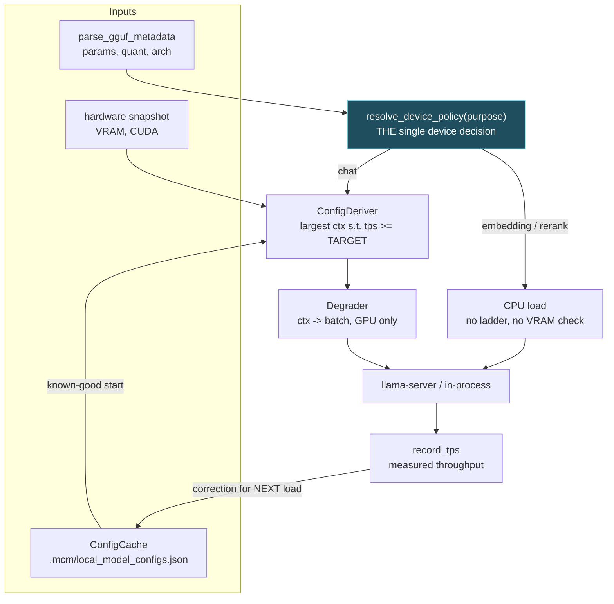
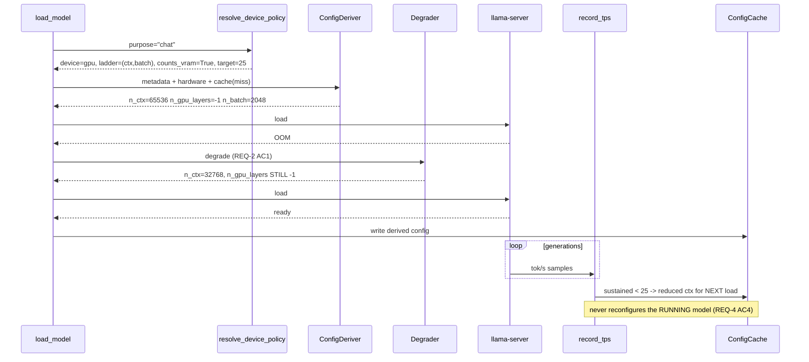

# Design: Phase 3 — Local Model Loader

## Context

Every defect in this phase is the **compute-and-discard** pattern: a value is measured, then thrown
away.

| Measured | Discarded |
|---|---|
| `vram_needed` in `recommend_profile` | produces two preset outcomes, never a context |
| `estimate_vram_gb` | weights-only, so it cannot rank contexts |
| `record_tps` throughput | warns at 8 tok/s, changes nothing |

This is the fourth occurrence of the pattern in the codebase (after the nucleus nudge, the
oscillator amplitude, and `cur_a`). The tests below therefore assert the **effect**, never the
computation — a test that checks `record_tps` logs a warning passes without the loop closing.

**Bounding constraints:**

| Constraint | Source | Consequence |
|---|---|---|
| ≥25 tok/s at max context | Decision Locked #1 | Tuning is a **search**, not a lookup |
| GPU only for chat | Decision Locked #4 | Ladder is ctx → batch; CPU is never a fallback |
| Device keys on `purpose` | Decision Locked #5/#6 | One resolver, not four `if` guards |
| Phase 1 owns the registry | execution order | This phase consumes ids, `purpose`, `loaded` |
| MTP must not regress | `balanced_mtp`, `force_subprocess` | Derivation must be able to *produce* the MTP config |

---

## Architecture Overview



Three properties this shape enforces:

1. **`POLICY` is upstream of `HW`.** Hardware-fit reasoning exists only on the `chat` branch, so a
   CPU model cannot consume VRAM budget, enter the ladder, or be measured against `TARGET_TPS`
   (REQ-2 AC8/AC9).
2. **The learning arrow returns to `CACHE`, never to `SERVE`.** Measurements change the *next* load
   (REQ-4 AC4); a session in flight is never disrupted by tuning.
3. **`DEGRADE` is only reachable from the `chat` branch.** A CPU model must not enter it and exit
   early — an early return still runs the VRAM fit check AC9 forbids.

---

## Sequence: first load of an unseen chat model



---

## Data Models

```python
@dataclass(frozen=True)
class DevicePolicy:
    device: str                     # "gpu" | "cpu"
    ladder: tuple[str, ...]         # ("ctx","batch") for gpu-chat; () for cpu
    counts_against_vram: bool
    throughput_target: Optional[float]

@dataclass
class DerivedConfig:
    n_ctx: int
    n_gpu_layers: int               # ALWAYS -1 on the chat branch
    n_batch: int
    est_vram_gb: float
    est_tps: float
    source: str                     # cache | derived | user_override | degraded
    degraded_from: Optional[dict] = None

@dataclass
class CachedConfig:
    fingerprint: str                # path + size + mtime      (REQ-5 AC2)
    hw_fingerprint: str             # gpu name + total VRAM    (REQ-5 AC4)
    config: DerivedConfig
    measured_tps: Optional[float]
    updated_at: float
```

| `purpose` | device | ladder | counts_against_vram | target |
|---|---|---|---|---|
| `chat` | gpu | `("ctx","batch")` | True | 25 |
| `embedding` | cpu | `()` | False | None |
| `rerank` | cpu | `()` | False | None |
| any + explicit GPU override | gpu | `()` | True | None |

---

## Key Decisions

### D-1: One `resolve_device_policy`, not four guards

**Decision.** A single resolver returns device, ladder, VRAM accounting, and throughput target.

**Rationale.** The alternative scatters `if purpose == "chat"` through the deriver, degrader, VRAM
accountant, and tok/s recorder — four places to forget one, and **three of the four fail silently**.
A CPU embedding model counted against VRAM shrinks the chat model's context with no error; one
measured against `TARGET_TPS` records a permanent "too slow" correction against a model never meant
to hit 25. Only the ladder fails loudly.

**Rejected — infer device from model size.** "Under 1B → CPU" classifies today's three models
correctly and breaks on the first 0.5B chat model. Size correlates with purpose by accident here.

**Rejected — infer from folder or filename.** Decision Locked #6: all three classes share the scan
folder.

### D-2: Degrade context first, then batch. Never layers.

**Decision.** `n_gpu_layers` stays `-1` throughout.

**Rationale.** The GPU-only policy is correct and retained. What was missing is not a CPU escape
hatch but a **GPU-side lever**: context reduction reclaims KV-cache VRAM at **zero throughput
cost**, which is strictly better than both "load at 32k" and "reject". Batch is second because it
mainly affects prefill, not generation — cheaper on the metric being optimized, but it frees less
VRAM, which is why context leads.

**Rejected — CPU offload as a degradation step.** Steepest throughput penalty *and* the memory-spike
cause. Loading at 3 tok/s while thrashing RAM is worse than a clean failure that says the model is
too large for this GPU.

### D-3: VRAM estimate must include the KV cache

**Decision.** `estimate_vram_gb` becomes context-dependent.

**Rationale.** Today's `params_b × bpw / 8 × 1.1` is **context-independent**, so it returns the same
number for 8k and 128k. The entire D-4 search is meaningless until this changes — which is why its
test is written to fail against current code by design.

### D-4: Corrections go to the cache, never to a running server

**Decision.** `record_tps` writes to `ConfigCache`; nothing reconfigures a live model.

**Rationale.** Reconfiguring mid-session would drop the user's context to satisfy a throughput
target — optimizing the wrong thing at the worst moment.

---

## Ripple-Effect Map

| Area / File | Change? | Classification | Why / Evidence |
|---|---|---|---|
| `local_model_manager` — new `resolve_device_policy` | **Yes (new)** | CHANGE NEEDED | D-1. Single source of device/ladder/VRAM/target truth (REQ-2 AC11). |
| `local_model_manager.estimate_vram_gb` ([`:906`](../../backend/agent/local_model_manager.py)) | **Yes** | CHANGE NEEDED | Must include KV cache at target context (REQ-1 AC3, D-3). |
| `local_model_manager.recommend_profile` ([`:930-948`](../../backend/agent/local_model_manager.py)) | **Yes** | CHANGE NEEDED | Two-outcome preset selector replaced by `ConfigDeriver` (REQ-1). |
| `local_model_manager.record_tps` ([`:1189`](../../backend/agent/local_model_manager.py)) | **Yes** | CHANGE NEEDED | Threshold 8 → `TARGET_TPS`; writes corrections instead of warning (REQ-4). |
| `local_model_manager.load_model` | **Yes** | CHANGE NEEDED | Branches on `resolve_device_policy` **before** any hardware-fit reasoning; drives the ladder on the GPU branch. |
| `local_model_manager.scan_models` | **Yes** | CHANGE NEEDED | Symlink traversal, dedupe, depth bound (REQ-6). |
| `local_model_manager` VRAM accounting | **Yes** | CHANGE NEEDED | Exclude CPU-resident instances (REQ-2 AC9). **Silent failure** — counting a CPU model shrinks the chat context with no error. |
| `PROFILES` ([`:92-140`](../../backend/agent/local_model_manager.py)) | **No** | NO CHANGE (verified) | Retained as user overrides (REQ-1 AC4). `balanced_mtp` / `force_subprocess` untouched so MTP does not regress. |
| `_parse_load_progress` | **No** | NO CHANGE (verified) | Progress phases are orthogonal to configuration choice. |
| Split-shard grouping ([`:670-680`](../../backend/agent/local_model_manager.py)) | **No** | NO CHANGE (verified) | Preserved through REQ-6's scan changes (AC3). |
| `.mcm/local_model_configs.json` | **Yes (new)** | CHANGE NEEDED | Per-model cache (REQ-5), following `der_params.json` / `provider_ceilings.json`. |
| `agent_kernel.resolve_context_window` | **No (this phase)** | NO CHANGE (verified) | **Phase 1 REQ-2 AC2** already requires authoritative-over-table precedence. This phase only *exposes* the loaded `n_ctx` (REQ-3 AC1). Verify, do not re-implement. |
| Phase 1 registry / `purpose` / ids | **No** | NO CHANGE (verified) | Consumed, never modified. |
| `InferenceRouter.generate()` phase gate | **No** | **CONTRACT LOCK** | Untouched (**CT-L5**). |
| `InProcessTransport.generate` | **No** | **CONTRACT LOCK** | Signature + 3-tuple unchanged (**CT-L4**). |
| `quota_key()` / `rate_meter` | **No** | NO CHANGE (verified) | Local kinds unmetered by `ProviderKind` ([`provider.py:16-22`](../../backend/agent/inference/provider.py)). |
| `backend/audio/parakeet_service.py` | **No** | NO CHANGE (verified) | Separate service, own `--device`, defaults `cuda` ([`:99`](../../backend/audio/parakeet_service.py)). Its ~1.2 GB fp16 footprint is part of the "already consumed" baseline the hardware snapshot observes. |
| `components/ModelInferenceSection.tsx` | **No** | **CONTRACT LOCK** | Not touched this phase (**CT-L6**). ⚠️ Phase 4 adds a `purpose === "chat"` filter. |
| `backend/api/caducean_debug.py` | **Yes** | CHANGE NEEDED | Loader state + active config (REQ-7 AC4). Read-only — keep it so. |

---

## Error Handling

| Failure | Response |
|---|---|
| Metadata unparseable | Fall back to `balanced`, log the reason, continue (REQ-1 edge case). |
| Derived config does not fit (`chat`) | Degrade **ctx → batch, GPU only**; report each step. `n_gpu_layers` stays `-1`. |
| Nothing fits at `MIN_CTX` (`chat`) | Fail cleanly, **unload any partial allocation**, report the shortfall in GB. Never a CPU retry. |
| GPU error during/after a `chat` load | **Graceful unload**: release VRAM, `loaded=false`, report. No CPU fallback. |
| No CUDA, `purpose == "chat"` | Report that local chat models require a GPU. `eco` override remains available. |
| No CUDA, `purpose in {embedding, rerank}` | Load normally on CPU. A missing GPU must not disable retrieval. |
| `purpose` undeterminable | Default to `chat` and surface the ambiguity — fails loudly at the VRAM check rather than silently putting a 9B model on CPU. |
| Corrupt config cache | Discard, derive fresh (REQ-5 AC5). |
| Hardware changed since caching | Invalidate on `hw_fingerprint` mismatch, re-derive. |
| Scan hits unreadable file / circular symlink | Skip, continue; depth-bounded by `SCAN_MAX_DEPTH`. |
| Model file missing at load | Provider stays registered, `loaded=false`, typed error naming the path (Phase 1 REQ-3). |

---

## Testing Strategy

```
backend/tests/unit/         derivation, estimation, device policy, cache, corrections
backend/tests/contract/     transport + policy shape pins
backend/tests/behavioral/   full load path, degradation, closed loop
scripts/validate_local_model_path.py   STANDING CDD HARNESS
```

### Unit

- `test_config_deriver.py` — the largest context clearing `TARGET_TPS` is chosen; a small model gets
  **more** than 32k and a large one **less**, **from the same code path** (the property presets
  cannot express); `MIN_CTX` floor holds.
- `test_vram_estimate_includes_kv.py` — the estimate **increases with context**. Fails against
  today's weights-only formula, which is the point (D-3).
- `test_device_policy.py` — parametrized over **all three** purposes: `chat` → GPU + non-empty
  ladder + counts VRAM + target 25; `embedding`/`rerank` → CPU + **empty** ladder + no VRAM + no
  target; explicit GPU override flips device **and** `counts_against_vram` together. Dropping a
  purpose is a test modification.
- `test_degradation_order.py` — ctx before batch; `n_gpu_layers == -1` in **every** candidate; no
  ladder step places any layer on CPU.
- `test_config_cache.py` — fingerprint changes on mtime/size; `hw_fingerprint` mismatch invalidates;
  corrupt file falls back to derivation.
- `test_tps_correction.py` — sustained below target records a **reduced-context** next-load config;
  comfortably above with headroom records an **increased** one; within `TPS_DEADBAND` records
  **nothing**. ⚠️ Asserts the **correction**, not the warning — the warning already exists.

### Contract

| ID | Pins | Asserts |
|---|---|---|
| **CT-L1** | `DevicePolicy` shape | Four fields; `chat` and CPU purposes resolve distinctly (REQ-2 AC11). |
| **CT-L2** | GPU-only invariant | No derived or degraded `chat` config has `n_gpu_layers != -1`. |
| **CT-L3** | Cache schema | `fingerprint` + `hw_fingerprint` present; corrupt file tolerated. |
| **CT-L4** | `InProcessTransport.generate` | Signature + 3-tuple unchanged. |
| **CT-L5** | `InferenceRouter.generate` | Signature unchanged **and the phase-gate call still present**. |
| **CT-L6** | Provider payload | `loaded`/`purpose` present; `ModelInferenceSection` unaffected this phase. |
| **CT-L7** | Loaded `n_ctx` exposed | A loaded model reports its real configured context (REQ-3 AC1). |

### Behavioral

- `test_unseen_model_autotunes.py` — a model with no cache entry loads with derived (not preset)
  parameters, logged `source="derived"` (REQ-1, REQ-7 AC1).
- `test_degrades_within_gpu.py` — a model too large at the derived context loads at a **reduced
  context, still fully on GPU**. Asserts `n_gpu_layers == -1` throughout.
- `test_gpu_error_unloads_cleanly.py` — an injected GPU OOM unloads, frees VRAM, sets
  `loaded=false`, and does **not** retry on CPU.
- `test_embedding_loads_on_cpu.py` — an `embedding` instance loads with **zero** VRAM on a synthetic
  host reporting **no CUDA at all**. The no-CUDA condition is the assertion — it cannot pass by
  accident on a GPU box.
- `test_cpu_model_does_not_shrink_chat_context.py` — derive a chat context, load `embedding` +
  `rerank`, re-derive on the same snapshot: **identical** (REQ-2 AC9). The silent-wrong-answer case.
- `test_cpu_model_not_measured_against_target.py` — a 4 tok/s embedding model records **no**
  correction and emits no under-target warning (REQ-4 AC6).
- `test_closed_loop_tuning.py` — inject sustained sub-target throughput; the **next** load uses a
  reduced context and the **running** model was not reconfigured (REQ-4 AC2/AC4).
- `test_loaded_context_window_wins.py` — a model whose filename matches a table entry but is loaded
  at a different `n_ctx` resolves to the **loaded** value (REQ-3). Fails today.
- `test_symlinked_model_discovered.py` — a model reachable only through a symlink appears exactly
  once (REQ-6 AC1/AC4).

### Intertwined

| Real defect | Behavioral test | Contract decomposition |
|---|---|---|
| Presets ignore the model | `test_unseen_model_autotunes` | `test_config_deriver` |
| Weights-only VRAM estimate (`:906`) | `test_degrades_within_gpu` | `test_vram_estimate_includes_kv` |
| tok/s measured, never applied (`:1189`) | `test_closed_loop_tuning` | `test_tps_correction` |
| Substring table outranks loaded `n_ctx` | `test_loaded_context_window_wins` | **CT-L7** |
| Device policy collapsing to one device | `test_cpu_model_does_not_shrink_chat_context` | `test_device_policy` |
| Symlinked cache invisible | `test_symlinked_model_discovered` | — |

### Standing CDD harness

`scripts/validate_local_model_path.py` asserts on every run:

1. CT-L1..CT-L7 hold.
2. For synthetic small / medium / large models against a synthetic hardware profile, the deriver
   produces **three different** contexts — proving derivation, not preset selection.
3. VRAM estimate is **monotonically increasing** in context.
4. Degradation order is ctx → batch, and `n_gpu_layers == -1` in every candidate.
5. A simulated sub-target run changes the next-load config and leaves the running config untouched.
6. Device policy separates by `purpose`: a single device value across all three is a failure.
7. CPU instances are invisible to the VRAM budget — chat context unchanged with them loaded.
8. `balanced_mtp` / `force_subprocess` still reachable — MTP not regressed.
9. A symlinked model is discovered exactly once.

Assertion **2** decides whether REQ-1 actually landed: identical contexts across three model sizes
means presets are still in charge under a new name. Assertions **6 and 7** decide whether the device
scoping landed — 6 catches the policy collapsing to one device, 7 catches the accounting leak that
would make CPU models cost VRAM anyway.
