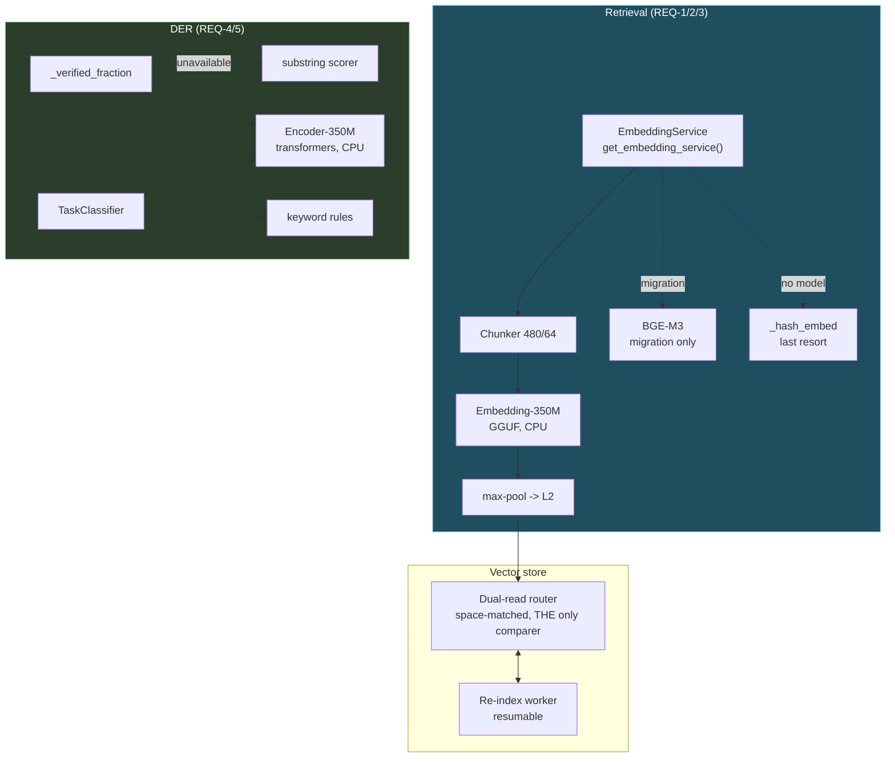
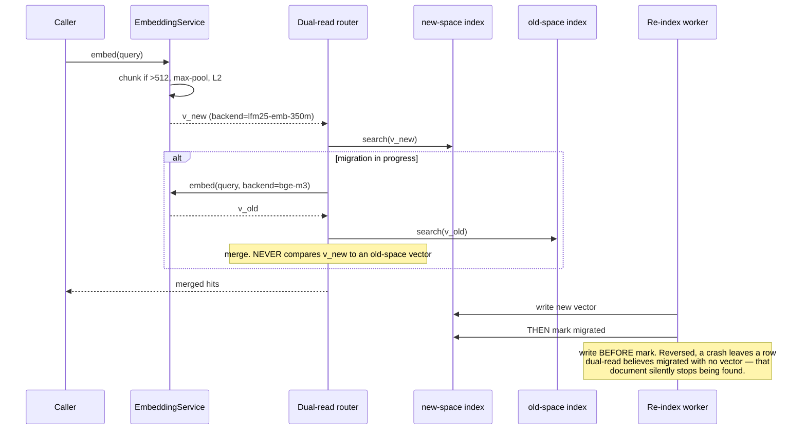

# Design: Phase 4 — LFM2.5 Encoder Integration

## Context

Every requirement here replaces a **working** component with a smaller one. That framing drives the
design: the risk is not a loud break, it is silent degradation nobody notices for months.

Two facts make silent degradation the default failure mode:

1. **BGE-M3 and Embedding-350M are both 1024-dim.** A cross-space comparison returns a number, not
   an error. A dimension change would have crashed; this one just returns worse results.
2. **A truncated document still embeds fine.** The 512-token window silently drops everything past
   token 512 of the 21% of PiNs that exceed it. The vector is valid; the document is simply no
   longer findable by its own content.

Neither is caught by a green suite that does not specifically look. REQ-3 AC2 and REQ-2 exist
because of these two facts; REQ-8 exists because neither can be trusted to a review.

**Bounding constraints:**

| Constraint | Source | Consequence |
|---|---|---|
| Zero-shot only | Decision Locked #1 | REQ-8 measures rather than fixes |
| Encoder-350M has no sentence head | Decision Locked #2 | Two models, two jobs |
| 512-token context | Embedding-350M | REQ-2 chunking is mandatory, not an optimization |
| Both CPU | Decision Locked #4 / Phase 3 | No VRAM accounting, no throughput target |
| Bands frozen | REQ-4 AC2 | Scorer change measurable in isolation |
| Phases 1 + 3 green | execution order | `purpose`, ids, device policy all exist |

---

## Architecture Overview



Three properties this shape enforces:

1. **Every model has a fallback needing no model.** `_hash_embed`, the substring scorer, the keyword
   rules. No encoder failure takes a subsystem down — only makes it less good.
2. **The chunker sits above the model.** Index-time and query-time text traverse the *same*
   `ES → CHUNK → E350 → POOL` path, making REQ-2 AC2 structural rather than a convention two call
   sites must remember.
3. **`DUAL` is the only thing that reads vectors.** Provenance checking has one home, so REQ-3 AC2
   cannot be forgotten at a call site.

---

## Sequence: query during re-index



---

## Data Models

```python
@dataclass(frozen=True)
class EmbeddingBackend:
    name: str            # "lfm25-emb-350m" | "bge-m3" | "hash"
    dim: int             # 1024 for both neural backends
    max_tokens: int      # 512 | 8192 | inf
    device: str          # "cpu"

@dataclass(frozen=True)
class Embedding:
    vector: list[float]
    backend: str         # provenance — STORED, never inferred (REQ-1 AC5)
    chunk_count: int     # 1 = unchunked (REQ-2 AC5)
    truncated: bool      # AC3 bound dropped a tail

@dataclass
class ReindexProgress:
    total_rows: int
    migrated_rows: int
    from_backend: str
    to_backend: str
    state: str           # idle | running | interrupted | complete
    last_row_id: Optional[str]

@dataclass(frozen=True)
class VerificationScore:
    fraction: float      # [0.0, 1.0] — contract preserved (REQ-4 AC2)
    scorer: str          # encoder | substring | fallback
    per_assertion: list[float]
    band: str            # VERIFIED | UNVERIFIED | FAILED
```

`backend` is stored, not derived. Deriving it from "whatever is configured now" is exactly what
breaks during migration, when both spaces exist at once.

---

## Key Decisions

### D-1: Two models, two runtimes, two jobs

Embedding-350M via GGUF as a `purpose="embedding"` provider — its job is "text in, 1024 floats out",
exactly what the GGUF embedding path does, and it inherits Phase 1 registration and Phase 3 CPU
placement free. Encoder-350M in-process via `transformers` — it is a base MLM emitting token
representations and needs a task head, which the GGUF path does not want to expose.

**Rejected — one runtime.** Costs either a reimplementation of head logic or the loss of provider
integration. The models are genuinely different shapes.

**Rejected — Encoder-350M for retrieval.** No sentence head. Mean-pooling a base MLM's token outputs
produces a vector but not a good sentence vector — the known failure mode bi-encoder training exists
to fix.

### D-2: Max-pool, not mean-pool

A 4000-token document answering a query in one paragraph should be retrieved on that paragraph.
Mean-pooling dilutes it by the other seven chunks — the longer the document, the worse it is found,
which is backwards. **Normalise after, not before:** normalising each chunk then max-pooling
produces a non-unit vector, quietly breaking the cosine assumption every caller makes.

**Rejected — per-chunk vectors searched individually.** Better recall, but it changes the store
schema, the row-to-document mapping, and every dedup path — and it is the direction ColBERT would
take anyway, so doing it here builds half a deferred feature.

### D-3: Provenance stored; cross-space comparison refused

**The phase's most important guard**, and it exists because the backends share a dimension. There is
no runtime signal that a cross-space comparison happened — no exception, no shape mismatch, no NaN.
A refusal at the one place vectors are compared is the only mechanism that catches it; review will not.

**Rejected — infer backend from current config.** Correct exactly when no migration is in flight,
which is the only time it matters.

**Rejected — change the dimension to force a mismatch.** Would make it loud, at the cost of a schema
change and the drop-in property that makes REQ-1 reversible.

### D-4: The stub guard runs before the encoder, always

The existing code puts the stub check first
([`agent_kernel.py:7167-7170`](../../backend/agent/agent_kernel.py)) and that ordering is
load-bearing — it is what makes "no silent success" true. A semantic scorer is exactly the component
that would rescue a well-phrased stub: *"I have retrieved the user's email address"* is a strong
entailment and a complete failure to do the work. The guard must be **unreachable** by the encoder,
not merely weighted against it.

### D-5: Bands frozen while the scorer changes

The output distribution shifts from bimodal (0/1 per assertion) to continuous. Retuning bands
simultaneously makes any change in VERIFIED rate unattributable. Measure first (REQ-8 AC3), retune
separately with evidence — and note Phase 6 consumes these labels, so an unmeasured shift here
propagates into the outer loop.

---

## Ripple-Effect Map

| Area / File | Change? | Classification | Why / Evidence |
|---|---|---|---|
| `backend/memory/embedding.py` — `EmbeddingService` | **Yes** | CHANGE NEEDED | Backend selection, chunking, provenance (REQ-1, REQ-2). |
| `get_embedding_service()` ([`:316`](../../backend/memory/embedding.py)) | **No** | **CONTRACT LOCK** | Sole accessor; signature unchanged so no call site moves (**CT-E1**). |
| `_hash_embed` ([`:37`](../../backend/memory/embedding.py)) | **No** | NO CHANGE (verified) | Dependency-free fallback, retained verbatim (REQ-1 AC3). |
| `backend/memory/config.py` | **Yes** | CHANGE NEEDED | Backend selection + model paths. |
| Vector store rows | **Yes** | CHANGE NEEDED | Gain a `backend` provenance column. Dimension unchanged at 1024 — **no width change**. |
| Similarity / search path | **Yes** | CHANGE NEEDED | Provenance check before scoring; dual-read merge (REQ-3 AC2/AC3). |
| `backend/crawler/rerank.py:67` `_embed` | **Yes** | CHANGE NEEDED | ⚠️ The **second** embedding consumer. Left alone it truncates at 512 while the memory path chunks — two behaviours for the same text, only one tested. |
| `agent_kernel._verified_fraction` ([`:7146`](../../backend/agent/agent_kernel.py)) | **Yes** | CHANGE NEEDED | Substring → semantic (REQ-4). |
| `agent_kernel._verify_step_result` ([`:7159-7175`](../../backend/agent/agent_kernel.py)) | **No** | **CONTRACT LOCK** | Bands `0.8`/`0.3` and the three label strings unchanged (**CT-E3**, D-5). |
| `_STUB_RE` guard ([`:7167-7170`](../../backend/agent/agent_kernel.py)) | **No** | **CONTRACT LOCK** | Must remain **upstream** of scoring (**CT-E4**, D-4). Ordering *is* the requirement. |
| `agent_kernel.py:5929` — `_verified_fraction` call | **No** | NO CHANGE (verified) | Consumes a float; contract preserved by REQ-4 AC2. |
| `kyudo.TaskClassifier.classify` ([`:566`](../../backend/memory/mycelium/kyudo.py)) | **Yes** | CHANGE NEEDED | Encoder path added; keyword rules retained (REQ-5). |
| `agent_kernel.py:4428-4432` — classifier call site | **No** | NO CHANGE (verified) | Already try/excepts and defaults to `"full"`; REQ-5 AC2 needs nothing new here. |
| `TASK_CLASS_SPACE_MAP` | **No** | NO CHANGE (verified) | REQ-5 AC1 adds no classes. |
| DER budget resolution (Phase 1) | **No code** | NO CHANGE — **coupling** | ⚠️ `task_class` selects the budget **fraction** (Phase 1 REQ-1 AC2). A misclassification mis-sizes the budget for the whole task (REQ-5 AC6). Test on both sides. |
| DER ledger record shape | **No** | **CONTRACT LOCK** | `verified_label` for all outcomes unchanged (**CT-E5**). **Phase 6 reads it.** |
| `components/ModelInferenceSection.tsx:80` | **Yes** | **CHANGE NEEDED (cross-phase)** | ⚠️ `providerOptions = providers.map(...)` is **unfiltered**, so registering non-chat providers puts them in the **Brain/Tool** dropdowns, violating REQ-6 AC3. Phases 1 and 3 classify this file NO-CHANGE — correct for them, wrong once this phase lands. **Must change here.** |
| Phase 3 `resolve_device_policy` | **No** | NO CHANGE (verified) | Already returns CPU + empty ladder for `embedding`/`rerank`; consumed, not modified. |
| `backend/audio/parakeet_service.py`, TTS | **No** | NO CHANGE (verified) | Not on any path this phase touches. |
| `backend/api/caducean_debug.py` | **Yes** | CHANGE NEEDED | Embedding backend, re-index progress, encoder load state (REQ-9 AC3). |

---

## Error Handling

| Failure | Response |
|---|---|
| Embedding-350M missing / fails | `_hash_embed` + loud warning. Memory functions at reduced quality. |
| Encoder-350M missing / fails | Substring scorer + keyword classifier. DER unaffected in shape. |
| Encoder exceeds its time budget | Fall back for that call, log it; do not stall the step (REQ-4 AC6). |
| Text > 512 tokens | Chunk + max-pool. **Never truncate silently.** |
| Text > chunk bound | Drop the tail **with a log line** (REQ-2 AC3). |
| Cross-backend similarity attempted | **Refuse and raise** (REQ-3 AC2). Never return a number. |
| Re-index interrupted | Resume from `last_row_id`; a row is unmigrated or migrated, never between. |
| Re-index hits a corrupt row | Skip, log, continue. |
| Re-index started twice | No-op + log. Not a second worker. |
| Artifact corrupt | Detect before load, re-fetch (REQ-7 AC3). |
| Model absent locally | Report path and expectation; **no** silent download (REQ-7 AC2). |
| Logging fails | Swallow; never fail a retrieval or verification. |

---

## Testing Strategy

```
backend/tests/unit/         chunking, pooling, scorer logic, classifier floor
backend/tests/contract/     service interface, band contract, stub ordering, provenance
backend/tests/behavioral/   full retrieval, live re-index, DER verification end-to-end
__tests__/                  ModelInferenceSection purpose filter
scripts/validate_encoder_path.py    STANDING CDD HARNESS
scripts/eval_embedding_quality.py   REQ-8 MEASUREMENT (probe sets in-repo)
```

### Unit

- `test_chunk_and_pool.py` — parametrized sub-window / exact-window / multi-chunk: >512 produces >1
  chunk; pooling is element-wise max; L2 applied **after**; sub-window is **byte-identical** to the
  unchunked path.
- `test_pooling_is_max_not_mean.py` — a document whose single strong chunk sits among unrelated
  chunks still scores high. **Constructed so mean-pooling fails it** — the distinguishing case, not
  a generic pooling test.
- `test_verified_fraction_semantic.py` — a paraphrase scores > 0.0 (**fails today**); a stub scores
  exactly 0.0; a result restating the assertion without doing the work does **not** score satisfied.
- `test_encoder_fallback.py` — unavailable / erroring / timing out each produce the substring result
  with `scorer="fallback"` logged.
- `test_classifier_confidence_floor.py` — below the floor defers to keywords; above uses the encoder;
  tuple shape unchanged.

### Contract

| ID | Pins | Asserts |
|---|---|---|
| **CT-E1** | `EmbeddingService` interface | Accessor + method signatures unchanged across the swap. |
| **CT-E2** | Vector shape + provenance | Every persisted vector is 1024-dim **and** carries a non-empty `backend`. |
| **CT-E3** | DER band contract | `[0.0, 1.0]`; `0.8`/`0.3` and the three label strings unchanged. |
| **CT-E4** | Stub-guard ordering | Inject a scorer returning `1.0` unconditionally; a bare stub must **still** score `0.0` — a test the encoder cannot satisfy its way past (D-4). |
| **CT-E5** | Ledger record shape | `verified_label` present for all outcomes. **Phase 6 depends on this.** |
| **CT-E6** | Cross-space refusal | Scoring two vectors with differing `backend` **raises**; never returns a float. |
| **CT-E7** | Provider registration | Both register with `purpose` in `{embedding, rerank}`, `device="cpu"`, **not** bindable to chat roles. |

### Behavioral

- `test_long_pin_retrievable_by_tail.py` — index a PiN whose distinguishing content sits **past
  token 512**, query for it, assert it returns. Fails against a truncating implementation; the
  21%-of-PiNs case.
- `test_reindex_no_outage.py` — queries throughout a live re-index all return, none mixes spaces.
- `test_reindex_resumes.py` — kill mid-migration, restart: no row re-embedded, none half-migrated.
- `test_reindex_write_before_mark.py` — crash injected **between** write and mark; the row reads
  unmigrated and is retried, never migrated-without-a-vector.
- `test_der_verifies_paraphrase.py` — a real DER step satisfying its expected output in different
  words is recorded VERIFIED, and displayed matches spoken.
- `test_der_rejects_wellphrased_stub.py` — an eloquent claim of completion without the work is
  recorded FAILED. The inverse, and what a semantic scorer is most likely to break.
- `test_encoders_do_not_shrink_chat_context.py` — derive a chat context, load both encoders,
  re-derive: **identical** (REQ-6 AC4).
- `test_memory_survives_missing_models.py` — with both encoders absent, memory writes/retrieves via
  `_hash_embed` and DER verifies via substring; nothing raises.
- `__tests__/ModelInferenceSection.test.tsx` — an `embedding` and a `rerank` provider do **not**
  appear in the Brain or Tool selector (REQ-6 AC3).

### Intertwined

| Real defect | Behavioral test | Contract decomposition |
|---|---|---|
| Truncation past 512 (silent) | `test_long_pin_retrievable_by_tail` | `test_chunk_and_pool` |
| Cross-space comparison (silent, same dim) | `test_reindex_no_outage` | **CT-E6** |
| Half-migrated row (silent) | `test_reindex_write_before_mark` | — |
| Substring fails paraphrase (`:7156`) | `test_der_verifies_paraphrase` | `test_verified_fraction_semantic` |
| Semantic scorer rescues a stub (**new risk**) | `test_der_rejects_wellphrased_stub` | **CT-E4** |
| Encoders bindable as reasoning models | `__tests__/ModelInferenceSection` | **CT-E7** |
| Keyword classifier falls through (`:587`) | — | `test_classifier_confidence_floor` |

### Physics-aware

Verification labels feed the ledger, which feeds Phase 6's guards. A scorer change that moves the
VERIFIED rate moves a self-tuning input. Assert the outer loop's held-out score is computed from the
**same** labels the user was shown — a scorer inflating VERIFIED while the display says otherwise is
reward-hacking by accident.

### Standing CDD harness

`scripts/validate_encoder_path.py` asserts on every run:

1. CT-E1..CT-E7 hold.
2. Every persisted vector is 1024-dim and carries a `backend` tag.
3. A synthetic 4×-window document is retrievable from **each** of its chunks — not just the first.
   First-chunk-only retrieval is truncation wearing chunking's clothes.
4. Max-pool is verifiably not mean-pool on the constructed case.
5. A cross-backend comparison **raises**.
6. A simulated interrupted re-index resumes with no row re-embedded and none half-migrated.
7. The stub guard survives a scorer stubbed to return `1.0` unconditionally.
8. Both encoders resolve to `device="cpu"` with `counts_against_vram=False`.
9. With both encoders loaded, a chat model's derived context is unchanged.

Assertions **3 and 7** decide whether the phase landed: 3 catches chunking that technically chunks
but retrieves only the head; 7 catches a semantic scorer that quietly became a way for stubs to pass.

### Measurement (REQ-8 — not pass/fail)

`scripts/eval_embedding_quality.py` reports recall@1/5/10, index and query latency, and resident
memory for BGE-M3 vs Embedding-350M; and for verification, **both error directions separately**:
paraphrase recognized (fewer false FAILED) and unsatisfied-but-overlapping rejected (fewer false
VERIFIED). **The stub row is the only one with a hard requirement: 100% rejected, both scorers.**

If recall lands materially below baseline that is a finding under REQ-8 AC5 — **do not adjust the
probe set to close the gap.** The probe set is the measuring instrument; reshaping it destroys the
only evidence the swap was safe.
