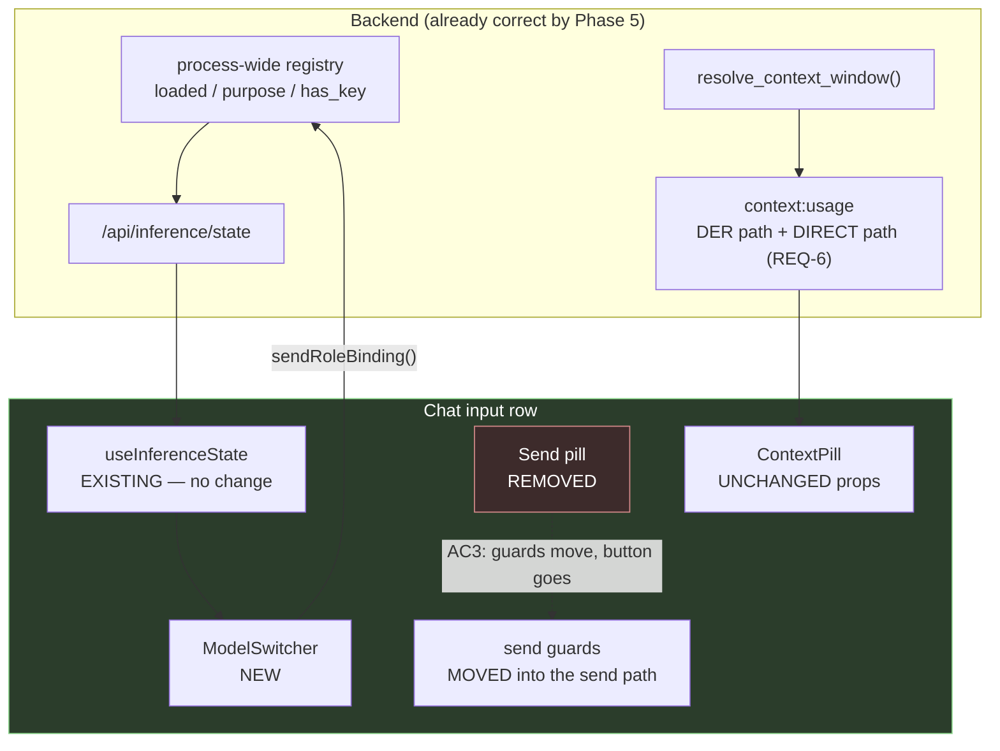
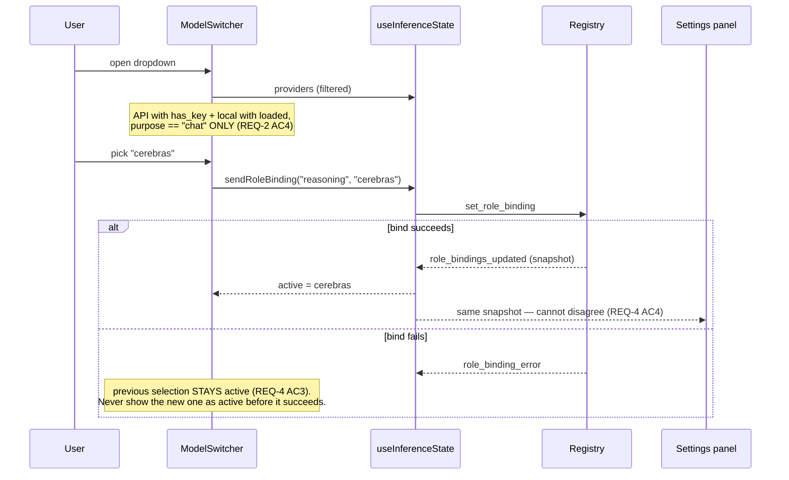

# Design: Phase 5 — Model Switcher + ContextPill

## Context

This is the only phase that is purely additive UI over infrastructure the earlier phases made
truthful. Nothing here fixes a backend lie; it surfaces state that is already correct by the time
this phase runs.

That framing sets the risk profile. The dangerous change is not the switcher — it is **removing the
Send button**, because the button carries guards nobody would notice are gone:

```tsx
disabled={!inputText.trim() || isTyping || voiceState === 'listening'}   // :3296
```

Delete the button and `Enter` will send while IRIS is listening or mid-response. No error, no
failing test — the frontend suite only started running in Phase 2.

**Bounding constraints:**

| Constraint | Source | Consequence |
|---|---|---|
| ContextPill design preserved | Decision Locked #1 | Switcher is a sibling, never a new prop |
| Brain/Tool independent | Decision Locked #4 | No single-selection collapse |
| No key to the frontend | Decision Locked #5 | `has_key` boolean only |
| No new backend surface | REQ-2 Verified | `useInferenceState` already has state + writer |
| Phases 1/3/4 green | execution order | `loaded` and `purpose` are truthful |

---

## Architecture Overview



Three properties this shape enforces:

1. **The switcher writes through the existing `sendRoleBinding`.** No second path to the same state,
   so REQ-4 AC4 (switcher and settings agree) is free rather than a standing risk.
2. **`CP`'s props do not change.** The switcher is a sibling, so a future switcher change is never a
   pill change — and the pill's tight layout budget (`ACTION_CAP = 24` exists because full phase
   words overflow `max-w-[160px]`) stays stable.
3. **`context:usage` has two emitters, one shape.** REQ-6 adds the direct path; both use the same
   `resolve_context_window()` denominator, so the pill cannot show one number during DER and another
   outside it.

---

## Sequence: switching a model mid-conversation



---

## Data Models

```typescript
// Additive to the existing Provider interface — no field is removed.
interface Provider {
  id: string; label: string; kind: string; model: string;
  api_base_url?: string;
  has_key?: boolean;   // boolean ONLY — never a key or fragment (REQ-2 AC8)
  loaded?: boolean;    // Phase 1 REQ-3 AC2
  purpose?: string;    // Phase 1 REQ-4 AC3 — filter to "chat" (REQ-2 AC4)
}

interface SwitcherEntry {
  id: string;
  label: string;        // "Provider · model"
  available: boolean;   // has_key (API) | loaded (local)
  reason?: string;      // why unavailable, when shown disabled (OQ-2)
}
```

`ContextPillProps` is **unchanged**: `usedTokens`, `maxTokens`, `phase`, `currentAction`.

---

## Key Decisions

### D-1: The guards move before the button is deleted

**Decision.** `!inputText.trim() || isTyping || voiceState === 'listening'` moves into the send path
as a precondition, and only then does the button go (REQ-1 AC3).

**Rationale.** This is the one silent regression available in this phase. The button is the sole
holder of those conditions; `Enter` reaches `handleSendMessage` directly. Deleting first and
"remembering" to add the guard back is how a user ends up sending mid-response with no error and no
failing test.

### D-2: The switcher is a sibling of ContextPill

**Decision.** A new `ModelSwitcher` beside the pill; `ContextPillProps` unchanged.

**Rationale.** The user asked to keep the pill. Threading model state into it makes every future
switcher change a pill change, and the pill's layout is already over-tight — it declares
`max-w-[200px]` inside a `w-[32px]` container. Keeping them separate keeps that budget stable and
makes REQ-3 AC1 structural.

### D-3: No new backend surface

**Decision.** Read `useInferenceState`, write through its `sendRoleBinding`.

**Rationale.** The hook already fetches `/api/inference/state`, merges both provider events, and
exposes the writer. A second endpoint would be a second path to the same state — and REQ-4 AC4
requires the switcher and settings panel to agree, which is free if they share a source and a
standing risk if they do not.

### D-4: Availability is a boolean, all the way out

**Decision.** `has_key: boolean`; no key, prefix, length, or masked form crosses the API boundary.

**Rationale.** `ModelInferenceSection.tsx:33` already types `has_key?: boolean`, so the pattern
exists. A masked key is still a fragment leaving the backend, and the UI needs exactly one bit.

### D-5: `context:usage` emits from both paths with one denominator

**Decision.** Add the direct-path emit; keep the shape and denominator identical (REQ-6 AC1/AC2).

**Rationale.** Two emitters with two denominators would make the pill show one number during DER and
another outside it — worse than a stale number, because it looks live and is wrong.

---

## Ripple-Effect Map

| Area / File | Change? | Classification | Why / Evidence |
|---|---|---|---|
| `components/chat-view.tsx:3293-3310` | **Yes (delete)** | CHANGE NEEDED | Send pill removed (REQ-1 AC1). |
| `handleSendMessage` ([`:1056`](../../components/chat-view.tsx)) | **Yes** | CHANGE NEEDED | ⚠️ Absorbs the guards the button carried ([`:3296`](../../components/chat-view.tsx)) — otherwise they are deleted with it (REQ-1 AC3, D-1). |
| `chat-view.tsx:1535`, `:3252` | **No** | NO CHANGE (verified) | `Enter` → `handleSendMessage` exists in both handlers; sending survives the button's removal. |
| `chat-view.tsx:3347-3368` — input row layout | **Yes** | CHANGE NEEDED | Reflow; resolve the existing `w-[32px]` container / `max-w-[200px]` child overflow (REQ-3 edge case). |
| `components/chat/ContextPill.tsx` | **No** | **CONTRACT LOCK** | Props and design unchanged (**CT-S1**, REQ-3 AC1/AC2). |
| ContextPill **displayed denominator** | **No code** | NO CHANGE — **behaviour shifts** | ⚠️ Phase 1 makes `resolve_context_window()` authoritative, so the number changes (16k not 32k; no more 8.2k for unlisted providers). Expected — do not "fix" it back. |
| `components/ModelSwitcher.tsx` | **Yes (new)** | CHANGE NEEDED | REQ-2. Sibling of the pill. |
| `hooks/useInferenceState.ts` | **Yes (types only)** | CHANGE NEEDED | `Provider` gains `has_key` / `loaded` / `purpose` typings. Fetch, event merge and `sendRoleBinding` are **unchanged** — verified at [`:47-121`](../../hooks/useInferenceState.ts). |
| `components/ModelInferenceSection.tsx` | **No** | **CONTRACT LOCK** | Already filtered to `purpose === "chat"` by Phase 4 T2.2 (**CT-S2**). Do not re-filter or duplicate the logic here. |
| `process_text_message` direct path | **Yes** | CHANGE NEEDED | Emit `context:usage` on non-DER responses (REQ-6 AC1). |
| DER per-step `context:usage` emit | **No** | **CONTRACT LOCK** | Shape and denominator unchanged; the new emitter matches it (**CT-S3**). |
| `set_role_binding` handler | **No** | NO CHANGE (verified) | Phase 1 already made the registry process-wide and deleted the fan-out. The switcher writes through the existing handler. |
| `/api/inference/state` payload | **No** | **CONTRACT LOCK** | Phase 1 already made it additive and credential-free (**CT-S4**). |
| `components/dark-glass-dashboard.tsx:1054`, `:1135` | **No** | NO CHANGE (verified) | Reads `role_bindings.find(...)?.instance_id` with a fallback; resolves against Phase 1's migrated bindings. |
| `components/wheel-view/SidePanel.tsx:68` | **No** | NO CHANGE (verified) | Same hook; additive fields only. |
| Backend registry / persistence | **No** | NO CHANGE (verified) | Phase 1 owns it; consumed here. |

---

## Error Handling

| Failure | Response |
|---|---|
| Bind fails at switch time | Surface the error; **previous selection stays active** (REQ-4 AC3). Never show the new one as active. |
| Local model unloaded while its entry is open | Selection fails visibly; never silently binds elsewhere. |
| No providers configured | Actionable empty state (REQ-2 AC9), not an empty dropdown. |
| Provider state still loading | Loading state, **distinct from empty** — an empty list reads as "none configured". |
| Provider's key removed while bound | Disappears from the list; the binding shows as unavailable rather than as a working model. |
| `context:usage` emit fails | Swallowed; the reply still completes (REQ-6 AC4). |
| No `context:usage` yet | Cold-start placeholder, visibly distinguishable from a measured value (REQ-5 AC4). |
| Backend restart with UI open | State refetched; no stale `loaded`. |

---

## Testing Strategy

```
__tests__/                  ModelSwitcher, InputRow, ContextPill
backend/tests/contract/     context:usage shape parity across both paths
backend/tests/behavioral/   switch end-to-end, pill live on a direct reply
scripts/validate_switcher.py    STANDING CDD HARNESS
```

### Unit / component

- `__tests__/InputRow.test.tsx` — Send pill **absent**; `Enter` sends; `Shift+Enter` newlines; and
  **the removed disabled conditions still block a send** for each of empty input, `isTyping`, and
  `voiceState === 'listening'`. ⚠️ **The guard assertions are the point** — they are what the
  deletion silently drops. Parametrized over all three conditions; dropping one is a test
  modification.
- `__tests__/ModelSwitcher.test.tsx` — lists only API providers with `has_key` and local models with
  `loaded`; **excludes `purpose != "chat"`**; selection calls `sendRoleBinding`; a failed bind leaves
  the previous selection active; empty state and loading state are distinct.
- `__tests__/ContextPill.test.tsx` — props unchanged; compact phase code in the label, full name in
  `title`; action text capped; placeholder replaced once a real event arrives and never reverted.

### Contract

| ID | Pins | Asserts |
|---|---|---|
| **CT-S1** | `ContextPillProps` | Four props, same names and types (REQ-3 AC1). |
| **CT-S2** | Settings selector filter | `ModelInferenceSection` still excludes non-chat purposes (Phase 4 T2.2 not regressed). |
| **CT-S3** | `context:usage` shape parity | DER-path and direct-path events have the **same shape and the same denominator** (REQ-6 AC2). |
| **CT-S4** | `/api/inference/state` | No credential or fragment anywhere in the payload (REQ-2 AC8). |
| **CT-S5** | `set_role_binding` message | Payload shape unchanged — the switcher uses the same message as settings (D-3). |

### Behavioral

- `test_switch_from_chat_row.py` — select a model in the switcher; the binding takes effect and the
  settings panel shows the same active model (REQ-2 AC5, REQ-4 AC4).
- `test_switch_failure_keeps_previous.py` — an injected bind failure leaves the previous selection
  active and surfaces the error (REQ-4 AC3).
- `test_brain_and_tool_independent.py` — bind Brain and Tool to **different** providers from the
  switcher; both hold (REQ-2 AC7).
- `test_context_usage_on_direct_reply.py` — a **non-DER** reply emits `context:usage` with the real
  denominator (REQ-6 AC1). **Fails today.**
- `test_context_usage_thread_switch.py` — switching threads reflects that thread's usage (REQ-6 AC3).
- `test_switcher_survives_restart.py` — after a restart the switcher shows persisted providers and
  bindings (REQ-4 AC5).

### Intertwined

| Real defect | Behavioral test | Contract decomposition |
|---|---|---|
| Send removal drops its guards (`:3296`) | — | `__tests__/InputRow.test.tsx` |
| Pill stale outside DER | `test_context_usage_on_direct_reply` | **CT-S3** |
| Switcher and settings disagree | `test_switch_from_chat_row` | **CT-S5** |
| Encoders offered as chat models | — | **CT-S2** |
| Key leaking to the frontend | — | **CT-S4** |

### Standing CDD harness

`scripts/validate_switcher.py` asserts on every run:

1. CT-S1..CT-S5 hold.
2. No `/api/inference/state` response contains a credential or fragment.
3. The switcher's candidate list contains no provider with `purpose != "chat"`.
4. The switcher's candidate list contains no API provider without `has_key` and no local provider
   without `loaded`.
5. `context:usage` from the DER path and the direct path have identical shape and denominator.
6. `ContextPillProps` is unchanged.
7. Every send-blocking condition the removed button carried still blocks a send.

Assertion **7** is the one worth running on every commit: it is the only guard against a silent UX
regression that produces no error and no user report.
