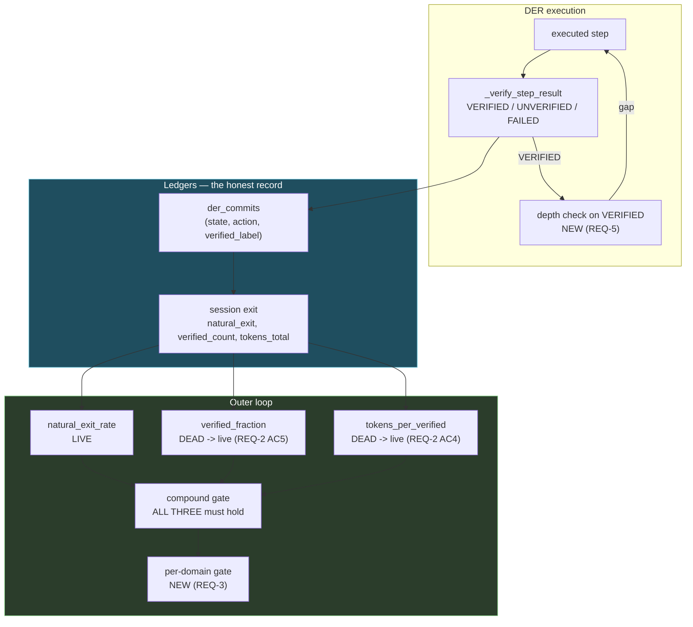
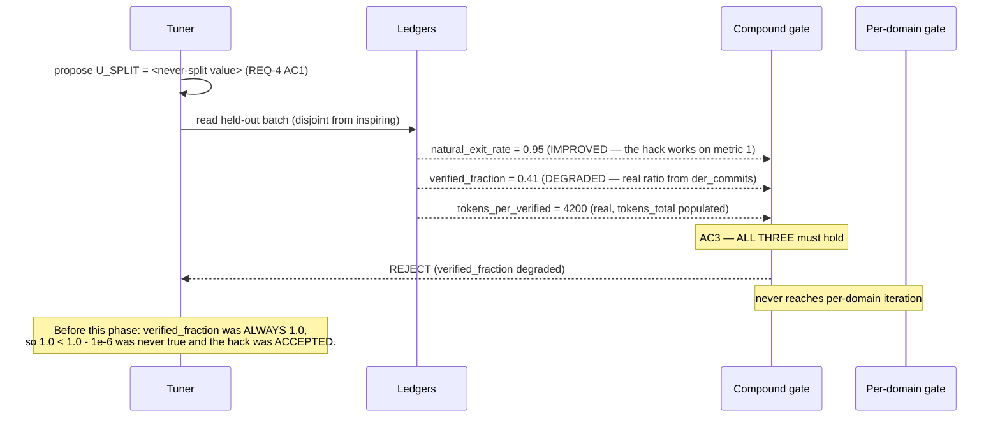

# Design: Phase 6 — DER Integrity + Self-Tuning

## Context

This phase repairs a guard that **appears** to work. That is its defining property and it drives
every decision below.

`_compound_accepts` exists, reads three metrics, and requires all three to hold. A reviewer skimming
it would call it correct. Two of the three can never fire:

```python
vf_sum  += 1.0 if vc == 0 else 1.0          # both branches 1.0 — always exactly 1.0
tpv_sum += (tt / vc) if vc > 0 else 0.0     # tt is always 0.0 — caller omits the argument
```

So `verified_fraction` fails `1.0 < 1.0 - 1e-6` and `tokens_per_verified` fails `0.0 > 0.0 + 1e-6`.
Neither raises. Neither logs. The gate returns True on one signal and looks like it returned True on
three.

**The system was reward-hacking itself, and the mechanism designed to prevent that was the thing
that hid it.** That is why REQ-2 AC7 requires each guard to be proven able to reject *independently*
— a compound gate tested only end-to-end passes with two dead branches.

**Bounding constraints:**

| Constraint | Source | Consequence |
|---|---|---|
| Labels must be honest first | Phases 2 + 4 | This phase is last; it consumes, never produces labels |
| Vetoed actions write no row | Decision Locked #1 | Absence is data, not a gap |
| The hack must be *rejected*, not absent | Decision Locked #3 | The candidate list gains the hack value |
| Bands frozen | Phase 4 REQ-4 AC2 | Label distribution is Phase 4's variable, not this phase's |

---

## Architecture Overview



Three properties this shape enforces:

1. **Every metric traces to a ledger column, not a literal.** M2 and M3 were dead because they
   traced to a constant and to an unpopulated argument. The arrows are the requirement.
2. **`DEPTH` feeds back into `STEP`.** A shallow VERIFIED step re-enters the queue through the same
   path as a failure-triggered gap (REQ-5 AC2) — one gap mechanism, not two.
3. **`GATE` precedes `DOM`.** Pooled compound first, then per-domain; a proposal failing pooled never
   reaches domain iteration, so per-domain gating can only make the gate *stricter*.

---

## Sequence: a "never split" proposal being rejected



---

## Data Models

```python
@dataclass
class CommitRow:
    state: str
    action: str                 # tool name, or "reasoning" for tool=None (REQ-1 edge case)
    verified_label: str         # VERIFIED | UNVERIFIED | FAILED — all three written
    step_id: str
    session_id: str
    domain: Optional[str]

@dataclass
class SessionExit:
    session_id: str
    natural_exit: bool
    executed_steps: int         # denominator for verified_fraction (REQ-2 AC5)
    verified_count: int         # from der_commits — ALREADY correct today
    tokens_total: float         # REQ-2 AC4 — currently defaults to 0.0
    domain: Optional[str]

@dataclass(frozen=True)
class GuardResult:
    name: str
    baseline: float
    proposed: float
    live: bool                  # False when the input is unavailable (REQ-6 AC5)
    passed: bool
```

`GuardResult.live` is what makes REQ-6 checkable. A guard whose input is missing must report
`live=False`, **not** `passed=True` — the exact conflation that hid this defect.

---

## Key Decisions

### D-1: Zero-step sessions are excluded, not counted as 1.0

**Decision.** A held-out session with no executed steps contributes **nothing** to the
`verified_fraction` mean (REQ-2 AC6).

**Rationale.** Counting it as 1.0 is how the dead branch behaved, and it is actively wrong in the
direction that hides degradation: a batch containing several fresh sessions would drag the mean
toward 1.0 and mask a real drop. Counting it as 0.0 is equally wrong the other way. Neutral
exclusion is the only option that does not encode an opinion about a session that did nothing.

### D-2: The hack goes in the candidate list

**Decision.** `_PROPOSALS["U_SPLIT"]` gains a "never split" value, and the gate must reject it
(REQ-4).

**Rationale.** The acceptance criterion says the gate rejects this hack. Today the hack simply cannot
be proposed, so the criterion has never been exercised — the guard is assumed, not proven. Adding
the value converts an untested claim into a standing behavioral test.

**Risk accepted deliberately.** If a degenerate held-out batch ever lets it pass, that is a finding
about the batch, and the guard should surface it rather than the candidate list hiding it.

### D-3: A guard with an unavailable input is DEAD, not passing

**Decision.** `GuardResult.live = False` when the input cannot be computed, and a non-live guard
cannot contribute a pass (REQ-6 AC5).

**Rationale.** This is the precise failure being repaired. `tokens_per_verified` had no input and
reported pass; `verified_fraction` had a constant and reported pass. Both **should** have reported
"I cannot evaluate this." Conflating "no signal" with "no objection" is what allowed single-metric
reward-hacking under a three-metric gate.

### D-4: Per-domain gating can only tighten

**Decision.** Pooled gate first; per-domain iteration only over domains with ≥2 held-out sessions;
any failing domain rejects (REQ-3 AC1/AC2).

**Rationale.** Ordering it this way means per-domain gating is monotonic — it can never accept
something the pooled gate rejected. That makes REQ-3 safe to land independently of whether the
domain column is well-populated, and AC3's pooled fallback preserves current behaviour when it is not.

### D-5: The depth threshold is calibrated after Phase 4, not before

**Decision.** REQ-5's expected-depth threshold is set from post-Phase-4 labels (OQ-1).

**Rationale.** Semantic verification raises the VERIFIED rate, so **more** steps reach the depth
check. A threshold tuned against substring labels would be miscalibrated the moment Phase 4 lands —
and miscalibrated in the direction of flagging too much, which trains the operator to ignore it.

---

## Ripple-Effect Map

| Area / File | Change? | Classification | Why / Evidence |
|---|---|---|---|
| `backend/agent/outer_loop.py:136` | **Yes** | CHANGE NEEDED | `vf_sum += 1.0 if vc == 0 else 1.0` — both branches `1.0`. Replace with the real ratio (REQ-2 AC5). **The single most important line in this phase.** |
| `backend/agent/outer_loop.py:137` | **Yes** | CHANGE NEEDED | `tpv_sum` reads `tokens_total`, always `0.0`. Live once REQ-2 AC4 populates it. |
| `backend/agent/memory.py:329-336` | **Yes** | CHANGE NEEDED | The **only production caller** of `record_session_exit` omits `tokens_total`. This omission is why guard 3 is dead. |
| `caducean_trajectory.py:333` | **Yes** | CHANGE NEEDED | `tokens_total` defaults to `0.0`; must receive the session's real accumulated count. |
| `caducean_trajectory.py:351-360` — `verified_count` | **No** | NO CHANGE (verified) | **Already correctly derived from the honest `der_commits` ledger.** The input for a real `verified_fraction` exists and is simply unused. |
| `outer_loop.py:130-141` — `natural_exit_rate` | **No** | NO CHANGE (verified) | The one live guard; reads a real ledger column. |
| `outer_loop.py:184` — `run_once(domain=...)` | **Yes** | CHANGE NEEDED | Accepts and forwards `domain` but never iterates (REQ-3 AC1). |
| `outer_loop.py:261` — `run_outer_loop` | **Yes** | CHANGE NEEDED | Every production caller passes `domain=None`, so the gate is always pooled. |
| `outer_loop.py:39` — `_PROPOSALS["U_SPLIT"]` | **Yes** | CHANGE NEEDED | Gains the "never split" value (REQ-4 AC1, D-2). |
| `_compound_accepts` | **Yes** | CHANGE NEEDED | Must consume `GuardResult` and treat a non-live guard as **not passing** (REQ-6 AC5, D-3). |
| DER commit-ledger write path | **Yes** | CHANGE NEEDED | A row for **every** executed action, all three labels (REQ-1 AC1). |
| `TrailingDirector.analyze_gaps` | **No** | NO CHANGE (verified) | Existing entry point; REQ-5 AC2 routes shallow-VERIFIED gaps through the same path as failure gaps. |
| `_verify_step_result` bands (`0.8`/`0.3`) | **No** | **CONTRACT LOCK** | Frozen by Phase 4 (**CT-D1**). This phase consumes labels; it does not change how they are produced. |
| Phase 4 semantic scorer | **No** | NO CHANGE (verified) | Consumed. ⚠️ It **raises the VERIFIED rate**, which moves `verified_fraction`'s baseline — REQ-5's threshold must be calibrated after it (D-5). |
| Phase 2 displayed labels | **No** | NO CHANGE (verified) | The ledger label and the displayed label must match (**CT-D2**) — a scorer inflating VERIFIED while the display disagrees is reward-hacking by accident. |
| `/api/debug/caducean` `outer_loop` section | **Yes** | CHANGE NEEDED | `live_guards` must go 1 → 3; report each metric's value, not just pass/fail (REQ-6). |
| Phase 1 budget / work units | **No** | NO CHANGE (verified) | Separate resource; `tokens_total` here is a *measurement*, not a budget. |

---

## Error Handling

| Failure | Response |
|---|---|
| Commit ledger write fails | Debug log; **step continues** (REQ-1 AC5). |
| Ledger DB unavailable | Step continues; the tuner reports guards as **not live** (D-3), never as passing. |
| A guard's input unavailable | `GuardResult.live = False`; the proposal cannot be accepted on it (REQ-6 AC5). |
| Fewer than `held_out_count` sessions | Tuner returns None; no proposal. Current behaviour. |
| Zero-step held-out session | Excluded from the `verified_fraction` mean (REQ-2 AC6, D-1). |
| Domain column absent or empty | Pooled gate (REQ-3 AC3), logged as the fallback. |
| "Never split" proposal passes the gate | Treat as a **finding about the held-out batch** (REQ-4 edge case). Do not remove the candidate. |
| `TrailingDirector` unavailable | Skip the depth check, debug log. |
| Step already at max depth | No further split attempted. |

---

## Testing Strategy

```
backend/tests/unit/         guard arithmetic, zero-step exclusion, depth threshold
backend/tests/contract/     ledger row shape, guard-result shape, band freeze
backend/tests/behavioral/   each guard rejects independently; the hack is rejected
scripts/validate_outer_loop.py    STANDING CDD HARNESS
```

### Unit

- `test_verified_fraction_is_not_constant.py` — **parametrized over several distinct held-out
  batches**, the computed `verified_fraction` takes **more than one value**. ⚠️ This is the direct
  regression test for `1.0 if vc == 0 else 1.0`; a single-batch test would pass against the bug.
- `test_zero_step_session_excluded.py` — a zero-step session changes the mean **not at all**, and
  specifically does not pull it toward 1.0 (REQ-2 AC6, D-1).
- `test_tokens_per_verified_nonzero.py` — with `tokens_total` populated, the metric is non-zero and
  varies with the batch (REQ-2 AC4).
- `test_guard_unavailable_is_not_pass.py` — a guard with a missing input reports `live=False` and
  the proposal is **not** accepted on it (REQ-6 AC5, D-3).
- `test_depth_threshold.py` — a VERIFIED step below expected depth triggers `analyze_gaps`; one at or
  above does not (REQ-5 AC1).

### Contract

| ID | Pins | Asserts |
|---|---|---|
| **CT-D1** | DER band freeze | `0.8`/`0.3` and the three label strings unchanged — this phase consumes labels, never changes how they are produced. |
| **CT-D2** | Ledger ↔ display coherence | The `verified_label` in the ledger matches the status shown to the user for the same step (Phase 2). |
| **CT-D3** | Commit row shape | `(state, action, verified_label)` present for every executed action; `action == "reasoning"` when `tool is None`. |
| **CT-D4** | No row for vetoed actions | A vetoed, never-executed action writes **no** commit row. |
| **CT-D5** | `GuardResult` shape | `live` and `passed` are distinct fields; `live=False` can never imply `passed=True`. |
| **CT-D6** | Guard count | The debug endpoint reports `live_guards == 3` with an empty dead-guard list. |

### Behavioral

- `test_each_guard_rejects_independently.py` — ⚠️ **the acceptance test for this phase.**
  Parametrized over all three guards: construct a proposal that improves the other two and degrades
  exactly one, and assert rejection **in each case**. Dropping a guard from the parametrize list is a
  test modification — and it is exactly how two dead guards survived.
- `test_never_split_rejected.py` — the "never split" candidate is proposed, wins
  `natural_exit_rate`, loses `verified_fraction`, and is **rejected by the gate** (REQ-4 AC3).
- `test_per_domain_veto.py` — a proposal passing pooled but failing in one domain with ≥2 sessions is
  rejected (REQ-3 AC2).
- `test_pooled_fallback.py` — with <2 sessions in every domain, behaviour is the pooled gate (AC3).
- `test_failed_step_writes_commit_row.py` — a FAILED step writes a row with miss-scoring and a
  tier-3 AVOID header (REQ-1 AC4).
- `test_vetoed_step_writes_no_row.py` — CT-D4 end-to-end.
- `test_shallow_verified_flagged.py` — a VERIFIED-but-shallow step produces a queue gap item (REQ-5).

### Intertwined

| Real defect | Behavioral test | Contract decomposition |
|---|---|---|
| `verified_fraction` hardcoded 1.0 (`:136`) | `test_each_guard_rejects_independently` | `test_verified_fraction_is_not_constant` |
| `tokens_total` never populated (`memory.py:329`) | `test_each_guard_rejects_independently` | `test_tokens_per_verified_nonzero` |
| Gate passes on a dead guard | `test_never_split_rejected` | **CT-D5**, `test_guard_unavailable_is_not_pass` |
| Per-domain gate unimplemented (`:184`) | `test_per_domain_veto` | — |
| Hack unreachable rather than rejected (`:39`) | `test_never_split_rejected` | — |
| Failures absent from the ledger | `test_failed_step_writes_commit_row` | **CT-D3** |
| Shallow VERIFIED passes silently | `test_shallow_verified_flagged` | — |

### Physics-aware

`U_SPLIT` governs when the DER loop splits (`|u| < U_SPLIT`). A tuner that pushes it toward "never
split" raises natural-exit rate by never doing the hard part. Inject `u` trajectories that *should*
split, propose the hack, and assert both that the gate rejects it **and** that the splits still occur
under the accepted constant — the physics and the guard must agree about what "working" means.

### Standing CDD harness

`scripts/validate_outer_loop.py` asserts on every run:

1. CT-D1..CT-D6 hold.
2. `verified_fraction` returns **more than one distinct value** across several synthetic batches.
3. `tokens_per_verified` is non-zero for a batch with real token counts.
4. Each of the three guards rejects a proposal that degrades only it.
5. The "never split" candidate is present **and** rejected.
6. A zero-step session does not move the `verified_fraction` mean.
7. A guard with an unavailable input reports `live=False` and cannot yield acceptance.
8. `live_guards == 3`.
9. Every executed action in a replayed trajectory has a commit row; every vetoed one has none.

Assertions **2 and 4** are the ones that decide whether this phase landed. Assertion 2 catches the
literal defect; assertion 4 catches the class of defect — a compound gate that looks compound and
gates on one signal.
