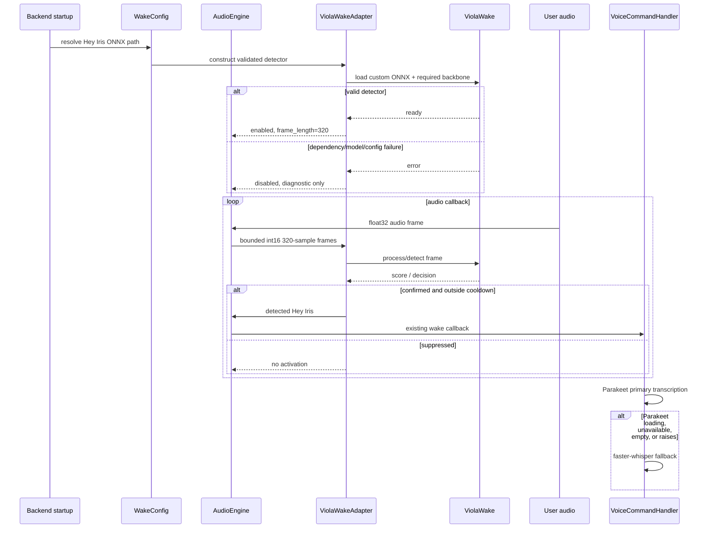
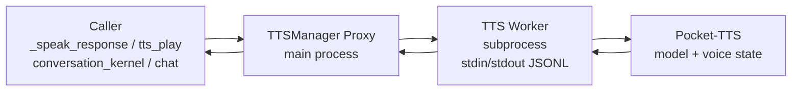

# Design: Replace Picovoice wake word with ViolaWake

> This spec was broadened in session 278 to cover the entire audio pipeline, 
> including the Pocket-TTS subprocess worker (Wave 7). The ripple-effect map 
> below was verified against the actual codebase via grep (session 278).

## Context

IRIS currently routes audio frames through `AudioEngine._process_audio_frame()` into `PorcupineWakeWordDetector`. The current `.ppn` model and Picovoice key fail initialization, leaving the wake gate disabled while the rest of the audio stack continues. The replacement must use the trained `data/hey iris_237_1788045452.onnx` model, keep the audio callback and activation callback stable, and avoid introducing another source of backend starvation.

The external ViolaWake documentation confirms:

- canonical import: `violawake_sdk`;
- `WakeDetector` / `AsyncWakeDetector` public API;
- 16 kHz mono int16, 20 ms / 320-sample frames;
- `backend="onnx"` and `providers=[...]` options;
- OpenWakeWord runtime backbone is required;
- custom filesystem ONNX loading is not explicitly documented.

Therefore the first implementation task is an installed-package/source audit. The design below treats the custom-head loader as an adapter seam, not an assumption.

## Architecture Overview

```mermaid
flowchart LR
    Mic[Audio input\nfloat32 frames] --> Engine[AudioEngine\nexisting gates]
    Engine --> Adapter[ViolaWakeAdapter\nbounded 320-sample frames]
    Adapter --> Viola[ViolaWake detector\ncustom Hey Iris ONNX]
    Viola --> Decision[threshold + confirmation\ncooldown]
    Decision --> Callback[existing IRIS wake callback]
    Callback --> Record[VoiceCommandHandler\nParakeet primary]
    Record --> Fallback[faster-whisper fallback\nloading / error / empty]
    Config[WakeConfig + model discovery] --> Adapter
    Status[diagnostics + metrics] <-- Adapter
```

## Sequence / Data Flow



## Data Models

```python
@dataclass(frozen=True)
class WakeModelSpec:
    phrase: str                 # "Hey Iris"
    path: Path                  # project-root-resolved .onnx
    sample_rate: int = 16000
    frame_samples: int = 320

@dataclass(frozen=True)
class WakeDetectorStatus:
    state: Literal["disabled", "loading", "ready", "error"]
    phrase: str
    model_name: str             # basename only in telemetry
    backend: str                # e.g. "onnx-cpu"
    last_error: str | None
    last_latency_ms: float | None
    detection_count: int
```

The adapter should hide the installed ViolaWake API. Its narrow internal protocol is:

```python
class WakeDetectorAdapter(Protocol):
    sample_rate: int
    frame_length: int
    def process_frame(self, pcm_int16: np.ndarray) -> tuple[bool, str | None]: ...
    def close(self) -> None: ...
```

The adapter may use `WakeDetector.detect()` or `WakeDetector.process()` depending on the installed package. It must normalize the result to `(detected, "Hey Iris" | None)`.

## Custom ONNX Loader Audit Gate

> **RESOLVED (session 278, 2026-09-01)** — verified live against `violawake-0.2.10` + `openwakeword-0.6.0` installed in `venv`. See pin_4cbe8eb4afab.

The audit questions are now answered:

1. **Does `WakeDetector(model=<filesystem path>)` load a custom head?** — **YES.** `WakeDetector(model=r'...\hey iris_237_1788045452.onnx', threshold=0.5, providers=['CPUExecutionProvider'])` constructs and `process(np.zeros(320, dtype=np.int16))` returns a float score.
2. **Registry/loader function?** — Not needed. Direct filesystem path works.
3. **OpenWakeWord backbone assets?** — Required and auto-downloaded on first construction (embedding_model, melspectrogram, silero_vad, default wake models). Now cached.
4. **Input shape?** — The model is a TemporalCNN(96,9) head: `embeddings [batch,9,96]` → `score [batch,1]`. Matches the model exactly.
5. **CPU provider?** — **YES**, `providers=['CPUExecutionProvider']`.

**Adapter constraint discovered:** `WakeDetector` does NOT expose `frame_length` / `sample_rate` as attributes (both N/A). The adapter MUST hardcode 320 samples / 16000 Hz per the spec, not read them from the detector.

No production code may guess this API. The adapter must fail closed with an actionable diagnostic if the model cannot load, rather than silently using Porcupine or a bundled unrelated model.

## Key Decisions

### Keep the audio boundary stable

`AudioEngine` already converts float32 callback audio to int16 before detector processing (`backend/audio/engine.py:572-590`). Keep that boundary, replace only the detector construction and adapter call. This limits ripple to the wake detector seam.

### CPU-first inference

Start with CPU ONNX Runtime. The machine has 8 GB VRAM shared by the widget, local model servers, Parakeet, and other applications. A wake detector runs continuously; allocating GPU memory for it competes with larger workloads. Enable CUDA only after an explicit benchmark and ledger decision.

### Bounded buffering

The callback may deliver chunks not equal to 320 samples. The adapter owns a small remainder buffer with a maximum of 319 samples after each call. It must not accumulate audio indefinitely.

### Fail closed only for wake detection

An invalid wake model disables wake detection and reports `error`; it must not stop audio capture, TTS, recording, or STT. Manual recording and faster-whisper remain available.

### Preserve Parakeet and faster-whisper roles

Parakeet is still primary after it finishes loading. During asynchronous Parakeet warm-up, on load error, or on empty/failed inference, the voice handler uses faster-whisper. The two STT systems are separate from wake detection and must not be removed as part of this migration.

## Ripple-Effect Map — Verified by grep (session 278)

### Waves 0-6: ViolaWake migration

| Area / File | Change? | Classification | Why / Evidence |
|---|---|---|---|
| `backend/audio/engine.py` | Yes | CHANGE NEEDED | Imports Porcupine (`:18`), constructs it at `initialize_porcupine()` (`:170-310`), and processes frames at `:553-580`. Entire `initialize_porcupine()` / `reinitialize_porcupine()` replaced with `initialize_detector()` / `reinitialize_detector()` using ViolaWake. Frame conversion and half-duplex gate preserved. |
| `backend/voice/porcupine_detector.py` | Yes | CHANGE NEEDED | Entire file (~200 lines) removed after callers migrate. Contains pvporcupine lazy import, access_key handling, builtin keywords, custom .ppn loading, and cleanup. |
| `backend/voice/violawake_detector.py` | Yes | NEW | Adapter seam for custom ONNX loading, 320-sample frame buffering, `process_frame()` normalization, lifecycle status, and CPu-first provider. |
| `backend/voice/wake_word_discovery.py` | Yes | CHANGE NEEDED | Current scanner only understands `.ppn` filename grammar (`:34-183`). Also has Porcupine fallback logic at `:282-300`. Replace with deterministic `.onnx` resolver. |
| `backend/agent/wake_config.py` | Yes | CHANGE NEEDED | Porcupine-specific defaults and API (`:22-40`, `:106-108`). Remove `SUPPORTED_PHRASES` (was pvporcupine builtin keywords). Replace `custom_model_path` with model path / engine-neutral config. |
| `backend/main.py:34-45` | Yes | CHANGE NEEDED | `pvporcupine` DLL PATH setup at module top. Remove entirely — no longer needed. |
| `backend/main.py:423-438` | Contract lock | CONTRACT LOCK | Startup diagnostics and wake cooldown at `:468-470` and `:2608-2660`. Pin readiness/error semantics and preserve cooldown. |
| `backend/iris_gateway.py:7278-7347` | Yes | CHANGE NEEDED | `_handle_get_wake_words` returns pvporcupine builtin keywords + discovered `.ppn` files. Replace with ViolaWake ONNX model info. Wake word list is now static (single validated "Hey Iris" model). |
| `backend/iris_gateway.py:7506-7558` | Yes | CHANGE NEEDED | `_handle_select_wake_word` calls `reinitialize_porcupine()`. Replace with `reinitialize_detector()`. May be simplified since there is only one valid model. |
| `backend/iris_gateway.py:787-789` | Yes | CHANGE NEEDED | Message routing for `get_wake_words` / `select_wake_word` — update handler references. |
| `backend/iris_gateway.py:1387` | Contract lock | CONTRACT LOCK | Wake sensitivity slider maps 1-10 to Porcupine 0.0-1.0. Keep mapping but route to ViolaWake threshold. |
| `backend/iris_gateway.py:4053` | No | CONTRACT LOCK | TTS suppression of wake detection — behavior preserved, detector changes transparently. |
| `backend/core_models.py:381` | Yes | CHANGE NEEDED | Hardcoded wake phrase dropdown includes "Porcupine" as a literal option. Remove Porcupine-specific values; keep only "Hey Iris" or make free-text. |
| `backend/models.py:342-346` | Yes | CHANGE NEEDED | Comment references `pvporcupine` built-in keywords. Update to ViolaWake/ONNX-neutral language. |
| `hooks/useIRISWebSocket.ts` | No | NO CHANGE (verified) | WS event names and payload shapes unchanged. Migration does not touch frontend transport. |
| `backend/audio/voice_command.py` | Contract lock | CONTRACT LOCK | Parakeet async warm-up and faster-whisper fallback already patched. Wake migration must not undo this. |
| `.env` / `.env.local` | Yes | CHANGE NEEDED | Remove `PICOVOICE_ACCESS_KEY` and `.ppn` path. Add non-secret ViolaWake model path override only if needed. Never print existing key. |
| `requirements.txt` / `pyproject.toml` | Yes | CHANGE NEEDED | Remove `pvporcupine`. Add `violawake`, `onnxruntime`, `openwakeword` after T0 audit confirms the API. |
| `backend/tests/contract/test_porcupine_regression.py` | Yes | CHANGE NEEDED | Replace with ViolaWake contract tests. Do not delete coverage — replace with equivalent assertions. |
| `backend/tests/test_porcupine_regression.py` | Yes | CHANGE NEEDED | Same regression surface in broader suite. Replace with ViolaWake tests. |
| `backend/tests/unit/test_domain2_voice.py` | Contract lock | CONTRACT LOCK | Voice domain tests at `:30-110` reference pvporcupine and access_key. Update to ViolaWake detector. |
| `backend/tests/unit/test_voice_command_parakeet.py` | No | NO CHANGE (verified) | Parakeet STT tests are independent of wake detector. |
| `data/hey iris_237_1788045452.onnx` | No | NO CHANGE | User-provided trained model. Do not rewrite or delete. |
| `models/wake_words/hey-iris_en_windows_v4_0_0.ppn` | No | MIGRATION INPUT | Do not delete automatically. Migration cleans up after verification. |
| `backend/audio/__init__.py:6` | No | NO CHANGE (docstring) | Docstring references Porcupine — update during T28 doc cleanup. |
| `backend/audio/pipeline.py:128,181` | No | NO CHANGE (comments) | Comments reference Porcupine — update during T28 doc cleanup. |
| `backend/api/chat.py:239` | No | NO CHANGE (comment) | Comment references Porcupine — update during T28 doc cleanup. |
| Tauri/Rust WS files | No | NO CHANGE (verified) | Wake detector runs in Python audio pipeline. WS changes are separate and already covered by cargo check. |

### Wave 7: TTS subprocess worker

| Area / File | Change? | Classification | Why / Evidence |
|---|---|---|---|
| `backend/agent/tts.py` | Yes | CHANGE NEEDED | TTSManager becomes a proxy. `_load_pocket_tts`, `_stream_pocket`, `_pre_synthesize_fillers`, `_load_voice_state`, `_load_catalog_voice` move to worker. Proxy spawns subprocess, sends JSONL, yields numpy arrays. |
| `backend/audio/tts_worker.py` | Yes | NEW | Subprocess entry point: JSONL stdin/stdout loop, imports pocket-tts, owns model/voice lifecycle. |
| `backend/audio/pipeline.py` | No | NO CHANGE | Consumes numpy arrays from `synthesize_stream` — unchanged signature. |
| `backend/iris_gateway.py:4660` | Yes | CHANGE NEEDED | Direct call `tts._load_pocket_tts()` becomes `tts._ensure_subprocess()` or is removed (subprocess pre-spawned at startup). |
| `backend/main.py:421-427,2634-2659` | Yes | CHANGE NEEDED | Pre-loads Pocket-TTS via `asyncio.to_thread(tts_manager._load_pocket_tts)`. After migration, pre-spawn the subprocess instead. |
| `backend/monitor/diagnostics.py:227-229` | Yes | CHANGE NEEDED | Checks `_pocket_tts_model is not None` directly. After migration, check subprocess health / `is_loaded()` status. |
| `backend/agent/conversation_kernel.py` | No | NO CHANGE | Calls `tts.synthesize_stream()` — unchanged signature. |
| `backend/api/chat.py` | No | NO CHANGE | Calls `tts.synthesize_stream()` — unchanged signature. |
| `backend/tests/unit/test_domain2_voice.py` | Contract lock | CONTRACT LOCK | TTS output shape and behavior must remain stable. |
| `backend/tests/integration/test_voice_pipeline.py` | Yes | CHANGE NEEDED | Add TTS subprocess tests: startup, synthesis, crash recovery, voice switching. |
| `backend/tests/contract/test_tts_subprocess_contract.py` | Yes | NEW | Contract tests for IPC protocol, chunk shape, sample rate, error handling, shutdown. |
| `backend/tests/test_tts_pocket_load.py` | Yes | CHANGE NEEDED | Regression test for Pocket-TTS `load_model` kwarg — now tests the subprocess worker's load logic, not the in-process call. |

## Error Handling

| Failure | Required behavior |
|---|---|
| `violawake_sdk` import missing | Wake state `error`; log package installation guidance; keep audio/STT available. |
| OpenWakeWord backbone missing | Wake state `error`; name the missing runtime dependency; do not fall back to Porcupine. |
| ONNX missing/unreadable | Wake state `error`; include resolved basename/path category, not secrets; keep audio/STT available. |
| ONNX shape/provider mismatch | Wake state `error`; record the exception class and expected/actual shape where safe. |
| Detector call exception | Count and sample-log the error; discard only the current frame; keep audio callback alive. |
| Detector overrun | Record latency; do not block asyncio or accumulate unbounded frames. |
| Parakeet still loading | Skip Parakeet for that utterance and use faster-whisper. |
| Parakeet failed/empty | Use faster-whisper; preserve existing later fallback behavior. |
| TTS subprocess crash mid-synthesis | Restart subprocess; raise typed error so caller retries. |
| TTS subprocess fails to load voice | Fall back to "alba" catalog voice; report error via `get_voice_info()`. |
| TTS subprocess startup timeout | Log warning; TTS remains unavailable until subprocess is ready. |

## TTS Subprocess Architecture

### Motivation

Pocket-TTS runs in-process (`backend/agent/tts.py:422` `_load_pocket_tts`,
`:621-723` `_stream_pocket`). During synthesis, `generate_audio_stream` holds
the GIL for the entire duration — blocking the asyncio event loop from
processing WebSocket heartbeats, REST requests, and other I/O. This is the
same architectural mistake as the Parakeet GIL starvation (pin_9d19afdb409b).

### Architecture



### IPC Protocol

JSONL over stdin/stdout. Portable across Windows, macOS, Linux. No sockets,
no port conflicts, no filesystem coordination.

```
-> {"type": "load", "language": "english", "voice": "Cloned Voice"}
<- {"type": "ready", "duration_s": 12.4}

-> {"type": "synthesize", "text": "Hello world", "id": 1}
<- {"type": "chunk", "id": 1, "data": "<base64_audio>", "sample_rate": 24000}
<- {"type": "chunk", "id": 1, "data": "<base64_audio>"}
<- {"type": "done", "id": 1, "total_samples": 48000, "duration_s": 2.0}

-> {"type": "pre_synthesize_fillers"}
<- {"type": "fillers_ready", "count": 5}

-> {"type": "set_voice", "voice": "alba"}
<- {"type": "voice_loaded", "voice": "alba", "duration_s": 3.1}

-> {"type": "shutdown"}
```

### TTSManager Proxy Design

`TTSManager` becomes a proxy that spawns and talks to the subprocess:

```python
class TTSManager:
    def __init__(self):
        self._proc: subprocess.Popen | None = None
        self._ready = False

    def _ensure_subprocess(self):
        if self._proc is None:
            self._proc = subprocess.Popen(
                [sys.executable, "-m", "backend.audio.tts_worker"],
                stdin=subprocess.PIPE,
                stdout=subprocess.PIPE,
            )

    def synthesize_stream(self, text: str) -> Generator[np.ndarray, None, None]:
        self._ensure_subprocess()
        # Send synthesize command, read chunks from stdout until done
        # Yield each chunk as numpy array (same as today)
```

The `synthesize_stream` generator signature stays **identical** — every caller
works unchanged. The proxy serializes concurrent synthesis requests (one at a
time, same as today's single-model constraint).

### What moves to the subprocess

| Component | File/Line | Why |
|-----------|-----------|-----|
| Pocket-TTS model load | `tts.py:422-470` | ~40s beartype import + model download |
| Voice state load | `tts.py:473-510` | Cloning from TOMV2.wav or catalog voice |
| Streaming synthesis | `tts.py:621-723` | **THE GIL HOLDER** — torch tensor ops per chunk |
| Filler pre-synthesis | `tts.py:524-573` | Also calls `generate_audio_stream` |

### What stays in the main process

| Component | Why |
|-----------|-----|
| Audio playback (`_push_or_queue`, native player, pipeline) | Interacts with audio hardware |
| Interrupt handling (`interrupted.is_set()`, `is_speech_interrupted()`) | Must be instant — IPC adds latency |
| Filler playback (`get_filler_audio`) | Pre-synthesized `.wav` files — no GIL contention |
| Text normalization (`_normalize`) | Pure string ops, negligible cost |
| Sentence chunking (`_split_into_chunks`) | Pure string ops |
| Configuration (`update_config`, `get_config`, `get_voice_info`) | Thin wrappers, no GIL issue |
| Diagnostic audio dumps (`_dump_raw_audio`) | Runs after synthesis, not during |

## Testing Strategy

Use the project standard:

- `tests/unit/`: pure path resolution, frame buffering, score normalization, cooldown, status transitions, and fallback selection.
- `tests/contract/`: CT-WW-1 detector adapter protocol; CT-WW-2 16 kHz/320-sample input; CT-WW-3 wake callback/event shape; CT-WW-4 no Picovoice key/path required; CT-WW-5 detector failure does not disable audio/STT; CT-STT-1 Parakeet loading routes to faster-whisper; CT-STT-2 Parakeet success remains primary. Plus CT-TTS-1 IPC protocol, CT-TTS-2 chunk shape, CT-TTS-3 crash recovery.
- `tests/behavioral/`: replay labeled 16 kHz audio containing Hey Iris and negatives through the real audio callback; assert one callback per cooldown, no callback on negatives, TTS suppression, and continued recording/STT after detector failure.
- `scripts/validate_wake_pipeline.py`: standing harness that validates model discovery, detector readiness, a short offline replay, and a live microphone smoke test without logging raw audio.
- Run existing audio, voice, Porcupine regression replacement, and full contract suites. Do not weaken existing inputs or tolerances to make the migration pass.