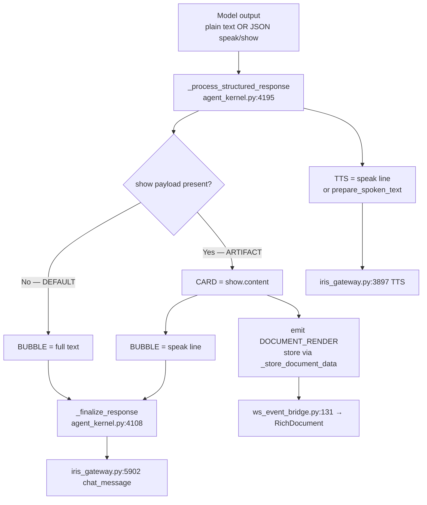
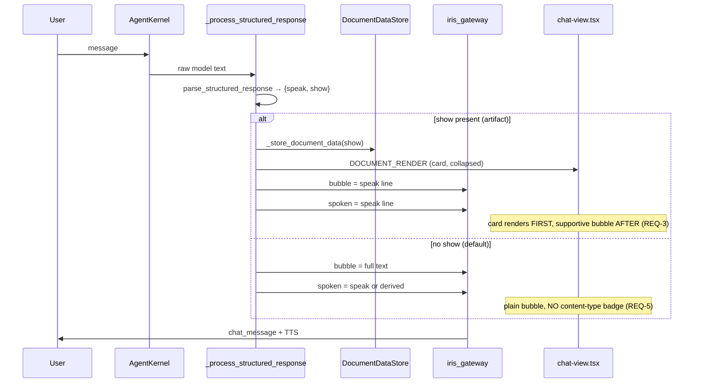
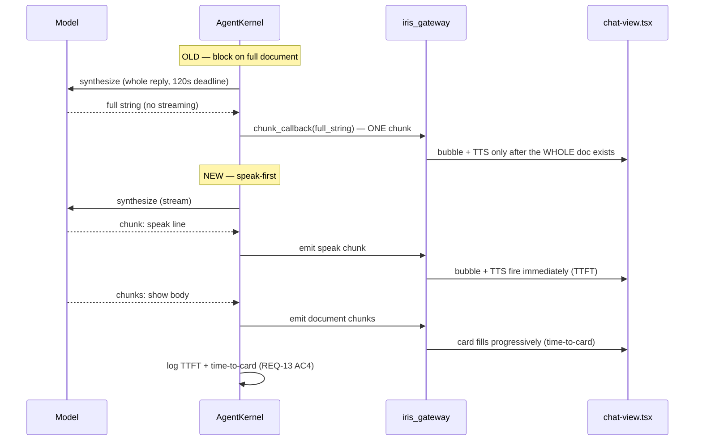

# Design: Reply Surface Contract

## Context

Every reply the agent produces funnels through one seam,
`_process_structured_response` (`agent_kernel.py:4195`). The seam receives
untyped model text, parses an optional `{speak, show}` envelope
(`structured_response.py`), and decides three surfaces: the chat bubble, an
optional prism card, and the TTS line. The decisions are currently made from
length and regex heuristics rather than from the artifact type the model already
declared in `show.format`.

Three forces bound this design:

1. **The model's job must not grow** (owner, session 346). The `{speak, show}`
   contract and `show.format` already exist in the [RESPONSE FORMAT] prompt
   (`agent_kernel.py:2148-2196`). This spec organizes what is emitted; it does
   not ask the model for a richer object.
2. **One seam, many producers.** Both the direct path (`agent_kernel.py:6995`)
   and the DER path (`agent_kernel.py:7602`) call the same seam. A fix at the
   seam covers both — a fact the design leans on.
3. **The prompt already states the intended rule.** `agent_kernel.py:2166-2168`
   says "A document card is not a way to present a reply." The code contradicts
   its own prompt at `agent_kernel.py:4291`. The design aligns code to prompt.

## Architecture Overview

Three independent lanes, one source each:



**Lane table (the contract):**

| Lane | Purpose | Source | When |
|---|---|---|---|
| BUBBLE | The answer, markdown | model plain text | **Default — most turns** |
| CARD | Stored, editable artifact | explicit `show` payload | **Exception — artifacts only** |
| TTS | Conversational narration | `speak` field, else derived | Whenever the agent speaks |

## Sequence / Data Flow



### Progressive reply (REQ-13) — speak-first, card streams after



## Data Models

**Structured envelope** (unchanged — `structured_response.py`):

```
StructuredResponse {
  speak: str | None          # conversational line → bubble + TTS
  show: ShowPayload | None   # presence = artifact signal (REQ-2)
}

ShowPayload {
  format: "markdown"|"html"|"table"|"diagram"|"text"   # the type (already emitted)
  content: str
  document_id: str | None    # present → revise in place (REQ-7)
  alternatives: list[str]
  variants: dict[str, str]   # optional instant format switch
}
```

**Surface decision record** (observability, REQ-9):

```
SurfaceDecision {
  turn_id: str
  lane: "plain" | "card" | "card_plus_summary"
  had_show: bool
  bubble_source: "speak" | "full_text" | "derived_excerpt"
  card_suppressed_reason: str | None   # e.g. "no_show_payload"
}
```

## Key Decisions

| Decision | Rationale | Alternatives rejected |
|---|---|---|
| `show`-presence is the ONLY card trigger | The prompt already defines `show` as "store this"; length is a formatting question (`agent_kernel.py:2141-2147`) | Keep engine gate; keep length heuristic — both fabricate cards |
| Bubble on a card turn = the `speak` line | One voice; the agent authored it; no duplication (REQ-1 AC3) | Excerpt the card body (`_supportive_text`) — duplicates and truncates |
| Fix at the seam, not per-path | Direct and DER already share `_process_structured_response` | Patch each synthesis path — drift returns |
| Card collapsed by default | Owner request; reduces thread noise; detail on demand | Always-expanded — current behavior, owner rejected |
| Two-tier disclosure reusing existing affordances | `CardChassis` already owns a header chevron (`collapsible` prop, currently off) and `RichDocument` already has `Expand` → `DocumentPanel`; wiring them costs no new design language and matches task-card behavior | New document-chip/button component — throws away card identity, new styling surface, no width gain in a chat column |
| Remove the content-type badge, not the type detection | Badge is chrome the owner does not want; detection may still be used elsewhere | Remove `detectContentType` — wider blast radius, unneeded |
| TTS derived independently of the card | Speech quality must not depend on the surface choice (REQ-8) | Derive TTS from the bubble — couples lanes |

## Ripple-Effect Map (MANDATORY)

| Area / File | Change? | Classification | Why / Evidence (file:line) |
|---|---|---|---|
| `agent_kernel.py:4195` `_process_structured_response` | Yes | CHANGE NEEDED | Remove length auto-render; route bubble from `speak` on card turns |
| `agent_kernel.py:4286-4379` auto-render block | Yes | CHANGE NEEDED | Delete fabricated-card path (REQ-2 AC2) |
| `agent_kernel.py:13664` `_engine_gate_surface` | Yes | CHANGE NEEDED | Must not fabricate a card without `show` (REQ-2 AC4); reduce to observability or retire from the card decision |
| `agent_kernel.py:13736` `_supportive_text` | Yes | CHANGE NEEDED | Only used when no `speak` line; must not excerpt when `speak` exists (REQ-3 AC4) |
| `agent_kernel.py:4108` `_finalize_response` | No | NO CHANGE (verified) | Already assigns `_last_spoken_text` independently of the card (REQ-8) |
| `agent_kernel.py:3053` `_respond_direct` | No | NO CHANGE (verified) | Returns text only; the seam applies the contract at :6995 |
| `agent_kernel.py:6995` direct seam call | No | NO CHANGE (verified) | Already routes through `_process_structured_response` |
| `agent_kernel.py:7602` DER seam call | No | NO CHANGE (verified) | Same seam — REQ-4 AC3 satisfied by the shared seam |
| `agent_kernel.py:13231` `_der_synthesize_success_outcome` | No | NO CHANGE (verified) | Produces text; seam owns routing |
| `agent_kernel.py:13148` `_der_synthesize_outcome` | No | NO CHANGE (verified) | Same — text producer only |
| `agent_kernel.py:5085` `_maybe_escalate_web_format` | No | NO CHANGE (verified) | Still fires when no card rendered; must survive REQ-2 |
| `agent_kernel.py:4894` `update_document` | No | NO CHANGE (verified) | Already supports in-place revision (REQ-7 AC1) |
| `agent_kernel.py:5136` `reformat_document` | No | NO CHANGE (verified) | Already re-renders stored variants (REQ-7 AC2) |
| `structured_response.py` parser | No code | CONTRACT LOCK | `{speak, show}` shape pinned by CT-1; back-compat with two-field form |
| `event_bus.py:97` `DOCUMENT_RENDER` | No code | CONTRACT LOCK | Event shape pinned by CT-2 |
| `document_store.py:76` `DocumentDataStore` | No | NO CHANGE (verified) | `store`/`update`/`get_variant` already sufficient (REQ-7) |
| `ws_event_bridge.py:54,131` | No | NO CHANGE (verified) | Already bridges `DOCUMENT_RENDER` to WS |
| `iris_gateway.py:5902` chat_message | No | NO CHANGE (verified) | Consumes `_last_spoken_text`; bubble text unchanged shape |
| `iris_gateway.py:5897-5899` TTS fallback | No | NO CHANGE (verified) | `prepare_spoken_text` fallback retained (REQ-8 AC2) |
| `chat-view.tsx:3738-3739,4003-4004` badge | Yes | CHANGE NEEDED | Remove `ContentTypeIcon` + label (REQ-5) |
| `chat-view.tsx:4190-4206` doc join | Yes | CHANGE NEEDED | Order supportive bubble AFTER card (REQ-3 AC3) |
| `chat-view.tsx:3618-3628` length logic | No code | CONTRACT LOCK | Removed 2026-08-17; CT-3 prevents reintroduction |
| `RichDocument.tsx:52,157-176,181` collapse | Yes | CHANGE NEEDED | Collapsed-by-default; enable chassis chevron (`collapsible` currently `false`) as peek (REQ-6 AC1/AC2); keep `Expand`→panel (REQ-6 AC3) |
| `CardChassis.tsx` `collapsible` prop | Yes | CHANGE NEEDED | Already implements the header chevron + `defaultCollapsed`; wire `RichDocument` to use it instead of the in-body-only expand (REQ-6 AC2/AC6) |
| `DocumentPanel.tsx` full view | No | NO CHANGE (verified) | Already the full-view surface on the same Liquid Ink chassis (`DocumentPanel.tsx:7-10`); opened via `chat-view.tsx:4669-4705` (REQ-6 AC3) |
| `chat-view.tsx:2480` `detectContentType` | No | NO CHANGE (verified) | Type detection retained; only its badge rendering is removed |
| `agent_kernel.py:4505-4523` `DOCUMENT_RENDER` emit | Yes | CHANGE NEEDED | Add stable `card_id` to payload (REQ-10 AC2) |
| `agent_kernel.py:4463` `document_id` mint | Yes | CHANGE NEEDED | Mint a `card_id` alongside `document_id` (REQ-10 AC1); keep `document_id` as store key (AC3) |
| `agent_kernel.py:10042` `_card_envelope` | Yes | CHANGE NEEDED | Extend to resolve prism-card `card_id` (currently task-only via `_card_by_task`) (REQ-10) |
| `agent_kernel.py:4632` `_store_document_data` | No | NO CHANGE (verified) | `document_id` stays the store key; `card_id` rides the event, not the store (REQ-10 AC3) |
| `event_bus.py:97` `DOCUMENT_RENDER` shape | Yes | CONTRACT LOCK | CT-2 must pin the added `card_id` field; additive so old clients ignore it (REQ-10 AC5) |
| `ask_user_tool.py:161` `QUESTION_ASK` payload | No | NO CHANGE (verified) | Already carries `turn_id`; REQ-11 AC2 needs no backend change |
| `chat-view.tsx:4514-4538` question block | Yes | CHANGE NEEDED | Render question cards in turn order, not a bottom-pinned block (REQ-11 AC1/AC3) |
| `chat-view.tsx:4524-4535` `onAnswer` | Yes | CHANGE NEEDED | Add optimistic removal (REQ-12 AC1), mirroring `removePendingPermission` (`:4494,4501,4508`) |
| `chat-view.tsx:1639-1660` question resolved handler | Yes | CHANGE NEEDED | Make removal idempotent + reconcile on reload (REQ-12 AC2/AC5) |
| `QuestionCard.tsx:84,95` countdown | Yes | CHANGE NEEDED | Self-dismiss at zero instead of only stopping the timer (REQ-12 AC4) |
| `iris_gateway.py:6296-6304` late-answer guard | No | NO CHANGE (verified) | Already ignores a late answer (`resolve_answer` returns None) (REQ-12 edge case) |
| `agent_kernel.py:4290` `_engine_gate_surface` call | Yes | CHANGE NEEDED | Remove from the blocking reply path (REQ-15 AC1); resolve async/post-emit (AC2) |
| `agent_kernel.py:13664` `_engine_gate_surface` | Yes | CHANGE NEEDED | Demote the `presentation` consumer to an async observer; live render authority → `tool_choice` (REQ-15 AC3/AC4) — PRESERVED, not deleted |
| `decision_engine.py:91` `IRIS_DECISION_ENFORCE` | No | CONTRACT LOCK | Default stays `tool_choice`; `presentation` runs as observer (CT-10 pins the consumer set `{tool_choice, presentation, narration}`) |
| `decision_engine.py:456` `decide` | No | NO CHANGE (verified) | Still used by `tool_choice` + `narration` + the observer; unchanged primitive |
| `decision_engine.py:480` `_load` inside lock | No | NO CHANGE (verified) | Load cost leaves the reply path because REQ-15 resolves the observer off-path |
| `agent_kernel.py:17700` `_synthesize_response` | Yes | CHANGE NEEDED | Stream `speak` first, then document body (REQ-13 AC1/AC2); add TTFT/card timing (AC4) |
| `agent_kernel.py:7592-7595` DER single-chunk emit | Yes | CHANGE NEEDED | Emit `speak` chunk before the document body instead of one full-string chunk (REQ-13) |
| `inference/router.py:895` `chunk_callback` | No | NO CHANGE (verified) | Already supports streaming; synthesis call sites simply pass none today |
| `event_bus.py:97` `DOCUMENT_RENDER` partial field | Yes | CHANGE NEEDED | Payload carries no `partial`/`chunk`/`streaming` discriminator today; ADD one so a partial card emit is not rendered as a final revision (REQ-13 AC5). Additive → old clients ignore it |
| `document_store.py:119,177` `store`/`update` | No | NO CHANGE (verified) | Whole-document upsert is sufficient; the streaming card is emitted on the event bus, not persisted per-delta. `document_id` is stable before the body exists (`agent_kernel.py:4463`) so in-place update works |
| `RichDocument.tsx:15-31` props | Yes | CHANGE NEEDED | No `partial`/`streaming` prop exists; ADD one so a streaming card renders progressively without an "Updated" badge (REQ-13 AC2/AC5) |
| `chat-view.tsx:1289-1338` `handleDocumentRender` | Yes | CHANGE NEEDED | Already updates in place by `document_id` (`:1327-1337`) but treats every emit as final; branch on the new `partial` flag to suppress the "Updated" badge (`:1309`) during streaming (REQ-13 AC5) |
| `iris_gateway.py:5755-5756` text-path `chat_chunk` | Yes | CHANGE NEEDED | Add `turn_id` to the payload (voice path already has it at `:3336-3337`); without it the frontend drops the chunk (`chat-view.tsx:1241-1242`) (REQ-13 AC6) |
| `api/chat.py:185-201` REST path | No | NO CHANGE (verified) | No `chunk_callback`; REST gets the final reply only. Progressive reply over REST is OUT OF SCOPE (REQ-13 Non-Requirements) |
| `agent_kernel.py:2170-2179` `[RESPONSE FORMAT]` prompt | Yes | CHANGE NEEDED | Strengthen `show` emission reliability (Decision 17) (REQ-14 AC1) |
| `tool_registry.py:940,976` `get_rendered_documents`/`combine_documents` | No | NO CHANGE (verified) | Read/combine side unaffected; `render_document` is additive (REQ-16, ADOPTED) |
| `agent_kernel.py:4129` `_is_empty_websearch_synthesis` | No | NO CHANGE (verified) | Retained as the empty-artifact guard (REQ-16 edge case) |
| `observability.py` `TurnMetrics` (`:136,137`) | Yes | CHANGE NEEDED | Add TTFT + time-to-card fields (REQ-13 AC4); add observer-vs-live disagreement counter (REQ-15 AC4) |
| `document_store.py:404-408` `list_for_conversation(metadata_only=True)` | No | NO CHANGE (verified) | Hydration stays metadata-only; body is fetched lazily by REQ-17, not shipped with history (CT-DOC-1) |
| `document_store.py:364` `get` | No | NO CHANGE (verified) | Already returns full stored row incl. `content`/`variants`; REQ-17 body read reuses it |
| `iris_gateway.py` single-doc body handler | Yes | CHANGE NEEDED | NEW message/route: fetch one `document_id`'s body scoped to conversation (REQ-17 AC1/AC2) |
| `lib/documentMerge.ts:36-52` | No | NO CHANGE (verified) | Preserves prior in-memory `content` on merge; REQ-17 only adds the missing fresh-load fetch, not a merge change |
| `DocumentPanel.tsx:32` | Yes | CHANGE NEEDED | Add loading / unavailable / retry states for the lazy body fetch (REQ-17 AC3, edge cases) |
| `chat-view.tsx` expand → panel | Yes | CHANGE NEEDED | Issue the body fetch on expand when `content` is absent; do not re-emit `DOCUMENT_RENDER` (REQ-17 AC3) |
| `specs/document-rehydration` "body fetched on expand" | No code | CONTRACT LOCK | Cross-spec: rehydration assumes this fetch; REQ-17 + CT-13 make the assumption real |
| `specs/tool-decision-engine` REQ-11 | No code | CONTRACT LOCK | Cross-spec: demoting (not deleting) `presentation` must not break its contract (CT-10) |

## Error Handling

- **IF** the card emit raises **THEN** the full `show.content` returns to the
  bubble and the turn still completes (preserve `agent_kernel.py:4556-4559`).
- **IF** `show.document_id` is absent from the store **THEN** create a new
  document and log the miss (REQ-7 edge case).
- **IF** `speak` is empty on a card turn **THEN** the bubble falls back to the
  deterministic excerpt; the card still carries full content (REQ-1 edge case).
- **IF** the presentation engine is unavailable **THEN** no card is fabricated and
  the reply is plain text (REQ-2 AC4).
- **IF** instrumentation raises **THEN** the reply is unaffected (REQ-9 AC3).
- **IF** a `card_id` is unknown or absent **THEN** treat it as "no card_id" and
  fall back to `document_id` — never raise (REQ-10 AC5).
- **IF** a question's backend `question:answered` broadcast is lost **THEN** the
  card is already gone via optimistic removal (REQ-12 AC1).
- **IF** a question's countdown expires **THEN** the card self-dismisses without a
  broadcast (REQ-12 AC4).

## Testing Strategy

Organized per the project standard (bugs live in seams, not modules):

```
tests/unit/         pure logic only
tests/contract/     boundary pins (shapes caught before behavior)
tests/behavioral/   full-loop drives (emergent properties)
scripts/validate_der_*.py   STANDING CDD HARNESS — replays recorded trajectories
                            through the FULL stack every run
```

**Contract tests (pin interfaces):**

- CT-1: `{speak, show}` parse shape + two-field back-compat —
  `backend/tests/contract/test_structured_response.py` (exists, baseline 35
  passed).
- CT-2: `DOCUMENT_RENDER` event shape —
  `backend/tests/contract/test_document_render_contract.py` (exists).
- CT-3: no length-triggered card; plain reply never emits `DOCUMENT_RENDER` —
  `backend/tests/contract/test_display_text_never_truncated.py` (exists; extend).
- CT-4: bubble on a card turn equals the `speak` line, never the card body.
- CT-5: no `ContentTypeIcon` badge in the plain-text bubble branch
  (frontend, `chat-view.tsx`).
- CT-6: card renders collapsed with an expand affordance
  (frontend, `RichDocument.tsx`).
- CT-7: `DOCUMENT_RENDER` payload includes a stable `card_id` alongside
  `document_id`, and the same `card_id` survives update/reformat
  (REQ-10; extends CT-2).
- CT-8: question card renders anchored to its `turn_id`, not the bottom block
  (REQ-11).
- CT-9: answering a question removes its card without waiting for a backend
  broadcast; a lost broadcast does not resurrect it (REQ-12 AC1/AC2).
- CT-10: the decision-engine consumer set is `{tool_choice, presentation (async
  observer), narration}` — no blocking `presentation` call on the reply path; the
  consumer is PRESERVED as an observer (REQ-15; cross-spec lock with
  `specs/tool-decision-engine`).
- CT-11: `speak` is emitted before the document body — the first streamed chunk
  contains the spoken line, not the document (REQ-13 AC1).
- CT-12: same reply → same surface across repeated runs (determinism)
  (REQ-14 AC4).

**Behavioral tests (drive the full loop):**

- BT-1: a 1500-char conversational answer renders a plain bubble and NO card
  (the direct regression for the owner's complaint).
- BT-2: a `show` markdown artifact renders a collapsed card; the supportive
  bubble appears AFTER it and does not duplicate the body.
- BT-3: TTS speaks the `speak` line on both plain and card turns.
- BT-4: agent edit via `document_id` revises the same card; user format pill
  re-renders it (REQ-7).
- BT-5: empty-result websearch renders plain text, no card.
- BT-6: a prism card keeps one `card_id` across an agent edit and a user format
  switch (REQ-10 AC4).
- BT-7: ask → answer → next turn — the question card is gone before the next
  reply arrives; a superseded question does not linger (REQ-12 AC3).
- BT-8: TTFT — the bubble/TTS appear before the full document body completes; the
  card streams after (REQ-13). Assert `ttft_ms < time_to_card_ms`.
- BT-9: no blocking engine call — a reply completes with the decision engine
  stopped/unavailable, with no added latency (REQ-15).
- BT-10: determinism — the same reply driven twice yields the same surface, and a
  genuine artifact is never lost when the model omits `show` (REQ-14 AC3/AC4).
- BT-11: frontend card turn — renders collapsed, expands in place, supportive
  line after the card (REQ-3/REQ-5/REQ-6; tasks.md T17, renumbered from a
  collided BT-4 label).
- BT-12: hydration — after reload, expand fetches the body once by `document_id`,
  no duplicate card (REQ-17; tasks.md T29, renumbered from a collided BT-9
  label).

**Intertwined:** each behavioral gap decomposes into the contract test that would
have caught it (e.g. BT-1 → CT-3).

**Physics-aware:** where a turn carries a Caducean trajectory, assert the surface
outcome is unchanged by zone (no zone-based card fabrication after REQ-2).

**CDD harness:** `scripts/validate_der_*.py` replays a recorded websearch
trajectory and asserts: card present only with `show`, bubble = `speak`, card
collapsed by default, no content-type badge.

## Migration / Compatibility

- No model-prompt change (owner constraint). `show.format` is already emitted.
- The two-field `{speak, show}` envelope stays backward compatible.
- Existing stored documents rehydrate unchanged; collapse is a render-time
  concern only.
- `_engine_gate_surface` retirement is internal; no external contract depends on
  its `"card"` verdict once REQ-2 lands.
