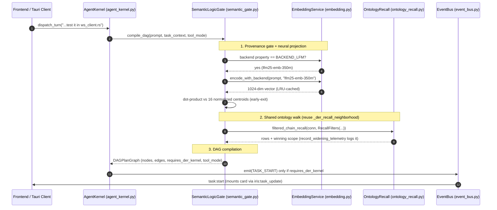

# Design: Semantic Logic Gate Architecture (DAG-Routed & Ontology-Grounded)

## Context
IRIS is an agentic voice-controlled desktop assistant whose execution is a **Directed Acyclic Graph (DAG)** of capabilities, not a linear pipeline. A single utterance can require checking memory preferences, reading code, running tests, searching the web, and synthesizing an answer.

IRIS already contains:
- a formal **Cognitive Ontology** (`specs/der-dag-inversion/ontology.md`, `backend/agent/ontology_recall.py`) with registry-backed axes and a CI-pinned schema (`scripts/validate_ontology_schema.py`),
- a **kernel ontology-recall path** (`AgentKernel._der_recall_neighborhood`, `agent_kernel.py:4241`),
- a provenance-aware **embedding service** (`backend/memory/embedding.py`, `lfm25-emb-350m`, 1024-dim, LRU-cached, lazy/bounded/latched load),
- a per-turn **telemetry** line (`TurnMetrics` → `[LAYERS]`, `backend/utils/observability.py`).

The gate compiles requests into multi-lane DAG plans by **reusing** all of the above. It never re-opens a DB connection, re-walks the ontology, or re-implements telemetry.

---

## Architecture Overview

```mermaid
flowchart TD
    Prompt["User Prompt (Audio / Text)"] --> Gate["SemanticLogicGate (backend/agent/semantic_gate.py)"]

    subgraph GatePipeline ["Classification & DAG Compilation (budget <= 20ms warm)"]
        T0["Tier 0: Deterministic Command Fast-Path (< 1ms)<br/>migrated from _is_chitchat / _ACTION_VERBS / _is_followup_to_task"]
        G{"EmbeddingService.backend<br/>== BACKEND_LFM (neural)?"}
        T1["Tier 1: LFM2.5 Neural Centroid Projector (~10-15ms)<br/>normalized centroids, early-exit top-2 margin"]
        T2["Tier 2: Ontology Neighborhood + Context Filter (~2ms)<br/>shared RecallFilters helper + filtered_chain_recall"]

        T0 -->|Unresolved| G
        G -->|yes| T1
        G -->|no (hash fallback)| T2
        T1 --> T2
    end

    Gate --> GatePipeline
    GatePipeline --> DAGPlan["Compiled Execution DAG (DAGPlanGraph)"]

    subgraph DAGNodes ["16 Composable Capability Lanes"]
        node_ont["ONTOLOGY_MEMORY_QA (4 lanes)"]
        node_inspect["TASK_EXECUTION_DAG (4 lanes)"]
        node_crawl["RESEARCH_SWARM_DAG (3 lanes)"]
        node_voice["VOICE_DESKTOP_ACTION (2 lanes)"]
        node_chat["CONVERSATIONAL_SURFACE (3 lanes)"]
    end

    DAGPlan --> DAGNodes
    node_ont -.->|derives_from| node_inspect
    node_inspect -->|depends_on| node_crawl

    DAGPlan -->|requires_der_kernel| EventBus["EventBus (TASK_START, TASK_PROGRESS)"]
    EventBus --> UI["GUI & CLI Task Progress Surface"]
    DAGPlan -->|pure conversation| Direct["AgentKernel._respond_direct (no task card)"]
```

The `G` provenance gate is the key correctness fix over the original design: if the embedding backend has fallen back to `hash`, Tier 1 is skipped because hash-vector cosine carries no semantic signal.

---

## Sequence: Ontology-Grounded & DAG-Compiled Flow



---

## Data Models

```python
from enum import Enum
from dataclasses import dataclass, field
from typing import Dict, Optional, List

class IntentDomain(str, Enum):
    CONVERSATIONAL_SURFACE = "conversational_surface"
    ONTOLOGY_MEMORY_QA     = "ontology_memory_qa"
    VOICE_DESKTOP_ACTION   = "voice_desktop_action"
    TASK_EXECUTION_DAG     = "task_execution_dag"
    RESEARCH_SWARM_DAG     = "research_swarm_dag"

class CapabilityLane(str, Enum):
    # Conversational Surface (3)
    CHITCHAT_BANTER        = "lane:chitchat_banter"
    CLARIFICATION_PROBE    = "lane:clarification_probe"
    EXPLANATION_SYNTHESIS  = "lane:explanation_synthesis"
    # Ontology Memory QA (4)
    PREFERENCE_LOOKUP      = "lane:preference_lookup"
    SKILL_LANDMARK_QUERY   = "lane:skill_landmark_query"
    EPISODIC_TRAJECTORY_WALK = "lane:episodic_trajectory_walk"
    DOMAIN_CONCEPT_RETRIEVAL = "lane:domain_concept_retrieval"
    # Voice Desktop Action (2)
    IMMEDIATE_OS_CONTROL   = "lane:immediate_os_control"
    SYSTEM_STATE_QUERY     = "lane:system_state_query"
    # Task Execution DAG (4)
    CODE_INSPECTION        = "lane:code_inspection"
    MUTATION_PATCH         = "lane:mutation_patch"
    TEST_VALIDATION        = "lane:test_validation"
    SHELL_COMMAND          = "lane:shell_command"
    # Research Swarm DAG (3)
    WEB_CRAWLER_QUERY      = "lane:web_crawler_query"
    SOURCE_TRIANGULATION   = "lane:source_triangulation"
    DEEP_SYNTHESIS         = "lane:deep_synthesis"
    # == 16 lanes total (3+4+2+4+3) ==

class EdgeRelationship(str, Enum):
    DEPENDS_ON   = "depends_on"
    DERIVES_FROM = "derives_from"
    RELEVANT_TO  = "relevant_to"
    SUPPLEMENTS  = "supplements"
    HANDOFF_TO   = "handoff_to"

@dataclass
class DAGPlanNode:
    node_id: str
    domain: IntentDomain
    lane: CapabilityLane
    description: str
    # Registry-backed axes (from DOMAIN_IDS / {voice,der,research}); never free text.
    topic_domain: Optional[str] = None        # one of 13 DOMAIN_IDS keys
    execution_domain: Optional[str] = None    # voice | der | research
    ontology_scope_resolved: Optional[str] = None  # SCOPE_* winning label
    confidence: float = 0.0

@dataclass
class DAGPlanGraph:
    nodes: List[DAGPlanNode]
    edges: List[Dict[str, str]]  # {source, target, relationship}
    is_pure_conversation: bool = False
    requires_der_kernel: bool = True
    latency_ms: float = 0.0
    # Provenance of the routing decision (REQ-3 AC3):
    neural_projection_used: bool = False
    # Human-readable reason for the routing decision (REQ-8 AC1) — feeds the
    # planning-policy hook's contributors and the [LAYERS] telemetry line.
    why: str = ""
```

> **`DAGPlanGraph` is the gate's *output*, not a persisted object.** It is the
> compiled routing result handed to planning. The *durable* execution graph
> already lives in `ExecutionLedger`/`TaskLifecycle` (`der_execution_ledger.py`),
> the live `DirectorQueue` (`der_loop.py`), `NodeRecord.parent_step_id`, and the
> link store — the gate reads those (REQ-4 AC1), it does not duplicate them.

> **Telemetry is NOT a dataclass here.** Gate metrics are fields on the existing
> `TurnMetrics` (`observability.py:95`) emitted via `[LAYERS]`. The original
> `SemanticGateTelemetry` dataclass was removed as redundant.

---

## Key Decisions

1. **Reuse the kernel's ontology recall, don't fork it.** `AgentKernel._der_recall_neighborhood` (`agent_kernel.py:4241`) already builds `RecallFilters` and calls `filtered_chain_recall` + `record_widening_telemetry`. The gate shares one extracted helper (REQ-6 AC3) instead of a second walk. Rationale: two recall paths = two drift points against the CI-pinned schema.

2. **Registry-backed ontology axes, imported not hardcoded.** `topic_domain` is the 13-value `DOMAIN_IDS` registry (`spaces.py:89`), `execution_domain` is `{voice,der,research}`, `node_type` is `{task,step,sub_loop}`. The original spec's `(system|code|desktop|user|general)` and 5-node-type list were fabricated and corrected against `ontology.md` §1–§2.

3. **Provenance-gated neural projection.** Tier 1 runs only when `EmbeddingService.backend == BACKEND_LFM`. If the service degraded to `hash`, cosine over hash vectors is noise, so the gate falls through to Tier 0/Tier 2. `compare_embeddings` (`embedding.py:262`) already refuses cross-backend comparison — the gate respects that contract rather than bypassing it with `_cosine`.

4. **Lazy centroids as data, warm-up at startup.** Centroids are computed on first gate use (never at import — the embedding service deliberately does not load at construction, `embedding.py:380`) and cached as a versioned JSON artifact with `backend` provenance. The model is pre-warmed in a background task at startup so the first turn runs warm.

5. **Extend `TurnMetrics`, don't invent `SemanticGateTelemetry`.** The `[LAYERS]` line is already asserted by `test_latency_metrics.py`; gate fields ride on it.

---

## Performance & Optimization

| Optimization | Mechanism | Why it matters |
|---|---|---|
| Tier 0 short-circuit | Migrate `_is_chitchat` / `_ACTION_VERBS` / `_is_followup_to_task` (`agent_kernel.py:1792-1883`) verbatim; resolve before any embedding | Most traffic resolves at <1 ms, 0 model work |
| Normalized centroids | L2-normalize the 16 centroids once; per-lane comparison is an $O(d)$ dot product | Removes 16 per-turn `sqrt`/norm operations |
| Early-exit top-2 margin | Sort lanes by prior-frequency; stop when top score beats second by $\Delta_{\text{margin}}$ (0.15) | Skips the tail of a 16-way comparison |
| Embedding LRU reuse | Prompt embedding goes through `EmbeddingService.encode_with_backend` (256-entry LRU) | Repeated phrasings hit the cache |
| Shared recall helper | One `RecallFilters`-building helper for gate + DER (extract from `_der_recall_neighborhood`) | Single recall code path, one schema surface |
| Reuse connection handle | Recall uses the kernel's existing `mycelium` connection (`_conn`/`conn`), no re-open | Avoids per-turn SQLite connection churn |
| Warm-up | Background, bounded, latched LFM pre-load at startup (`IRIS_EMBEDDING_LOAD_TIMEOUT_S`) | First user turn avoids the model-load stall |
| Off-hot-path telemetry | `record_widening_telemetry` + `[LAYERS]` emit are fire-and-forget | Zero added latency to the response |

### Latency budget (reconciled)
| Tier | Budget |
|---|---|
| Tier 0 deterministic | < 1 ms |
| Tier 1 neural projection (warm) | ≈ 10–15 ms |
| Tier 2 ontology + context filter | ≈ 2 ms |
| **Total target** | **≤ 20 ms** |
| Performance warning threshold | > 35 ms |

Cold first-call cost is the LFM load, bounded by `IRIS_EMBEDDING_LOAD_TIMEOUT_S` and absorbed by the warm-up (REQ-6 AC2) — it is not part of the steady-state budget.

---

## Ripple-Effect Map (MANDATORY)

| Area / File | Change? | Classification | Why / Evidence |
|---|---|---|---|
| `backend/agent/semantic_gate.py` | Yes | **NEW MODULE** | DAG gate, lane enums, centroid projector, shared recall helper client. |
| `backend/agent/agent_kernel.py` | Yes | **CHANGE NEEDED** | Replace `_classify_intent` (`1885-1927`) + `_needs_planning` (`1928-1955`) with `SemanticLogicGate.compile_dag()`. Preserve `_tool_mode` (`275`). Extract `_der_recall_neighborhood` (`4241`) into shared helper. |
| `backend/agent/agent_kernel.py` — web-mode DER gate | Yes | **CHANGE NEEDED (coordinate, don't duplicate)** | `_should_skip_der` (`4602`) + `_is_web_search_request` (`4540`) + `_looks_informational` (`4571`) + `get_global_internet_access` already gate "question vs DER" against the web toggle. The gate's `lane:web_crawler_query` and the `question → direct` decision MUST compose with `_should_skip_der` (T36 landmark) rather than replace it blindly. |
| `backend/agent/explorer.py` | Yes | **DEDUPE** | `propose()` mirrors `_is_web_search_request` (`explorer.py:48,73`) — a second copy of the web-intent heuristic. The gate centralizes it; `explorer.py` imports the shared predicate. |
| `backend/tests/unit/test_universal_planning.py` + `backend/tests/behavioral/test_universal_planning.py` | Yes | **CONTRACT LOCK / MIGRATE** | Pin the current routing outcomes: chit-chat→direct, action→DER, question→direct, followup→DER, `ask_first` prefix-only (`test_universal_planning.py:33,47,61,73,79-88`). Gate must reproduce these exactly OR the tests migrate to `compile_dag().requires_der_kernel`. |
| `_needs_planning` mock sites | Yes | **CONTRACT LOCK** | `test_recall_fixes.py:457`, `test_voice_command_start_contract.py:157`, `test_per_thread_context_behavior.py:95,108`, `test_context_usage_on_direct_reply.py:59`, `test_chunk_callback_nonstreaming.py:7` mock `kernel._needs_planning`. A compatibility shim (`_needs_planning(text, context) -> bool` delegating to the gate) avoids breaking them. |
| `backend/utils/observability.py` — `[LAYERS]` contract | Yes | **EXTEND (additive only)** | `TurnMetrics.to_log_line` is asserted by `test_der_t18_governance_contract.py` and `test_der_t11_step_count_contract.py` (existing fields must survive). Gate fields are appended, never reordered/removed. |
| `backend/agent/ontology_recall.py` | No code | **REUSE (verified)** | `filtered_chain_recall` (`128`), `recall_failed_like` (`280`), `record_widening_telemetry` (`304`), `RecallFilters` (`62`), `SCOPE_*` (`43-46`). |
| `backend/memory/embedding.py` | No code | **REUSE (verified)** | `encode_with_backend` (`742`), `backend` property (`658`), `compare_embeddings` (`262`), `_window_for` (`400`), LRU cache (`366`), lazy/bounded/latched load (`410-466`). |
| `backend/memory/mycelium/spaces.py` | No code | **IMPORT (verified)** | `DOMAIN_IDS` 13-value registry (`89`). |
| `backend/memory/mycelium/extractor.py` | No code | **REUSE (verified)** | `resolve_topic_domain` (`496`) — single write-time resolver. |
| `backend/memory/pin_store.py` | No code | **IMPORT (verified)** | `LINK_VOCABULARY` 10 predicates (`61`). |
| `backend/memory/semantic.py` | No code | **REUSE (verified)** | `user_preferences`/`cognitive_model`/`tool_proficiency`/`domain_knowledge` categories (via `interface.py:439-482`). |
| `backend/utils/observability.py` | Yes | **EXTEND** | Add gate fields to `TurnMetrics` (`95`) and `[LAYERS]` line (`154`); reuse `get_turn_id` (`189`), `loud_error`/`safe_call` (`38-88`). |
| `backend/agent/mode_detector.py` | No code | **CONSUME** | `AgentMode` + `ModeResult.needs_clarification` seed `clarification_probe` + `execution_domain`. |
| `hooks/useTaskProgress.ts` | No code | **CONTRACT LOCK** | Mounts task card on `task:start` (`case "task:start"`, line 220), reconciles the double-emit (`234-276`). The gate's zero-`TASK_START` guarantee for chit-chat is what keeps the card from mounting for banter. |
| `scripts/validate_ontology_schema.py` | No code | **CI PIN** | Fails on schema drift; the gate imports constants to stay in sync. |
| `backend/agent/der_execution_ledger.py` | No code | **REUSE (verified)** | `ExecutionLedger` → `TaskLifecycle` (`177,209`) with `required/completed/pending_step_ids`, `next_action`, `lifecycle` — the resumable graph the gate reads for REQ-4 follow-up (wired at `agent_kernel.py:6871-6884`). |
| `backend/agent/der_loop.py` | No code | **REUSE (verified)** | `DirectorQueue` (`243`), `QueueItem.depends_on` (`210`), `NodeRecord` (`70`, with `parent_step_id`/`folded_back`/`blocker`) — the live graph + edges the gate lenses over. |
| `backend/agent/der_links.py` | No code | **REUSE (verified)** | Durable link writer (`part_of`/`depends_on`/`derives_from`/`failed_like`) — the persisted edges REQ-4 AC3 mutates via existing machinery. |
| `backend/agent/conversation_context_store.py` | No code | **REUSE (verified)** | `PausedDERState` (`56`) + `ConversationContext` (`76`) — cross-turn persistence of a paused DER loop; the gate's "active DAG" spans turns through this store. |
| `backend/gateway/iris_ffi.py` | No code | **REUSE (verified)** | `ffi_immortus_chain_append` (`1585`; Python engine first — the C++ 8-arg struct cannot carry ontology/mediator columns, `1310-1390`), `ffi_immortus_chain_query_by_coordinate` (`1639`; C++-native coordinate recall), `ffi_caducean_get_state` (`1555`) — the REQ-7 read/write surface. |
| `backend/agent/caducean_trajectory.py` | No code | **REUSE (verified)** | Trajectory recorder + `caducean_trajectories` table — the physics state REQ-7 pairs with the coordinate recall. |

---

## Error Handling

| Failure Mode | EARS Detection | Safe Fallback Response |
|---|---|---|
| LFM load/inference failure | `IF backend load raises or times out` | `THEN EmbeddingService degrades to hash; gate detects backend != LFM and skips Tier 1` |
| Hash fallback active | `IF EmbeddingService.backend == BACKEND_HASH` | `THEN skip Tier 1; use Tier 0 + Tier 2 only; log once per process` |
| Empty / malformed input | `IF input text is empty or non-string` | `THEN return CONVERSATIONAL_SURFACE(lane:chitchat_banter) in <1ms` |
| Zero-hit ontology walk | `IF filtered_chain_recall returns 0 at SCOPE_ALL_FILTERS` | `THEN widen per SCOPE_* order; record_widening_telemetry logs winner; no exception` |
| Cross-backend comparison | `IF compare_embeddings raises CrossSpaceComparisonError` | `THEN log and skip the offending lane (never force a number)` |
| DAG compilation timeout | `IF gate classification > 35ms` | `THEN emit performance warning and proceed with single-node fallback` |

---

## Testing Strategy

```
backend/tests/unit/
  └── test_semantic_gate.py              Pure logic: 16 lanes, centroid math, early-exit margin, provenance gate
backend/tests/contract/
  └── test_contract_semantic_gate.py     CT-GATE-1: DAGPlanGraph schema, zero-TASK_START on chitchat, TurnMetrics fields
backend/tests/behavioral/
  └── test_behavioral_intent_routing.py  50+ multi-lane DAG trajectories through gate -> kernel
```

- **Contract (`CT-GATE-1`)**: pure conversation emits zero `TASK_START`; composite DAG prompts emit `TASK_START` with typed node dependencies; `_tool_mode` (`auto|ask_first|disabled`) is honored; gate fields appear on the `[LAYERS]` line.
- **Behavioral**: a 50-utterance benchmark across ontology lookups, coding, research, and banter, asserting >98% classification accuracy and no phantom task card.
- **Provenance test**: asserts `DOMAIN_IDS`, `LINK_VOCABULARY`, and node types are imported from source (fail on hardcoded copies); asserts centroid artifact carries `backend` provenance and 1024-dim normalized vectors.
